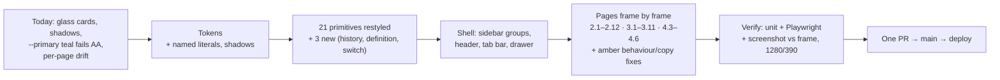

## Optra app UI alignment — 1:1 implementation of `design_handoff_app_alignment`

Every signed-in screen still wears the old "glass" look (blurred translucent cards, shadows, gradients, the light teal that fails contrast on white). The approved handoff redraws all of them in the shipped landing page's language: thin hairline borders, Outfit / DM Sans / JetBrains Mono, one dark-teal action per view and four status colours that always mean the same thing. Think of it as re-upholstering every room of a house to match the front hall: the walls (routes, data, permissions) stay put, while the fabric, trim and signage change, plus ~20 small approved behaviour/copy fixes the designer marked in amber.

### Flowchart (high-level)



### Task metadata

- Classification: `ENHANCEMENT` · `Standard` · Workspaces / Procurement / Vendor Catalog / Settings frontends + `packages/ui` · risk register: no UI row; touches "Paginating A List That Also Feeds A Picker" (PO picker stays unpaginated), "Overlay Accessibility" (unchanged, not widened), "Test-Layer Requirement".
- Contract areas: API — No contract impact (no endpoint added/changed; two existing list GETs reused on Discrepancies, one existing unread-count GET reused on Overview). Database — No contract impact. Permissions — No contract impact (every `canManage` / owner-only / not-self gate kept). External integrations — none. Jobs — none.
- Docs loaded: `planning.md, plan-template.md`
- Claims reversed while investigating: (1) "landing components can be reused for the app top bar" — false, `LandingNav` hard-codes anchors/CTA; only `BrandMark` + token classes reused. (2) "`--destructive` is the design red" — false, code is `0.615 0.209 27`, design `0.6 0.18 27` → new `--destructive-tone`. (3) "Workspace pages share a layout" — false, no `app/workspaces/[id]/layout.tsx`; AppShell wiring is repeated per page. (4) "Part 2 scratchpad writes allowed in plan mode" — false; parts live in agent plan files.
- Detected running model: Opus 5.5 (`claude-opus-5-5`).
- Recommended model: `opus`, high reasoning; confidence high. Fallback: `sonnet`, high reasoning (literal blocks are mechanical; visual QA judgement benefits from opus).
- Minimum capability: a model that can apply ~70 literal file blocks faithfully and compare screenshots against HTML frames element by element.
- Branch: `feat/no-ticket-app-alignment`, from `origin/main` (`fd21b75` at plan time).
- Release path: one PR into `main`, "Create a merge commit" (owner choice 2026-10-02: one PR so production never shows a half-old/half-new app).
- Required skills: `/qa`, `/review`, `/design-review`; Brave via `claude-in-chrome` (deviceId `4075da5e-5c8f-4a6f-9b9e-d6f23e896cea`) for screenshots, per the owner's global browser rule.
- Execution preflight: `git fetch origin`; `scripts/new-task-worktree.sh feat app-alignment`; in the worktree `nvm use`, `bun install --frozen-lockfile`, copy root `.env` from the primary checkout; reuse the primary checkout's compose stack.
- Plan-format note: owner chose full literal blocks. The literal blocks are Parts 1–4 appended at the end of this file, authored by four parallel agents against the locked contract below and patched to C-3. Each Part lists its blast radius, RED specs, IMPL blocks, E2E, behaviour-preserved evidence and frame-to-code checklist.

### Layer 1 — human summary

**What changes.** (1) `globals.css`: 17 new named colour tokens + 7 shadow tokens (each a literal from the handoff), body gradients removed, headings 600 / −0.035em. (2) 21 `@repo/ui` primitives restyled to Storyboard 01 with every old prop and variant name still working, plus `HistoryRow`, `DefinitionRow`/`MetricTile`, `Switch`, `SegmentedControl`, `StatStrip`, `PanelHeader`, `Eyebrow`, `MicroLabel`, `SkeletonRows`. (3) Shell: sidebar regrouped Matching / Workspace with active dot + unread pill, "Switch workspace" brand link, breadcrumb header, 64px rail, landing-surface tab bar, 300px drawer. (4) 14 routes + review modal rebuilt frame by frame. (5) New `formatDate`/`formatDateTime` (ISO, local time) used across authenticated pages.

**Approved behaviour/copy changes (amber + owner answers).** Pair chip `PO ↔ invoice` with × on Discrepancies; line-scope chip on Catalog matches; status Selects → segmented controls; outcome Select → 4 radio cards; "(required)" note; member Close + "Read-only" in review; flag-type pill in review header; tab counts; member chip "Owners & admins run comparisons" (members lose the inert pickers); "N new since your last visit"; vendor section headers + breadcrumb back; members "you" tag + new invite copy; digest On/Off → switch; settings member helper; 404 "Open workspace" → `/workspaces`; new error/invite/workspaces/loading copy; ISO dates; scrape placeholders show true API defaults 3 / 500.

**Why one PR.** `main` auto-deploys; merging primitives alone would ship a mixed app.

**Risk Matrix**

| Risk | Likelihood | Impact | Mitigation | Rollback |
|---|---|---|---|---|
| Out-of-scope pages that import restyled primitives look different (auth `login`/`register`/`verify-otp`: `Button`, `Card`, `Input`, `PageShell`, `StatusBanner`; global `ToastProvider`) | High (by design) | Low — visual only, no logic | Screenshot `/login`, `/register`, `/verify-otp` in QA; `login.spec.ts` + `account-limits.spec.ts` run in full Playwright | Revert the PR merge commit |
| Global CSS (gradient removal, h1–h6 600/−0.035em) shifts landing/legal | Medium | Low — landing headings set weight/tracking explicitly (verified: `font-semibold` + `tracking-[-0.03em]` on every landing h1/h2) | Screenshot `/`, `/terms` before/after | Revert |
| Playwright selectors drift (`#po-vendor`, `#invoice-po`, `#grn-po`, row "Open", `navigation{Primary}` texts, `aside`) | Medium | High — blocks deploy | Contract C-2 pins them; every Part re-verified each selector; full `apps/e2e` run before PR | Fix forward in the PR |
| New Tailwind arbitrary/token classes not generated | Low | Medium | Part 1 compiled the new `globals.css` with Tailwind 4.3.1 and probed every new class; `bun run build` in Phase 8 | Fix forward |
| Role-gate regression (member sees owner controls) | Low | High — trust boundary | Every page spec keeps its member/admin/owner cases; e2e `access.spec.ts` | Revert |
| Extra requests: Discrepancies +2 GETs only when pair params set; Overview +1 unread GET | Certain | Low — existing member-readable, workspace-scoped endpoints, no new data exposure | Lookup failure never blocks the list (spec) | Revert |
| ISO dates read in local time differ from old locale strings in screenshots/tests | Low | Low | `format-date.spec.ts` pins local-time output; unit suites run in UTC | Revert |
| Large PR hides a regression | Medium | Medium | Commit per step; `/review` + `/design-review` + QA fan-out; frame-by-frame screenshot table | Revert |

**Backward Compatibility Matrix** (usage search: `grep -rln "@repo/ui" apps/web/app apps/web/src`, graphify skipped for literal import scan)

| Changed File / Symbol | Used By (outside this feature) | Breaks? | Handling |
|---|---|---|---|
| `button.tsx` `Button`/`buttonVariants` (look, new `xs` size) | `app/(auth)/{login,register,verify-otp}/page.tsx`, `src/components/workspace-search.tsx`, disabled support pages | No — every variant/size name kept | Affected, NOT modified; visual only |
| `card.tsx` `Card` variants | auth pages, `workspace-search.tsx`, disabled support pages | No — `elevated`/`gradient`/`subtle` map to Panel/Inset | Affected, NOT modified |
| `input.tsx`, `status-banner.tsx`, `page-shell.tsx` | auth pages | No — props kept; PageShell keeps its container | Affected, NOT modified |
| `toaster.tsx` `ToastProvider` | `app/layout.tsx` (every page) | No — API unchanged | Affected, NOT modified |
| `badge.tsx` legacy variants `success`/`warning` | disabled support pages (`chat`, `tickets`, `insights`, `datasets`, `knowledge-bases`) | No — mapped to teal/amber | Not rendered (`notFound()` in layouts); compile only |
| `stat-card.tsx` `StatCard` (`icon` kept, unrendered) / `empty-state.tsx` `icon` kept | disabled support pages | No | Compile only |
| `app-header.tsx` `AppHeader` | none after this change (`app-header.spec.tsx` still runs) | No | Kept exported (coverage matrix: "Retired" = unused, not deleted) |
| `globals.css` body / h1–h6 | landing `app/page.tsx` + `src/components/landing/*`, legal pages | No functional change | Screenshot check |
| `workspace-nav.tsx` `workspaceNavItems` order | `MobileNavDrawer` content, `workspace-shell.spec.ts` (name-based) | No — hrefs unchanged, e2e matches by name | Spec order case rewritten as `regression:` |
| `discrepancies/page.tsx` `flagTypeVariant`/`flagTypeLabel` → `src/components/procurement/flag-type.ts` `flagTypeTone`/`flagTypeLabel` | only the page (verified) | No | Moved; risk-register tripwire row updated |
| `app-shell.tsx` single-placement header actions (media query) + `workspace-nav.tsx` "Workspace" group label | specs of the disabled `chat`, `tickets`, `knowledge-bases/[kbId]` pages (out of the original file list; added during execution) | Yes, in jsdom only — the web setup reports mobile, so chat's desktop actions are absent; a bare `queryByText('Workspace')` now matches the group label | Test-only fix, no assertion removed: chat spec sets a desktop viewport; the three "workspace name" cases scope `Workspace` to the brand link (commit `test(web): keep disabled-surface specs valid under the new shell`) |

### Phases (all `opus`, high reasoning → no switch stops)

#### Phase 0 — Preflight (`opus`, high)
`git fetch origin`; `scripts/new-task-worktree.sh feat app-alignment`; `nvm use`; `bun install --frozen-lockfile`; `cp ../../.env .env` (primary checkout root). Write `.claude/.plan-ack` = `{"size":"standard","plan":"approved","matrices":"present"}` only after owner approval. Save this plan to `docs/plans/app-alignment.md`.
Done: worktree on `feat/no-ticket-app-alignment`, deps installed.

#### Phase 1 — RED (`opus`, high)
Apply every "Phase RED" block of Parts 1, 2, 3, 4 (Part 4 includes `apps/web/src/lib/format-date.spec.ts`). Run `bun run tdd:red`; paste output. One commit: `test(ui,web): RED for app UI alignment (C02–C21, frames 2.1–4.6)`. No guarded source in this commit.
Done: `tdd:red` records a valid RED (≥1 failing `regression:`/`error:`/`edge:`; new-file specs fail to load).

#### Phase 2 — Foundations (`opus`, high)
1. Part 1 "Phase IMPL — tokens" (`globals.css`) → commit `feat(ui): app alignment tokens and base type`.
2. Part 1 "Phase IMPL — primitives" + `index.ts` → commit `feat(ui): restyle primitives to Storyboard 01 (C02–C21)`.
3. Part 4's `apps/web/src/lib/format-date.ts` block (moved here because Parts 3 and 4 both import it) → commit `feat(web): ISO date formatter for authenticated screens`.
Run `bun run test` in `packages/ui`, `bun run type-check`.
Done: `packages/ui` suite green; `format-date.spec.ts` green.

#### Phase 3 — Shell (`opus`, high)
Part 2 commits 2–3 (AppShell + drawer; nav, brand link, tab bar). Run `packages/ui` + `apps/web` targeted specs.
Done: shell specs green.

#### Phase 4 — System pages + workspaces list (`opus`, high)
Part 2 commit 4 (workspaces, invite, chat redirect, loading ×2, not-found, error + `shell-alignment.spec.ts`).

#### Phase 5 — Matching screens (`opus`, high)
Part 3 commits 2–4 (discrepancies + modal + `flag-type.ts` + `scope-chip.tsx`; procurement; catalog matches), each with its `matching-alignment.spec.ts` slice.

#### Phase 6 — Workspace screens (`opus`, high)
Part 4 commits 2–5 (overview; vendors + detail; members; settings), each with its `workspace-alignment.spec.ts` slice.

#### Phase 7 — Docs sync (`opus`, high)
Apply "Docs sync" blocks below + Part 3's docs blocks (its `testing-strategy.md` count is superseded by D-3 here). Commit `docs: record app UI alignment (DESIGN.md, maps, learnings)`.

#### Phase 8 — Verify (`opus`, high)
1. `bun run type-check`, `bun run lint`, `bun run test` in `packages/ui` and `apps/web`, `bun run build`.
2. `docker compose up -d --wait postgres redis seaweedfs`, root `bun run e2e` (full Playwright, incl. 3 new specs and all existing).
3. `sh scripts/check-test-layers.sh origin/main`.
4. Visual 1:1: `bun run docker:dev:up` + `bun run db:seed`; in Brave, for every frame id 2.1 … 4.6 open the route in the frame's state and role at 1280 (desktop) / 390 (mobile), screenshot, compare against the `.dc.html` frame at the same width element by element (spacing, size, radius, border, colour, font, alignment, copy); fix every difference. Record a table `frame | route/state | result | diffs fixed`.
5. Coverage matrix in `Optra App Storyboard.dc.html`: every "Restyled" file changed, every "Retired" item unused by authenticated screens (`grep -rn "AppHeader\|surface-panel\|btn-shine\|text-gradient\|app-grid\|noise-overlay" apps/web/app apps/web/src` excluding landing/legal/disabled), "Disabled → 404" and "Out of scope" files untouched.
6. `/review`, `/design-review`; QA fan-out (`test-engineer`, `code-reviewer`, `security-auditor`, `accessibility-auditor`, `ui-ux-designer`).
7. Graphify closeout per `docs/ai/planning.md` "Closeout refresh".
Done: all green, every frame "done / no differences", review findings resolved.

#### Phase 9 — Handoff (`opus`, high)
`docs/ai/handoff.md` Completion Gate; `learnings.md` entry (D-4); PR `feat/no-ticket-app-alignment` → `main` with per-frame table, files changed, test results; no `Co-Authored-By` trailer.

### Validation and acceptance

**Test Matrix**

| Layer | Required | Files | Cases |
|---|---|---|---|
| Unit (Vitest) | Required — every primitive, shell component, page, modal, helper touched | Part 1: 22 `packages/ui` specs; Part 2: 12 specs; Part 3: 5 specs; Part 4: 5 specs + `format-date.spec.ts` | Listed per Part, ordered error > edge > regression > happy |
| API e2e (Jest) | Not required — no controller/route/guard/pipe changed; no `apps/api` file touched | — | — |
| Browser e2e (Playwright) | Required — pages touched | `shell-alignment.spec.ts`, `matching-alignment.spec.ts`, `workspace-alignment.spec.ts` (new) + all 11 existing specs unchanged | Listed per Part |

**Acceptance map** (criterion → where): tokens → `globals.css` (Part 1) → Phase 2 → Part 1 specs + build; each primitive C02–C21 → its file (Part 1) → Phase 2 → its spec; shell 4.1/4.2 → Part 2 → Phase 3 → app-shell/nav/tab-bar/drawer specs + `shell-alignment.spec.ts`; each frame 2.1–4.6 → Parts 2–4 "Amber changes implemented" tables → Phases 4–6 → named spec titles + Phase 8 screenshot table.

**UI states** (per Part checklists): loading = `SkeletonRows`/route silhouette; empty = `EmptyState` with label tone (format / good news / role gate / blocker); error = toasts unchanged + C04 error slots; success = toasts unchanged.

### Compatibility, docs and scans

- Behaviour preserved: routes, API calls, polling, toasts, role gates, aria/ids per Parts' "Behaviour-preserved evidence"; exceptions are exactly the amber/owner changes above.
- No migration, no env var, no dependency, no lockfile change.
- Optimisation scan: dead CSS utilities (`.surface-*`, `.btn-shine`, `.text-gradient`, `.app-grid`, `.noise-overlay`) stay defined (landing/auth may still reference some); removal is a follow-up, not worth widening this PR.
- Cache scan: not applicable (no data path changed).
- Database and LLM cost impact: none. Network: +2 GETs on scoped Discrepancies, +1 GET on Overview.

### Docs sync blocks (Phase 7)

**D-1 `DESIGN.md`**

Old:
```
- **Scale:** existing Tailwind type scale, no change — headings use `text-wrap: balance`, body uses `text-wrap: pretty` (`globals.css:143,153`).
```
New:
```
- **Scale:** authenticated screens use the literal sizes of the 2026-10-02 app-alignment handoff (arbitrary `text-[13px]`, `text-[15px]`, … where Tailwind has no exact step). Headings are Outfit 600 at `-0.035em` (base `h1–h6` rule in `globals.css`); headings use `text-wrap: balance`, body uses `text-wrap: pretty`. Mono (JetBrains Mono) is the evidence voice: SKUs, prices, quantities, IDs, ISO dates (`apps/web/src/lib/format-date.ts`), file names, counts, micro labels.
```

Old:
```
- **Base unit:** existing Tailwind 4px scale — confirmed clean, no arbitrary pixel values found in design review. No change.
```
New:
```
- **Base unit:** Tailwind 4px scale. Exception approved by the owner 2026-10-02 (app-alignment handoff): primitives and authenticated pages reproduce the handoff's pixel values 1:1, so off-scale spacing, radii and tracking use arbitrary values (`px-[18px]`, `rounded-[18px]`, `tracking-[0.16em]`). Colours stay tokens: repeated handoff literals are named tokens in `globals.css` (`--surface-subtle`, `--border-panel`, `--border-inner`, `--ink-body`, `--ink-muted`, …); a colour used by exactly one primitive may stay an arbitrary literal inside that primitive.
```

Old:
```
## Spacing
```
New:
```
- **App alignment tokens (2026-10-02):** `--destructive-strong`/`-text`/`-tone`, `--surface-subtle`/`-segmented`/`-skeleton`/`-hover`, `--secondary-hover`, `--border-panel`/`-segmented`/`-inner`/`-definition`/`-dashed`, `--ink-body`/`-muted`/`-ghost`/`-neutral`, plus shadow tokens `--shadow-modal`/`-toast`/`-cta`/`-segmented`/`-nav`/`-focus`/`-knob`. Additive; `.dark` siblings alias existing dark tokens (dark mode is not activated anywhere). Authenticated screens no longer use `--primary` (fails AA on white), `--warning` or `--success`; four tones carry meaning everywhere: teal verified, amber act on it, red money at risk, neutral waiting.

## Spacing
```

Old:
```
| 2026-10-02 | Support surfaces (Knowledge Bases, Datasets, Chat, Tickets, Insights) disabled: routes render the not-found screen, entries removed from nav, mobile tabs, search and Overview; workspace landing moves from Chat to Purchase Orders | Optra's core is PO ↔ invoice matching; the Mnemra-era surfaces distracted from it. Everything is tagged `[support-surfaces-off]` so re-enabling is an uncomment, not a rebuild |
```
New:
```
| 2026-10-02 | Support surfaces (Knowledge Bases, Datasets, Chat, Tickets, Insights) disabled: routes render the not-found screen, entries removed from nav, mobile tabs, search and Overview; workspace landing moves from Chat to Purchase Orders | Optra's core is PO ↔ invoice matching; the Mnemra-era surfaces distracted from it. Everything is tagged `[support-surfaces-off]` so re-enabling is an uncomment, not a rebuild |
| 2026-10-02 | Authenticated app aligned 1:1 to the shipped landing ("app alignment" handoff): hairlines instead of glass, `--primary-strong` for every solid action, four status tones, Mono for evidence, sidebar grouped Matching / Workspace with the filled active dot this doc always specified, ISO dates | The app still wore the pre-landing glass/shadow look and the AA-failing `--primary` teal, so the hand-off from marketing to product read as two products. Owner approved arbitrary pixel values to make the reproduction literal; colours were tokenised instead of pasted |
```

**D-2 `docs/ai/file-index/repository-map.md`**

Old:
```
| `packages/ui/src/components/ui/{app-header,avatar,badge,button,card,chat-bubble,confidence-meter,empty-state,image-tile,input,page-section,page-shell,pagination,photo-compare,photo-grid,separator,skeleton,stat-card,status-banner,tabs,toaster}.tsx` + `packages/ui/src/lib/utils.ts` + `packages/ui/src/index.ts` | Remaining `@repo/ui` primitives (`app-shell`, `mobile-nav-drawer`, `modal`, `select`, `table`, `textarea` have their own rows), `cn()` helper, and the package barrel | UI | Standard | Tokens in `packages/ui/src/globals.css` per `DESIGN.md`. |
```
New:
```
| `packages/ui/src/components/ui/{app-header,avatar,badge,button,card,chat-bubble,confidence-meter,empty-state,image-tile,input,page-section,page-shell,pagination,photo-compare,photo-grid,separator,skeleton,stat-card,status-banner,tabs,toaster}.tsx` + `packages/ui/src/lib/utils.ts` + `packages/ui/src/index.ts` | Remaining `@repo/ui` primitives (`app-shell`, `mobile-nav-drawer`, `modal`, `select`, `table`, `textarea` have their own rows), `cn()` helper, and the package barrel | UI | Standard | Tokens in `packages/ui/src/globals.css` per `DESIGN.md`. **2026-10-02 app alignment:** restyled 1:1 to the handoff's Storyboard 01 (C02–C21); new exports `PanelHeader` (card), `Eyebrow`/`MicroLabel` (page-section), `SegmentedControl` (tabs, `role=radiogroup`), `StatStrip` (stat-card), `SkeletonRows` (skeleton); `Badge` gained tone/chip/solid variants + `pulse`; `Button` gained size `xs`; every legacy variant/prop still accepted. `app-header.tsx` is retired from authenticated screens but still exported. |
| `packages/ui/src/components/ui/{history-row,definition-row,switch}.tsx` | `HistoryRow` (C19 event row: Mono key in tone, title, timestamp, unseen tint), `DefinitionRow` + `MetricTile` (C20 Mono definition rows and Ordered/Received/Billed tiles), `Switch` (`role=switch`) | UI | Standard | Added 2026-10-02 (app alignment). Consumers: Overview + review modal (`HistoryRow` on Overview), review modal + Settings (`DefinitionRow`), review modal (`MetricTile`), Settings digest (`Switch`). |
| `apps/web/src/lib/format-date.ts` | `formatDate` (`YYYY-MM-DD`) / `formatDateTime` (`YYYY-MM-DD HH:mm`), local time, `—` for invalid input | Web UI | Express | Added 2026-10-02 (app alignment). Used by every authenticated page that shows a date. Spec `format-date.spec.ts`. |
```

Old:
```
| `apps/e2e/tests/workspace-shell.spec.ts` | Browser proof that the support surfaces are disabled and hidden and the landing is Purchase Orders | Browser e2e | Standard | `[support-surfaces-off]`; invert on re-enable. `knowledge-base.spec.ts` and `datasets.spec.ts` are parked with `test.skip` under the same tag. |
```
New:
```
| `apps/e2e/tests/workspace-shell.spec.ts` | Browser proof that the support surfaces are disabled and hidden and the landing is Purchase Orders | Browser e2e | Standard | `[support-surfaces-off]`; invert on re-enable. `knowledge-base.spec.ts` and `datasets.spec.ts` are parked with `test.skip` under the same tag. |
| `apps/e2e/tests/{shell-alignment,matching-alignment,workspace-alignment}.spec.ts` | Browser proof of the app-alignment behaviour/copy changes: sidebar groups, 404 → `/workspaces`, mobile tab bar + drawer, workspaces hero; tab counts, pair chip ×, segmented filter, radio-card decision, line-scope chip ×; overview feed, vendor sections + breadcrumb, members "you" tag, digest switch | Browser e2e | Standard | Added 2026-10-02. Pure restyling is covered by Vitest + the PR's frame-by-frame screenshot table, not here. |
```

**D-3 `docs/ai/testing-strategy.md`** (supersedes Part 3's count block; CONTEXT DRIFT: doc said 10, repo has 11, +3 new = 14)

Old:
```
| Playwright 1.63 | 10 (`apps/e2e/tests/*.spec.ts`) plus
```
New:
```
| Playwright 1.63 | 14 (`apps/e2e/tests/*.spec.ts`) plus
```

**D-4 `learnings.md`** — append at end:
```
## 2026-10-02 — Reproducing a design handoff 1:1 across a whole app
*Learning Contract: the plan's design is the prediction; the diff is below. No live prediction solicited.*

**Predicted (from the approved plan):** locking the primitive API first (contract C-1) lets four authors write tokens, shell, matching and workspace screens in parallel without collisions, and restyling primitives changes most of what users see before any page is touched.

**Actual:** <fill at handoff from the diff: which contract amendments were needed after parallel authoring (C-3 listed 12), and whether any page needed a primitive prop the contract lacked.>

**Why different:** <fill at handoff.>
```

# CONTRACT (locked before literal-block authoring)

Source of design truth: `/Users/romeoangelesjr/Downloads/design_handoff_app_alignment/` (PROMPT.md, README.md, `*.dc.html`). HTML inline styles win over README.

## C-0 Tokens — `packages/ui/src/globals.css`

Additive only. No existing token redefined. Each new var gets a `--color-*` (or `--shadow-*`) alias in `@theme inline`. `.dark` siblings alias existing dark tokens via `var()` (dark mode is never activated in the app — verified: no `dark` class toggle in `apps/web` or `packages/ui`), so no dark value is invented.

| New var | Light value | `.dark` | Tailwind class stem | Used for |
|---|---|---|---|---|
| `--destructive-strong` | `oklch(0.55 0.18 27)` | `var(--destructive)` | `destructive-strong` | red button fill |
| `--destructive-strong-text` | `oklch(0.5 0.17 27)` | `var(--destructive)` | `destructive-strong-text` | red text, red button hover fill |
| `--destructive-tone` | `oklch(0.6 0.18 27)` | `var(--destructive)` | `destructive-tone` | red rule / icon / verdict fill / pill border+bg base (existing `--destructive` is 0.615 0.209 27 ≠ design) |
| `--surface-subtle` | `oklch(0.978 0.004 255)` | `var(--muted)` | `surface-subtle` | inset panels, modal/pagination footers, definition labels, mono chip bg |
| `--surface-segmented` | `oklch(0.965 0.008 255)` | `var(--muted)` | `surface-segmented` | segmented/tab track |
| `--surface-skeleton` | `oklch(0.955 0.008 255)` | `var(--muted)` | `surface-skeleton` | skeleton blocks |
| `--surface-hover` | `oklch(0.982 0.004 255)` | `var(--muted)` | `surface-hover` | table row hover |
| `--secondary-hover` | `oklch(0.95 0.01 255)` | `var(--muted)` | `secondary-hover` | tonal button hover |
| `--border-panel` | `oklch(0.9 0.012 255)` | `var(--border)` | `border-panel` | panel / control / secondary-button border |
| `--border-segmented` | `oklch(0.92 0.012 255)` | `var(--border)` | `border-segmented` | segmented track border, image tile border, metric tile border |
| `--border-inner` | `oklch(0.93 0.01 255)` | `var(--border)` | `border-inner` | inner row rules |
| `--border-definition` | `oklch(0.94 0.01 255)` | `var(--border)` | `border-definition` | definition-row rules, confidence track |
| `--border-dashed` | `oklch(0.88 0.012 255)` | `var(--border)` | `border-dashed` | dashed wells, neutral row rule, default toast edge |
| `--ink-body` | `oklch(0.46 0.02 264)` | `var(--muted-foreground)` | `ink-body` | body copy, table header text |
| `--ink-muted` | `oklch(0.56 0.02 264)` | `var(--muted-foreground)` | `ink-muted` | micro labels, muted |
| `--ink-ghost` | `oklch(0.45 0.02 264)` | `var(--muted-foreground)` | `ink-ghost` | ghost button / inactive nav text |
| `--ink-neutral` | `oklch(0.42 0.02 264)` | `var(--muted-foreground)` | `ink-neutral` | neutral pill text, mono chip text |

Shadows (in `@theme inline`, literal values; classes `shadow-modal` etc.):
`--shadow-modal: 0 24px 60px oklch(0.238 0.03 264 / 0.18)` · `--shadow-toast: 0 24px 60px oklch(0.238 0.03 264 / 0.07)` · `--shadow-cta: 0 10px 24px oklch(0.5 0.09 184 / 0.22)` · `--shadow-segmented: 0 1px 3px oklch(0.238 0.03 264 / 0.12)` · `--shadow-nav: 0 1px 2px oklch(0.238 0.03 264 / 0.06)` · `--shadow-focus: 0 0 0 3px oklch(0.5 0.09 184 / 0.15)`.

Existing tokens reused exactly: `--background` (0.985 0.004 255), `--card` (#fff), `--secondary` (0.968 0.007 255), `--border` (0.913 0.012 255), `--foreground` (ink 0.238 0.03 264), `--muted-foreground` (0.52 0.02 264 = header description), `--primary-strong` (0.5 0.09 184) / `-hover` (0.44 0.085 184), `--flag` (0.62 0.15 62) / `-text` (0.55 0.13 62) / `-strong` (0.45 0.12 62), `--cta-surface*`. Backdrop = `bg-foreground/40 backdrop-blur-[4px]`.

Tone recipe (pills, row rules, stat values, toasts, banners):
- teal: border `primary-strong/30`, bg `primary-strong/8`, text `primary-strong-hover`, rule `primary-strong`
- amber: border `flag/40`, bg `flag/10`, text `flag-strong`, rule `flag`
- red: border `destructive-tone/35`, bg `destructive-tone/8`, text `destructive-strong-text`, rule `destructive-tone`
- neutral: border `border-panel`, bg `secondary`, text `ink-neutral`, rule `border-dashed`

One-off literals that appear in exactly one primitive stay arbitrary in that file (e.g. tab inactive `text-[oklch(0.5_0.02_264)]`, sidebar group label `text-[oklch(0.6_0.02_264)]`). Spacing / font-size / radius / tracking that miss the Tailwind scale use arbitrary values (`px-[18px]`, `text-[13px]`, `rounded-[18px]`, `tracking-[0.16em]`) — approved by owner 2026-10-02; DESIGN.md amended in the same PR.

Base layer: remove the two `radial-gradient` lines from `body`; `h1–h6` → `font-weight: 600; letter-spacing: -0.035em`.

## C-1 Primitive API (all existing props/variant names keep working)

- **`button.tsx`** — variants `default`(Primary teal) `destructive`(destructive-strong) `outline`(Secondary) `secondary`(Tonal) `ghost` `link` `accent`(alias of Primary look). Sizes `default` h42, `sm` h36, `lg` h52 (+`shadow-cta` on default/accent), `xl` (kept; renders lg look), `icon` 36×36, **new `xs`** h32 r9 (table-row actions). Props unchanged (`asChild`, `isLoading`, `loadingText`). No `active:scale`, no shadows except lg.
- **`badge.tsx`** — legacy variants map: `default`,`success`→teal; `warning`→amber; `destructive`→red; `secondary`→neutral; `outline`→chip. **New variants:** `teal` `amber` `red` `neutral` `chip` `solid-teal` `solid-amber` `solid-red`. **New prop** `pulse?: boolean` (6px teal dot, opacity 1↔0.35, 1.4s). Root element stays `div`.
- **`card.tsx`** — `default`,`elevated`,`gradient`,**new `panel`** → Panel; `subtle`,**new `inset`** → Inset; `ghost`. **New export** `PanelHeader({ eyebrow?: ReactNode; title: ReactNode; description?: ReactNode; action?: ReactNode; titleAs?: 'h2'|'h3'; className? })`. `CardHeader/CardTitle/CardDescription/CardContent/CardFooter` keep exports.
- **`page-section.tsx`** — `PageSection` restyled (same props). **New exports** `Eyebrow({ children; rule?: boolean; tone?: 'teal'|'red'|'amber'; className? })` (Mono 11 / 0.16em / uppercase) and `MicroLabel({ children; tone?: 'muted'|'teal'|'amber'|'neutral'|'red'; icon?: ReactNode; as?: 'p'|'span'; className? })` (Mono 10 / 0.14em / uppercase).
- **`tabs.tsx`** — `TabItem` gains `count?: number`. **New export** `SegmentedControl({ options: { value: string; label: string; count?: number }[]; value: string; onValueChange(v: string): void; 'aria-label': string; fullWidth?: boolean; className? })` → `role="radiogroup"`, options `role="radio"` + `aria-checked`, same visual as Tabs.
- **`table.tsx`** — `Table` gains `header?: ReactNode`, `footer?: ReactNode`, `containerClassName?: string`; renders the panel (r18, `border-panel`, white, overflow hidden) containing header → `overflow-x-auto` table → footer. `TableRow` gains `tone?: 'teal'|'amber'|'red'|'neutral'` (inset 3px rule) and `muted?: boolean` (60% ink). `TableHead`/`TableCell` gain `numeric?: boolean` (right-aligned Mono 13).
- **`pagination.tsx`** — same props; docked-footer look; all aria labels kept.
- **`stat-card.tsx`** — `StatCard` kept (props kept, `icon` accepted and not rendered). **New export** `StatStrip({ items: StatStripItem[]; className? })`, `StatStripItem = { label: string; value: number; tone?: 'red'|'amber'; hint?: string; trend?: 'up'|'down'|'neutral' }`; tone applied only when `value > 0`.
- **`empty-state.tsx`** — props kept (`icon` accepted, not rendered). **New props** `label?: string`, `labelTone?: 'muted'|'teal'|'amber'|'neutral'` (teal renders 14px check), `nested?: boolean` (r14).
- **`skeleton.tsx`** — `Skeleton` restyled. **New export** `SkeletonRows({ rows?: number; columns?: number; className? })`.
- **`modal.tsx`** — **new props** `eyebrow?: string`, `eyebrowTone?: 'teal'|'red'`, `headerAccessory?: ReactNode`. Sizes unchanged (`md` keeps `max-w-xl`, `full` keeps `80vw`).
- **`toaster.tsx`** — API unchanged (`ToastProvider`, `useToast`, variants `default|success|error|loading`).
- **`status-banner.tsx`** — variants `info|success|error|loading` + **new `warning`**; props kept.
- **`confidence-meter.tsx`** — props kept; fill `bg-primary-strong` ≥0.75, `bg-flag` ≥0.4, else `bg-destructive-tone`; track 4px.
- **`image-tile.tsx` / `photo-grid.tsx` / `photo-compare.tsx`** — props + test ids kept; caption rendered below image.
- **New file `history-row.tsx`** — `HistoryRow({ eventKey: string; title: ReactNode; detail?: ReactNode; timestamp: ReactNode; tone: 'teal'|'amber'|'red'|'neutral'; unseen?: boolean; className? })` (C19).
- **New file `definition-row.tsx`** — `DefinitionRow({ label: ReactNode; value: ReactNode; action?: ReactNode; className? })` and `MetricTile({ label: string; value: ReactNode; breaking?: boolean; className? })` (C20).
- **New file `switch.tsx`** — `Switch({ checked: boolean; onCheckedChange(next: boolean): void; id?; disabled?; 'aria-label'?; 'aria-labelledby'?; className? })` → `button role="switch" aria-checked`.
- **`app-shell.tsx`** — **new prop** `breadcrumb?: ReactNode`. Header per C07. Below `lg`, `actions` render once as full-width h46 r12 block at top of `<main>` (header drops description + actions). Sidebar 248 / collapsed 64. All existing props, roles, aria labels, test ids kept.
- **`mobile-nav-drawer.tsx`** — props kept; 300px panel, `bg-foreground/40` scrim, 40×40 bordered close.
- `index.ts` exports the three new files.

## C-2 Test / gate constraints every author must respect (verified)

- TDD guard covers every `.ts(x)` under `apps/web/(app|src)` and `packages/ui/src` (`scripts/ci/tdd-lib.mjs:14-20`). Valid RED = ≥1 failing `error:`/`edge:`/`regression:` title. Titles ordered error > edge > regression > happy.
- `scripts/check-test-layers.sh:72-74`: any commit touching `apps/web/app/**page.tsx` must also change an `apps/e2e/tests/*.spec.ts`.
- Playwright selectors that MUST survive: native `<select>` with ids `#po-vendor`, `#invoice-po`, `#grn-po`; inputs `#po-number`, `#invoice-number`, `#grn-number`; workspaces list stays a table (`role=row`) with a link named "Open"; `navigation{name:'Primary'}` mobile tab links text exactly `['Overview','Purchase Orders','Discrepancies']`; `aside` element for sidebar; testids `photo-grid-tile`, `workspace-search-slot` absent; heading "Uploaded purchase orders" (access.spec) unless the frame changes it (then update the e2e).
- Vitest assertions that intentionally change are rewritten in the same RED commit (never deleted to pass): `app-shell.spec` class asserts, `confidence-meter.spec` fill/track classes, `toaster.spec` title/description classes, `workspaces/[id]/page.spec` event-icon class selectors, `discrepancies/page.spec` status `Select` → radio, `catalog-matches/page.spec` status `Select` → radio, `discrepancy-review-modal.spec` Outcome `Select` → radio cards, `not-found.spec` `/chat` → `/workspaces`, `settings/page.spec` On/Off button → switch.
- Keep every existing `aria-*`, `role`, label, id and test id; toasts unchanged.

## C-3 Contract amendment (2026-10-02, after authoring round 1; owner answers + orchestrator rulings)

Owner decisions:
1. **Pair chip (2.7)** — Discrepancies page, only when `purchaseOrderId`+`invoiceId` params are set, calls existing `listPurchaseOrders(workspaceId)` + `listInvoices(workspaceId)` (2 GETs, no API change), shows `poNumber ?? name` ↔ `invoiceNumber ?? name`; while loading or if not found, falls back to the raw id. Lookup failure is silent for the chip (ids shown) — never blocks the list.
2. **Dates** — ISO, local time, Mono, via NEW `apps/web/src/lib/format-date.ts` (owned by Part 4, spec `format-date.spec.ts`):
   ```ts
   const pad = (n: number) => String(n).padStart(2, '0')

   function toDate(value: string | Date): Date | null {
     const date = value instanceof Date ? value : new Date(value)
     return Number.isNaN(date.getTime()) ? null : date
   }

   export function formatDate(value: string | Date): string {
     const date = toDate(value)
     if (!date) return '—'
     return `${date.getFullYear()}-${pad(date.getMonth() + 1)}-${pad(date.getDate())}`
   }

   export function formatDateTime(value: string | Date): string {
     const date = toDate(value)
     if (!date) return '—'
     return `${formatDate(date)} ${pad(date.getHours())}:${pad(date.getMinutes())}`
   }
   ```
   Every `toLocaleDateString()` → `formatDate`, every `toLocaleString()` → `formatDateTime` in in-scope files (overview, vendors, vendor detail, members, procurement, discrepancy-review-modal). Callers keep their own null fallbacks ("Recently created", "—").
3. **Member compare (2.2)** — members see no pickers; only the neutral "Owners & admins run comparisons" chip, per frame.
4. **Line-height** — primitives whose frame leaves line-height unset get `leading-[normal]` (Badge, Button, MicroLabel, Eyebrow, Tabs/SegmentedControl, PanelHeader/EmptyState/Modal titles without explicit lh). No global change.

Orchestrator rulings (fidelity rule: the composed SCREEN frame wins over the component frame; primitives match the screen where they are used):
5. **`Modal`** gains `titleClassName?: string`, `bodyClassName?: string`, `'aria-label'?: string` (overrides the title-derived name). Header padding stays C13. 2.9 uses `titleClassName="font-mono …"`, `aria-label="Review discrepancy"`, `bodyClassName="p-0"` (no negative margins).
6. **`SegmentedControl`** gains `size?: 'md' | 'sm'` — `md` = 2.7 values (option `7px 14px`), `sm` = 2.11 compact (track p3 r11, option `6px 12px` r8 13px). Tabs keep C05 (8/16).
7. **`MetricTile`** gains `tone?: 'amber' | 'red'`; `breaking` kept as alias for `tone="amber"`.
8. **`PhotoCompare`** gains `header?: ReactNode` rendered as the panel's top row inside the C18 panel (no outer wrapper / className override in 2.11).
9. **`Badge`** sets `data-pulse=""` on the root when `pulse` (plain DOM test hook; drop the `vi.mock` Badge spy).
10. **`HistoryRow`** matches frame 3.3 (key-column width, unseen tint, title weight from 3.3). 2.9 runs/decisions render the 2.9 flex-row markup page-locally in the modal, not `HistoryRow`.
11. **`PhotoGridItem`/`ImageTile` caption** accepts `ReactNode`; 3.6 caption = two lines (Mono 11 SKU + 12px description) built by the page.
12. **`Switch`** off track `bg-ink-muted` (frame draws no off state; `--border-dashed` was ~1.3:1 on white, below WCAG 1.4.11's 3:1 — `--ink-muted` 0.56 L clears it); knob shadow is drawn in the frame → new token `--shadow-knob` (7th shadow, exact frame value).
13. **`AppShell`** gains `hideMobileActions?: boolean`. Procurement (4.2) sets it and renders its own `lg:hidden` full-width h46 r12 primary button directly under its tabs; every other page keeps the default (actions block at top of `<main>`).
14. **2.3 faded compare panel** (nothing Ready: opacity 0.6, alternate copy, no pickers) is implemented as drawn.
15. **Scrape placeholders** show the true API defaults `3` / `500` (`apps/api/src/catalog/catalog-scrape.service.ts:64-65`), not the frame's `2` / `200` — public-claims rule beats frame copy.
16. **No `Co-Authored-By` trailer** in any commit (`docs/ai/execution.md` rule 7).
17. **Frame 4.2 mobile tab labels** (Part 3 open issue 9) — applied in Phase 5 on top of Part 1/3 blocks: `TabItem` gains `shortLabel?: string`; `Tabs` renders, when set, `<span className="lg:hidden">{item.shortLabel}</span><span className="hidden lg:inline">{item.label}</span>` with the accessible name kept as `label` via `aria-label={item.label}` on the tab button only when `shortLabel` is set; `Tabs` gains `fullWidth?: boolean` (`flex w-full` track, `flex-1` tabs below `lg`). Procurement passes `shortLabel` `POs` / `Invoices` / `Receipts` and `fullWidth`. Spec: `edge: shortLabel shows below lg and keeps the full accessible name` in `tabs.spec.tsx`; procurement spec tab queries already use `/^Purchase Orders/` names. Commit with Phase 5 procurement commit.


---

# LITERAL BLOCKS

Parts below are the executable literal blocks (full new-file contents / byte-exact Old/New). Order of application is set by "Phases" above. Where a Part conflicts with C-3 or D-1..D-4, C-3 / D-blocks win.

# Part 1 — Tokens + primitives

Conventions used in every block: integer Tailwind steps use the scale (`h-9` 36px, `p-6` 24px, `gap-3` 12px, `size-5` 20px); every other px value is an arbitrary literal (`h-[42px]`, `px-[18px]`, `gap-[10px]`, `size-[6px]`). Colours only via C-0 / existing token classes; one-off literals that the frame uses are arbitrary `text-[oklch(...)]` and listed in Open issues. Arbitrary `inset-shadow-[...]` / `.select-chevron` reference the base vars (`var(--flag)`), never `var(--color-*)`, because `@theme inline` does not emit `--color-*` custom properties.

## Files (blast radius)

| path | new/modified | frame | why |
|---|---|---|---|
| `packages/ui/src/globals.css` | modified | C01, token table, C12, C03, C04 | C-0 tokens + 6 shadows, body gradients out, h1–h6 600/-0.035em, `op-pulse`, `.skeleton-sweep`, `.select-chevron` |
| `packages/ui/src/components/ui/button.tsx` | modified | C02 | variant/size restyle, new `xs`, CTA shadow on lg |
| `packages/ui/src/components/ui/badge.tsx` | modified | C03 | 4 tones + chip + solid verdicts, `pulse` |
| `packages/ui/src/components/ui/input.tsx` | modified | C04 | 42px well, teal focus halo, error border |
| `packages/ui/src/components/ui/select.tsx` | modified | C04 | native select, `appearance:none`, drawn chevron |
| `packages/ui/src/components/ui/textarea.tsx` | modified | C04 | min-h 104, r12 |
| `packages/ui/src/components/ui/switch.tsx` | new | C04 / 3.10 | 44×26 teal switch |
| `packages/ui/src/components/ui/tabs.tsx` | modified | C05, 2.7, 4.2 | quiet track, counts, new `SegmentedControl` |
| `packages/ui/src/components/ui/card.tsx` | modified | C06, 2.1 | Panel / Inset / Ghost, new `PanelHeader` |
| `packages/ui/src/components/ui/page-section.tsx` | modified | C07, C01 | section header, new `Eyebrow`, `MicroLabel` |
| `packages/ui/src/components/ui/table.tsx` | modified | C08, 2.1 | table = panel, header/footer slots, row tone/muted, numeric cells |
| `packages/ui/src/components/ui/pagination.tsx` | modified | C09 | docked footer |
| `packages/ui/src/components/ui/stat-card.tsx` | modified | C10, 2.7, 4.2 | StatCard restyle, new `StatStrip` |
| `packages/ui/src/components/ui/empty-state.tsx` | modified | C11, 2.6, 3.9 | dashed flush-left well, label tones, nested |
| `packages/ui/src/components/ui/skeleton.tsx` | modified | C12 | skeleton block + rf-sweep, new `SkeletonRows` |
| `packages/ui/src/components/ui/modal.tsx` | modified | C13, 2.9, 3.9 | demo panel, eyebrow, headerAccessory, close button, subtle footer |
| `packages/ui/src/components/ui/toaster.tsx` | modified | C14 | white card, toned inset rule, toast shadow |
| `packages/ui/src/components/ui/status-banner.tsx` | modified | C15 | r12 toned strip, new `warning` |
| `packages/ui/src/components/ui/confidence-meter.tsx` | modified | C16, C18 | Mono label, 4px track, teal/amber/red |
| `packages/ui/src/components/ui/image-tile.tsx` | modified | C17, 3.6 | r12 hairline frame, caption below, "no photo" |
| `packages/ui/src/components/ui/photo-grid.tsx` | modified | C17, 3.6 | gap 14, caption skeleton bar |
| `packages/ui/src/components/ui/photo-compare.tsx` | modified | C18, 2.11 | one panel, verdict-tone photo border, subtle footer |
| `packages/ui/src/components/ui/history-row.tsx` | new | C19 | history row pattern |
| `packages/ui/src/components/ui/definition-row.tsx` | new | C20 | `DefinitionRow` + `MetricTile` |
| `packages/ui/src/components/ui/page-shell.tsx` | modified | 3.1 note | decoration layers removed |
| `packages/ui/src/index.ts` | modified | — | export the 3 new files |
| `packages/ui/src/components/ui/app-header.tsx` | untouched | C07 | retired by usage only (Part 2 / pages stop importing it); file + export stay |
| `packages/ui/src/components/ui/{button,badge,card,table,stat-card,empty-state,skeleton,status-banner,history-row,definition-row,switch,page-section,input,page-shell}.spec.tsx` | new | as above | RED specs |
| `packages/ui/src/components/ui/{confidence-meter,toaster}.spec.tsx` | modified (replace) | C16, C14 | class assertions that intentionally change, rewritten |
| `packages/ui/src/components/ui/{tabs,modal,photo-grid,image-tile,photo-compare,pagination}.spec.tsx` | modified (append) | C05, C13, C17, C18, C09 | new-look + new-API cases |

Not touched (Part 2): `app-shell.tsx`, `app-shell.spec.tsx`, `mobile-nav-drawer.tsx`, `mobile-nav-drawer.spec.tsx`.

## Phase RED — specs

### `packages/ui/src/components/ui/button.spec.tsx` — New file

```tsx
/** @vitest-environment jsdom */

import { cleanup, render, screen } from '@testing-library/react'
import { afterEach, describe, expect, it } from 'vitest'
import { Button } from './button'

afterEach(() => {
  cleanup()
})

function classesOf(element: Element | null) {
  return (element?.getAttribute('class') ?? '').split(/\s+/).filter(Boolean)
}

describe('Button', () => {
  it('edge: isLoading disables the button, marks it busy and swaps in loadingText', () => {
    render(
      <Button isLoading loadingText="Comparing">
        Run comparison
      </Button>,
    )
    const button = screen.getByRole('button', { name: 'Comparing' })
    expect(button.hasAttribute('disabled')).toBe(true)
    expect(button.getAttribute('aria-busy')).toBe('true')
    expect(screen.queryByText('Run comparison')).toBeNull()
  })

  it('edge: the loading spinner turns at 0.9s linear', () => {
    render(<Button isLoading>Save</Button>)
    const spinner = screen.getByRole('button').querySelector('svg')
    expect(classesOf(spinner)).toContain('animate-[spin_0.9s_linear_infinite]')
  })

  it('edge: asChild hands the primary look to the child element', () => {
    render(
      <Button asChild>
        <a href="/workspaces">Open workspace</a>
      </Button>,
    )
    expect(classesOf(screen.getByRole('link', { name: 'Open workspace' }))).toContain('bg-primary-strong')
  })

  it('regression: default button fills with primary-strong, no shadow, no active scale', () => {
    render(<Button>Run comparison</Button>)
    const classes = classesOf(screen.getByRole('button', { name: 'Run comparison' }))
    expect(classes).toEqual(
      expect.arrayContaining([
        'bg-primary-strong',
        'hover:bg-primary-strong-hover',
        'h-[42px]',
        'px-[18px]',
        'rounded-[12px]',
        'text-[15px]',
        'font-medium',
        'leading-[normal]',
      ]),
    )
    expect(classes.some((name) => name.includes('shadow'))).toBe(false)
    expect(classes.some((name) => name.includes('active:scale'))).toBe(false)
    expect(classes).not.toContain('bg-primary')
  })

  it('regression: focus is a 2px primary-strong outline at a 2px offset, not a ring', () => {
    render(<Button>Focus me</Button>)
    const classes = classesOf(screen.getByRole('button', { name: 'Focus me' }))
    expect(classes).toEqual(
      expect.arrayContaining([
        'focus-visible:outline-2',
        'focus-visible:outline-offset-2',
        'focus-visible:outline-primary-strong',
      ]),
    )
    expect(classes.some((name) => name.includes('ring'))).toBe(false)
  })

  it('regression: outline renders the white hairline secondary that warms to teal on hover', () => {
    render(<Button variant="outline">Scrape website</Button>)
    const classes = classesOf(screen.getByRole('button', { name: 'Scrape website' }))
    expect(classes).toEqual(
      expect.arrayContaining(['border', 'border-border-panel', 'bg-card', 'text-foreground', 'hover:border-primary-strong/50']),
    )
  })

  it('regression: secondary renders the tonal fill', () => {
    render(<Button variant="secondary">Tonal</Button>)
    const classes = classesOf(screen.getByRole('button', { name: 'Tonal' }))
    expect(classes).toEqual(expect.arrayContaining(['bg-secondary', 'text-foreground', 'hover:bg-secondary-hover']))
  })

  it('regression: ghost renders ink-ghost text with a 14px inset at the default size', () => {
    render(<Button variant="ghost">Cancel</Button>)
    const classes = classesOf(screen.getByRole('button', { name: 'Cancel' }))
    expect(classes).toEqual(
      expect.arrayContaining(['text-ink-ghost', 'hover:bg-secondary', 'hover:text-foreground', 'px-[14px]']),
    )
    expect(classes).not.toContain('px-[18px]')
  })

  it('regression: destructive fills with destructive-strong', () => {
    render(<Button variant="destructive">Remove member</Button>)
    const classes = classesOf(screen.getByRole('button', { name: 'Remove member' }))
    expect(classes).toEqual(
      expect.arrayContaining(['bg-destructive-strong', 'text-white', 'hover:bg-destructive-strong-text']),
    )
  })

  it('regression: accent is retired into the primary look', () => {
    render(<Button variant="accent">Accent</Button>)
    const classes = classesOf(screen.getByRole('button', { name: 'Accent' }))
    expect(classes).toContain('bg-primary-strong')
    expect(classes).not.toContain('bg-accent')
  })

  it('regression: sm is 36px with a 10px radius and 14px type', () => {
    render(<Button size="sm">Upload purchase order</Button>)
    const classes = classesOf(screen.getByRole('button', { name: 'Upload purchase order' }))
    expect(classes).toEqual(expect.arrayContaining(['h-9', 'rounded-[10px]', 'px-[14px]', 'text-[14px]', 'leading-[normal]']))
  })

  it('regression: lg is 52px with a 14px radius and the CTA shadow', () => {
    render(<Button size="lg">Join workspace</Button>)
    const classes = classesOf(screen.getByRole('button', { name: 'Join workspace' }))
    expect(classes).toEqual(
      expect.arrayContaining(['h-[52px]', 'rounded-[14px]', 'px-[26px]', 'text-[16px]', 'shadow-cta']),
    )
  })

  it('regression: icon is a 36px square with a 10px radius', () => {
    render(
      <Button size="icon" variant="ghost" aria-label="Download">
        <svg />
      </Button>,
    )
    const classes = classesOf(screen.getByRole('button', { name: 'Download' }))
    expect(classes).toEqual(expect.arrayContaining(['size-9', 'rounded-[10px]', 'hover:text-primary-strong']))
  })

  it('regression: link drops the fixed height and padding and underlines at a 4px offset', () => {
    render(<Button variant="link">Go to vendors</Button>)
    const classes = classesOf(screen.getByRole('button', { name: 'Go to vendors' }))
    expect(classes).toEqual(
      expect.arrayContaining(['h-auto', 'p-0', 'underline', 'underline-offset-4', 'decoration-primary-strong/40']),
    )
    expect(classes).not.toContain('h-[42px]')
  })

  it('happy: xs is the 32px table-row action size', () => {
    render(
      <Button size="xs" variant="outline">
        Review
      </Button>,
    )
    const classes = classesOf(screen.getByRole('button', { name: 'Review' }))
    expect(classes).toEqual(expect.arrayContaining(['h-8', 'rounded-[9px]', 'px-3', 'text-[13px]']))
  })

  it('happy: disabled dims to 45% and loading holds at 85%', () => {
    render(<Button disabled>Disabled</Button>)
    const classes = classesOf(screen.getByRole('button', { name: 'Disabled' }))
    expect(classes).toEqual(expect.arrayContaining(['disabled:opacity-45', 'aria-busy:opacity-85']))
  })
})
```

### `packages/ui/src/components/ui/badge.spec.tsx` — New file

```tsx
/** @vitest-environment jsdom */

import { cleanup, render, screen } from '@testing-library/react'
import { afterEach, describe, expect, it } from 'vitest'
import { Badge } from './badge'

afterEach(() => {
  cleanup()
})

function classesOf(element: Element | null) {
  return (element?.getAttribute('class') ?? '').split(/\s+/).filter(Boolean)
}

const TEAL = ['border-primary-strong/30', 'bg-primary-strong/8', 'text-primary-strong-hover']
const AMBER = ['border-flag/40', 'bg-flag/10', 'text-flag-strong']
const RED = ['border-destructive-tone/35', 'bg-destructive-tone/8', 'text-destructive-strong-text']
const NEUTRAL = ['border-border-panel', 'bg-secondary', 'text-ink-neutral']
const CHIP = [
  'rounded-[7px]',
  'border-border-panel',
  'bg-surface-subtle',
  'font-mono',
  'text-[10px]',
  'uppercase',
  'tracking-[0.1em]',
  'text-ink-neutral',
]

describe('Badge', () => {
  it('edge: pulse marks the root with data-pulse and adds a 6px teal dot before the label, hidden from assistive tech', () => {
    render(
      <Badge variant="neutral" pulse>
        Processing
      </Badge>,
    )
    const badge = screen.getByText('Processing')
    expect(badge.getAttribute('data-pulse')).toBe('')
    const dot = badge.querySelector('[data-pulse-dot]')
    expect(dot).not.toBeNull()
    expect(dot?.getAttribute('aria-hidden')).toBe('true')
    expect(classesOf(dot)).toEqual(
      expect.arrayContaining(['size-[6px]', 'rounded-full', 'bg-primary-strong', 'animate-op-pulse']),
    )
    expect(badge.firstElementChild).toBe(dot)
  })

  it('edge: no dot and no data-pulse without pulse', () => {
    render(<Badge variant="neutral">Queued</Badge>)
    const badge = screen.getByText('Queued')
    expect(badge.hasAttribute('data-pulse')).toBe(false)
    expect(badge.querySelector('[data-pulse-dot]')).toBeNull()
  })

  it('regression: default and success render the teal tone', () => {
    render(
      <>
        <Badge>Ready</Badge>
        <Badge variant="success">On contract</Badge>
      </>,
    )
    expect(classesOf(screen.getByText('Ready'))).toEqual(expect.arrayContaining(TEAL))
    expect(classesOf(screen.getByText('On contract'))).toEqual(expect.arrayContaining(TEAL))
    expect(classesOf(screen.getByText('On contract')).some((name) => name.includes('emerald'))).toBe(false)
  })

  it('regression: warning renders the amber flag tone, not Tailwind amber', () => {
    render(<Badge variant="warning">Quantity mismatch</Badge>)
    const classes = classesOf(screen.getByText('Quantity mismatch'))
    expect(classes).toEqual(expect.arrayContaining(AMBER))
    expect(classes.some((name) => name.includes('amber-'))).toBe(false)
  })

  it('regression: destructive renders the red tone', () => {
    render(<Badge variant="destructive">Price mismatch</Badge>)
    expect(classesOf(screen.getByText('Price mismatch'))).toEqual(expect.arrayContaining(RED))
  })

  it('regression: secondary renders the neutral tone', () => {
    render(<Badge variant="secondary">Member</Badge>)
    expect(classesOf(screen.getByText('Member'))).toEqual(expect.arrayContaining(NEUTRAL))
  })

  it('regression: outline renders the Mono chip', () => {
    render(<Badge variant="outline">Upload</Badge>)
    const classes = classesOf(screen.getByText('Upload'))
    expect(classes).toEqual(expect.arrayContaining(CHIP))
    expect(classes).not.toContain('rounded-full')
  })

  it('regression: the pill is 12px semibold at 3px 10px and never wraps', () => {
    render(<Badge variant="teal">Owner</Badge>)
    expect(classesOf(screen.getByText('Owner'))).toEqual(
      expect.arrayContaining(['rounded-full', 'border', 'px-[10px]', 'py-[3px]', 'text-[12px]', 'font-semibold', 'whitespace-nowrap', 'gap-[6px]', 'leading-[normal]']),
    )
  })

  it('happy: the named tone variants match their legacy aliases', () => {
    render(
      <>
        <Badge variant="teal">Teal</Badge>
        <Badge variant="amber">Amber</Badge>
        <Badge variant="red">Red</Badge>
        <Badge variant="neutral">Neutral</Badge>
        <Badge variant="chip">Chip</Badge>
      </>,
    )
    expect(classesOf(screen.getByText('Teal'))).toEqual(expect.arrayContaining(TEAL))
    expect(classesOf(screen.getByText('Amber'))).toEqual(expect.arrayContaining(AMBER))
    expect(classesOf(screen.getByText('Red'))).toEqual(expect.arrayContaining(RED))
    expect(classesOf(screen.getByText('Neutral'))).toEqual(expect.arrayContaining(NEUTRAL))
    expect(classesOf(screen.getByText('Chip'))).toEqual(expect.arrayContaining([...CHIP, 'leading-[normal]']))
  })

  it('happy: solid verdicts are white uppercase 11px on the tone fill', () => {
    render(
      <>
        <Badge variant="solid-teal">Match</Badge>
        <Badge variant="solid-amber">Flagged</Badge>
        <Badge variant="solid-red">No match</Badge>
      </>,
    )
    const solid = ['text-white', 'uppercase', 'text-[11px]', 'tracking-[0.06em]', 'px-[11px]', 'py-[5px]', 'border-0', 'leading-[normal]']
    expect(classesOf(screen.getByText('Match'))).toEqual(expect.arrayContaining([...solid, 'bg-primary-strong']))
    expect(classesOf(screen.getByText('Flagged'))).toEqual(expect.arrayContaining([...solid, 'bg-flag']))
    expect(classesOf(screen.getByText('No match'))).toEqual(expect.arrayContaining([...solid, 'bg-destructive-tone']))
  })

  it('happy: the root stays a div and forwards props', () => {
    render(
      <Badge variant="teal" data-testid="role-badge" title="Workspace role">
        Admin
      </Badge>,
    )
    const badge = screen.getByTestId('role-badge')
    expect(badge.tagName).toBe('DIV')
    expect(badge.getAttribute('title')).toBe('Workspace role')
  })
})
```

### `packages/ui/src/components/ui/card.spec.tsx` — New file

```tsx
/** @vitest-environment jsdom */

import { cleanup, render, screen } from '@testing-library/react'
import { afterEach, describe, expect, it } from 'vitest'
import { Card, CardTitle, PanelHeader } from './card'

afterEach(() => {
  cleanup()
})

function classesOf(element: Element | null) {
  return (element?.getAttribute('class') ?? '').split(/\s+/).filter(Boolean)
}

describe('Card', () => {
  it('edge: PanelHeader renders an h2 by default and an h3 when titleAs="h3"', () => {
    render(
      <>
        <PanelHeader title="Uploaded purchase orders" />
        <PanelHeader title="Run a comparison" titleAs="h3" />
      </>,
    )
    expect(screen.getByRole('heading', { level: 2, name: 'Uploaded purchase orders' })).toBeTruthy()
    expect(screen.getByRole('heading', { level: 3, name: 'Run a comparison' })).toBeTruthy()
  })

  it('edge: PanelHeader renders only the title when nothing else is passed', () => {
    const { container } = render(<PanelHeader title="Members" />)
    expect(container.querySelectorAll('p')).toHaveLength(0)
    expect(screen.queryByRole('button')).toBeNull()
  })

  it('regression: default, elevated, gradient and panel render the hairline panel with no shadow, blur or gradient', () => {
    const variants = ['default', 'elevated', 'gradient', 'panel'] as const
    for (const variant of variants) {
      render(<Card variant={variant} data-testid={`card-${variant}`} />)
      const classes = classesOf(screen.getByTestId(`card-${variant}`))
      expect(classes).toEqual(expect.arrayContaining(['rounded-[18px]', 'border', 'border-border-panel', 'bg-card']))
      expect(classes.some((name) => name.includes('shadow'))).toBe(false)
      expect(classes.some((name) => name.includes('backdrop-blur'))).toBe(false)
      expect(classes.some((name) => name.includes('gradient'))).toBe(false)
    }
  })

  it('regression: subtle and inset render the subtle inset fill', () => {
    render(
      <>
        <Card variant="subtle" data-testid="card-subtle" />
        <Card variant="inset" data-testid="card-inset" />
      </>,
    )
    for (const id of ['card-subtle', 'card-inset']) {
      const classes = classesOf(screen.getByTestId(id))
      expect(classes).toEqual(expect.arrayContaining(['rounded-[18px]', 'border-border-panel', 'bg-surface-subtle']))
      expect(classes.some((name) => name.includes('backdrop-blur'))).toBe(false)
    }
  })

  it('regression: CardTitle is a 20px Outfit heading at 600 and -0.035em', () => {
    render(<CardTitle>Workspace name</CardTitle>)
    expect(classesOf(screen.getByText('Workspace name'))).toEqual(
      expect.arrayContaining(['font-display', 'text-[20px]', 'font-semibold', 'tracking-[-0.035em]']),
    )
  })

  it('happy: PanelHeader shows eyebrow, title, description and action over an inner rule', () => {
    const { container } = render(
      <PanelHeader
        eyebrow="Compare"
        title="Run a comparison"
        description="Pick a parsed purchase order and invoice to check for discrepancies."
        action={<button type="button">Upload purchase order</button>}
      />,
    )
    const root = container.firstElementChild
    expect(classesOf(root)).toEqual(
      expect.arrayContaining(['border-b', 'border-border-inner', 'px-6', 'py-[22px]', 'justify-between', 'items-end']),
    )
    expect(classesOf(screen.getByText('Compare'))).toEqual(
      expect.arrayContaining(['font-mono', 'text-[11px]', 'uppercase', 'tracking-[0.16em]', 'text-primary-strong']),
    )
    expect(classesOf(screen.getByRole('heading', { name: 'Run a comparison' }))).toEqual(
      expect.arrayContaining(['text-[22px]', 'mt-[10px]', 'leading-[normal]']),
    )
    expect(classesOf(screen.getByText('Pick a parsed purchase order and invoice to check for discrepancies.'))).toEqual(
      expect.arrayContaining(['mt-2', 'text-[14px]', 'text-ink-body']),
    )
    expect(screen.getByRole('button', { name: 'Upload purchase order' })).toBeTruthy()
  })
})
```

### `packages/ui/src/components/ui/table.spec.tsx` — New file

```tsx
/** @vitest-environment jsdom */

import { cleanup, render, screen } from '@testing-library/react'
import { afterEach, describe, expect, it } from 'vitest'
import { Table, TableBody, TableCell, TableHead, TableHeader, TableRow } from './table'

afterEach(() => {
  cleanup()
})

function classesOf(element: Element | null) {
  return (element?.getAttribute('class') ?? '').split(/\s+/).filter(Boolean)
}

type Tone = 'teal' | 'amber' | 'red' | 'neutral'

function renderTable(options: { tone?: Tone; muted?: boolean } = {}) {
  return render(
    <Table header={<div>Uploaded purchase orders</div>} footer={<div>Page 1 of 1</div>}>
      <TableHeader>
        <TableRow>
          <TableHead>SKU</TableHead>
          <TableHead numeric>Delta</TableHead>
        </TableRow>
      </TableHeader>
      <TableBody>
        <TableRow data-testid="body-row" tone={options.tone} muted={options.muted}>
          <TableCell>NG-KT48</TableCell>
          <TableCell numeric>+0.25</TableCell>
        </TableRow>
      </TableBody>
    </Table>,
  )
}

describe('Table', () => {
  it('edge: a toned row draws the 3px inset rule in its tone colour', () => {
    const expected: Record<Tone, string> = {
      teal: 'inset-shadow-[3px_0_0_var(--primary-strong)]',
      amber: 'inset-shadow-[3px_0_0_var(--flag)]',
      red: 'inset-shadow-[3px_0_0_var(--destructive-tone)]',
      neutral: 'inset-shadow-[3px_0_0_var(--border-dashed)]',
    }
    for (const tone of Object.keys(expected) as Tone[]) {
      renderTable({ tone })
      const row = screen.getByTestId('body-row')
      expect(classesOf(row)).toContain(expected[tone])
      expect(row.getAttribute('data-tone')).toBe(tone)
      cleanup()
    }
  })

  it('edge: an untoned row has no inset rule', () => {
    renderTable()
    const row = screen.getByTestId('body-row')
    expect(classesOf(row).some((name) => name.includes('inset-shadow'))).toBe(false)
    expect(row.hasAttribute('data-tone')).toBe(false)
  })

  it('edge: a muted row drops its ink to 60%', () => {
    renderTable({ muted: true })
    expect(classesOf(screen.getByTestId('body-row'))).toContain('text-foreground/60')
  })

  it('edge: numeric head and cell right-align, and the cell reads in Mono 13', () => {
    renderTable()
    expect(classesOf(screen.getByRole('columnheader', { name: 'Delta' }))).toContain('text-right')
    expect(classesOf(screen.getByRole('cell', { name: '+0.25' }))).toEqual(
      expect.arrayContaining(['text-right', 'font-mono', 'text-[13px]']),
    )
    expect(classesOf(screen.getByRole('cell', { name: 'NG-KT48' }))).not.toContain('font-mono')
  })

  it('regression: the table is the panel, one 18px hairline container around a horizontal scroller', () => {
    renderTable()
    const scroller = screen.getByRole('table').parentElement
    const panel = scroller?.parentElement ?? null
    expect(classesOf(scroller)).toContain('overflow-x-auto')
    expect(classesOf(panel)).toEqual(
      expect.arrayContaining(['rounded-[18px]', 'border', 'border-border-panel', 'bg-card', 'overflow-hidden']),
    )
    expect(classesOf(panel).some((name) => name.includes('shadow'))).toBe(false)
  })

  it('regression: header cells are 13px semibold body ink on the secondary fill', () => {
    renderTable()
    const head = screen.getByRole('columnheader', { name: 'SKU' })
    expect(classesOf(head.closest('thead'))).toContain('bg-secondary')
    expect(classesOf(head)).toEqual(
      expect.arrayContaining(['text-[13px]', 'font-semibold', 'text-ink-body', 'px-[14px]', 'py-3', 'first:pl-6']),
    )
  })

  it('regression: body rows use the inner rule and the subtle hover, cells 13px 14px', () => {
    renderTable()
    expect(classesOf(screen.getByTestId('body-row'))).toEqual(
      expect.arrayContaining(['border-t', 'border-border-inner', 'hover:bg-surface-hover']),
    )
    expect(classesOf(screen.getByRole('cell', { name: 'NG-KT48' }))).toEqual(
      expect.arrayContaining(['px-[14px]', 'py-[13px]', 'first:pl-6']),
    )
  })

  it('happy: header and footer slots sit inside the panel around the scroller', () => {
    renderTable()
    const panel = screen.getByRole('table').parentElement?.parentElement
    expect(panel?.firstElementChild?.textContent).toBe('Uploaded purchase orders')
    expect(panel?.lastElementChild?.textContent).toBe('Page 1 of 1')
  })
})
```

### `packages/ui/src/components/ui/stat-card.spec.tsx` — New file

```tsx
/** @vitest-environment jsdom */

import { cleanup, render, screen } from '@testing-library/react'
import { afterEach, describe, expect, it } from 'vitest'
import { StatCard, StatStrip } from './stat-card'

afterEach(() => {
  cleanup()
})

function classesOf(element: Element | null) {
  return (element?.getAttribute('class') ?? '').split(/\s+/).filter(Boolean)
}

describe('StatCard and StatStrip', () => {
  it('edge: a toned StatStrip value takes its tone only when it is above zero', () => {
    render(
      <StatStrip
        items={[
          { label: 'Price mismatches', value: 7, tone: 'red' },
          { label: 'Quantity mismatches', value: 4, tone: 'amber' },
          { label: 'Receiving exceptions', value: 0, tone: 'amber' },
        ]}
      />,
    )
    expect(classesOf(screen.getByText('7'))).toContain('text-destructive-strong-text')
    expect(classesOf(screen.getByText('4'))).toContain('text-flag-text')
    const zero = classesOf(screen.getByText('0'))
    expect(zero).toContain('text-foreground')
    expect(zero).not.toContain('text-flag-text')
  })

  it('edge: an untoned StatStrip value stays ink', () => {
    render(<StatStrip items={[{ label: 'Needs review', value: 2 }]} />)
    expect(classesOf(screen.getByText('2'))).toContain('text-foreground')
  })

  it('edge: StatCard accepts an icon but does not render it', () => {
    render(<StatCard label="Orders" value={38} icon={<svg data-testid="stat-icon" />} />)
    expect(screen.queryByTestId('stat-icon')).toBeNull()
  })

  it('edge: StatStrip draws inner rules between cells and never after the last one on desktop', () => {
    const { container } = render(
      <StatStrip
        items={[
          { label: 'Quantity mismatches', value: 4, tone: 'amber' },
          { label: 'Price mismatches', value: 7, tone: 'red' },
          { label: 'Needs review', value: 2 },
        ]}
      />,
    )
    const cells = container.querySelectorAll('[data-stat-cell]')
    expect(cells).toHaveLength(3)
    expect(classesOf(cells[0])).toContain('lg:border-r')
    expect(classesOf(cells[2])).toContain('lg:border-r-0')
    expect(classesOf(container.firstElementChild)).toEqual(
      expect.arrayContaining(['grid-cols-2', 'lg:grid-cols-3', 'border-border-panel', 'bg-card', 'overflow-hidden']),
    )
  })

  it('regression: StatCard is a hairline panel cell with the 30px Outfit value', () => {
    const { container } = render(<StatCard label="Orders" value={38} />)
    const root = classesOf(container.firstElementChild)
    expect(root).toEqual(expect.arrayContaining(['border-border-panel', 'bg-card', 'rounded-[18px]']))
    expect(root.some((name) => name.includes('shadow') || name.includes('backdrop-blur'))).toBe(false)
    expect(classesOf(screen.getByText('38'))).toEqual(
      expect.arrayContaining(['font-display', 'text-[30px]', 'font-semibold', 'tracking-[-0.03em]']),
    )
  })

  it('regression: StatCard label is 13px muted ink', () => {
    render(<StatCard label="Fallback rate" value="12%" />)
    expect(classesOf(screen.getByText('Fallback rate'))).toEqual(expect.arrayContaining(['text-[13px]', 'text-ink-muted']))
  })

  it('happy: StatStrip renders each label, value and the hint in its trend colour', () => {
    render(
      <StatStrip
        items={[
          { label: 'Orders', value: 38, hint: 'vs last week', trend: 'up' },
          { label: 'Priced off contract', value: 3, tone: 'amber', hint: 'more than usual', trend: 'down' },
        ]}
      />,
    )
    expect(screen.getByText('Orders')).toBeTruthy()
    expect(screen.getByText('38')).toBeTruthy()
    expect(classesOf(screen.getByText('vs last week').parentElement)).toContain('text-primary-strong-hover')
    expect(classesOf(screen.getByText('more than usual').parentElement)).toContain('text-destructive-strong-text')
  })
})
```

### `packages/ui/src/components/ui/empty-state.spec.tsx` — New file

```tsx
/** @vitest-environment jsdom */

import { cleanup, render, screen } from '@testing-library/react'
import { afterEach, describe, expect, it } from 'vitest'
import { EmptyState } from './empty-state'

afterEach(() => {
  cleanup()
})

function classesOf(element: Element | null) {
  return (element?.getAttribute('class') ?? '').split(/\s+/).filter(Boolean)
}

describe('EmptyState', () => {
  it('edge: the teal "good news" label carries a check and the teal-hover ink', () => {
    render(
      <EmptyState
        label="All clear"
        labelTone="teal"
        title="No discrepancies"
        description="Every checked line item matches."
      />,
    )
    const label = screen.getByText('All clear')
    expect(classesOf(label)).toEqual(
      expect.arrayContaining(['font-mono', 'text-[10px]', 'uppercase', 'tracking-[0.14em]', 'text-primary-strong-hover']),
    )
    expect(label.querySelector('svg')).not.toBeNull()
  })

  it('edge: amber, neutral and muted labels take their tones without a check', () => {
    render(
      <>
        <EmptyState label="Needs a vendor first" labelTone="amber" title="No vendors yet" description="Create one first." />
        <EmptyState label="Owners & admins" labelTone="neutral" title="Invite controls hidden" description="Only owners and admins can invite." />
        <EmptyState label="pdf / xlsx / csv" title="No purchase orders yet" description="Upload a purchase order." />
      </>,
    )
    expect(classesOf(screen.getByText('Needs a vendor first'))).toContain('text-flag-strong')
    expect(classesOf(screen.getByText('Owners & admins'))).toContain('text-ink-neutral')
    expect(classesOf(screen.getByText('pdf / xlsx / csv'))).toContain('text-ink-muted')
    expect(screen.getByText('Needs a vendor first').querySelector('svg')).toBeNull()
  })

  it('edge: the icon prop is accepted but not rendered', () => {
    render(<EmptyState icon={<svg data-testid="empty-icon" />} title="No photos yet" description="Photos will appear here once available." />)
    expect(screen.queryByTestId('empty-icon')).toBeNull()
  })

  it('edge: a nested empty state uses the 14px radius', () => {
    const { container } = render(<EmptyState nested title="No vendors yet" description="Create one first." />)
    const classes = classesOf(container.firstElementChild)
    expect(classes).toContain('rounded-[14px]')
    expect(classes).not.toContain('rounded-[18px]')
  })

  it('regression: the empty state is a flush-left white dashed well, not a centred tinted box', () => {
    const { container } = render(<EmptyState title="No purchase orders yet" description="Upload a purchase order." />)
    const classes = classesOf(container.firstElementChild)
    expect(classes).toEqual(
      expect.arrayContaining(['border', 'border-dashed', 'border-border-dashed', 'rounded-[18px]', 'bg-card', 'p-7']),
    )
    expect(classes).not.toContain('text-center')
    expect(classes).not.toContain('items-center')
  })

  it('happy: renders the 20px h3 title, 15px body copy and the actions row', () => {
    render(
      <EmptyState
        label="pdf / xlsx / csv"
        title="No purchase orders yet"
        description="Upload a CSV, XLSX, or PDF purchase order to compare it against an invoice."
        actions={<button type="button">Upload purchase order</button>}
      />,
    )
    expect(classesOf(screen.getByRole('heading', { level: 3, name: 'No purchase orders yet' }))).toEqual(
      expect.arrayContaining(['text-[20px]', 'mt-3', 'leading-[normal]']),
    )
    expect(
      classesOf(screen.getByText('Upload a CSV, XLSX, or PDF purchase order to compare it against an invoice.')),
    ).toEqual(expect.arrayContaining(['mt-2', 'max-w-[48ch]', 'text-[15px]', 'leading-[1.6]', 'text-ink-body']))
    expect(classesOf(screen.getByRole('button', { name: 'Upload purchase order' }).parentElement)).toContain('mt-[18px]')
  })
})
```

### `packages/ui/src/components/ui/skeleton.spec.tsx` — New file

```tsx
/** @vitest-environment jsdom */

import { cleanup, render } from '@testing-library/react'
import { afterEach, describe, expect, it } from 'vitest'
import { Skeleton, SkeletonRows } from './skeleton'

afterEach(() => {
  cleanup()
})

function classesOf(element: Element | null) {
  return (element?.getAttribute('class') ?? '').split(/\s+/).filter(Boolean)
}

describe('Skeleton', () => {
  it('edge: SkeletonRows defaults to three rows of four bars', () => {
    const { container } = render(<SkeletonRows />)
    const rows = container.querySelectorAll('[data-skeleton-row]')
    expect(rows).toHaveLength(3)
    rows.forEach((row) => {
      expect(row.querySelectorAll('[data-skeleton-bar]')).toHaveLength(4)
    })
  })

  it('edge: only the first bar of each row sweeps, staggered by 0.2s per row', () => {
    const { container } = render(<SkeletonRows />)
    const rows = Array.from(container.querySelectorAll('[data-skeleton-row]'))
    rows.forEach((row, index) => {
      const bars = Array.from(row.querySelectorAll('[data-skeleton-bar]'))
      expect(classesOf(bars[0])).toContain('skeleton-sweep')
      expect((bars[0] as HTMLElement).style.getPropertyValue('--skeleton-delay')).toBe(`${index * 0.2}s`)
      bars.slice(1).forEach((bar) => {
        expect(classesOf(bar)).not.toContain('skeleton-sweep')
      })
    })
  })

  it('edge: the third column renders as a pill and the others as 8px bars', () => {
    const { container } = render(<SkeletonRows rows={1} />)
    const bars = Array.from(container.querySelectorAll('[data-skeleton-bar]'))
    expect(classesOf(bars[2])).toContain('rounded-full')
    expect(classesOf(bars[1])).toContain('rounded-[8px]')
  })

  it('regression: Skeleton is the 8px skeleton block with the teal rf-sweep, not the white shimmer', () => {
    const { container } = render(<Skeleton className="h-12" />)
    const classes = classesOf(container.firstElementChild)
    expect(classes).toEqual(expect.arrayContaining(['skeleton-sweep', 'bg-surface-skeleton', 'rounded-[8px]', 'h-12']))
    expect(classes.some((name) => name.includes('shimmer'))).toBe(false)
    expect(classes).not.toContain('rounded-2xl')
  })

  it('edge: SkeletonRows renders bars only, with no panel wrapper of its own', () => {
    const { container } = render(<SkeletonRows rows={1} className="mt-4" />)
    const root = container.firstElementChild as HTMLElement
    const classes = classesOf(root)
    expect(classes).toEqual(['mt-4'])
    expect(root.firstElementChild?.hasAttribute('data-skeleton-row')).toBe(true)
  })

  it('happy: SkeletonRows honours rows and columns and is hidden from assistive tech', () => {
    const { container } = render(<SkeletonRows rows={2} columns={6} />)
    const root = container.firstElementChild as HTMLElement
    expect(root.getAttribute('aria-hidden')).toBe('true')
    expect(classesOf(container.querySelector('[data-skeleton-row]'))).toEqual(
      expect.arrayContaining(['grid', 'gap-[18px]', 'border-t', 'border-border-inner', 'px-[18px]', 'py-4']),
    )
    const rows = container.querySelectorAll('[data-skeleton-row]')
    expect(rows).toHaveLength(2)
    expect(rows[0].querySelectorAll('[data-skeleton-bar]')).toHaveLength(6)
    expect((rows[0] as HTMLElement).style.gridTemplateColumns).toBe('repeat(6, minmax(0, 1fr))')
  })
})
```

### `packages/ui/src/components/ui/status-banner.spec.tsx` — New file

```tsx
/** @vitest-environment jsdom */

import { cleanup, render, screen } from '@testing-library/react'
import { afterEach, describe, expect, it } from 'vitest'
import { StatusBanner } from './status-banner'

afterEach(() => {
  cleanup()
})

function classesOf(element: Element | null) {
  return (element?.getAttribute('class') ?? '').split(/\s+/).filter(Boolean)
}

describe('StatusBanner', () => {
  it('error: an error banner is announced as an alert', () => {
    render(<StatusBanner variant="error" title="Failed to load discrepancies" />)
    expect(screen.getByRole('alert')).toBeTruthy()
  })

  it('edge: every non-error variant, including the new warning, is a polite status region', () => {
    const variants = ['info', 'success', 'warning', 'loading'] as const
    for (const variant of variants) {
      render(<StatusBanner variant={variant} title={`Banner ${variant}`} />)
      const region = screen.getByRole('status')
      expect(region.getAttribute('aria-live')).toBe('polite')
      cleanup()
    }
  })

  it('edge: warning is the amber tone with its 3px rule', () => {
    render(<StatusBanner variant="warning" title="Receipt still processing" />)
    expect(classesOf(screen.getByRole('status'))).toEqual(
      expect.arrayContaining(['border-flag/30', 'bg-flag/6', 'inset-shadow-[3px_0_0_var(--flag)]']),
    )
  })

  it('regression: the error banner is a 12px red-tinted strip with a 3px inset rule', () => {
    render(<StatusBanner variant="error" title="Failed to load discrepancies" />)
    const classes = classesOf(screen.getByRole('alert'))
    expect(classes).toEqual(
      expect.arrayContaining([
        'rounded-[12px]',
        'border',
        'px-4',
        'py-[14px]',
        'border-destructive-tone/30',
        'bg-destructive-tone/6',
        'inset-shadow-[3px_0_0_var(--destructive-tone)]',
      ]),
    )
    expect(classes).not.toContain('text-destructive')
  })

  it('regression: title is 14px semibold ink and the description reads in body ink, not tinted opacity', () => {
    render(<StatusBanner variant="success" title="A new code was sent." description="Check your inbox." />)
    expect(classesOf(screen.getByText('A new code was sent.'))).toEqual(
      expect.arrayContaining(['text-[14px]', 'font-semibold']),
    )
    const description = classesOf(screen.getByText('Check your inbox.'))
    expect(description).toEqual(expect.arrayContaining(['mt-[3px]', 'text-[14px]', 'text-ink-body']))
    expect(description).not.toContain('opacity-80')
  })

  it('happy: renders the trailing action', () => {
    render(
      <StatusBanner
        variant="error"
        title="Failed to load discrepancies"
        description="Try again in a moment."
        action={<button type="button">Retry</button>}
      />,
    )
    expect(screen.getByRole('button', { name: 'Retry' })).toBeTruthy()
  })
})
```

### `packages/ui/src/components/ui/history-row.spec.tsx` — New file

```tsx
/** @vitest-environment jsdom */

import { cleanup, render, screen } from '@testing-library/react'
import { afterEach, describe, expect, it } from 'vitest'
import { HistoryRow, type HistoryRowTone } from './history-row'

afterEach(() => {
  cleanup()
})

function classesOf(element: Element | null) {
  return (element?.getAttribute('class') ?? '').split(/\s+/).filter(Boolean)
}

describe('HistoryRow', () => {
  it('edge: each tone draws its 2px left rule and colours the event key', () => {
    const expected: Record<HistoryRowTone, [string, string]> = {
      teal: ['border-l-primary-strong', 'text-primary-strong-hover'],
      amber: ['border-l-flag', 'text-flag-strong'],
      red: ['border-l-destructive-tone', 'text-destructive-strong-text'],
      neutral: ['border-l-border-dashed', 'text-ink-muted'],
    }
    for (const tone of Object.keys(expected) as HistoryRowTone[]) {
      const { container } = render(
        <HistoryRow eventKey={`key_${tone}`} title="Event" timestamp="2026-10-02 09:14" tone={tone} />,
      )
      const row = container.firstElementChild
      expect(classesOf(row)).toEqual(expect.arrayContaining(['border-l-2', expected[tone][0]]))
      expect(row?.getAttribute('data-tone')).toBe(tone)
      expect(classesOf(screen.getByText(`key_${tone}`))).toEqual(
        expect.arrayContaining(['font-mono', 'text-[11px]', expected[tone][1]]),
      )
      cleanup()
    }
  })

  it('edge: an unseen row gets the teal /0.06 tint whatever its tone, and the rounded right edge (frame 3.3)', () => {
    const { container } = render(
      <HistoryRow eventKey="comparison_flagged" title="PO-2026-1180 ↔ INV-44120" timestamp="2026-10-02 09:14" tone="amber" unseen />,
    )
    const row = container.firstElementChild
    expect(classesOf(row)).toEqual(expect.arrayContaining(['rounded-r-[10px]', 'bg-primary-strong/6', 'border-l-flag']))
    expect(classesOf(row)).not.toContain('bg-flag/7')
    expect(row?.getAttribute('data-unseen')).toBe('true')
  })

  it('edge: a seen row has no tint and no rounded edge', () => {
    const { container } = render(
      <HistoryRow eventKey="scrape_completed" title="Ironclad catalog crawl finished" timestamp="2026-10-01 17:40" tone="teal" />,
    )
    const classes = classesOf(container.firstElementChild)
    expect(classes).not.toContain('rounded-r-[10px]')
    expect(classes).not.toContain('bg-primary-strong/6')
    expect(container.firstElementChild?.hasAttribute('data-unseen')).toBe(false)
  })

  it('edge: detail is optional and renders as a 13px second line', () => {
    render(
      <HistoryRow
        eventKey="document_failed"
        title="ironclad-q1.pdf could not be read"
        detail="Could not read a line-item table on pages 1–3."
        timestamp="2026-09-21 16:02"
        tone="red"
      />,
    )
    expect(classesOf(screen.getByText('Could not read a line-item table on pages 1–3.'))).toEqual(
      expect.arrayContaining(['block', 'text-[13px]']),
    )
  })

  it('happy: renders the event key, 14/500 title and Mono timestamp in a 170px | 1fr | auto grid (frame 3.3)', () => {
    const { container } = render(
      <HistoryRow eventKey="document_ingested" title="po-8791.pdf parsed — 14 rows" timestamp="2026-09-30 15:26" tone="neutral" />,
    )
    expect(classesOf(container.firstElementChild)).toEqual(
      expect.arrayContaining(['grid', 'grid-cols-[170px_minmax(0,1fr)_auto]', 'gap-4', 'px-[14px]', 'py-[10px]', 'items-baseline']),
    )
    expect(classesOf(screen.getByText('po-8791.pdf parsed — 14 rows'))).toEqual(
      expect.arrayContaining(['block', 'text-[14px]', 'font-medium']),
    )
    expect(classesOf(screen.getByText('2026-09-30 15:26'))).toEqual(
      expect.arrayContaining(['font-mono', 'text-[11px]', 'text-ink-muted', 'whitespace-nowrap']),
    )
  })
})
```

### `packages/ui/src/components/ui/definition-row.spec.tsx` — New file

```tsx
/** @vitest-environment jsdom */

import { cleanup, render, screen } from '@testing-library/react'
import { afterEach, describe, expect, it } from 'vitest'
import { DefinitionRow, MetricTile } from './definition-row'

afterEach(() => {
  cleanup()
})

function classesOf(element: Element | null) {
  return (element?.getAttribute('class') ?? '').split(/\s+/).filter(Boolean)
}

describe('DefinitionRow and MetricTile', () => {
  it('edge: DefinitionRow renders without an action', () => {
    render(<DefinitionRow label="Workspace ID" value="2f1c9a4e-0b7d-4d1a-9f0e-5c2b8a7d6e31" />)
    expect(screen.queryByRole('button')).toBeNull()
    expect(screen.getByText('2f1c9a4e-0b7d-4d1a-9f0e-5c2b8a7d6e31')).toBeTruthy()
  })

  it('edge: a breaking MetricTile takes the amber border, tint and ink', () => {
    const { container } = render(<MetricTile label="Billed" value="24" breaking />)
    const tile = container.firstElementChild
    expect(tile?.getAttribute('data-breaking')).toBe('true')
    expect(classesOf(tile)).toEqual(expect.arrayContaining(['border-flag/40', 'bg-flag/6']))
    expect(classesOf(screen.getByText('Billed'))).toContain('text-flag-strong')
    expect(classesOf(screen.getByText('24'))).toContain('text-flag-strong')
  })

  it('edge: tone="red" takes the red border, tint and ink', () => {
    const { container } = render(<MetricTile label="Billed" value="2.05" tone="red" />)
    const tile = container.firstElementChild
    expect(tile?.getAttribute('data-tone')).toBe('red')
    expect(classesOf(tile)).toEqual(expect.arrayContaining(['border-destructive-tone/35', 'bg-destructive-tone/6']))
    expect(classesOf(screen.getByText('Billed'))).toContain('text-destructive-strong-text')
    expect(classesOf(screen.getByText('2.05'))).toContain('text-destructive-strong-text')
  })

  it('edge: breaking is an alias for tone="amber", and an explicit tone wins over it', () => {
    const { container, rerender } = render(<MetricTile label="Billed" value="24" breaking />)
    expect(container.firstElementChild?.getAttribute('data-tone')).toBe('amber')
    rerender(<MetricTile label="Billed" value="24" breaking tone="red" />)
    expect(container.firstElementChild?.getAttribute('data-tone')).toBe('red')
  })

  it('edge: a regular MetricTile keeps the segmented hairline and white fill', () => {
    const { container } = render(<MetricTile label="Ordered" value="18" />)
    const tile = container.firstElementChild
    expect(tile?.hasAttribute('data-breaking')).toBe(false)
    expect(classesOf(tile)).toEqual(expect.arrayContaining(['border-border-segmented', 'bg-card']))
    expect(classesOf(screen.getByText('18'))).not.toContain('text-flag-strong')
  })

  it('happy: DefinitionRow renders the Mono teal label on the subtle fill, the Mono value and the action', () => {
    const { container } = render(
      <DefinitionRow
        label="PO"
        value="PO sheet Lines, row 6"
        action={
          <button type="button" aria-label="Download PO">
            d
          </button>
        }
      />,
    )
    expect(classesOf(container.firstElementChild)).toEqual(
      expect.arrayContaining(['grid', 'grid-cols-[110px_minmax(0,1fr)_auto]', 'border-b', 'border-border-definition', 'last:border-b-0']),
    )
    expect(classesOf(screen.getByText('PO'))).toEqual(
      expect.arrayContaining(['bg-surface-subtle', 'font-mono', 'text-[10px]', 'uppercase', 'tracking-[0.14em]', 'text-primary-strong']),
    )
    expect(classesOf(screen.getByText('PO sheet Lines, row 6'))).toEqual(expect.arrayContaining(['font-mono', 'text-[12px]']))
    expect(screen.getByRole('button', { name: 'Download PO' })).toBeTruthy()
  })

  it('happy: MetricTile renders its 11px label and Mono 17 value', () => {
    const { container } = render(<MetricTile label="Received" value="18" />)
    expect(classesOf(container.firstElementChild)).toEqual(expect.arrayContaining(['rounded-[12px]', 'border', 'p-3']))
    expect(classesOf(screen.getByText('Received'))).toEqual(
      expect.arrayContaining(['text-[11px]', 'uppercase', 'tracking-[0.1em]']),
    )
    expect(classesOf(screen.getByText('18'))).toEqual(expect.arrayContaining(['mt-[7px]', 'font-mono', 'text-[17px]']))
  })
})
```

### `packages/ui/src/components/ui/switch.spec.tsx` — New file

```tsx
/** @vitest-environment jsdom */

import { cleanup, fireEvent, render, screen } from '@testing-library/react'
import { afterEach, describe, expect, it, vi } from 'vitest'
import { Switch } from './switch'

afterEach(() => {
  cleanup()
})

function classesOf(element: Element | null) {
  return (element?.getAttribute('class') ?? '').split(/\s+/).filter(Boolean)
}

describe('Switch', () => {
  it('error: a disabled switch ignores clicks', () => {
    const onCheckedChange = vi.fn()
    render(<Switch checked={false} onCheckedChange={onCheckedChange} aria-label="Email digest" disabled />)
    fireEvent.click(screen.getByRole('switch', { name: 'Email digest' }))
    expect(onCheckedChange).not.toHaveBeenCalled()
  })

  it('edge: clicking an off switch asks for on, and an on switch asks for off', () => {
    const onCheckedChange = vi.fn()
    const { rerender } = render(<Switch checked={false} onCheckedChange={onCheckedChange} aria-label="Email digest" />)
    fireEvent.click(screen.getByRole('switch', { name: 'Email digest' }))
    expect(onCheckedChange).toHaveBeenLastCalledWith(true)
    rerender(<Switch checked onCheckedChange={onCheckedChange} aria-label="Email digest" />)
    fireEvent.click(screen.getByRole('switch', { name: 'Email digest' }))
    expect(onCheckedChange).toHaveBeenLastCalledWith(false)
  })

  it('edge: aria-checked mirrors the checked prop', () => {
    const { rerender } = render(<Switch checked={false} onCheckedChange={() => {}} aria-label="Email digest" />)
    expect(screen.getByRole('switch').getAttribute('aria-checked')).toBe('false')
    rerender(<Switch checked onCheckedChange={() => {}} aria-label="Email digest" />)
    expect(screen.getByRole('switch').getAttribute('aria-checked')).toBe('true')
  })

  it('regression: the on track is the 44×26 teal pill with a 20px white knob at the right', () => {
    render(<Switch checked onCheckedChange={() => {}} aria-label="Email digest" />)
    const track = screen.getByRole('switch')
    expect(classesOf(track)).toEqual(expect.arrayContaining(['w-11', 'h-[26px]', 'rounded-full', 'bg-primary-strong']))
    const knob = track.firstElementChild
    expect(knob?.getAttribute('aria-hidden')).toBe('true')
    expect(classesOf(knob)).toEqual(
      expect.arrayContaining(['size-5', 'top-[3px]', 'left-[21px]', 'bg-card', 'rounded-full', 'shadow-knob']),
    )
  })

  it('edge: the off track is ink-muted grey (WCAG 1.4.11, >=3:1) with the knob at the left', () => {
    render(<Switch checked={false} onCheckedChange={() => {}} aria-label="Email digest" />)
    const track = screen.getByRole('switch')
    expect(classesOf(track)).toContain('bg-ink-muted')
    expect(classesOf(track)).not.toContain('bg-border-dashed')
    expect(classesOf(track)).not.toContain('bg-primary-strong')
    expect(classesOf(track.firstElementChild)).toEqual(expect.arrayContaining(['left-[3px]', 'shadow-knob']))
  })

  it('happy: forwards id, aria-labelledby and type="button"', () => {
    render(
      <>
        <span id="digest-label">Email digest</span>
        <Switch id="digest" checked={false} onCheckedChange={() => {}} aria-labelledby="digest-label" />
      </>,
    )
    const track = screen.getByRole('switch', { name: 'Email digest' })
    expect(track.getAttribute('id')).toBe('digest')
    expect(track.getAttribute('type')).toBe('button')
    const knob = track.firstElementChild
    expect(classesOf(knob)).toContain('left-[3px]')
  })
})
```

### `packages/ui/src/components/ui/page-section.spec.tsx` — New file

```tsx
/** @vitest-environment jsdom */

import { cleanup, render, screen } from '@testing-library/react'
import { afterEach, describe, expect, it } from 'vitest'
import { Eyebrow, MicroLabel, PageSection } from './page-section'

afterEach(() => {
  cleanup()
})

function classesOf(element: Element | null) {
  return (element?.getAttribute('class') ?? '').split(/\s+/).filter(Boolean)
}

describe('PageSection, Eyebrow and MicroLabel', () => {
  it('edge: Eyebrow draws the 24px rule only when asked', () => {
    render(
      <>
        <Eyebrow rule>Tenant access</Eyebrow>
        <Eyebrow>Roster</Eyebrow>
      </>,
    )
    const rule = screen.getByText('Tenant access').querySelector('[data-eyebrow-rule]')
    expect(rule?.getAttribute('aria-hidden')).toBe('true')
    expect(classesOf(rule)).toEqual(expect.arrayContaining(['h-px', 'w-6', 'bg-current']))
    expect(screen.getByText('Roster').querySelector('[data-eyebrow-rule]')).toBeNull()
  })

  it('edge: Eyebrow and MicroLabel take their tones', () => {
    render(
      <>
        <Eyebrow tone="red">Confirm</Eyebrow>
        <Eyebrow tone="amber">Blocked</Eyebrow>
        <MicroLabel tone="teal">Page title</MicroLabel>
        <MicroLabel tone="amber">Needs a vendor first</MicroLabel>
        <MicroLabel tone="neutral">Owners & admins</MicroLabel>
        <MicroLabel tone="red">Failed</MicroLabel>
        <MicroLabel>Rows per page</MicroLabel>
      </>,
    )
    expect(classesOf(screen.getByText('Confirm'))).toContain('text-destructive-strong-text')
    expect(classesOf(screen.getByText('Blocked'))).toContain('text-flag-strong')
    expect(classesOf(screen.getByText('Page title'))).toContain('text-primary-strong')
    expect(classesOf(screen.getByText('Needs a vendor first'))).toContain('text-flag-strong')
    expect(classesOf(screen.getByText('Owners & admins'))).toContain('text-ink-neutral')
    expect(classesOf(screen.getByText('Failed'))).toContain('text-destructive-strong-text')
    expect(classesOf(screen.getByText('Rows per page'))).toEqual(
      expect.arrayContaining(['font-mono', 'text-[10px]', 'uppercase', 'tracking-[0.14em]', 'text-ink-muted', 'leading-[normal]']),
    )
    expect(classesOf(screen.getByText('Confirm'))).toContain('leading-[normal]')
  })

  it('edge: a caller className overrides the tone (cn merge, caller wins)', () => {
    render(
      <>
        <MicroLabel tone="teal" className="text-primary-strong-hover">
          All clear
        </MicroLabel>
        <Eyebrow className="text-ink-muted">Ghost</Eyebrow>
      </>,
    )
    const label = classesOf(screen.getByText('All clear'))
    expect(label).toContain('text-primary-strong-hover')
    expect(label).not.toContain('text-primary-strong')
    const eyebrow = classesOf(screen.getByText('Ghost'))
    expect(eyebrow).toContain('text-ink-muted')
    expect(eyebrow).not.toContain('text-primary-strong')
  })

  it('edge: MicroLabel renders as a span with a leading icon', () => {
    render(
      <MicroLabel as="span" icon={<svg data-testid="label-icon" />}>
        All clear
      </MicroLabel>,
    )
    const label = screen.getByText('All clear')
    expect(label.tagName).toBe('SPAN')
    expect(classesOf(label)).toEqual(expect.arrayContaining(['inline-flex', 'items-center', 'gap-2']))
    expect(label.firstElementChild).toBe(screen.getByTestId('label-icon'))
  })

  it('regression: a string title renders as the 28px section H2 under a Mono teal eyebrow', () => {
    render(<PageSection eyebrow="Roster" title="Members" />)
    expect(classesOf(screen.getByText('Roster'))).toEqual(
      expect.arrayContaining(['font-mono', 'text-[11px]', 'uppercase', 'tracking-[0.16em]', 'text-primary-strong']),
    )
    const heading = screen.getByRole('heading', { level: 2, name: 'Members' })
    expect(classesOf(heading)).toEqual(expect.arrayContaining(['text-[28px]', 'leading-[1.08]', 'mt-3']))
    expect(classesOf(heading)).not.toContain('md:text-4xl')
  })

  it('regression: the description is 15px body copy under the title', () => {
    render(<PageSection title="Members" description="Everyone with access to this workspace." />)
    expect(classesOf(screen.getByText('Everyone with access to this workspace.'))).toEqual(
      expect.arrayContaining(['mt-[10px]', 'text-[15px]', 'leading-[1.65]', 'text-ink-body']),
    )
  })

  it('happy: actions render beside the header and children below it', () => {
    render(
      <PageSection title="Members" actions={<button type="button">Invite</button>}>
        <p>Roster table</p>
      </PageSection>,
    )
    expect(screen.getByRole('button', { name: 'Invite' })).toBeTruthy()
    expect(screen.getByText('Roster table')).toBeTruthy()
  })
})
```

### `packages/ui/src/components/ui/input.spec.tsx` — New file

```tsx
/** @vitest-environment jsdom */

import * as React from 'react'
import { cleanup, render, screen } from '@testing-library/react'
import { afterEach, describe, expect, it } from 'vitest'
import { Input } from './input'
import { Select } from './select'
import { Textarea } from './textarea'

afterEach(() => {
  cleanup()
})

function classesOf(element: Element | null) {
  return (element?.getAttribute('class') ?? '').split(/\s+/).filter(Boolean)
}

describe('Form fields', () => {
  it('edge: an invalid field turns its border red', () => {
    render(
      <>
        <Input aria-label="Member email" aria-invalid="true" />
        <Select aria-label="Vendor" aria-invalid="true">
          <option value="">Select</option>
        </Select>
        <Textarea aria-label="Decision note" aria-invalid="true" />
      </>,
    )
    expect(classesOf(screen.getByLabelText('Member email'))).toContain('aria-invalid:border-destructive-tone')
    expect(classesOf(screen.getByLabelText('Vendor'))).toContain('aria-invalid:border-destructive-tone')
    expect(classesOf(screen.getByLabelText('Decision note'))).toContain('aria-invalid:border-destructive-tone')
  })

  it('edge: Select stays a native select so ids, labels and option values keep working', () => {
    render(
      <>
        <label htmlFor="po-vendor">Vendor</label>
        <Select id="po-vendor" defaultValue="v2">
          <option value="v1">Ironclad Supply</option>
          <option value="v2">Northgate Packaging</option>
        </Select>
      </>,
    )
    const select = screen.getByLabelText('Vendor') as HTMLSelectElement
    expect(select.tagName).toBe('SELECT')
    expect(select.id).toBe('po-vendor')
    expect(select.value).toBe('v2')
  })

  it('edge: disabled fields sit on the subtle fill with muted ink', () => {
    render(<Input aria-label="Workspace name" disabled />)
    expect(classesOf(screen.getByLabelText('Workspace name'))).toEqual(
      expect.arrayContaining(['disabled:bg-surface-subtle', 'disabled:text-ink-muted', 'disabled:border-border-segmented']),
    )
  })

  it('regression: Input is a 42px, 12px-radius white well with a teal focus halo', () => {
    render(<Input aria-label="PO number" />)
    const classes = classesOf(screen.getByLabelText('PO number'))
    expect(classes).toEqual(
      expect.arrayContaining([
        'h-[42px]',
        'rounded-[12px]',
        'border-border-panel',
        'bg-card',
        'px-[14px]',
        'text-[15px]',
        'focus-visible:border-primary-strong',
        'focus-visible:shadow-focus',
      ]),
    )
    expect(classes).not.toContain('rounded-2xl')
    expect(classes.some((name) => name.includes('ring'))).toBe(false)
  })

  it('regression: Select drops native chrome and draws its own chevron', () => {
    render(
      <Select aria-label="Purchase order">
        <option value="">Select purchase order</option>
      </Select>,
    )
    expect(classesOf(screen.getByLabelText('Purchase order'))).toEqual(
      expect.arrayContaining(['appearance-none', 'select-chevron', 'h-[42px]', 'rounded-[12px]', 'pl-[14px]', 'pr-10']),
    )
  })

  it('regression: Textarea is at least 104px tall with 12px 14px padding', () => {
    render(<Textarea aria-label="Decision note" />)
    expect(classesOf(screen.getByLabelText('Decision note'))).toEqual(
      expect.arrayContaining(['min-h-[104px]', 'rounded-[12px]', 'px-[14px]', 'py-3', 'leading-[1.6]', 'resize-y']),
    )
  })

  it('happy: Input forwards its ref and value', () => {
    const ref = React.createRef<HTMLInputElement>()
    render(<Input ref={ref} aria-label="Currency" defaultValue="USD" />)
    expect(ref.current).toBe(screen.getByLabelText('Currency'))
    expect(ref.current?.value).toBe('USD')
  })
})
```

### `packages/ui/src/components/ui/page-shell.spec.tsx` — New file

```tsx
/** @vitest-environment jsdom */

import { cleanup, render, screen } from '@testing-library/react'
import { afterEach, describe, expect, it } from 'vitest'
import { PageShell } from './page-shell'

afterEach(() => {
  cleanup()
})

describe('PageShell', () => {
  it('regression: renders no noise, grid or blob decoration layers', () => {
    const { container } = render(
      <PageShell>
        <p>Content</p>
      </PageShell>,
    )
    expect(container.querySelector('.noise-overlay')).toBeNull()
    expect(container.querySelector('.app-grid')).toBeNull()
    expect(container.querySelector('.blur-3xl')).toBeNull()
    expect(container.querySelectorAll('.pointer-events-none')).toHaveLength(0)
  })

  it('happy: children render inside the centred container with contentClassName', () => {
    const { container } = render(
      <PageShell className="py-10" contentClassName="max-w-3xl">
        <p>Content</p>
      </PageShell>,
    )
    const root = container.firstElementChild as HTMLElement
    expect(root.className).toContain('py-10')
    const inner = screen.getByText('Content').parentElement as HTMLElement
    expect(inner.className).toContain('mx-auto')
    expect(inner.className).toContain('max-w-3xl')
  })
})
```

### `packages/ui/src/components/ui/confidence-meter.spec.tsx` — Replace whole file with

Behaviour assertions kept (aria-valuenow/min/max, clamping, 0.75 / 0.4 inclusive bounds, default + override labels). Only the fill / track class assertions change, under new prefixed titles.

```tsx
/** @vitest-environment jsdom */

import { cleanup, render, screen } from '@testing-library/react'
import { afterEach, describe, expect, it } from 'vitest'
import { ConfidenceMeter } from './confidence-meter'

afterEach(() => {
  cleanup()
})

function setup(overrides: Partial<React.ComponentProps<typeof ConfidenceMeter>> = {}) {
  render(<ConfidenceMeter value={0.5} {...overrides} />)
  return screen.getByRole('progressbar')
}

function classesOf(element: Element | null) {
  return (element?.getAttribute('class') ?? '').split(/\s+/).filter(Boolean)
}

describe('ConfidenceMeter', () => {
  it('edge: clamps values above 1 to 100 without throwing and keeps the teal fill', () => {
    expect(() => setup({ value: 1.4 })).not.toThrow()
    const bar = screen.getByRole('progressbar')
    expect(bar.getAttribute('aria-valuenow')).toBe('100')
    expect(classesOf(bar.querySelector('[data-fill]'))).toContain('bg-primary-strong')
  })

  it('edge: clamps values below 0 to 0 without throwing and keeps the red fill', () => {
    expect(() => setup({ value: -0.4 })).not.toThrow()
    const bar = screen.getByRole('progressbar')
    expect(bar.getAttribute('aria-valuenow')).toBe('0')
    expect(classesOf(bar.querySelector('[data-fill]'))).toContain('bg-destructive-tone')
  })

  it('edge: treats exactly 0.75 as teal (inclusive lower bound)', () => {
    const bar = setup({ value: 0.75 })
    const fill = classesOf(bar.querySelector('[data-fill]'))
    expect(fill).toContain('bg-primary-strong')
    expect(fill).not.toContain('bg-flag')
  })

  it('edge: treats exactly 0.4 as amber (inclusive lower bound)', () => {
    const bar = setup({ value: 0.4 })
    const fill = classesOf(bar.querySelector('[data-fill]'))
    expect(fill).toContain('bg-flag')
    expect(fill).not.toContain('bg-destructive-tone')
  })

  it('regression: renders a teal (primary-strong) fill for a high confidence value (0.9)', () => {
    const bar = setup({ value: 0.9 })
    expect(bar.getAttribute('aria-valuenow')).toBe('90')
    expect(bar.getAttribute('aria-valuemin')).toBe('0')
    expect(bar.getAttribute('aria-valuemax')).toBe('100')
    const fill = classesOf(bar.querySelector('[data-fill]'))
    expect(fill).toContain('bg-primary-strong')
    expect(fill).not.toContain('bg-success')
  })

  it('regression: renders an amber (flag) fill for a mid confidence value (0.5)', () => {
    const bar = setup({ value: 0.5 })
    const fill = classesOf(bar.querySelector('[data-fill]'))
    expect(fill).toContain('bg-flag')
    expect(fill).not.toContain('bg-warning')
  })

  it('regression: renders a red (destructive-tone) fill for a low confidence value (0.1)', () => {
    const bar = setup({ value: 0.1 })
    expect(classesOf(bar.querySelector('[data-fill]'))).toContain('bg-destructive-tone')
  })

  it('regression: uses the 4px definition-rule track with a 3px radius for size="sm"', () => {
    const bar = setup({ value: 0.5, size: 'sm' })
    const track = classesOf(bar)
    expect(track).toEqual(expect.arrayContaining(['h-1', 'rounded-[3px]', 'bg-border-definition']))
    expect(track).not.toContain('h-1.5')
  })

  it('regression: uses the same 4px track when size is not provided', () => {
    const bar = setup({ value: 0.5 })
    const track = classesOf(bar)
    expect(track).toContain('h-1')
    expect(track).not.toContain('h-2')
  })

  it('defaults aria-label and visible label to a rounded percentage', () => {
    setup({ value: 0.82 })
    expect(screen.getByRole('progressbar').getAttribute('aria-label')).toBe('Confidence 82%')
    expect(screen.getByText('82%')).toBeTruthy()
  })

  it('accepts a label override for both aria-label and visible text', () => {
    setup({ value: 0.82, label: 'High match' })
    expect(screen.getByRole('progressbar').getAttribute('aria-label')).toBe('High match')
    expect(screen.getByText('High match')).toBeTruthy()
  })

  it('happy: md leads with the 84px "Confidence" micro label and sm with the compact "Conf." label', () => {
    setup({ value: 0.92 })
    const long = screen.getByText('Confidence')
    expect(long.getAttribute('aria-hidden')).toBe('true')
    expect(classesOf(long)).toEqual(
      expect.arrayContaining(['w-[84px]', 'font-mono', 'text-[10px]', 'uppercase', 'tracking-[0.1em]', 'text-ink-muted']),
    )
    expect(classesOf(screen.getByText('92%'))).toEqual(expect.arrayContaining(['font-mono', 'text-[12px]', 'w-10', 'text-right']))
    cleanup()
    setup({ value: 0.61, size: 'sm' })
    expect(screen.getByText('Conf.').getAttribute('aria-hidden')).toBe('true')
    expect(screen.queryByText('Confidence')).toBeNull()
  })
})
```

### `packages/ui/src/components/ui/toaster.spec.tsx` — Replace whole file with

Kept: the four-variant title contrast case and the loading-title regression (titles unchanged). Rewritten: the description token assertion (`text-muted-foreground` → `text-ink-body`). Added: surface + rule + dismiss cases.

```tsx
/** @vitest-environment jsdom */

import * as React from 'react'
import { cleanup, render, screen } from '@testing-library/react'
import { afterEach, describe, expect, it } from 'vitest'
import { ToastProvider, useToast, type ToastVariant } from './toaster'

afterEach(() => {
  cleanup()
})

function Emit({ variant }: { variant?: ToastVariant }) {
  const { toast } = useToast()
  React.useEffect(() => {
    toast({ title: 'Saved', description: 'All done', variant })
  }, [toast, variant])
  return null
}

function renderToast(variant?: ToastVariant) {
  render(
    <ToastProvider>
      <Emit variant={variant} />
    </ToastProvider>,
  )
}

function classesOf(element: Element | null) {
  return (element?.getAttribute('class') ?? '').split(/\s+/).filter(Boolean)
}

describe('Toaster contrast', () => {
  it.each<ToastVariant>(['default', 'success', 'error', 'loading'])(
    'renders %s title with a neutral high-contrast foreground',
    (variant) => {
      renderToast(variant)
      expect(screen.getByText('Saved').className).toContain('text-foreground')
    },
  )

  it('does not tint the loading title with the same hue as its background', () => {
    renderToast('loading')
    // Regression: loading used text-primary on bg-primary/10 (unreadable).
    expect(screen.getByText('Saved').className).not.toContain('text-primary')
  })

  it('edge: every variant keeps its dismiss control', () => {
    const variants: ToastVariant[] = ['default', 'success', 'error', 'loading']
    for (const variant of variants) {
      renderToast(variant)
      expect(screen.getByRole('button', { name: 'Dismiss notification' })).toBeTruthy()
      cleanup()
    }
  })

  it('regression: renders the description in body ink, not low opacity', () => {
    renderToast('success')
    const description = classesOf(screen.getByText('All done'))
    expect(description).toEqual(expect.arrayContaining(['text-ink-body', 'text-[14px]']))
    expect(description).not.toContain('opacity-80')
  })

  it('regression: every toast is a white 14px card with the toast shadow and a toned 3px inset rule', () => {
    const rules: Record<ToastVariant, string> = {
      default: 'inset-shadow-[3px_0_0_var(--border-dashed)]',
      success: 'inset-shadow-[3px_0_0_var(--primary-strong)]',
      error: 'inset-shadow-[3px_0_0_var(--destructive-tone)]',
      loading: 'inset-shadow-[3px_0_0_var(--primary-strong)]/50',
    }
    for (const variant of Object.keys(rules) as ToastVariant[]) {
      renderToast(variant)
      const toast = classesOf(screen.getByRole('status'))
      expect(toast).toEqual(
        expect.arrayContaining(['rounded-[14px]', 'border', 'border-border-panel', 'bg-card', 'shadow-toast', 'px-4', 'py-[14px]', rules[variant]]),
      )
      expect(toast.some((name) => name.includes('backdrop-blur') || name.includes('emerald'))).toBe(false)
      cleanup()
    }
  })
})
```

### `packages/ui/src/components/ui/tabs.spec.tsx` — Old/New (1/2: import)

Old:
```tsx
import { cleanup, fireEvent, render, screen } from '@testing-library/react'
import { afterEach, describe, expect, it, vi } from 'vitest'
import { Tabs, type TabItem } from './tabs'
```
New:
```tsx
import { cleanup, fireEvent, render, screen } from '@testing-library/react'
import { afterEach, describe, expect, it, vi } from 'vitest'
import { SegmentedControl, Tabs, type TabItem } from './tabs'
```

### `packages/ui/src/components/ui/tabs.spec.tsx` — Old/New (2/2: append cases)

Old:
```tsx
  it('exposes the passed aria-label on the tablist', () => {
    setup()
    expect(screen.getByRole('tablist').getAttribute('aria-label')).toBe('Workspace sections')
  })
})
```
New:
```tsx
  it('exposes the passed aria-label on the tablist', () => {
    setup()
    expect(screen.getByRole('tablist').getAttribute('aria-label')).toBe('Workspace sections')
  })

  it('edge: a tab count renders in Mono 11 and stays out of the accessible name', () => {
    render(
      <Tabs
        items={[
          { id: 'po', label: 'Purchase Orders', count: 5 },
          { id: 'inv', label: 'Invoices', count: 3 },
        ]}
        value="po"
        onValueChange={() => {}}
        aria-label="Document type"
      />,
    )
    const count = screen.getByText('5')
    expect(count.getAttribute('aria-hidden')).toBe('true')
    expect(count.className).toContain('font-mono')
    expect(count.className).toContain('text-[11px]')
    expect(screen.getByRole('tab', { name: 'Purchase Orders' })).toBeTruthy()
  })

  it('regression: the active tab is white with teal text and the segmented shadow, not a solid primary pill', () => {
    setup({ value: 'docs' })
    const active = screen.getByRole('tab', { name: 'Docs' }).className
    expect(active).toContain('bg-card')
    expect(active).toContain('text-primary-strong')
    expect(active).toContain('shadow-segmented')
    expect(active).toContain('rounded-[9px]')
    expect(active).toContain('leading-[normal]')
    expect(active).not.toContain('bg-primary ')
    expect(active).not.toContain('rounded-full')
    const track = screen.getByRole('tablist').className
    expect(track).toContain('bg-surface-segmented')
    expect(track).toContain('border-border-segmented')
    expect(track).toContain('rounded-[12px]')
  })
})

describe('SegmentedControl', () => {
  const options = [
    { value: '', label: 'All' },
    { value: 'open', label: 'Open' },
    { value: 'dismissed', label: 'Dismissed' },
  ]

  function setupSegmented(overrides: Partial<React.ComponentProps<typeof SegmentedControl>> = {}) {
    const onValueChange = vi.fn()
    render(
      <SegmentedControl
        options={options}
        value="open"
        onValueChange={onValueChange}
        aria-label="Filter by status"
        {...overrides}
      />,
    )
    return { onValueChange }
  }

  it('edge: renders a labelled radiogroup whose options expose aria-checked', () => {
    setupSegmented()
    expect(screen.getByRole('radiogroup', { name: 'Filter by status' })).toBeTruthy()
    expect(screen.getAllByRole('radio')).toHaveLength(3)
    expect(screen.getByRole('radio', { name: 'All' }).getAttribute('aria-checked')).toBe('false')
    expect(screen.getByRole('radio', { name: 'Open' }).getAttribute('aria-checked')).toBe('true')
  })

  it('edge: clicking the checked option does not call onValueChange', () => {
    const { onValueChange } = setupSegmented()
    fireEvent.click(screen.getByRole('radio', { name: 'Open' }))
    expect(onValueChange).not.toHaveBeenCalled()
  })

  it('edge: only the checked option is in the tab order', () => {
    setupSegmented()
    expect(screen.getByRole('radio', { name: 'Open' }).getAttribute('tabindex')).toBe('0')
    expect(screen.getByRole('radio', { name: 'All' }).getAttribute('tabindex')).toBe('-1')
    expect(screen.getByRole('radio', { name: 'Dismissed' }).getAttribute('tabindex')).toBe('-1')
  })

  it('edge: arrow keys move the selection and wrap around the ends', () => {
    const { onValueChange } = setupSegmented({ value: 'dismissed' })
    fireEvent.keyDown(screen.getByRole('radio', { name: 'Dismissed' }), { key: 'ArrowRight' })
    expect(onValueChange).toHaveBeenLastCalledWith('')
    fireEvent.keyDown(screen.getByRole('radio', { name: 'Dismissed' }), { key: 'ArrowLeft' })
    expect(onValueChange).toHaveBeenLastCalledWith('open')
  })

  it('edge: an unknown value leaves the first option tabbable', () => {
    setupSegmented({ value: 'missing' })
    expect(screen.getByRole('radio', { name: 'All' }).getAttribute('tabindex')).toBe('0')
    expect(screen.getAllByRole('radio').every((radio) => radio.getAttribute('aria-checked') === 'false')).toBe(true)
  })

  it('edge: size="sm" is the 2.11 compact control (track p3 r11, option 6px 12px r8 13px)', () => {
    setupSegmented({ size: 'sm' })
    const track = screen.getByRole('radiogroup').className
    expect(track).toContain('p-[3px]')
    expect(track).toContain('rounded-[11px]')
    expect(track).not.toContain('rounded-[12px]')
    const option = screen.getByRole('radio', { name: 'Open' }).className
    expect(option).toContain('px-3')
    expect(option).toContain('py-[6px]')
    expect(option).toContain('rounded-[8px]')
    expect(option).toContain('text-[13px]')
    expect(option).toContain('leading-[normal]')
    expect(option).not.toContain('rounded-[9px]')
    expect(option).not.toContain('text-[14px]')
  })

  it('regression: the checked option is white with teal text on the quiet track', () => {
    setupSegmented()
    const checked = screen.getByRole('radio', { name: 'Open' }).className
    expect(checked).toContain('leading-[normal]')
    expect(checked).toContain('bg-card')
    expect(checked).toContain('text-primary-strong')
    expect(checked).toContain('shadow-segmented')
    expect(checked).toContain('px-[14px]')
    expect(checked).toContain('py-[7px]')
    expect(screen.getByRole('radiogroup').className).toContain('bg-surface-segmented')
  })

  it('happy: clicking another option reports its value and fullWidth stretches the options', () => {
    const { onValueChange } = setupSegmented({ fullWidth: true })
    fireEvent.click(screen.getByRole('radio', { name: 'Dismissed' }))
    expect(onValueChange).toHaveBeenCalledWith('dismissed')
    expect(screen.getByRole('radiogroup').className).toContain('w-full')
    expect(screen.getByRole('radio', { name: 'All' }).className).toContain('flex-1')
  })
})
```

### `packages/ui/src/components/ui/modal.spec.tsx` — Old/New (append cases)

Old:
```tsx
    fireEvent.click(screen.getByRole('dialog').parentElement as HTMLElement)
    expect(onClose).toHaveBeenCalledTimes(1)
  })
})
```
New:
```tsx
    fireEvent.click(screen.getByRole('dialog').parentElement as HTMLElement)
    expect(onClose).toHaveBeenCalledTimes(1)
  })

  it('edge: an eyebrow renders above the title as a teal Mono micro label', () => {
    render(
      <Modal open onClose={() => {}} title="Purchase order details" eyebrow="Upload · step 2 of 2">
        <p>Body</p>
      </Modal>,
    )
    const eyebrow = screen.getByText('Upload · step 2 of 2')
    expect(eyebrow.className).toContain('font-mono')
    expect(eyebrow.className).toContain('text-[10px]')
    expect(eyebrow.className).toContain('tracking-[0.14em]')
    expect(eyebrow.className).toContain('text-primary-strong')
    const heading = screen.getByRole('heading', { level: 2, name: 'Purchase order details' })
    expect(heading.className).toContain('text-[22px]')
  })

  it('edge: eyebrowTone="red" paints the confirm eyebrow in destructive red', () => {
    render(
      <Modal open onClose={() => {}} title="Remove member" eyebrow="Confirm" eyebrowTone="red">
        <p>Body</p>
      </Modal>,
    )
    const eyebrow = screen.getByText('Confirm')
    expect(eyebrow.className).toContain('text-destructive-strong-text')
    expect(eyebrow.className).not.toContain('text-primary-strong')
  })

  it('edge: headerAccessory renders beside the title', () => {
    render(
      <Modal open onClose={() => {}} title="NG-SW20" headerAccessory={<span>Quantity mismatch</span>}>
        <p>Body</p>
      </Modal>,
    )
    const heading = screen.getByRole('heading', { level: 2, name: 'NG-SW20' })
    expect(heading.parentElement?.textContent).toContain('Quantity mismatch')
  })

  it('edge: aria-label overrides the title-derived name and titleClassName/bodyClassName reach the title and body', () => {
    render(
      <Modal
        open
        onClose={() => {}}
        title="NG-SW20"
        aria-label="Review discrepancy"
        titleClassName="font-mono font-medium"
        bodyClassName="p-0"
      >
        <p>Body</p>
      </Modal>,
    )
    expect(screen.getByRole('dialog', { name: 'Review discrepancy' })).toBeTruthy()
    const heading = screen.getByRole('heading', { level: 2, name: 'NG-SW20' })
    expect(heading.className).toContain('font-mono')
    expect(heading.className).toContain('leading-[normal]')
    const body = screen.getByText('Body').parentElement as HTMLElement
    expect(body.className).toContain('p-0')
    expect(body.className).not.toContain('px-[26px]')
    expect(body.className).toContain('overflow-y-auto')
  })

  it('edge: without aria-label the dialog is still named by its title', () => {
    render(
      <Modal open onClose={() => {}} title="Create workspace">
        <p>Body</p>
      </Modal>,
    )
    expect(screen.getByRole('dialog').getAttribute('aria-label')).toBe('Create workspace')
  })

  it('edge: the header close button calls onClose once', () => {
    const onClose = vi.fn()
    render(
      <Modal open onClose={onClose} title="Create workspace">
        <p>Body</p>
      </Modal>,
    )
    fireEvent.click(screen.getByRole('button', { name: 'Close dialog' }))
    expect(onClose).toHaveBeenCalledTimes(1)
  })

  it('edge: without a title or eyebrow there is no header and no close button', () => {
    render(
      <Modal open onClose={() => {}}>
        <p>Body</p>
      </Modal>,
    )
    expect(screen.queryByRole('button', { name: 'Close dialog' })).toBeNull()
    expect(screen.queryByRole('heading')).toBeNull()
  })

  it('regression: the panel is the 20px hairline demo panel with the modal shadow over an ink backdrop', () => {
    render(
      <Modal open onClose={() => {}} title="Create workspace">
        <p>Body</p>
      </Modal>,
    )
    const dialog = screen.getByRole('dialog')
    expect(dialog.className).toContain('rounded-[20px]')
    expect(dialog.className).toContain('border-border-panel')
    expect(dialog.className).toContain('shadow-modal')
    const backdrop = dialog.parentElement as HTMLElement
    expect(backdrop.className).toContain('bg-foreground/40')
    expect(backdrop.className).toContain('backdrop-blur-[4px]')
    expect(backdrop.className).not.toContain('bg-slate-950/55')
  })

  it('regression: the footer sits on the subtle fill, right-aligned', () => {
    render(
      <Modal open onClose={() => {}} title="Create workspace" footer={<button type="button">Create workspace</button>}>
        <p>Body</p>
      </Modal>,
    )
    const footer = screen.getByRole('button', { name: 'Create workspace' }).parentElement as HTMLElement
    expect(footer.className).toContain('bg-surface-subtle')
    expect(footer.className).toContain('border-border-inner')
    expect(footer.className).toContain('justify-end')
    expect(footer.className).toContain('px-[26px]')
  })
})
```

### `packages/ui/src/components/ui/photo-grid.spec.tsx` — Old/New (append case; grid column classes unchanged, so no rewrite)

Old:
```tsx
  it('defaults loadingCount to maxCols when isLoading and loadingCount are set but loadingCount is omitted', () => {
    setup({ isLoading: true, maxCols: 5 })
    expect(screen.getAllByTestId('photo-grid-tile-loading')).toHaveLength(5)
  })
})
```
New:
```tsx
  it('defaults loadingCount to maxCols when isLoading and loadingCount are set but loadingCount is omitted', () => {
    setup({ isLoading: true, maxCols: 5 })
    expect(screen.getAllByTestId('photo-grid-tile-loading')).toHaveLength(5)
  })

  it('regression: each loading tile carries a caption placeholder bar under the image', () => {
    setup({ isLoading: true, loadingCount: 2 })
    for (const tile of screen.getAllByTestId('photo-grid-tile-loading')) {
      const bar = tile.querySelector('[data-caption-placeholder]')
      expect(bar).not.toBeNull()
      expect(bar?.className).toContain('h-[11px]')
      expect(bar?.className).toContain('bg-surface-skeleton')
    }
  })

  it('edge: an item caption can be a node (frame 3.6 two-line caption)', () => {
    setup({
      items: [
        {
          id: '1',
          src: 'https://example.com/1.jpg',
          alt: 'IRN-38HXB',
          caption: (
            <>
              <span>IRN-38HXB</span>
              <span>3/8in hex bolt</span>
            </>
          ),
        },
      ],
    })
    expect(screen.getByText('IRN-38HXB')).toBeTruthy()
    expect(screen.getByText('3/8in hex bolt')).toBeTruthy()
  })

  it('regression: the grid uses the 14px gap from the catalog items frame', () => {
    const { container } = setup({ maxCols: 4 })
    expect((container.firstChild as HTMLElement).className).toContain('gap-[14px]')
  })
})
```

### `packages/ui/src/components/ui/image-tile.spec.tsx` — Old/New (append cases)

Old:
```tsx
  it('renders the badge when passed', () => {
    setup({ src: 'https://example.com/cat.png', badge: <span>New</span> })
    expect(screen.getByText('New')).toBeTruthy()
  })
})
```
New:
```tsx
  it('renders the badge when passed', () => {
    setup({ src: 'https://example.com/cat.png', badge: <span>New</span> })
    expect(screen.getByText('New')).toBeTruthy()
  })

  it('regression: the caption renders below the photo in Mono 11, not over it on a black fade', () => {
    const { container } = setup({ src: 'https://example.com/cat.png', caption: 'IRN-38HXB · 3/8in hex bolt' })
    const caption = screen.getByText('IRN-38HXB · 3/8in hex bolt')
    expect(caption.className).toContain('font-mono')
    expect(caption.className).toContain('text-[11px]')
    expect(caption.className).toContain('truncate')
    expect(container.querySelector('.bg-gradient-to-t')).toBeNull()
    const frame = container.querySelector('[data-image-frame]')
    expect(frame?.contains(caption)).toBe(false)
  })

  it('regression: the photo frame is a 12px hairline tile', () => {
    const { container } = setup({ src: 'https://example.com/cat.png' })
    const frame = container.querySelector('[data-image-frame]') as HTMLElement
    expect(frame.className).toContain('rounded-[12px]')
    expect(frame.className).toContain('border-border-segmented')
    expect(frame.className).not.toContain('rounded-2xl')
  })

  it('edge: a node caption renders as given below the photo, outside the frame', () => {
    const { container } = setup({
      src: 'https://example.com/cat.png',
      caption: (
        <>
          <span>IRN-38HXB</span>
          <span>3/8in hex bolt</span>
        </>
      ),
    })
    const sku = screen.getByText('IRN-38HXB')
    expect(screen.getByText('3/8in hex bolt')).toBeTruthy()
    expect(container.querySelector('[data-image-frame]')?.contains(sku)).toBe(false)
    expect(sku.parentElement?.className).toContain('min-w-0')
  })

  it('regression: the missing-photo tile shows a "no photo" micro label on the subtle fill', () => {
    setup({ src: undefined })
    const fallback = screen.getByTestId('image-tile-fallback')
    expect(fallback.className).toContain('bg-surface-subtle')
    expect(screen.getByText('no photo')).toBeTruthy()
  })
})
```

### `packages/ui/src/components/ui/photo-compare.spec.tsx` — Old/New (append cases)

Old:
```tsx
  it('shows the candidate ImageTile in a loading state, not a real image, when isLoading is true', () => {
    setup({ isLoading: true })
    const rightPanel = screen.getByTestId('photo-compare-candidate-panel')
    expect(within(rightPanel).queryByRole('img')).toBeNull()
  })
})
```
New:
```tsx
  it('shows the candidate ImageTile in a loading state, not a real image, when isLoading is true', () => {
    setup({ isLoading: true })
    const rightPanel = screen.getByTestId('photo-compare-candidate-panel')
    expect(within(rightPanel).queryByRole('img')).toBeNull()
  })

  it('edge: the candidate photo border takes the verdict tone', () => {
    setup({ verdict: { score: 0.2, isMatch: false, reason: 'SKU differs' } })
    const tile = screen
      .getByTestId('photo-compare-candidate-panel')
      .querySelector('[data-image-frame]')?.parentElement as HTMLElement
    expect(tile.className).toContain('[&_[data-image-frame]]:border-destructive-tone')
    cleanup()
    setup({ verdict: { score: 0.9, isMatch: true, reason: 'Matches on SKU' } })
    const matchTile = screen
      .getByTestId('photo-compare-candidate-panel')
      .querySelector('[data-image-frame]')?.parentElement as HTMLElement
    expect(matchTile.className).toContain('[&_[data-image-frame]]:border-primary-strong')
  })

  it('edge: header renders as the panel\'s first row above the two cells', () => {
    setup({
      header: (
        <>
          <span>Sourcing</span>
          <button type="button">Dismiss</button>
        </>
      ),
    })
    const queryPanel = screen.getByTestId('photo-compare-query-panel')
    const root = queryPanel.parentElement?.parentElement as HTMLElement
    const first = root.firstElementChild as HTMLElement
    expect(first.hasAttribute('data-photo-compare-header')).toBe(true)
    expect(first.className).toContain('border-b')
    expect(first.className).toContain('px-5')
    expect(first.className).toContain('py-3')
    expect(within(first).getByRole('button', { name: 'Dismiss' })).toBeTruthy()
  })

  it('edge: no header row renders without a header', () => {
    setup()
    const root = screen.getByTestId('photo-compare-query-panel').parentElement?.parentElement as HTMLElement
    expect(root.querySelector('[data-photo-compare-header]')).toBeNull()
  })

  it('edge: the confidence bar is the compact "Conf." meter', () => {
    setup({ verdict: { score: 0.61, isMatch: false, reason: 'Likely substituted' } })
    expect(screen.getByText('Conf.')).toBeTruthy()
    expect(screen.getByText('61%')).toBeTruthy()
  })

  it('regression: requested and candidate are two cells of one hairline panel with a subtle verdict footer', () => {
    setup()
    const queryPanel = screen.getByTestId('photo-compare-query-panel')
    const root = queryPanel.parentElement?.parentElement as HTMLElement
    expect(root.className).toContain('rounded-[18px]')
    expect(root.className).toContain('border-border-panel')
    expect(root.className).toContain('bg-card')
    expect(queryPanel.className).toContain('sm:border-r')
    const footer = root.lastElementChild as HTMLElement
    expect(footer.className).toContain('bg-surface-subtle')
    expect(footer.className).toContain('border-t')
  })

  it('regression: the verdict is a solid pill (white on red for No match, white on teal for Match)', () => {
    setup({ verdict: { score: 0.2, isMatch: false, reason: 'SKU differs' } })
    expect(screen.getByText('No match').className).toContain('bg-destructive-tone')
    expect(screen.getByText('No match').className).toContain('uppercase')
    cleanup()
    setup({ verdict: { score: 0.9, isMatch: true, reason: 'Matches on SKU' } })
    expect(screen.getByText('Match').className).toContain('bg-primary-strong')
  })
})
```

### `packages/ui/src/components/ui/pagination.spec.tsx` — Old/New (append cases)

Old:
```tsx
  it('reports an empty result set as 0 of 0 with all controls disabled', () => {
    setup({ page: 1, total: 0, totalPages: 0 })
    expect(screen.getByText(/0.*of.*0/)).toBeTruthy()
    expect(screen.getByRole('button', { name: 'Next page' }).hasAttribute('disabled')).toBe(true)
  })
})
```
New:
```tsx
  it('reports an empty result set as 0 of 0 with all controls disabled', () => {
    setup({ page: 1, total: 0, totalPages: 0 })
    expect(screen.getByText(/0.*of.*0/)).toBeTruthy()
    expect(screen.getByRole('button', { name: 'Next page' }).hasAttribute('disabled')).toBe(true)
  })

  it('regression: docks as a table footer on the subtle fill with an inner top rule', () => {
    setup()
    const nav = screen.getByRole('navigation', { name: 'Pagination' })
    expect(nav.className).toContain('bg-surface-subtle')
    expect(nav.className).toContain('border-t')
    expect(nav.className).toContain('border-border-inner')
    expect(nav.className).toContain('px-[18px]')
  })

  it('regression: range and page count read in Mono 12 body ink', () => {
    setup()
    const pageCount = screen.getByText(/Page 2 of 5/)
    expect(pageCount.className).toContain('font-mono')
    expect(pageCount.className).toContain('text-[12px]')
    expect(screen.getByText(/11.*20.*of.*42/).className).toContain('font-mono')
  })

  it('regression: page buttons are 32px bordered squares and the selects and go-to field are 32px Mono 12', () => {
    setup()
    const first = screen.getByRole('button', { name: 'First page' })
    expect(first.className).toContain('size-8')
    expect(first.className).toContain('rounded-[9px]')
    expect(first.className).toContain('border-border-panel')
    const rows = screen.getByLabelText('Rows per page')
    expect(rows.className).toContain('h-8')
    expect(rows.className).toContain('font-mono')
    expect(rows.className).toContain('text-[12px]')
    const goTo = screen.getByLabelText('Go to page')
    expect(goTo.className).toContain('h-8')
    expect(goTo.className).toContain('w-12')
    expect(goTo.className).toContain('rounded-[9px]')
  })
})
```

## Phase IMPL — tokens

### `packages/ui/src/globals.css` — Old/New (1/7: `@theme inline` colour aliases)

Old:
```css
  --color-cta-surface-accent: var(--cta-surface-accent);
  --radius-sm: calc(var(--radius) - 0.5rem);
```
New:
```css
  --color-cta-surface-accent: var(--cta-surface-accent);
  /* App alignment (2026-10-02): landing literals the authenticated app draws
     with, as named tokens. Additive only; no existing token is redefined. */
  --color-destructive-strong: var(--destructive-strong);
  --color-destructive-strong-text: var(--destructive-strong-text);
  --color-destructive-tone: var(--destructive-tone);
  --color-surface-subtle: var(--surface-subtle);
  --color-surface-segmented: var(--surface-segmented);
  --color-surface-skeleton: var(--surface-skeleton);
  --color-surface-hover: var(--surface-hover);
  --color-secondary-hover: var(--secondary-hover);
  --color-border-panel: var(--border-panel);
  --color-border-segmented: var(--border-segmented);
  --color-border-inner: var(--border-inner);
  --color-border-definition: var(--border-definition);
  --color-border-dashed: var(--border-dashed);
  --color-ink-body: var(--ink-body);
  --color-ink-muted: var(--ink-muted);
  --color-ink-ghost: var(--ink-ghost);
  --color-ink-neutral: var(--ink-neutral);
  --radius-sm: calc(var(--radius) - 0.5rem);
```

### `packages/ui/src/globals.css` — Old/New (2/7: `@theme inline` shadows)

Old:
```css
  --shadow-xl: var(--shadow-xl);
}
```
New:
```css
  --shadow-xl: var(--shadow-xl);
  /* The only shadows the aligned app draws (design handoff README "Shadows"). */
  --shadow-modal: 0 24px 60px oklch(0.238 0.03 264 / 0.18);
  --shadow-toast: 0 24px 60px oklch(0.238 0.03 264 / 0.07);
  --shadow-cta: 0 10px 24px oklch(0.5 0.09 184 / 0.22);
  --shadow-segmented: 0 1px 3px oklch(0.238 0.03 264 / 0.12);
  --shadow-nav: 0 1px 2px oklch(0.238 0.03 264 / 0.06);
  --shadow-focus: 0 0 0 3px oklch(0.5 0.09 184 / 0.15);
  /* Switch knob (frame 3.10). */
  --shadow-knob: 0 1px 2px oklch(0.238 0.03 264 / 0.2);
}
```

### `packages/ui/src/globals.css` — Old/New (3/7: `:root` values)

Old:
```css
    --cta-surface-accent: oklch(0.8 0.09 184);
    --radius: 1rem;
```
New:
```css
    --cta-surface-accent: oklch(0.8 0.09 184);
    /* Action red -- the landing's three red roles. --destructive stays the
       status token; these are what the aligned app draws with. */
    --destructive-strong: oklch(0.55 0.18 27);
    --destructive-strong-text: oklch(0.5 0.17 27);
    --destructive-tone: oklch(0.6 0.18 27);
    /* Quiet surfaces: inset panels and footers, segmented track, skeleton
       blocks, table row hover, tonal button hover. */
    --surface-subtle: oklch(0.978 0.004 255);
    --surface-segmented: oklch(0.965 0.008 255);
    --surface-skeleton: oklch(0.955 0.008 255);
    --surface-hover: oklch(0.982 0.004 255);
    --secondary-hover: oklch(0.95 0.01 255);
    /* Hairlines, strongest to faintest: panels and controls, segmented track
       and tiles, inner row rules, definition rows; dashed wells. */
    --border-panel: oklch(0.9 0.012 255);
    --border-segmented: oklch(0.92 0.012 255);
    --border-inner: oklch(0.93 0.01 255);
    --border-definition: oklch(0.94 0.01 255);
    --border-dashed: oklch(0.88 0.012 255);
    /* Ink steps between --foreground and --muted-foreground. */
    --ink-body: oklch(0.46 0.02 264);
    --ink-muted: oklch(0.56 0.02 264);
    --ink-ghost: oklch(0.45 0.02 264);
    --ink-neutral: oklch(0.42 0.02 264);
    --radius: 1rem;
```

### `packages/ui/src/globals.css` — Old/New (4/7: `.dark` siblings)

Old:
```css
    --cta-surface-accent: oklch(0.8 0.09 184);
    --shadow-sm: 0 1px 2px rgba(2, 6, 23, 0.2), 0 1px 1px rgba(2, 6, 23, 0.2);
```
New:
```css
    --cta-surface-accent: oklch(0.8 0.09 184);
    /* App-alignment siblings alias existing dark tokens; no dark value is
       invented (nothing toggles .dark in the app today). */
    --destructive-strong: var(--destructive);
    --destructive-strong-text: var(--destructive);
    --destructive-tone: var(--destructive);
    --surface-subtle: var(--muted);
    --surface-segmented: var(--muted);
    --surface-skeleton: var(--muted);
    --surface-hover: var(--muted);
    --secondary-hover: var(--muted);
    --border-panel: var(--border);
    --border-segmented: var(--border);
    --border-inner: var(--border);
    --border-definition: var(--border);
    --border-dashed: var(--border);
    --ink-body: var(--muted-foreground);
    --ink-muted: var(--muted-foreground);
    --ink-ghost: var(--muted-foreground);
    --ink-neutral: var(--muted-foreground);
    --shadow-sm: 0 1px 2px rgba(2, 6, 23, 0.2), 0 1px 1px rgba(2, 6, 23, 0.2);
```

### `packages/ui/src/globals.css` — Old/New (5/7: body gradients removed)

Old:
```css
  body {
    @apply bg-background text-foreground;
    min-height: 100vh;
    background-image:
      radial-gradient(circle at top, oklch(from var(--primary) l c h / 0.08), transparent 26%),
      radial-gradient(circle at 82% 18%, oklch(from var(--accent) l c h / 0.09), transparent 22%);
  }
```
New:
```css
  body {
    @apply bg-background text-foreground;
    min-height: 100vh;
  }
```

### `packages/ui/src/globals.css` — Old/New (6/7: headings 600 / -0.035em)

Old:
```css
    font-family: var(--font-display), system-ui, -apple-system, sans-serif;
    font-weight: 700;
    letter-spacing: -0.03em;
```
New:
```css
    font-family: var(--font-display), system-ui, -apple-system, sans-serif;
    font-weight: 600;
    letter-spacing: -0.035em;
```

### `packages/ui/src/globals.css` — Old/New (7/7: motion + select utilities)

Adds exactly: `@keyframes op-pulse`, `.animate-op-pulse`, `.skeleton-sweep` (+ `::before`), `.select-chevron`. `rf-sweep` keyframe is reused, not redefined. The existing global `prefers-reduced-motion` rule already clamps both animations.

Old:
```css
  .animate-rf-pop {
    animation: rf-pop 300ms var(--ease-spring) both;
  }
```
New:
```css
  .animate-rf-pop {
    animation: rf-pop 300ms var(--ease-spring) both;
  }

  /* App alignment: the processing pill's 6px dot (Badge pulse). */
  @keyframes op-pulse {
    0%,
    100% {
      opacity: 1;
    }
    50% {
      opacity: 0.35;
    }
  }

  .animate-op-pulse {
    animation: op-pulse 1.4s ease-in-out infinite;
  }

  /* App alignment: skeleton shimmer -- the hero demo's rf-sweep teal band,
     34% wide, looping. Stagger rows with --skeleton-delay. */
  .skeleton-sweep {
    position: relative;
    overflow: hidden;
  }

  .skeleton-sweep::before {
    content: "";
    position: absolute;
    inset: 0 auto 0 0;
    width: 34%;
    background-image: linear-gradient(90deg, transparent, oklch(from var(--primary-strong) l c h / 0.18), transparent);
    animation: rf-sweep 1.6s cubic-bezier(0.4, 0, 0.6, 1) infinite;
    animation-delay: var(--skeleton-delay, 0s);
  }

  /* App alignment: native <select> with a drawn chevron (16px, right 14px).
     Size and inset are overridable with --chevron-size / --chevron-right. */
  .select-chevron {
    background-image: url("data:image/svg+xml,%3Csvg xmlns='http://www.w3.org/2000/svg' viewBox='0 0 24 24' fill='none' stroke='oklch(0.56 0.02 264)' stroke-width='2' stroke-linecap='round'%3E%3Cpath d='m6 9 6 6 6-6'/%3E%3C/svg%3E");
    background-repeat: no-repeat;
    background-position: right var(--chevron-right, 14px) center;
    background-size: var(--chevron-size, 16px) var(--chevron-size, 16px);
  }
```

## Phase IMPL — primitives

### `packages/ui/src/components/ui/button.tsx` — Replace whole file with

```tsx
import * as React from 'react'
import { Slot } from '@radix-ui/react-slot'
import { cva, type VariantProps } from 'class-variance-authority'
import { Loader2 } from 'lucide-react'
import { cn } from '../../lib/utils'

// Storyboard 01 C02. One teal action per view: default (and the retired
// accent) is --primary-strong. No shadows except the lg CTA, no scale-on-press.
const buttonVariants = cva(
  'inline-flex items-center justify-center gap-2 whitespace-nowrap font-medium transition-[background-color,border-color,color,opacity] duration-200 focus-visible:outline-2 focus-visible:outline-offset-2 focus-visible:outline-primary-strong disabled:pointer-events-none disabled:opacity-45 aria-busy:opacity-85 [&_svg]:pointer-events-none [&_svg]:size-4 [&_svg]:shrink-0',
  {
    variants: {
      variant: {
        default: 'bg-primary-strong text-primary-strong-foreground hover:bg-primary-strong-hover',
        destructive: 'bg-destructive-strong text-white hover:bg-destructive-strong-text',
        outline: 'border border-border-panel bg-card text-foreground hover:border-primary-strong/50',
        secondary: 'bg-secondary text-foreground hover:bg-secondary-hover',
        ghost: 'bg-transparent text-ink-ghost hover:bg-secondary hover:text-foreground',
        link: 'text-primary-strong underline decoration-primary-strong/40 underline-offset-4 hover:text-primary-strong-hover',
        accent: 'bg-primary-strong text-primary-strong-foreground hover:bg-primary-strong-hover',
      },
      size: {
        // leading-[normal] follows the font size: tailwind-merge drops a
        // line-height that precedes a font-size class.
        default: 'h-[42px] rounded-[12px] px-[18px] text-[15px] leading-[normal]',
        xs: 'h-8 rounded-[9px] px-3 text-[13px] leading-[normal]',
        sm: 'h-9 rounded-[10px] px-[14px] text-[14px] leading-[normal]',
        lg: 'h-[52px] gap-[10px] rounded-[14px] px-[26px] text-[16px] leading-[normal]',
        xl: 'h-[52px] gap-[10px] rounded-[14px] px-[26px] text-[16px] leading-[normal]',
        icon: 'size-9 rounded-[10px] p-0 leading-[normal]',
      },
    },
    compoundVariants: [
      { variant: ['default', 'accent'], size: ['lg', 'xl'], class: 'shadow-cta' },
      { variant: 'ghost', size: 'default', class: 'px-[14px]' },
      { variant: 'ghost', size: 'icon', class: 'hover:text-primary-strong' },
      { variant: 'link', class: 'h-auto rounded-none p-0' },
    ],
    defaultVariants: {
      variant: 'default',
      size: 'default',
    },
  }
)

export interface ButtonProps
  extends React.ButtonHTMLAttributes<HTMLButtonElement>,
    VariantProps<typeof buttonVariants> {
  asChild?: boolean
  isLoading?: boolean
  loadingText?: string
}

const Button = React.forwardRef<HTMLButtonElement, ButtonProps>(
  ({
    className,
    variant,
    size,
    asChild = false,
    isLoading = false,
    loadingText,
    children,
    disabled,
    ...props
  }, ref) => {
    const Comp = asChild ? Slot : 'button'

    if (asChild) {
      return (
        <Comp className={cn(buttonVariants({ variant, size, className }))} ref={ref} {...props}>
          {children}
        </Comp>
      )
    }

    return (
      <Comp
        className={cn(buttonVariants({ variant, size, className }))}
        ref={ref}
        disabled={disabled || isLoading}
        aria-busy={isLoading}
        {...props}
      >
        {isLoading ? <Loader2 className="animate-[spin_0.9s_linear_infinite]" aria-hidden="true" /> : null}
        {isLoading && loadingText ? loadingText : children}
      </Comp>
    )
  }
)
Button.displayName = 'Button'

export { Button, buttonVariants }
```

### `packages/ui/src/components/ui/badge.tsx` — Replace whole file with

```tsx
import * as React from 'react'
import { cva, type VariantProps } from 'class-variance-authority'
import { cn } from '../../lib/utils'

// Storyboard 01 C03: four tones borrowed from the hero match demo, the Mono
// chip, and solid verdicts. Legacy variant names map onto the tones.
const TEAL = 'border-primary-strong/30 bg-primary-strong/8 text-primary-strong-hover'
const AMBER = 'border-flag/40 bg-flag/10 text-flag-strong'
const RED = 'border-destructive-tone/35 bg-destructive-tone/8 text-destructive-strong-text'
const NEUTRAL = 'border-border-panel bg-secondary text-ink-neutral'
const CHIP =
  'rounded-[7px] border-border-panel bg-surface-subtle px-2 py-1 font-mono text-[10px] font-normal uppercase leading-[normal] tracking-[0.1em] text-ink-neutral'
const SOLID = 'border-0 px-[11px] py-[5px] text-[11px] uppercase leading-[normal] tracking-[0.06em] text-white'

const badgeVariants = cva(
  'inline-flex items-center gap-[6px] whitespace-nowrap rounded-full border px-[10px] py-[3px] text-[12px] font-semibold leading-[normal] transition-colors focus-visible:outline-2 focus-visible:outline-offset-2 focus-visible:outline-primary-strong',
  {
    variants: {
      variant: {
        default: TEAL,
        success: TEAL,
        teal: TEAL,
        warning: AMBER,
        amber: AMBER,
        destructive: RED,
        red: RED,
        secondary: NEUTRAL,
        neutral: NEUTRAL,
        outline: CHIP,
        chip: CHIP,
        'solid-teal': `${SOLID} bg-primary-strong`,
        'solid-amber': `${SOLID} bg-flag`,
        'solid-red': `${SOLID} bg-destructive-tone`,
      },
    },
    defaultVariants: {
      variant: 'default',
    },
  }
)

export interface BadgeProps extends React.HTMLAttributes<HTMLDivElement>, VariantProps<typeof badgeVariants> {
  /** Processing state: a 6px teal dot pulsing opacity 1 to 0.35 every 1.4s. */
  pulse?: boolean
}

// data-pulse on the root is a plain DOM hook so page specs can assert the
// processing state without mocking Badge.
function Badge({ className, variant, pulse = false, children, ...props }: BadgeProps) {
  return (
    <div className={cn(badgeVariants({ variant }), className)} data-pulse={pulse ? '' : undefined} {...props}>
      {pulse ? (
        <span data-pulse-dot aria-hidden="true" className="size-[6px] shrink-0 rounded-full bg-primary-strong animate-op-pulse" />
      ) : null}
      {children}
    </div>
  )
}

export { Badge, badgeVariants }
```

### `packages/ui/src/components/ui/input.tsx` — Replace whole file with

```tsx
import * as React from 'react'
import { cn } from '../../lib/utils'

export interface InputProps extends React.InputHTMLAttributes<HTMLInputElement> {}

// Storyboard 01 C04: flat white well, 12px radius, teal border + 3px halo on
// focus, red border when aria-invalid. Codes and IDs pass font-mono from the
// call site.
const Input = React.forwardRef<HTMLInputElement, InputProps>(
  ({ className, type, ...props }, ref) => {
    return (
      <input
        type={type}
        className={cn(
          'flex h-[42px] w-full rounded-[12px] border border-border-panel bg-card px-[14px] text-[15px] text-foreground outline-none transition-[border-color,box-shadow] duration-200 placeholder:text-ink-muted focus-visible:border-primary-strong focus-visible:shadow-focus disabled:cursor-not-allowed disabled:border-border-segmented disabled:bg-surface-subtle disabled:text-ink-muted aria-invalid:border-destructive-tone file:border-0 file:bg-transparent file:text-[14px] file:font-medium',
          className
        )}
        ref={ref}
        {...props}
      />
    )
  }
)
Input.displayName = 'Input'

export { Input }
```

### `packages/ui/src/components/ui/select.tsx` — Replace whole file with

```tsx
import * as React from 'react'
import { cn } from '../../lib/utils'

export interface SelectProps extends React.SelectHTMLAttributes<HTMLSelectElement> {}

// Storyboard 01 C04: still a native <select> (ids, labels and Playwright
// selectors keep working); native chrome removed and a 16px chevron drawn at
// right 14px by the .select-chevron utility in globals.css.
const Select = React.forwardRef<HTMLSelectElement, SelectProps>(({ className, children, ...props }, ref) => {
  return (
    <select
      ref={ref}
      className={cn(
        'select-chevron block h-[42px] w-full appearance-none rounded-[12px] border border-border-panel bg-card pl-[14px] pr-10 text-[15px] text-foreground outline-none transition-[border-color,box-shadow] duration-200 focus-visible:border-primary-strong focus-visible:shadow-focus disabled:cursor-not-allowed disabled:border-border-segmented disabled:bg-surface-subtle disabled:text-ink-muted aria-invalid:border-destructive-tone',
        className,
      )}
      {...props}
    >
      {children}
    </select>
  )
})
Select.displayName = 'Select'

export { Select }
```

### `packages/ui/src/components/ui/textarea.tsx` — Replace whole file with

```tsx
import * as React from 'react'
import { cn } from '../../lib/utils'

export interface TextareaProps extends React.TextareaHTMLAttributes<HTMLTextAreaElement> {}

// Storyboard 01 C04 "Decision note": min-height 104, padding 12px 14px, 15/1.6.
const Textarea = React.forwardRef<HTMLTextAreaElement, TextareaProps>(({ className, ...props }, ref) => {
  return (
    <textarea
      ref={ref}
      className={cn(
        'flex min-h-[104px] w-full resize-y rounded-[12px] border border-border-panel bg-card px-[14px] py-3 text-[15px] leading-[1.6] text-foreground outline-none transition-[border-color,box-shadow] duration-200 placeholder:text-ink-muted focus-visible:border-primary-strong focus-visible:shadow-focus disabled:cursor-not-allowed disabled:border-border-segmented disabled:bg-surface-subtle disabled:text-ink-muted aria-invalid:border-destructive-tone',
        className,
      )}
      {...props}
    />
  )
})
Textarea.displayName = 'Textarea'

export { Textarea }
```

### `packages/ui/src/components/ui/switch.tsx` — New file

```tsx
import * as React from 'react'
import { cn } from '../../lib/utils'

export interface SwitchProps {
  checked: boolean
  onCheckedChange: (next: boolean) => void
  id?: string
  disabled?: boolean
  'aria-label'?: string
  'aria-labelledby'?: string
  className?: string
}

// Storyboard 03 frame 3.10 (C04 switch): 44x26 teal track, 20px white knob
// inset 3px. A real button with role="switch" so keyboard and screen readers
// get the state from aria-checked.
export function Switch({ checked, onCheckedChange, id, disabled = false, className, ...ariaProps }: SwitchProps) {
  return (
    <button
      type="button"
      role="switch"
      id={id}
      aria-checked={checked}
      aria-label={ariaProps['aria-label']}
      aria-labelledby={ariaProps['aria-labelledby']}
      disabled={disabled}
      onClick={() => onCheckedChange(!checked)}
      className={cn(
        'relative inline-flex h-[26px] w-11 shrink-0 cursor-pointer rounded-full border-0 transition-colors duration-200 focus-visible:outline-2 focus-visible:outline-offset-2 focus-visible:outline-primary-strong disabled:cursor-not-allowed disabled:opacity-45',
        checked ? 'bg-primary-strong' : 'bg-ink-muted',
        className,
      )}
    >
      <span
        aria-hidden="true"
        className={cn(
          'absolute top-[3px] size-5 rounded-full bg-card shadow-knob transition-[left] duration-200',
          checked ? 'left-[21px]' : 'left-[3px]',
        )}
      />
    </button>
  )
}
```

### `packages/ui/src/components/ui/tabs.tsx` — Replace whole file with

```tsx
'use client'

import * as React from 'react'
import { cn } from '../../lib/utils'

export interface TabItem {
  id: string
  label: string
  icon?: React.ReactNode
  /** Optional Mono count from a list the page already loaded. */
  count?: number
}

export interface TabsProps {
  items: TabItem[]
  value: string
  onValueChange: (id: string) => void
  'aria-label': string
  className?: string
}

export interface SegmentedOption {
  value: string
  label: string
  count?: number
}

export interface SegmentedControlProps {
  options: SegmentedOption[]
  value: string
  onValueChange: (value: string) => void
  'aria-label': string
  /** md = frame 2.7 (option 7px 14px); sm = frame 2.11 compact (track p3 r11, option 6px 12px r8 13px). */
  size?: 'md' | 'sm'
  /** Stretch the track and split it evenly (frame 4.2, mobile). Wins over size. */
  fullWidth?: boolean
  className?: string
}

// Storyboard 01 C05: the landing's quiet segmented track. Active = white,
// teal label, 1px lift (shadow-segmented). Shared by Tabs and SegmentedControl.
const trackClassName = 'rounded-[12px] border border-border-segmented bg-surface-segmented'
const optionClassName =
  'inline-flex items-center gap-2 rounded-[9px] text-[14px] font-medium leading-[normal] transition-colors duration-200 focus-visible:outline-2 focus-visible:outline-offset-2 focus-visible:outline-primary-strong'
const optionActiveClassName = 'bg-card text-primary-strong shadow-segmented'
const optionIdleClassName = 'bg-transparent text-[oklch(0.5_0.02_264)] hover:text-foreground'

function OptionCount({ count, active }: { count: number; active: boolean }) {
  // aria-hidden keeps the accessible name equal to the label ("Purchase
  // Orders"), so existing role/name selectors keep matching.
  return (
    <span aria-hidden="true" className={cn('font-mono text-[11px]', active ? 'text-ink-muted' : 'text-[oklch(0.6_0.02_264)]')}>
      {count}
    </span>
  )
}

export function Tabs({ items, value, onValueChange, className, ...ariaProps }: TabsProps) {
  return (
    <div
      role="tablist"
      aria-label={ariaProps['aria-label']}
      className={cn('inline-flex self-start p-1', trackClassName, className)}
    >
      {items.map((item) => {
        const selected = item.id === value
        return (
          <button
            key={item.id}
            type="button"
            role="tab"
            aria-selected={selected}
            onClick={() => {
              if (item.id !== value) onValueChange(item.id)
            }}
            className={cn(optionClassName, 'px-4 py-2', selected ? optionActiveClassName : optionIdleClassName)}
          >
            {item.icon}
            {item.label}
            {typeof item.count === 'number' ? <OptionCount count={item.count} active={selected} /> : null}
          </button>
        )
      })}
    </div>
  )
}

// A filter, not navigation: role="radiogroup" with roving tabindex and arrow
// keys (WAI-ARIA radio group). Replaces status <Select>s (frames 2.7, 2.11).
export function SegmentedControl({
  options,
  value,
  onValueChange,
  size = 'md',
  fullWidth = false,
  className,
  ...ariaProps
}: SegmentedControlProps) {
  const optionRefs = React.useRef<Array<HTMLButtonElement | null>>([])
  const checkedIndex = options.findIndex((option) => option.value === value)
  const tabbableIndex = checkedIndex === -1 ? 0 : checkedIndex

  const moveTo = (index: number) => {
    const option = options[index]
    if (!option) return
    optionRefs.current[index]?.focus()
    if (option.value !== value) onValueChange(option.value)
  }

  const handleKeyDown = (event: React.KeyboardEvent<HTMLButtonElement>, index: number) => {
    const last = options.length - 1
    let next: number | null = null
    if (event.key === 'ArrowRight' || event.key === 'ArrowDown') next = index === last ? 0 : index + 1
    else if (event.key === 'ArrowLeft' || event.key === 'ArrowUp') next = index === 0 ? last : index - 1
    else if (event.key === 'Home') next = 0
    else if (event.key === 'End') next = last
    if (next === null) return
    event.preventDefault()
    moveTo(next)
  }

  return (
    <div
      role="radiogroup"
      aria-label={ariaProps['aria-label']}
      className={cn(
        trackClassName,
        fullWidth
          ? 'flex w-full p-[3px]'
          : size === 'sm'
            ? 'inline-flex self-start rounded-[11px] p-[3px]'
            : 'inline-flex self-start p-1',
        className,
      )}
    >
      {options.map((option, index) => {
        const checked = option.value === value
        return (
          <button
            key={option.value}
            ref={(node) => {
              optionRefs.current[index] = node
            }}
            type="button"
            role="radio"
            aria-checked={checked}
            tabIndex={index === tabbableIndex ? 0 : -1}
            onClick={() => {
              if (!checked) onValueChange(option.value)
            }}
            onKeyDown={(event) => handleKeyDown(event, index)}
            className={cn(
              optionClassName,
              fullWidth
                ? 'flex-1 justify-center px-[6px] py-[9px] text-[13px] leading-[normal]'
                : size === 'sm'
                  ? 'rounded-[8px] px-3 py-[6px] text-[13px] leading-[normal]'
                  : 'px-[14px] py-[7px]',
              checked ? optionActiveClassName : optionIdleClassName,
            )}
          >
            {option.label}
            {typeof option.count === 'number' ? <OptionCount count={option.count} active={checked} /> : null}
          </button>
        )
      })}
    </div>
  )
}
```

### `packages/ui/src/components/ui/card.tsx` — Replace whole file with

```tsx
import * as React from 'react'
import { cva, type VariantProps } from 'class-variance-authority'
import { cn } from '../../lib/utils'
import { Eyebrow } from './page-section'

// Storyboard 01 C06: borders only. Five legacy variants collapse into Panel
// (white), Inset (subtle fill) and Ghost. No blur, no shadow, no gradient.
const PANEL = 'border border-border-panel bg-card'
const INSET = 'border border-border-panel bg-surface-subtle'

const cardVariants = cva('rounded-[18px] text-card-foreground', {
  variants: {
    variant: {
      default: PANEL,
      elevated: PANEL,
      gradient: PANEL,
      panel: PANEL,
      subtle: INSET,
      inset: INSET,
      ghost: 'border border-transparent bg-transparent',
    },
  },
  defaultVariants: {
    variant: 'default',
  },
})

export interface CardProps extends React.HTMLAttributes<HTMLDivElement>, VariantProps<typeof cardVariants> {}

const Card = React.forwardRef<HTMLDivElement, CardProps>(({ className, variant, ...props }, ref) => (
  <div ref={ref} className={cn(cardVariants({ variant }), className)} {...props} />
))
Card.displayName = 'Card'

const CardHeader = React.forwardRef<HTMLDivElement, React.HTMLAttributes<HTMLDivElement>>(
  ({ className, ...props }, ref) => (
    <div ref={ref} className={cn('flex flex-col gap-2 p-6', className)} {...props} />
  )
)
CardHeader.displayName = 'CardHeader'

const CardTitle = React.forwardRef<HTMLParagraphElement, React.HTMLAttributes<HTMLHeadingElement>>(
  ({ className, ...props }, ref) => (
    <h3 ref={ref} className={cn('font-display text-[20px] font-semibold tracking-[-0.035em]', className)} {...props} />
  )
)
CardTitle.displayName = 'CardTitle'

const CardDescription = React.forwardRef<HTMLParagraphElement, React.HTMLAttributes<HTMLParagraphElement>>(
  ({ className, ...props }, ref) => (
    <p ref={ref} className={cn('text-[14px] leading-[1.6] text-ink-body', className)} {...props} />
  )
)
CardDescription.displayName = 'CardDescription'

const CardContent = React.forwardRef<HTMLDivElement, React.HTMLAttributes<HTMLDivElement>>(
  ({ className, ...props }, ref) => (
    <div ref={ref} className={cn('p-6 pt-0', className)} {...props} />
  )
)
CardContent.displayName = 'CardContent'

const CardFooter = React.forwardRef<HTMLDivElement, React.HTMLAttributes<HTMLDivElement>>(
  ({ className, ...props }, ref) => (
    <div ref={ref} className={cn('flex items-center p-6 pt-0', className)} {...props} />
  )
)
CardFooter.displayName = 'CardFooter'

export interface PanelHeaderProps {
  eyebrow?: React.ReactNode
  title: React.ReactNode
  description?: React.ReactNode
  action?: React.ReactNode
  titleAs?: 'h2' | 'h3'
  className?: string
}

// Panel header (C06 / frame 2.1): Mono teal eyebrow, Outfit 22 title, one line
// of body, action bottom-right, inner rule below. The body sits flush under it.
function PanelHeader({ eyebrow, title, description, action, titleAs = 'h2', className }: PanelHeaderProps) {
  const Title = titleAs
  return (
    <div
      className={cn(
        'flex flex-wrap items-end justify-between gap-x-8 gap-y-4 border-b border-border-inner px-6 py-[22px]',
        className,
      )}
    >
      <div className="min-w-0">
        {eyebrow ? <Eyebrow>{eyebrow}</Eyebrow> : null}
        <Title className={cn('text-[22px] leading-[normal]', eyebrow ? 'mt-[10px]' : null)}>{title}</Title>
        {description ? <p className="mt-2 text-[14px] text-ink-body">{description}</p> : null}
      </div>
      {action ? <div className="flex shrink-0 flex-wrap items-center gap-[10px]">{action}</div> : null}
    </div>
  )
}

export { Card, CardHeader, CardFooter, CardTitle, CardDescription, CardContent, PanelHeader, cardVariants }
```

### `packages/ui/src/components/ui/page-section.tsx` — Replace whole file with

```tsx
import * as React from 'react'
import { cn } from '../../lib/utils'

const eyebrowToneClassName = {
  teal: 'text-primary-strong',
  red: 'text-destructive-strong-text',
  amber: 'text-flag-strong',
} as const

export interface EyebrowProps {
  children: React.ReactNode
  /** Page-level eyebrow: a 24px rule before the text (C01 "With rule"). */
  rule?: boolean
  tone?: keyof typeof eyebrowToneClassName
  className?: string
}

// C01 eyebrow: JetBrains Mono 11px, 0.16em, uppercase, teal.
export function Eyebrow({ children, rule = false, tone = 'teal', className }: EyebrowProps) {
  return (
    <p
      className={cn(
        'flex items-center gap-[10px] font-mono text-[11px] uppercase leading-[normal] tracking-[0.16em]',
        eyebrowToneClassName[tone],
        className,
      )}
    >
      {rule ? <span aria-hidden="true" data-eyebrow-rule className="h-px w-6 shrink-0 bg-current" /> : null}
      {children}
    </p>
  )
}

const microLabelToneClassName = {
  muted: 'text-ink-muted',
  teal: 'text-primary-strong',
  amber: 'text-flag-strong',
  neutral: 'text-ink-neutral',
  red: 'text-destructive-strong-text',
} as const

export interface MicroLabelProps {
  children: React.ReactNode
  tone?: keyof typeof microLabelToneClassName
  icon?: React.ReactNode
  as?: 'p' | 'span'
  className?: string
}

// C01 micro label: JetBrains Mono 10px, 0.14em, uppercase.
export function MicroLabel({ children, tone = 'muted', icon, as = 'p', className }: MicroLabelProps) {
  const Comp = as
  return (
    <Comp
      className={cn(
        'font-mono text-[10px] uppercase leading-[normal] tracking-[0.14em]',
        icon ? (as === 'span' ? 'inline-flex items-center gap-2' : 'flex items-center gap-2') : null,
        microLabelToneClassName[tone],
        className,
      )}
    >
      {icon}
      {children}
    </Comp>
  )
}

// C07 section header at app scale: eyebrow -> mt12 H2 28/1.08 -> mt10 15/1.65
// body, actions bottom-right.
export function PageSection({
  eyebrow,
  title,
  description,
  actions,
  children,
  className,
}: {
  eyebrow?: React.ReactNode
  title?: React.ReactNode
  description?: React.ReactNode
  actions?: React.ReactNode
  children?: React.ReactNode
  className?: string
}) {
  return (
    <section className={cn('space-y-5', className)}>
      {(eyebrow || title || description || actions) ? (
        <div className="flex flex-wrap items-end justify-between gap-x-8 gap-y-4">
          <div className="max-w-[56ch]">
            {eyebrow ? (typeof eyebrow === 'string' ? <Eyebrow>{eyebrow}</Eyebrow> : <div>{eyebrow}</div>) : null}
            {title ? (
              typeof title === 'string' ? (
                <h2 className={cn('text-[28px] leading-[1.08]', eyebrow ? 'mt-3' : null)}>{title}</h2>
              ) : (
                <div className={cn(eyebrow ? 'mt-3' : null)}>{title}</div>
              )
            ) : null}
            {description ? (
              <div className={cn('text-[15px] leading-[1.65] text-ink-body', eyebrow || title ? 'mt-[10px]' : null)}>
                {description}
              </div>
            ) : null}
          </div>
          {actions ? <div className="flex flex-wrap items-center gap-[10px]">{actions}</div> : null}
        </div>
      ) : null}
      {children}
    </section>
  )
}
```

### `packages/ui/src/components/ui/table.tsx` — Replace whole file with

```tsx
import * as React from 'react'
import { cn } from '../../lib/utils'

export interface TableProps extends React.TableHTMLAttributes<HTMLTableElement> {
  /** Rendered inside the panel above the scroller (e.g. a PanelHeader or filter row). */
  header?: React.ReactNode
  /** Rendered inside the panel below the scroller (e.g. Pagination). */
  footer?: React.ReactNode
  /** Classes for the outer panel. `className` still targets the <table>. */
  containerClassName?: string
}

// Storyboard 01 C08: the table IS the panel (r18 hairline, white, overflow
// hidden). The overflow-x-auto scroller is the sanctioned mobile pattern.
const Table = React.forwardRef<HTMLTableElement, TableProps>(
  ({ className, header, footer, containerClassName, ...props }, ref) => (
    <div className={cn('w-full overflow-hidden rounded-[18px] border border-border-panel bg-card', containerClassName)}>
      {header}
      <div className="w-full overflow-x-auto">
        <table ref={ref} className={cn('w-full caption-bottom border-collapse text-[14px]', className)} {...props} />
      </div>
      {footer}
    </div>
  ),
)
Table.displayName = 'Table'

const TableHeader = React.forwardRef<HTMLTableSectionElement, React.HTMLAttributes<HTMLTableSectionElement>>(
  ({ className, ...props }, ref) => (
    <thead
      ref={ref}
      className={cn('bg-secondary [&_tr]:border-t-0 [&_tr]:hover:bg-transparent', className)}
      {...props}
    />
  ),
)
TableHeader.displayName = 'TableHeader'

const TableBody = React.forwardRef<HTMLTableSectionElement, React.HTMLAttributes<HTMLTableSectionElement>>(
  ({ className, ...props }, ref) => (
    <tbody ref={ref} className={cn(className)} {...props} />
  ),
)
TableBody.displayName = 'TableBody'

export type TableRowTone = 'teal' | 'amber' | 'red' | 'neutral'

// The hero demo's 3px inset tone rule (flagged / selected rows).
const rowToneClassName: Record<TableRowTone, string> = {
  teal: 'inset-shadow-[3px_0_0_var(--primary-strong)]',
  amber: 'inset-shadow-[3px_0_0_var(--flag)]',
  red: 'inset-shadow-[3px_0_0_var(--destructive-tone)]',
  neutral: 'inset-shadow-[3px_0_0_var(--border-dashed)]',
}

export interface TableRowProps extends React.HTMLAttributes<HTMLTableRowElement> {
  tone?: TableRowTone
  /** Dismissed / inactive row: ink at 60%. */
  muted?: boolean
}

const TableRow = React.forwardRef<HTMLTableRowElement, TableRowProps>(
  ({ className, tone, muted = false, ...props }, ref) => (
    <tr
      ref={ref}
      data-tone={tone}
      className={cn(
        'border-t border-border-inner transition-colors hover:bg-surface-hover',
        tone ? rowToneClassName[tone] : null,
        muted ? 'text-foreground/60' : null,
        className,
      )}
      {...props}
    />
  ),
)
TableRow.displayName = 'TableRow'

export interface TableHeadProps extends React.ThHTMLAttributes<HTMLTableCellElement> {
  /** Amount column: right-aligned. */
  numeric?: boolean
}

const TableHead = React.forwardRef<HTMLTableCellElement, TableHeadProps>(
  ({ className, numeric = false, ...props }, ref) => (
    <th
      ref={ref}
      className={cn(
        'px-[14px] py-3 text-left align-middle text-[13px] font-semibold text-ink-body first:pl-6',
        numeric ? 'text-right' : null,
        className,
      )}
      {...props}
    />
  ),
)
TableHead.displayName = 'TableHead'

export interface TableCellProps extends React.TdHTMLAttributes<HTMLTableCellElement> {
  /** Amount cell: right-aligned JetBrains Mono 13. */
  numeric?: boolean
}

const TableCell = React.forwardRef<HTMLTableCellElement, TableCellProps>(
  ({ className, numeric = false, ...props }, ref) => (
    <td
      ref={ref}
      className={cn('px-[14px] py-[13px] align-middle first:pl-6', numeric ? 'text-right font-mono text-[13px]' : null, className)}
      {...props}
    />
  ),
)
TableCell.displayName = 'TableCell'

export { Table, TableHeader, TableBody, TableRow, TableHead, TableCell }
```

### `packages/ui/src/components/ui/pagination.tsx` — Replace whole file with

```tsx
'use client'

import * as React from 'react'
import { ChevronLeft, ChevronRight, ChevronsLeft, ChevronsRight } from 'lucide-react'
import { Button } from './button'
import { Select } from './select'
import { cn } from '../../lib/utils'

export interface PaginationProps {
  page: number
  pageSize: number
  total: number
  totalPages: number
  onPageChange: (page: number) => void
  onPageSizeChange?: (pageSize: number) => void
  pageSizeOptions?: number[]
  isLoading?: boolean
  className?: string
}

// Storyboard 01 C09: a table footer, not a toolbar. Docks to the bottom of
// its table panel (pass it as <Table footer={...}>) on the subtle fill.
const pageButtonClassName = 'size-8 rounded-[9px] [&_svg]:size-[15px]'

export function Pagination({
  page,
  pageSize,
  total,
  totalPages,
  onPageChange,
  onPageSizeChange,
  pageSizeOptions = [5, 10, 20, 50],
  isLoading = false,
  className,
}: PaginationProps) {
  const effectivePages = Math.max(totalPages, 1)
  const [jump, setJump] = React.useState('')

  const rangeStart = total === 0 ? 0 : (page - 1) * pageSize + 1
  const rangeEnd = total === 0 ? 0 : Math.min(page * pageSize, total)

  const atFirst = page <= 1
  const atLast = page >= effectivePages || total === 0

  const go = (next: number) => {
    const clamped = Math.min(Math.max(Math.trunc(next), 1), effectivePages)
    if (!Number.isFinite(clamped)) return
    onPageChange(clamped)
  }

  const submitJump = (event: React.FormEvent<HTMLFormElement>) => {
    event.preventDefault()
    const parsed = Number(jump)
    if (!jump.trim() || !Number.isFinite(parsed)) return
    go(parsed)
    setJump('')
  }

  return (
    <nav
      aria-label="Pagination"
      className={cn(
        'flex flex-wrap items-center justify-between gap-3 border-t border-border-inner bg-surface-subtle px-[18px] py-3',
        className,
      )}
    >
      <div className="flex items-center gap-3">
        <span className="font-mono text-[12px] text-ink-body">
          {rangeStart}–{rangeEnd} of {total}
        </span>
        {onPageSizeChange ? (
          <label className="flex items-center">
            <span className="sr-only">Rows per page</span>
            <Select
              aria-label="Rows per page"
              className="h-8 w-auto rounded-[9px] pl-[10px] pr-[30px] font-mono text-[12px] [--chevron-right:9px] [--chevron-size:14px]"
              value={pageSize}
              disabled={isLoading}
              onChange={(event) => onPageSizeChange(Number(event.target.value))}
            >
              {pageSizeOptions.map((size) => (
                <option key={size} value={size}>
                  {size} / page
                </option>
              ))}
            </Select>
          </label>
        ) : null}
      </div>

      <div className="flex items-center gap-[6px]">
        <span className="mr-[6px] whitespace-nowrap font-mono text-[12px] text-ink-body">
          Page {Math.min(page, effectivePages)} of {effectivePages}
        </span>

        <Button
          type="button"
          variant="outline"
          size="icon"
          className={pageButtonClassName}
          aria-label="First page"
          disabled={atFirst || isLoading}
          onClick={() => go(1)}
        >
          <ChevronsLeft />
        </Button>
        <Button
          type="button"
          variant="outline"
          size="icon"
          className={pageButtonClassName}
          aria-label="Previous page"
          disabled={atFirst || isLoading}
          onClick={() => go(page - 1)}
        >
          <ChevronLeft />
        </Button>

        <form onSubmit={submitJump} className="flex items-center">
          <label htmlFor="pagination-goto" className="sr-only">
            Go to page
          </label>
          <input
            id="pagination-goto"
            aria-label="Go to page"
            inputMode="numeric"
            pattern="\d*"
            value={jump}
            disabled={isLoading}
            onChange={(event) => setJump(event.target.value.replace(/[^\d]/g, ''))}
            placeholder="Go"
            className="h-8 w-12 rounded-[9px] border border-border-panel bg-card text-center font-mono text-[12px] text-foreground outline-none transition-[border-color,box-shadow] duration-200 placeholder:text-ink-muted focus-visible:border-primary-strong focus-visible:shadow-focus disabled:opacity-45"
          />
        </form>

        <Button
          type="button"
          variant="outline"
          size="icon"
          className={pageButtonClassName}
          aria-label="Next page"
          disabled={atLast || isLoading}
          onClick={() => go(page + 1)}
        >
          <ChevronRight />
        </Button>
        <Button
          type="button"
          variant="outline"
          size="icon"
          className={pageButtonClassName}
          aria-label="Last page"
          disabled={atLast || isLoading}
          onClick={() => go(effectivePages)}
        >
          <ChevronsRight />
        </Button>
      </div>
    </nav>
  )
}
```

### `packages/ui/src/components/ui/stat-card.tsx` — Replace whole file with

```tsx
import * as React from 'react'
import { ArrowDownRight, ArrowRight, ArrowUpRight } from 'lucide-react'
import { cn } from '../../lib/utils'
import { Card } from './card'

type Trend = 'up' | 'down' | 'neutral'

const trendStyles: Record<Trend, { icon: React.ReactNode; className: string }> = {
  up: {
    icon: <ArrowUpRight className="size-3.5 shrink-0" aria-hidden="true" />,
    className: 'text-primary-strong-hover',
  },
  down: {
    icon: <ArrowDownRight className="size-3.5 shrink-0" aria-hidden="true" />,
    className: 'text-destructive-strong-text',
  },
  neutral: {
    icon: <ArrowRight className="size-3.5 shrink-0" aria-hidden="true" />,
    className: 'text-ink-muted',
  },
}

// Storyboard 01 C10: the icon-in-a-teal-tile is removed. `icon` stays in the
// props so existing call sites compile; it is not rendered.
export function StatCard({
  label,
  value,
  hint,
  trend = 'neutral',
  icon: _icon,
  className,
}: {
  label: string
  value: React.ReactNode
  hint?: string
  trend?: Trend
  icon?: React.ReactNode
  className?: string
}) {
  const trendUi = trendStyles[trend]

  return (
    <Card variant="panel" className={cn('px-6 py-[22px]', className)}>
      <p className="text-[13px] text-ink-muted">{label}</p>
      <div
        className="mt-2 font-display text-[30px] font-semibold tracking-[-0.03em] tabular-nums text-foreground"
        data-numeric
      >
        {value}
      </div>
      {hint ? (
        <p className={cn('mt-2 flex items-center gap-[6px] text-[13px]', trendUi.className)}>
          {trendUi.icon}
          <span>{hint}</span>
        </p>
      ) : null}
    </Card>
  )
}

export interface StatStripItem {
  label: string
  value: number
  /** Finding tone; applied to the value only when value > 0. */
  tone?: 'red' | 'amber'
  hint?: string
  trend?: Trend
}

const stripToneClassName: Record<'red' | 'amber', string> = {
  red: 'text-destructive-strong-text',
  amber: 'text-flag-text',
}

// Desktop: one row, N equal cells (static classes so Tailwind sees them).
const stripColumnsClassName: Record<number, string> = {
  1: 'lg:grid-cols-1',
  2: 'lg:grid-cols-2',
  3: 'lg:grid-cols-3',
  4: 'lg:grid-cols-4',
  5: 'lg:grid-cols-5',
  6: 'lg:grid-cols-6',
}

// C10 / frames 2.7 (desktop, one row) and 4.2 (mobile, 2-up): one bordered
// strip split by inner hairlines.
export function StatStrip({ items, className }: { items: StatStripItem[]; className?: string }) {
  const count = items.length
  const columns = Math.min(Math.max(count, 1), 6)
  const lastMobileRowStart = count % 2 === 0 ? count - 2 : count - 1

  return (
    <div
      className={cn(
        'grid grid-cols-2 overflow-hidden rounded-[16px] border border-border-panel bg-card lg:rounded-[18px]',
        stripColumnsClassName[columns],
        className,
      )}
    >
      {items.map((item, index) => {
        const toneClassName = item.tone && item.value > 0 ? stripToneClassName[item.tone] : 'text-foreground'
        const trendUi = trendStyles[item.trend ?? 'neutral']
        const mobileRightRule = index % 2 === 0 && index < count - 1
        const mobileBottomRule = index < lastMobileRowStart
        return (
          <div
            key={item.label}
            data-stat-cell
            className={cn(
              'min-w-0 border-border-inner px-4 py-[14px] lg:border-b-0 lg:px-5 lg:py-[18px]',
              mobileRightRule ? 'border-r' : null,
              mobileBottomRule ? 'border-b' : null,
              index < count - 1 ? 'lg:border-r' : 'lg:border-r-0',
            )}
          >
            <p className="text-[12px] leading-[1.35] text-ink-muted lg:text-[13px]">{item.label}</p>
            <p
              data-numeric
              className={cn(
                'mt-[6px] font-display text-[26px] font-semibold tabular-nums lg:mt-2 lg:text-[30px] lg:tracking-[-0.03em]',
                toneClassName,
              )}
            >
              {item.value}
            </p>
            {item.hint ? (
              <p className={cn('mt-2 flex items-center gap-[6px] text-[13px]', trendUi.className)}>
                {trendUi.icon}
                <span>{item.hint}</span>
              </p>
            ) : null}
          </div>
        )
      })}
    </div>
  )
}
```

### `packages/ui/src/components/ui/empty-state.tsx` — Replace whole file with

```tsx
import * as React from 'react'
import { CheckCircle2 } from 'lucide-react'
import { cn } from '../../lib/utils'
import { MicroLabel } from './page-section'

export type EmptyStateLabelTone = 'muted' | 'teal' | 'amber' | 'neutral'

// Storyboard 01 C11: the landing's dashed drop well, flush left. A Mono micro
// label carries the category (format, good news, role gate, blocker); the
// 56px icon tile is gone, so `icon` is accepted and not rendered.
export function EmptyState({
  icon: _icon,
  title,
  description,
  actions,
  label,
  labelTone = 'muted',
  nested = false,
  className,
}: {
  icon?: React.ReactNode
  title: string
  description: string
  actions?: React.ReactNode
  /** e.g. "pdf / xlsx / csv", "All clear", "Owners & admins", "Needs a vendor first". */
  label?: string
  /** teal = good news (adds a 14px check), amber = blocker, neutral = role gate. */
  labelTone?: EmptyStateLabelTone
  /** Inside another panel: 14px radius instead of 18px. */
  nested?: boolean
  className?: string
}) {
  return (
    <div
      className={cn(
        'border border-dashed border-border-dashed bg-card p-7',
        nested ? 'rounded-[14px]' : 'rounded-[18px]',
        className,
      )}
    >
      {label ? (
        <MicroLabel
          tone={labelTone}
          icon={labelTone === 'teal' ? <CheckCircle2 className="size-3.5 shrink-0" aria-hidden="true" /> : undefined}
          className={labelTone === 'teal' ? 'text-primary-strong-hover' : undefined}
        >
          {label}
        </MicroLabel>
      ) : null}
      <h3 className={cn('text-[20px] leading-[normal]', label ? 'mt-3' : null)}>{title}</h3>
      <p className="mt-2 max-w-[48ch] text-[15px] leading-[1.6] text-ink-body">{description}</p>
      {actions ? <div className="mt-[18px] flex flex-wrap items-center gap-[10px]">{actions}</div> : null}
    </div>
  )
}
```

### `packages/ui/src/components/ui/skeleton.tsx` — Replace whole file with

```tsx
import * as React from 'react'
import { cn } from '../../lib/utils'

// Storyboard 01 C12: skeleton block (radius 8) with the hero demo's rf-sweep
// teal band (.skeleton-sweep in globals.css). Honours prefers-reduced-motion
// through the global rule.
function Skeleton({ className, ...props }: React.HTMLAttributes<HTMLDivElement>) {
  return <div className={cn('skeleton-sweep rounded-[8px] bg-surface-skeleton', className)} {...props} />
}

// Bar widths per row, copied from the C12 frame; the pattern repeats.
const rowBarWidths = [
  ['w-full', 'w-full', 'w-[70%]', 'w-1/2'],
  ['w-[80%]', 'w-[60%]', 'w-[60%]', 'w-[40%]'],
  ['w-[90%]', 'w-[70%]', 'w-[65%]', 'w-[45%]'],
] as const

const FOUR_COLUMN_TEMPLATE = '1.4fr 1fr 0.8fr 0.6fr'

export interface SkeletonRowsProps {
  rows?: number
  columns?: number
  className?: string
}

// Loading shaped like the result: rows of 14px bars (the third column is a
// pill), each row on an inner rule. Bars only -- the caller supplies the
// panel (e.g. a Table container or Card). Only the first bar of each row
// sweeps, staggered 0.2s per row.
function SkeletonRows({ rows = 3, columns = 4, className }: SkeletonRowsProps) {
  const rowCount = Math.max(0, Math.trunc(rows))
  const columnCount = Math.max(1, Math.trunc(columns))
  const template = columnCount === 4 ? FOUR_COLUMN_TEMPLATE : `repeat(${columnCount}, minmax(0, 1fr))`

  return (
    <div aria-hidden="true" data-skeleton-rows className={cn(className)}>
      {Array.from({ length: rowCount }, (_, row) => {
        const widths = rowBarWidths[row % rowBarWidths.length]
        return (
          <div
            key={row}
            data-skeleton-row
            className="grid gap-[18px] border-t border-border-inner px-[18px] py-4"
            style={{ gridTemplateColumns: template }}
          >
            {Array.from({ length: columnCount }, (_, column) => {
              const shape = cn(
                'h-[14px]',
                widths[column % widths.length],
                column % 4 === 2 ? 'rounded-full' : 'rounded-[8px]',
              )
              if (column === 0) {
                return (
                  <Skeleton
                    key={column}
                    data-skeleton-bar
                    className={shape}
                    style={{ '--skeleton-delay': `${row * 0.2}s` } as React.CSSProperties}
                  />
                )
              }
              return <div key={column} data-skeleton-bar className={cn(shape, 'bg-surface-skeleton')} />
            })}
          </div>
        )
      })}
    </div>
  )
}

export { Skeleton, SkeletonRows }
```

### `packages/ui/src/components/ui/modal.tsx` — Replace whole file with

```tsx
'use client'

import * as React from 'react'
import { X } from 'lucide-react'
import { cn } from '../../lib/utils'
import { Button } from './button'
import { MicroLabel } from './page-section'

export type ModalSize = 'md' | 'lg' | 'xl' | 'full'

export interface ModalProps {
  open: boolean
  onClose: () => void
  title?: string
  /** Mono micro label above the title, e.g. "Upload · step 2 of 2". */
  eyebrow?: string
  /** red for confirm-destructive dialogs ("Confirm"). */
  eyebrowTone?: 'teal' | 'red'
  /** Rendered beside the title, e.g. the flag-type pill in the review modal. */
  headerAccessory?: React.ReactNode
  /** Extra classes for the title h2 (2.9: Mono SKU title). */
  titleClassName?: string
  /** Extra classes for the scrolling body (2.9: `p-0` for its two-column grid). */
  bodyClassName?: string
  /** Accessible name; overrides the title-derived name (2.9: "Review discrepancy"). */
  'aria-label'?: string
  children: React.ReactNode
  footer?: React.ReactNode
  size?: ModalSize
}

const sizeClasses: Record<ModalSize, string> = {
  md: 'max-w-xl',
  lg: 'max-w-3xl',
  xl: 'max-w-5xl',
  full: 'max-w-[80vw]',
}

// Storyboard 01 C13: the hero demo panel, lifted. r20 hairline + modal shadow
// over an ink 40% / blur 4 backdrop; eyebrow + Outfit 22 header; footer on the
// subtle fill.
export function Modal({
  open,
  onClose,
  title,
  eyebrow,
  eyebrowTone = 'teal',
  headerAccessory,
  titleClassName,
  bodyClassName,
  'aria-label': ariaLabel,
  children,
  footer,
  size = 'md',
}: ModalProps) {
  const panelRef = React.useRef<HTMLDivElement>(null)
  const onCloseRef = React.useRef(onClose)

  React.useEffect(() => {
    onCloseRef.current = onClose
  }, [onClose])

  React.useEffect(() => {
    if (!open) return

    panelRef.current?.focus()

    function handleKeyDown(event: KeyboardEvent) {
      if (event.key === 'Escape') {
        onCloseRef.current()
      }
    }

    document.addEventListener('keydown', handleKeyDown)
    return () => document.removeEventListener('keydown', handleKeyDown)
  }, [open])

  if (!open) {
    return null
  }

  const hasHeader = Boolean(title || eyebrow)

  return (
    <div
      className="fixed inset-0 z-50 flex items-center justify-center bg-foreground/40 p-4 backdrop-blur-[4px]"
      onClick={onClose}
    >
      <div
        ref={panelRef}
        role="dialog"
        aria-modal="true"
        aria-label={ariaLabel ?? title}
        tabIndex={-1}
        className={cn(
          'flex max-h-[85vh] w-full flex-col overflow-hidden rounded-[20px] border border-border-panel bg-card text-card-foreground shadow-modal outline-none',
          sizeClasses[size],
        )}
        onClick={(event) => event.stopPropagation()}
      >
        {hasHeader ? (
          <div className="flex shrink-0 items-start justify-between gap-4 border-b border-border-inner px-[26px] py-[22px]">
            <div className="min-w-0">
              {eyebrow ? <MicroLabel tone={eyebrowTone === 'red' ? 'red' : 'teal'}>{eyebrow}</MicroLabel> : null}
              {title || headerAccessory ? (
                <div className={cn('flex flex-wrap items-center gap-[10px]', eyebrow ? 'mt-2' : null)}>
                  {title ? <h2 className={cn('text-[22px] leading-[normal]', titleClassName)}>{title}</h2> : null}
                  {headerAccessory}
                </div>
              ) : null}
            </div>
            <Button type="button" variant="ghost" size="icon" aria-label="Close dialog" onClick={onClose} className="shrink-0">
              <X aria-hidden="true" />
            </Button>
          </div>
        ) : null}
        <div className={cn('flex-1 overflow-y-auto px-[26px] py-[22px]', bodyClassName)}>{children}</div>
        {footer ? (
          <div className="flex shrink-0 items-center justify-end gap-[10px] border-t border-border-inner bg-surface-subtle px-[26px] py-4">
            {footer}
          </div>
        ) : null}
      </div>
    </div>
  )
}
```

### `packages/ui/src/components/ui/toaster.tsx` — Replace whole file with

```tsx
'use client'

import * as React from 'react'
import { CheckCircle2, Info, Loader2, X, XCircle } from 'lucide-react'
import { cn } from '../../lib/utils'

export type ToastVariant = 'default' | 'success' | 'error' | 'loading'

interface ToastItem {
  id: string
  title: string
  description?: string
  variant?: ToastVariant
  duration?: number
}

interface ToastInput extends Omit<ToastItem, 'id'> {
  id?: string
}

interface ToastContextValue {
  toasts: ToastItem[]
  toast: (input: ToastInput) => string
  updateToast: (id: string, input: Partial<ToastInput>) => void
  dismissToast: (id: string) => void
}

const ToastContext = React.createContext<ToastContextValue | null>(null)

// Storyboard 01 C14: every toast is a white card; the tone lives only in the
// 3px inset rule and the icon. Text stays ink (title) / body ink (description)
// so copy is always readable -- the reason surface and text were split.
const variantRule: Record<ToastVariant, string> = {
  default: 'inset-shadow-[3px_0_0_var(--border-dashed)]',
  success: 'inset-shadow-[3px_0_0_var(--primary-strong)]',
  error: 'inset-shadow-[3px_0_0_var(--destructive-tone)]',
  loading: 'inset-shadow-[3px_0_0_var(--primary-strong)]/50',
}

const variantIconColor: Record<ToastVariant, string> = {
  default: 'text-ink-muted',
  success: 'text-primary-strong',
  error: 'text-destructive-tone',
  loading: 'text-primary-strong',
}

const variantIcon: Record<ToastVariant, React.ReactNode> = {
  default: <Info className="size-[17px]" aria-hidden="true" />,
  success: <CheckCircle2 className="size-[17px]" aria-hidden="true" />,
  error: <XCircle className="size-[17px]" aria-hidden="true" />,
  loading: <Loader2 className="size-[17px] animate-[spin_0.9s_linear_infinite]" aria-hidden="true" />,
}

export function ToastProvider({ children }: { children: React.ReactNode }) {
  const [toasts, setToasts] = React.useState<ToastItem[]>([])
  const timers = React.useRef<Map<string, ReturnType<typeof setTimeout>>>(new Map())

  const clearTimer = React.useCallback((id: string) => {
    const timer = timers.current.get(id)
    if (timer) {
      clearTimeout(timer)
      timers.current.delete(id)
    }
  }, [])

  const dismissToast = React.useCallback(
    (id: string) => {
      clearTimer(id)
      setToasts((current) => current.filter((toast) => toast.id !== id))
    },
    [clearTimer]
  )

  const scheduleDismiss = React.useCallback(
    (id: string, variant?: ToastVariant, duration?: number) => {
      clearTimer(id)
      if (variant === 'loading') {
        return
      }

      const timeout = setTimeout(() => {
        setToasts((current) => current.filter((toast) => toast.id !== id))
        timers.current.delete(id)
      }, duration ?? 4200)

      timers.current.set(id, timeout)
    },
    [clearTimer]
  )

  const toast = React.useCallback(
    ({ id, variant = 'default', duration, ...input }: ToastInput) => {
      const nextId = id ?? crypto.randomUUID()
      setToasts((current) => [{ id: nextId, variant, duration, ...input }, ...current].slice(0, 4))
      scheduleDismiss(nextId, variant, duration)
      return nextId
    },
    [scheduleDismiss]
  )

  const updateToast = React.useCallback(
    (id: string, input: Partial<ToastInput>) => {
      setToasts((current) =>
        current.map((toast) =>
          toast.id === id ? { ...toast, ...input, id } : toast
        )
      )
      scheduleDismiss(id, input.variant, input.duration)
    },
    [scheduleDismiss]
  )

  React.useEffect(() => {
    return () => {
      timers.current.forEach((timer) => clearTimeout(timer))
      timers.current.clear()
    }
  }, [])

  return (
    <ToastContext.Provider value={{ toasts, toast, updateToast, dismissToast }}>
      {children}
      <div className="pointer-events-none fixed inset-x-0 bottom-4 z-50 flex justify-center px-4 sm:justify-end">
        <div className="flex w-full max-w-sm flex-col gap-3">
          {toasts.map((item) => {
            const variant = item.variant ?? 'default'

            return (
              <div
                key={item.id}
                className={cn(
                  'pointer-events-auto fade-slide-in flex items-start gap-3 rounded-[14px] border border-border-panel bg-card px-4 py-[14px] text-foreground shadow-toast',
                  variantRule[variant]
                )}
                role="status"
                aria-live="polite"
              >
                <div className={cn('mt-px shrink-0', variantIconColor[variant])}>{variantIcon[variant]}</div>
                <div className="min-w-0 flex-1">
                  <div className="text-[14px] font-semibold text-foreground">{item.title}</div>
                  {item.description ? (
                    <p className="mt-[3px] text-[14px] text-ink-body">{item.description}</p>
                  ) : null}
                </div>
                <button
                  type="button"
                  onClick={() => dismissToast(item.id)}
                  className="-m-1 shrink-0 rounded-[6px] p-1 text-ink-muted transition-colors duration-200 hover:text-foreground focus-visible:outline-2 focus-visible:outline-offset-2 focus-visible:outline-primary-strong"
                  aria-label="Dismiss notification"
                >
                  <X className="size-[15px]" aria-hidden="true" />
                </button>
              </div>
            )
          })}
        </div>
      </div>
    </ToastContext.Provider>
  )
}

export function useToast() {
  const context = React.useContext(ToastContext)

  if (!context) {
    throw new Error('useToast must be used within ToastProvider')
  }

  return context
}
```

### `packages/ui/src/components/ui/status-banner.tsx` — Replace whole file with

```tsx
import * as React from 'react'
import { AlertTriangle, CheckCircle2, Info, Loader2 } from 'lucide-react'
import { cn } from '../../lib/utils'

type StatusVariant = 'info' | 'success' | 'error' | 'loading' | 'warning'

// Storyboard 01 C15: same anatomy as the toast, inline. r12, tone border at
// 25-30%, tone tint at 6%, 3px inset rule, 17px toned icon, ink copy.
const variantConfig: Record<StatusVariant, { icon: React.ReactNode; iconClassName: string; className: string }> = {
  info: {
    icon: <Info className="size-[17px]" aria-hidden="true" />,
    iconClassName: 'text-primary-strong',
    className: 'border-primary-strong/25 bg-primary-strong/6 inset-shadow-[3px_0_0_var(--primary-strong)]',
  },
  success: {
    icon: <CheckCircle2 className="size-[17px]" aria-hidden="true" />,
    iconClassName: 'text-primary-strong',
    className: 'border-primary-strong/25 bg-primary-strong/6 inset-shadow-[3px_0_0_var(--primary-strong)]',
  },
  error: {
    icon: <AlertTriangle className="size-[17px]" aria-hidden="true" />,
    iconClassName: 'text-destructive-tone',
    className: 'border-destructive-tone/30 bg-destructive-tone/6 inset-shadow-[3px_0_0_var(--destructive-tone)]',
  },
  warning: {
    icon: <AlertTriangle className="size-[17px]" aria-hidden="true" />,
    iconClassName: 'text-flag',
    className: 'border-flag/30 bg-flag/6 inset-shadow-[3px_0_0_var(--flag)]',
  },
  loading: {
    icon: <Loader2 className="size-[17px] animate-[spin_0.9s_linear_infinite]" aria-hidden="true" />,
    iconClassName: 'text-primary-strong',
    className: 'border-border-panel bg-card inset-shadow-[3px_0_0_var(--primary-strong)]/50',
  },
}

export function StatusBanner({
  title,
  description,
  variant = 'info',
  action,
  className,
}: {
  title: string
  description?: string
  variant?: StatusVariant
  action?: React.ReactNode
  className?: string
}) {
  const config = variantConfig[variant]

  return (
    <div
      className={cn(
        'flex flex-col gap-4 rounded-[12px] border px-4 py-[14px] text-foreground sm:flex-row sm:items-start sm:justify-between',
        config.className,
        className
      )}
      role={variant === 'error' ? 'alert' : 'status'}
      aria-live="polite"
    >
      <div className="flex items-start gap-3">
        <div className={cn('mt-px shrink-0', config.iconClassName)}>{config.icon}</div>
        <div>
          <p className="text-[14px] font-semibold">{title}</p>
          {description ? <p className="mt-[3px] text-[14px] text-ink-body">{description}</p> : null}
        </div>
      </div>
      {action ? <div className="shrink-0">{action}</div> : null}
    </div>
  )
}
```

### `packages/ui/src/components/ui/confidence-meter.tsx` — Replace whole file with

```tsx
import * as React from 'react'
import { cn } from '../../lib/utils'

type ConfidenceTier = 'verified' | 'flag' | 'risk'

// Storyboard 01 C16: thresholds unchanged (>= 0.75 / >= 0.4), mapped onto
// teal / amber / red. The emerald success and yellow warning fills are gone.
const tierFillClass: Record<ConfidenceTier, string> = {
  verified: 'bg-primary-strong',
  flag: 'bg-flag',
  risk: 'bg-destructive-tone',
}

function tierFor(value: number): ConfidenceTier {
  if (value >= 0.75) return 'verified'
  if (value >= 0.4) return 'flag'
  return 'risk'
}

export interface ConfidenceMeterProps extends React.HTMLAttributes<HTMLDivElement> {
  /** 0..1 confidence score. Out-of-range values are clamped, never thrown on. */
  value: number
  /** Overrides the default rounded-percentage label (e.g. "82%"). */
  label?: string
  /** md = the C16 row (84px "Confidence" label, 40px figure); sm = the compact C18 footer ("Conf."). */
  size?: 'sm' | 'md'
}

export function ConfidenceMeter({ value, label, size = 'md', className, ...props }: ConfidenceMeterProps) {
  const clamped = Math.min(1, Math.max(0, value))
  const percent = Math.round(clamped * 100)
  const tier = tierFor(clamped)
  const displayLabel = label ?? `${percent}%`
  const compact = size === 'sm'

  return (
    <div className={cn('flex items-center', compact ? 'gap-[10px]' : 'gap-3', className)} {...props}>
      <span
        aria-hidden="true"
        className={cn(
          'font-mono text-[10px] uppercase tracking-[0.1em] text-ink-muted',
          compact ? null : 'w-[84px] shrink-0',
        )}
      >
        {compact ? 'Conf.' : 'Confidence'}
      </span>
      <div
        role="progressbar"
        aria-valuenow={percent}
        aria-valuemin={0}
        aria-valuemax={100}
        aria-label={label ?? `Confidence ${percent}%`}
        className="h-1 min-w-0 flex-1 overflow-hidden rounded-[3px] bg-border-definition"
      >
        <div
          data-fill
          className={cn('h-full rounded-[3px] transition-[width] duration-300', tierFillClass[tier])}
          style={{ width: `${percent}%` }}
        />
      </div>
      <span className={cn('font-mono text-[12px] text-foreground', compact ? null : 'w-10 shrink-0 text-right')}>
        {displayLabel}
      </span>
    </div>
  )
}
```

### `packages/ui/src/components/ui/image-tile.tsx` — Replace whole file with

```tsx
'use client'

import * as React from 'react'
import { ImageOff } from 'lucide-react'
import { cn } from '../../lib/utils'
import { Skeleton } from './skeleton'

const aspectClassName = {
  square: 'aspect-square',
  video: 'aspect-video',
  // Tailwind v4 has no built-in 4:3 utility — this bracket literal is a
  // layout-ratio exception, not a color/spacing violation.
  photo: 'aspect-[4/3]',
} as const

export interface ImageTileProps extends Omit<React.HTMLAttributes<HTMLDivElement>, 'children'> {
  src?: string | null
  alt: string
  aspect?: 'square' | 'video' | 'photo'
  /** A string renders as one Mono 11 line; a node (frame 3.6: SKU + description) renders as given. */
  caption?: React.ReactNode
  badge?: React.ReactNode
  isLoading?: boolean
}

// Storyboard 01 C17 / frame 3.6: r12 frame with a hairline; the caption is a
// Mono line BELOW the photo (the black gradient overlay is gone). The frame
// carries data-image-frame so a parent can retone its border (PhotoCompare).
const ImageTile = React.forwardRef<HTMLDivElement, ImageTileProps>(
  ({ src, alt, aspect = 'square', caption, badge, isLoading = false, className, ...props }, ref) => {
    const [errored, setErrored] = React.useState(false)

    // Reset the error state if a new src comes in, so a previously-broken
    // tile can recover when the caller passes a working src.
    React.useEffect(() => {
      setErrored(false)
    }, [src])

    const hasImage = Boolean(src) && !errored
    const showCaption = !isLoading && (Boolean(caption) || Boolean(badge))

    return (
      <div ref={ref} className={cn('min-w-0', className)} {...props}>
        <div
          data-image-frame
          className={cn(
            'relative overflow-hidden rounded-[12px]',
            aspectClassName[aspect],
            isLoading ? null : 'border border-border-segmented',
          )}
        >
          {isLoading ? (
            <Skeleton data-testid="image-tile-skeleton" className="h-full w-full rounded-none" />
          ) : hasImage ? (
             setErrored(true)}
            />
          ) : (
            <div
              data-testid="image-tile-fallback"
              className="flex h-full w-full flex-col items-center justify-center gap-[6px] bg-surface-subtle text-[oklch(0.6_0.02_264)]"
            >
              <ImageOff className="size-5" aria-hidden="true" />
              <span className="font-mono text-[10px] uppercase tracking-[0.12em]">no photo</span>
            </div>
          )}
        </div>
        {showCaption ? (
          <div className="mt-2 flex min-w-0 items-center justify-between gap-2">
            {caption ? (
              typeof caption === 'string' ? (
                <span className="truncate font-mono text-[11px] text-ink-body">{caption}</span>
              ) : (
                <div className="min-w-0 flex-1">{caption}</div>
              )
            ) : (
              <span />
            )}
            {badge ? <span className="shrink-0">{badge}</span> : null}
          </div>
        ) : null}
      </div>
    )
  }
)
ImageTile.displayName = 'ImageTile'

export { ImageTile }
```

### `packages/ui/src/components/ui/photo-grid.tsx` — Replace whole file with

```tsx
import * as React from 'react'
import { cn } from '../../lib/utils'
import { EmptyState } from './empty-state'
import { ImageTile } from './image-tile'

export interface PhotoGridItem {
  id: string
  src?: string | null
  alt: string
  /** String = one Mono line; node = caller-built caption (frame 3.6 SKU + description). */
  caption?: React.ReactNode
  badge?: React.ReactNode
}

export interface PhotoGridProps extends React.HTMLAttributes<HTMLDivElement> {
  items: PhotoGridItem[]
  maxCols?: 2 | 3 | 4 | 5
  isLoading?: boolean
  loadingCount?: number
  emptyState?: React.ReactNode
}

// New pattern in this repo: maxCols is a numeric prop mapped to a precomputed
// Tailwind class set via a lookup object, rather than interpolating the
// number into a class string (Tailwind's static class scanner can't see
// dynamically-built class names, so the full class strings must be literal).
const colsMap: Record<number, string> = {
  2: 'grid-cols-1 sm:grid-cols-2',
  3: 'grid-cols-1 sm:grid-cols-2 lg:grid-cols-3',
  4: 'grid-cols-2 sm:grid-cols-3 lg:grid-cols-4',
  5: 'grid-cols-2 sm:grid-cols-3 lg:grid-cols-5',
}

export function PhotoGrid({
  items,
  maxCols = 4,
  isLoading = false,
  loadingCount,
  emptyState,
  className,
  ...props
}: PhotoGridProps) {
  // Frame 3.6 catalog items grid: 14px gap.
  const gridClassName = cn('grid gap-[14px]', colsMap[maxCols], className)

  // Loading state wins regardless of whether items is also non-empty —
  // callers may pass stale items while a refetch is in flight.
  if (isLoading) {
    const count = loadingCount ?? maxCols
    return (
      <div className={gridClassName} {...props}>
        {Array.from({ length: count }).map((_, index) => (
          <div key={`photo-grid-loading-${index}`} data-testid="photo-grid-tile-loading">
            <ImageTile isLoading alt="" />
            <div
              data-caption-placeholder
              aria-hidden="true"
              className="mt-2 h-[11px] w-[70%] rounded-[6px] bg-surface-skeleton"
            />
          </div>
        ))}
      </div>
    )
  }

  if (items.length === 0) {
    return (
      <div className={cn(className)} {...props}>
        {emptyState ?? (
          <EmptyState title="No photos yet" description="Photos will appear here once available." />
        )}
      </div>
    )
  }

  return (
    <div className={gridClassName} {...props}>
      {items.map((item) => (
        <div key={item.id} data-testid="photo-grid-tile">
          <ImageTile src={item.src} alt={item.alt} caption={item.caption} badge={item.badge} />
        </div>
      ))}
    </div>
  )
}
```

### `packages/ui/src/components/ui/photo-compare.tsx` — Replace whole file with

```tsx
import * as React from 'react'
import { cn } from '../../lib/utils'
import { Badge } from './badge'
import { ConfidenceMeter } from './confidence-meter'
import { ImageTile } from './image-tile'
import { MicroLabel } from './page-section'

export interface PhotoCompareQuery {
  sku?: string | null
  description?: string | null
}

export interface PhotoCompareCandidate {
  sku?: string | null
  description?: string | null
  /** A resolved URL, NOT a raw storage key. */
  photoSrc?: string | null
  vendorName?: string
}

export interface PhotoCompareVerdict {
  score: number | null
  isMatch: boolean
  reason: string
}

export interface PhotoCompareProps extends React.HTMLAttributes<HTMLDivElement> {
  query: PhotoCompareQuery
  candidate: PhotoCompareCandidate
  verdict: PhotoCompareVerdict
  /** Candidate image is still resolving. */
  isLoading?: boolean
  /** Top row inside the panel (frame 2.11: type + status chips left, Dismiss right). */
  header?: React.ReactNode
}

// Storyboard 01 C18: one panel, two cells (Requested | candidate with a 112px
// 4:3 photo bordered in the verdict tone), then the "Catalog evidence" footer:
// solid verdict pill, reason sentence, 220px compact confidence bar.
const PhotoCompare = React.forwardRef<HTMLDivElement, PhotoCompareProps>(
  ({ query, candidate, verdict, isLoading, header, className, ...props }, ref) => {
    return (
      <div
        ref={ref}
        className={cn('overflow-hidden rounded-[18px] border border-border-panel bg-card', className)}
        {...props}
      >
        {header ? (
          <div
            data-photo-compare-header
            className="flex items-center justify-between gap-3 border-b border-border-inner px-5 py-3"
          >
            {header}
          </div>
        ) : null}
        <div className="grid grid-cols-1 sm:grid-cols-2">
          <div
            data-testid="photo-compare-query-panel"
            className="border-b border-border-inner px-6 py-[22px] sm:border-b-0 sm:border-r"
          >
            <MicroLabel>Requested</MicroLabel>
            {query.sku ? <p className="mt-[14px] font-mono text-[14px] font-medium">{query.sku}</p> : null}
            {query.description ? (
              <p className="mt-[6px] text-[15px] leading-[1.6] text-ink-body">{query.description}</p>
            ) : null}
          </div>

          <div
            data-testid="photo-compare-candidate-panel"
            className="grid grid-cols-[112px_minmax(0,1fr)] items-start gap-4 px-6 py-[22px]"
          >
            <ImageTile
              src={candidate.photoSrc}
              alt={candidate.sku ?? candidate.description ?? 'Candidate item'}
              aspect="photo"
              isLoading={isLoading}
              className={
                verdict.isMatch
                  ? '[&_[data-image-frame]]:border-primary-strong'
                  : '[&_[data-image-frame]]:border-destructive-tone'
              }
            />
            <div className="min-w-0">
              <MicroLabel>{candidate.vendorName ?? 'Candidate'}</MicroLabel>
              {candidate.sku ? <p className="mt-[10px] font-mono text-[14px] font-medium">{candidate.sku}</p> : null}
              {candidate.description ? (
                <p className="mt-[6px] text-[15px] leading-[1.6] text-ink-body">{candidate.description}</p>
              ) : null}
            </div>
          </div>
        </div>

        <div className="grid grid-cols-1 items-center gap-6 border-t border-border-inner bg-surface-subtle px-6 pb-5 pt-[18px] sm:grid-cols-[minmax(0,1fr)_220px]">
          <div className="flex items-start gap-3">
            <Badge variant={verdict.isMatch ? 'solid-teal' : 'solid-red'} className="shrink-0">
              {verdict.isMatch ? 'Match' : 'No match'}
            </Badge>
            <p className="text-[14px] leading-[1.6] text-[oklch(0.36_0.02_264)]">{verdict.reason}</p>
          </div>
          {verdict.score !== null ? <ConfidenceMeter value={verdict.score} size="sm" /> : null}
        </div>
      </div>
    )
  }
)
PhotoCompare.displayName = 'PhotoCompare'

export { PhotoCompare }
```

### `packages/ui/src/components/ui/history-row.tsx` — New file

```tsx
import * as React from 'react'
import { cn } from '../../lib/utils'

export type HistoryRowTone = 'teal' | 'amber' | 'red' | 'neutral'

// Tone by event type (C19): *_failed red, comparison_flagged amber,
// document_ingested / scrape_completed teal, ticket_extracted neutral. The
// mapping from event type to tone belongs to the caller.
const toneClassName: Record<HistoryRowTone, { rule: string; key: string }> = {
  teal: { rule: 'border-l-primary-strong', key: 'text-primary-strong-hover' },
  amber: { rule: 'border-l-flag', key: 'text-flag-strong' },
  red: { rule: 'border-l-destructive-tone', key: 'text-destructive-strong-text' },
  neutral: { rule: 'border-l-border-dashed', key: 'text-ink-muted' },
}

export interface HistoryRowProps {
  /** Mono event key, e.g. "comparison_flagged". */
  eventKey: string
  title: React.ReactNode
  detail?: React.ReactNode
  timestamp: React.ReactNode
  tone: HistoryRowTone
  /** Not yet seen (before markEventsSeen): teal tint, rounded right edge. */
  unseen?: boolean
  className?: string
}

// Frame 3.3 Overview activity (C19 pattern; screen frame wins): 170px key |
// 1fr title (14/500) + detail | auto timestamp, 2px tone rule. Unseen rows get
// the teal /0.06 tint whatever their tone.
export function HistoryRow({ eventKey, title, detail, timestamp, tone, unseen = false, className }: HistoryRowProps) {
  const toneUi = toneClassName[tone]
  return (
    <div
      data-tone={tone}
      data-unseen={unseen ? 'true' : undefined}
      className={cn(
        'grid grid-cols-[170px_minmax(0,1fr)_auto] items-baseline gap-4 border-l-2 px-[14px] py-[10px]',
        toneUi.rule,
        unseen ? 'rounded-r-[10px] bg-primary-strong/6' : null,
        className,
      )}
    >
      <span className={cn('min-w-0 break-words font-mono text-[11px]', toneUi.key)}>{eventKey}</span>
      <span className="min-w-0">
        <span className="block text-[14px] font-medium">{title}</span>
        {detail ? <span className="mt-[2px] block text-[13px] text-[oklch(0.48_0.02_264)]">{detail}</span> : null}
      </span>
      <span className="whitespace-nowrap font-mono text-[11px] text-ink-muted">{timestamp}</span>
    </div>
  )
}
```

### `packages/ui/src/components/ui/definition-row.tsx` — New file

```tsx
import * as React from 'react'
import { cn } from '../../lib/utils'

export interface DefinitionRowProps {
  label: React.ReactNode
  value: React.ReactNode
  action?: React.ReactNode
  className?: string
}

// Storyboard 01 C20 "Files & trust" row: 110px Mono teal label on the subtle
// fill | Mono 12 value | optional action. Stack rows inside a panel with
// overflow-hidden; the last row drops its rule.
export function DefinitionRow({ label, value, action, className }: DefinitionRowProps) {
  return (
    <div
      className={cn(
        'grid grid-cols-[110px_minmax(0,1fr)_auto] items-center border-b border-border-definition last:border-b-0',
        className,
      )}
    >
      <div className="self-stretch bg-surface-subtle px-[18px] py-4 font-mono text-[10px] uppercase tracking-[0.14em] text-primary-strong">
        {label}
      </div>
      <div className="min-w-0 break-words px-[18px] py-4 font-mono text-[12px] text-[oklch(0.36_0.02_264)]">{value}</div>
      {action ? <div className="mr-[10px]">{action}</div> : <div />}
    </div>
  )
}

export type MetricTileTone = 'amber' | 'red'

export interface MetricTileProps {
  label: string
  value: React.ReactNode
  /** The figure that breaks the match: amber (act on it) or red (money at risk). */
  tone?: MetricTileTone
  /** Alias for tone="amber" (kept for existing callers). */
  breaking?: boolean
  className?: string
}

const metricToneClassName: Record<MetricTileTone, { tile: string; ink: string }> = {
  amber: { tile: 'border-flag/40 bg-flag/6', ink: 'text-flag-strong' },
  red: { tile: 'border-destructive-tone/35 bg-destructive-tone/6', ink: 'text-destructive-strong-text' },
}

// Storyboard 01 C20 demo tile (Ordered / Received / Billed).
export function MetricTile({ label, value, tone, breaking = false, className }: MetricTileProps) {
  const effectiveTone: MetricTileTone | undefined = tone ?? (breaking ? 'amber' : undefined)
  const toneUi = effectiveTone ? metricToneClassName[effectiveTone] : null
  return (
    <div
      data-breaking={effectiveTone ? 'true' : undefined}
      data-tone={effectiveTone}
      className={cn('rounded-[12px] border p-3', toneUi ? toneUi.tile : 'border-border-segmented bg-card', className)}
    >
      <p className={cn('text-[11px] uppercase tracking-[0.1em]', toneUi ? toneUi.ink : 'text-[oklch(0.58_0.02_264)]')}>
        {label}
      </p>
      <p className={cn('mt-[7px] font-mono text-[17px]', toneUi ? toneUi.ink : 'text-foreground')}>{value}</p>
    </div>
  )
}
```

### `packages/ui/src/components/ui/page-shell.tsx` — Replace whole file with

```tsx
import * as React from 'react'
import { cn } from '../../lib/utils'

// The landing has no decoration, so neither does the app (frame 3.1 note):
// the noise, grid and blob layers are gone; only the centred container stays.
export function PageShell({
  children,
  className,
  contentClassName,
}: {
  children: React.ReactNode
  className?: string
  contentClassName?: string
}) {
  return (
    <div className={cn('relative min-h-screen', className)}>
      <div className={cn('relative mx-auto w-full max-w-7xl px-4 sm:px-6 lg:px-8', contentClassName)}>{children}</div>
    </div>
  )
}
```

### `packages/ui/src/index.ts` — Old/New

Old:
```ts
export * from './components/ui/photo-compare'
export * from './lib/utils'
```
New:
```ts
export * from './components/ui/photo-compare'
export * from './components/ui/history-row'
export * from './components/ui/definition-row'
export * from './components/ui/switch'
export * from './lib/utils'
```

## Behaviour-preserved evidence

| file | kept (names) | added (additive only) |
|---|---|---|
| `button.tsx` | exports `Button`, `buttonVariants`; `ButtonProps` (`asChild`, `isLoading`, `loadingText`); variants `default destructive outline secondary ghost link accent`; sizes `default sm lg xl icon`; `disabled \|\| isLoading`; `aria-busy`; Slot path | size `xs` |
| `badge.tsx` | exports `Badge`, `badgeVariants`; root `div`; variants `default secondary destructive outline success warning` | variants `teal amber red neutral chip solid-teal solid-amber solid-red`; prop `pulse` (root `data-pulse=""`, dot `data-pulse-dot`) |
| `input.tsx` / `textarea.tsx` | exports `Input`/`InputProps`, `Textarea`/`TextareaProps`; forwardRef; all native props | — |
| `select.tsx` | export `Select`/`SelectProps`; still a native `<select>` (ids `#po-vendor`, `#invoice-po`, `#grn-po`, `aria-label`s untouched) | — |
| `tabs.tsx` | `Tabs`, `TabItem`, `TabsProps`; `role="tablist"`, `aria-label`, `role="tab"`, `aria-selected`; no callback on active tab click | `TabItem.count`; `SegmentedControl` + `SegmentedControlProps` (`size` md / sm, `fullWidth`) + `SegmentedOption` (`role="radiogroup"`, `role="radio"`, `aria-checked`) |
| `card.tsx` | `Card`, `CardHeader`, `CardFooter`, `CardTitle` (h3), `CardDescription`, `CardContent`, `cardVariants`; variants `default elevated subtle gradient ghost` | variants `panel inset`; `PanelHeader` + `PanelHeaderProps` |
| `page-section.tsx` | `PageSection` props `eyebrow title description actions children className`; string title stays `h2` | `Eyebrow`, `MicroLabel` (+ prop interfaces) |
| `table.tsx` | `Table TableHeader TableBody TableRow TableHead TableCell`; forwardRefs; `<table>`/`role=row` semantics; `overflow-x-auto` scroller | `Table.header/footer/containerClassName`; `TableRow.tone/muted` (+ `data-tone`); `TableHead.numeric`, `TableCell.numeric`; type `TableRowTone` |
| `pagination.tsx` | `Pagination`, `PaginationProps`; `nav aria-label="Pagination"`; buttons `First page`/`Previous page`/`Next page`/`Last page`; `Go to page` (label + aria-label, id `pagination-goto`); `Rows per page` (sr-only label + aria-label); clamp + jump logic; page-size options | — |
| `stat-card.tsx` | `StatCard` props `label value hint trend icon className` (`icon` accepted, not rendered); `data-numeric` | `StatStrip`, `StatStripItem` |
| `empty-state.tsx` | `EmptyState` props `icon title description actions className` (`icon` accepted, not rendered) | `label`, `labelTone`, `nested`; type `EmptyStateLabelTone` |
| `skeleton.tsx` | `Skeleton` (div, all HTML props) | `SkeletonRows`, `SkeletonRowsProps` |
| `modal.tsx` | `Modal`, `ModalProps`, `ModalSize`; `role="dialog"`, `aria-modal`, `aria-label={title}`, `tabIndex=-1` focus on open, Escape closes, backdrop click closes, panel click stops propagation; sizes `md max-w-xl`, `lg max-w-3xl`, `xl max-w-5xl`, `full max-w-[80vw]`; `max-h-[85vh]` + `overflow-y-auto` body | `eyebrow`, `eyebrowTone`, `headerAccessory`, `titleClassName`, `bodyClassName`, `aria-label` (overrides title-derived name); header close button `aria-label="Close dialog"` |
| `toaster.tsx` | `ToastProvider`, `useToast`, `ToastVariant`; `toast/updateToast/dismissToast`; max 4, 4200ms, loading persistent; `role="status"`, `aria-live="polite"`; `Dismiss notification` on every toast; title `text-foreground` | — |
| `status-banner.tsx` | `StatusBanner` props; `role="alert"` for error else `status`; `aria-live="polite"`; variants `info success error loading` | variant `warning` |
| `confidence-meter.tsx` | `ConfidenceMeter`, `ConfidenceMeterProps` (`value label size`); `role="progressbar"`, `aria-valuenow/min/max`, `aria-label` default `Confidence N%`; `data-fill`; clamping; thresholds 0.75 / 0.4 | aria-hidden micro label |
| `image-tile.tsx` | `ImageTile`, `ImageTileProps`; testids `image-tile-skeleton`, `image-tile-fallback`; error → fallback; src change resets error; `loading="lazy"`; forwardRef on root | `data-image-frame` on the frame; `caption` widened `string` → `ReactNode` (non-breaking) |
| `photo-grid.tsx` | `PhotoGrid`, `PhotoGridItem`, `PhotoGridProps`; `colsMap` classes; testids `photo-grid-tile`, `photo-grid-tile-loading`; loading wins; default empty copy | `data-caption-placeholder` bar; `PhotoGridItem.caption` widened to `ReactNode` |
| `photo-compare.tsx` | `PhotoCompare` + 4 exported types; testids `photo-compare-query-panel`, `photo-compare-candidate-panel`; texts `Requested`, vendor/`Candidate` fallback, `Match`/`No match`; no progressbar when score null | `header` slot (`data-photo-compare-header`) |
| `page-shell.tsx` | `PageShell` props `children className contentClassName`; centred `max-w-7xl` container | — |
| `index.ts` | every existing export line | `history-row`, `definition-row`, `switch` (`MetricTile` gains `tone` amber / red, `breaking` = amber alias) |

## Frame-to-code checklist

| frame value (inline style) | class |
|---|---|
| **C01** h1–h6 Outfit 600, -0.035em | `globals.css` base `font-weight: 600; letter-spacing: -0.035em` |
| eyebrow Mono 11 / 0.16em / upper / teal; rule 24×1 | `Eyebrow`: `font-mono text-[11px] uppercase tracking-[0.16em] text-primary-strong`; rule `h-px w-6 bg-current`, gap `gap-[10px]` |
| micro label Mono 10 / 0.14em / upper / 0.56 | `MicroLabel`: `font-mono text-[10px] uppercase tracking-[0.14em] text-ink-muted` |
| **C02** md h42 px18 r12 15/500 | `h-[42px] px-[18px] rounded-[12px] text-[15px] font-medium` |
| sm h36 px14 r10 14 | `h-9 px-[14px] rounded-[10px] text-[14px]` |
| lg h52 px26 r14 16, gap 10, `0 10px 24px …/0.22` | `h-[52px] px-[26px] rounded-[14px] text-[16px] gap-[10px] shadow-cta` |
| icon 36×36 r10 | `size-9 rounded-[10px] p-0` |
| primary 0.5/0.09/184 → hover 0.44 | `bg-primary-strong hover:bg-primary-strong-hover` |
| secondary #fff + 1px 0.9 → hover border teal/0.5 | `border border-border-panel bg-card hover:border-primary-strong/50` |
| tonal 0.968 → hover 0.95 | `bg-secondary hover:bg-secondary-hover` |
| ghost transparent, 0.45, px14 → hover 0.968 + ink | `text-ink-ghost hover:bg-secondary hover:text-foreground` + `px-[14px]` |
| ghost icon hover teal | compound `hover:text-primary-strong` |
| destructive 0.55/0.18/27 → hover 0.5/0.17/27 | `bg-destructive-strong hover:bg-destructive-strong-text text-white` |
| link underline offset 4, decoration teal/0.4 | `underline underline-offset-4 decoration-primary-strong/40 text-primary-strong` |
| focus outline 2px teal offset 2px | `focus-visible:outline-2 focus-visible:outline-offset-2 focus-visible:outline-primary-strong` |
| loading opacity 0.85, spinner 0.9s linear | `aria-busy:opacity-85`, `animate-[spin_0.9s_linear_infinite]` |
| disabled opacity 0.45 | `disabled:opacity-45` |
| xs (32px row action / banner Retry h32 px12 r9 13) | `h-8 px-3 rounded-[9px] text-[13px]` |
| **C03** pill 12/600, 3px 10px, r999, 1px, gap 6, nowrap | `text-[12px] font-semibold py-[3px] px-[10px] rounded-full border gap-[6px] whitespace-nowrap` |
| teal `…/0.3` · `/0.08` · 0.44 | `border-primary-strong/30 bg-primary-strong/8 text-primary-strong-hover` |
| amber `/0.4` · `/0.1` · 0.45/0.12/62 | `border-flag/40 bg-flag/10 text-flag-strong` |
| red 0.6/0.18/27 `/0.35` · `/0.08` · 0.5/0.17/27 | `border-destructive-tone/35 bg-destructive-tone/8 text-destructive-strong-text` |
| neutral 0.9 · 0.968 · 0.42 | `border-border-panel bg-secondary text-ink-neutral` |
| chip Mono 10, 0.1em, upper, 4px 8px, r7, 0.9 / 0.978 / 0.42 | `font-mono text-[10px] tracking-[0.1em] uppercase py-1 px-2 rounded-[7px] border-border-panel bg-surface-subtle text-ink-neutral font-normal` |
| solid 11/600, 0.06em, upper, 5px 11px, white | `text-[11px] tracking-[0.06em] uppercase py-[5px] px-[11px] text-white border-0` + `bg-primary-strong` / `bg-flag` / `bg-destructive-tone` |
| pulse dot 6px teal, `op-pulse 1.4s ease-in-out infinite` | `size-[6px] rounded-full bg-primary-strong animate-op-pulse` |
| **C04** field h42, 0 14px, 1px 0.9, r12, #fff, 15px | `h-[42px] px-[14px] border border-border-panel rounded-[12px] bg-card text-[15px]` |
| focus border teal + `0 0 0 3px …/0.15` | `focus-visible:border-primary-strong focus-visible:shadow-focus outline-none` |
| error border 0.6/0.18/27 | `aria-invalid:border-destructive-tone` |
| disabled border 0.92, bg 0.978, text 0.56 | `disabled:border-border-segmented disabled:bg-surface-subtle disabled:text-ink-muted` |
| select `appearance:none`, pr 40, chevron 16px right 14px, stroke 0.56 | `appearance-none pr-10 select-chevron` |
| textarea min-h 104, 12px 14px, 15/1.6, resize vertical | `min-h-[104px] py-3 px-[14px] text-[15px] leading-[1.6] resize-y` |
| switch 44×26 r999 teal (off: ink-muted, C-3 #12 amended); knob 20px top 3 left 21, `0 1px 2px …/0.2` (3.10) | `w-11 h-[26px] rounded-full bg-primary-strong` / `bg-ink-muted`; knob `size-5 top-[3px] left-[21px] bg-card shadow-knob` (`--shadow-knob`) |
| **C05** track p4 r12 0.965 + 1px 0.92 | `p-1 rounded-[12px] bg-surface-segmented border border-border-segmented` |
| tab 8px 16px r9 14/500 gap 8 | `py-2 px-4 rounded-[9px] text-[14px] font-medium gap-2` |
| inactive 0.5/0.02/264 → hover ink | `text-[oklch(0.5_0.02_264)] hover:text-foreground` |
| active #fff, teal, `0 1px 3px …/0.12` | `bg-card text-primary-strong shadow-segmented` |
| count Mono 11, active 0.56 / idle 0.6 | `font-mono text-[11px] text-ink-muted` / `text-[oklch(0.6_0.02_264)]` |
| segmented md option 7px 14px (2.7); sm track p3 r11, option 6px 12px r8 13px (2.11) | `py-[7px] px-[14px]`; sm `p-[3px] rounded-[11px]` / `py-[6px] px-3 rounded-[8px] text-[13px]` |
| fullWidth track p3, option flex-1, 9px 6px, 13px (4.2) | `flex w-full p-[3px]`; `flex-1 py-[9px] px-[6px] text-[13px]` |
| **C06** panel #fff, 1px 0.9, r18 | `bg-card border border-border-panel rounded-[18px]` |
| inset bg 0.978 | `bg-surface-subtle` |
| panel header 22px 24px (2.1), rule 0.93, gap 16/32, items flex-end | `py-[22px] px-6 border-b border-border-inner gap-y-4 gap-x-8 items-end` |
| header eyebrow → mt10 H 22 | `Eyebrow` → `mt-[10px] text-[22px]` |
| header body 14 / 0.46 mt8 | `mt-2 text-[14px] text-ink-body` |
| card title 20 | `CardTitle text-[20px] font-semibold tracking-[-0.035em]` |
| **C07** section eyebrow → mt12 H2 28/1.08 → mt10 15/1.65 0.46, max 56ch | `mt-3 text-[28px] leading-[1.08]`; `mt-[10px] text-[15px] leading-[1.65] text-ink-body`; `max-w-[56ch]` |
| actions bottom-right gap 10 | `items-end justify-between`; `gap-[10px]` |
| **C08** container r18, 1px 0.9, #fff, overflow hidden | `rounded-[18px] border border-border-panel bg-card overflow-hidden` + inner `overflow-x-auto` |
| header bg 0.968; th 12px 14px, first 24, 13/600 0.46 (2.1) | `bg-secondary`; `py-3 px-[14px] first:pl-6 text-[13px] font-semibold text-ink-body` |
| row border-top 0.93; td 13px 14px, first 24 (2.1) | `border-t border-border-inner`; `py-[13px] px-[14px] first:pl-6` |
| hover 0.982 | `hover:bg-surface-hover` |
| numbers right Mono 13 | `numeric` → `text-right font-mono text-[13px]` |
| flagged `inset 3px 0 0 <tone>` | `inset-shadow-[3px_0_0_var(--flag)]` (etc. per tone) |
| table 14px | `text-[14px]` |
| **C09** footer 12px 18px, top 0.93, bg 0.978 | `py-3 px-[18px] border-t border-border-inner bg-surface-subtle` |
| range / page Mono 12 0.46 | `font-mono text-[12px] text-ink-body` |
| select h32 r9 pl10 pr30 Mono 12, chevron 14px right 9 | `h-8 rounded-[9px] pl-[10px] pr-[30px] font-mono text-[12px] [--chevron-right:9px] [--chevron-size:14px]` |
| buttons 32×32 r9 1px 0.9, chevrons 15px, gap 6 | `size-8 rounded-[9px] [&_svg]:size-[15px]` (outline), `gap-[6px]` |
| go-to w48 h32 r9 Mono 12 centered | `w-12 h-8 rounded-[9px] font-mono text-[12px] text-center` |
| **C10** strip panel r18, cells divided by 0.93 | `rounded-[18px] border-border-panel bg-card`; cells `border-border-inner lg:border-r` |
| cell 18px 20px (2.7) | `lg:py-[18px] lg:px-5` |
| label 13 0.56 (1.35) | `lg:text-[13px] text-ink-muted leading-[1.35]` |
| value Outfit 30/600 -0.03em, mt8 | `font-display lg:text-[30px] font-semibold lg:tracking-[-0.03em] lg:mt-2` |
| tone red 0.5/0.17/27, amber 0.55/0.13/62, only >0 | `text-destructive-strong-text` / `text-flag-text` |
| hint 13, gap 6, 14px arrow; up 0.44 teal, down red | `text-[13px] gap-[6px] size-3.5`; `text-primary-strong-hover` / `text-destructive-strong-text` |
| mobile 2-up r16, cell 14px 16px, label 12, value 26 mt6 (4.2) | `grid-cols-2 rounded-[16px] py-[14px] px-4 text-[12px] text-[26px] mt-[6px]` |
| **C11** dashed 1px 0.88, r18 (nested 14), #fff, p28 | `border border-dashed border-border-dashed rounded-[18px]`/`rounded-[14px] bg-card p-7` |
| label → mt12 H3 20 → mt8 15/1.6 0.46 max 48ch → mt18 actions gap 10 | `mt-3 text-[20px]`; `mt-2 text-[15px] leading-[1.6] text-ink-body max-w-[48ch]`; `mt-[18px] gap-[10px]` |
| good news teal 0.44 + 14px check, gap 8 | `text-primary-strong-hover` + `CheckCircle2 size-3.5`, `gap-2` |
| blocker amber 0.45 / role gate 0.42 | `text-flag-strong` / `text-ink-neutral` |
| **C12** block 0.955, r8 (pill r999), 14px bars | `bg-surface-skeleton rounded-[8px]`/`rounded-full h-[14px]` |
| sweep 34% teal/0.18, rf-sweep 1.6s cubic-bezier(0.4,0,0.6,1) infinite, stagger 0.2s | `.skeleton-sweep` (+ `--skeleton-delay`) |
| rows 16px 18px, gap 18, rule 0.93; cols 1.4/1/0.8/0.6fr (panel + 44px header fill = caller's, contract addendum b) | `py-4 px-[18px] gap-[18px] border-t border-border-inner`; inline `gridTemplateColumns` |
| **C13** panel r20, 1px 0.9, `0 24px 60px …/0.18` | `rounded-[20px] border border-border-panel shadow-modal` |
| backdrop ink/0.4 blur 4 | `bg-foreground/40 backdrop-blur-[4px]` |
| header 22px 26px, rule 0.93; eyebrow Mono 10 0.14em teal; mt8 title 22 | `py-[22px] px-[26px] border-b border-border-inner`; `MicroLabel tone="teal"`; `mt-2 text-[22px]` |
| close 36px ghost r10, 0.45, 16px X | `Button variant="ghost" size="icon"` |
| body 22px 26px | `py-[22px] px-[26px]` |
| footer 16px 26px, top 0.93, bg 0.978, right, gap 10 | `py-4 px-[26px] border-t border-border-inner bg-surface-subtle justify-end gap-[10px]` |
| **C14** toast #fff, 1px 0.9, r14, 14px 16px, gap 12 | `bg-card border border-border-panel rounded-[14px] py-[14px] px-4 gap-3` |
| `inset 3px 0 0 <tone>, 0 24px 60px …/0.07` | `inset-shadow-[3px_0_0_var(--…)]` + `shadow-toast` |
| default rule 0.88 / loading teal/0.5 | `var(--border-dashed)` / `inset-shadow-[3px_0_0_var(--primary-strong)]/50` |
| icon 17px mt1, toned | `size-[17px] mt-px` + `text-primary-strong` / `text-destructive-tone` / `text-ink-muted` |
| title 14/600; desc mt3 14 0.46 | `text-[14px] font-semibold`; `mt-[3px] text-[14px] text-ink-body` |
| close 15px 0.56 | `X size-[15px] text-ink-muted` |
| **C15** banner r12, 14px 16px, border tone/0.25–0.3, bg tone/0.06, 3px inset | `rounded-[12px] py-[14px] px-4 border-*/25\|30 bg-*/6 inset-shadow-[3px_0_0_var(--…)]` |
| **C16** label Mono 10 0.1em 84px; track 4px r3 0.94; fill teal/amber/red; Mono 12 40px right; gap 12 | `w-[84px] font-mono text-[10px] tracking-[0.1em]`; `h-1 rounded-[3px] bg-border-definition`; `bg-primary-strong`/`bg-flag`/`bg-destructive-tone`; `w-10 text-right font-mono text-[12px]`; `gap-3` |
| **C17** frame r12, 1px 0.92 | `rounded-[12px] border border-border-segmented` |
| caption mt8 Mono 11 0.46 ellipsis | `mt-2 font-mono text-[11px] text-ink-body truncate` |
| no photo: bg 0.978, 0.6 ink, 20px glyph, gap 6, Mono 10 0.12em (3.6) | `bg-surface-subtle text-[oklch(0.6_0.02_264)] size-5 gap-[6px] font-mono text-[10px] tracking-[0.12em]` |
| loading block + caption bar 11px 70% r6 | `Skeleton`; `h-[11px] w-[70%] rounded-[6px] bg-surface-skeleton` |
| grid gap 14 (3.6) | `gap-[14px]` |
| **C18** cells 22px 24px, rule 0.93 | `py-[22px] px-6 sm:border-r border-border-inner` |
| SKU Mono 14/500 mt14 (candidate mt10); desc 15/1.6 0.46 mt6 | `mt-[14px]`/`mt-[10px] font-mono text-[14px] font-medium`; `mt-[6px] text-[15px] leading-[1.6] text-ink-body` |
| photo 112px 4:3, border verdict tone | `grid-cols-[112px_minmax(0,1fr)] gap-4`; `[&_[data-image-frame]]:border-destructive-tone` / `…border-primary-strong` |
| footer 18px 24px 20px, bg 0.978, cols 1fr/220px, gap 24 | `pt-[18px] px-6 pb-5 bg-surface-subtle sm:grid-cols-[minmax(0,1fr)_220px] gap-6` |
| reason 14/1.6 0.36 | `text-[14px] leading-[1.6] text-[oklch(0.36_0.02_264)]` |
| "Conf." meter gap 10 | `ConfidenceMeter size="sm"` |
| **C19 / 3.3** grid 170 \| 1fr \| auto, gap 16, 10px 14px, baseline | `grid-cols-[170px_minmax(0,1fr)_auto] gap-4 py-[10px] px-[14px] items-baseline` |
| 2px left rule in tone | `border-l-2 border-l-primary-strong\|flag\|destructive-tone\|border-dashed` |
| unseen r `0 10 10 0` + teal/0.06 (3.3, any tone) | `rounded-r-[10px] bg-primary-strong/6` |
| key Mono 11 toned; title 14/500; detail 13 0.48 (3.3); time Mono 11 0.56 | `font-mono text-[11px]`; `text-[14px] font-medium`; `text-[13px] text-[oklch(0.48_0.02_264)]`; `font-mono text-[11px] text-ink-muted` |
| **C20** row 110 \| 1fr \| auto, rule 0.94 | `grid-cols-[110px_minmax(0,1fr)_auto] border-b border-border-definition` |
| label 16px 18px Mono 10 0.14em teal on 0.978 | `py-4 px-[18px] font-mono text-[10px] tracking-[0.14em] text-primary-strong bg-surface-subtle` |
| value 16px 18px Mono 12 0.36 | `py-4 px-[18px] font-mono text-[12px] text-[oklch(0.36_0.02_264)]` |
| action mr10 | `mr-[10px]` |
| tile 1px 0.92 r12 p12; label 11 0.1em upper 0.58; value mt7 Mono 17 | `border border-border-segmented rounded-[12px] p-3`; `text-[11px] tracking-[0.1em] uppercase text-[oklch(0.58_0.02_264)]`; `mt-[7px] font-mono text-[17px]` |
| tone amber (= `breaking`): border amber/0.4, bg amber/0.06, ink 0.45; tone red: red/0.35, /0.06, 0.5/0.17/27 | `border-flag/40 bg-flag/6 text-flag-strong`; `border-destructive-tone/35 bg-destructive-tone/6 text-destructive-strong-text` |
| **C21** numbered steps | not a Part 1 primitive (no C-1 entry); drawn in the procurement page by the pages part |

## Open issues

1. **Output location.** Plan mode blocked the scratchpad path; this part was drafted in `/Users/romeoangelesjr/.claude/plans/check-this-attached-folder-wise-gadget-agent-a53d45ab0e093ef49.md` and returned inline.
2. **Segmented sizes.** Resolved by C-3 #6: SegmentedControl `size` md = 2.7, sm = 2.11; `fullWidth` = 4.2; Tabs stay C05.
3. **StatStrip cell padding.** C10 22px 24px vs 2.7 18px 20px (the only consumer). Implemented 2.7. Amber value ink is `--flag-text` (0.55, frame) not the contract's pill recipe `--flag-strong` (0.45). StatStrip supports ≤6 items in one desktop row (lg column map stops at 6).
4. **Table cell padding.** C08 12/14px × 18px vs 2.1 + README 12/13px × 14px, first column 24px. Implemented 2.1. C08's selected-row fill `oklch(0.975 0.005 255)` is not implemented (no token, contract gives `tone` only).
5. **Modal header.** Padding stays C13 (C-3 #5). Close button drawn whenever a header renders, `aria-label="Close dialog"` (avoids an exact-name clash with the 2.9 member footer `Close`). 2.9 Mono title / body layout / dialog name via new `titleClassName`, `bodyClassName`, `aria-label`.
6. **HistoryRow.** Resolved by C-3 #10: frame 3.3 (170px, teal /0.06 unseen tint, title 14/500). 2.9 runs/decisions are page-local markup.
7. **DefinitionRow** label column 110px + 16px 18px (C20) vs 96px + 13px 16px (2.9 citations). Implemented C20.
8. **Switch.** Resolved by C-3 #12 (amended): off track `bg-ink-muted` (≥3:1 vs white, WCAG 1.4.11); knob shadow is the new 7th token `--shadow-knob` (`0 1px 2px oklch(0.238 0.03 264 / 0.2)`).
9. **Loading toast X.** C14 draws no dismiss on the loading toast. Kept the dismiss button on every variant (behaviour unchanged, rule 6).
10. **Pill tracking.** The C03 sample row sets `letter-spacing: 0.02em`; every domain pill (and the storyboard `pill()` helper) has none. Implemented none.
11. **Line-height.** Resolved by C-3 #4: `leading-[normal]` on Button, Badge, MicroLabel, Eyebrow, Tabs/SegmentedControl options, PanelHeader / EmptyState / Modal titles. No global change.
12. **Repeated one-off literals.** `oklch(0.36 0.02 264)` (definition-row value, photo-compare reason), `oklch(0.6 0.02 264)` (tab count, image-tile fallback), `oklch(0.5 0.02 264)` (tab inactive), `oklch(0.48 0.02 264)` (history detail), `oklch(0.58 0.02 264)` (metric label). The contract allows one-offs only in a single primitive; the first two appear in two. Either add `--ink-strong` / `--ink-faint` to C-0 or accept the duplication.
13. **ImageTile / PhotoGrid.** C17 glyph 22px gap 8 vs 3.6 20px gap 6: implemented 3.6. Caption now `ReactNode` (C-3 #11): a string renders one Mono 11 line, a node renders as given (3.6 page builds SKU + description).
14. **PhotoCompare in 2.11.** Resolved by C-3 #8: `header` prop renders the top row (12px 20px, inner rule) inside the panel. Cell paddings stay C18 (22px 24px) vs 2.11's 20px. Label `Requested` (2.11).
15. **Skeleton stagger.** C12 HTML staggers 0.2s (row 3 static); README says 0.15s. Implemented 0.2s per row on every row.
16. **Tab counts are `aria-hidden`.** This keeps existing accessible names ("Purchase Orders") so current Vitest/Playwright role queries keep matching; screen-reader users do not hear the count.
17. **Destructive text** uses Tailwind `text-white` (#fff, matches the frame); `--destructive-foreground` is 0.985, not white.
18. **Global focus ring.** Primitives now draw a `--primary-strong` outline; the base `:focus-visible` rule still uses `--ring` (0.571) for non-primitive elements. PROMPT step 1 scopes the change to primitives, so the base rule is unchanged.
19. **Docs sync (not in this part's file list).** `DESIGN.md` (arbitrary-value amendment, new tokens), `docs/ai/file-index/repository-map.md` (new exports `SegmentedControl`, `PanelHeader`, `Eyebrow`, `MicroLabel`, `StatStrip`, `SkeletonRows`, `HistoryRow`, `DefinitionRow`, `MetricTile`, `Switch`) and `learnings.md` need entries in the same PR.
20. `app-header.tsx` is untouched by design (retired by usage in Part 2 / pages; export kept).
21. **Browser support.** `box-shadow` on `<tr>` (row tone rule) needs Chromium TablesNG / Safari 16+, as the C08 frame does. `oklch(...)` inside the `.select-chevron` SVG data URI needs the same browsers that already render the app's oklch tokens.


---

# Part 2 — Shell + system pages

> Intended path: `/private/tmp/claude-501/-Users-romeoangelesjr-Documents-personal-optra/704fa35e-00ff-40ff-9126-f8b32ef222bd/scratchpad/parts/part2-shell-system.md`. Written here because the session is in plan mode (only this plan file is writable). Copy verbatim.
>
> Docs loaded: PROMPT.md, README.md, contract C-0/C-1/C-2. Author model: Opus 5.5. Consumes Part 1 primitives only through C-1 (`Badge variant="teal"|"neutral"`, `Button size="icon"|"sm"`, `Eyebrow rule tone`, `MicroLabel as tone`, `Modal eyebrow`, `EmptyState label`, `SkeletonRows`, `Table containerClassName footer`, tokens `shadow-nav`, `border-border-panel`, `border-border-inner`, `border-border-definition`, `bg-surface-subtle`, `bg-surface-skeleton`, `text-ink-body`, `text-ink-muted`, `text-ink-ghost`, `bg-destructive-tone`, `text-destructive-strong-text`).

## Files (blast radius) — path | new/modified | frame | why

| Path | New / modified | Frame | Why |
|---|---|---|---|
| `packages/ui/src/components/ui/app-shell.tsx` | modified | C07, f4-1, f4-2, AppSidebar | header (breadcrumb, h1 26/22, pill, description), `breadcrumb` prop, 248/64 sidebar, footer rule, actions rendered once (header ≥lg, full-width block in `<main>` <lg), main padding |
| `packages/ui/src/components/ui/app-shell.spec.tsx` | modified (whole file) | same | RED + rewritten class asserts |
| `packages/ui/src/components/ui/mobile-nav-drawer.tsx` | modified | f4-2 right, AppSidebar drawer | 300px, ink/40 scrim + 4px blur, 40×40 bordered close in brand row, 44px nav targets |
| `packages/ui/src/components/ui/mobile-nav-drawer.spec.tsx` | modified (whole file) | same | RED + prefixes |
| `apps/web/src/components/workspace-nav.tsx` | modified | f4-1 (amber IA), AppSidebar | Matching / Workspace groups, active white+shadow-nav+teal icon+6px dot, Mono unread pill, 40×40 collapsed |
| `apps/web/src/components/workspace-nav.spec.ts` | modified (whole file) | same | RED; order expectation rewritten as `regression:` |
| `apps/web/src/components/workspace-brand-link.tsx` | modified | AppSidebar | 30px r9 tile, Outfit name, "Switch workspace", ChevronsUpDown 15px |
| `apps/web/src/components/workspace-brand-link.spec.tsx` | **new** | same | RED for "Switch workspace" |
| `apps/web/src/components/mobile-tab-bar.tsx` | modified | f4-2 | landing surface bg/90 + blur 16, 44px items, 20px icon, 11px label, teal 600 + 4px dot, no scale |
| `apps/web/src/components/mobile-tab-bar.spec.ts` | modified (whole file) | same | RED + prefixes |
| `apps/web/app/loading.tsx` | modified | f4-3 (amber copy) | shell silhouette, Mono "Loading workspace…" |
| `apps/web/app/loading.spec.tsx` | modified (whole file) | f4-3 | RED |
| `apps/web/app/chat/loading.tsx` | modified | f4-6 ("page.tsx + loading.tsx") | same redirect panel as the page |
| `apps/web/app/chat/loading.spec.tsx` | modified (whole file) | f4-6 | RED |
| `apps/web/app/chat/page.tsx` | modified | f4-6 | solid panel + teal sweep + "Redirecting…" |
| `apps/web/app/chat/page.spec.ts` | modified (whole file) | f4-6 | RED |
| `apps/web/app/not-found.tsx` | modified | f4-5 left (amber) | landing hero; primary "Open workspace →" → `/workspaces` |
| `apps/web/app/not-found.spec.ts` | modified (whole file) | f4-5 | `/chat` → `/workspaces` rewrite (C-2) |
| `apps/web/app/error.tsx` | modified | f4-5 right (amber copy) | landing hero, new title/body |
| `apps/web/app/error.spec.tsx` | **new** | f4-5 | RED for new copy + behaviour |
| `apps/web/app/invite/[token]/page.tsx` | modified | f4-4 (amber copy) | dark CTA field, "Join workspace →" |
| `apps/web/app/invite/[token]/page.spec.ts` | modified (whole file) | f4-4 | RED |
| `apps/web/app/workspaces/page.tsx` | modified | f3-1, f3-2 (amber copy) | landing top bar, hero, table rows with stretched "Open" link, empty without duplicate button, modal per C13 + C04 error slot |
| `apps/web/app/workspaces/page.spec.ts` | modified (whole file) | f3-1, f3-2 | RED; submit now via footer button (`form=` attr) |
| `apps/e2e/tests/shell-alignment.spec.ts` | **new** | f3-1, f4-1, f4-2, f4-5 | browser layer for the shell + system pages |

`apps/web/src/components/brand-mark.tsx` (+spec): read, unchanged. Existing e2e specs: none broken (see Phase E2E).

---

## Phase RED — specs

### `packages/ui/src/components/ui/app-shell.spec.tsx` — Replace whole file with

```tsx
/** @vitest-environment jsdom */

import { cleanup, fireEvent, render, screen, within } from '@testing-library/react'
import { afterEach, describe, expect, it, vi } from 'vitest'
import { AppShell } from './app-shell'

afterEach(() => {
  cleanup()
  vi.unstubAllGlobals()
})

function stubViewport(desktop: boolean) {
  vi.stubGlobal('matchMedia', (query: string) => ({
    matches: desktop,
    media: query,
    onchange: null,
    addListener: () => {},
    removeListener: () => {},
    addEventListener: () => {},
    removeEventListener: () => {},
    dispatchEvent: () => false,
  }))
}

describe('AppShell', () => {
  it('error: swallows a rejected onLogout so the click never surfaces an unhandled rejection', async () => {
    const onLogout = vi.fn(() => Promise.reject(new Error('network down')))

    render(
      <AppShell sidebarHeader={() => <span>Header</span>} navigation={() => <span>Nav</span>} onLogout={onLogout}>
        <div>Body</div>
      </AppShell>,
    )

    fireEvent.click(screen.getByRole('button', { name: 'Log out' }))
    await Promise.resolve()

    expect(onLogout).toHaveBeenCalledTimes(1)
  })

  it('edge: renders no top bar when breadcrumb, title, description, badge and actions are omitted', () => {
    render(
      <AppShell sidebarHeader={() => <span>Header</span>} navigation={() => <span>Nav</span>}>
        <div>Body</div>
      </AppShell>,
    )

    expect(screen.queryByRole('banner')).toBeNull()
  })

  it('edge: renders no logout button when onLogout is omitted', () => {
    render(
      <AppShell sidebarHeader={() => <span>Header</span>} navigation={() => <span>Nav</span>}>
        <div>Body</div>
      </AppShell>,
    )

    expect(screen.queryByRole('button', { name: 'Log out' })).toBeNull()
  })

  it('edge: below lg the actions render once, as a full-width block at the top of main, not in the header', () => {
    stubViewport(false)

    render(
      <AppShell
        sidebarHeader={() => <span>Header</span>}
        navigation={() => <span>Nav</span>}
        title="Purchase orders"
        actions={<button type="button">Upload purchase order</button>}
      >
        <div>Body</div>
      </AppShell>,
    )

    expect(screen.getAllByRole('button', { name: 'Upload purchase order' })).toHaveLength(1)
    expect(within(screen.getByRole('main')).getByRole('button', { name: 'Upload purchase order' })).toBeTruthy()
    expect(within(screen.getByRole('banner')).queryByRole('button', { name: 'Upload purchase order' })).toBeNull()
  })

  it('edge: hideMobileActions drops the below-lg actions block so the page can place its own', () => {
    stubViewport(false)

    render(
      <AppShell
        sidebarHeader={() => <span>Header</span>}
        navigation={() => <span>Nav</span>}
        title="Purchase orders"
        hideMobileActions
        actions={<button type="button">Upload purchase order</button>}
      >
        <div>Body</div>
      </AppShell>,
    )

    expect(screen.queryByRole('button', { name: 'Upload purchase order' })).toBeNull()
    expect(within(screen.getByRole('main')).getByText('Body')).toBeTruthy()
  })

  it('edge: hideMobileActions leaves the header actions in place at lg and up', () => {
    stubViewport(true)

    render(
      <AppShell
        sidebarHeader={() => <span>Header</span>}
        navigation={() => <span>Nav</span>}
        title="Purchase orders"
        hideMobileActions
        actions={<button type="button">Upload purchase order</button>}
      >
        <div>Body</div>
      </AppShell>,
    )

    expect(within(screen.getByRole('banner')).getByRole('button', { name: 'Upload purchase order' })).toBeTruthy()
    expect(screen.getAllByRole('button', { name: 'Upload purchase order' })).toHaveLength(1)
  })

  it('edge: mobileFullBleed hides the header below lg and renders neither the hamburger nor the tab bar', () => {
    render(
      <AppShell
        sidebarHeader={() => <span>Header</span>}
        navigation={() => <span>Nav</span>}
        title="Assistant"
        mobileFullBleed
        mobileTabBar={() => <nav aria-label="Primary">Tabs</nav>}
      >
        <div>Body</div>
      </AppShell>,
    )

    const banner = screen.getByRole('banner')
    expect(banner.classList.contains('hidden')).toBe(true)
    expect(banner.classList.contains('lg:block')).toBe(true)
    expect(screen.queryByRole('button', { name: 'Open navigation' })).toBeNull()
    expect(screen.queryByRole('navigation', { name: 'Primary' })).toBeNull()
  })

  it('regression: renders the breadcrumb as a micro label above an h1 page title', () => {
    render(
      <AppShell
        sidebarHeader={() => <span>Header</span>}
        navigation={() => <span>Nav</span>}
        breadcrumb="Kestrel Supply Co. / Matching"
        title="Discrepancies"
      >
        <div>Body</div>
      </AppShell>,
    )

    const banner = screen.getByRole('banner')
    expect(within(banner).getByText('Kestrel Supply Co. / Matching').closest('p')).not.toBeNull()
    expect(within(banner).getByRole('heading', { level: 1, name: 'Discrepancies' })).toBeTruthy()
  })

  it('regression: the expanded sidebar is 248px on the secondary surface with a hairline border', () => {
    const { container } = render(
      <AppShell sidebarHeader={() => <span>Header</span>} navigation={() => <span>Nav</span>}>
        <div>Body</div>
      </AppShell>,
    )

    const aside = container.querySelector('aside') as HTMLElement
    expect(aside.classList.contains('w-[248px]')).toBe(true)
    expect(aside.classList.contains('bg-secondary')).toBe(true)
    expect(aside.classList.contains('border-border')).toBe(true)
  })

  it('regression: the collapsed rail is 64px with 40px Log out and Expand targets stacked under a rule', () => {
    const { container } = render(
      <AppShell sidebarHeader={() => <span>Header</span>} navigation={() => <span>Nav</span>} onLogout={() => {}}>
        <div>Body</div>
      </AppShell>,
    )

    fireEvent.click(screen.getByRole('button', { name: 'Collapse sidebar' }))

    const aside = container.querySelector('aside') as HTMLElement
    const expand = screen.getByRole('button', { name: 'Expand sidebar' })
    const logout = screen.getByRole('button', { name: 'Log out' })
    expect(aside.classList.contains('w-16')).toBe(true)
    expect(expand.classList.contains('size-10')).toBe(true)
    expect(logout.classList.contains('size-10')).toBe(true)
    const row = expand.parentElement as HTMLElement
    expect(row.classList.contains('flex-col')).toBe(true)
    expect(row.classList.contains('border-t')).toBe(true)
  })

  it('regression: keeps the footer controls in a row under a top rule when expanded', () => {
    render(
      <AppShell sidebarHeader={() => <span>Header</span>} navigation={() => <span>Nav</span>} onLogout={() => {}}>
        <div>Body</div>
      </AppShell>,
    )

    const row = screen.getByRole('button', { name: 'Collapse sidebar' }).parentElement as HTMLElement
    expect(row.className).not.toContain('flex-col')
    expect(row.classList.contains('border-t')).toBe(true)
    expect(row.contains(screen.getByRole('button', { name: 'Log out' }))).toBe(true)
  })

  it('regression: stacks the footer controls in a column when collapsed so both stay clickable', () => {
    render(
      <AppShell sidebarHeader={() => <span>Header</span>} navigation={() => <span>Nav</span>} onLogout={() => {}}>
        <div>Body</div>
      </AppShell>,
    )

    fireEvent.click(screen.getByRole('button', { name: 'Collapse sidebar' }))

    const row = screen.getByRole('button', { name: 'Expand sidebar' }).parentElement as HTMLElement
    expect(row.className).toContain('flex-col')
    expect(screen.getByRole('button', { name: 'Log out' }).hasAttribute('disabled')).toBe(false)
  })

  it('regression: centers the sidebar header when collapsed', () => {
    render(
      <AppShell
        sidebarHeader={({ collapsed }) => <span>{collapsed ? 'collapsed-header' : 'expanded-header'}</span>}
        navigation={() => <span>Nav</span>}
      >
        <div>Body</div>
      </AppShell>,
    )

    fireEvent.click(screen.getByRole('button', { name: 'Collapse sidebar' }))

    const wrapper = screen.getByText('collapsed-header').parentElement as HTMLElement
    expect(wrapper.className).toContain('justify-center')
  })

  it('regression: the header description is hidden below lg', () => {
    render(
      <AppShell
        sidebarHeader={() => <span>Header</span>}
        navigation={() => <span>Nav</span>}
        title="Workspace"
        description="Overview"
      >
        <div>Body</div>
      </AppShell>,
    )

    const description = screen.getByText('Overview')
    expect(description.classList.contains('hidden')).toBe(true)
    expect(description.classList.contains('lg:block')).toBe(true)
  })

  it('regression: main carries the frame padding and clears the tab bar below lg', () => {
    render(
      <AppShell
        sidebarHeader={() => <span>Header</span>}
        navigation={() => <span>Nav</span>}
        mobileTabBar={({ moreActive, onMoreClick }) => (
          <button type="button" aria-pressed={moreActive} onClick={onMoreClick}>
            More
          </button>
        )}
      >
        <div>Body</div>
      </AppShell>,
    )

    const main = screen.getByRole('main')
    expect(main.classList.contains('lg:px-10')).toBe(true)
    expect(main.classList.contains('lg:pt-8')).toBe(true)
    expect(main.classList.contains('lg:pb-12')).toBe(true)
    expect(main.classList.contains('pb-[100px]')).toBe(true)
  })

  it('happy: renders sidebar header and navigation with collapsed false on initial render', () => {
    render(
      <AppShell
        sidebarHeader={({ collapsed }) => <span>{collapsed ? 'collapsed-header' : 'expanded-header'}</span>}
        navigation={({ collapsed }) => <span>{collapsed ? 'collapsed-nav' : 'expanded-nav'}</span>}
      >
        <div>Body</div>
      </AppShell>,
    )

    expect(screen.getByText('expanded-header')).toBeTruthy()
    expect(screen.getByText('expanded-nav')).toBeTruthy()
  })

  it('happy: renders children in main content area', () => {
    render(
      <AppShell sidebarHeader={() => <span>Header</span>} navigation={() => <span>Nav</span>}>
        <div>Body content</div>
      </AppShell>,
    )

    expect(within(screen.getByRole('main')).getByText('Body content')).toBeTruthy()
  })

  it('happy: renders top bar title, description, badge, and actions in the header at lg and up', () => {
    render(
      <AppShell
        sidebarHeader={() => <span>Header</span>}
        navigation={() => <span>Nav</span>}
        title="Workspace"
        description="Overview"
        badge={<span>owner</span>}
        actions={<button type="button">Action</button>}
      >
        <div>Body</div>
      </AppShell>,
    )

    const banner = screen.getByRole('banner')
    expect(banner).toBeTruthy()
    expect(screen.getByText('Workspace')).toBeTruthy()
    expect(screen.getByText('Overview')).toBeTruthy()
    expect(screen.getByText('owner')).toBeTruthy()
    expect(within(banner).getByRole('button', { name: 'Action' })).toBeTruthy()
    expect(screen.getAllByRole('button', { name: 'Action' })).toHaveLength(1)
  })

  it('happy: renders logout button when onLogout is passed and calls it once when clicked', () => {
    const onLogout = vi.fn()

    render(
      <AppShell sidebarHeader={() => <span>Header</span>} navigation={() => <span>Nav</span>} onLogout={onLogout}>
        <div>Body</div>
      </AppShell>,
    )

    fireEvent.click(screen.getByRole('button', { name: 'Log out' }))

    expect(onLogout).toHaveBeenCalledTimes(1)
  })

  it('happy: toggles collapsed state and updates button state', () => {
    const navigation = vi.fn(({ collapsed }: { collapsed: boolean }) => <span>{collapsed ? 'c' : 'e'}</span>)

    render(
      <AppShell sidebarHeader={() => <span>Header</span>} navigation={navigation}>
        <div>Body</div>
      </AppShell>,
    )

    const toggle = screen.getByRole('button', { name: 'Collapse sidebar' })
    expect(toggle.getAttribute('aria-pressed')).toBe('false')

    fireEvent.click(toggle)

    expect(navigation).toHaveBeenLastCalledWith({ collapsed: true })
    expect(screen.getByRole('button', { name: 'Expand sidebar' }).getAttribute('aria-pressed')).toBe('true')
    expect(screen.getByText('c')).toBeTruthy()
  })

  it('happy: does not render the mobile navigation drawer initially', () => {
    render(
      <AppShell sidebarHeader={() => <span>Header</span>} navigation={() => <span>Nav</span>}>
        <div>Body</div>
      </AppShell>,
    )

    const hamburger = screen.getByRole('button', { name: 'Open navigation' })
    expect(hamburger.getAttribute('aria-expanded')).toBe('false')
    expect(screen.queryByRole('dialog')).toBeNull()
  })

  it('happy: opens the mobile navigation drawer when the hamburger is clicked, reusing the same slots and onLogout', () => {
    const onLogout = vi.fn()
    render(
      <AppShell
        sidebarHeader={() => <span>Drawer header</span>}
        navigation={() => <span>Drawer nav</span>}
        onLogout={onLogout}
      >
        <div>Body</div>
      </AppShell>,
    )

    fireEvent.click(screen.getByRole('button', { name: 'Open navigation' }))

    expect(screen.getByRole('button', { name: 'Open navigation' }).getAttribute('aria-expanded')).toBe('true')
    const dialog = screen.getByRole('dialog')
    expect(within(dialog).getByText('Drawer header')).toBeTruthy()
    expect(within(dialog).getByText('Drawer nav')).toBeTruthy()
    fireEvent.click(within(dialog).getByRole('button', { name: 'Log out' }))
    expect(onLogout).toHaveBeenCalledTimes(1)
  })

  it('happy: closes the mobile navigation drawer when its scrim is clicked', () => {
    render(
      <AppShell sidebarHeader={() => <span>Header</span>} navigation={() => <span>Nav</span>}>
        <div>Body</div>
      </AppShell>,
    )

    fireEvent.click(screen.getByRole('button', { name: 'Open navigation' }))
    expect(screen.getByRole('dialog')).toBeTruthy()

    fireEvent.click(screen.getByTestId('mobile-nav-scrim'))
    expect(screen.queryByRole('dialog')).toBeNull()
    expect(screen.getByRole('button', { name: 'Open navigation' }).getAttribute('aria-expanded')).toBe('false')
  })

  it('happy: does not render the hamburger strip when mobileTabBar is provided', () => {
    render(
      <AppShell
        sidebarHeader={() => <span>Header</span>}
        navigation={() => <span>Nav</span>}
        mobileTabBar={({ moreActive, onMoreClick }) => (
          <button type="button" aria-pressed={moreActive} onClick={onMoreClick}>
            More
          </button>
        )}
      >
        <div>Body</div>
      </AppShell>,
    )

    expect(screen.queryByRole('button', { name: 'Open navigation' })).toBeNull()
    expect(screen.getByRole('button', { name: 'More' })).toBeTruthy()
  })

  it('happy: renders the fallback hamburger when mobileTabBar is omitted', () => {
    render(
      <AppShell sidebarHeader={() => <span>Header</span>} navigation={() => <span>Nav</span>}>
        <div>Body</div>
      </AppShell>,
    )

    expect(screen.getByRole('button', { name: 'Open navigation' })).toBeTruthy()
  })

  it('happy: wires mobileTabBar moreActive/onMoreClick to the same drawer state as the hamburger would', () => {
    render(
      <AppShell
        sidebarHeader={() => <span>Drawer header</span>}
        navigation={() => <span>Drawer nav</span>}
        mobileTabBar={({ moreActive, onMoreClick }) => (
          <button type="button" aria-pressed={moreActive} onClick={onMoreClick}>
            More
          </button>
        )}
      >
        <div>Body</div>
      </AppShell>,
    )

    const moreButton = screen.getByRole('button', { name: 'More' })
    expect(moreButton.getAttribute('aria-pressed')).toBe('false')
    expect(screen.queryByRole('dialog')).toBeNull()

    fireEvent.click(moreButton)

    expect(screen.getByRole('dialog')).toBeTruthy()
    expect(screen.getByRole('button', { name: 'More' }).getAttribute('aria-pressed')).toBe('true')
  })

  it('happy: renders userFooter content when passed and nothing extra when omitted', () => {
    const { rerender } = render(
      <AppShell
        sidebarHeader={() => <span>Header</span>}
        navigation={() => <span>Nav</span>}
        userFooter={({ collapsed }) => <span>{collapsed ? 'footer-collapsed' : 'footer-expanded'}</span>}
      >
        <div>Body</div>
      </AppShell>,
    )

    expect(screen.getByText('footer-expanded')).toBeTruthy()

    rerender(
      <AppShell sidebarHeader={() => <span>Header</span>} navigation={() => <span>Nav</span>}>
        <div>Body</div>
      </AppShell>,
    )

    expect(screen.queryByText('footer-expanded')).toBeNull()
  })
})
```

RED today: `edge: below lg…` (actions sit in header), `regression: breadcrumb…` (no breadcrumb / title is a div), `regression: expanded sidebar…` (`w-64`, `bg-secondary/60`), `regression: collapsed rail…` (no `size-10`, no `border-t`), `regression: keeps the footer controls in a row under a top rule…`, `regression: header description hidden…`, `regression: main carries the frame padding…`. Note: the `breadcrumb` prop is a TS error until IMPL (Vitest does not type-check; `bun run type-check` goes green in the IMPL commit).

### `packages/ui/src/components/ui/mobile-nav-drawer.spec.tsx` — Replace whole file with

```tsx
/** @vitest-environment jsdom */

import { cleanup, fireEvent, render, screen } from '@testing-library/react'
import { afterEach, describe, expect, it, vi } from 'vitest'
import { MobileNavDrawer } from './mobile-nav-drawer'

afterEach(() => {
  cleanup()
  document.body.style.overflow = ''
})

describe('MobileNavDrawer', () => {
  it('edge: renders nothing when closed', () => {
    render(
      <MobileNavDrawer
        open={false}
        onClose={() => {}}
        sidebarHeader={() => <span>Header</span>}
        navigation={() => <span>Nav</span>}
      />,
    )
    expect(screen.queryByRole('dialog')).toBeNull()
  })

  it('edge: renders no user footer content when omitted', () => {
    render(
      <MobileNavDrawer
        open
        onClose={() => {}}
        sidebarHeader={() => <span>Header</span>}
        navigation={() => <span>Nav</span>}
      />,
    )
    expect(screen.getByRole('dialog')).toBeTruthy()
  })

  it('edge: renders no logout button when onLogout is omitted', () => {
    render(
      <MobileNavDrawer
        open
        onClose={() => {}}
        sidebarHeader={() => <span>Header</span>}
        navigation={() => <span>Nav</span>}
      />,
    )
    expect(screen.queryByRole('button', { name: 'Log out' })).toBeNull()
  })

  it('edge: does not call onClose when the panel itself is clicked', () => {
    const onClose = vi.fn()
    render(
      <MobileNavDrawer
        open
        onClose={onClose}
        sidebarHeader={() => <span>Header</span>}
        navigation={() => <span>Nav</span>}
      />,
    )
    fireEvent.click(screen.getByRole('dialog'))
    expect(onClose).not.toHaveBeenCalled()
  })

  it('edge: locks body scroll while open and restores it on close', () => {
    const { rerender } = render(
      <MobileNavDrawer
        open
        onClose={() => {}}
        sidebarHeader={() => <span>Header</span>}
        navigation={() => <span>Nav</span>}
      />,
    )
    expect(document.body.style.overflow).toBe('hidden')

    rerender(
      <MobileNavDrawer
        open={false}
        onClose={() => {}}
        sidebarHeader={() => <span>Header</span>}
        navigation={() => <span>Nav</span>}
      />,
    )
    expect(document.body.style.overflow).toBe('')
  })

  it('regression: the scrim is ink at 40% with a 4px blur, matching the modal backdrop', () => {
    render(
      <MobileNavDrawer
        open
        onClose={() => {}}
        sidebarHeader={() => <span>Header</span>}
        navigation={() => <span>Nav</span>}
      />,
    )
    const scrim = screen.getByTestId('mobile-nav-scrim')
    expect(scrim.classList.contains('bg-foreground/40')).toBe(true)
    expect(scrim.classList.contains('backdrop-blur-[4px]')).toBe(true)
  })

  it('regression: the panel is the 300px sidebar surface', () => {
    render(
      <MobileNavDrawer
        open
        onClose={() => {}}
        sidebarHeader={() => <span>Header</span>}
        navigation={() => <span>Nav</span>}
      />,
    )
    const dialog = screen.getByRole('dialog')
    expect(dialog.classList.contains('w-[300px]')).toBe(true)
    expect(dialog.classList.contains('bg-secondary')).toBe(true)
  })

  it('regression: the close button is a 40px bordered target in the brand row', () => {
    render(
      <MobileNavDrawer
        open
        onClose={() => {}}
        sidebarHeader={() => <span>Header</span>}
        navigation={() => <span>Nav</span>}
      />,
    )
    const close = screen.getByRole('button', { name: 'Close navigation' })
    expect(close.classList.contains('size-10')).toBe(true)
    const row = close.parentElement as HTMLElement
    expect(row).not.toBe(screen.getByRole('dialog'))
    expect(row.contains(screen.getByText('Header'))).toBe(true)
  })

  it('regression: navigation links get 44px targets in the drawer', () => {
    render(
      <MobileNavDrawer
        open
        onClose={() => {}}
        sidebarHeader={() => <span>Header</span>}
        navigation={() => <span>Nav</span>}
      />,
    )
    const wrapper = screen.getByText('Nav').parentElement as HTMLElement
    expect(wrapper.className).toContain('[&_a]:min-h-11')
  })

  it('regression: calls navigation and sidebarHeader with collapsed: false (drawer always shows full labels)', () => {
    const navigation = vi.fn(() => <span>Nav</span>)
    const sidebarHeader = vi.fn(() => <span>Header</span>)

    render(<MobileNavDrawer open onClose={() => {}} sidebarHeader={sidebarHeader} navigation={navigation} />)

    expect(navigation).toHaveBeenCalledWith({ collapsed: false })
    expect(sidebarHeader).toHaveBeenCalledWith({ collapsed: false })
  })

  it('happy: renders sidebar header, navigation, and user footer content when open', () => {
    render(
      <MobileNavDrawer
        open
        onClose={() => {}}
        sidebarHeader={() => <span>Header</span>}
        navigation={() => <span>Nav</span>}
        userFooter={() => <span>Footer</span>}
      />,
    )
    expect(screen.getByRole('dialog')).toBeTruthy()
    expect(screen.getByText('Header')).toBeTruthy()
    expect(screen.getByText('Nav')).toBeTruthy()
    expect(screen.getByText('Footer')).toBeTruthy()
  })

  it('happy: calls onClose when Escape is pressed', () => {
    const onClose = vi.fn()
    render(
      <MobileNavDrawer
        open
        onClose={onClose}
        sidebarHeader={() => <span>Header</span>}
        navigation={() => <span>Nav</span>}
      />,
    )
    fireEvent.keyDown(document, { key: 'Escape' })
    expect(onClose).toHaveBeenCalledTimes(1)
  })

  it('happy: calls onClose when the scrim is clicked', () => {
    const onClose = vi.fn()
    render(
      <MobileNavDrawer
        open
        onClose={onClose}
        sidebarHeader={() => <span>Header</span>}
        navigation={() => <span>Nav</span>}
      />,
    )
    fireEvent.click(screen.getByTestId('mobile-nav-scrim'))
    expect(onClose).toHaveBeenCalledTimes(1)
  })

  it('happy: calls onClose when the close button is clicked', () => {
    const onClose = vi.fn()
    render(
      <MobileNavDrawer
        open
        onClose={onClose}
        sidebarHeader={() => <span>Header</span>}
        navigation={() => <span>Nav</span>}
      />,
    )
    fireEvent.click(screen.getByRole('button', { name: 'Close navigation' }))
    expect(onClose).toHaveBeenCalledTimes(1)
  })

  it('happy: renders a logout button when onLogout is passed and calls it once when clicked', () => {
    const onLogout = vi.fn()
    render(
      <MobileNavDrawer
        open
        onClose={() => {}}
        sidebarHeader={() => <span>Header</span>}
        navigation={() => <span>Nav</span>}
        onLogout={onLogout}
      />,
    )
    fireEvent.click(screen.getByRole('button', { name: 'Log out' }))
    expect(onLogout).toHaveBeenCalledTimes(1)
  })
})
```

RED today: scrim (`bg-slate-950/55`), panel (`w-72`), close (`size-9`, parent is the dialog), nav wrapper (`space-y-6` div).

### `apps/web/src/components/workspace-nav.spec.ts` — Replace whole file with

```ts
/** @vitest-environment jsdom */

import React from 'react'
import { act, cleanup, render, screen, within } from '@testing-library/react'
import { afterEach, beforeEach, describe, expect, it, vi } from 'vitest'
import { WorkspaceNav, workspacePrimaryTabItems } from './workspace-nav'

const usePathnameMock = vi.fn()
const getUnreadCountMock = vi.fn()
const pushMock = vi.fn()

vi.mock('next/navigation', () => ({
  usePathname: () => usePathnameMock(),
  useRouter: () => ({ push: pushMock }),
}))

vi.mock('@/lib/api/events', () => ({
  getUnreadCount: (...args: unknown[]) => getUnreadCountMock(...args),
}))

async function flushUnreadCount() {
  await act(async () => {
    await new Promise((resolve) => setTimeout(resolve, 0))
  })
}

describe('WorkspaceNav', () => {
  beforeEach(() => {
    usePathnameMock.mockReset()
    getUnreadCountMock.mockReset()
    pushMock.mockReset()
    getUnreadCountMock.mockResolvedValue({ count: 0 })
  })

  afterEach(() => {
    cleanup()
  })

  // [support-surfaces-off] On re-enable, restore the original cases from git
  // history (they asserted Knowledge Bases/Chat/Tickets links and the search
  // slot's mb-4) and drop the "hides" cases below.
  it('edge: does not render the workspace search slot', () => {
    usePathnameMock.mockReturnValue('/workspaces/w1')

    render(React.createElement(WorkspaceNav, { workspaceId: 'w1', collapsed: false }))

    expect(screen.queryByTestId('workspace-search-slot')).toBeNull()
  })

  it('edge: the collapsed rail shows neither the active dot nor the unread pill', async () => {
    usePathnameMock.mockReturnValue('/workspaces/w1')
    getUnreadCountMock.mockResolvedValue({ count: 3 })

    const { container } = render(React.createElement(WorkspaceNav, { workspaceId: 'w1', collapsed: true }))
    await flushUnreadCount()

    expect(getUnreadCountMock).toHaveBeenCalledWith('w1')
    expect(screen.queryByText('3')).toBeNull()
    expect(container.querySelector('[data-nav-indicator]')).toBeNull()
  })

  it('regression: hides Knowledge Bases, Datasets, Chat, Tickets and Insights', () => {
    usePathnameMock.mockReturnValue('/workspaces/w1')

    render(React.createElement(WorkspaceNav, { workspaceId: 'w1', collapsed: false }))

    for (const label of ['Knowledge Bases', 'Datasets', 'Chat', 'Tickets', 'Insights']) {
      expect(screen.queryByRole('link', { name: label })).toBeNull()
    }
  })

  it('regression: primary tabs are Overview, Purchase Orders and Discrepancies', () => {
    expect(workspacePrimaryTabItems('w1').map((item) => [item.label, item.href])).toEqual([
      ['Overview', '/workspaces/w1'],
      ['Purchase Orders', '/workspaces/w1/procurement'],
      ['Discrepancies', '/workspaces/w1/discrepancies'],
    ])
  })

  it('regression: groups the items under Matching and Workspace micro labels', () => {
    usePathnameMock.mockReturnValue('/workspaces/w1')

    render(React.createElement(WorkspaceNav, { workspaceId: 'w1', collapsed: false }))

    const matching = screen.getByRole('group', { name: 'Matching' })
    const workspace = screen.getByRole('group', { name: 'Workspace' })
    expect(within(matching).getAllByRole('link').map((link) => link.textContent)).toEqual([
      'Overview',
      'Purchase Orders',
      'Discrepancies',
      'Catalog Matches',
      'Vendors',
    ])
    expect(within(workspace).getAllByRole('link').map((link) => link.textContent)).toEqual(['Members', 'Settings'])
  })

  // Intentional order change (frame 4.1 amber): Matching first, admin last.
  it('regression: renders the seven kept items Matching-first with unchanged hrefs', () => {
    usePathnameMock.mockReturnValue('/workspaces/w1')

    render(React.createElement(WorkspaceNav, { workspaceId: 'w1', collapsed: false }))

    expect(screen.getAllByRole('link').map((link) => [link.textContent, link.getAttribute('href')])).toEqual([
      ['Overview', '/workspaces/w1'],
      ['Purchase Orders', '/workspaces/w1/procurement'],
      ['Discrepancies', '/workspaces/w1/discrepancies'],
      ['Catalog Matches', '/workspaces/w1/catalog-matches'],
      ['Vendors', '/workspaces/w1/vendors'],
      ['Members', '/workspaces/w1/members'],
      ['Settings', '/workspaces/w1/settings'],
    ])
  })

  it('regression: the active item carries the 6px teal dot and inactive items carry none', () => {
    usePathnameMock.mockReturnValue('/workspaces/w1/vendors')

    render(React.createElement(WorkspaceNav, { workspaceId: 'w1', collapsed: false }))

    const vendors = screen.getByRole('link', { name: 'Vendors' })
    expect(vendors.querySelector('[data-nav-indicator="dot"]')).not.toBeNull()
    expect(vendors.classList.contains('shadow-nav')).toBe(true)
    expect(screen.getByRole('link', { name: 'Overview' }).querySelector('[data-nav-indicator]')).toBeNull()
  })

  it('regression: the unread pill replaces the dot on an active Overview', async () => {
    usePathnameMock.mockReturnValue('/workspaces/w1')
    getUnreadCountMock.mockResolvedValue({ count: 3 })

    render(React.createElement(WorkspaceNav, { workspaceId: 'w1', collapsed: false }))

    const pill = await screen.findByText('3')
    expect(pill.getAttribute('data-nav-indicator')).toBe('unread')
    expect(pill.getAttribute('aria-hidden')).toBe('true')
    expect(screen.getByRole('link', { name: 'Overview' }).querySelector('[data-nav-indicator="dot"]')).toBeNull()
  })

  it('happy: marks only Overview active on overview route', () => {
    usePathnameMock.mockReturnValue('/workspaces/w1')

    render(React.createElement(WorkspaceNav, { workspaceId: 'w1', collapsed: false }))

    expect(screen.getByRole('link', { name: 'Overview' }).getAttribute('aria-current')).toBe('page')
    expect(screen.getByRole('link', { name: 'Vendors' }).getAttribute('aria-current')).toBeNull()
  })

  it('happy: marks Vendors active on vendors index route', () => {
    usePathnameMock.mockReturnValue('/workspaces/w1/vendors')

    render(React.createElement(WorkspaceNav, { workspaceId: 'w1', collapsed: false }))

    expect(screen.getByRole('link', { name: 'Vendors' }).getAttribute('aria-current')).toBe('page')
    expect(screen.getByRole('link', { name: 'Overview' }).getAttribute('aria-current')).toBeNull()
  })

  it('happy: keeps Vendors active on vendor detail route', () => {
    usePathnameMock.mockReturnValue('/workspaces/w1/vendors/v1')

    render(React.createElement(WorkspaceNav, { workspaceId: 'w1', collapsed: false }))

    expect(screen.getByRole('link', { name: 'Vendors' }).getAttribute('aria-current')).toBe('page')
  })

  it('happy: keeps labels in DOM with sr-only class when collapsed', () => {
    usePathnameMock.mockReturnValue('/workspaces/w1/members')

    render(React.createElement(WorkspaceNav, { workspaceId: 'w1', collapsed: true }))

    expect(screen.getByRole('link', { name: 'Members' })).toBeTruthy()
    const label = screen.getByText('Members')
    expect(label.className).toContain('sr-only')
  })

  it('happy: renders unread-count badge on Overview when count is positive', async () => {
    usePathnameMock.mockReturnValue('/workspaces/w1')
    getUnreadCountMock.mockResolvedValue({ count: 3 })

    render(React.createElement(WorkspaceNav, { workspaceId: 'w1', collapsed: false }))

    expect(await screen.findByText('3')).toBeTruthy()
  })

  it('happy: renders no unread-count badge when count is zero', () => {
    usePathnameMock.mockReturnValue('/workspaces/w1')
    getUnreadCountMock.mockResolvedValue({ count: 0 })

    render(React.createElement(WorkspaceNav, { workspaceId: 'w1', collapsed: false }))

    expect(screen.queryByText('0')).toBeNull()
  })
})
```

RED today: groups (no `role=group`), order (Members/Settings/Vendors first), dot (none), unread pill (no `data-nav-indicator`), collapsed (badge visible collapsed).

### `apps/web/src/components/workspace-brand-link.spec.tsx` — New file

```tsx
/** @vitest-environment jsdom */

import React from 'react'
import { cleanup, render, screen } from '@testing-library/react'
import { afterEach, describe, expect, it } from 'vitest'
import { WorkspaceBrandLink } from './workspace-brand-link'

describe('WorkspaceBrandLink', () => {
  afterEach(() => {
    cleanup()
  })

  it('edge: falls back to the "W" tile and the "Workspace" label before the name loads', () => {
    render(<WorkspaceBrandLink collapsed={false} />)

    expect(screen.getByText('W')).toBeTruthy()
    expect(screen.getByText('Workspace')).toBeTruthy()
  })

  it('edge: the collapsed rail shows only the initial tile and still links to /workspaces', () => {
    render(<WorkspaceBrandLink name="kestrel Supply Co." collapsed />)

    const link = screen.getByRole('link')
    expect(link.getAttribute('href')).toBe('/workspaces')
    expect(link.textContent).toBe('K')
    expect(screen.queryByText('Switch workspace')).toBeNull()
  })

  it('regression: says "Switch workspace" under the name because the link opens the workspace list', () => {
    render(<WorkspaceBrandLink name="Kestrel Supply Co." collapsed={false} />)

    expect(screen.getByText('Switch workspace')).toBeTruthy()
    expect(screen.getByRole('link').textContent).toBe('KKestrel Supply Co.Switch workspace')
  })

  it('happy: links to /workspaces with an uppercase initial tile and the full name', () => {
    render(<WorkspaceBrandLink name="kestrel Supply Co." collapsed={false} />)

    expect(screen.getByRole('link').getAttribute('href')).toBe('/workspaces')
    expect(screen.getByText('K')).toBeTruthy()
    expect(screen.getByText('kestrel Supply Co.')).toBeTruthy()
  })
})
```

RED today: `regression:` (no "Switch workspace").

### `apps/web/src/components/mobile-tab-bar.spec.ts` — Replace whole file with

```ts
/** @vitest-environment jsdom */

import React from 'react'
import { cleanup, fireEvent, render, screen } from '@testing-library/react'
import { afterEach, beforeEach, describe, expect, it, vi } from 'vitest'
import { MobileTabBar } from './mobile-tab-bar'

const usePathnameMock = vi.fn()

vi.mock('next/navigation', () => ({
  usePathname: () => usePathnameMock(),
}))

const items = [
  { href: '/workspaces/w1', label: 'Overview', icon: React.createElement('span', null, 'O'), exact: true },
  { href: '/workspaces/w1/chat', label: 'Chat', icon: React.createElement('span', null, 'C') },
  { href: '/workspaces/w1/knowledge-bases', label: 'Knowledge', icon: React.createElement('span', null, 'K') },
]

describe('MobileTabBar', () => {
  beforeEach(() => {
    usePathnameMock.mockReset()
  })

  afterEach(() => {
    cleanup()
  })

  it('edge: an inactive tab carries no dot', () => {
    usePathnameMock.mockReturnValue('/workspaces/w1')
    render(React.createElement(MobileTabBar, { items, moreActive: false, onMoreClick: () => {} }))

    expect(screen.getByRole('link', { name: /Chat/ }).querySelector('[data-nav-indicator]')).toBeNull()
  })

  it('regression: the active tab shows a 4px teal dot and never scales', () => {
    usePathnameMock.mockReturnValue('/workspaces/w1')
    const { container } = render(React.createElement(MobileTabBar, { items, moreActive: false, onMoreClick: () => {} }))

    const overview = screen.getByRole('link', { name: /Overview/ })
    expect(overview.querySelector('[data-nav-indicator="dot"]')).not.toBeNull()
    expect(overview.classList.contains('text-primary-strong')).toBe(true)
    expect(container.querySelector('.scale-110')).toBeNull()
    expect(container.querySelector('.active\\:scale-95')).toBeNull()
  })

  it('regression: the bar takes the landing header surface with 44px targets', () => {
    usePathnameMock.mockReturnValue('/workspaces/w1')
    render(React.createElement(MobileTabBar, { items, moreActive: false, onMoreClick: () => {} }))

    const nav = screen.getByRole('navigation', { name: 'Primary' })
    expect(nav.classList.contains('bg-background/90')).toBe(true)
    expect(nav.classList.contains('backdrop-blur-[16px]')).toBe(true)
    expect(screen.getByRole('button', { name: 'More' }).classList.contains('min-h-11')).toBe(true)
  })

  it('happy: renders all items plus a More tab', () => {
    usePathnameMock.mockReturnValue('/workspaces/w1')
    render(React.createElement(MobileTabBar, { items, moreActive: false, onMoreClick: () => {} }))

    expect(screen.getByRole('link', { name: /Overview/ })).toBeTruthy()
    expect(screen.getByRole('link', { name: /Chat/ })).toBeTruthy()
    expect(screen.getByRole('link', { name: /Knowledge/ })).toBeTruthy()
    expect(screen.getByRole('button', { name: 'More' })).toBeTruthy()
  })

  it('happy: marks the exact-matched item as active via aria-current', () => {
    usePathnameMock.mockReturnValue('/workspaces/w1')
    render(React.createElement(MobileTabBar, { items, moreActive: false, onMoreClick: () => {} }))

    expect(screen.getByRole('link', { name: /Overview/ }).getAttribute('aria-current')).toBe('page')
    expect(screen.getByRole('link', { name: /Chat/ }).getAttribute('aria-current')).toBeNull()
  })

  it('happy: marks a nested route as active via prefix match', () => {
    usePathnameMock.mockReturnValue('/workspaces/w1/chat/session-123')
    render(React.createElement(MobileTabBar, { items, moreActive: false, onMoreClick: () => {} }))

    expect(screen.getByRole('link', { name: /Chat/ }).getAttribute('aria-current')).toBe('page')
    expect(screen.getByRole('link', { name: /Overview/ }).getAttribute('aria-current')).toBeNull()
  })

  it('happy: calls onMoreClick when the More tab is pressed and reflects moreActive via aria-pressed', () => {
    usePathnameMock.mockReturnValue('/workspaces/w1')
    const onMoreClick = vi.fn()
    const { rerender } = render(React.createElement(MobileTabBar, { items, moreActive: false, onMoreClick }))

    const moreButton = screen.getByRole('button', { name: 'More' })
    expect(moreButton.getAttribute('aria-pressed')).toBe('false')
    fireEvent.click(moreButton)
    expect(onMoreClick).toHaveBeenCalledTimes(1)

    rerender(React.createElement(MobileTabBar, { items, moreActive: true, onMoreClick }))
    expect(screen.getByRole('button', { name: 'More' }).getAttribute('aria-pressed')).toBe('true')
  })
})
```

RED today: dot + `scale-110`, surface (`bg-background/70`, `backdrop-blur-2xl`).

### `apps/web/app/loading.spec.tsx` — Replace whole file with

```tsx
/** @vitest-environment jsdom */

import React from 'react'
import { render, screen } from '@testing-library/react'
import { describe, expect, it } from 'vitest'
import RootLoading from './loading'

describe('RootLoading', () => {
  it('regression: drops "Preparing polished product shell." and the "Please wait" badge', () => {
    render(<RootLoading />)

    expect(screen.queryByText('Preparing polished product shell.')).toBeNull()
    expect(screen.queryByText('Please wait')).toBeNull()
  })

  it('regression: labels the shell silhouette with a Mono "Loading workspace…"', () => {
    render(<RootLoading />)

    expect(screen.getByText('Loading workspace…')).toBeTruthy()
  })

  it('happy: uses the Optra aperture brand mark in the sidebar silhouette', () => {
    const { container } = render(<RootLoading />)

    expect(container.querySelector('[data-brand-mark="optra-mark"]')).not.toBeNull()
    expect(container.querySelector('svg.lucide-sparkles')).toBeNull()
  })
})
```

### `apps/web/app/chat/loading.spec.tsx` — Replace whole file with

```tsx
/** @vitest-environment jsdom */

import React from 'react'
import { render, screen } from '@testing-library/react'
import { describe, expect, it } from 'vitest'
import ChatLoading from './loading'

describe('ChatLoading', () => {
  it('regression: renders the redirect panel instead of the assistant skeleton', () => {
    render(<ChatLoading />)

    expect(screen.getByText('Redirecting…')).toBeTruthy()
    expect(screen.getByText('Opening your workspace')).toBeTruthy()
    expect(screen.queryByText('Assistant workspace')).toBeNull()
    expect(screen.queryByText(/chat/i)).toBeNull()
  })

  it('happy: uses the Optra aperture brand mark in the header chrome', () => {
    const { container } = render(<ChatLoading />)

    expect(container.querySelector('[data-brand-mark="optra-mark"]')).not.toBeNull()
    expect(container.querySelector('svg.lucide-sparkles')).toBeNull()
  })
})
```

### `apps/web/app/chat/page.spec.ts` — Replace whole file with

```ts
/** @vitest-environment jsdom */

import React from 'react'
import { cleanup, render, screen, waitFor } from '@testing-library/react'
import { afterEach, beforeEach, describe, expect, it, vi } from 'vitest'
import { ToastProvider } from '@repo/ui'
import ChatRedirectPage from './page'

const pushMock = vi.fn()
const routerMock = { push: pushMock }
const listWorkspacesMock = vi.fn()

vi.mock('next/navigation', () => ({
  useRouter: () => routerMock,
}))

vi.mock('@/lib/api/workspaces', () => ({
  listWorkspaces: (...args: unknown[]) => listWorkspacesMock(...args),
}))

function renderPage() {
  return render(React.createElement(ToastProvider, undefined, React.createElement(ChatRedirectPage)))
}

describe('ChatRedirectPage', () => {
  beforeEach(() => {
    pushMock.mockReset()
    listWorkspacesMock.mockReset()
  })

  afterEach(() => {
    cleanup()
    vi.restoreAllMocks()
  })

  it('error: a failed workspace lookup shows a workspace-neutral toast and falls back to /workspaces', async () => {
    listWorkspacesMock.mockRejectedValue(new Error('boom'))

    renderPage()

    expect(await screen.findByText('Workspace unavailable')).toBeTruthy()
    expect(screen.queryByText(/chat/i)).toBeNull()
    expect(pushMock).toHaveBeenCalledWith('/workspaces')
  })

  it('error: an unauthorized lookup sends the user to /login without a toast', async () => {
    listWorkspacesMock.mockRejectedValue({ statusCode: 401, message: 'Unauthorized' })

    renderPage()

    await waitFor(() => {
      expect(pushMock).toHaveBeenCalledWith('/login')
    })
    expect(screen.queryByText('Workspace unavailable')).toBeNull()
  })

  it('edge: sends a user with no workspace to /workspaces', async () => {
    listWorkspacesMock.mockResolvedValue({ items: [], nextCursor: null })

    renderPage()

    await waitFor(() => {
      expect(pushMock).toHaveBeenCalledWith('/workspaces')
    })
  })

  // [support-surfaces-off] was: 'redirects to first workspace chat' → '/workspaces/ws-1/chat'
  it('regression: redirects to the first workspace Purchase Orders', async () => {
    listWorkspacesMock.mockResolvedValue({ items: [{ id: 'ws-1', role: 'owner' }], nextCursor: null })

    renderPage()

    await waitFor(() => {
      expect(pushMock).toHaveBeenCalledWith('/workspaces/ws-1/procurement')
    })
  })

  it('regression: the waiting panel is labelled "Redirecting…" in teal Mono', () => {
    listWorkspacesMock.mockReturnValue(new Promise(() => {}))

    renderPage()

    expect(screen.getByText('Redirecting…')).toBeTruthy()
  })

  it('happy: the waiting screen does not mention chat', () => {
    listWorkspacesMock.mockReturnValue(new Promise(() => {}))

    renderPage()

    expect(screen.getByText('Opening your workspace')).toBeTruthy()
    expect(screen.getByText('Picking your first available workspace and redirecting you there.')).toBeTruthy()
    expect(screen.queryByText(/chat/i)).toBeNull()
  })
})
```

### `apps/web/app/not-found.spec.ts` — Replace whole file with

```ts
/** @vitest-environment jsdom */

import React from 'react'
import { cleanup, render, screen } from '@testing-library/react'
import { afterEach, describe, expect, it } from 'vitest'
import NotFound from './not-found'

describe('NotFound', () => {
  afterEach(() => {
    cleanup()
  })

  it('regression: offers no assistant link or copy while support surfaces are hidden', () => {
    render(React.createElement(NotFound))

    expect(screen.queryByRole('link', { name: /assistant/i })).toBeNull()
    expect(screen.queryByText(/assistant/i)).toBeNull()
  })

  // Frame 4.5 amber: "Open workspace" pointed at /chat (a redirect); it now
  // opens /workspaces and is the primary action.
  it('regression: "Open workspace" is the primary action and opens /workspaces, not /chat', () => {
    render(React.createElement(NotFound))

    const links = screen.getAllByRole('link')
    expect(links.map((link) => link.getAttribute('href'))).toEqual(['/workspaces', '/'])
    expect(screen.getByRole('link', { name: 'Open workspace' }).getAttribute('href')).toBe('/workspaces')
  })

  it('regression: renders the landing hero with the "404 · not found" rule eyebrow and an h1', () => {
    render(React.createElement(NotFound))

    expect(screen.getByText('404 · not found')).toBeTruthy()
    expect(screen.getByRole('heading', { level: 1, name: 'Page not found' })).toBeTruthy()
    expect(screen.getByText('This page does not exist. Go home or open your workspace to continue.')).toBeTruthy()
  })

  it('happy: links home', () => {
    render(React.createElement(NotFound))

    expect(screen.getByRole('link', { name: 'Go home' }).getAttribute('href')).toBe('/')
  })
})
```

### `apps/web/app/error.spec.tsx` — New file

```tsx
/** @vitest-environment jsdom */

import React from 'react'
import { cleanup, fireEvent, render, screen } from '@testing-library/react'
import { afterEach, describe, expect, it, vi } from 'vitest'
import GlobalError from './error'

function renderError() {
  // error.tsx renders its own <html><body>; React warns about the nesting
  // inside the test container, so console.error is silenced and observed.
  const consoleError = vi.spyOn(console, 'error').mockImplementation(() => {})
  const reset = vi.fn()
  const error = Object.assign(new Error('boom'), { digest: 'digest-1' })
  render(<GlobalError error={error} reset={reset} />)
  return { consoleError, reset, error }
}

describe('GlobalError', () => {
  afterEach(() => {
    cleanup()
    vi.restoreAllMocks()
  })

  it('error: logs the caught error once it renders', () => {
    const { consoleError, error } = renderError()

    expect(consoleError).toHaveBeenCalledWith(error)
  })

  it('regression: titles the page "Something broke on this page" under an "Unexpected error" eyebrow', () => {
    renderError()

    expect(screen.getByRole('heading', { level: 1, name: 'Something broke on this page' })).toBeTruthy()
    expect(screen.getByText('Unexpected error')).toBeTruthy()
  })

  it('regression: explains that nothing was saved half-way and drops the old copy', () => {
    renderError()

    expect(
      screen.getByText(
        'The error was caught and nothing was saved half-way. Try again, or go back home while we look into it.',
      ),
    ).toBeTruthy()
    expect(screen.queryByText('Something broke in workspace')).toBeNull()
    expect(screen.queryByText(/Interface caught failure safely/)).toBeNull()
  })

  it('happy: Try again calls reset', () => {
    const { reset } = renderError()

    fireEvent.click(screen.getByRole('button', { name: 'Try again' }))

    expect(reset).toHaveBeenCalledTimes(1)
  })

  it('happy: Back to home links to /', () => {
    renderError()

    expect(screen.getByRole('link', { name: 'Back to home' }).getAttribute('href')).toBe('/')
  })
})
```

### `apps/web/app/invite/[token]/page.spec.ts` — Replace whole file with

```ts
/** @vitest-environment jsdom */

import React from 'react'
import { cleanup, fireEvent, render, screen, waitFor } from '@testing-library/react'
import { afterEach, beforeEach, describe, expect, it, vi } from 'vitest'
import { ToastProvider } from '@repo/ui'
import InvitePage from './page'

const pushMock = vi.fn()
const routerMock = { push: pushMock }
const acceptInviteMock = vi.fn()

vi.mock('next/navigation', () => ({
  useRouter: () => routerMock,
}))

vi.mock('@/lib/api/workspaces', () => ({
  acceptInvite: (...args: unknown[]) => acceptInviteMock(...args),
}))

function renderPage() {
  return render(
    React.createElement(
      ToastProvider,
      undefined,
      React.createElement(InvitePage, {
        params: { token: 'invite-token' },
      }),
    ),
  )
}

describe('InvitePage', () => {
  beforeEach(() => {
    pushMock.mockReset()
    acceptInviteMock.mockReset()
  })

  afterEach(() => {
    cleanup()
    vi.restoreAllMocks()
  })

  it('error: a refused invite shows the server message verbatim in the field and in the error toast', async () => {
    acceptInviteMock.mockRejectedValue({ statusCode: 410, message: 'This invite has expired.' })

    renderPage()

    fireEvent.click(screen.getByRole('button', { name: 'Join workspace' }))

    expect(await screen.findByText('Invite could not be accepted')).toBeTruthy()
    expect(screen.getAllByText('This invite has expired.').length).toBeGreaterThanOrEqual(2)
    expect(pushMock).not.toHaveBeenCalled()
  })

  it('error: an unauthorized accept sends the user to /login', async () => {
    acceptInviteMock.mockRejectedValue({ statusCode: 401, message: 'Unauthorized' })

    renderPage()

    fireEvent.click(screen.getByRole('button', { name: 'Join workspace' }))

    await waitFor(() => {
      expect(pushMock).toHaveBeenCalledWith('/login')
    })
  })

  it('edge: the button reads "Joining" while the request is pending', async () => {
    acceptInviteMock.mockReturnValue(new Promise(() => {}))

    renderPage()

    fireEvent.click(screen.getByRole('button', { name: 'Join workspace' }))

    expect(await screen.findByRole('button', { name: 'Joining' })).toBeTruthy()
  })

  it('regression: the copy names vendors, documents and discrepancy history', () => {
    renderPage()

    expect(
      screen.getByText(
        'Accept the invitation to join the shared workspace and see its vendors, documents and discrepancy history.',
      ),
    ).toBeTruthy()
    expect(screen.queryByText(/knowledge bases/)).toBeNull()
  })

  it("regression: tells the user they will land on the workspace's Purchase Orders", () => {
    renderPage()

    expect(screen.getByText("You'll land on the workspace's Purchase Orders.")).toBeTruthy()
  })

  // [support-surfaces-off] was: '…redirects to the workspace chat…' → '/workspaces/ws-1/chat'
  it('regression: accepts the invite and redirects to the workspace Purchase Orders (default landing page)', async () => {
    acceptInviteMock.mockResolvedValue({ id: 'ws-1', name: 'Alpha' })

    renderPage()

    fireEvent.click(screen.getByRole('button', { name: 'Join workspace' }))

    await waitFor(() => {
      expect(acceptInviteMock).toHaveBeenCalledWith('invite-token')
      expect(pushMock).toHaveBeenCalledWith('/workspaces/ws-1/procurement')
    })
  })

  it('happy: shows the success toast with the workspace name', async () => {
    acceptInviteMock.mockResolvedValue({ id: 'ws-1', name: 'Alpha' })

    renderPage()

    fireEvent.click(screen.getByRole('button', { name: 'Join workspace' }))

    expect(await screen.findByText('Workspace joined')).toBeTruthy()
    expect(screen.getByText('You now have access to Alpha.')).toBeTruthy()
  })
})
```

### `apps/web/app/workspaces/page.spec.ts` — Replace whole file with

```ts
/** @vitest-environment jsdom */

import React from 'react'
import { cleanup, fireEvent, render, screen, waitFor, within } from '@testing-library/react'
import { afterEach, beforeEach, describe, expect, it, vi } from 'vitest'
import { ToastProvider } from '@repo/ui'
import WorkspacesPage from './page'

const pushMock = vi.fn()
const routerMock = { push: pushMock }
const listWorkspacesMock = vi.fn()
const createWorkspaceMock = vi.fn()
const logoutMock = vi.fn()

vi.mock('next/navigation', () => ({
  useRouter: () => routerMock,
}))

vi.mock('@/lib/api/workspaces', () => ({
  listWorkspaces: (...args: unknown[]) => listWorkspacesMock(...args),
  createWorkspace: (...args: unknown[]) => createWorkspaceMock(...args),
}))

vi.mock('@/lib/api/auth', () => ({
  logout: (...args: unknown[]) => logoutMock(...args),
}))

function renderPage() {
  return render(React.createElement(ToastProvider, undefined, React.createElement(WorkspacesPage)))
}

describe('WorkspacesPage', () => {
  beforeEach(() => {
    listWorkspacesMock.mockReset()
    createWorkspaceMock.mockReset()
    logoutMock.mockReset()
    pushMock.mockReset()
  })

  afterEach(() => {
    cleanup()
    vi.restoreAllMocks()
  })

  it('error: redirects to login on unauthorized fetch', async () => {
    listWorkspacesMock.mockRejectedValue({ statusCode: 401, message: 'Unauthorized' })

    renderPage()

    await waitFor(() => {
      expect(pushMock).toHaveBeenCalledWith('/login')
    })
  })

  it('error: an empty name shows the zod message in the field slot and marks the field invalid', async () => {
    listWorkspacesMock.mockResolvedValue({ items: [], nextCursor: null })

    renderPage()

    await waitFor(() => {
      expect(screen.getByText('No workspaces yet')).toBeDefined()
    })
    fireEvent.click(screen.getByRole('button', { name: 'New workspace' }))
    fireEvent.click(screen.getByRole('button', { name: 'Create workspace' }))

    expect(await screen.findByText('Workspace name is required')).toBeDefined()
    expect(screen.getByLabelText('Workspace name').getAttribute('aria-invalid')).toBe('true')
    expect(createWorkspaceMock).not.toHaveBeenCalled()
  })

  it('error: still redirects to login when logout rejects', async () => {
    listWorkspacesMock.mockResolvedValue({ items: [], nextCursor: null })
    logoutMock.mockRejectedValue(new Error('boom'))
    window.addEventListener('unhandledrejection', (event) => {
      event.preventDefault()
    }, { once: true })

    renderPage()

    fireEvent.click(await screen.findByRole('button', { name: 'Log out' }))

    await waitFor(() => {
      expect(logoutMock).toHaveBeenCalledTimes(1)
      expect(pushMock).toHaveBeenCalledWith('/login')
    })
  })

  it('edge: hides load more button when workspace nextCursor is null', async () => {
    listWorkspacesMock.mockResolvedValue({
      items: [{ id: 'ws-1', name: 'Alpha', role: 'owner' }],
      nextCursor: null,
    })

    renderPage()

    expect(await screen.findByText('Alpha', undefined, { timeout: 2000 })).toBeDefined()
    expect(screen.queryByRole('button', { name: 'Load more workspaces' })).toBeNull()
  })

  it('edge: the empty state keeps a single New workspace action, the one in the top bar', async () => {
    listWorkspacesMock.mockResolvedValue({ items: [], nextCursor: null })

    renderPage()

    await waitFor(() => {
      expect(screen.getByText('No workspaces yet')).toBeDefined()
    })
    expect(screen.getAllByRole('button', { name: 'New workspace' })).toHaveLength(1)
  })

  // [support-surfaces-off] was: '…into chat…' → '/workspaces/ws-1/chat'
  it('regression: opens a workspace directly into Purchase Orders (default landing page)', async () => {
    listWorkspacesMock.mockResolvedValue({
      items: [{ id: 'ws-1', name: 'Alpha', role: 'owner' }],
      nextCursor: null,
    })

    renderPage()

    expect(await screen.findByText('Alpha')).toBeDefined()
    expect(screen.getByRole('link', { name: 'Open' }).getAttribute('href')).toBe('/workspaces/ws-1/procurement')
  })

  it('regression: the row link reads "Open →" with the arrow hidden from assistive tech, inside a table row', async () => {
    listWorkspacesMock.mockResolvedValue({
      items: [{ id: 'ws-1', name: 'Alpha', role: 'owner' }],
      nextCursor: null,
    })

    renderPage()

    expect(await screen.findByText('Alpha')).toBeDefined()
    const link = screen.getByRole('link', { name: 'Open' })
    expect(link.textContent).toBe('Open →')
    expect(link.querySelector('[aria-hidden="true"]')?.textContent).toBe('→')
    expect(link.closest('tr')).not.toBeNull()
  })

  it('regression: the hero copy names vendors, documents, and member permissions', async () => {
    listWorkspacesMock.mockResolvedValue({ items: [], nextCursor: null })

    renderPage()

    expect(screen.getByText('Tenant access')).toBeDefined()
    expect(screen.getByRole('heading', { level: 1, name: 'Your workspaces' })).toBeDefined()
    expect(screen.getByText('Each workspace keeps its own vendors, documents, and member permissions.')).toBeDefined()
    await waitFor(() => {
      expect(listWorkspacesMock).toHaveBeenCalledTimes(1)
    })
  })

  it('regression: the empty state points at matching purchase orders under a "Start here" label', async () => {
    listWorkspacesMock.mockResolvedValue({ items: [], nextCursor: null })

    renderPage()

    expect(await screen.findByText('Create your first workspace to start matching purchase orders.')).toBeDefined()
    expect(screen.getByText('Start here')).toBeDefined()
  })

  it('regression: the create modal carries the "New" eyebrow', async () => {
    listWorkspacesMock.mockResolvedValue({ items: [], nextCursor: null })

    renderPage()

    await waitFor(() => {
      expect(screen.getByText('No workspaces yet')).toBeDefined()
    })
    fireEvent.click(screen.getByRole('button', { name: 'New workspace' }))

    expect(within(screen.getByRole('dialog')).getByText('New')).toBeDefined()
  })

  it('regression: the top bar links the Optra wordmark home', async () => {
    listWorkspacesMock.mockResolvedValue({ items: [], nextCursor: null })

    renderPage()

    expect(screen.getByRole('link', { name: 'Home' }).getAttribute('href')).toBe('/')
    await waitFor(() => {
      expect(listWorkspacesMock).toHaveBeenCalledTimes(1)
    })
  })

  it('happy: renders fetched workspaces', async () => {
    listWorkspacesMock.mockResolvedValue({
      items: [
        { id: 'ws-1', name: 'Alpha', role: 'owner' },
        { id: 'ws-2', name: 'Bravo', role: 'member' },
      ],
      nextCursor: null,
    })

    renderPage()

    expect(await screen.findByText('Alpha', undefined, { timeout: 2000 })).toBeDefined()
    expect(screen.getByText('Bravo')).toBeDefined()
    expect(screen.getByText('owner')).toBeDefined()
    expect(screen.getByText('member')).toBeDefined()
  })

  it('happy: renders empty state when there are no workspaces', async () => {
    listWorkspacesMock.mockResolvedValue({ items: [], nextCursor: null })

    renderPage()

    await waitFor(() => {
      expect(screen.getByText('No workspaces yet')).toBeDefined()
    })
  })

  it('happy: creates a workspace from the modal and refreshes the list', async () => {
    listWorkspacesMock
      .mockResolvedValueOnce({ items: [], nextCursor: null })
      .mockResolvedValueOnce({ items: [{ id: 'ws-3', name: 'Gamma', role: 'owner' }], nextCursor: null })
    createWorkspaceMock.mockResolvedValue({ id: 'ws-3', name: 'Gamma', role: 'owner' })

    renderPage()

    await waitFor(() => {
      expect(screen.getByText('No workspaces yet')).toBeDefined()
    })

    fireEvent.click(screen.getAllByRole('button', { name: 'New workspace' })[0] as HTMLButtonElement)
    fireEvent.change(screen.getByLabelText('Workspace name'), {
      target: { value: 'Gamma' },
    })
    // The submit button now lives in the modal footer and submits the form via form=.
    fireEvent.click(screen.getByRole('button', { name: 'Create workspace' }))

    await waitFor(() => {
      expect(createWorkspaceMock).toHaveBeenCalledWith('Gamma')
      expect(listWorkspacesMock).toHaveBeenCalledTimes(2)
      expect(screen.getByText('Gamma')).toBeDefined()
    })
  })

  it('happy: renders load more button and appends next workspace page', async () => {
    listWorkspacesMock
      .mockResolvedValueOnce({
        items: [
          { id: 'ws-1', name: 'Alpha', role: 'owner' },
          { id: 'ws-2', name: 'Bravo', role: 'member' },
        ],
        nextCursor: 'cursor-1',
      })
      .mockResolvedValueOnce({
        items: [{ id: 'ws-3', name: 'Gamma', role: 'owner' }],
        nextCursor: null,
      })

    renderPage()

    expect(await screen.findByText('Alpha', undefined, { timeout: 2000 })).toBeDefined()
    fireEvent.click(screen.getByRole('button', { name: 'Load more workspaces' }))

    await waitFor(() => {
      expect(listWorkspacesMock).toHaveBeenNthCalledWith(2, { cursor: 'cursor-1' })
      expect(screen.getByText('Gamma')).toBeDefined()
    })
  })

  it('happy: logs out and redirects to login', async () => {
    listWorkspacesMock.mockResolvedValue({ items: [], nextCursor: null })
    logoutMock.mockResolvedValue(undefined)

    renderPage()

    fireEvent.click(await screen.findByRole('button', { name: 'Log out' }))

    await waitFor(() => {
      expect(logoutMock).toHaveBeenCalledTimes(1)
      expect(pushMock).toHaveBeenCalledWith('/login')
    })
  })
})
```

RED today: zod case (no `aria-invalid`; two "New workspace" buttons), empty single action, arrow, hero copy, empty copy/"Start here", "New" eyebrow, Home link.

---

## Phase IMPL — shell

### `packages/ui/src/components/ui/app-shell.tsx` — Replace whole file with

```tsx
import * as React from 'react'
import { LogOut, Menu, PanelLeftClose, PanelLeftOpen } from 'lucide-react'
import { Button } from './button'
import { MobileNavDrawer } from './mobile-nav-drawer'
import { MicroLabel } from './page-section'
import { cn } from '../../lib/utils'

type CollapsibleSlot = (args: { collapsed: boolean }) => React.ReactNode

// The sidebar <-> tab-bar cutover (Tailwind `lg`). Header actions render in
// exactly one place: in the header at lg and up, as a full-width block at the
// top of <main> below it. Rendering both and hiding one with CSS would put two
// identical controls in the accessibility tree wherever CSS is absent (jsdom).
const DESKTOP_QUERY = '(min-width: 1024px)'

function desktopQuery(): MediaQueryList | null {
  if (typeof window === 'undefined' || typeof window.matchMedia !== 'function') return null
  return window.matchMedia(DESKTOP_QUERY)
}

function subscribeToDesktop(onChange: () => void): () => void {
  const query = desktopQuery()
  if (!query || typeof query.addEventListener !== 'function') return () => {}
  query.addEventListener('change', onChange)
  return () => query.removeEventListener('change', onChange)
}

function getDesktopSnapshot(): boolean {
  const query = desktopQuery()
  return query ? query.matches : true
}

// Server render and hydration assume desktop; the client re-renders with the
// real viewport right after hydration.
function getServerDesktopSnapshot(): boolean {
  return true
}

function useIsDesktop(): boolean {
  return React.useSyncExternalStore(subscribeToDesktop, getDesktopSnapshot, getServerDesktopSnapshot)
}

function runLogout(onLogout: () => void | Promise<void>) {
  const result = onLogout()
  if (result && typeof result === 'object' && 'catch' in result && typeof result.catch === 'function') {
    void result.catch(() => {})
  }
}

export function AppShell({
  sidebarHeader,
  navigation,
  userFooter,
  mobileTabBar,
  mobileFullBleed,
  hideMobileActions,
  breadcrumb,
  title,
  description,
  badge,
  actions,
  onLogout,
  children,
  className,
}: {
  sidebarHeader: CollapsibleSlot
  navigation: CollapsibleSlot
  userFooter?: CollapsibleSlot
  mobileTabBar?: (args: { moreActive: boolean; onMoreClick: () => void }) => React.ReactNode
  /** On mobile, hide the sticky title header and the tab bar/hamburger so content can use the
   * full screen — the caller renders its own compact header via the `children` function form
   * (receives `openMobileNav`) to still offer a way into the drawer. Desktop is unaffected. */
  mobileFullBleed?: boolean
  /** Below lg, skip the full-width actions block at the top of <main> because the page renders
   * its own (Purchase Orders places it under its tabs, frame 4.2). Header actions at lg+ are unchanged. */
  hideMobileActions?: boolean
  /** Mono micro label above the title, e.g. "Kestrel Supply Co. / Matching". */
  breadcrumb?: React.ReactNode
  title?: string
  description?: string
  badge?: React.ReactNode
  actions?: React.ReactNode
  onLogout?: () => void | Promise<void>
  children: React.ReactNode | ((args: { openMobileNav: () => void }) => React.ReactNode)
  className?: string
}) {
  const [collapsed, setCollapsed] = React.useState(false)
  const [mobileNavOpen, setMobileNavOpen] = React.useState(false)
  const isDesktop = useIsDesktop()

  const hasHeader = Boolean(breadcrumb || title || description || badge || actions)
  const showHeaderActions = Boolean(actions) && isDesktop
  const showMobileActions = Boolean(actions) && !isDesktop && !mobileFullBleed && !hideMobileActions

  return (
    <div className={cn('flex min-h-screen', className)}>
      <aside
        className={cn(
          'hidden shrink-0 flex-col justify-between gap-6 border-r border-border bg-secondary pb-4 pt-[18px] transition-[width] duration-200 ease-out lg:flex',
          collapsed ? 'w-16 items-center px-0' : 'w-[248px] px-3.5',
        )}
      >
        <div className={cn('flex min-w-0 flex-col gap-[22px]', collapsed && 'items-center')}>
          <div className={cn('flex min-w-0 items-center gap-2', collapsed && 'justify-center')}>
            {sidebarHeader({ collapsed })}
          </div>
          {navigation({ collapsed })}
        </div>
        <div className={cn('flex flex-col gap-3', collapsed && 'items-center')}>
          {userFooter ? userFooter({ collapsed }) : null}
          <div
            className={cn(
              'flex items-center border-t border-border pt-3',
              collapsed ? 'w-10 flex-col gap-1' : 'justify-between gap-2',
            )}
          >
            {onLogout ? (
              <Button
                variant="ghost"
                size={collapsed ? 'icon' : 'sm'}
                aria-label="Log out"
                className={cn(
                  'text-ink-ghost hover:bg-card hover:text-foreground',
                  collapsed ? 'size-10 rounded-[10px]' : 'gap-2 px-2.5',
                )}
                onClick={() => runLogout(onLogout)}
              >
                <LogOut className="size-4" aria-hidden="true" />
                {!collapsed ? 'Log out' : null}
              </Button>
            ) : null}
            <Button
              variant="ghost"
              size="icon"
              aria-label={collapsed ? 'Expand sidebar' : 'Collapse sidebar'}
              aria-pressed={collapsed}
              className={cn('rounded-[10px] text-ink-ghost hover:bg-card hover:text-foreground', collapsed && 'size-10')}
              onClick={() => setCollapsed((current) => !current)}
            >
              {collapsed ? (
                <PanelLeftOpen className="size-4" aria-hidden="true" />
              ) : (
                <PanelLeftClose className="size-4" aria-hidden="true" />
              )}
            </Button>
          </div>
        </div>
      </aside>

      <MobileNavDrawer
        open={mobileNavOpen}
        onClose={() => setMobileNavOpen(false)}
        sidebarHeader={sidebarHeader}
        navigation={navigation}
        userFooter={userFooter}
        onLogout={onLogout}
      />

      <div className="flex min-w-0 flex-1 flex-col">
        {!mobileTabBar && !mobileFullBleed ? (
          <div className="flex items-center border-b border-border bg-background/86 px-4 py-3 backdrop-blur-[16px] lg:hidden">
            <Button
              variant="ghost"
              size="icon"
              aria-label="Open navigation"
              aria-expanded={mobileNavOpen}
              className="rounded-[10px] text-ink-ghost"
              onClick={() => setMobileNavOpen(true)}
            >
              <Menu className="size-4" aria-hidden="true" />
            </Button>
          </div>
        ) : null}
        {hasHeader ? (
          <header
            className={cn(
              'sticky top-0 z-30 border-b border-border bg-background/86 px-5 pb-3.5 pt-3 backdrop-blur-[16px] lg:px-10 lg:py-[18px]',
              mobileFullBleed && 'hidden lg:block',
            )}
          >
            <div className="flex flex-wrap items-center justify-between gap-4">
              <div className="min-w-0 flex-1">
                {breadcrumb ? <MicroLabel as="p">{breadcrumb}</MicroLabel> : null}
                {title || badge ? (
                  <div className={cn('flex min-w-0 items-center gap-2 lg:gap-2.5', breadcrumb && 'mt-1.5')}>
                    {title ? (
                      <h1 className="min-w-0 truncate text-[22px] leading-[1.15] lg:text-[26px] lg:leading-[1.1]">{title}</h1>
                    ) : null}
                    {badge ? (
                      <div className="shrink-0 max-lg:[&>div]:px-2 max-lg:[&>div]:py-0.5 max-lg:[&>div]:text-[11px]">
                        {badge}
                      </div>
                    ) : null}
                  </div>
                ) : null}
                {description ? <p className="mt-1.5 hidden text-sm text-muted-foreground lg:block">{description}</p> : null}
              </div>
              {showHeaderActions ? <div className="flex shrink-0 items-center gap-2.5">{actions}</div> : null}
            </div>
          </header>
        ) : null}
        <main
          className={cn(
            'min-w-0 flex-1',
            !mobileFullBleed && 'px-4 pb-12 pt-4 lg:px-10 lg:pb-12 lg:pt-8',
            mobileTabBar && !mobileFullBleed && 'pb-[100px]',
          )}
        >
          {showMobileActions ? (
            <div className="mb-[14px] flex flex-col gap-2.5 [&>*]:h-[46px]! [&>*]:w-full! [&>*]:justify-between! [&>*]:rounded-[12px]! [&>*]:px-4! [&>*]:text-[15px]!">
              {actions}
            </div>
          ) : null}
          {typeof children === 'function' ? children({ openMobileNav: () => setMobileNavOpen(true) }) : children}
        </main>
      </div>

      {mobileTabBar && !mobileFullBleed
        ? mobileTabBar({
            moreActive: mobileNavOpen,
            onMoreClick: () => setMobileNavOpen((current) => !current),
          })
        : null}
    </div>
  )
}
```

### `packages/ui/src/components/ui/mobile-nav-drawer.tsx` — Replace whole file with

```tsx
'use client'

import * as React from 'react'
import { LogOut, X } from 'lucide-react'
import { Button } from './button'

type CollapsibleSlot = (args: { collapsed: boolean }) => React.ReactNode

export interface MobileNavDrawerProps {
  open: boolean
  onClose: () => void
  sidebarHeader: CollapsibleSlot
  navigation: CollapsibleSlot
  userFooter?: CollapsibleSlot
  onLogout?: () => void | Promise<void>
}

export function MobileNavDrawer({ open, onClose, sidebarHeader, navigation, userFooter, onLogout }: MobileNavDrawerProps) {
  const panelRef = React.useRef<HTMLDivElement>(null)
  const onCloseRef = React.useRef(onClose)

  React.useEffect(() => {
    onCloseRef.current = onClose
  }, [onClose])

  React.useEffect(() => {
    if (!open) return

    panelRef.current?.focus()

    const previousOverflow = document.body.style.overflow
    document.body.style.overflow = 'hidden'

    function handleKeyDown(event: KeyboardEvent) {
      if (event.key === 'Escape') {
        onCloseRef.current()
      }
    }

    document.addEventListener('keydown', handleKeyDown)
    return () => {
      document.removeEventListener('keydown', handleKeyDown)
      document.body.style.overflow = previousOverflow
    }
  }, [open])

  if (!open) {
    return null
  }

  return (
    <div className="fixed inset-0 z-40 flex lg:hidden">
      <div
        data-testid="mobile-nav-scrim"
        className="animate-scrim-in fixed inset-0 bg-foreground/40 backdrop-blur-[4px]"
        onClick={onClose}
      />
      <div
        ref={panelRef}
        role="dialog"
        aria-modal="true"
        aria-label="Navigation"
        tabIndex={-1}
        className="animate-drawer-in relative z-10 flex h-full w-[300px] max-w-[85vw] flex-col justify-between gap-6 border-r border-border bg-secondary px-3.5 pb-[calc(16px+env(safe-area-inset-bottom))] pt-[calc(18px+env(safe-area-inset-top))] outline-none"
      >
        <div className="flex min-h-0 min-w-0 flex-col gap-[22px] overflow-y-auto">
          <div className="flex min-w-0 items-center gap-2">
            <div className="flex min-w-0 flex-1">{sidebarHeader({ collapsed: false })}</div>
            <Button
              variant="outline"
              size="icon"
              aria-label="Close navigation"
              onClick={onClose}
              className="size-10 shrink-0 rounded-[10px] bg-card text-ink-ghost"
            >
              <X className="size-4" aria-hidden="true" />
            </Button>
          </div>
          <div className="[&_a]:min-h-11 [&_a]:py-[11px]">{navigation({ collapsed: false })}</div>
        </div>
        <div className="flex flex-col gap-3">
          {userFooter ? userFooter({ collapsed: false }) : null}
          {onLogout ? (
            <div className="flex items-center border-t border-border pt-3">
              <Button
                variant="ghost"
                size="sm"
                className="min-h-11 gap-2 px-2.5 text-ink-ghost hover:bg-card hover:text-foreground"
                aria-label="Log out"
                onClick={() => {
                  const result = onLogout()
                  if (result && typeof result === 'object' && 'catch' in result && typeof result.catch === 'function') {
                    void result.catch(() => {})
                  }
                }}
              >
                <LogOut className="size-4" aria-hidden="true" />
                Log out
              </Button>
            </div>
          ) : null}
        </div>
      </div>
    </div>
  )
}
```

### `apps/web/src/components/workspace-nav.tsx` — Replace whole file with

```tsx
'use client'

// [support-surfaces-off] 2026-10-02: Knowledge Bases, Datasets, Chat, Tickets and
// Insights are hidden from the UI. Their pages, BFF routes, API and jobs still
// exist and are tested. To re-enable: uncomment every line tagged
// [support-surfaces-off] in this file and restore each "was:" value noted there.
// Repo checklist: grep -rn "support-surfaces-off" apps/web apps/e2e

import * as React from 'react'
import Link from 'next/link'
import { usePathname } from 'next/navigation'
import { cn } from '@repo/ui'
// [support-surfaces-off] was: import { BriefcaseBusiness, ClipboardList, Database, FileSpreadsheet, FileWarning, LineChart, MessageSquareText, PackageSearch, Settings, Store, Ticket, Users } from 'lucide-react'
import { BriefcaseBusiness, ClipboardList, FileWarning, PackageSearch, Settings, Store, Users } from 'lucide-react'
import { getUnreadCount } from '@/lib/api/events'
// [support-surfaces-off] import { WorkspaceSearch } from './workspace-search'

export type WorkspaceNavGroup = 'matching' | 'workspace'

export interface WorkspaceNavItem {
  label: string
  href: string
  icon: React.ReactNode
  exact?: boolean
  group: WorkspaceNavGroup
}

const NAV_GROUPS: { id: WorkspaceNavGroup; label: string }[] = [
  { id: 'matching', label: 'Matching' },
  { id: 'workspace', label: 'Workspace' },
]

// Matching first, workspace admin last (AppSidebar.dc.html, frame 4.1).
// [support-surfaces-off] The hidden items below carry no `group`; each needs one
// on re-enable (a product decision) or the type check fails.
export function workspaceNavItems(workspaceId: string): WorkspaceNavItem[] {
  return [
    { label: 'Overview', href: `/workspaces/${workspaceId}`, icon: <BriefcaseBusiness className="size-4" />, exact: true, group: 'matching' },
    // [support-surfaces-off] { label: 'Knowledge Bases', href: `/workspaces/${workspaceId}/knowledge-bases`, icon: <Database className="size-4" /> },
    // [support-surfaces-off] { label: 'Datasets', href: `/workspaces/${workspaceId}/datasets`, icon: <FileSpreadsheet className="size-4" /> },
    { label: 'Purchase Orders', href: `/workspaces/${workspaceId}/procurement`, icon: <ClipboardList className="size-4" />, group: 'matching' },
    { label: 'Discrepancies', href: `/workspaces/${workspaceId}/discrepancies`, icon: <FileWarning className="size-4" />, group: 'matching' },
    { label: 'Catalog Matches', href: `/workspaces/${workspaceId}/catalog-matches`, icon: <PackageSearch className="size-4" />, group: 'matching' },
    { label: 'Vendors', href: `/workspaces/${workspaceId}/vendors`, icon: <Store className="size-4" />, group: 'matching' },
    { label: 'Members', href: `/workspaces/${workspaceId}/members`, icon: <Users className="size-4" />, group: 'workspace' },
    // [support-surfaces-off] { label: 'Chat', href: `/workspaces/${workspaceId}/chat`, icon: <MessageSquareText className="size-4" /> },
    // [support-surfaces-off] { label: 'Tickets', href: `/workspaces/${workspaceId}/tickets`, icon: <Ticket className="size-4" /> },
    // [support-surfaces-off] { label: 'Insights', href: `/workspaces/${workspaceId}/insights`, icon: <LineChart className="size-4" /> },
    { label: 'Settings', href: `/workspaces/${workspaceId}/settings`, icon: <Settings className="size-4" />, group: 'workspace' },
  ]
}

export function workspacePrimaryTabItems(workspaceId: string) {
  return [
    { href: `/workspaces/${workspaceId}`, label: 'Overview', icon: <BriefcaseBusiness className="size-5" />, exact: true },
    // [support-surfaces-off] { href: `/workspaces/${workspaceId}/chat`, label: 'Chat', icon: <MessageSquareText className="size-5" /> },
    // [support-surfaces-off] { href: `/workspaces/${workspaceId}/knowledge-bases`, label: 'Knowledge', icon: <Database className="size-5" /> },
    // [support-surfaces-off] Stand-in tabs while Chat and Knowledge are hidden; delete these two on re-enable.
    { href: `/workspaces/${workspaceId}/procurement`, label: 'Purchase Orders', icon: <ClipboardList className="size-5" /> },
    { href: `/workspaces/${workspaceId}/discrepancies`, label: 'Discrepancies', icon: <FileWarning className="size-5" /> },
  ]
}

export function WorkspaceNav({ workspaceId, collapsed }: { workspaceId: string; collapsed: boolean }) {
  const pathname = usePathname()
  const [unreadCount, setUnreadCount] = React.useState(0)
  const labelIdPrefix = React.useId()

  React.useEffect(() => {
    void getUnreadCount(workspaceId)
      .then((response) => {
        setUnreadCount(typeof response?.count === 'number' ? response.count : 0)
      })
      .catch(() => {
        setUnreadCount(0)
      })
  }, [workspaceId])

  const items = workspaceNavItems(workspaceId)

  return (
    <nav className={cn('flex flex-col', collapsed ? 'items-center gap-1' : 'gap-[22px]')}>
      {/* [support-surfaces-off] Search only finds KB documents, tickets and chat history.
      <div data-testid="workspace-search-slot" className="mb-4">
        <WorkspaceSearch workspaceId={workspaceId} collapsed={collapsed} />
      </div>
      */}
      {NAV_GROUPS.map((group) => {
        const labelId = `${labelIdPrefix}-${group.id}`

        return (
          <div
            key={group.id}
            role="group"
            aria-labelledby={labelId}
            className={cn('flex flex-col', collapsed ? 'items-center gap-1' : 'gap-0.5')}
          >
            <span
              id={labelId}
              className={
                collapsed
                  ? 'sr-only'
                  : 'px-2.5 pb-2 font-mono text-[10px] uppercase tracking-[0.14em] text-[oklch(0.6_0.02_264)]'
              }
            >
              {group.label}
            </span>
            {items
              .filter((item) => item.group === group.id)
              .map((item) => {
                const isActive = item.exact
                  ? pathname === item.href
                  : pathname === item.href || pathname?.startsWith(`${item.href}/`)
                const showUnread = item.label === 'Overview' && unreadCount > 0

                return (
                  <Link
                    key={item.href}
                    href={item.href}
                    aria-current={isActive ? 'page' : undefined}
                    className={cn(
                      'rounded-[10px] transition-colors duration-200',
                      collapsed
                        ? 'inline-flex size-10 items-center justify-center'
                        : 'flex items-center gap-2.5 px-2.5 py-2 text-sm font-medium',
                      isActive
                        ? cn('bg-card shadow-nav', collapsed ? 'text-primary-strong' : 'text-foreground')
                        : 'text-ink-ghost hover:bg-card hover:text-foreground',
                    )}
                  >
                    <span
                      aria-hidden="true"
                      className={cn('inline-flex', isActive ? 'text-primary-strong' : !collapsed && 'text-ink-muted')}
                    >
                      {item.icon}
                    </span>
                    <span className={collapsed ? 'sr-only' : 'min-w-0 flex-1'}>{item.label}</span>
                    {!collapsed && showUnread ? (
                      <span
                        data-nav-indicator="unread"
                        aria-hidden="true"
                        className="min-w-5 rounded-full bg-primary-strong px-[7px] py-0.5 text-center font-mono text-[11px] font-medium text-primary-strong-foreground"
                      >
                        {unreadCount}
                      </span>
                    ) : null}
                    {!collapsed && isActive && !showUnread ? (
                      <span
                        data-nav-indicator="dot"
                        aria-hidden="true"
                        className="size-1.5 shrink-0 rounded-full bg-primary-strong"
                      />
                    ) : null}
                  </Link>
                )
              })}
          </div>
        )
      })}
    </nav>
  )
}
```

### `apps/web/src/components/workspace-brand-link.tsx` — Replace whole file with

```tsx
import Link from 'next/link'
import { ChevronsUpDown } from 'lucide-react'
import { MicroLabel, cn } from '@repo/ui'

export function WorkspaceBrandLink({ name, collapsed }: { name?: string; collapsed: boolean }) {
  return (
    <Link
      href="/workspaces"
      className={cn(
        'flex min-w-0 items-center rounded-[10px] text-foreground transition-colors duration-200',
        collapsed ? 'justify-center' : 'flex-1 gap-2.5 px-2 py-1.5 hover:bg-card',
      )}
    >
      <span className="inline-flex size-[30px] shrink-0 items-center justify-center rounded-[9px] bg-primary-strong font-display text-[15px] font-semibold text-primary-strong-foreground">
        {name?.[0]?.toUpperCase() ?? 'W'}
      </span>
      {!collapsed ? (
        <>
          <span className="flex min-w-0 flex-1 flex-col">
            <span className="truncate font-display text-[15px] font-semibold tracking-[-0.02em]">{name ?? 'Workspace'}</span>
            <MicroLabel as="span" className="tracking-[0.12em]">
              Switch workspace
            </MicroLabel>
          </span>
          <ChevronsUpDown className="size-[15px] shrink-0 text-ink-muted" aria-hidden="true" />
        </>
      ) : null}
    </Link>
  )
}
```

### `apps/web/src/components/mobile-tab-bar.tsx` — Replace whole file with

```tsx
'use client'

import * as React from 'react'
import Link from 'next/link'
import { usePathname } from 'next/navigation'
import { MoreHorizontal } from 'lucide-react'
import { cn } from '@repo/ui'

export interface MobileTabItem {
  href: string
  label: string
  icon: React.ReactNode
  exact?: boolean
}

const TAB_CLASS =
  'flex min-h-11 flex-1 flex-col items-center gap-[3px] py-1.5 text-[11px] transition-colors duration-200'
const TAB_ACTIVE = 'font-semibold text-primary-strong'
const TAB_INACTIVE = 'font-medium text-[oklch(0.5_0.02_264)]'

export function MobileTabBar({
  items,
  moreActive,
  onMoreClick,
}: {
  items: MobileTabItem[]
  moreActive: boolean
  onMoreClick: () => void
}) {
  const pathname = usePathname()

  return (
    <nav
      aria-label="Primary"
      className="fixed inset-x-0 bottom-0 z-30 flex border-t border-border bg-background/90 px-1 pb-[max(26px,env(safe-area-inset-bottom))] pt-1.5 backdrop-blur-[16px] lg:hidden"
    >
      {items.map((item) => {
        const isActive = item.exact
          ? pathname === item.href
          : pathname === item.href || pathname?.startsWith(`${item.href}/`)

        return (
          <Link
            key={item.href}
            href={item.href}
            aria-current={isActive ? 'page' : undefined}
            className={cn(TAB_CLASS, isActive ? TAB_ACTIVE : TAB_INACTIVE)}
          >
            <span className="inline-flex" aria-hidden="true">
              {item.icon}
            </span>
            {item.label}
            {isActive ? (
              <span data-nav-indicator="dot" aria-hidden="true" className="size-1 rounded-full bg-primary-strong" />
            ) : null}
          </Link>
        )
      })}
      <button
        type="button"
        aria-label="More"
        aria-pressed={moreActive}
        onClick={onMoreClick}
        className={cn(TAB_CLASS, 'border-0 bg-transparent', moreActive ? TAB_ACTIVE : TAB_INACTIVE)}
      >
        <MoreHorizontal className="size-5" aria-hidden="true" />
        More
      </button>
    </nav>
  )
}
```

---

## Phase IMPL — system pages

### `apps/web/app/loading.tsx` — Replace whole file with

```tsx
import { MicroLabel, cn } from '@repo/ui'
import { BrandMark } from '@/components/brand-mark'

const SIDEBAR_BAR_WIDTHS = ['w-[70%]', 'w-[85%]', 'w-[60%]', 'w-[75%]']
const STAT_CELLS = [0, 1, 2]
const TABLE_ROWS = [0, 1, 2, 3, 4]

export default function RootLoading() {
  return (
    <div className="grid min-h-screen bg-background lg:grid-cols-[248px_minmax(0,1fr)]">
      <aside className="hidden flex-col gap-[22px] border-r border-border bg-secondary px-3.5 py-[18px] lg:flex">
        <div className="flex items-center gap-2.5 px-2 py-1.5">
          <BrandMark decorative className="size-7" />
          <span className="h-3 w-[110px] rounded-[6px] bg-border-definition" />
        </div>
        <div className="flex flex-col gap-2.5 px-2.5">
          {SIDEBAR_BAR_WIDTHS.map((width) => (
            <span key={width} className={cn('h-3 rounded-[6px] bg-border-definition', width)} />
          ))}
        </div>
      </aside>
      <div className="min-w-0">
        <header className="border-b border-border px-5 py-[18px] lg:px-10">
          <MicroLabel as="p">Loading workspace…</MicroLabel>
          <div className="mt-2.5 h-[22px] w-[260px] max-w-full rounded-[8px] bg-surface-skeleton" />
        </header>
        <div className="flex flex-col gap-5 px-4 py-8 lg:px-10">
          <div className="grid grid-cols-3 overflow-hidden rounded-[18px] border border-border-panel bg-card">
            {STAT_CELLS.map((cell) => (
              <div
                key={cell}
                className={cn('flex flex-col gap-2.5 p-5', cell < STAT_CELLS.length - 1 && 'border-r border-border-inner')}
              >
                <span className="h-2.5 w-1/2 rounded-[6px] bg-surface-skeleton" />
                <span className="h-[26px] w-[30%] rounded-[8px] bg-surface-skeleton" />
              </div>
            ))}
          </div>
          <div className="overflow-hidden rounded-[18px] border border-border-panel bg-card">
            <div className="h-11 bg-secondary" />
            {TABLE_ROWS.map((row) => (
              <div
                key={row}
                className="grid grid-cols-[1.4fr_1fr_0.8fr_0.6fr] gap-[18px] border-t border-border-inner px-5 py-4"
              >
                <div className="relative h-3.5 overflow-hidden rounded-[8px] bg-surface-skeleton">
                  <div
                    aria-hidden="true"
                    className="absolute inset-y-0 left-0 w-[34%] animate-[rf-sweep_1.6s_cubic-bezier(0.4,0,0.6,1)_infinite] bg-[linear-gradient(90deg,transparent,oklch(0.5_0.09_184/0.18),transparent)]"
                    style={{ animationDelay: `${row * 0.15}s` }}
                  />
                </div>
                <div className="h-3.5 w-[70%] rounded-[8px] bg-surface-skeleton" />
                <div className="h-3.5 w-[60%] rounded-full bg-surface-skeleton" />
                <div className="h-3.5 w-[40%] rounded-[8px] bg-surface-skeleton" />
              </div>
            ))}
          </div>
        </div>
      </div>
    </div>
  )
}
```

### `apps/web/app/chat/loading.tsx` — Replace whole file with

```tsx
import { MicroLabel } from '@repo/ui'
import { BrandMark } from '@/components/brand-mark'

// Frame 4.6: /chat's route-level loading shows the same redirect panel as the
// page, so the hand-off to Purchase Orders reads as one step.
export default function ChatLoading() {
  return (
    <div className="min-h-screen bg-background">
      <header className="flex items-center gap-2.5 border-b border-border px-5 py-3.5 sm:px-10">
        <BrandMark decorative className="size-7" />
        <span className="font-display text-xl font-semibold tracking-[-0.04em] text-foreground">Optra</span>
      </header>
      <main className="mx-auto max-w-[1040px] px-5 py-16 sm:px-10">
        <div className="relative overflow-hidden rounded-[18px] border border-border-panel bg-card p-7">
          <div
            aria-hidden="true"
            className="pointer-events-none absolute inset-y-0 left-0 w-[34%] animate-[rf-sweep_1.6s_cubic-bezier(0.4,0,0.6,1)_infinite] bg-[linear-gradient(90deg,transparent,oklch(0.5_0.09_184/0.12),transparent)]"
          />
          <MicroLabel as="p" tone="teal">
            Redirecting…
          </MicroLabel>
          <h3 className="mt-3 text-xl">Opening your workspace</h3>
          <p className="mt-2 text-[15px] leading-[1.6] text-ink-body">
            Picking your first available workspace and redirecting you there.
          </p>
        </div>
      </main>
    </div>
  )
}
```

### `apps/web/app/chat/page.tsx` — Replace whole file with

```tsx
'use client'

// [support-surfaces-off] 2026-10-02: Knowledge Bases, Datasets, Chat, Tickets and
// Insights are hidden from the UI. Their pages, BFF routes, API and jobs still
// exist and are tested. To re-enable: uncomment every line tagged
// [support-surfaces-off] in this file and restore each "was:" value noted there.
// Repo checklist: grep -rn "support-surfaces-off" apps/web apps/e2e

import * as React from 'react'
import { useRouter } from 'next/navigation'
import { MicroLabel, useToast } from '@repo/ui'
// [support-surfaces-off] was: import { MessageSquareText } from 'lucide-react'
import { BrandMark } from '@/components/brand-mark'
import { listWorkspaces } from '@/lib/api/workspaces'
import { isUnauthorized } from '@/lib/api/handle-unauthorized'

export default function ChatRedirectPage() {
  const router = useRouter()
  const { toast } = useToast()

  React.useEffect(() => {
    let cancelled = false

    async function routeToWorkspaceChat() {
      try {
        const workspaces = await listWorkspaces()
        if (cancelled) return

        const items = Array.isArray(workspaces?.items) ? workspaces.items : []
        const firstWorkspace = items[0] ?? null
        if (firstWorkspace?.id) {
          // [support-surfaces-off] was: router.push(`/workspaces/${firstWorkspace.id}/chat`)
          router.push(`/workspaces/${firstWorkspace.id}/procurement`)
          return
        }

        router.push('/workspaces')
      } catch (err) {
        if (isUnauthorized(err)) {
          router.push('/login')
          return
        }

        toast({
          variant: 'error',
          // [support-surfaces-off] was: title 'Workspace chat unavailable', description 'Open a workspace first, then start chat from there.'
          title: 'Workspace unavailable',
          description: 'Open a workspace from the list to continue.',
        })
        router.push('/workspaces')
      }
    }

    void routeToWorkspaceChat()

    return () => {
      cancelled = true
    }
  }, [router, toast])

  return (
    <div className="min-h-screen bg-background">
      <header className="flex items-center gap-2.5 border-b border-border px-5 py-3.5 sm:px-10">
        <BrandMark decorative className="size-7" />
        <span className="font-display text-xl font-semibold tracking-[-0.04em] text-foreground">Optra</span>
      </header>
      <main className="mx-auto max-w-[1040px] px-5 py-16 sm:px-10">
        {/* [support-surfaces-off] was: icon MessageSquareText, title "Opening workspace chat" */}
        <div className="relative overflow-hidden rounded-[18px] border border-border-panel bg-card p-7">
          <div
            aria-hidden="true"
            className="pointer-events-none absolute inset-y-0 left-0 w-[34%] animate-[rf-sweep_1.6s_cubic-bezier(0.4,0,0.6,1)_infinite] bg-[linear-gradient(90deg,transparent,oklch(0.5_0.09_184/0.12),transparent)]"
          />
          <MicroLabel as="p" tone="teal">
            Redirecting…
          </MicroLabel>
          <h3 className="mt-3 text-xl">Opening your workspace</h3>
          <p className="mt-2 text-[15px] leading-[1.6] text-ink-body">
            Picking your first available workspace and redirecting you there.
          </p>
        </div>
      </main>
    </div>
  )
}
```

### `apps/web/app/not-found.tsx` — Replace whole file with

```tsx
// [support-surfaces-off] 2026-10-02: Knowledge Bases, Datasets, Chat, Tickets and
// Insights are hidden from the UI. Their pages, BFF routes, API and jobs still
// exist and are tested. To re-enable: uncomment every line tagged
// [support-surfaces-off] in this file and restore each "was:" value noted there.
// Repo checklist: grep -rn "support-surfaces-off" apps/web apps/e2e

import Link from 'next/link'
import { Button, Eyebrow } from '@repo/ui'
// [support-surfaces-off] was: import { Compass, Home, MessageSquareText } from 'lucide-react'
import { BrandMark } from '@/components/brand-mark'

export default function NotFound() {
  return (
    <div className="min-h-screen bg-background">
      <header className="flex items-center gap-2.5 border-b border-border px-5 py-3.5 sm:px-8">
        <BrandMark decorative className="size-[26px]" />
        <span className="font-display text-[19px] font-semibold tracking-[-0.04em] text-foreground">Optra</span>
      </header>
      <main className="px-5 py-16 sm:px-12">
        <Eyebrow rule>404 · not found</Eyebrow>
        <h1 className="mt-5 text-[48px] leading-[1.02]">Page not found</h1>
        <p className="mt-[18px] max-w-[40ch] text-[17px] leading-[1.65] text-ink-body">
          {/* [support-surfaces-off] was: Route does not exist yet. Use redesigned dashboard or assistant workspace to continue exploring product experience. */}
          This page does not exist. Go home or open your workspace to continue.
        </p>
        <div className="mt-[30px] flex flex-wrap gap-3">
          <Button asChild className="h-auto gap-2.5 rounded-[14px] px-[22px] py-3.5 text-[15px]">
            <Link href="/workspaces">
              {/* [support-surfaces-off] was: <MessageSquareText className="size-4" /> Open assistant (href /chat) */}
              Open workspace <span aria-hidden="true">→</span>
            </Link>
          </Button>
          <Button asChild variant="outline" className="h-auto rounded-[14px] px-[22px] py-3.5 text-[15px]">
            <Link href="/">Go home</Link>
          </Button>
        </div>
      </main>
    </div>
  )
}
```

### `apps/web/app/error.tsx` — Replace whole file with

```tsx
'use client'

import { useEffect } from 'react'
import Link from 'next/link'
import { Button, Eyebrow } from '@repo/ui'
import { RefreshCcw } from 'lucide-react'
import { BrandMark } from '@/components/brand-mark'

export default function GlobalError({
  error,
  reset,
}: {
  error: Error & { digest?: string }
  reset: () => void
}) {
  useEffect(() => {
    console.error(error)
  }, [error])

  return (
    <html>
      <body>
        <div className="min-h-screen bg-background">
          <header className="flex items-center gap-2.5 border-b border-border px-5 py-3.5 sm:px-8">
            <BrandMark decorative className="size-[26px]" />
            <span className="font-display text-[19px] font-semibold tracking-[-0.04em] text-foreground">Optra</span>
          </header>
          <main className="px-5 py-16 sm:px-12">
            <Eyebrow rule tone="red">
              Unexpected error
            </Eyebrow>
            <h1 className="mt-5 text-[48px] leading-[1.02]">Something broke on this page</h1>
            <p className="mt-[18px] max-w-[42ch] text-[17px] leading-[1.65] text-ink-body">
              The error was caught and nothing was saved half-way. Try again, or go back home while we look into it.
            </p>
            <div className="mt-[30px] flex flex-wrap gap-3">
              <Button onClick={reset} className="h-auto gap-2.5 rounded-[14px] px-[22px] py-3.5 text-[15px]">
                <RefreshCcw className="size-4" aria-hidden="true" />
                Try again
              </Button>
              <Button asChild variant="outline" className="h-auto rounded-[14px] px-[22px] py-3.5 text-[15px]">
                <Link href="/">Back to home</Link>
              </Button>
            </div>
          </main>
        </div>
      </body>
    </html>
  )
}
```

### `apps/web/app/invite/[token]/page.tsx` — Replace whole file with

```tsx
'use client'

// [support-surfaces-off] 2026-10-02: Knowledge Bases, Datasets, Chat, Tickets and
// Insights are hidden from the UI. Their pages, BFF routes, API and jobs still
// exist and are tested. To re-enable: uncomment every line tagged
// [support-surfaces-off] in this file and restore each "was:" value noted there.
// Repo checklist: grep -rn "support-surfaces-off" apps/web apps/e2e

import * as React from 'react'
import { useRouter } from 'next/navigation'
import { Button, Eyebrow, useToast } from '@repo/ui'
import { BrandMark } from '@/components/brand-mark'
import { acceptInvite } from '@/lib/api/workspaces'
import { isUnauthorized } from '@/lib/api/handle-unauthorized'

export default function InvitePage({ params }: { params: { token: string } }) {
  const router = useRouter()
  const { toast } = useToast()
  const [error, setError] = React.useState<string | null>(null)
  const [isSubmitting, setIsSubmitting] = React.useState(false)

  const handleAccept = React.useCallback(async () => {
    try {
      setError(null)
      setIsSubmitting(true)
      const workspace = await acceptInvite(params.token)
      toast({
        variant: 'success',
        title: 'Workspace joined',
        description: `You now have access to ${workspace.name}.`,
      })
      // [support-surfaces-off] was: router.push(`/workspaces/${workspace.id}/chat`)
      router.push(`/workspaces/${workspace.id}/procurement`)
    } catch (err) {
      if (isUnauthorized(err)) {
        router.push('/login')
        return
      }

      const message =
        err && typeof err === 'object' && 'message' in err ? String((err as { message: unknown }).message) : 'Unable to accept invite.'

      setError(message)
      toast({
        variant: 'error',
        title: 'Invite could not be accepted',
        description: message,
      })
    } finally {
      setIsSubmitting(false)
    }
  }, [params.token, router, toast])

  return (
    <div className="min-h-screen bg-background">
      <header className="border-b border-border">
        <div className="mx-auto flex max-w-[1040px] items-center gap-2.5 px-5 py-3.5 sm:px-10">
          <BrandMark decorative className="size-7" />
          <span className="font-display text-xl font-semibold tracking-[-0.04em] text-foreground">Optra</span>
        </div>
      </header>
      <main className="mx-auto max-w-[1040px] px-5 py-[72px] sm:px-10">
        <div className="grid items-center gap-12 rounded-[24px] bg-cta-surface p-8 text-cta-surface-foreground sm:p-12 md:grid-cols-[minmax(0,1.2fr)_minmax(0,1fr)]">
          <div>
            <Eyebrow className="text-cta-surface-accent">Invitation</Eyebrow>
            <h1 className="mt-4 text-[44px] leading-[1.05]">Join workspace?</h1>
            <p className="mt-4 max-w-[44ch] text-[17px] leading-[1.7] text-cta-surface-muted">
              {/* [support-surfaces-off] was: Accept the invitation to join the shared workspace and access its knowledge bases and documents. */}
              Accept the invitation to join the shared workspace and see its vendors, documents and discrepancy history.
            </p>
          </div>
          <div className="flex flex-col gap-3">
            <Button
              onClick={() => void handleAccept()}
              isLoading={isSubmitting}
              loadingText="Joining"
              className="h-auto justify-between rounded-[14px] bg-cta-surface-foreground px-6 py-[18px] text-base font-semibold text-[oklch(0.28_0.04_200)] hover:bg-card"
            >
              Join workspace <span aria-hidden="true">→</span>
            </Button>
            <p className="mt-1 text-[13px] leading-[1.6] text-[oklch(0.8_0.02_200)]">
              {"You'll land on the workspace's Purchase Orders."}
            </p>
            {error ? (
              <p className="mt-2 rounded-[10px] bg-destructive-tone/18 px-3.5 py-2.5 text-[13px] leading-[1.5] text-[oklch(0.95_0.03_27)]">
                {error}
              </p>
            ) : null}
          </div>
        </div>
      </main>
    </div>
  )
}
```

### `apps/web/app/workspaces/page.tsx` — Replace whole file with

```tsx
'use client'

// [support-surfaces-off] 2026-10-02: Knowledge Bases, Datasets, Chat, Tickets and
// Insights are hidden from the UI. Their pages, BFF routes, API and jobs still
// exist and are tested. To re-enable: uncomment every line tagged
// [support-surfaces-off] in this file and restore each "was:" value noted there.
// Repo checklist: grep -rn "support-surfaces-off" apps/web apps/e2e

import * as React from 'react'
import Link from 'next/link'
import { useRouter } from 'next/navigation'
import { useForm } from 'react-hook-form'
import { zodResolver } from '@hookform/resolvers/zod'
import { z } from 'zod'
import {
  Badge,
  Button,
  EmptyState,
  Eyebrow,
  Input,
  Modal,
  SkeletonRows,
  Table,
  TableBody,
  TableCell,
  TableHead,
  TableHeader,
  TableRow,
  useToast,
} from '@repo/ui'
import { LogOut, Plus } from 'lucide-react'
import { BrandMark } from '@/components/brand-mark'
import { logout } from '@/lib/api/auth'
import { createWorkspace, listWorkspaces } from '@/lib/api/workspaces'
import { isUnauthorized } from '@/lib/api/handle-unauthorized'

const schema = z.object({
  name: z.string().trim().min(1, 'Workspace name is required').max(255, 'Workspace name is too long'),
})

const CREATE_WORKSPACE_FORM_ID = 'create-workspace-form'

type Workspace = {
  id: string
  name: string
  role: string
  ownerId?: string
  createdAt?: string
}

type WorkspaceListResponse = {
  items: Workspace[]
  nextCursor: string | null
}

type FormData = z.infer<typeof schema>

function roleTone(role: string): 'teal' | 'neutral' {
  return role === 'owner' || role === 'admin' ? 'teal' : 'neutral'
}

export default function WorkspacesPage() {
  const router = useRouter()
  const { toast } = useToast()
  const toastRef = React.useRef(toast)
  const [workspaces, setWorkspaces] = React.useState<Workspace[]>([])
  const [nextCursor, setNextCursor] = React.useState<string | null>(null)
  const [isLoading, setIsLoading] = React.useState(true)
  const [isModalOpen, setIsModalOpen] = React.useState(false)
  const [isLoadingMore, setIsLoadingMore] = React.useState(false)

  const {
    register,
    handleSubmit,
    reset,
    formState: { errors, isSubmitting },
  } = useForm<FormData>({
    resolver: zodResolver(schema),
    defaultValues: { name: '' },
  })

  React.useEffect(() => {
    toastRef.current = toast
  }, [toast])

  const loadWorkspaces = React.useCallback(async () => {
    try {
      setIsLoading(true)
      const data = await listWorkspaces()
      setWorkspaces(Array.isArray(data?.items) ? data.items : [])
      setNextCursor(data?.nextCursor ?? null)
    } catch (err) {
      if (isUnauthorized(err)) {
        router.push('/login')
        return
      }

      toastRef.current({
        variant: 'error',
        title: 'Failed to load workspaces',
        description: err instanceof Error ? err.message : 'Try again in a moment.',
      })
    } finally {
      setIsLoading(false)
    }
  }, [router])

  React.useEffect(() => {
    void loadWorkspaces()
  }, [loadWorkspaces])

  const handleLogout = React.useCallback(async () => {
    try {
      await logout()
    } finally {
      router.push('/login')
    }
  }, [router])

  const loadMoreWorkspaces = React.useCallback(async () => {
    if (!nextCursor) {
      return
    }

    try {
      setIsLoadingMore(true)
      const data = (await listWorkspaces({ cursor: nextCursor })) as WorkspaceListResponse
      setWorkspaces((current) => [...current, ...(Array.isArray(data?.items) ? data.items : [])])
      setNextCursor(data?.nextCursor ?? null)
    } catch (err) {
      if (isUnauthorized(err)) {
        router.push('/login')
        return
      }

      toastRef.current({
        variant: 'error',
        title: 'Failed to load more workspaces',
        description: err instanceof Error ? err.message : 'Try again in a moment.',
      })
    } finally {
      setIsLoadingMore(false)
    }
  }, [nextCursor, router])

  const onSubmit = handleSubmit(async (data) => {
    try {
      await createWorkspace(data.name)
      toast({
        variant: 'success',
        title: 'Workspace created',
        description: `${data.name} is ready.`,
      })
      reset()
      setIsModalOpen(false)
      await loadWorkspaces()
    } catch (err) {
      if (isUnauthorized(err)) {
        router.push('/login')
        return
      }

      toast({
        variant: 'error',
        title: 'Failed to create workspace',
        description: err instanceof Error ? err.message : 'Try again in a moment.',
      })
    }
  })

  return (
    <div className="min-h-screen bg-background">
      <header className="sticky top-0 z-40 border-b border-border bg-background/86 backdrop-blur-[16px]">
        <div className="mx-auto flex max-w-[1040px] items-center justify-between gap-6 px-[clamp(20px,3.4vw,40px)] py-3.5">
          <Link href="/" aria-label="Home" className="flex items-center gap-2.5 text-foreground">
            <BrandMark decorative className="size-7" />
            <span className="font-display text-xl font-semibold tracking-[-0.04em]">Optra</span>
          </Link>
          <div className="flex items-center gap-2">
            <Button
              variant="ghost"
              size="sm"
              aria-label="Log out"
              className="gap-2 px-2.5"
              onClick={() => {
                void handleLogout().catch(() => {})
              }}
            >
              <LogOut className="size-4" aria-hidden="true" />
              Log out
            </Button>
            <Button size="sm" className="gap-2" onClick={() => setIsModalOpen(true)}>
              <Plus className="size-4" aria-hidden="true" />
              New workspace
            </Button>
          </div>
        </div>
      </header>

      <main className="mx-auto max-w-[1040px] px-[clamp(20px,3.4vw,40px)] pb-16 pt-14">
        <Eyebrow rule>Tenant access</Eyebrow>
        <h1 className="mt-[18px] text-[42px] leading-[1.06]">Your workspaces</h1>
        <p className="mt-3.5 max-w-[56ch] text-[17px] leading-[1.65] text-ink-body">
          {/* [support-surfaces-off] was: Each workspace keeps its own knowledge bases, documents, and member permissions. (AppHeader description: Create a workspace, review your access, and jump into knowledge operations.) */}
          Each workspace keeps its own vendors, documents, and member permissions.
        </p>

        {isLoading ? (
          <div className="mt-9 overflow-hidden rounded-[18px] border border-border-panel bg-card">
            <SkeletonRows rows={3} columns={3} />
          </div>
        ) : workspaces.length === 0 ? (
          // [support-surfaces-off] was: description "Create your first workspace to start organizing knowledge."
          <EmptyState
            className="mt-9"
            label="Start here"
            title="No workspaces yet"
            description="Create your first workspace to start matching purchase orders."
          />
        ) : (
          <Table
            containerClassName="mt-9"
            footer={
              nextCursor ? (
                <div className="border-t border-border-inner bg-surface-subtle px-6 py-3.5">
                  <Button
                    type="button"
                    variant="outline"
                    size="sm"
                    onClick={() => void loadMoreWorkspaces()}
                    isLoading={isLoadingMore}
                    loadingText="Loading"
                    aria-label="Load more workspaces"
                  >
                    {!isLoadingMore ? 'Load more workspaces' : null}
                  </Button>
                </div>
              ) : undefined
            }
          >
            <TableHeader>
              <TableRow>
                <TableHead className="px-6">Name</TableHead>
                <TableHead className="w-[140px] px-3.5">Role</TableHead>
                <TableHead className="w-[120px] px-6 text-right">Open</TableHead>
              </TableRow>
            </TableHeader>
            <TableBody>
              {workspaces.map((workspace) => (
                <TableRow key={workspace.id} className="relative">
                  <TableCell className="px-6 py-3.5">
                    <div className="flex min-w-0 items-center gap-3">
                      <span
                        aria-hidden="true"
                        className="inline-flex size-[30px] shrink-0 items-center justify-center rounded-[9px] bg-primary-strong/10 font-display text-sm font-semibold text-primary-strong-hover"
                      >
                        {workspace.name.trim().charAt(0).toUpperCase() || 'W'}
                      </span>
                      <span className="truncate font-medium">{workspace.name}</span>
                    </div>
                  </TableCell>
                  <TableCell className="p-3.5">
                    <Badge variant={roleTone(workspace.role)} className="capitalize">
                      {workspace.role}
                    </Badge>
                  </TableCell>
                  <TableCell className="px-6 py-3.5 text-right">
                    {/* [support-surfaces-off] was: href={`/workspaces/${workspace.id}/chat`} */}
                    <Link
                      href={`/workspaces/${workspace.id}/procurement`}
                      className="text-sm font-medium text-primary-strong transition-colors duration-200 after:absolute after:inset-0 hover:text-primary-strong-hover"
                    >
                      Open <span aria-hidden="true">→</span>
                    </Link>
                  </TableCell>
                </TableRow>
              ))}
            </TableBody>
          </Table>
        )}
      </main>

      <Modal
        open={isModalOpen}
        onClose={() => {
          if (!isSubmitting) {
            setIsModalOpen(false)
            reset()
          }
        }}
        title="Create workspace"
        eyebrow="New"
        footer={
          <div className="flex justify-end gap-2.5">
            <Button type="button" variant="ghost" className="px-3.5" onClick={() => setIsModalOpen(false)}>
              Cancel
            </Button>
            <Button type="submit" form={CREATE_WORKSPACE_FORM_ID} isLoading={isSubmitting} loadingText="Creating">
              Create workspace
            </Button>
          </div>
        }
      >
        <form id={CREATE_WORKSPACE_FORM_ID} onSubmit={onSubmit}>
          <div className="flex flex-col gap-2">
            <label htmlFor="workspace-name" className="text-sm font-medium">
              Workspace name
            </label>
            <Input
              id="workspace-name"
              aria-invalid={errors.name ? true : undefined}
              aria-describedby={errors.name ? 'workspace-name-error' : undefined}
              className={errors.name ? 'border-destructive-tone' : undefined}
              {...register('name')}
            />
            {errors.name ? (
              <p id="workspace-name-error" className="text-[13px] text-destructive-strong-text">
                {errors.name.message}
              </p>
            ) : null}
          </div>
        </form>
      </Modal>
    </div>
  )
}
```

---

## Phase E2E — Playwright

### `apps/e2e/tests/shell-alignment.spec.ts` — New file

```ts
import { expect, test } from '@playwright/test'
import { loadState, storageStateFor, type SeedState } from '../support/state'
import { rowFor } from '../support/ui'

// The app shell and the system pages after the landing-alignment redesign
// (design_handoff_app_alignment frames 3.1, 4.1, 4.2, 4.5). Desktop runs at the
// project's Desktop Chrome viewport (>= lg, sidebar); the mobile case sets 390px.

test.use({ storageState: storageStateFor('ownerA') })

let state: SeedState
test.beforeAll(() => {
  state = loadState()
})

test('error: the 404 screen sends "Open workspace" to the workspaces list', async ({ page }) => {
  // A disabled support surface renders the root not-found screen (soft 404).
  await page.goto(`/workspaces/${state.ownerA.workspaceId}/tickets`)
  await expect(page.getByRole('heading', { level: 1, name: 'Page not found' })).toBeVisible()
  await expect(page.getByText('404 · not found', { exact: true })).toBeVisible()

  await page.getByRole('link', { name: 'Open workspace' }).click()

  await expect(page).toHaveURL(/\/workspaces$/)
  await expect(page.getByRole('heading', { level: 1, name: 'Your workspaces' })).toBeVisible()
})

test('edge: at 390px the tab bar holds three links plus More, and More opens the 300px drawer', async ({ page }) => {
  await page.setViewportSize({ width: 390, height: 844 })
  await page.goto(`/workspaces/${state.ownerA.workspaceId}/procurement`)

  const tabBar = page.getByRole('navigation', { name: 'Primary' })
  await expect(tabBar.getByRole('link')).toHaveCount(3)
  await expect(tabBar.getByRole('link', { name: 'Purchase Orders' })).toHaveAttribute('aria-current', 'page')

  await tabBar.getByRole('button', { name: 'More' }).click()
  const drawer = page.getByRole('dialog', { name: 'Navigation' })
  await expect(drawer).toBeVisible()
  await expect(drawer.getByRole('group', { name: 'Matching', exact: true })).toBeVisible()
  await expect(drawer.getByRole('link', { name: 'Catalog Matches', exact: true })).toBeVisible()

  await drawer.getByRole('button', { name: 'Close navigation' }).click()
  await expect(drawer).toHaveCount(0)
})

test('regression: the sidebar groups items under Matching and Workspace and marks the current page', async ({ page }) => {
  await page.goto(`/workspaces/${state.ownerA.workspaceId}/discrepancies`)
  const sidebar = page.locator('aside')

  const matching = sidebar.getByRole('group', { name: 'Matching', exact: true })
  const workspace = sidebar.getByRole('group', { name: 'Workspace', exact: true })
  await expect(matching).toBeVisible()
  await expect(workspace).toBeVisible()
  // toContainText: Overview may also carry the unread pill's count.
  await expect(matching.getByRole('link')).toContainText([
    'Overview',
    'Purchase Orders',
    'Discrepancies',
    'Catalog Matches',
    'Vendors',
  ])
  await expect(workspace.getByRole('link')).toHaveText(['Members', 'Settings'])

  await expect(sidebar.getByRole('link', { name: 'Discrepancies', exact: true })).toHaveAttribute('aria-current', 'page')
  await expect(sidebar.getByRole('link', { name: 'Overview', exact: true })).not.toHaveAttribute('aria-current', 'page')
  await expect(sidebar.getByRole('link', { name: /Switch workspace/ })).toHaveAttribute('href', '/workspaces')
})

test('happy: the workspaces page shows the landing hero, one New workspace action, and rows that open Purchase Orders', async ({ page }) => {
  await page.goto('/workspaces')

  await expect(page.getByText('Tenant access', { exact: true })).toBeVisible()
  await expect(page.getByRole('heading', { level: 1, name: 'Your workspaces' })).toBeVisible()
  await expect(page.getByText('Each workspace keeps its own vendors, documents, and member permissions.')).toBeVisible()
  await expect(page.getByRole('button', { name: 'New workspace' })).toHaveCount(1)

  await rowFor(page, `E2E A ${state.run}`).getByRole('link', { name: 'Open' }).click()

  await expect(page).toHaveURL(new RegExp(`/workspaces/${state.ownerA.workspaceId}/procurement$`))
})
```

### Existing e2e specs — Old/New

None required. Verified against each selector this part touches:
- `workspace-shell.spec.ts` `heading 'Page not found'` — f4-5 keeps the H1 "Page not found". ✔
- `workspace-shell.spec.ts` KEPT links `aside … getByRole('link', { name, exact: true })` — accessible names unchanged (icon, dot, unread pill are `aria-hidden`). ✔
- `workspace-shell.spec.ts` `rowFor(…).getByRole('link', { name: 'Open' })` + href — row stays `<tr>`, link name stays "Open" (arrow `aria-hidden`), href unchanged. ✔
- `workspace-shell.spec.ts` `navigation{name:'Primary'}` link texts `['Overview','Purchase Orders','Discrepancies']` — the 4px dot span is empty, textContent unchanged. ✔
- `legal.spec.ts` `heading level 1 'Page not found'` on `/terms/x` — h1 kept. ✔
- `access.spec.ts` / `login.spec.ts` "Uploaded purchase orders" — page content, not this part; the new shell `<h1>` (page title) does not contain that string for procurement. ✔

---

## Behaviour-preserved evidence

- **`app-shell.tsx`** — props kept (`sidebarHeader`, `navigation`, `userFooter`, `mobileTabBar`, `mobileFullBleed`, `title`, `description`, `badge`, `actions`, `onLogout`, render-prop `children({ openMobileNav })`, `className`); `breadcrumb` added (C-1). `<aside>` kept. Labels kept: "Log out", "Collapse sidebar"/"Expand sidebar" + `aria-pressed`, "Open navigation" + `aria-expanded`. `<header>` stays `role=banner`, rendered under the same condition (+ breadcrumb). Rejected-logout swallow kept (`runLogout`). Drawer state shared by hamburger + tab bar More (`moreActive`/`onMoreClick`) unchanged. `mobileFullBleed` still hides header <lg and drops hamburger + tab bar. Actions: same nodes, one placement at a time.
- **`mobile-nav-drawer.tsx`** — props, `role="dialog"`, `aria-modal`, `aria-label="Navigation"`, `tabIndex=-1` focus, Esc close, body scroll lock/restore, `data-testid="mobile-nav-scrim"` click-to-close, "Close navigation", "Log out" + rejection swallow, `collapsed:false` slots — all kept.
- **`workspace-nav.tsx`** — exports `workspaceNavItems`, `workspacePrimaryTabItems`, `WorkspaceNav` kept; all 7 routes unchanged; `workspacePrimaryTabItems` untouched; `getUnreadCount(workspaceId)` call + 0 fallback unchanged; active logic (`exact` vs prefix) unchanged; `aria-current="page"`; collapsed `sr-only` label; unread pill `aria-hidden`; all `[support-surfaces-off]` lines kept. Change: order + grouping (amber), unread pill not drawn on the collapsed rail (frame).
- **`workspace-brand-link.tsx`** — `href="/workspaces"`, props `{ name, collapsed }`, initial fallback `'W'`, name fallback `'Workspace'` kept.
- **`mobile-tab-bar.tsx`** — `MobileTabItem` API, `nav aria-label="Primary"`, `aria-current`, "More" `aria-label` + `aria-pressed`, `onMoreClick`, `lg:hidden` kept.
- **`app/loading.tsx`, `app/chat/loading.tsx`** — `[data-brand-mark="optra-mark"]` kept; no data calls.
- **`app/chat/page.tsx`** — `listWorkspaces()`; first workspace → `/workspaces/{id}/procurement`; none → `/workspaces`; 401 → `/login`; error toast "Workspace unavailable" / "Open a workspace from the list to continue." + `/workspaces`; cancel flag — unchanged.
- **`app/not-found.tsx`** — "Go home" → `/`; heading "Page not found"; copy unchanged. Change (amber): "Open workspace" → `/workspaces`, primary.
- **`app/error.tsx`** — own `<html><body>`, `console.error(error)` effect, "Try again" → `reset()`, "Back to home" → `/`. Change (amber): title/body copy.
- **`app/invite/[token]/page.tsx`** — `acceptInvite(params.token)`; success toast "Workspace joined" / "You now have access to {name}." + `/workspaces/{id}/procurement`; 401 → `/login`; error message verbatim inline + toast "Invite could not be accepted"; "Joining" loading text. Change (amber): copy.
- **`app/workspaces/page.tsx`** — `listWorkspaces()` / `listWorkspaces({ cursor })`; `createWorkspace(name)`; `logout()` then `/login` (also on reject); 401 → `/login`; toasts "Failed to load workspaces", "Failed to load more workspaces", "Workspace created · {name} is ready.", "Failed to create workspace"; zod schema + messages unchanged; modal close guarded by `isSubmitting` + `reset()`; Cancel behaviour unchanged; Load more only while `nextCursor`, `aria-label="Load more workspaces"`, "Loading" text; table + `role=row` + link "Open" → `/workspaces/{id}/procurement`; role text stays raw (`owner`), shown capitalised by CSS. Changes: empty state has no own button (f3-2), Home link on wordmark (f3-1 anchor), `aria-invalid`/`aria-describedby` on the name field, submit button moved to modal footer (`form=` attribute; same submit handler).

## Amber changes implemented — frame id → file → symbol → test title proving it

| Frame | File | Symbol | Proving test |
|---|---|---|---|
| f4-1 IA regroup (Matching / Workspace) | `apps/web/src/components/workspace-nav.tsx` | `NAV_GROUPS`, `workspaceNavItems`, `WorkspaceNav` | `regression: groups the items under Matching and Workspace micro labels`; `regression: renders the seven kept items Matching-first with unchanged hrefs`; e2e `regression: the sidebar groups items under Matching and Workspace and marks the current page` |
| f4-2 scrim slate-950/55 → ink 40% | `packages/ui/src/components/ui/mobile-nav-drawer.tsx` | scrim `div[data-testid=mobile-nav-scrim]` | `regression: the scrim is ink at 40% with a 4px blur, matching the modal backdrop` |
| f4-3 drop "Preparing polished product shell." + "Please wait" | `apps/web/app/loading.tsx` | `RootLoading` | `regression: drops "Preparing polished product shell." and the "Please wait" badge`; `regression: labels the shell silhouette with a Mono "Loading workspace…"` |
| f4-4 copy → vendors, documents and discrepancy history | `apps/web/app/invite/[token]/page.tsx` | `InvitePage` | `regression: the copy names vendors, documents and discrepancy history` |
| f4-4 / README "You'll land on the workspace's Purchase Orders." | same | same | `regression: tells the user they will land on the workspace's Purchase Orders` |
| f4-5 "Open workspace" → `/workspaces`, primary | `apps/web/app/not-found.tsx` | `NotFound` | `regression: "Open workspace" is the primary action and opens /workspaces, not /chat`; e2e `error: the 404 screen sends "Open workspace" to the workspaces list` |
| f4-5 error copy rewrite | `apps/web/app/error.tsx` | `GlobalError` | `regression: titles the page "Something broke on this page" under an "Unexpected error" eyebrow`; `regression: explains that nothing was saved half-way and drops the old copy` |
| f3-1 copy → vendors / documents | `apps/web/app/workspaces/page.tsx` | `WorkspacesPage` hero `<p>` | `regression: the hero copy names vendors, documents, and member permissions`; e2e `happy: the workspaces page shows the landing hero…` |
| f3-2 copy → "…to start matching purchase orders." | same | `EmptyState` description | `regression: the empty state points at matching purchase orders under a "Start here" label` |

## Frame-to-code checklist

- **C07 header** — `padding 18px 40px` → `lg:px-10 lg:py-[18px]`; bg `0.985 0.004 255 / 0.86` + blur 16 → `bg-background/86 backdrop-blur-[16px]`; border-bottom `--border` → `border-b border-border`; breadcrumb Mono 10 / 0.14em / `0.56` → `MicroLabel as="p"`; `margin-top 6px` → `mt-1.5`; H1 26/1.1 → `lg:text-[26px] lg:leading-[1.1]`; title↔pill gap 10 → `lg:gap-2.5`; description 14 `0.52` → `text-sm text-muted-foreground`, `mt-1.5`; actions gap 10 → `gap-2.5`; wrap gap 16 → `gap-4`.
- **AppSidebar expanded** — width 248 → `w-[248px]`; bg `--secondary`; border-right `--border`; `padding 18px 14px 16px` → `pt-[18px] px-3.5 pb-4`; outer gap 24 → `gap-6`; inner gap 22 → `gap-[22px]`; brand row gap 8 → `gap-2`; brand link `padding 6px 8px`, r10, gap 10, hover white → `px-2 py-1.5 rounded-[10px] gap-2.5 hover:bg-card`; tile 30 r9 teal Outfit 15/600 white → `size-[30px] rounded-[9px] bg-primary-strong font-display text-[15px] font-semibold text-primary-strong-foreground`; name Outfit 15/600 -0.02em ellipsis → `truncate font-display text-[15px] font-semibold tracking-[-0.02em]`; "Switch workspace" Mono 10 / 0.12em / `0.56` → `MicroLabel` + `tracking-[0.12em]`; chevrons 15px `0.56` → `ChevronsUpDown size-[15px] text-ink-muted`; group label `padding 0 10px 8px` Mono 10 / 0.14em / `0.6` → `px-2.5 pb-2 font-mono text-[10px] tracking-[0.14em] text-[oklch(0.6_0.02_264)]`; items gap 2 → `gap-0.5`; item `8px 10px`, r10, gap 10, 14/500 → `px-2.5 py-2 rounded-[10px] gap-2.5 text-sm font-medium`; inactive text `0.45` / icon `0.56` → `text-ink-ghost` / `text-ink-muted`; active white + ink + nav shadow + teal icon → `bg-card text-foreground shadow-nav` + icon `text-primary-strong`; dot 6px teal → `size-1.5 rounded-full bg-primary-strong`; unread Mono 11/500, min-w 20, `2px 7px`, teal solid → `min-w-5 px-[7px] py-0.5 font-mono text-[11px] font-medium bg-primary-strong text-primary-strong-foreground rounded-full`; hover 200ms → `transition-colors duration-200`; footer `padding-top 12px` + rule → `pt-3 border-t border-border`; Log out h36 `0 10px` gap 8 14/500 `0.45`, hover white+ink → `Button ghost sm gap-2 px-2.5 text-ink-ghost hover:bg-card hover:text-foreground`; collapse 36×36 r10 → `Button ghost icon rounded-[10px]`; icons 16px → `size-4`.
- **f4-1 collapsed** — 64px → `w-16`; `padding 18px 0 16px` → `px-0 pt-[18px] pb-4`; items 40×40 r10, gap 4 → `size-10 rounded-[10px]`, `gap-1`; active white + teal + nav shadow → `bg-card text-primary-strong shadow-nav`; footer w40 gap 4 → `w-10 flex-col gap-1`; Log out/Expand 40×40 → `size-10`.
- **f4-2 mobile** — header `padding 12px 20px 14px` → `px-5 pt-3 pb-3.5`; title 22/1.15 → `text-[22px] leading-[1.15]`; title↔pill gap 8 → `gap-2`; pill 11px `2px 8px` → `max-lg:[&>div]:text-[11px] px-2 py-0.5`; no description → `hidden lg:block`; content `16px 16px 100px` → `px-4 pt-4 pb-[100px]`; gap 14 → `mb-[14px]`; action h46 r12 px16 15/500 justify-between → `[&>*]:h-[46px]! rounded-[12px]! px-4! text-[15px]! justify-between! w-full!`. Tab bar: `padding 6px 4px 26px` → `pt-1.5 px-1 pb-[max(26px,env(safe-area-inset-bottom))]`; border-top `--border`; bg `/0.9` + blur 16 → `bg-background/90 backdrop-blur-[16px]`; item gap 3, `6px 0`, min-h 44, 11/500 `0.5 0.02 264` → `gap-[3px] py-1.5 min-h-11 text-[11px] font-medium text-[oklch(0.5_0.02_264)]`; active 600 teal + 4px dot → `font-semibold text-primary-strong` + `size-1 rounded-full bg-primary-strong`; icons 20px (items pass `size-5`). Drawer: 300 → `w-[300px]`; scrim ink/0.4 → `bg-foreground/40`, blur 4 → `backdrop-blur-[4px]`; close 40×40 r10 1px `0.9` white `0.45` → `Button outline icon size-10 rounded-[10px] bg-card text-ink-ghost` (outline = `border-border-panel` per C-1); item padding 11px → `[&_a]:py-[11px]`, 44px → `[&_a]:min-h-11`.
- **f4-3 loading** — grid 248 | 1fr → `lg:grid-cols-[248px_minmax(0,1fr)]`; aside `18px 14px`, gap 22 → `px-3.5 py-[18px] gap-[22px]`; mark 28 → `size-7`; bars 12px r6 `0.94 0.01 255` → `h-3 rounded-[6px] bg-border-definition`, widths 110px/70/85/60/75%; header `18px 40px` → `py-[18px] lg:px-10`; label → `MicroLabel` "Loading workspace…"; title bar mt10 h22 w260 r8 `0.955` → `mt-2.5 h-[22px] w-[260px] rounded-[8px] bg-surface-skeleton`; content `32px 40px` gap 20 → `py-8 lg:px-10 gap-5`; stat panel r18 `0.9` white, cells p20 gap10 rule `0.93` → `rounded-[18px] border-border-panel bg-card`, `p-5 gap-2.5 border-r border-border-inner`; bars 10px w50% r6 / 26px w30% r8; table header 44 `--secondary` → `h-11 bg-secondary`; rows `16px 20px` grid `1.4fr 1fr 0.8fr 0.6fr` gap 18 rule → `px-5 py-4 grid-cols-[1.4fr_1fr_0.8fr_0.6fr] gap-[18px] border-t border-border-inner`; bars 14px r8 / pill r999 / widths 70/60/40%; sweep 34% teal/0.18 1.6s cubic-bezier(0.4,0,0.6,1) stagger 0.15s → arbitrary `animate-[…]` + `bg-[linear-gradient(…)]` + inline `animationDelay`.
- **f4-4 invite** — top bar `14px 40px` max 1040, mark 28, wordmark Outfit 20/600 -0.04em → `max-w-[1040px] sm:px-10 py-3.5`, `size-7`, `font-display text-xl font-semibold tracking-[-0.04em]`; main `72px 40px` → `py-[72px] sm:px-10`; field r24 `--cta-surface` p48 grid 1.2fr|1fr gap 48 → `rounded-[24px] bg-cta-surface sm:p-12 md:grid-cols-[minmax(0,1.2fr)_minmax(0,1fr)] gap-12`; eyebrow `--cta-surface-accent` → `Eyebrow text-cta-surface-accent`; H1 mt16 44/1.05 → `mt-4 text-[44px] leading-[1.05]`; copy mt16 max 44ch 17/1.7 `--cta-surface-muted` → `mt-4 max-w-[44ch] text-[17px] leading-[1.7] text-cta-surface-muted`; button `18px 24px` r14 `0.97 0.01 200` / `0.28 0.04 200` 16/600, hover white → `py-[18px] px-6 rounded-[14px] bg-cta-surface-foreground text-[oklch(0.28_0.04_200)] text-base font-semibold hover:bg-card`; helper mt4 13/1.6 `0.8 0.02 200` → `mt-1 text-[13px] leading-[1.6] text-[oklch(0.8_0.02_200)]`; error mt8 `10px 14px` r10 red/0.18 13/1.5 `0.95 0.03 27` → `mt-2 px-3.5 py-2.5 rounded-[10px] bg-destructive-tone/18 text-[13px] leading-[1.5] text-[oklch(0.95_0.03_27)]`.
- **f4-5 404 / error** — header `14px 32px`, mark 26, wordmark 19 → `sm:px-8 py-3.5`, `size-[26px]`, `text-[19px]`; main `64px 48px` → `py-16 sm:px-12`; rule eyebrow teal / red → `Eyebrow rule` / `Eyebrow rule tone="red"`; H1 mt20 48/1.02 → `mt-5 text-[48px] leading-[1.02]`; copy mt18 17/1.65 `0.46` max 40ch / 42ch → `mt-[18px] text-[17px] leading-[1.65] text-ink-body max-w-[40ch]` / `max-w-[42ch]`; buttons mt30 gap12, `14px 22px` r14 15/500, gap 10 → `mt-[30px] gap-3`, `h-auto py-3.5 px-[22px] rounded-[14px] text-[15px] gap-2.5`; primary teal / secondary white + `0.9` border → `Button` default / `variant="outline"`; refresh icon 16 → `RefreshCcw size-4`.
- **f4-6 /chat** — header `14px 40px`, mark 28, wordmark 20; main max 1040 `64px 40px` → `py-16 sm:px-10`; panel r18 `0.9` white p28 → `rounded-[18px] border-border-panel bg-card p-7`; sweep 34% teal/0.12 → arbitrary gradient; label Mono 10 teal → `MicroLabel tone="teal"`; H3 mt12 20 → `mt-3 text-xl`; copy mt8 15/1.6 `0.46` → `mt-2 text-[15px] leading-[1.6] text-ink-body`.
- **f3-1 workspaces** — sticky top bar bg/0.86 + blur 16 + hairline → `sticky bg-background/86 backdrop-blur-[16px] border-b border-border`; inner max 1040 `14px 40px` gap 24 → `max-w-[1040px] py-3.5 px-[clamp(20px,3.4vw,40px)] gap-6`; actions gap 8 → `gap-2`; Log out ghost h36 `0 10px` gap 8 → `Button ghost sm px-2.5 gap-2`; New workspace h36 `0 14px` teal → `Button sm gap-2`; main `56px 40px 64px` → `pt-14 pb-16`; eyebrow with 24px rule → `Eyebrow rule`; H1 mt18 42/1.06 → `mt-[18px] text-[42px] leading-[1.06]`; copy mt14 max 56ch 17/1.65 → `mt-3.5 max-w-[56ch] text-[17px] leading-[1.65] text-ink-body`; table mt36 → `containerClassName="mt-9"`; cols 1fr | 140 | 120 → `w-[140px]`, `w-[120px]`; header cells `12px 24px` / `12px 14px` / `12px 24px right` → `px-6` / `px-3.5` / `px-6 text-right`; row cells `14px 24px` / `14px` / `14px 24px` → `px-6 py-3.5` / `p-3.5` / `px-6 py-3.5`; initial tile 30 r9 teal/0.1 `0.44` Outfit 14/600 → `size-[30px] rounded-[9px] bg-primary-strong/10 text-primary-strong-hover font-display text-sm font-semibold`; tile↔name gap 12 → `gap-3`; "Open →" 14/500 teal → `text-sm font-medium text-primary-strong`; row hover `0.982` → C-1 `TableRow`; pills teal (owner, admin) / neutral (member) → `Badge variant`; footer `14px 24px` rule subtle bg → `px-6 py-3.5 border-t border-border-inner bg-surface-subtle`; Load more h36 px14 r10 white `0.9` → `Button outline sm`.
- **f3-2 empty + modal** — dashed well r18 white p28 → `EmptyState`; label "Start here" muted; H3 20; copy 15/1.6; no button. Modal 576 → `Modal` size md (`max-w-xl`); eyebrow "New" teal → `eyebrow="New"`; field gap 8, label 14/500 → `gap-2 text-sm font-medium`; error border `0.6 0.18 27` → `border-destructive-tone`; message 13 `0.5 0.17 27` → `text-[13px] text-destructive-strong-text`; footer Cancel ghost h42 `0 14px` / Create h42 `0 18px`, gap 10 → `Button ghost px-3.5` / `Button` default, `gap-2.5`.

## Commit grouping

1. `test(ui,web): RED for the shell and system pages (frames 3.1–3.2, 4.1–4.6)` — `packages/ui/src/components/ui/app-shell.spec.tsx`, `packages/ui/src/components/ui/mobile-nav-drawer.spec.tsx`, `apps/web/src/components/workspace-nav.spec.ts`, `apps/web/src/components/workspace-brand-link.spec.tsx`, `apps/web/src/components/mobile-tab-bar.spec.ts`, `apps/web/app/loading.spec.tsx`, `apps/web/app/chat/loading.spec.tsx`, `apps/web/app/chat/page.spec.ts`, `apps/web/app/not-found.spec.ts`, `apps/web/app/error.spec.tsx`, `apps/web/app/invite/[token]/page.spec.ts`, `apps/web/app/workspaces/page.spec.ts`. Record with `bun run tdd:red`.
2. `feat(ui): AppShell header, 248/64 sidebar and 300px drawer per frames 4.1–4.2` — `packages/ui/src/components/ui/app-shell.tsx`, `packages/ui/src/components/ui/mobile-nav-drawer.tsx`.
3. `feat(web): grouped sidebar nav, Switch workspace brand link and tab bar` — `apps/web/src/components/workspace-nav.tsx`, `apps/web/src/components/workspace-brand-link.tsx`, `apps/web/src/components/mobile-tab-bar.tsx`.
4. `feat(web): workspaces, invite, /chat redirect, loading, 404 and error pages per frames 3.1–3.2, 4.3–4.6` — `apps/web/app/workspaces/page.tsx`, `apps/web/app/invite/[token]/page.tsx`, `apps/web/app/chat/page.tsx`, `apps/web/app/chat/loading.tsx`, `apps/web/app/loading.tsx`, `apps/web/app/not-found.tsx`, `apps/web/app/error.tsx`, **`apps/e2e/tests/shell-alignment.spec.ts`** (satisfies `scripts/check-test-layers.sh:72-74` for the three `page.tsx` files).

Ordering dependency: commits 2–4 need Part 1's primitives and tokens (`MicroLabel`, `Eyebrow`, `SkeletonRows`, `Table` `footer`/`containerClassName`, `Modal` `eyebrow`, `EmptyState` `label`, `Badge` `teal`/`neutral`, token classes) merged first.

## Open issues

1. **Write location.** Plan mode allowed only the plan file; this content belongs at `…/scratchpad/parts/part2-shell-system.md`.
2. **Main padding ownership.** AppShell `<main>` now carries the frame padding (`px-4 pt-4 pb-12 | pb-[100px]`, `lg:px-10 lg:pt-8 lg:pb-12`). Every workspace page still wraps content in `mx-auto max-w-5xl px-6 py-10` (e.g. `procurement/page.tsx:474`). The Parts 3–4 page authors must drop those wrappers, or padding doubles.
3. **Mobile action block position — resolved by C-3 #13.** AppShell gains `hideMobileActions?: boolean`. When it is set, the below-lg block is skipped and header actions at lg are unchanged. Procurement (Part 3/4) sets it and renders its own `lg:hidden` h46 r12 button under its tabs; every other page keeps the default. Covered by two `edge: hideMobileActions …` cases in `app-shell.spec.tsx` (RED today: the prop doesn't exist, so the block still renders).
4. **`chat/loading.tsx` frame.** The brief said shell silhouette (f4-3). The f4-6 annotation names `app/chat/page.tsx + loading.tsx` for the redirect panel. I followed the frame and used f4-6.
5. **Icon map correction.** The brief mapped overview to `Briefcase`. AppSidebar's paths (`M12 12h.01`, `M22 13a18.15…`) are lucide `briefcase-business`, so `BriefcaseBusiness` stays. The other six match lucide 0.363 (`ClipboardList`, `FileWarning`, `PackageSearch`, `Store`, `Users`, `Settings`). `ChevronsUpDown`, `LogOut`, `PanelLeftClose/Open`, `X`, `RefreshCcw` and `MoreHorizontal` (alias of `ellipsis`) are present too.
6. **C-1 assumptions.**
   - (a) `Table` `footer` is assumed to render raw, with no padding, border or bg of its own. If Part 1 styles the footer wrapper, drop the classes on my footer `div`.
   - (b) `SkeletonRows` is assumed to render bars only, without a panel. I wrap it in a panel; if it draws its own, remove my wrapper.
   - (c) `MicroLabel`/`Eyebrow` must merge `className` through `cn`, so that `tracking-[0.12em]` and `text-cta-surface-accent` win.
   - (d) `MicroLabel` `as="p"` puts its children inside that `p` (the app-shell spec uses `.closest('p')`).
   - (e) Badge root stays a `div` (mobile pill override targets `[&>div]`).
7. **f4-1 header blur.** The f4-1 header markup has no `backdrop-filter`, but C07 and the README say blur 16. I used C07 (`backdrop-blur-[16px]`).
8. **Drawer Log out height.** AppSidebar markup is h36, but the f4-2 note says drawer targets are 44px. I used `min-h-11` in the drawer only; the desktop sidebar stays h36.
9. **Unread pill on the collapsed rail.** It was visible before and is now hidden, because the frame draws none. It is visual only (`aria-hidden`).
10. **Support-surface nav items.** Their commented lines carry no `group`. Re-enabling them needs a product decision on Matching vs Workspace; the new `WorkspaceNavItem.group` type forces that decision.
11. **Invite browser e2e.** There is no Playwright case, because accepting needs a seeded invite token that `auth.setup.ts` doesn't create. Vitest covers it, and the layer guard passes through `shell-alignment.spec.ts`. Residual risk: invite UI isn't covered in a real browser.
12. **Stretched row link.** `TableRow className="relative"` plus `after:absolute after:inset-0` relies on `position: relative` on `<tr>`. Chromium (CI) supports it; older Safari may not stretch the link, but "Open →" stays clickable either way.
13. **RED commit type-check.** The `breadcrumb` prop and `Modal eyebrow` in specs/pages are TS errors until commits 2–4 and Part 1 land. Vitest doesn't type-check, so RED still records correctly; `bun run type-check` is green from commit 4 onwards.


---

# Part 3 — Matching screens

> **This file is the final copy of Part 3** (patched for C-3, 2026-10-02). Supersedes any earlier reply text.
> Consumes the C-1 API + C-3 amendment (Modal `titleClassName`/`bodyClassName`/`aria-label`, SegmentedControl `size`, MetricTile `tone`, PhotoCompare `header`, Badge `data-pulse`, AppShell `hideMobileActions`) from `/Users/romeoangelesjr/.claude/plans/check-this-attached-folder-wise-gadget.md`, plus the Part 2 addendum (AppShell `<main>` owns padding; `Table footer` raw). Depends on Parts 1–2 (tokens, primitives, AppShell) and Part 4's `apps/web/src/lib/format-date.ts` (`formatDate`, `formatDateTime`) landing first.
> Token classes used (C-0): `border-border-panel`, `border-border-inner`, `border-border-segmented`, `bg-surface-subtle`, `text-ink-body`, `text-ink-muted`, `text-ink-ghost`, `text-destructive-strong-text`, `text-primary-strong`, `bg-primary-strong`, `border-primary-strong/35`, `bg-primary-strong/6`, `bg-flag`, `bg-flag/35`, `text-flag-text`. Off-token literals stay arbitrary (`text-[oklch(0.36_0.02_264)]`, `text-[oklch(0.3_0.02_264)]`, `text-[oklch(0.5_0.02_264)]`, `text-[oklch(0.6_0.02_264)]`, `border-[oklch(0.8_0.012_255)]`).

## Files (blast radius) — path | new/modified | frame | why

| Path | New/Mod | Frame | Why |
|---|---|---|---|
| `apps/web/app/workspaces/[id]/procurement/page.tsx` | modified | 2.1–2.6 | breadcrumb, role pill, tab counts, table-as-panel-body + PanelHeader, status tones + Processing pulse, C21 compare steps, member chip, empty format label, upload modal recipe (eyebrow, held row, Mono number/currency row), amber blockers |
| `apps/web/app/workspaces/[id]/procurement/page.spec.ts` | modified | 2.1–2.6 | RED for every change above; 4 intentional selector rewrites as `regression:` |
| `apps/web/app/workspaces/[id]/discrepancies/page.tsx` | modified | 2.7–2.8 | StatStrip, SegmentedControl status filter, AMBER pair chip, toned rows, Review/Matches/Dismiss xs actions, docked pagination, "All clear" empty |
| `apps/web/app/workspaces/[id]/discrepancies/page.spec.ts` | modified | 2.7–2.8 | RED; status `Select` → radio rewritten as `regression:` |
| `apps/web/src/components/procurement/discrepancy-review-modal.tsx` | modified | 2.9–2.10 | two columns, toned MetricTile, Mono key/value, DefinitionRow citations, page-local 2.9 run/decision rows, Mono SKU title + fixed dialog name + flush body (C-3 #5), AMBER type pill / radio cards / "(required)" / member Close + "Read-only" |
| `apps/web/src/components/procurement/discrepancy-review-modal.spec.tsx` | modified | 2.9–2.10 | RED; Outcome `Select` → radio cards and "Unit price" → "unit price" rewritten as `regression:` |
| `apps/web/src/components/procurement/flag-type.ts` | new | 2.7, 2.9 | the exhaustive flag-type tone + label maps, moved out of the Discrepancies page so the modal header can name the type (AMBER 2.9) without a second copy |
| `apps/web/src/components/procurement/scope-chip.tsx` | new | 2.7, 2.11 | one chip for the pair scope (2.7) and the line scope (2.11) |
| `apps/web/src/components/procurement/scope-chip.spec.tsx` | new | 2.7, 2.11 | unit spec for the chip |
| `apps/web/app/workspaces/[id]/catalog-matches/page.tsx` | modified | 2.11–2.12 | outer Card removed, panel per match with header chips + Dismiss, action order, AMBER line-scope chip, SegmentedControl status, "Open discrepancies →", SkeletonRows |
| `apps/web/app/workspaces/[id]/catalog-matches/page.spec.ts` | modified | 2.11–2.12 | RED; status `Select` → radio rewritten as `regression:` |
| `apps/e2e/tests/matching-alignment.spec.ts` | new | 2.1, 2.7, 2.9, 2.11 | browser layer for tab count, pair chip + ×, segmented filter, radio-card decision, line-scope chip + × |
| `docs/ai/risk-register.md` | modified | — | CONTRACT DRIFT: the flag-type tripwire moved file |
| `docs/ai/file-index/repository-map.md` | modified | — | rows for the three pages + modal; new rows `ScopeChip`, `flagTypeTone`/`flagTypeLabel` |
| `docs/ai/testing-strategy.md` | modified | — | CONTEXT DRIFT: Playwright spec count said 10, repo has 11; becomes 12 |

Existing e2e specs (`procurement.spec.ts`, `catalog.spec.ts`, `access.spec.ts`, `login.spec.ts`, `workspace-shell.spec.ts`) need **no** change: every selector they use survives (verified per selector in "Behaviour-preserved evidence").

---

## Phase RED — specs

### `apps/web/app/workspaces/[id]/procurement/page.spec.ts` — Replace whole file with:

```ts
/** @vitest-environment jsdom */

import React from 'react'
import { cleanup, fireEvent, render, screen, waitFor, within } from '@testing-library/react'
import { afterEach, beforeEach, describe, expect, it, vi } from 'vitest'
import { ToastProvider } from '@repo/ui'
import ProcurementPage from './page'

const pushMock = vi.fn()
const routerMock = { push: pushMock }
const getWorkspaceMock = vi.fn()
const listWorkspacesMock = vi.fn()
const listPurchaseOrdersMock = vi.fn()
const listInvoicesMock = vi.fn()
const uploadPurchaseOrderMock = vi.fn()
const uploadInvoiceMock = vi.fn()
const compareDocumentsMock = vi.fn()
const downloadProcurementDocumentMock = vi.fn()
const logoutMock = vi.fn()
const listVendorsMock = vi.fn()
const listGoodsReceiptsMock = vi.fn()
const uploadGoodsReceiptMock = vi.fn()

vi.mock('next/navigation', () => ({
  useRouter: () => routerMock,
  usePathname: () => '/workspaces/ws-1/procurement',
}))

vi.mock('@/lib/api/workspaces', () => ({
  getWorkspace: (...args: unknown[]) => getWorkspaceMock(...args),
  listWorkspaces: (...args: unknown[]) => listWorkspacesMock(...args),
}))

vi.mock('@/lib/api/procurement', () => ({
  listPurchaseOrders: (...args: unknown[]) => listPurchaseOrdersMock(...args),
  listInvoices: (...args: unknown[]) => listInvoicesMock(...args),
  listGoodsReceipts: (...args: unknown[]) => listGoodsReceiptsMock(...args),
  uploadGoodsReceipt: (...args: unknown[]) => uploadGoodsReceiptMock(...args),
  uploadPurchaseOrder: (...args: unknown[]) => uploadPurchaseOrderMock(...args),
  uploadInvoice: (...args: unknown[]) => uploadInvoiceMock(...args),
  compareDocuments: (...args: unknown[]) => compareDocumentsMock(...args),
  downloadProcurementDocument: (...args: unknown[]) => downloadProcurementDocumentMock(...args),
}))

vi.mock('@/lib/api/catalog', () => ({
  listVendors: (...args: unknown[]) => listVendorsMock(...args),
}))

vi.mock('@/lib/api/auth', () => ({
  logout: (...args: unknown[]) => logoutMock(...args),
}))

const donePurchaseOrder = {
  id: 'po-1',
  name: 'po-march.csv',
  status: 'done' as const,
  rowCount: 12,
  lastError: null,
  createdAt: '2026-07-01T00:00:00.000Z',
  hasSourceFile: true,
}

const doneInvoice = {
  id: 'inv-1',
  name: 'invoice-march.csv',
  status: 'done' as const,
  rowCount: 10,
  lastError: null,
  createdAt: '2026-07-02T00:00:00.000Z',
  hasSourceFile: true,
}

function renderPage() {
  return render(
    React.createElement(
      ToastProvider,
      undefined,
      React.createElement(ProcurementPage, {
        params: { id: 'ws-1' },
      }),
    ),
  )
}

describe('ProcurementPage', () => {
  beforeEach(() => {
    pushMock.mockReset()
    getWorkspaceMock.mockReset()
    listWorkspacesMock.mockReset()
    listPurchaseOrdersMock.mockReset()
    listInvoicesMock.mockReset()
    uploadPurchaseOrderMock.mockReset()
    uploadInvoiceMock.mockReset()
    listVendorsMock.mockReset()
    listGoodsReceiptsMock.mockReset()
    listGoodsReceiptsMock.mockResolvedValue([])
    uploadGoodsReceiptMock.mockReset()
    // Default for every test: one vendor exists, so the PO modal shows its form
    // rather than the "no vendors yet" empty state. Tests that care override it.
    listVendorsMock.mockResolvedValue([
      { id: 'vendor-1', name: 'Nordwerk Interiors', contactInfo: null, createdAt: '2026-01-01T00:00:00.000Z' },
    ])
    compareDocumentsMock.mockReset()
    downloadProcurementDocumentMock.mockReset()
    logoutMock.mockReset()
  })

  afterEach(() => {
    cleanup()
    vi.restoreAllMocks()
  })

  it('uploads a purchase order and shows a success toast after refreshing the list', async () => {
    getWorkspaceMock.mockResolvedValue({ id: 'ws-1', name: 'Acme' })
    listWorkspacesMock.mockResolvedValue({ items: [{ id: 'ws-1', role: 'owner' }], nextCursor: null })
    listPurchaseOrdersMock
      .mockResolvedValueOnce([])
      .mockResolvedValueOnce([donePurchaseOrder])
    listInvoicesMock.mockResolvedValue([])
    uploadPurchaseOrderMock.mockResolvedValue({ id: 'po-1', name: 'po-march.csv', status: 'pending' })

    renderPage()

    await screen.findByText('No purchase orders yet')

    const file = new File(['content'], 'po-march.csv', { type: 'text/csv' })
    const input = document.querySelector('input[type="file"]') as HTMLInputElement
    fireEvent.change(input, { target: { files: [file] } })

    // S3b: picking a file opens the header form instead of uploading, because
    // POLICY v1 #3's vendor cannot be read out of the document.
    const vendorSelect = await screen.findByLabelText('Vendor')
    fireEvent.change(vendorSelect, { target: { value: 'vendor-1' } })
    fireEvent.change(screen.getByLabelText('PO number'), { target: { value: 'PO-2026-1180' } })
    fireEvent.click(screen.getByRole('button', { name: 'Upload' }))

    await waitFor(() => {
      expect(uploadPurchaseOrderMock).toHaveBeenCalledWith('ws-1', file, {
        vendorId: 'vendor-1',
        poNumber: 'PO-2026-1180',
        currency: 'USD',
      })
      expect(screen.getAllByText('po-march.csv').length).toBeGreaterThan(0)
    })
    expect(await screen.findByText('Purchase order uploaded')).toBeDefined()
  })

  it('shows an error toast when upload fails', async () => {
    getWorkspaceMock.mockResolvedValue({ id: 'ws-1', name: 'Acme' })
    listWorkspacesMock.mockResolvedValue({ items: [{ id: 'ws-1', role: 'owner' }], nextCursor: null })
    listPurchaseOrdersMock.mockResolvedValue([])
    listInvoicesMock.mockResolvedValue([])
    uploadPurchaseOrderMock.mockRejectedValue({ message: 'File type not supported' })

    renderPage()

    await screen.findByText('No purchase orders yet')

    const file = new File(['content'], 'po-march.pdf', { type: 'application/pdf' })
    const input = document.querySelector('input[type="file"]') as HTMLInputElement
    fireEvent.change(input, { target: { files: [file] } })

    fireEvent.change(await screen.findByLabelText('Vendor'), { target: { value: 'vendor-1' } })
    fireEvent.change(screen.getByLabelText('PO number'), { target: { value: 'PO-2026-1180' } })
    fireEvent.click(screen.getByRole('button', { name: 'Upload' }))

    expect(await screen.findByText('Upload failed')).toBeDefined()
    expect(await screen.findByText('File type not supported')).toBeDefined()
  })

  // POLICY v1 #3 makes the vendor mandatory, so a workspace with none cannot
  // complete this form. Saying so beats letting the user submit into a 404.
  it('explains the dead end instead of uploading when the workspace has no vendors', async () => {
    getWorkspaceMock.mockResolvedValue({ id: 'ws-1', name: 'Acme' })
    listWorkspacesMock.mockResolvedValue({ items: [{ id: 'ws-1', role: 'owner' }], nextCursor: null })
    listPurchaseOrdersMock.mockResolvedValue([])
    listInvoicesMock.mockResolvedValue([])
    listVendorsMock.mockResolvedValue([])

    renderPage()

    await screen.findByText('No purchase orders yet')

    const file = new File(['content'], 'po-march.csv', { type: 'text/csv' })
    const input = document.querySelector('input[type="file"]') as HTMLInputElement
    fireEvent.change(input, { target: { files: [file] } })

    expect(await screen.findByText('No vendors yet')).toBeDefined()
    expect(uploadPurchaseOrderMock).not.toHaveBeenCalled()
  })

  it('runs a comparison and navigates to the discrepancies page with query params', async () => {
    getWorkspaceMock.mockResolvedValue({ id: 'ws-1', name: 'Acme' })
    listWorkspacesMock.mockResolvedValue({ items: [{ id: 'ws-1', role: 'owner' }], nextCursor: null })
    listPurchaseOrdersMock.mockResolvedValue([donePurchaseOrder])
    listInvoicesMock.mockResolvedValue([doneInvoice])
    compareDocumentsMock.mockResolvedValue({
      comparedAt: '2026-07-10T00:00:00.000Z',
      counts: { quantity_mismatch: 0, price_mismatch: 0, missing_on_invoice: 0, missing_on_po: 0 },
      flags: [],
    })

    renderPage()

    await waitFor(() => {
      expect(screen.getAllByText('po-march.csv').length).toBeGreaterThan(0)
    })

    fireEvent.change(screen.getByLabelText('Purchase order'), { target: { value: 'po-1' } })
    fireEvent.change(screen.getByLabelText('Invoice'), { target: { value: 'inv-1' } })
    fireEvent.click(screen.getByRole('button', { name: 'Run comparison' }))

    await waitFor(() => {
      expect(compareDocumentsMock).toHaveBeenCalledWith('ws-1', { purchaseOrderId: 'po-1', invoiceId: 'inv-1' })
      expect(pushMock).toHaveBeenCalledWith('/workspaces/ws-1/discrepancies?purchaseOrderId=po-1&invoiceId=inv-1')
    })
  })

  it('shows the exact backend error message verbatim when comparison fails', async () => {
    getWorkspaceMock.mockResolvedValue({ id: 'ws-1', name: 'Acme' })
    listWorkspacesMock.mockResolvedValue({ items: [{ id: 'ws-1', role: 'owner' }], nextCursor: null })
    listPurchaseOrdersMock.mockResolvedValue([donePurchaseOrder])
    listInvoicesMock.mockResolvedValue([doneInvoice])
    compareDocumentsMock.mockRejectedValue({ message: 'Invoice has not finished parsing yet' })

    renderPage()

    await waitFor(() => {
      expect(screen.getAllByText('po-march.csv').length).toBeGreaterThan(0)
    })

    fireEvent.change(screen.getByLabelText('Purchase order'), { target: { value: 'po-1' } })
    fireEvent.change(screen.getByLabelText('Invoice'), { target: { value: 'inv-1' } })
    fireEvent.click(screen.getByRole('button', { name: 'Run comparison' }))

    expect(await screen.findByText('Invoice has not finished parsing yet')).toBeDefined()
    expect(pushMock).not.toHaveBeenCalledWith(expect.stringContaining('/discrepancies'))
  })

  it('offers a source download only for rows that have stored bytes', async () => {
    getWorkspaceMock.mockResolvedValue({ id: 'ws-1', name: 'Acme' })
    listWorkspacesMock.mockResolvedValue({ items: [{ id: 'ws-1', role: 'owner' }] })
    listPurchaseOrdersMock.mockResolvedValue([
      donePurchaseOrder,
      { ...donePurchaseOrder, id: 'po-2', name: 'no-bytes.csv', hasSourceFile: false },
    ])
    listInvoicesMock.mockResolvedValue([])

    renderPage()

    await waitFor(() => expect(screen.getByLabelText('Download po-march.csv')).toBeTruthy())
    expect(screen.queryByLabelText('Download no-bytes.csv')).toBeNull()
  })

  it('downloads a purchase order with its kind and id', async () => {
    getWorkspaceMock.mockResolvedValue({ id: 'ws-1', name: 'Acme' })
    listWorkspacesMock.mockResolvedValue({ items: [{ id: 'ws-1', role: 'owner' }] })
    listPurchaseOrdersMock.mockResolvedValue([donePurchaseOrder])
    listInvoicesMock.mockResolvedValue([])
    downloadProcurementDocumentMock.mockResolvedValue(undefined)

    renderPage()
    await waitFor(() => expect(screen.getByLabelText('Download po-march.csv')).toBeTruthy())
    fireEvent.click(screen.getByLabelText('Download po-march.csv'))

    await waitFor(() =>
      expect(downloadProcurementDocumentMock).toHaveBeenCalledWith('ws-1', 'purchase-orders', 'po-1'),
    )
  })

  // The list is member-readable and so is the file behind it, unlike upload
  // and compare which are owner/admin.
  it('shows the download control to a member', async () => {
    getWorkspaceMock.mockResolvedValue({ id: 'ws-1', name: 'Acme' })
    listWorkspacesMock.mockResolvedValue({ items: [{ id: 'ws-1', role: 'member' }] })
    listPurchaseOrdersMock.mockResolvedValue([donePurchaseOrder])
    listInvoicesMock.mockResolvedValue([])

    renderPage()

    await waitFor(() => expect(screen.getByLabelText('Download po-march.csv')).toBeTruthy())
  })

  it('redirects to login on a 401 during initial load', async () => {
    getWorkspaceMock.mockRejectedValue({ statusCode: 401, message: 'Unauthorized' })
    listWorkspacesMock.mockResolvedValue({ items: [], nextCursor: null })
    listPurchaseOrdersMock.mockResolvedValue([])
    listInvoicesMock.mockResolvedValue([])

    renderPage()

    await waitFor(() => {
      expect(pushMock).toHaveBeenCalledWith('/login')
    })
  })

  // Frames 2.1–2.6. Declared in error > edge > regression > happy order. The
  // five regression cases are the pre-alignment tests whose setup or selectors
  // changed on purpose: the tabs now carry a count in their accessible name,
  // the skeleton no longer exposes a `shimmer` class, and Run comparison only
  // exists once a parsed PO and invoice exist (2.3 faded panel, C-3 #14).
  // Each keeps the behaviour it checked.
  describe('design alignment (frames 2.1–2.6)', () => {
    it('edge: a member is told who runs comparisons and gets no pickers', async () => {
      getWorkspaceMock.mockResolvedValue({ id: 'ws-1', name: 'Acme' })
      listWorkspacesMock.mockResolvedValue({ items: [{ id: 'ws-1', role: 'member' }], nextCursor: null })
      listPurchaseOrdersMock.mockResolvedValue([donePurchaseOrder])
      listInvoicesMock.mockResolvedValue([doneInvoice])

      renderPage()

      expect(await screen.findByText('Owners & admins run comparisons')).toBeDefined()
      expect(screen.queryByRole('button', { name: 'Run comparison' })).toBeNull()
      expect(screen.queryByLabelText('Purchase order')).toBeNull()
      expect(screen.queryByLabelText('Invoice')).toBeNull()
    })

    it('edge: with nothing Ready the compare panel is faded, explains why, and offers no pickers', async () => {
      getWorkspaceMock.mockResolvedValue({ id: 'ws-1', name: 'Acme' })
      listWorkspacesMock.mockResolvedValue({ items: [{ id: 'ws-1', role: 'owner' }], nextCursor: null })
      listPurchaseOrdersMock.mockResolvedValue([])
      listInvoicesMock.mockResolvedValue([])

      renderPage()

      expect(
        await screen.findByText(
          'Selects list no documents and the button stays disabled until one PO and one invoice are Ready.',
        ),
      ).toBeDefined()
      expect(screen.queryByRole('button', { name: 'Run comparison' })).toBeNull()
      expect(screen.queryByLabelText('Purchase order')).toBeNull()
    })

    it('edge: an owner sees the Run comparison step, not the member chip', async () => {
      getWorkspaceMock.mockResolvedValue({ id: 'ws-1', name: 'Acme' })
      listWorkspacesMock.mockResolvedValue({ items: [{ id: 'ws-1', role: 'owner' }], nextCursor: null })
      listPurchaseOrdersMock.mockResolvedValue([donePurchaseOrder])
      listInvoicesMock.mockResolvedValue([doneInvoice])

      renderPage()

      expect(await screen.findByText('Review the exceptions')).toBeDefined()
      expect(screen.getByRole('button', { name: 'Run comparison' })).toBeDefined()
      expect(screen.queryByText('Owners & admins run comparisons')).toBeNull()
    })

    it('edge: an empty tab labels its formats from the file input accept list', async () => {
      getWorkspaceMock.mockResolvedValue({ id: 'ws-1', name: 'Acme' })
      listWorkspacesMock.mockResolvedValue({ items: [{ id: 'ws-1', role: 'owner' }], nextCursor: null })
      listPurchaseOrdersMock.mockResolvedValue([])
      listInvoicesMock.mockResolvedValue([])

      renderPage()

      await screen.findByText('No purchase orders yet')
      expect(screen.getByText('csv / xlsx / pdf')).toBeDefined()

      fireEvent.click(screen.getByRole('tab', { name: /^Goods Receipts/ }))

      expect(await screen.findByText('No goods receipts yet')).toBeDefined()
      expect(screen.getByText('csv / xlsx')).toBeDefined()
    })

    it('edge: with no vendors the PO form is blocked by an amber prerequisite that links out to vendors', async () => {
      getWorkspaceMock.mockResolvedValue({ id: 'ws-1', name: 'Acme' })
      listWorkspacesMock.mockResolvedValue({ items: [{ id: 'ws-1', role: 'owner' }], nextCursor: null })
      listPurchaseOrdersMock.mockResolvedValue([])
      listInvoicesMock.mockResolvedValue([])
      listVendorsMock.mockResolvedValue([])

      renderPage()

      await screen.findByText('No purchase orders yet')
      const file = new File(['content'], 'po-march.csv', { type: 'text/csv' })
      fireEvent.change(document.querySelector('input[type="file"]') as HTMLInputElement, { target: { files: [file] } })

      expect(await screen.findByText('Needs a vendor first')).toBeDefined()
      expect((screen.getByRole('button', { name: 'Upload' }) as HTMLButtonElement).disabled).toBe(true)
      fireEvent.click(screen.getByRole('button', { name: 'Go to vendors' }))
      expect(pushMock).toHaveBeenCalledWith('/workspaces/ws-1/vendors')
    })

    it('edge: only a processing row pulses; a queued row waits without it', async () => {
      getWorkspaceMock.mockResolvedValue({ id: 'ws-1', name: 'Acme' })
      listWorkspacesMock.mockResolvedValue({ items: [{ id: 'ws-1', role: 'owner' }], nextCursor: null })
      listPurchaseOrdersMock.mockResolvedValue([
        { ...donePurchaseOrder, id: 'po-p', name: 'parsing.pdf', status: 'processing', rowCount: null },
        { ...donePurchaseOrder, id: 'po-q', name: 'queued.csv', status: 'pending', rowCount: null },
      ])
      listInvoicesMock.mockResolvedValue([])

      renderPage()

      await screen.findByText('parsing.pdf')
      // C-3 #9: Badge marks a pulsing pill with `data-pulse` on its root.
      expect(screen.getByText('Processing').closest('[data-pulse]')).not.toBeNull()
      expect(screen.getByText('Queued').closest('[data-pulse]')).toBeNull()
    })

    it('regression: hides upload controls for a member and shows them for owner/admin', async () => {
      getWorkspaceMock.mockResolvedValue({ id: 'ws-1', name: 'Acme' })
      listPurchaseOrdersMock.mockResolvedValue([donePurchaseOrder])
      listInvoicesMock.mockResolvedValue([doneInvoice])
      listWorkspacesMock.mockResolvedValueOnce({ items: [{ id: 'ws-1', role: 'member' }], nextCursor: null })

      const view = renderPage()

      await screen.findByText('po-march.csv')
      expect(screen.queryByRole('button', { name: 'Upload purchase order' })).toBeNull()
      expect(screen.queryByRole('button', { name: 'Run comparison' })).toBeNull()

      view.unmount()

      listWorkspacesMock.mockResolvedValueOnce({ items: [{ id: 'ws-1', role: 'admin' }], nextCursor: null })
      renderPage()

      expect((await screen.findAllByRole('button', { name: 'Upload purchase order' })).length).toBeGreaterThan(0)
      expect(screen.getByRole('button', { name: 'Run comparison' })).toBeDefined()
    })

    it('regression: shows a loading placeholder while the initial fetch is in flight', async () => {
      let resolveWorkspace: (value: unknown) => void = () => {}
      getWorkspaceMock.mockImplementation(
        () => new Promise((resolve) => { resolveWorkspace = resolve }),
      )
      listWorkspacesMock.mockResolvedValue({ items: [{ id: 'ws-1', role: 'owner' }], nextCursor: null })
      listPurchaseOrdersMock.mockResolvedValue([])
      listInvoicesMock.mockResolvedValue([])

      const { container } = renderPage()

      expect(container.querySelector('div[aria-busy="true"]')).not.toBeNull()
      resolveWorkspace({ id: 'ws-1', name: 'Acme' })

      await screen.findByText('No purchase orders yet')
      expect(container.querySelector('div[aria-busy="true"]')).toBeNull()
    })

    it('regression: renders empty state with correct copy for the active tab', async () => {
      getWorkspaceMock.mockResolvedValue({ id: 'ws-1', name: 'Acme' })
      listWorkspacesMock.mockResolvedValue({ items: [{ id: 'ws-1', role: 'owner' }], nextCursor: null })
      listPurchaseOrdersMock.mockResolvedValue([])
      listInvoicesMock.mockResolvedValue([])

      renderPage()

      expect(await screen.findByText('No purchase orders yet')).toBeDefined()
      expect(
        screen.getByText('Upload a CSV, XLSX, or PDF purchase order to compare it against an invoice.'),
      ).toBeDefined()

      fireEvent.click(screen.getByRole('tab', { name: /^Invoices/ }))

      expect(await screen.findByText('No invoices yet')).toBeDefined()
      expect(
        screen.getByText('Upload a CSV, XLSX, or PDF invoice to compare it against a purchase order.'),
      ).toBeDefined()
    })

    // S5. A receipt answers exactly one purchase order (POLICY v1 #2), so picking
    // a file opens the same kind of header form the invoice upload uses.
    it('regression: uploads a goods receipt against a chosen purchase order', async () => {
      getWorkspaceMock.mockResolvedValue({ id: 'ws-1', name: 'Acme' })
      listWorkspacesMock.mockResolvedValue({ items: [{ id: 'ws-1', role: 'owner' }], nextCursor: null })
      listPurchaseOrdersMock.mockResolvedValue([donePurchaseOrder])
      listInvoicesMock.mockResolvedValue([])
      listGoodsReceiptsMock.mockResolvedValue([])
      uploadGoodsReceiptMock.mockResolvedValue({ id: 'grn-1', name: 'grn.csv', status: 'pending' })

      renderPage()

      fireEvent.click(await screen.findByRole('tab', { name: /^Goods Receipts/ }))

      const file = new File(['sku,qty received\nA1,8'], 'grn.csv', { type: 'text/csv' })
      const inputs = Array.from(document.querySelectorAll('input[type="file"]')) as HTMLInputElement[]
      const grnInput = inputs.find((input) => input.accept === '.csv,.xlsx')
      expect(grnInput).toBeDefined()
      fireEvent.change(grnInput as HTMLInputElement, { target: { files: [file] } })

      // Scoped by id: the compare section further down the page also labels a
      // select "Purchase order", so a label query matches two controls.
      const poSelect = await waitFor(() => {
        const el = document.querySelector('#grn-po')
        expect(el).not.toBeNull()
        return el as HTMLSelectElement
      })
      fireEvent.change(poSelect, { target: { value: 'po-1' } })
      fireEvent.change(screen.getByLabelText('Goods receipt number'), { target: { value: 'GRN-9001' } })
      fireEvent.click(screen.getByRole('button', { name: 'Upload' }))

      await waitFor(() => {
        expect(uploadGoodsReceiptMock).toHaveBeenCalledWith('ws-1', file, {
          purchaseOrderId: 'po-1',
          grnNumber: 'GRN-9001',
        })
      })
      expect(await screen.findByText('Goods receipt uploaded')).toBeDefined()
    })

    // Same dead-end handling as the PO modal's no-vendors case: explain it rather
    // than letting the user submit into a guaranteed 404.
    it('regression: explains that a purchase order is needed before a receipt can be uploaded', async () => {
      getWorkspaceMock.mockResolvedValue({ id: 'ws-1', name: 'Acme' })
      listWorkspacesMock.mockResolvedValue({ items: [{ id: 'ws-1', role: 'owner' }], nextCursor: null })
      listPurchaseOrdersMock.mockResolvedValue([])
      listInvoicesMock.mockResolvedValue([])
      listGoodsReceiptsMock.mockResolvedValue([])

      renderPage()

      fireEvent.click(await screen.findByRole('tab', { name: /^Goods Receipts/ }))

      const file = new File(['sku,qty received\nA1,8'], 'grn.csv', { type: 'text/csv' })
      const inputs = Array.from(document.querySelectorAll('input[type="file"]')) as HTMLInputElement[]
      const grnInput = inputs.find((input) => input.accept === '.csv,.xlsx')
      fireEvent.change(grnInput as HTMLInputElement, { target: { files: [file] } })

      expect(await screen.findByText('Needs a purchase order first')).toBeDefined()
      expect(screen.getAllByText('No purchase orders yet').length).toBeGreaterThan(0)
      expect(uploadGoodsReceiptMock).not.toHaveBeenCalled()
    })

    it('happy: each tab carries the count of the list it holds', async () => {
      getWorkspaceMock.mockResolvedValue({ id: 'ws-1', name: 'Acme' })
      listWorkspacesMock.mockResolvedValue({ items: [{ id: 'ws-1', role: 'owner' }], nextCursor: null })
      listPurchaseOrdersMock.mockResolvedValue([donePurchaseOrder, { ...donePurchaseOrder, id: 'po-2', name: 'po-april.csv' }])
      listInvoicesMock.mockResolvedValue([doneInvoice])
      listGoodsReceiptsMock.mockResolvedValue([])

      renderPage()

      const poTab = await screen.findByRole('tab', { name: /^Purchase Orders/ })
      expect(within(poTab).getByText('2')).toBeDefined()
      expect(within(screen.getByRole('tab', { name: /^Invoices/ })).getByText('1')).toBeDefined()
      expect(within(screen.getByRole('tab', { name: /^Goods Receipts/ })).getByText('0')).toBeDefined()
    })

    it('happy: the picked file is held, not uploaded, under the step-2 eyebrow', async () => {
      getWorkspaceMock.mockResolvedValue({ id: 'ws-1', name: 'Acme' })
      listWorkspacesMock.mockResolvedValue({ items: [{ id: 'ws-1', role: 'owner' }], nextCursor: null })
      listPurchaseOrdersMock.mockResolvedValue([])
      listInvoicesMock.mockResolvedValue([])

      renderPage()

      await screen.findByText('No purchase orders yet')
      const file = new File(['content'], 'po-march.csv', { type: 'text/csv' })
      fireEvent.change(document.querySelector('input[type="file"]') as HTMLInputElement, { target: { files: [file] } })

      expect(await screen.findByText('held · not uploaded yet')).toBeDefined()
      expect(screen.getByText('Upload · step 2 of 2')).toBeDefined()
      expect(screen.getByText('po-march.csv')).toBeDefined()
      expect(uploadPurchaseOrderMock).not.toHaveBeenCalled()
    })

    it('happy: the header names the workspace in the breadcrumb and capitalises the role', async () => {
      getWorkspaceMock.mockResolvedValue({ id: 'ws-1', name: 'Acme' })
      listWorkspacesMock.mockResolvedValue({ items: [{ id: 'ws-1', role: 'owner' }], nextCursor: null })
      listPurchaseOrdersMock.mockResolvedValue([])
      listInvoicesMock.mockResolvedValue([])

      renderPage()

      expect((await screen.findAllByText('Acme / Matching')).length).toBeGreaterThan(0)
      expect(screen.getAllByText('Owner').length).toBeGreaterThan(0)
    })

    // C-3 #13 / frame 4.2: below lg the active tab's upload is a full-width
    // button under the tabs (CSS hides one of the two per breakpoint; jsdom
    // renders both), and it opens the same file input.
    it('happy: the active tab offers its upload again as the mobile button under the tabs', async () => {
      getWorkspaceMock.mockResolvedValue({ id: 'ws-1', name: 'Acme' })
      listWorkspacesMock.mockResolvedValue({ items: [{ id: 'ws-1', role: 'owner' }], nextCursor: null })
      listPurchaseOrdersMock.mockResolvedValue([donePurchaseOrder])
      listInvoicesMock.mockResolvedValue([doneInvoice])

      renderPage()

      fireEvent.click(await screen.findByRole('tab', { name: /^Invoices/ }))

      const buttons = await screen.findAllByRole('button', { name: 'Upload invoice' })
      expect(buttons).toHaveLength(2)
      const input = Array.from(document.querySelectorAll('input[type="file"]'))[0] as HTMLInputElement
      const click = vi.spyOn(input, 'click')
      fireEvent.click(buttons[0])
      expect(click).toHaveBeenCalled()
    })
  })
})
```

### `apps/web/app/workspaces/[id]/discrepancies/page.spec.ts` — Replace whole file with:

```ts
/** @vitest-environment jsdom */

import React from 'react'
import { cleanup, fireEvent, render, screen, waitFor } from '@testing-library/react'
import { afterEach, beforeEach, describe, expect, it, vi } from 'vitest'
import { ToastProvider } from '@repo/ui'
import DiscrepanciesPage from './page'

const pushMock = vi.fn()
const replaceMock = vi.fn()
const routerMock = { push: pushMock, replace: replaceMock }
const getWorkspaceMock = vi.fn()
const listWorkspacesMock = vi.fn()
const listDiscrepanciesMock = vi.fn()
const dismissDiscrepancyMock = vi.fn()
const logoutMock = vi.fn()
const listDecisionsMock = vi.fn()
const recordDecisionMock = vi.fn()
const listRunsMock = vi.fn()
const listPurchaseOrdersMock = vi.fn()
const listInvoicesMock = vi.fn()

let mockSearchParams = new URLSearchParams()

vi.mock('next/navigation', () => ({
  useRouter: () => routerMock,
  usePathname: () => '/workspaces/ws-1/discrepancies',
  useSearchParams: () => mockSearchParams,
}))

vi.mock('@/lib/api/workspaces', () => ({
  getWorkspace: (...args: unknown[]) => getWorkspaceMock(...args),
  listWorkspaces: (...args: unknown[]) => listWorkspacesMock(...args),
}))

vi.mock('@/lib/api/procurement', () => ({
  listDiscrepancies: (...args: unknown[]) => listDiscrepanciesMock(...args),
  dismissDiscrepancy: (...args: unknown[]) => dismissDiscrepancyMock(...args),
  // The review modal reaches for these through the same module.
  listDiscrepancyDecisions: (...args: unknown[]) => listDecisionsMock(...args),
  recordDiscrepancyDecision: (...args: unknown[]) => recordDecisionMock(...args),
  listComparisonRuns: (...args: unknown[]) => listRunsMock(...args),
  // C-3 #1: the pair chip looks the two documents up by id for their numbers.
  listPurchaseOrders: (...args: unknown[]) => listPurchaseOrdersMock(...args),
  listInvoices: (...args: unknown[]) => listInvoicesMock(...args),
}))

vi.mock('@/lib/api/auth', () => ({
  logout: (...args: unknown[]) => logoutMock(...args),
}))

function makeFlag(overrides: Partial<Record<string, unknown>> = {}) {
  return {
    id: 'flag-1',
    workspaceId: 'ws-1',
    purchaseOrderId: 'po-1',
    invoiceId: 'inv-1',
    poLineItemId: 'po-line-1',
    invoiceLineItemId: 'inv-line-1',
    goodsReceiptLineItemId: null,
    sku: 'SKU-100',
    flagType: 'quantity_mismatch',
    poValue: '10',
    receivedValue: null,
    invoiceValue: '8',
    delta: '-2',
    reason: 'Invoice quantity is lower than the PO quantity.',
    status: 'open',
    dismissedAt: null,
    dismissedBy: null,
    createdAt: '2026-07-01T00:00:00.000Z',
    ...overrides,
  }
}

// S7: the list is an offset page with server-computed counts, not a bare
// array. Wrapping here keeps each test stating only the flags it cares about.
function listOf(flags: ReturnType<typeof makeFlag>[], overrides: Record<string, unknown> = {}) {
  const counts: Record<string, number> = {
    quantity_mismatch: 0,
    price_mismatch: 0,
    missing_on_invoice: 0,
    missing_on_po: 0,
    short_receipt: 0,
    invoice_exceeds_received: 0,
    uom_mismatch: 0,
    currency_mismatch: 0,
  }
  for (const flag of flags) counts[flag.flagType as string] += 1
  return {
    items: flags,
    page: 1,
    pageSize: 20,
    total: flags.length,
    totalPages: flags.length === 0 ? 0 : 1,
    counts,
    ...overrides,
  }
}

function renderPage() {
  return render(
    React.createElement(
      ToastProvider,
      undefined,
      React.createElement(DiscrepanciesPage, {
        params: { id: 'ws-1' },
      }),
    ),
  )
}

describe('DiscrepanciesPage', () => {
  beforeEach(() => {
    mockSearchParams = new URLSearchParams()
    pushMock.mockReset()
    replaceMock.mockReset()
    getWorkspaceMock.mockReset()
    listWorkspacesMock.mockReset()
    listDiscrepanciesMock.mockReset()
    dismissDiscrepancyMock.mockReset()
    logoutMock.mockReset()
    listDecisionsMock.mockReset().mockResolvedValue([])
    recordDecisionMock.mockReset().mockResolvedValue({})
    listRunsMock.mockReset().mockResolvedValue({ items: [], page: 1, pageSize: 20, total: 0, totalPages: 0 })
    listPurchaseOrdersMock.mockReset().mockResolvedValue([])
    listInvoicesMock.mockReset().mockResolvedValue([])
  })

  afterEach(() => {
    cleanup()
    vi.restoreAllMocks()
  })

  it('renders fetched discrepancy flags with stat counts', async () => {
    getWorkspaceMock.mockResolvedValue({ id: 'ws-1', name: 'Alpha' })
    listWorkspacesMock.mockResolvedValue({ items: [{ id: 'ws-1', role: 'owner' }], nextCursor: null })
    listDiscrepanciesMock.mockResolvedValue(listOf([makeFlag()]))

    renderPage()

    expect(await screen.findByText('SKU-100')).toBeDefined()
    expect(screen.getByText('Quantity mismatch')).toBeDefined()
    expect(screen.getAllByText('1').length).toBeGreaterThan(0)
  })

  // S6 widened the flag vocabulary from four types to eight. An unlabelled type
  // does not crash the page — it renders a blank badge — so nothing but a test
  // like this one notices when the API learns a word the UI does not know.
  it('labels every discrepancy type the API can return', async () => {
    getWorkspaceMock.mockResolvedValue({ id: 'ws-1', name: 'Alpha' })
    listWorkspacesMock.mockResolvedValue({ items: [{ id: 'ws-1', role: 'owner' }], nextCursor: null })
    listDiscrepanciesMock.mockResolvedValue(listOf([
      makeFlag({ id: 'f1', sku: 'S-1', flagType: 'quantity_mismatch' }),
      makeFlag({ id: 'f2', sku: 'S-2', flagType: 'price_mismatch' }),
      makeFlag({ id: 'f3', sku: 'S-3', flagType: 'missing_on_invoice' }),
      makeFlag({ id: 'f4', sku: 'S-4', flagType: 'missing_on_po' }),
      makeFlag({ id: 'f5', sku: 'S-5', flagType: 'short_receipt' }),
      makeFlag({ id: 'f6', sku: 'S-6', flagType: 'invoice_exceeds_received' }),
      makeFlag({ id: 'f7', sku: 'S-7', flagType: 'uom_mismatch' }),
      makeFlag({ id: 'f8', sku: null, flagType: 'currency_mismatch' }),
    ]))

    renderPage()

    expect(await screen.findByText('Quantity mismatch')).toBeDefined()
    expect(screen.getByText('Price mismatch')).toBeDefined()
    // These two read identically on the badge and on their stat card, so the
    // badge is one of several matches rather than the only one.
    expect(screen.getAllByText('Missing on invoice').length).toBeGreaterThan(1)
    expect(screen.getAllByText('Missing on PO').length).toBeGreaterThan(1)
    expect(screen.getByText('Short receipt')).toBeDefined()
    expect(screen.getByText('Billed above received')).toBeDefined()
    expect(screen.getByText('Unit mismatch')).toBeDefined()
    expect(screen.getByText('Currency mismatch')).toBeDefined()
  })

  // A short receipt without the received quantity is the one number the
  // reviewer is actually deciding on, so the table has to show all three.
  it('shows what was received alongside what was ordered and billed', async () => {
    getWorkspaceMock.mockResolvedValue({ id: 'ws-1', name: 'Alpha' })
    listWorkspacesMock.mockResolvedValue({ items: [{ id: 'ws-1', role: 'owner' }], nextCursor: null })
    listDiscrepanciesMock.mockResolvedValue(listOf([
      // Three distinct numbers, so a page that dropped the received column
      // could not pass by rendering one of the other two twice.
      makeFlag({ flagType: 'short_receipt', poValue: '12', receivedValue: '7', invoiceValue: '9', delta: '-5' }),
    ]))

    renderPage()

    expect(await screen.findByText('Received')).toBeDefined()
    expect(screen.getByText('12')).toBeDefined()
    expect(screen.getByText('7')).toBeDefined()
    expect(screen.getByText('9')).toBeDefined()
  })

  it('summarises receiving exceptions and needs-review flags in the stat cards', async () => {
    getWorkspaceMock.mockResolvedValue({ id: 'ws-1', name: 'Alpha' })
    listWorkspacesMock.mockResolvedValue({ items: [{ id: 'ws-1', role: 'owner' }], nextCursor: null })
    listDiscrepanciesMock.mockResolvedValue(listOf([
      makeFlag({ id: 'f1', flagType: 'short_receipt' }),
      makeFlag({ id: 'f2', flagType: 'invoice_exceeds_received' }),
      makeFlag({ id: 'f3', flagType: 'uom_mismatch' }),
      makeFlag({ id: 'f4', sku: null, flagType: 'currency_mismatch' }),
    ]))

    renderPage()

    expect(await screen.findByText('Receiving exceptions')).toBeDefined()
    expect(screen.getByText('Needs review')).toBeDefined()
  })

  // S7. The cards used to be computed in the browser from the array it held.
  // Paginated, that reports the visible page and calls it the total — and the
  // total is the one number a reviewer uses to decide where to start.
  it('reads the stat counts from the server, not from the visible page', async () => {
    getWorkspaceMock.mockResolvedValue({ id: 'ws-1', name: 'Alpha' })
    listWorkspacesMock.mockResolvedValue({ items: [{ id: 'ws-1', role: 'owner' }], nextCursor: null })
    listDiscrepanciesMock.mockResolvedValue(
      listOf([makeFlag({ flagType: 'price_mismatch' })], {
        total: 47,
        totalPages: 3,
        counts: {
          quantity_mismatch: 4,
          price_mismatch: 31,
          missing_on_invoice: 2,
          missing_on_po: 9,
          short_receipt: 5,
          invoice_exceeds_received: 6,
          uom_mismatch: 1,
          currency_mismatch: 0,
        },
      }),
    )

    renderPage()

    expect(await screen.findByText('Price mismatches')).toBeDefined()
    // 31, not the single flag on screen.
    expect(screen.getByText('31')).toBeDefined()
    // Receiving exceptions groups short_receipt + invoice_exceeds_received.
    expect(screen.getByText('11')).toBeDefined()
  })

  it('asks the server for the next page instead of slicing what it already has', async () => {
    getWorkspaceMock.mockResolvedValue({ id: 'ws-1', name: 'Alpha' })
    listWorkspacesMock.mockResolvedValue({ items: [{ id: 'ws-1', role: 'owner' }], nextCursor: null })
    listDiscrepanciesMock.mockResolvedValue(listOf([makeFlag()], { total: 40, totalPages: 2 }))

    renderPage()
    expect(await screen.findByText('SKU-100')).toBeDefined()

    fireEvent.click(screen.getByLabelText('Next page'))

    await waitFor(() => {
      expect(listDiscrepanciesMock).toHaveBeenCalledWith('ws-1', expect.objectContaining({ page: 2 }))
    })
  })

  // S7. The decision routes and their client functions shipped in S2 and had
  // no caller at all until now — a reviewer could only ever dismiss.
  it('opens a review panel for a row and records a decision against it', async () => {
    getWorkspaceMock.mockResolvedValue({ id: 'ws-1', name: 'Alpha' })
    listWorkspacesMock.mockResolvedValue({ items: [{ id: 'ws-1', role: 'owner' }], nextCursor: null })
    listDiscrepanciesMock.mockResolvedValue(listOf([makeFlag()]))

    renderPage()

    fireEvent.click(await screen.findByRole('button', { name: 'Review discrepancy SKU-100' }))

    expect(await screen.findByText('Record a decision')).toBeDefined()
    fireEvent.change(screen.getByLabelText('Decision note'), { target: { value: 'Credit agreed.' } })
    fireEvent.click(screen.getByRole('button', { name: 'Record decision' }))

    await waitFor(() => {
      expect(recordDecisionMock).toHaveBeenCalledWith('ws-1', 'flag-1', {
        outcome: 'false_positive',
        note: 'Credit agreed.',
      })
    })
  })

  it('refetches the current page after a decision rather than trusting its copy', async () => {
    getWorkspaceMock.mockResolvedValue({ id: 'ws-1', name: 'Alpha' })
    listWorkspacesMock.mockResolvedValue({ items: [{ id: 'ws-1', role: 'owner' }], nextCursor: null })
    listDiscrepanciesMock.mockResolvedValue(listOf([makeFlag()], { total: 40, totalPages: 2 }))

    renderPage()
    fireEvent.click(await screen.findByRole('button', { name: 'Review discrepancy SKU-100' }))
    fireEvent.change(await screen.findByLabelText('Decision note'), { target: { value: 'Done.' } })

    const callsBefore = listDiscrepanciesMock.mock.calls.length
    fireEvent.click(screen.getByRole('button', { name: 'Record decision' }))

    await waitFor(() => {
      expect(listDiscrepanciesMock.mock.calls.length).toBeGreaterThan(callsBefore)
    })
  })

  it('renders a positive-toned empty state when no discrepancies are found', async () => {
    getWorkspaceMock.mockResolvedValue({ id: 'ws-1', name: 'Alpha' })
    listWorkspacesMock.mockResolvedValue({ items: [{ id: 'ws-1', role: 'owner' }], nextCursor: null })
    listDiscrepanciesMock.mockResolvedValue(listOf([]))

    renderPage()

    expect(await screen.findByText('No discrepancies')).toBeDefined()
    expect(screen.getByText('Every checked line item matches.')).toBeDefined()
  })

  it('hides dismiss for member role and shows it for owner/admin', async () => {
    getWorkspaceMock.mockResolvedValue({ id: 'ws-1', name: 'Alpha' })
    listDiscrepanciesMock.mockResolvedValue(listOf([makeFlag()]))
    listWorkspacesMock.mockResolvedValueOnce({ items: [{ id: 'ws-1', role: 'owner' }], nextCursor: null })

    const view = renderPage()

    expect(await screen.findByRole('button', { name: 'Dismiss discrepancy SKU-100' })).toBeDefined()
    expect(screen.getByRole('link', { name: 'Find catalog matches' })).toBeDefined()

    view.unmount()

    listWorkspacesMock.mockResolvedValueOnce({ items: [{ id: 'ws-1', role: 'member' }], nextCursor: null })
    renderPage()

    await screen.findByText('SKU-100')
    expect(screen.queryByRole('button', { name: 'Dismiss discrepancy SKU-100' })).toBeNull()
    expect(screen.getByRole('link', { name: 'Find catalog matches' })).toBeDefined()
  })

  it('builds the catalog-matches link using only the non-null line item id', async () => {
    getWorkspaceMock.mockResolvedValue({ id: 'ws-1', name: 'Alpha' })
    listWorkspacesMock.mockResolvedValue({ items: [{ id: 'ws-1', role: 'owner' }], nextCursor: null })
    listDiscrepanciesMock.mockResolvedValue(listOf([
      makeFlag({ id: 'flag-2', sku: 'SKU-200', flagType: 'missing_on_po', poLineItemId: null, invoiceLineItemId: 'inv-line-2' }),
    ]))

    renderPage()

    const link = await screen.findByRole('link', { name: 'Find catalog matches' })
    expect(link.getAttribute('href')).toBe('/workspaces/ws-1/catalog-matches?invoiceLineItemId=inv-line-2')
  })

  // Since S7 the page refetches rather than splicing the row out locally: on a
  // paginated list a local removal leaves a short page and stale counts.
  it('dismisses a discrepancy and refetches the page', async () => {
    getWorkspaceMock.mockResolvedValue({ id: 'ws-1', name: 'Alpha' })
    listWorkspacesMock.mockResolvedValue({ items: [{ id: 'ws-1', role: 'owner' }], nextCursor: null })
    listDiscrepanciesMock.mockResolvedValueOnce(listOf([makeFlag()])).mockResolvedValue(listOf([]))
    dismissDiscrepancyMock.mockResolvedValue(makeFlag({ status: 'dismissed' }))

    renderPage()

    await screen.findByText('SKU-100')
    fireEvent.click(screen.getByRole('button', { name: 'Dismiss discrepancy SKU-100' }))

    await waitFor(() => {
      expect(dismissDiscrepancyMock).toHaveBeenCalledWith('ws-1', 'flag-1')
      expect(screen.getByText('No discrepancies')).toBeDefined()
    })
  })

  it('shows an error toast when dismiss fails', async () => {
    getWorkspaceMock.mockResolvedValue({ id: 'ws-1', name: 'Alpha' })
    listWorkspacesMock.mockResolvedValue({ items: [{ id: 'ws-1', role: 'owner' }], nextCursor: null })
    listDiscrepanciesMock.mockResolvedValue(listOf([makeFlag()]))
    dismissDiscrepancyMock.mockRejectedValue({ message: 'Something went wrong' })

    renderPage()

    await screen.findByText('SKU-100')
    fireEvent.click(screen.getByRole('button', { name: 'Dismiss discrepancy SKU-100' }))

    expect(await screen.findByText('Failed to dismiss discrepancy')).toBeDefined()
    expect(screen.getByText('SKU-100')).toBeDefined()
  })

  it('pre-filters by purchaseOrderId and invoiceId from query params', async () => {
    mockSearchParams = new URLSearchParams({ purchaseOrderId: 'po-9', invoiceId: 'inv-9' })
    getWorkspaceMock.mockResolvedValue({ id: 'ws-1', name: 'Alpha' })
    listWorkspacesMock.mockResolvedValue({ items: [{ id: 'ws-1', role: 'owner' }], nextCursor: null })
    listDiscrepanciesMock.mockResolvedValue(listOf([]))

    renderPage()

    await waitFor(() => {
      expect(listDiscrepanciesMock).toHaveBeenCalledWith('ws-1', {
        purchaseOrderId: 'po-9',
        invoiceId: 'inv-9',
        status: undefined,
        page: 1,
        pageSize: 20,
      })
    })
  })

  it('redirects to login on unauthorized load error', async () => {
    getWorkspaceMock.mockRejectedValue({ statusCode: 401, message: 'Unauthorized' })
    listWorkspacesMock.mockResolvedValue({ items: [], nextCursor: null })
    listDiscrepanciesMock.mockResolvedValue(listOf([]))

    renderPage()

    await waitFor(() => {
      expect(pushMock).toHaveBeenCalledWith('/login')
    })
  })

  // Frames 2.7–2.8. error > edge > regression > happy. The status-filter case
  // moved here from above: the filter is an All / Open / Dismissed segmented
  // control now, so it is driven through `radio` roles instead of a <select>.
  describe('design alignment (frames 2.7–2.8)', () => {
    it('error: a failed pair lookup keeps the ids on the chip and never blocks the list', async () => {
      mockSearchParams = new URLSearchParams({ purchaseOrderId: 'po-9', invoiceId: 'inv-9' })
      getWorkspaceMock.mockResolvedValue({ id: 'ws-1', name: 'Alpha' })
      listWorkspacesMock.mockResolvedValue({ items: [{ id: 'ws-1', role: 'owner' }], nextCursor: null })
      listDiscrepanciesMock.mockResolvedValue(listOf([makeFlag()]))
      listPurchaseOrdersMock.mockRejectedValue({ message: 'boom' })
      listInvoicesMock.mockRejectedValue({ message: 'boom' })

      renderPage()

      expect(await screen.findByText('SKU-100')).toBeDefined()
      expect(await screen.findByText('po-9 ↔ inv-9')).toBeDefined()
      await waitFor(() => expect(listPurchaseOrdersMock).toHaveBeenCalledWith('ws-1'))
      expect(screen.queryByText('Failed to load discrepancies')).toBeNull()
      expect(screen.queryByText('boom')).toBeNull()
    })

    it('edge: with no pair in the URL there is no pair chip and no document lookup', async () => {
      getWorkspaceMock.mockResolvedValue({ id: 'ws-1', name: 'Alpha' })
      listWorkspacesMock.mockResolvedValue({ items: [{ id: 'ws-1', role: 'owner' }], nextCursor: null })
      listDiscrepanciesMock.mockResolvedValue(listOf([makeFlag()]))

      renderPage()

      await screen.findByText('SKU-100')
      expect(screen.queryByRole('button', { name: 'Clear pair filter' })).toBeNull()
      expect(listPurchaseOrdersMock).not.toHaveBeenCalled()
      expect(listInvoicesMock).not.toHaveBeenCalled()
    })

    it('edge: while the pair lookup is in flight the chip shows the ids', async () => {
      mockSearchParams = new URLSearchParams({ purchaseOrderId: 'po-9', invoiceId: 'inv-9' })
      getWorkspaceMock.mockResolvedValue({ id: 'ws-1', name: 'Alpha' })
      listWorkspacesMock.mockResolvedValue({ items: [{ id: 'ws-1', role: 'owner' }], nextCursor: null })
      listDiscrepanciesMock.mockResolvedValue(listOf([makeFlag()]))
      listPurchaseOrdersMock.mockImplementation(() => new Promise(() => {}))
      listInvoicesMock.mockImplementation(() => new Promise(() => {}))

      renderPage()

      expect(await screen.findByText('po-9 ↔ inv-9')).toBeDefined()
    })

    it('edge: a pair document that is not found falls back to its id', async () => {
      mockSearchParams = new URLSearchParams({ purchaseOrderId: 'po-9', invoiceId: 'inv-9' })
      getWorkspaceMock.mockResolvedValue({ id: 'ws-1', name: 'Alpha' })
      listWorkspacesMock.mockResolvedValue({ items: [{ id: 'ws-1', role: 'owner' }], nextCursor: null })
      listDiscrepanciesMock.mockResolvedValue(listOf([makeFlag()]))
      listPurchaseOrdersMock.mockResolvedValue([{ id: 'po-9', name: 'po-9.csv', poNumber: 'PO-2026-1180' }])
      listInvoicesMock.mockResolvedValue([{ id: 'inv-other', name: 'other.csv', invoiceNumber: 'INV-1' }])

      renderPage()

      expect(await screen.findByText('PO-2026-1180 ↔ inv-9')).toBeDefined()
    })

    it('edge: × on the pair chip replaces the URL without purchaseOrderId and invoiceId', async () => {
      mockSearchParams = new URLSearchParams({ purchaseOrderId: 'po-9', invoiceId: 'inv-9' })
      getWorkspaceMock.mockResolvedValue({ id: 'ws-1', name: 'Alpha' })
      listWorkspacesMock.mockResolvedValue({ items: [{ id: 'ws-1', role: 'owner' }], nextCursor: null })
      listDiscrepanciesMock.mockResolvedValue(listOf([makeFlag()]))

      renderPage()

      fireEvent.click(await screen.findByRole('button', { name: 'Clear pair filter' }))

      expect(replaceMock).toHaveBeenCalledWith('/workspaces/ws-1/discrepancies')
      expect(pushMock).not.toHaveBeenCalled()
    })

    it('edge: a dismissed row offers no Dismiss, even to an owner', async () => {
      getWorkspaceMock.mockResolvedValue({ id: 'ws-1', name: 'Alpha' })
      listWorkspacesMock.mockResolvedValue({ items: [{ id: 'ws-1', role: 'owner' }], nextCursor: null })
      listDiscrepanciesMock.mockResolvedValue(listOf([makeFlag({ status: 'dismissed' })]))

      renderPage()

      await screen.findByText('SKU-100')
      expect(screen.queryByRole('button', { name: 'Dismiss discrepancy SKU-100' })).toBeNull()
      expect(screen.getByRole('button', { name: 'Review discrepancy SKU-100' })).toBeDefined()
    })

    it('regression: refetches with the status filter when changed', async () => {
      getWorkspaceMock.mockResolvedValue({ id: 'ws-1', name: 'Alpha' })
      listWorkspacesMock.mockResolvedValue({ items: [{ id: 'ws-1', role: 'owner' }], nextCursor: null })
      listDiscrepanciesMock.mockResolvedValue(listOf([makeFlag()]))

      renderPage()

      await screen.findByText('SKU-100')
      fireEvent.click(screen.getByRole('radio', { name: 'Dismissed' }))

      await waitFor(() => {
        expect(listDiscrepanciesMock).toHaveBeenLastCalledWith('ws-1', {
          purchaseOrderId: undefined,
          invoiceId: undefined,
          status: 'dismissed',
          page: 1,
          pageSize: 20,
        })
      })
    })

    it('regression: switching back to All drops the status from the request', async () => {
      getWorkspaceMock.mockResolvedValue({ id: 'ws-1', name: 'Alpha' })
      listWorkspacesMock.mockResolvedValue({ items: [{ id: 'ws-1', role: 'owner' }], nextCursor: null })
      listDiscrepanciesMock.mockResolvedValue(listOf([makeFlag()]))

      renderPage()

      await screen.findByText('SKU-100')
      fireEvent.click(screen.getByRole('radio', { name: 'Dismissed' }))
      await waitFor(() => {
        expect(listDiscrepanciesMock).toHaveBeenLastCalledWith('ws-1', expect.objectContaining({ status: 'dismissed' }))
      })
      await screen.findByText('SKU-100')
      fireEvent.click(screen.getByRole('radio', { name: 'All' }))

      await waitFor(() => {
        expect(listDiscrepanciesMock).toHaveBeenLastCalledWith('ws-1', expect.objectContaining({ status: undefined }))
      })
    })

    // Any filter change restarts the queue: page 2 of the old filter is not a
    // meaningful place to land in the new one.
    it('regression: a status change returns to page 1', async () => {
      getWorkspaceMock.mockResolvedValue({ id: 'ws-1', name: 'Alpha' })
      listWorkspacesMock.mockResolvedValue({ items: [{ id: 'ws-1', role: 'owner' }], nextCursor: null })
      listDiscrepanciesMock.mockResolvedValue(listOf([makeFlag()], { total: 40, totalPages: 2 }))

      renderPage()

      await screen.findByText('SKU-100')
      fireEvent.click(screen.getByLabelText('Next page'))
      await waitFor(() => {
        expect(listDiscrepanciesMock).toHaveBeenLastCalledWith('ws-1', expect.objectContaining({ page: 2 }))
      })
      await screen.findByText('SKU-100')
      fireEvent.click(screen.getByRole('radio', { name: 'Open' }))

      await waitFor(() => {
        expect(listDiscrepanciesMock).toHaveBeenLastCalledWith(
          'ws-1',
          expect.objectContaining({ status: 'open', page: 1 }),
        )
      })
    })

    it('regression: pagination stays hidden when nothing matched', async () => {
      getWorkspaceMock.mockResolvedValue({ id: 'ws-1', name: 'Alpha' })
      listWorkspacesMock.mockResolvedValue({ items: [{ id: 'ws-1', role: 'owner' }], nextCursor: null })
      listDiscrepanciesMock.mockResolvedValue(listOf([]))

      renderPage()

      await screen.findByText('No discrepancies')
      expect(screen.queryByLabelText('Next page')).toBeNull()
    })

    it('happy: the pair chip names the PO and invoice by their numbers', async () => {
      mockSearchParams = new URLSearchParams({ purchaseOrderId: 'po-9', invoiceId: 'inv-9' })
      getWorkspaceMock.mockResolvedValue({ id: 'ws-1', name: 'Alpha' })
      listWorkspacesMock.mockResolvedValue({ items: [{ id: 'ws-1', role: 'owner' }], nextCursor: null })
      listDiscrepanciesMock.mockResolvedValue(listOf([makeFlag()]))
      listPurchaseOrdersMock.mockResolvedValue([{ id: 'po-9', name: 'po-8791.pdf', poNumber: 'PO-2026-1180' }])
      listInvoicesMock.mockResolvedValue([{ id: 'inv-9', name: 'inv-44120.pdf', invoiceNumber: 'INV-44120' }])

      renderPage()

      expect(await screen.findByText('PO-2026-1180 ↔ INV-44120')).toBeDefined()
    })

    it('happy: a pair document without a number is named by its file name', async () => {
      mockSearchParams = new URLSearchParams({ purchaseOrderId: 'po-9', invoiceId: 'inv-9' })
      getWorkspaceMock.mockResolvedValue({ id: 'ws-1', name: 'Alpha' })
      listWorkspacesMock.mockResolvedValue({ items: [{ id: 'ws-1', role: 'owner' }], nextCursor: null })
      listDiscrepanciesMock.mockResolvedValue(listOf([makeFlag()]))
      listPurchaseOrdersMock.mockResolvedValue([{ id: 'po-9', name: 'legacy-po.csv', poNumber: null }])
      listInvoicesMock.mockResolvedValue([{ id: 'inv-9', name: 'legacy-inv.csv', invoiceNumber: null }])

      renderPage()

      expect(await screen.findByText('legacy-po.csv ↔ legacy-inv.csv')).toBeDefined()
    })

    it('happy: the row action reads "Matches" and keeps "Find catalog matches" as its name', async () => {
      getWorkspaceMock.mockResolvedValue({ id: 'ws-1', name: 'Alpha' })
      listWorkspacesMock.mockResolvedValue({ items: [{ id: 'ws-1', role: 'owner' }], nextCursor: null })
      listDiscrepanciesMock.mockResolvedValue(listOf([makeFlag()]))

      renderPage()

      const link = await screen.findByRole('link', { name: 'Find catalog matches' })
      expect(link.textContent).toBe('Matches')
      expect(link.getAttribute('href')).toBe(
        '/workspaces/ws-1/catalog-matches?poLineItemId=po-line-1&invoiceLineItemId=inv-line-1',
      )
    })

    it('happy: the all-clear empty state carries the teal "All clear" label', async () => {
      getWorkspaceMock.mockResolvedValue({ id: 'ws-1', name: 'Alpha' })
      listWorkspacesMock.mockResolvedValue({ items: [{ id: 'ws-1', role: 'owner' }], nextCursor: null })
      listDiscrepanciesMock.mockResolvedValue(listOf([]))

      renderPage()

      expect(await screen.findByText('All clear')).toBeDefined()
      expect(screen.getByText('No discrepancies')).toBeDefined()
    })

    it('happy: the toolbar states how many flags exist and how many are shown', async () => {
      getWorkspaceMock.mockResolvedValue({ id: 'ws-1', name: 'Alpha' })
      listWorkspacesMock.mockResolvedValue({ items: [{ id: 'ws-1', role: 'owner' }], nextCursor: null })
      listDiscrepanciesMock.mockResolvedValue(listOf([makeFlag()], { total: 40, totalPages: 2 }))

      renderPage()

      expect(await screen.findByText('40 flags · 1 shown')).toBeDefined()
    })

    it('happy: the header breadcrumb reads "{workspace} / Matching"', async () => {
      getWorkspaceMock.mockResolvedValue({ id: 'ws-1', name: 'Alpha' })
      listWorkspacesMock.mockResolvedValue({ items: [{ id: 'ws-1', role: 'member' }], nextCursor: null })
      listDiscrepanciesMock.mockResolvedValue(listOf([]))

      renderPage()

      expect((await screen.findAllByText('Alpha / Matching')).length).toBeGreaterThan(0)
      expect(screen.getAllByText('Member').length).toBeGreaterThan(0)
    })
  })
})
```

### `apps/web/src/components/procurement/discrepancy-review-modal.spec.tsx` — Replace whole file with:

```tsx
/** @vitest-environment jsdom */

import React from 'react'
import { cleanup, fireEvent, render, screen, waitFor } from '@testing-library/react'
import { afterEach, beforeEach, describe, expect, it, vi } from 'vitest'
import { ToastProvider } from '@repo/ui'
import { DiscrepancyReviewModal } from './discrepancy-review-modal'

const listDecisionsMock = vi.fn()
const recordDecisionMock = vi.fn()
const listRunsMock = vi.fn()
const downloadMock = vi.fn()

vi.mock('@/lib/api/procurement', () => ({
  listDiscrepancyDecisions: (...args: unknown[]) => listDecisionsMock(...args),
  recordDiscrepancyDecision: (...args: unknown[]) => recordDecisionMock(...args),
  listComparisonRuns: (...args: unknown[]) => listRunsMock(...args),
  downloadProcurementDocument: (...args: unknown[]) => downloadMock(...args),
}))

function makeFlag(overrides: Record<string, unknown> = {}) {
  return {
    id: 'flag-1',
    workspaceId: 'ws-1',
    purchaseOrderId: 'po-1',
    invoiceId: 'inv-1',
    comparisonRunId: 'run-1',
    poLineItemId: 'po-line-1',
    invoiceLineItemId: 'inv-line-1',
    goodsReceiptLineItemId: null,
    sku: 'SKU-100',
    flagType: 'short_receipt',
    poValue: '10',
    receivedValue: '7',
    invoiceValue: '7',
    delta: '-3',
    poUnitPrice: null,
    invoiceUnitPrice: null,
    contractUnitPrice: null,
    contractTermId: null,
    reason: 'Three of ten arrived.',
    status: 'open',
    dismissedAt: null,
    dismissedBy: null,
    createdAt: '2026-07-01T00:00:00.000Z',
    poLine: null,
    invoiceLine: null,
    receiptLine: null,
    ...overrides,
  }
}

function makeCitation(overrides: Record<string, unknown> = {}) {
  return {
    lineNumber: 7,
    sourceRow: 9,
    sourceSheet: null,
    extractionConfidence: null,
    documentId: 'po-doc-1',
    ...overrides,
  }
}

function makeDecision(overrides: Record<string, unknown> = {}) {
  return {
    id: 'dec-1',
    discrepancyFlagId: 'flag-1',
    comparisonRunId: 'run-1',
    actorUserId: 'user-1',
    actorEmail: 'reviewer@example.com',
    actorRole: 'admin',
    outcome: 'approved_exception',
    note: 'Agreed with the vendor by phone.',
    createdAt: '2026-07-02T00:00:00.000Z',
    ...overrides,
  }
}

function renderModal(props: Record<string, unknown> = {}) {
  return render(
    React.createElement(
      ToastProvider,
      undefined,
      React.createElement(DiscrepancyReviewModal, {
        open: true,
        onClose: vi.fn(),
        onDecided: vi.fn(),
        workspaceId: 'ws-1',
        canManage: true,
        flag: makeFlag(),
        ...props,
      } as never),
    ),
  )
}

describe('DiscrepancyReviewModal', () => {
  beforeEach(() => {
    listDecisionsMock.mockReset().mockResolvedValue([])
    recordDecisionMock.mockReset().mockResolvedValue(makeDecision())
    listRunsMock.mockReset().mockResolvedValue({ items: [], page: 1, pageSize: 20, total: 0, totalPages: 0 })
    downloadMock.mockReset().mockResolvedValue(undefined)
  })

  afterEach(() => {
    cleanup()
    vi.restoreAllMocks()
  })

  it('shows the three numbers the reviewer is deciding on', async () => {
    renderModal()

    expect(await screen.findByText('SKU-100')).toBeDefined()
    expect(screen.getByText('Ordered')).toBeDefined()
    expect(screen.getByText('Received')).toBeDefined()
    expect(screen.getByText('Billed')).toBeDefined()
    expect(screen.getByText('Three of ten arrived.')).toBeDefined()
  })

  // Oldest first: a later decision correcting an earlier one only makes sense
  // after it.
  it('lists the decision history oldest first, naming who decided and as what', async () => {
    listDecisionsMock.mockResolvedValue([
      makeDecision({ id: 'd1', note: 'First call.', createdAt: '2026-07-02T00:00:00.000Z' }),
      makeDecision({
        id: 'd2',
        outcome: 'resolved',
        note: 'Vendor credited us.',
        createdAt: '2026-07-03T00:00:00.000Z',
      }),
    ])

    renderModal()

    const first = await screen.findByText('First call.')
    const second = screen.getByText('Vendor credited us.')
    // Oldest first, asserted as document order rather than as two lookups that
    // would pass in either sequence.
    expect(first.compareDocumentPosition(second) & Node.DOCUMENT_POSITION_FOLLOWING).toBeTruthy()
    expect(screen.getAllByText(/reviewer@example\.com/).length).toBe(2)
    // Each label also appears as a radio card in the outcome picker, so the
    // history entry is one of several matches rather than the only one.
    expect(screen.getAllByText('Approved exception').length).toBeGreaterThan(1)
    expect(screen.getAllByText('Resolved').length).toBeGreaterThan(1)
  })

  it('falls back to the recorded role when the account behind a decision is gone', async () => {
    listDecisionsMock.mockResolvedValue([makeDecision({ actorUserId: null, actorEmail: null, actorRole: 'owner' })])

    renderModal()

    expect(await screen.findByText(/owner/)).toBeDefined()
  })

  it('shows this pair’s comparison runs', async () => {
    listRunsMock.mockResolvedValue({
      items: [
        {
          id: 'run-1',
          purchaseOrderId: 'po-1',
          invoiceId: 'inv-1',
          mode: 'three_way',
          strategyVersion: 1,
          status: 'succeeded',
          initiatedBy: 'user-1',
          initiatedByEmail: 'runner@example.com',
          poLineCount: 3,
          invoiceLineCount: 3,
          goodsReceiptLineCount: 3,
          flagCount: 2,
          startedAt: '2026-07-01T00:00:00.000Z',
          finishedAt: '2026-07-01T00:00:01.000Z',
          lastError: null,
          createdAt: '2026-07-01T00:00:00.000Z',
        },
      ],
      page: 1,
      pageSize: 20,
      total: 1,
      totalPages: 1,
    })

    renderModal()

    expect(await screen.findByText('Three-way')).toBeDefined()
    expect(screen.getByText(/runner@example\.com/)).toBeDefined()
    expect(listRunsMock).toHaveBeenCalledWith('ws-1', { purchaseOrderId: 'po-1', invoiceId: 'inv-1', pageSize: 5 })
  })

  // POLICY v1 #7: the note is required, and the API refuses a blank one. The
  // form should not make the reviewer discover that from a 400.
  it('will not submit a decision without a note', async () => {
    renderModal()

    const submit = (await screen.findByRole('button', { name: 'Record decision' })) as HTMLButtonElement
    expect(submit.disabled).toBe(true)

    fireEvent.change(screen.getByLabelText('Decision note'), { target: { value: 'Checked the packing slip.' } })
    expect(submit.disabled).toBe(false)
  })

  it('surfaces the server’s refusal rather than a generic failure', async () => {
    recordDecisionMock.mockRejectedValue({ message: 'A decision note is required' })
    renderModal()

    fireEvent.change(await screen.findByLabelText('Decision note'), { target: { value: 'x' } })
    fireEvent.click(screen.getByRole('button', { name: 'Record decision' }))

    expect(await screen.findByText('A decision note is required')).toBeDefined()
  })

  // Reads are member-readable, writes are owner/admin — the form must match the
  // route rather than letting a member submit into a 403.
  it('shows history but no decision form to a member', async () => {
    listDecisionsMock.mockResolvedValue([makeDecision()])
    renderModal({ canManage: false })

    expect(await screen.findByText('Agreed with the vendor by phone.')).toBeDefined()
    expect(screen.queryByRole('button', { name: 'Record decision' })).toBeNull()
  })

  // S2. Where each side of the flag came from. Declared in error > edge >
  // regression > happy order; the existing cases above are the regression set.
  describe('source citations (S2)', () => {
    it('error: a failed source download toasts the reason and leaves the modal usable', async () => {
      downloadMock.mockRejectedValue({ message: 'Purchase order file is missing' })
      renderModal({ flag: makeFlag({ poLine: makeCitation() }) })

      fireEvent.click((await screen.findAllByRole('button', { name: /download/i }))[0])

      expect(await screen.findByText('Failed to download document')).toBeDefined()
      expect(screen.getByText('Purchase order file is missing')).toBeDefined()
      expect(screen.getByText('SKU-100')).toBeDefined()
    })

    it('edge: a citation with no source row and no confidence reads "PO line N"', async () => {
      renderModal({ flag: makeFlag({ poLine: makeCitation({ lineNumber: 4, sourceRow: null }) }) })

      expect(await screen.findByText('PO line 4')).toBeDefined()
    })

    it('edge: every citation null renders no Source block', async () => {
      renderModal()

      await screen.findByText('SKU-100')
      expect(screen.queryByText('Source')).toBeNull()
      expect(screen.queryByRole('button', { name: /download/i })).toBeNull()
    })

    it('edge: an XLSX citation names the sheet and row', async () => {
      renderModal({ flag: makeFlag({ poLine: makeCitation({ sourceSheet: 'Orders' }) }) })

      expect(await screen.findByText('PO sheet Orders, row 9')).toBeDefined()
    })

    it('edge: a PDF citation says it was read from the PDF with a rounded confidence', async () => {
      renderModal({
        flag: makeFlag({ poLine: makeCitation({ sourceRow: null, extractionConfidence: 0.925 }) }),
      })

      expect(await screen.findByText('PO line 7 · read from PDF, 93% confidence')).toBeDefined()
    })

    it('edge: a confidence of 1 reads 100%', async () => {
      renderModal({
        flag: makeFlag({ invoiceLine: makeCitation({ sourceRow: null, extractionConfidence: 1, documentId: 'inv-doc-1' }) }),
      })

      expect(await screen.findByText('Invoice line 7 · read from PDF, 100% confidence')).toBeDefined()
    })

    it('regression: no citation wording mentions a page', async () => {
      renderModal({
        flag: makeFlag({
          poLine: makeCitation(),
          invoiceLine: makeCitation({ sourceRow: null, extractionConfidence: 0.5, documentId: 'inv-doc-1' }),
          receiptLine: makeCitation({ documentId: 'grn-doc-1' }),
        }),
      })

      await screen.findByText('Source')
      expect(document.body.textContent ?? '').not.toMatch(/\bpage\b/i)
    })

    it('happy: a CSV citation reads "PO row 9" and its download fetches the purchase order', async () => {
      renderModal({ flag: makeFlag({ poLine: makeCitation() }) })

      expect(await screen.findByText('PO row 9')).toBeDefined()
      fireEvent.click(screen.getByRole('button', { name: /download/i }))

      await waitFor(() => expect(downloadMock).toHaveBeenCalledWith('ws-1', 'purchase-orders', 'po-doc-1'))
    })

    it('happy: invoice and receipt sides cite their rows and download their own documents', async () => {
      renderModal({
        flag: makeFlag({
          invoiceLine: makeCitation({ sourceRow: 5, documentId: 'inv-doc-1' }),
          receiptLine: makeCitation({ sourceRow: 3, documentId: 'grn-doc-1' }),
        }),
      })

      expect(await screen.findByText('Invoice row 5')).toBeDefined()
      expect(screen.getByText('Receipt row 3')).toBeDefined()
      const buttons = screen.getAllByRole('button', { name: /download/i })
      expect(buttons).toHaveLength(2)
      buttons.forEach((button) => fireEvent.click(button))

      await waitFor(() => {
        expect(downloadMock).toHaveBeenCalledWith('ws-1', 'invoices', 'inv-doc-1')
        expect(downloadMock).toHaveBeenCalledWith('ws-1', 'goods-receipts', 'grn-doc-1')
      })
    })
  })

  // Frames 2.9–2.10. error > edge > regression > happy. The regression cases
  // moved here on purpose: the outcome is four radio cards now (was a
  // <select>), and the price rows read "unit price" in the Mono key/value
  // style the frame uses (was "Unit price").
  describe('design alignment (frames 2.9–2.10)', () => {
    it('error: a refused decision keeps the reviewer’s chosen outcome selected', async () => {
      recordDecisionMock.mockRejectedValue({ message: 'A decision note is required' })
      renderModal()

      fireEvent.click(await screen.findByRole('radio', { name: 'Vendor dispute' }))
      fireEvent.change(screen.getByLabelText('Decision note'), { target: { value: 'x' } })
      fireEvent.click(screen.getByRole('button', { name: 'Record decision' }))

      expect(await screen.findByText('A decision note is required')).toBeDefined()
      expect((screen.getByRole('radio', { name: 'Vendor dispute' }) as HTMLInputElement).checked).toBe(true)
    })

    it('edge: a header-level finding is titled as such and still names its flag type', async () => {
      renderModal({
        flag: makeFlag({ sku: null, flagType: 'currency_mismatch', poValue: 'USD', receivedValue: null, invoiceValue: 'CAD', delta: null }),
      })

      expect(await screen.findByText('Header-level finding')).toBeDefined()
      expect(screen.getByText('Currency mismatch')).toBeDefined()
      expect(screen.queryByText('delta')).toBeNull()
    })

    it('edge: a member gets an explicit Close in the read-only footer', async () => {
      const onClose = vi.fn()
      renderModal({ canManage: false, onClose })

      fireEvent.click(await screen.findByText('Close', { selector: 'button' }))

      expect(onClose).toHaveBeenCalled()
    })

    it('edge: a member sees the Read-only chip and no outcome choices', async () => {
      renderModal({ canManage: false })

      expect(await screen.findByText('Read-only')).toBeDefined()
      expect(screen.getByText('Only an owner or admin can record a decision on this discrepancy.')).toBeDefined()
      expect(screen.queryByRole('radiogroup', { name: 'Outcome' })).toBeNull()
    })

    it('regression: records the outcome chosen from the radio cards with its note', async () => {
      const onDecided = vi.fn()
      renderModal({ onDecided })

      fireEvent.click(await screen.findByRole('radio', { name: 'Vendor dispute' }))
      fireEvent.change(screen.getByLabelText('Decision note'), { target: { value: 'Raised with the vendor.' } })
      fireEvent.click(screen.getByRole('button', { name: 'Record decision' }))

      await waitFor(() => {
        expect(recordDecisionMock).toHaveBeenCalledWith('ws-1', 'flag-1', {
          outcome: 'vendor_dispute',
          note: 'Raised with the vendor.',
        })
        expect(onDecided).toHaveBeenCalled()
      })
    })

    it('regression: the outcome radio group defaults to False positive', async () => {
      renderModal()

      const group = await screen.findByRole('radiogroup', { name: 'Outcome' })
      expect(group).toBeDefined()
      expect(screen.getAllByRole('radio')).toHaveLength(4)
      expect((screen.getByRole('radio', { name: 'False positive' }) as HTMLInputElement).checked).toBe(true)
    })

    // S9. The unit price used to vanish whenever another exception outranked it.
    it('regression: shows the unit prices behind a flag that is not itself about price', async () => {
      renderModal({ flag: makeFlag({ poUnitPrice: '25', invoiceUnitPrice: '27.5' }) })

      expect(await screen.findByText('unit price')).toBeTruthy()
      expect(screen.getByText(/25/)).toBeTruthy()
      expect(screen.getByText(/27\.5/)).toBeTruthy()
    })

    it('regression: does not repeat the prices on a flag whose own numbers already are the prices', async () => {
      renderModal({
        flag: makeFlag({ flagType: 'price_mismatch', poValue: '25', invoiceValue: '27.5', poUnitPrice: '25', invoiceUnitPrice: '27.5' }),
      })

      await screen.findByText('Ordered')
      expect(screen.queryByText('unit price')).toBeNull()
    })

    it('regression: says nothing about price when neither side stated one', async () => {
      renderModal({ flag: makeFlag() })

      await screen.findByText('Ordered')
      expect(screen.queryByText('unit price')).toBeNull()
    })

    it('happy: the note is marked required', async () => {
      renderModal()

      expect(await screen.findByText('(required)')).toBeDefined()
    })

    it('happy: the header carries the flag-type pill and the status', async () => {
      renderModal()

      expect(await screen.findByText('Short receipt')).toBeDefined()
      expect(screen.getByText('Open')).toBeDefined()
      expect(screen.getByText('Review discrepancy')).toBeDefined()
    })

    it('happy: the delta line shows the finding’s delta', async () => {
      renderModal()

      expect(await screen.findByText('delta')).toBeDefined()
      expect(screen.getByText('-3')).toBeDefined()
    })

    // C-3 #5: the title is the SKU, but the dialog keeps its frame name.
    it('happy: the dialog is named "Review discrepancy" while its title is the SKU', async () => {
      renderModal()

      expect(await screen.findByRole('dialog', { name: 'Review discrepancy' })).toBeDefined()
      expect(screen.getByText('SKU-100')).toBeDefined()
    })
  })
})
```

### `apps/web/app/workspaces/[id]/catalog-matches/page.spec.ts` — Replace whole file with:

```ts
/** @vitest-environment jsdom */

import React from 'react'
import { cleanup, fireEvent, render, screen, waitFor } from '@testing-library/react'
import { afterEach, beforeEach, describe, expect, it, vi } from 'vitest'
import { ToastProvider } from '@repo/ui'
import CatalogMatchesPage from './page'

const pushMock = vi.fn()
const replaceMock = vi.fn()
const routerMock = { push: pushMock, replace: replaceMock }
let mockSearchParams = new URLSearchParams()
const getWorkspaceMock = vi.fn()
const listWorkspacesMock = vi.fn()
const listVendorsMock = vi.fn()
const listCatalogMatchesMock = vi.fn()
const searchCatalogMatchesMock = vi.fn()
const verifyCatalogMatchesMock = vi.fn()
const dismissCatalogMatchMock = vi.fn()
const logoutMock = vi.fn()

vi.mock('next/navigation', () => ({
  useRouter: () => routerMock,
  usePathname: () => '/workspaces/ws-1/catalog-matches',
  useSearchParams: () => mockSearchParams,
}))

vi.mock('@/lib/api/workspaces', () => ({
  getWorkspace: (...args: unknown[]) => getWorkspaceMock(...args),
  listWorkspaces: (...args: unknown[]) => listWorkspacesMock(...args),
}))

vi.mock('@/lib/api/catalog', () => ({
  listVendors: (...args: unknown[]) => listVendorsMock(...args),
  listCatalogMatches: (...args: unknown[]) => listCatalogMatchesMock(...args),
  searchCatalogMatches: (...args: unknown[]) => searchCatalogMatchesMock(...args),
  verifyCatalogMatches: (...args: unknown[]) => verifyCatalogMatchesMock(...args),
  dismissCatalogMatch: (...args: unknown[]) => dismissCatalogMatchMock(...args),
  catalogItemPhotoUrl: (workspaceId: string, itemId: string) =>
    `/api/workspaces/${workspaceId}/catalog-items/${itemId}/photo`,
}))

vi.mock('@/lib/api/auth', () => ({
  logout: (...args: unknown[]) => logoutMock(...args),
}))

function renderPage() {
  return render(
    React.createElement(
      ToastProvider,
      undefined,
      React.createElement(CatalogMatchesPage, {
        params: { id: 'ws-1' },
      }),
    ),
  )
}

const baseMatch = {
  id: 'match-1',
  matchType: 'sourcing' as const,
  queryPoLineItemId: 'po-line-12345678',
  queryInvoiceLineItemId: null,
  catalogItemId: 'catalog-item-abcdef12',
  vendorId: 'vendor-1',
  score: '0.82',
  isMatch: true,
  reason: 'Matches on description',
  status: 'open' as const,
  createdAt: '2026-07-01T00:00:00.000Z',
}

describe('CatalogMatchesPage', () => {
  beforeEach(() => {
    mockSearchParams = new URLSearchParams()
    pushMock.mockReset()
    replaceMock.mockReset()
    getWorkspaceMock.mockReset()
    listWorkspacesMock.mockReset()
    listVendorsMock.mockReset()
    listCatalogMatchesMock.mockReset()
    searchCatalogMatchesMock.mockReset()
    verifyCatalogMatchesMock.mockReset()
    dismissCatalogMatchMock.mockReset()
    logoutMock.mockReset()

    getWorkspaceMock.mockResolvedValue({ id: 'ws-1', name: 'Alpha' })
    listVendorsMock.mockResolvedValue([{ id: 'vendor-1', name: 'Acme Supply', contactInfo: null, createdAt: '2026-07-01T00:00:00.000Z' }])
  })

  afterEach(() => {
    cleanup()
    vi.restoreAllMocks()
  })

  it('renders empty state with neutral copy when there are no matches yet', async () => {
    listWorkspacesMock.mockResolvedValue({ items: [{ id: 'ws-1', role: 'owner' }], nextCursor: null })
    listCatalogMatchesMock.mockResolvedValue([])

    renderPage()

    expect(await screen.findByText('No catalog matches yet')).toBeDefined()
  })

  it('renders fetched matches using PhotoCompare with fallback id labels', async () => {
    listWorkspacesMock.mockResolvedValue({ items: [{ id: 'ws-1', role: 'owner' }], nextCursor: null })
    listCatalogMatchesMock.mockResolvedValue([baseMatch])

    renderPage()

    expect(await screen.findByText(/Query item po-line-/)).toBeDefined()
    expect(screen.getByText(/Catalog item catalog-/)).toBeDefined()
    expect(screen.getByText('Matches on description')).toBeDefined()
  })

  it('hides search/verify controls and dismiss when no query params are present', async () => {
    listWorkspacesMock.mockResolvedValue({ items: [{ id: 'ws-1', role: 'owner' }], nextCursor: null })
    listCatalogMatchesMock.mockResolvedValue([baseMatch])

    renderPage()

    await screen.findByText(/Query item po-line-/)
    expect(screen.queryByRole('button', { name: 'Search all vendors' })).toBeNull()
    expect(screen.queryByRole('button', { name: 'Verify against this vendor' })).toBeNull()
  })

  it('shows "Search all vendors" for owner/admin when poLineItemId is present, hides it for member', async () => {
    mockSearchParams = new URLSearchParams({ poLineItemId: 'po-line-12345678' })
    listCatalogMatchesMock.mockResolvedValue([])
    listWorkspacesMock.mockResolvedValueOnce({ items: [{ id: 'ws-1', role: 'owner' }], nextCursor: null })

    const view = renderPage()

    expect(await screen.findByRole('button', { name: 'Search all vendors' })).toBeDefined()
    view.unmount()

    listWorkspacesMock.mockResolvedValueOnce({ items: [{ id: 'ws-1', role: 'member' }], nextCursor: null })
    renderPage()

    await screen.findByText('No catalog matches yet')
    expect(screen.queryByRole('button', { name: 'Search all vendors' })).toBeNull()
  })

  it('shows "Verify against this vendor" only when vendorId is also present', async () => {
    mockSearchParams = new URLSearchParams({ poLineItemId: 'po-line-12345678', vendorId: 'vendor-1' })
    listWorkspacesMock.mockResolvedValue({ items: [{ id: 'ws-1', role: 'admin' }], nextCursor: null })
    listCatalogMatchesMock.mockResolvedValue([])

    renderPage()

    expect(await screen.findByRole('button', { name: 'Search all vendors' })).toBeDefined()
    expect(screen.getByRole('button', { name: 'Verify against this vendor' })).toBeDefined()
  })

  it('runs a search, shows a success toast, and refreshes the list', async () => {
    mockSearchParams = new URLSearchParams({ poLineItemId: 'po-line-12345678' })
    listWorkspacesMock.mockResolvedValue({ items: [{ id: 'ws-1', role: 'owner' }], nextCursor: null })
    listCatalogMatchesMock
      .mockResolvedValueOnce([])
      .mockResolvedValueOnce([baseMatch])
    searchCatalogMatchesMock.mockResolvedValue({ matches: [baseMatch] })

    renderPage()

    const searchButton = await screen.findByRole('button', { name: 'Search all vendors' })
    fireEvent.click(searchButton)

    await waitFor(() => {
      expect(searchCatalogMatchesMock).toHaveBeenCalledWith('ws-1', { purchaseOrderLineItemId: 'po-line-12345678' })
      expect(screen.getByText('Search complete')).toBeDefined()
      expect(screen.getByText(/Query item po-line-/)).toBeDefined()
    })
  })

  it('runs verification against a vendor and shows a success toast', async () => {
    mockSearchParams = new URLSearchParams({ invoiceLineItemId: 'inv-line-98765432', vendorId: 'vendor-1' })
    listWorkspacesMock.mockResolvedValue({ items: [{ id: 'ws-1', role: 'owner' }], nextCursor: null })
    listCatalogMatchesMock.mockResolvedValue([])
    verifyCatalogMatchesMock.mockResolvedValue({ matches: [] })

    renderPage()

    const verifyButton = await screen.findByRole('button', { name: 'Verify against this vendor' })
    fireEvent.click(verifyButton)

    await waitFor(() => {
      expect(verifyCatalogMatchesMock).toHaveBeenCalledWith('ws-1', 'vendor-1', { invoiceLineItemId: 'inv-line-98765432' })
      expect(screen.getByText('Verification complete')).toBeDefined()
    })
  })

  it('shows an error toast reading the error message when search fails', async () => {
    mockSearchParams = new URLSearchParams({ poLineItemId: 'po-line-12345678' })
    listWorkspacesMock.mockResolvedValue({ items: [{ id: 'ws-1', role: 'owner' }], nextCursor: null })
    listCatalogMatchesMock.mockResolvedValue([])
    searchCatalogMatchesMock.mockRejectedValue({ statusCode: 404, message: 'purchaseOrderLineItemId not found' })

    renderPage()

    const searchButton = await screen.findByRole('button', { name: 'Search all vendors' })
    fireEvent.click(searchButton)

    await waitFor(() => {
      expect(screen.getByText('purchaseOrderLineItemId not found')).toBeDefined()
    })
  })

  it('dismisses an open match for owner/admin and hides Dismiss for member', async () => {
    listWorkspacesMock.mockResolvedValueOnce({ items: [{ id: 'ws-1', role: 'owner' }], nextCursor: null })
    listCatalogMatchesMock
      .mockResolvedValueOnce([baseMatch])
      .mockResolvedValueOnce([{ ...baseMatch, status: 'dismissed' }])
    dismissCatalogMatchMock.mockResolvedValue({ ...baseMatch, status: 'dismissed' })

    const view = renderPage()

    const dismissButton = await screen.findByRole('button', { name: 'Dismiss match match-1' })
    fireEvent.click(dismissButton)

    await waitFor(() => {
      expect(dismissCatalogMatchMock).toHaveBeenCalledWith('ws-1', 'match-1')
      expect(screen.getByText('Match dismissed')).toBeDefined()
    })

    view.unmount()

    listWorkspacesMock.mockResolvedValueOnce({ items: [{ id: 'ws-1', role: 'member' }], nextCursor: null })
    listCatalogMatchesMock.mockResolvedValueOnce([baseMatch])
    renderPage()

    await screen.findByText(/Query item po-line-/)
    expect(screen.queryByRole('button', { name: 'Dismiss match match-1' })).toBeNull()
  })

  it('redirects to login on a 401 from the initial load', async () => {
    getWorkspaceMock.mockRejectedValue({ statusCode: 401, message: 'Unauthorized' })
    listWorkspacesMock.mockResolvedValue({ items: [], nextCursor: null })
    listCatalogMatchesMock.mockResolvedValue([])

    renderPage()

    await waitFor(() => {
      expect(pushMock).toHaveBeenCalledWith('/login')
    })
  })

  it('redirects to login on a 401 from a search action', async () => {
    mockSearchParams = new URLSearchParams({ poLineItemId: 'po-line-12345678' })
    listWorkspacesMock.mockResolvedValue({ items: [{ id: 'ws-1', role: 'owner' }], nextCursor: null })
    listCatalogMatchesMock.mockResolvedValue([])
    searchCatalogMatchesMock.mockRejectedValue({ statusCode: 401, message: 'Unauthorized' })

    renderPage()

    const searchButton = await screen.findByRole('button', { name: 'Search all vendors' })
    fireEvent.click(searchButton)

    await waitFor(() => {
      expect(pushMock).toHaveBeenCalledWith('/login')
    })
  })

  // Frames 2.11–2.12. error > edge > regression > happy. Two cases moved here
  // on purpose: the status filter is a segmented control (radio roles, was a
  // <select>), and the skeleton no longer exposes a `shimmer` class.
  describe('design alignment (frames 2.11–2.12)', () => {
    it('edge: with no line in the URL there is no line-scope chip', async () => {
      listWorkspacesMock.mockResolvedValue({ items: [{ id: 'ws-1', role: 'owner' }], nextCursor: null })
      listCatalogMatchesMock.mockResolvedValue([baseMatch])

      renderPage()

      await screen.findByText(/Query item po-line-/)
      expect(screen.queryByRole('button', { name: 'Clear line scope' })).toBeNull()
    })

    it('edge: the line-scope chip falls back to the line id when no loaded match names a SKU', async () => {
      mockSearchParams = new URLSearchParams({ poLineItemId: 'po-line-12345678' })
      listWorkspacesMock.mockResolvedValue({ items: [{ id: 'ws-1', role: 'owner' }], nextCursor: null })
      listCatalogMatchesMock.mockResolvedValue([])

      renderPage()

      expect(await screen.findByText('PO line · po-line-...')).toBeDefined()
    })

    it('edge: × on the line-scope chip replaces the URL without the line params and keeps the rest', async () => {
      mockSearchParams = new URLSearchParams({ poLineItemId: 'po-line-12345678', vendorId: 'vendor-1' })
      listWorkspacesMock.mockResolvedValue({ items: [{ id: 'ws-1', role: 'owner' }], nextCursor: null })
      listCatalogMatchesMock.mockResolvedValue([])

      renderPage()

      fireEvent.click(await screen.findByRole('button', { name: 'Clear line scope' }))

      expect(replaceMock).toHaveBeenCalledWith('/workspaces/ws-1/catalog-matches?vendorId=vendor-1')
      expect(pushMock).not.toHaveBeenCalled()
    })

    it('edge: a line-scoped empty list offers no Discrepancies link', async () => {
      mockSearchParams = new URLSearchParams({ poLineItemId: 'po-line-12345678' })
      listWorkspacesMock.mockResolvedValue({ items: [{ id: 'ws-1', role: 'owner' }], nextCursor: null })
      listCatalogMatchesMock.mockResolvedValue([])

      renderPage()

      await screen.findByText('No catalog matches yet')
      expect(screen.queryByRole('link', { name: 'Open discrepancies' })).toBeNull()
    })

    it('regression: renders the loading placeholder before data resolves', async () => {
      listWorkspacesMock.mockResolvedValue({ items: [{ id: 'ws-1', role: 'owner' }], nextCursor: null })
      listCatalogMatchesMock.mockResolvedValue([])

      renderPage()

      expect(document.querySelector('div[aria-busy="true"]')).not.toBeNull()
      await screen.findByText('No catalog matches yet')
      expect(document.querySelector('div[aria-busy="true"]')).toBeNull()
    })

    it('regression: refetches the list with new filters when the status segmented control changes', async () => {
      listWorkspacesMock.mockResolvedValue({ items: [{ id: 'ws-1', role: 'owner' }], nextCursor: null })
      listCatalogMatchesMock
        .mockResolvedValueOnce([baseMatch])
        .mockResolvedValueOnce([])

      renderPage()

      await screen.findByText(/Query item po-line-/)
      fireEvent.click(screen.getByRole('radio', { name: 'Dismissed' }))

      await waitFor(() => {
        expect(listCatalogMatchesMock).toHaveBeenNthCalledWith(2, 'ws-1', { vendorId: undefined, status: 'dismissed' })
      })
    })

    it('happy: the line-scope chip names the SKU from the loaded query item', async () => {
      mockSearchParams = new URLSearchParams({ poLineItemId: 'po-line-12345678' })
      listWorkspacesMock.mockResolvedValue({ items: [{ id: 'ws-1', role: 'owner' }], nextCursor: null })
      listCatalogMatchesMock.mockResolvedValue([
        { ...baseMatch, queryItem: { id: 'po-line-12345678', sku: 'NG-SW20', description: 'Stretch wrap' } },
      ])

      renderPage()

      expect(await screen.findByText('PO line · NG-SW20')).toBeDefined()
    })

    it('happy: an invoice line is named as an invoice line', async () => {
      mockSearchParams = new URLSearchParams({ invoiceLineItemId: 'inv-line-98765432' })
      listWorkspacesMock.mockResolvedValue({ items: [{ id: 'ws-1', role: 'owner' }], nextCursor: null })
      listCatalogMatchesMock.mockResolvedValue([])

      renderPage()

      expect(await screen.findByText('Invoice line · inv-line...')).toBeDefined()
    })

    it('happy: the sidebar-entry empty state links to Discrepancies', async () => {
      listWorkspacesMock.mockResolvedValue({ items: [{ id: 'ws-1', role: 'member' }], nextCursor: null })
      listCatalogMatchesMock.mockResolvedValue([])

      renderPage()

      const link = await screen.findByRole('link', { name: 'Open discrepancies' })
      expect(link.getAttribute('href')).toBe('/workspaces/ws-1/discrepancies')
    })

    it('happy: Search all vendors is the right-most header action', async () => {
      mockSearchParams = new URLSearchParams({ poLineItemId: 'po-line-12345678', vendorId: 'vendor-1' })
      listWorkspacesMock.mockResolvedValue({ items: [{ id: 'ws-1', role: 'owner' }], nextCursor: null })
      listCatalogMatchesMock.mockResolvedValue([])

      renderPage()

      const search = await screen.findByRole('button', { name: 'Search all vendors' })
      const verify = screen.getByRole('button', { name: 'Verify against this vendor' })
      expect(verify.compareDocumentPosition(search) & Node.DOCUMENT_POSITION_FOLLOWING).toBeTruthy()
    })
  })
})
```

### `apps/web/src/components/procurement/scope-chip.spec.tsx` — New file:

```tsx
/** @vitest-environment jsdom */

import React from 'react'
import { cleanup, fireEvent, render, screen } from '@testing-library/react'
import { afterEach, describe, expect, it, vi } from 'vitest'
import { ScopeChip } from './scope-chip'

function renderChip(props: Partial<React.ComponentProps<typeof ScopeChip>> = {}) {
  const onClear = vi.fn()
  render(
    React.createElement(ScopeChip, {
      label: 'PO-2026-1180 ↔ INV-44120',
      clearLabel: 'Clear pair filter',
      onClear,
      ...props,
    }),
  )
  return { onClear }
}

describe('ScopeChip', () => {
  afterEach(() => {
    cleanup()
  })

  it('edge: the clear control is a button named by clearLabel, not by its × glyph', () => {
    renderChip({ clearLabel: 'Clear line scope' })

    expect(screen.getByRole('button', { name: 'Clear line scope' })).toBeDefined()
    expect(screen.queryByRole('button', { name: '×' })).toBeNull()
  })

  it('edge: renders the label verbatim, placeholders included', () => {
    renderChip({ label: '— ↔ inv-9' })

    expect(screen.getByText('— ↔ inv-9')).toBeDefined()
  })

  it('happy: × calls onClear once', () => {
    const { onClear } = renderChip()

    fireEvent.click(screen.getByRole('button', { name: 'Clear pair filter' }))

    expect(onClear).toHaveBeenCalledTimes(1)
  })
})
```

RED expectation (`bun run tdd:red`): fails on current code — procurement: `edge:` member chip/no pickers, faded 2.3 panel, owner "Review the exceptions", format label, amber blocker, `[data-pulse]`; `regression:` loading (`div[aria-busy]`); `happy:` counts/held/breadcrumb/mobile upload; discrepancies: `error:` failed lookup, `edge:` in-flight ids / not-found fallback / × replace, `regression:` radio ×3, `happy:` numbers / file-name fallback / Matches / All clear / count / breadcrumb; modal: `error:`, 3 `edge:`, radio + `unit price` `regression:`, `happy:` required / header pill / delta; catalog: 3 `edge:` chip, 2 `regression:`, 4 `happy:`; scope-chip: file-level (module absent). Pass-on-current cases (dismissed row, no-pair edge, pagination-hidden, member/admin upload regression, dialog name) are guards, not RED evidence.

---

## Phase IMPL — pages

### `apps/web/src/components/procurement/flag-type.ts` — New file:

```ts
import type { DiscrepancyFlagType } from '@/lib/api/procurement'

/**
 * The tone a finding renders in: its pill, its 3px row rule and its delta ink
 * (frame 2.7). Amber = act on it, red = money at risk, neutral = the documents
 * are not comparable yet.
 */
export type FlagTone = 'amber' | 'red' | 'neutral'

// Both maps are exhaustive `Record`s on purpose: under the web app's strict
// TypeScript they are the only place in the repo that fails to compile when the
// API learns a new flag type. An unlisted type would otherwise render a blank
// badge — no crash, no warning, just a discrepancy nobody can read. They live
// here rather than in the Discrepancies page because the review modal names
// the type in its header too (frame 2.9).
export const flagTypeTone: Record<DiscrepancyFlagType, FlagTone> = {
  quantity_mismatch: 'amber',
  price_mismatch: 'red',
  missing_on_invoice: 'neutral',
  missing_on_po: 'neutral',
  // Being billed for goods nobody kept is the one to act on first.
  invoice_exceeds_received: 'red',
  short_receipt: 'amber',
  // Neither of these is an accusation — they say the documents are not
  // comparable yet, which is a question for a human, not a dispute.
  uom_mismatch: 'neutral',
  currency_mismatch: 'neutral',
  // Ordering off contract is a finding about us, not about the vendor, so it
  // never renders as red however large the gap.
  contract_price_variance: 'amber',
  contract_price_unavailable: 'neutral',
}

export const flagTypeLabel: Record<DiscrepancyFlagType, string> = {
  quantity_mismatch: 'Quantity mismatch',
  price_mismatch: 'Price mismatch',
  missing_on_invoice: 'Missing on invoice',
  missing_on_po: 'Missing on PO',
  short_receipt: 'Short receipt',
  invoice_exceeds_received: 'Billed above received',
  uom_mismatch: 'Unit mismatch',
  currency_mismatch: 'Currency mismatch',
  contract_price_variance: 'Off contract price',
  contract_price_unavailable: 'Contract price unclear',
}
```

### `apps/web/src/components/procurement/scope-chip.tsx` — New file:

```tsx
import { X } from 'lucide-react'
import { cn } from '@repo/ui'

export interface ScopeChipProps {
  /** What the list is scoped to, in Mono: "PO-… ↔ INV-…" (2.7) or "PO line · SKU" (2.11). */
  label: string
  /** Accessible name of the × button. */
  clearLabel: string
  /** Drops the scope. Callers `router.replace` without the scoping query params. */
  onClear: () => void
  className?: string
}

/**
 * Names a scope that query params silently apply to a list, with a × that
 * drops it (frames 2.7 and 2.11). One component for both, so the pair chip and
 * the line chip cannot drift apart.
 */
export function ScopeChip({ label, clearLabel, onClear, className }: ScopeChipProps) {
  return (
    <div
      className={cn(
        'inline-flex h-[34px] max-w-full items-center gap-2 whitespace-nowrap rounded-[10px] border border-primary-strong/35 bg-primary-strong/6 pl-3 pr-[6px] font-mono text-[12px] text-[oklch(0.36_0.02_264)]',
        className,
      )}
    >
      <span className="min-w-0 truncate">{label}</span>
      <button
        type="button"
        aria-label={clearLabel}
        onClick={onClear}
        className="inline-flex size-6 shrink-0 items-center justify-center rounded-[7px] text-ink-ghost transition-colors duration-200 hover:bg-secondary hover:text-foreground focus-visible:outline-2 focus-visible:outline-offset-2 focus-visible:outline-primary-strong"
      >
        <X className="size-[13px]" aria-hidden="true" />
      </button>
    </div>
  )
}
```

### `apps/web/src/components/procurement/discrepancy-review-modal.tsx` — Replace whole file with:

```tsx
'use client'

import * as React from 'react'
import {
  Badge,
  Button,
  DefinitionRow,
  Eyebrow,
  MetricTile,
  MicroLabel,
  Modal,
  Textarea,
  cn,
  useToast,
} from '@repo/ui'
import { Download } from 'lucide-react'
import { formatDateTime } from '@/lib/format-date'
import {
  downloadProcurementDocument,
  listComparisonRuns,
  listDiscrepancyDecisions,
  recordDiscrepancyDecision,
  type ComparisonRun,
  type DiscrepancyDecision,
  type DiscrepancyDecisionOutcome,
  type DiscrepancyFlag,
  type DiscrepancyFlagType,
  type DiscrepancyLineCitation,
  type ProcurementDocKind,
} from '@/lib/api/procurement'
import { flagTypeLabel, flagTypeTone } from './flag-type'

// POLICY v1 #7's four outcomes. "Dismissed" alone lost the distinction between
// a false positive, an approved exception, a vendor's mistake and unresolved
// risk — which is exactly the distinction a financial control exists to keep.
const OUTCOME_LABEL: Record<DiscrepancyDecisionOutcome, string> = {
  false_positive: 'False positive',
  approved_exception: 'Approved exception',
  vendor_dispute: 'Vendor dispute',
  resolved: 'Resolved',
}

const OUTCOMES = Object.keys(OUTCOME_LABEL) as DiscrepancyDecisionOutcome[]

type MetricKey = 'ordered' | 'received' | 'billed'

// Which of ordered / received / billed the finding is about, so that tile is
// the one that "breaks" and takes the finding's tone (frame 2.9, C20, C-3 #7).
// Null for the neutral types: a missing line, or documents not comparable as
// they stand, has no single wrong number to tint (frame 2.10).
const BREAKING_TILE: Record<DiscrepancyFlagType, MetricKey | null> = {
  quantity_mismatch: 'billed',
  price_mismatch: 'billed',
  missing_on_invoice: null,
  missing_on_po: null,
  short_receipt: 'received',
  invoice_exceeds_received: 'billed',
  uom_mismatch: null,
  currency_mismatch: null,
  contract_price_variance: 'ordered',
  contract_price_unavailable: null,
}

export interface DiscrepancyReviewModalProps {
  open: boolean
  onClose: () => void
  /** Called once a decision lands, so the caller can refetch its page. */
  onDecided: () => void
  workspaceId: string
  canManage: boolean
  flag: DiscrepancyFlag | null
}

function extractErrorMessage(err: unknown, fallback: string) {
  return err && typeof err === 'object' && 'message' in err
    ? String((err as { message: unknown }).message)
    : fallback
}

const SOURCE_SIDES = [
  { key: 'poLine', label: 'PO', kind: 'purchase-orders' },
  { key: 'invoiceLine', label: 'Invoice', kind: 'invoices' },
  { key: 'receiptLine', label: 'Receipt', kind: 'goods-receipts' },
] as const satisfies ReadonlyArray<{
  key: 'poLine' | 'invoiceLine' | 'receiptLine'
  label: string
  kind: ProcurementDocKind
}>

/** One honest line per citation. There is no page number to quote, by design. */
function citationText(label: string, c: DiscrepancyLineCitation) {
  if (c.sourceRow !== null) {
    return c.sourceSheet
      ? `${label} sheet ${c.sourceSheet}, row ${c.sourceRow}`
      : `${label} row ${c.sourceRow}`
  }
  const line = `${label} line ${c.lineNumber ?? '—'}`
  return c.extractionConfidence !== null
    ? `${line} · read from PDF, ${Math.round(c.extractionConfidence * 100)}% confidence`
    : line
}

/** Who decided. The email is joined; the role is what was recorded at the time. */
function actorOf(decision: DiscrepancyDecision) {
  return decision.actorEmail ? `${decision.actorEmail} (${decision.actorRole})` : decision.actorRole
}

/** A missing number reads as a muted dash rather than an empty tile (frame 2.10). */
function metricValue(value: string | null): React.ReactNode {
  return value ?? <span className="text-[oklch(0.6_0.02_264)]">—</span>
}

export function DiscrepancyReviewModal({
  open,
  onClose,
  onDecided,
  workspaceId,
  canManage,
  flag,
}: DiscrepancyReviewModalProps) {
  const { toast } = useToast()
  const radioName = React.useId()
  const [decisions, setDecisions] = React.useState<DiscrepancyDecision[]>([])
  const [runs, setRuns] = React.useState<ComparisonRun[]>([])
  const [outcome, setOutcome] = React.useState<DiscrepancyDecisionOutcome>('false_positive')
  const [note, setNote] = React.useState('')
  const [error, setError] = React.useState<string | null>(null)
  const [isSaving, setIsSaving] = React.useState(false)

  const flagId = flag?.id ?? null
  const purchaseOrderId = flag?.purchaseOrderId ?? null
  const invoiceId = flag?.invoiceId ?? null

  const load = React.useCallback(async () => {
    if (!flagId || !purchaseOrderId || !invoiceId) return
    try {
      const [history, runHistory] = await Promise.all([
        listDiscrepancyDecisions(workspaceId, flagId),
        // Five is a glance, not a log — enough to answer "what did the last
        // comparison say?" without turning this into a history page.
        listComparisonRuns(workspaceId, { purchaseOrderId, invoiceId, pageSize: 5 }),
      ])
      setDecisions(Array.isArray(history) ? history : [])
      setRuns(Array.isArray(runHistory?.items) ? runHistory.items : [])
    } catch (err) {
      setError(extractErrorMessage(err, 'Could not load this discrepancy’s history.'))
    }
  }, [flagId, invoiceId, purchaseOrderId, workspaceId])

  React.useEffect(() => {
    if (!open) return
    setNote('')
    setError(null)
    setOutcome('false_positive')
    void load()
  }, [load, open])

  const handleSubmit = React.useCallback(async () => {
    if (!flagId || note.trim() === '') return
    try {
      setIsSaving(true)
      setError(null)
      await recordDiscrepancyDecision(workspaceId, flagId, { outcome, note })
      toast({ variant: 'success', title: 'Decision recorded', description: OUTCOME_LABEL[outcome] })
      onDecided()
      onClose()
    } catch (err) {
      // The server's own wording, not a generic failure: it is the only thing
      // that knows why a note was refused.
      setError(extractErrorMessage(err, 'Could not record the decision.'))
    } finally {
      setIsSaving(false)
    }
  }, [flagId, note, onClose, onDecided, outcome, toast, workspaceId])

  const handleDownload = React.useCallback(
    async (kind: ProcurementDocKind, documentId: string) => {
      try {
        await downloadProcurementDocument(workspaceId, kind, documentId)
      } catch (err) {
        toast({
          variant: 'error',
          title: 'Failed to download document',
          description: extractErrorMessage(err, 'Try again in a moment.'),
        })
      }
    },
    [toast, workspaceId],
  )

  if (!flag) return null

  const sources = SOURCE_SIDES.flatMap((side) => {
    const citation = flag[side.key]
    return citation ? [{ ...side, citation }] : []
  })
  const breaking = BREAKING_TILE[flag.flagType]
  const findingTone = flagTypeTone[flag.flagType]
  const breakingTone = findingTone === 'neutral' ? undefined : findingTone
  const toneFor = (key: MetricKey) => (breaking === key ? breakingTone : undefined)
  // S9. Shown for the exceptions that outrank price in the engine's ladder,
  // where the unit price would otherwise go unmentioned. Not repeated on a
  // price flag — the tiles already are the prices.
  const showUnitPrice =
    flag.flagType !== 'price_mismatch' && (flag.poUnitPrice !== null || flag.invoiceUnitPrice !== null)
  // S9. The agreed price, when the finding is about one. Shown beside what was
  // ordered, because the pair is the whole finding.
  const showAgreedPrice = flag.contractUnitPrice !== null
  const showDelta = flag.delta !== null

  return (
    <Modal
      open={open}
      onClose={onClose}
      size="xl"
      eyebrow="Review discrepancy"
      title={flag.sku ?? 'Header-level finding'}
      // A SKU is data, so Mono 22/500 (frame 2.9); "Header-level finding" is
      // prose and keeps the Outfit title (frame 2.10).
      titleClassName={flag.sku ? 'font-mono text-[22px] font-medium tracking-[-0.01em]' : undefined}
      aria-label="Review discrepancy"
      // The two columns and the decision form carry their own padding.
      bodyClassName="p-0"
      headerAccessory={
        <>
          <Badge variant={flagTypeTone[flag.flagType]}>{flagTypeLabel[flag.flagType]}</Badge>
          <Badge variant="neutral">{flag.status === 'open' ? 'Open' : 'Dismissed'}</Badge>
        </>
      }
      footer={
        canManage ? (
          <div className="flex justify-end gap-[10px]">
            <Button variant="ghost" className="px-[14px]" onClick={onClose}>
              Cancel
            </Button>
            {/* Required by POLICY v1 #7 and by the API. Disabled rather than
                letting the reviewer discover it from a 400. */}
            <Button onClick={() => void handleSubmit()} disabled={note.trim() === ''} isLoading={isSaving}>
              Record decision
            </Button>
          </div>
        ) : (
          <div className="flex w-full flex-wrap items-center justify-between gap-4">
            <span className="inline-flex items-center gap-[10px] text-[14px] text-ink-body">
              <MicroLabel
                as="span"
                tone="neutral"
                className="rounded-[7px] border border-border-panel bg-card px-2 py-1"
              >
                Read-only
              </MicroLabel>
              Only an owner or admin can record a decision on this discrepancy.
            </span>
            {/* Frame 2.10: before this, a member's only exit was Esc or the
                backdrop. */}
            <Button variant="outline" onClick={onClose}>
              Close
            </Button>
          </div>
        )
      }
    >
      <div>
        <div className="grid grid-cols-1 md:grid-cols-[minmax(0,1.1fr)_minmax(0,1fr)]">
          <section className="flex flex-col gap-5 border-b border-border-inner px-7 py-6 md:border-b-0 md:border-r">
            {/* Ordered, received, billed — the order the documents arrive in. */}
            <div className="grid grid-cols-3 gap-[10px]">
              <MetricTile label="Ordered" value={metricValue(flag.poValue)} tone={toneFor('ordered')} />
              <MetricTile label="Received" value={metricValue(flag.receivedValue)} tone={toneFor('received')} />
              <MetricTile label="Billed" value={metricValue(flag.invoiceValue)} tone={toneFor('billed')} />
            </div>
            {showUnitPrice || showAgreedPrice || showDelta ? (
              <div className="flex flex-col gap-2 border-t border-border-inner pt-[14px] font-mono text-[12px]">
                {showUnitPrice ? (
                  <span className="flex justify-between gap-4 text-[oklch(0.5_0.02_264)]">
                    unit price
                    <span className="text-[oklch(0.3_0.02_264)]">
                      PO {flag.poUnitPrice ?? '—'} · Invoice {flag.invoiceUnitPrice ?? '—'}
                    </span>
                  </span>
                ) : null}
                {showAgreedPrice ? (
                  <span className="flex justify-between gap-4 text-[oklch(0.5_0.02_264)]">
                    agreed price
                    <span className="text-[oklch(0.3_0.02_264)]">
                      {flag.contractUnitPrice} · ordered at {flag.poUnitPrice ?? '—'}
                    </span>
                  </span>
                ) : null}
                {showDelta ? (
                  <span className="flex justify-between gap-4 text-flag-text">
                    delta
                    <span>{flag.delta}</span>
                  </span>
                ) : null}
              </div>
            ) : null}
            <p className="text-[15px] leading-[1.65] text-[oklch(0.3_0.02_264)]">{flag.reason}</p>
            {sources.length > 0 ? (
              <div>
                <MicroLabel className="mb-[10px]">Source</MicroLabel>
                <div className="overflow-hidden rounded-[14px] border border-border-panel">
                  {sources.map(({ key, label, kind, citation }) => (
                    <DefinitionRow
                      key={key}
                      label={label}
                      value={citationText(label, citation)}
                      action={
                        <Button
                          variant="ghost"
                          size="icon"
                          className="mr-2 size-8 rounded-[9px] [&_svg]:size-[15px]"
                          aria-label={`Download ${label}`}
                          onClick={() => void handleDownload(kind, citation.documentId)}
                        >
                          <Download aria-hidden="true" />
                        </Button>
                      }
                    />
                  ))}
                </div>
              </div>
            ) : null}
          </section>

          <section className="flex flex-col gap-[22px] bg-background px-7 py-6">
            <div>
              <MicroLabel className="mb-[10px]">Comparison runs · last 5</MicroLabel>
              {runs.length === 0 ? (
                <p className="text-[14px] text-ink-muted">No runs recorded for this pair.</p>
              ) : (
                // Frame 2.9 run rows (C-3 #10: page-local, not HistoryRow):
                // 2px rule red when failed, teal for the latest, else neutral.
                <div className="flex flex-col gap-[6px]">
                  {runs.map((run, index) => {
                    const failed = run.status === 'failed'
                    return (
                      <div
                        key={run.id}
                        className={cn(
                          'flex flex-wrap items-center gap-x-[10px] gap-y-2 border-l-2 px-3 py-2',
                          failed ? 'border-destructive-tone' : index === 0 ? 'border-primary-strong' : 'border-border-dashed',
                        )}
                      >
                        <span
                          className={cn(
                            'rounded-[7px] border px-[7px] py-[3px] font-mono text-[10px] uppercase leading-[normal] tracking-[0.1em]',
                            failed
                              ? 'border-destructive-tone/35 bg-destructive-tone/8 text-destructive-strong-text'
                              : 'border-border-panel bg-card text-ink-neutral',
                          )}
                        >
                          {run.mode === 'three_way' ? 'Three-way' : 'Two-way'}
                        </span>
                        <span className="font-mono text-[11px] text-ink-body">
                          {`${formatDateTime(run.createdAt)} · ${run.flagCount ?? 0} flags · ${run.initiatedByEmail ?? 'automatic'}`}
                        </span>
                        {run.lastError ? (
                          <span className="basis-full text-[12px] text-destructive-strong-text">{run.lastError}</span>
                        ) : null}
                      </div>
                    )
                  })}
                </div>
              )}
            </div>
            <div>
              <MicroLabel className="mb-[10px]">Decision history</MicroLabel>
              {decisions.length === 0 ? (
                <p className="text-[14px] text-ink-muted">No decisions recorded yet.</p>
              ) : (
                <div className="flex flex-col gap-[6px]">
                  {decisions.map((decision, index) => {
                    // Oldest first, so the latest call is the last row and
                    // takes the teal rule + tinted fill (frame 2.9).
                    const latest = index === decisions.length - 1
                    return (
                      <div
                        key={decision.id}
                        className={cn(
                          'border-l-2 px-3 py-2',
                          latest
                            ? 'rounded-r-[10px] border-primary-strong bg-primary-strong/7'
                            : 'border-border-dashed',
                        )}
                      >
                        <div className="flex flex-wrap items-center gap-2">
                          <span className="rounded-full border border-border-panel bg-card px-[9px] py-[2px] text-[12px] font-semibold leading-[normal] text-ink-neutral">
                            {OUTCOME_LABEL[decision.outcome]}
                          </span>
                          <span className="font-mono text-[11px] text-ink-body">
                            {`${actorOf(decision)} · ${formatDateTime(decision.createdAt)}`}
                          </span>
                        </div>
                        <p className="mt-[6px] text-[14px] leading-[1.55]">{decision.note}</p>
                      </div>
                    )
                  })}
                </div>
              )}
            </div>
          </section>
        </div>

        {canManage ? (
          <section className="flex flex-col gap-4 border-t border-border-inner px-7 py-[22px]">
            <Eyebrow>Record a decision</Eyebrow>
            {/* Frame 2.9: the same four values and the same default as the
                old <select>, as cards so all four are visible at once. */}
            <div role="radiogroup" aria-label="Outcome" className="grid grid-cols-2 gap-[10px] md:grid-cols-4">
              {OUTCOMES.map((value) => {
                const checked = outcome === value
                return (
                  <label
                    key={value}
                    className={cn(
                      'relative flex cursor-pointer items-center gap-[10px] rounded-[12px] border px-[14px] py-3 text-[14px] font-medium transition-colors duration-200 has-[:focus-visible]:outline-2 has-[:focus-visible]:outline-offset-2 has-[:focus-visible]:outline-primary-strong',
                      checked ? 'border-primary-strong bg-primary-strong/6' : 'border-border-panel bg-card',
                    )}
                  >
                    <input
                      type="radio"
                      name={radioName}
                      value={value}
                      checked={checked}
                      onChange={() => setOutcome(value)}
                      className="sr-only"
                    />
                    <span
                      aria-hidden="true"
                      className={cn(
                        'size-4 shrink-0 rounded-full bg-card',
                        checked ? 'border-[5px] border-primary-strong' : 'border-[1.5px] border-[oklch(0.8_0.012_255)]',
                      )}
                    />
                    {OUTCOME_LABEL[value]}
                  </label>
                )
              })}
            </div>
            <label className="flex flex-col gap-2">
              <span className="text-[14px] font-medium">
                Decision note <span className="font-normal text-ink-muted">(required)</span>
              </span>
              <Textarea
                aria-label="Decision note"
                value={note}
                maxLength={2000}
                onChange={(event) => setNote(event.target.value)}
                placeholder="Why this call, in a sentence."
                className="min-h-[84px] text-[15px] leading-[1.6]"
              />
            </label>
            {error ? <p className="text-[13px] text-destructive-strong-text">{error}</p> : null}
          </section>
        ) : null}
      </div>
    </Modal>
  )
}
```

### `apps/web/app/workspaces/[id]/discrepancies/page.tsx` — Replace whole file with:

```tsx
'use client'

import * as React from 'react'
import Link from 'next/link'
import { useRouter, useSearchParams } from 'next/navigation'
import {
  AppShell,
  Badge,
  Button,
  EmptyState,
  Pagination,
  SegmentedControl,
  SkeletonRows,
  StatStrip,
  Table,
  TableBody,
  TableCell,
  TableHead,
  TableHeader,
  TableRow,
  useToast,
} from '@repo/ui'
import { logout } from '@/lib/api/auth'
import { isUnauthorized } from '@/lib/api/handle-unauthorized'
import { getWorkspace, listWorkspaces } from '@/lib/api/workspaces'
import {
  dismissDiscrepancy,
  listDiscrepancies,
  listInvoices,
  listPurchaseOrders,
  type DiscrepancyFlag,
  type DiscrepancyFlagCounts,
  type DiscrepancyFlagStatus,
  type DiscrepancyFlagType,
} from '@/lib/api/procurement'
import { WorkspaceNav, workspacePrimaryTabItems } from '@/components/workspace-nav'
import { MobileTabBar } from '@/components/mobile-tab-bar'
import { WorkspaceBrandLink } from '@/components/workspace-brand-link'
import { DiscrepancyReviewModal } from '@/components/procurement/discrepancy-review-modal'
import { ScopeChip } from '@/components/procurement/scope-chip'
import { flagTypeLabel, flagTypeTone, type FlagTone } from '@/components/procurement/flag-type'

type Workspace = { id: string; name: string }
type WorkspaceRole = 'owner' | 'admin' | 'member'
type WorkspaceMembership = { id: string; role: WorkspaceRole }
type StatusFilterValue = '' | DiscrepancyFlagStatus

const roleLabel: Record<WorkspaceRole, string> = { owner: 'Owner', admin: 'Admin', member: 'Member' }

// `all` stands in for the empty filter: a segmented option needs a value.
const STATUS_OPTIONS = [
  { value: 'all', label: 'All' },
  { value: 'open', label: 'Open' },
  { value: 'dismissed', label: 'Dismissed' },
]

const deltaInk: Record<FlagTone, string> = {
  red: 'text-destructive-strong-text',
  amber: 'text-flag-text',
  neutral: 'text-[oklch(0.6_0.02_264)]',
}

const RECEIVING_TYPES: DiscrepancyFlagType[] = ['short_receipt', 'invoice_exceeds_received']
// The two types POLICY v1 #4 and #6 send to review rather than dispute.
const NEEDS_REVIEW_TYPES: DiscrepancyFlagType[] = [
  'uom_mismatch',
  'currency_mismatch',
  // Same family: the documents cannot be compared as they stand, so a human
  // decides rather than the engine asserting.
  'contract_price_unavailable',
]

// What the stat strip reads before the first response lands.
const EMPTY_COUNTS: DiscrepancyFlagCounts = {
  quantity_mismatch: 0,
  price_mismatch: 0,
  missing_on_invoice: 0,
  missing_on_po: 0,
  short_receipt: 0,
  invoice_exceeds_received: 0,
  uom_mismatch: 0,
  currency_mismatch: 0,
  contract_price_variance: 0,
  contract_price_unavailable: 0,
}

const sumOf = (counts: DiscrepancyFlagCounts, types: DiscrepancyFlagType[]) =>
  types.reduce((total, type) => total + (counts[type] ?? 0), 0)

function catalogMatchesHref(workspaceId: string, flag: DiscrepancyFlag) {
  const params = new URLSearchParams()
  if (flag.poLineItemId) params.set('poLineItemId', flag.poLineItemId)
  if (flag.invoiceLineItemId) params.set('invoiceLineItemId', flag.invoiceLineItemId)
  const query = params.toString()

  return `/workspaces/${workspaceId}/catalog-matches${query ? `?${query}` : ''}`
}

export default function DiscrepanciesPage({ params }: { params: { id: string } }) {
  const workspaceId = params.id
  const router = useRouter()
  const searchParams = useSearchParams()
  const { toast } = useToast()
  const toastRef = React.useRef(toast)
  const [workspace, setWorkspace] = React.useState<Workspace | null>(null)
  const [flags, setFlags] = React.useState<DiscrepancyFlag[]>([])
  const [membership, setMembership] = React.useState<WorkspaceMembership | null>(null)
  const [isLoading, setIsLoading] = React.useState(true)
  const [statusFilter, setStatusFilter] = React.useState<StatusFilterValue>('')
  const [page, setPage] = React.useState(1)
  const [pageSize, setPageSize] = React.useState(20)
  // Server-owned: `counts` describes the whole filtered set and `meta` the
  // paging. Neither can be derived from `flags`, which is one page.
  const [counts, setCounts] = React.useState<DiscrepancyFlagCounts>(EMPTY_COUNTS)
  // The row under review. Null closes the panel; the flag itself is what it
  // renders, so no second fetch is needed to open it.
  const [reviewing, setReviewing] = React.useState<DiscrepancyFlag | null>(null)
  const [meta, setMeta] = React.useState({ page: 1, pageSize: 20, total: 0, totalPages: 0 })

  const canManage = membership?.role === 'owner' || membership?.role === 'admin'
  const purchaseOrderIdFilter = searchParams.get('purchaseOrderId') ?? undefined
  const invoiceIdFilter = searchParams.get('invoiceId') ?? undefined
  // Frame 2.7 (amber, C-3 #1): the pair scope Run comparison applies was
  // silent. The chip names it by document number (file name when a legacy
  // document has none), and by the raw id while the lookup is in flight, when
  // a document is not found, or when the lookup fails.
  const [pairNames, setPairNames] = React.useState<{ po: string | null; invoice: string | null } | null>(null)
  const pairLabel =
    purchaseOrderIdFilter && invoiceIdFilter
      ? `${pairNames?.po ?? purchaseOrderIdFilter} ↔ ${pairNames?.invoice ?? invoiceIdFilter}`
      : null

  React.useEffect(() => {
    toastRef.current = toast
  }, [toast])

  // Only runs when both params are set. Two existing GETs, no API change; a
  // failure here is silent for the chip and never touches the list.
  React.useEffect(() => {
    setPairNames(null)
    if (!purchaseOrderIdFilter || !invoiceIdFilter) return
    let cancelled = false
    Promise.all([listPurchaseOrders(workspaceId), listInvoices(workspaceId)])
      .then(([pos, invs]) => {
        if (cancelled) return
        const po = (Array.isArray(pos) ? pos : []).find((doc) => doc.id === purchaseOrderIdFilter)
        const invoice = (Array.isArray(invs) ? invs : []).find((doc) => doc.id === invoiceIdFilter)
        setPairNames({
          po: po ? (po.poNumber ?? po.name) : null,
          invoice: invoice ? (invoice.invoiceNumber ?? invoice.name) : null,
        })
      })
      .catch(() => {
        // Ids stay on the chip.
      })
    return () => {
      cancelled = true
    }
  }, [invoiceIdFilter, purchaseOrderIdFilter, workspaceId])

  const extractErrorMessage = (err: unknown, fallback: string) =>
    err && typeof err === 'object' && 'message' in err ? String((err as { message: unknown }).message) : fallback

  const loadPage = React.useCallback(async () => {
    try {
      setIsLoading(true)
      const [workspaceData, flagsData, memberships] = await Promise.all([
        getWorkspace(workspaceId),
        listDiscrepancies(workspaceId, {
          purchaseOrderId: purchaseOrderIdFilter,
          invoiceId: invoiceIdFilter,
          status: statusFilter || undefined,
          page,
          pageSize,
        }),
        listWorkspaces(),
      ])
      setWorkspace(workspaceData)
      setFlags(Array.isArray(flagsData?.items) ? flagsData.items : [])
      setCounts(flagsData?.counts ?? EMPTY_COUNTS)
      setMeta({
        page: flagsData?.page ?? 1,
        pageSize: flagsData?.pageSize ?? pageSize,
        total: flagsData?.total ?? 0,
        totalPages: flagsData?.totalPages ?? 0,
      })
      const membershipItems = Array.isArray(memberships?.items) ? memberships.items : []
      setMembership(membershipItems.find((entry: WorkspaceMembership) => entry.id === workspaceId) ?? null)
    } catch (err) {
      if (isUnauthorized(err)) {
        router.push('/login')
        return
      }
      toastRef.current({
        variant: 'error',
        title: 'Failed to load discrepancies',
        description: extractErrorMessage(err, 'Try again in a moment.'),
      })
    } finally {
      setIsLoading(false)
    }
  }, [invoiceIdFilter, page, pageSize, purchaseOrderIdFilter, router, statusFilter, workspaceId])

  React.useEffect(() => {
    void loadPage()
  }, [loadPage])

  const handleLogout = React.useCallback(async () => {
    try {
      await logout()
    } finally {
      router.push('/login')
    }
  }, [router])

  const handleDismiss = React.useCallback(
    async (flag: DiscrepancyFlag) => {
      try {
        await dismissDiscrepancy(workspaceId, flag.id)
        // Refetch rather than splice: on a server-paginated list, dropping the
        // row locally leaves a short page and counts that no longer match.
        await loadPage()
        toast({
          variant: 'success',
          title: 'Discrepancy dismissed',
          description: flag.sku ? `${flag.sku} marked as reviewed.` : 'Flag marked as reviewed.',
        })
      } catch (err) {
        if (isUnauthorized(err)) {
          router.push('/login')
          return
        }
        toast({
          variant: 'error',
          title: 'Failed to dismiss discrepancy',
          description: extractErrorMessage(err, 'Try again in a moment.'),
        })
      }
    },
    [loadPage, router, toast, workspaceId],
  )

  // Any filter change restarts the queue: page 3 of the old filter is not a
  // meaningful place to land in the new one.
  const applyStatusFilter = React.useCallback((value: StatusFilterValue) => {
    setStatusFilter(value)
    setPage(1)
  }, [])

  // × on the pair chip: back to the workspace-wide list. `replace`, not
  // `push` — the scoped view is not a step worth returning to with Back.
  const clearPairFilter = React.useCallback(() => {
    const next = new URLSearchParams(searchParams.toString())
    next.delete('purchaseOrderId')
    next.delete('invoiceId')
    const query = next.toString()
    setPage(1)
    router.replace(`/workspaces/${workspaceId}/discrepancies${query ? `?${query}` : ''}`)
  }, [router, searchParams, workspaceId])

  // C10: a value takes its tone only when it is above zero (the primitive
  // applies that rule), so an all-clear strip reads in ink.
  const statItems = [
    { label: 'Quantity mismatches', value: counts.quantity_mismatch, tone: 'amber' as const },
    { label: 'Price mismatches', value: counts.price_mismatch, tone: 'red' as const },
    { label: 'Receiving exceptions', value: sumOf(counts, RECEIVING_TYPES), tone: 'amber' as const },
    { label: 'Missing on invoice', value: counts.missing_on_invoice },
    { label: 'Missing on PO', value: counts.missing_on_po },
    { label: 'Needs review', value: sumOf(counts, NEEDS_REVIEW_TYPES) },
  ]

  const pagination =
    meta.total > 0 ? (
      <Pagination
        page={meta.page}
        pageSize={meta.pageSize}
        total={meta.total}
        totalPages={meta.totalPages}
        onPageChange={setPage}
        onPageSizeChange={(size) => {
          setPageSize(size)
          setPage(1)
        }}
        isLoading={isLoading}
      />
    ) : null

  return (
    <AppShell
      sidebarHeader={({ collapsed }) => <WorkspaceBrandLink name={workspace?.name} collapsed={collapsed} />}
      navigation={({ collapsed }) => <WorkspaceNav workspaceId={workspaceId} collapsed={collapsed} />}
      mobileTabBar={({ moreActive, onMoreClick }) => (
        <MobileTabBar items={workspacePrimaryTabItems(workspaceId)} moreActive={moreActive} onMoreClick={onMoreClick} />
      )}
      breadcrumb={workspace ? `${workspace.name} / Matching` : 'Matching'}
      title="Discrepancies"
      description="Line items where a purchase order and invoice don't match."
      badge={
        membership ? (
          <Badge variant={membership.role === 'member' ? 'neutral' : 'teal'}>{roleLabel[membership.role]}</Badge>
        ) : null
      }
      onLogout={handleLogout}
    >
      {/* AppShell <main> owns the frame padding (Part 2 addendum); this is
          only the content column. */}
      <div className="flex flex-col gap-[14px] lg:gap-6">
        {isLoading ? (
          <div aria-busy="true" className="overflow-hidden rounded-[18px] border border-border-panel bg-card">
            <SkeletonRows rows={5} columns={4} />
          </div>
        ) : (
          <>
            <StatStrip items={statItems} />

            <div className="flex flex-wrap items-center justify-between gap-3">
              <div className="flex min-w-0 flex-wrap items-center gap-3">
                <SegmentedControl
                  aria-label="Filter by status"
                  size="md"
                  options={STATUS_OPTIONS}
                  value={statusFilter || 'all'}
                  onValueChange={(value) =>
                    applyStatusFilter(value === 'open' || value === 'dismissed' ? value : '')
                  }
                />
                {pairLabel ? (
                  <ScopeChip label={pairLabel} clearLabel="Clear pair filter" onClear={clearPairFilter} />
                ) : null}
              </div>
              {meta.total > 0 ? (
                <span className="font-mono text-[12px] text-ink-muted">
                  {`${meta.total} flag${meta.total === 1 ? '' : 's'} · ${flags.length} shown`}
                </span>
              ) : null}
            </div>

            {flags.length === 0 ? (
              <>
                <EmptyState
                  label="All clear"
                  labelTone="teal"
                  title="No discrepancies"
                  description="Every checked line item matches."
                />
                {pagination}
              </>
            ) : (
              <Table className="min-w-[950px] table-fixed" footer={pagination ?? undefined}>
                <TableHeader>
                  <TableRow>
                    <TableHead className="w-[100px] pl-5">SKU</TableHead>
                    <TableHead className="w-[172px]">Type</TableHead>
                    <TableHead className="w-[64px] text-right">PO</TableHead>
                    {/* Ordered, received, billed — read left to right, which is
                        the order the documents arrive in. Empty on every
                        two-way flag, which is honest: nothing was received
                        because no receipt was compared. */}
                    <TableHead className="w-[72px] text-right">Received</TableHead>
                    <TableHead className="w-[72px] text-right">Invoice</TableHead>
                    <TableHead className="w-[62px] text-right">Delta</TableHead>
                    <TableHead>Reason</TableHead>
                    <TableHead className="w-[222px] pr-5 text-right">Actions</TableHead>
                  </TableRow>
                </TableHeader>
                <TableBody>
                  {flags.map((flag) => {
                    const tone = flagTypeTone[flag.flagType]
                    return (
                      <TableRow key={flag.id} tone={tone} muted={flag.status === 'dismissed'}>
                        <TableCell className="truncate pl-5 font-mono text-[13px]">{flag.sku ?? '—'}</TableCell>
                        <TableCell>
                          <Badge variant={tone}>{flagTypeLabel[flag.flagType]}</Badge>
                        </TableCell>
                        <TableCell numeric>{flag.poValue ?? '—'}</TableCell>
                        <TableCell numeric className="text-ink-body">
                          {flag.receivedValue ?? '—'}
                        </TableCell>
                        <TableCell numeric>{flag.invoiceValue ?? '—'}</TableCell>
                        <TableCell numeric className={deltaInk[tone]}>
                          {flag.delta ?? '—'}
                        </TableCell>
                        <TableCell className="truncate text-[13px] text-ink-body" title={flag.reason}>
                          {flag.reason}
                        </TableCell>
                        <TableCell className="py-[6px] pl-0 pr-4">
                          <div className="flex justify-end gap-1">
                            <Button
                              variant="outline"
                              size="xs"
                              aria-label={`Review discrepancy ${flag.sku ?? flag.id}`}
                              onClick={() => setReviewing(flag)}
                            >
                              Review
                            </Button>
                            {/* "Find catalog matches" shortens to "Matches" on
                                screen (frame 2.7); the accessible name keeps
                                the full phrase. */}
                            <Button asChild variant="ghost" size="xs" className="px-[10px]">
                              <Link href={catalogMatchesHref(workspaceId, flag)} aria-label="Find catalog matches">
                                Matches
                              </Link>
                            </Button>
                            {canManage && flag.status === 'open' ? (
                              <Button
                                variant="ghost"
                                size="xs"
                                className="px-[10px]"
                                aria-label={`Dismiss discrepancy ${flag.sku ?? flag.id}`}
                                onClick={() => void handleDismiss(flag)}
                              >
                                Dismiss
                              </Button>
                            ) : null}
                          </div>
                        </TableCell>
                      </TableRow>
                    )
                  })}
                </TableBody>
              </Table>
            )}
          </>
        )}
      </div>

      <DiscrepancyReviewModal
        open={reviewing !== null}
        onClose={() => setReviewing(null)}
        onDecided={() => void loadPage()}
        workspaceId={workspaceId}
        canManage={canManage}
        flag={reviewing}
      />
    </AppShell>
  )
}
```

### `apps/web/app/workspaces/[id]/procurement/page.tsx` — Replace whole file with:

```tsx
'use client'

import * as React from 'react'
import { useRouter } from 'next/navigation'
import {
  AppShell,
  Badge,
  Button,
  Card,
  EmptyState,
  Eyebrow,
  Input,
  MicroLabel,
  Modal,
  PanelHeader,
  Select,
  SkeletonRows,
  Table,
  TableBody,
  TableCell,
  TableHead,
  TableHeader,
  TableRow,
  Tabs,
  cn,
  useToast,
} from '@repo/ui'
import { Download, FileIcon, Upload } from 'lucide-react'
import { logout } from '@/lib/api/auth'
import {
  compareDocuments,
  downloadProcurementDocument,
  listGoodsReceipts,
  listInvoices,
  listPurchaseOrders,
  uploadGoodsReceipt,
  uploadInvoice,
  uploadPurchaseOrder,
  type ProcurementDoc,
  type ProcurementDocKind,
  type ProcurementDocStatus,
} from '@/lib/api/procurement'
import { listVendors, type VendorDetail } from '@/lib/api/catalog'
import { isUnauthorized } from '@/lib/api/handle-unauthorized'
import { getWorkspace, listWorkspaces } from '@/lib/api/workspaces'
import { formatDate } from '@/lib/format-date'
import { WorkspaceNav, workspacePrimaryTabItems } from '@/components/workspace-nav'
import { MobileTabBar } from '@/components/mobile-tab-bar'
import { WorkspaceBrandLink } from '@/components/workspace-brand-link'

type Workspace = { id: string; name: string }
type WorkspaceRole = 'owner' | 'admin' | 'member'
type WorkspaceMembership = { id: string; role: WorkspaceRole }
type DocTab = 'purchase-orders' | 'invoices' | 'goods-receipts'

// Frame 2.1: Queued and Processing are both "waiting" (neutral); Processing
// also pulses, which the 3s poll below keeps live while it lasts.
const statusTone: Record<ProcurementDocStatus, 'neutral' | 'teal' | 'red'> = {
  pending: 'neutral',
  processing: 'neutral',
  done: 'teal',
  failed: 'red',
}

const statusLabel: Record<ProcurementDocStatus, string> = {
  pending: 'Queued',
  processing: 'Processing',
  done: 'Ready',
  failed: 'Failed',
}

const roleLabel: Record<WorkspaceRole, string> = { owner: 'Owner', admin: 'Admin', member: 'Member' }

// The hidden file inputs' accept lists. The empty state's format label is
// derived from these (frame 2.3), so it can never drift from what uploads take.
const ACCEPT: Record<DocTab, string> = {
  'purchase-orders': '.csv,.xlsx,.pdf',
  invoices: '.csv,.xlsx,.pdf',
  // No .pdf: the extraction chain cannot express received vs accepted, so a
  // PDF receipt would silently lose the acceptance data. Deferred, not
  // forgotten.
  'goods-receipts': '.csv,.xlsx',
}

function formatLabel(accept: string): string {
  return accept
    .split(',')
    .map((extension) => extension.replace(/^\./, ''))
    .join(' / ')
}

// Per-kind copy, so a fourth kind is one row here rather than another arm in
// every ternary.
const PANEL_COPY: Record<
  DocTab,
  { eyebrow: string; title: string; uploadLabel: string; emptyTitle: string; emptyDescription: string }
> = {
  'purchase-orders': {
    eyebrow: 'Purchase orders',
    title: 'Uploaded purchase orders',
    uploadLabel: 'Upload purchase order',
    emptyTitle: 'No purchase orders yet',
    emptyDescription: 'Upload a CSV, XLSX, or PDF purchase order to compare it against an invoice.',
  },
  invoices: {
    eyebrow: 'Invoices',
    title: 'Uploaded invoices',
    uploadLabel: 'Upload invoice',
    emptyTitle: 'No invoices yet',
    emptyDescription: 'Upload a CSV, XLSX, or PDF invoice to compare it against a purchase order.',
  },
  'goods-receipts': {
    eyebrow: 'Goods receipts',
    title: 'Uploaded goods receipts',
    uploadLabel: 'Upload goods receipt',
    emptyTitle: 'No goods receipts yet',
    emptyDescription:
      'Upload a CSV or XLSX goods receipt to record what was actually delivered against a purchase order.',
  },
}

const numberColumnLabel: Record<DocTab, string> = {
  'purchase-orders': 'PO number',
  invoices: 'Invoice number',
  'goods-receipts': 'GRN number',
}

// Frames 2.1 / 2.2 fixed column widths. Currency and Created differ by kind;
// receipts have no Currency column at all.
const columnWidth: Record<DocTab, { currency: string; created: string }> = {
  'purchase-orders': { currency: 'w-[80px]', created: 'w-[108px]' },
  invoices: { currency: 'w-[90px]', created: 'w-[120px]' },
  'goods-receipts': { currency: '', created: 'w-[120px]' },
}

function documentNumber(doc: ProcurementDoc, kind: ProcurementDocKind): string | null | undefined {
  switch (kind) {
    case 'purchase-orders':
      return doc.poNumber
    case 'invoices':
      return doc.invoiceNumber
    case 'goods-receipts':
      return doc.grnNumber
  }
}

/** C21: a 28px numbered tile and its hairline. Step 3 is amber — it ends in exceptions. */
function CompareStep({ step, tone }: { step: number; tone: 'teal' | 'amber' }) {
  return (
    <div className="flex items-center gap-3" aria-hidden="true">
      <span
        className={cn(
          'inline-flex size-7 items-center justify-center rounded-[9px] font-mono text-[12px]',
          tone === 'teal' ? 'bg-primary-strong text-primary-strong-foreground' : 'bg-flag text-flag-foreground',
        )}
      >
        {step}
      </span>
      <span className={cn('h-px flex-1', tone === 'teal' ? 'bg-border-panel' : 'bg-flag/35')} />
    </div>
  )
}

/** Frame 2.4: the picked file as a row, so it no longer reads like a caption. */
function HeldFileRow({ name }: { name: string }) {
  return (
    <div className="flex items-center gap-3 rounded-[12px] border border-border-segmented bg-surface-subtle px-[14px] py-3">
      <FileIcon className="size-[18px] shrink-0 text-primary-strong" aria-hidden="true" />
      <span className="min-w-0 flex-1 truncate font-mono text-[13px]">{name}</span>
      <span className="shrink-0 font-mono text-[11px] text-ink-muted">held · not uploaded yet</span>
    </div>
  )
}

export default function ProcurementPage({ params }: { params: { id: string } }) {
  const workspaceId = params.id
  const router = useRouter()
  const { toast } = useToast()
  const toastRef = React.useRef(toast)
  const poFileInputRef = React.useRef<HTMLInputElement>(null)
  const invoiceFileInputRef = React.useRef<HTMLInputElement>(null)
  const grnFileInputRef = React.useRef<HTMLInputElement>(null)

  const [workspace, setWorkspace] = React.useState<Workspace | null>(null)
  const [membership, setMembership] = React.useState<WorkspaceMembership | null>(null)
  const [activeTab, setActiveTab] = React.useState<DocTab>('purchase-orders')
  const [purchaseOrders, setPurchaseOrders] = React.useState<ProcurementDoc[]>([])
  const [invoices, setInvoices] = React.useState<ProcurementDoc[]>([])
  const [goodsReceipts, setGoodsReceipts] = React.useState<ProcurementDoc[]>([])
  const [isLoading, setIsLoading] = React.useState(true)
  const [isUploadingPO, setIsUploadingPO] = React.useState(false)
  const [isUploadingInvoice, setIsUploadingInvoice] = React.useState(false)
  const [isUploadingGrn, setIsUploadingGrn] = React.useState(false)
  const [selectedPurchaseOrderId, setSelectedPurchaseOrderId] = React.useState('')
  const [selectedInvoiceId, setSelectedInvoiceId] = React.useState('')
  const [isComparing, setIsComparing] = React.useState(false)

  // S3b. Picking a file no longer uploads it: the header POLICY v1 #2/#3
  // require cannot be read out of the document, so the file is held here while
  // the user fills it in, and the upload fires on submit.
  const [vendors, setVendors] = React.useState<VendorDetail[]>([])
  const [pendingPoFile, setPendingPoFile] = React.useState<File | null>(null)
  const [pendingInvoiceFile, setPendingInvoiceFile] = React.useState<File | null>(null)
  const [poVendorId, setPoVendorId] = React.useState('')
  const [poNumber, setPoNumber] = React.useState('')
  const [poOrderedAt, setPoOrderedAt] = React.useState('')
  const [poCurrency, setPoCurrency] = React.useState('USD')
  const [invoicePoId, setInvoicePoId] = React.useState('')
  const [invoiceNumber, setInvoiceNumber] = React.useState('')
  const [invoiceCurrency, setInvoiceCurrency] = React.useState('USD')
  // Goods receipts carry no currency (S5) — a receipt records what arrived, not
  // what it cost.
  const [pendingGrnFile, setPendingGrnFile] = React.useState<File | null>(null)
  const [grnPoId, setGrnPoId] = React.useState('')
  const [grnNumber, setGrnNumber] = React.useState('')

  const canManage = membership?.role === 'owner' || membership?.role === 'admin'

  React.useEffect(() => {
    toastRef.current = toast
  }, [toast])

  const extractErrorMessage = (err: unknown, fallback: string) =>
    err && typeof err === 'object' && 'message' in err
      ? String((err as { message: unknown }).message)
      : fallback

  // Only refetches the two document lists -- used after uploads/mutations and by the
  // poll below, so it never flips isLoading back to true and re-flashes the skeleton.
  const refreshDocs = React.useCallback(async () => {
    try {
      const [pos, invs, grns] = await Promise.all([
        listPurchaseOrders(workspaceId),
        listInvoices(workspaceId),
        listGoodsReceipts(workspaceId),
      ])
      setPurchaseOrders(Array.isArray(pos) ? pos : [])
      setInvoices(Array.isArray(invs) ? invs : [])
      setGoodsReceipts(Array.isArray(grns) ? grns : [])
    } catch (err) {
      if (isUnauthorized(err)) {
        router.push('/login')
        return
      }
      toastRef.current({
        variant: 'error',
        title: 'Failed to refresh documents',
        description: extractErrorMessage(err, 'Try again in a moment.'),
      })
    }
  }, [router, workspaceId])

  const loadPage = React.useCallback(async () => {
    try {
      const [workspaceData, pos, invs, grns, memberships] = await Promise.all([
        getWorkspace(workspaceId),
        listPurchaseOrders(workspaceId),
        listInvoices(workspaceId),
        listGoodsReceipts(workspaceId),
        listWorkspaces(),
      ])
      setWorkspace(workspaceData)
      // Failure here must not blank the page: without vendors the PO modal
      // shows its empty state, which is a better outcome than no page at all.
      void listVendors(workspaceId)
        .then((items) => setVendors(Array.isArray(items) ? items : []))
        .catch(() => setVendors([]))
      setPurchaseOrders(Array.isArray(pos) ? pos : [])
      setInvoices(Array.isArray(invs) ? invs : [])
      setGoodsReceipts(Array.isArray(grns) ? grns : [])
      const membershipItems = Array.isArray(memberships?.items) ? memberships.items : []
      setMembership(membershipItems.find((entry: WorkspaceMembership) => entry.id === workspaceId) ?? null)
    } catch (err) {
      if (isUnauthorized(err)) {
        router.push('/login')
        return
      }
      toastRef.current({
        variant: 'error',
        title: 'Failed to load procurement documents',
        description: extractErrorMessage(err, 'Try again in a moment.'),
      })
    } finally {
      setIsLoading(false)
    }
  }, [router, workspaceId])

  React.useEffect(() => {
    void loadPage()
  }, [loadPage])

  // Purchase orders and invoices are parsed asynchronously -- poll while any row across
  // either list is still pending/processing so status/rowCount update without a reload.
  React.useEffect(() => {
    const hasInFlight = [...purchaseOrders, ...invoices, ...goodsReceipts].some(
      (doc) => doc.status === 'pending' || doc.status === 'processing',
    )
    if (!hasInFlight) return

    const interval = window.setInterval(() => void refreshDocs(), 3000)
    return () => window.clearInterval(interval)
  }, [purchaseOrders, invoices, goodsReceipts, refreshDocs])

  const handleLogout = React.useCallback(async () => {
    try {
      await logout()
    } finally {
      router.push('/login')
    }
  }, [router])

  const handlePurchaseOrderFileSelected = (event: React.ChangeEvent<HTMLInputElement>) => {
    const file = event.target.files?.[0]
    event.target.value = ''
    if (!file) return
    setPoNumber('')
    setPoVendorId('')
    setPoCurrency('USD')
    setPendingPoFile(file)
  }

  const submitPurchaseOrderUpload = async () => {
    const file = pendingPoFile
    if (!file || !poVendorId || !poNumber.trim()) return

    setIsUploadingPO(true)
    try {
      await uploadPurchaseOrder(workspaceId, file, {
        vendorId: poVendorId,
        poNumber: poNumber.trim(),
        // Uppercased here too, not only on the server: the field accepts free
        // typing and the user should see the value that will actually be stored.
        currency: poCurrency.trim().toUpperCase(),
        // A date input gives YYYY-MM-DD; the API wants ISO 8601. Sent only when
        // the user filled it, because absent must stay distinguishable from a
        // guess.
        ...(poOrderedAt ? { orderedAt: new Date(`${poOrderedAt}T00:00:00.000Z`).toISOString() } : {}),
      })
      setPendingPoFile(null)
      setPoOrderedAt('')
      toastRef.current({
        variant: 'success',
        title: 'Purchase order uploaded',
        description: `${file.name} is being parsed.`,
      })
      await refreshDocs()
    } catch (err) {
      if (isUnauthorized(err)) {
        router.push('/login')
        return
      }
      toastRef.current({
        variant: 'error',
        title: 'Upload failed',
        description: extractErrorMessage(err, 'Try again in a moment.'),
      })
    } finally {
      setIsUploadingPO(false)
    }
  }

  const handleInvoiceFileSelected = (event: React.ChangeEvent<HTMLInputElement>) => {
    const file = event.target.files?.[0]
    event.target.value = ''
    if (!file) return
    setInvoiceNumber('')
    setInvoicePoId('')
    setInvoiceCurrency('USD')
    setPendingInvoiceFile(file)
  }

  const submitInvoiceUpload = async () => {
    const file = pendingInvoiceFile
    if (!file || !invoicePoId || !invoiceNumber.trim()) return

    setIsUploadingInvoice(true)
    try {
      await uploadInvoice(workspaceId, file, {
        purchaseOrderId: invoicePoId,
        invoiceNumber: invoiceNumber.trim(),
        currency: invoiceCurrency.trim().toUpperCase(),
      })
      setPendingInvoiceFile(null)
      toastRef.current({
        variant: 'success',
        title: 'Invoice uploaded',
        description: `${file.name} is being parsed.`,
      })
      await refreshDocs()
    } catch (err) {
      if (isUnauthorized(err)) {
        router.push('/login')
        return
      }
      toastRef.current({
        variant: 'error',
        title: 'Upload failed',
        description: extractErrorMessage(err, 'Try again in a moment.'),
      })
    } finally {
      setIsUploadingInvoice(false)
    }
  }

  const handleGoodsReceiptFileSelected = (event: React.ChangeEvent<HTMLInputElement>) => {
    const file = event.target.files?.[0]
    event.target.value = ''
    if (!file) return
    setGrnNumber('')
    setGrnPoId('')
    setPendingGrnFile(file)
  }

  const submitGoodsReceiptUpload = async () => {
    const file = pendingGrnFile
    if (!file || !grnPoId || !grnNumber.trim()) return

    setIsUploadingGrn(true)
    try {
      await uploadGoodsReceipt(workspaceId, file, { purchaseOrderId: grnPoId, grnNumber: grnNumber.trim() })
      setPendingGrnFile(null)
      toastRef.current({
        variant: 'success',
        title: 'Goods receipt uploaded',
        description: `${file.name} is being parsed.`,
      })
      await refreshDocs()
    } catch (err) {
      if (isUnauthorized(err)) {
        router.push('/login')
        return
      }
      toastRef.current({
        variant: 'error',
        title: 'Upload failed',
        description: extractErrorMessage(err, 'Try again in a moment.'),
      })
    } finally {
      setIsUploadingGrn(false)
    }
  }

  const donePurchaseOrders = purchaseOrders.filter((doc) => doc.status === 'done')
  const doneInvoices = invoices.filter((doc) => doc.status === 'done')

  const handleCompare = React.useCallback(async () => {
    if (!selectedPurchaseOrderId || !selectedInvoiceId) return

    setIsComparing(true)
    try {
      await compareDocuments(workspaceId, {
        purchaseOrderId: selectedPurchaseOrderId,
        invoiceId: selectedInvoiceId,
      })
      router.push(
        `/workspaces/${workspaceId}/discrepancies?purchaseOrderId=${selectedPurchaseOrderId}&invoiceId=${selectedInvoiceId}`,
      )
    } catch (err) {
      if (isUnauthorized(err)) {
        router.push('/login')
        return
      }
      toastRef.current({
        variant: 'error',
        title: 'Comparison failed',
        description: extractErrorMessage(err, 'Try again in a moment.'),
      })
    } finally {
      setIsComparing(false)
    }
  }, [router, selectedInvoiceId, selectedPurchaseOrderId, workspaceId])

  // Not role-gated: the list itself is member-readable, and so is the file
  // behind it. `fetchDownload` triggers the browser save; there is nothing to
  // render, so failures surface as a toast.
  const handleDownload = React.useCallback(
    async (kind: ProcurementDocKind, doc: ProcurementDoc) => {
      try {
        await downloadProcurementDocument(workspaceId, kind, doc.id)
      } catch (err) {
        if (isUnauthorized(err)) {
          router.push('/login')
          return
        }
        toastRef.current({
          variant: 'error',
          title: 'Failed to download document',
          description: extractErrorMessage(err, 'Try again in a moment.'),
        })
      }
    },
    [router, workspaceId],
  )

  // Frame 2.1: counts come from the lists already loaded — no extra request.
  const tabItems = [
    { id: 'purchase-orders', label: 'Purchase Orders', count: purchaseOrders.length },
    { id: 'invoices', label: 'Invoices', count: invoices.length },
    { id: 'goods-receipts', label: 'Goods Receipts', count: goodsReceipts.length },
  ]

  const kindState: Record<
    DocTab,
    {
      docs: ProcurementDoc[]
      inputRef: React.RefObject<HTMLInputElement>
      onFileSelected: (event: React.ChangeEvent<HTMLInputElement>) => void
      isUploading: boolean
    }
  > = {
    'purchase-orders': {
      docs: purchaseOrders,
      inputRef: poFileInputRef,
      onFileSelected: handlePurchaseOrderFileSelected,
      isUploading: isUploadingPO,
    },
    invoices: {
      docs: invoices,
      inputRef: invoiceFileInputRef,
      onFileSelected: handleInvoiceFileSelected,
      isUploading: isUploadingInvoice,
    },
    'goods-receipts': {
      docs: goodsReceipts,
      inputRef: grnFileInputRef,
      onFileSelected: handleGoodsReceiptFileSelected,
      isUploading: isUploadingGrn,
    },
  }

  const renderDocsTableBody = (docs: ProcurementDoc[], kind: DocTab) => (
    <>
      <TableHeader>
        <TableRow>
          <TableHead className="pl-6">Name</TableHead>
          <TableHead>{numberColumnLabel[kind]}</TableHead>
          {kind === 'purchase-orders' ? <TableHead>Vendor</TableHead> : null}
          {kind !== 'goods-receipts' ? <TableHead className={columnWidth[kind].currency}>Currency</TableHead> : null}
          <TableHead className="w-[128px]">Status</TableHead>
          <TableHead className="w-[60px] text-right">Rows</TableHead>
          <TableHead className={columnWidth[kind].created}>Created</TableHead>
          <TableHead className="w-[64px] pr-5 text-right">Source</TableHead>
        </TableRow>
      </TableHeader>
      <TableBody>
        {docs.map((doc) => (
          <TableRow key={doc.id}>
            <TableCell className="pl-6">
              <div className="font-medium">{doc.name}</div>
              {doc.status === 'failed' && doc.lastError ? (
                <p className="mt-1 line-clamp-2 text-[12px] leading-[1.5] text-destructive-strong-text">
                  {doc.lastError}
                </p>
              ) : null}
            </TableCell>
            {/* Em dash, not a hidden row: documents uploaded before S3b have no
                header, and they still need to be listed and downloadable. */}
            <TableCell className="font-mono text-[13px]">{documentNumber(doc, kind) ?? '—'}</TableCell>
            {kind === 'purchase-orders' ? <TableCell>{doc.vendorName ?? '—'}</TableCell> : null}
            {kind !== 'goods-receipts' ? (
              <TableCell className="font-mono text-[13px]">{doc.currency ?? '—'}</TableCell>
            ) : null}
            <TableCell>
              <Badge variant={statusTone[doc.status]} pulse={doc.status === 'processing'}>
                {statusLabel[doc.status]}
              </Badge>
            </TableCell>
            <TableCell numeric>{doc.rowCount ?? '—'}</TableCell>
            <TableCell className="font-mono text-[13px] text-ink-body">{formatDate(doc.createdAt)}</TableCell>
            <TableCell className="py-[6px] pl-0 pr-[14px] text-right">
              {doc.hasSourceFile ? (
                <Button
                  variant="ghost"
                  size="icon"
                  className="size-[34px] hover:text-primary-strong"
                  aria-label={`Download ${doc.name}`}
                  onClick={() => void handleDownload(kind, doc)}
                >
                  <Download className="size-4" />
                </Button>
              ) : null}
            </TableCell>
          </TableRow>
        ))}
      </TableBody>
    </>
  )

  // Three tabs, one recipe: the table is the panel body (no Card inside a
  // Card), and an empty list nests C11 inside the same panel.
  const renderDocsPanel = (kind: DocTab) => {
    const copy = PANEL_COPY[kind]
    const { docs, inputRef, onFileSelected, isUploading } = kindState[kind]
    const openPicker = () => inputRef.current?.click()
    const header = (
      <PanelHeader
        eyebrow={copy.eyebrow}
        title={copy.title}
        action={
          canManage ? (
            <>
              <input
                ref={inputRef}
                type="file"
                accept={ACCEPT[kind]}
                className="hidden"
                onChange={(event) => onFileSelected(event)}
              />
              {/* Below lg the full-width button under the tabs takes over
                  (frame 4.2), so this one only shows from lg up. */}
              <Button
                size="sm"
                className="hidden lg:inline-flex"
                onClick={openPicker}
                isLoading={isUploading}
                loadingText="Uploading"
              >
                {!isUploading ? <Upload className="size-4" /> : null}
                {!isUploading ? copy.uploadLabel : null}
              </Button>
            </>
          ) : undefined
        }
      />
    )

    if (docs.length === 0) {
      return (
        <Card variant="panel" className="overflow-hidden p-0">
          {header}
          <div className="p-6">
            <EmptyState
              nested
              label={formatLabel(ACCEPT[kind])}
              title={copy.emptyTitle}
              description={copy.emptyDescription}
              actions={
                canManage ? (
                  <Button size="sm" onClick={openPicker}>
                    <Upload className="size-4" />
                    {copy.uploadLabel}
                  </Button>
                ) : undefined
              }
            />
          </div>
        </Card>
      )
    }

    return (
      <Table header={header} className="min-w-[760px] table-fixed">
        {renderDocsTableBody(docs, kind)}
      </Table>
    )
  }

  // Steps 1 and 2 of C21. Owner/admin only (C-3 #3: members see the rule chip
  // instead, per frame 2.2).
  const pairPickers = (
    <>
      <div>
        <CompareStep step={1} tone="teal" />
        <label className="mt-[14px] flex flex-col gap-2">
          <span className="text-[14px] font-medium">Purchase order</span>
          <Select
            aria-label="Purchase order"
            value={selectedPurchaseOrderId}
            onChange={(event) => setSelectedPurchaseOrderId(event.target.value)}
          >
            <option value="">Select purchase order</option>
            {donePurchaseOrders.map((doc) => (
              <option key={doc.id} value={doc.id}>
                {doc.name}
              </option>
            ))}
          </Select>
        </label>
      </div>
      <div>
        <CompareStep step={2} tone="teal" />
        <label className="mt-[14px] flex flex-col gap-2">
          <span className="text-[14px] font-medium">Invoice</span>
          <Select
            aria-label="Invoice"
            value={selectedInvoiceId}
            onChange={(event) => setSelectedInvoiceId(event.target.value)}
          >
            <option value="">Select invoice</option>
            {doneInvoices.map((doc) => (
              <option key={doc.id} value={doc.id}>
                {doc.name}
              </option>
            ))}
          </Select>
        </label>
      </div>
    </>
  )

  // Frame 2.3 (C-3 #14): until one PO and one invoice are Ready there is
  // nothing to pick, so the panel fades and says so instead of offering empty
  // selects and a dead button.
  const nothingReady = donePurchaseOrders.length === 0 || doneInvoices.length === 0

  const comparePanel = !canManage ? (
    <Card variant="panel" className="p-6">
      <div className="grid grid-cols-1 items-center gap-6 md:grid-cols-[minmax(0,1fr)_auto]">
        <div>
          <Eyebrow>Compare</Eyebrow>
          <h2 className="mt-[10px] text-[22px]">Run a comparison</h2>
          <p className="mt-2 text-[14px] text-ink-body">
            Members can pick documents to preview the pair; running it needs an owner or admin.
          </p>
        </div>
        {/* Frame 2.2: state the rule instead of letting the button vanish. */}
        <MicroLabel
          as="span"
          tone="neutral"
          className="justify-self-start rounded-[8px] border border-border-panel bg-surface-subtle px-[10px] py-[6px]"
        >
          Owners &amp; admins run comparisons
        </MicroLabel>
      </div>
    </Card>
  ) : nothingReady ? (
    <Card variant="panel" className="p-6 opacity-60">
      <Eyebrow>Compare</Eyebrow>
      <h2 className="mt-[10px] text-[22px]">Run a comparison</h2>
      <p className="mt-2 text-[14px] text-ink-body">
        Selects list no documents and the button stays disabled until one PO and one invoice are Ready.
      </p>
    </Card>
  ) : (
    <Card variant="panel" className="p-6">
      <Eyebrow>Compare</Eyebrow>
      <h2 className="mt-[10px] text-[22px]">Run a comparison</h2>
      <p className="mt-2 text-[14px] text-ink-body">
        Pick a parsed purchase order and invoice to check for discrepancies.
      </p>
      <div className="mt-[22px] grid grid-cols-1 items-end gap-6 md:grid-cols-3">
        {pairPickers}
        <div>
          <CompareStep step={3} tone="amber" />
          <div className="mt-[14px] flex flex-col gap-2">
            <span className="text-[14px] font-medium">Review the exceptions</span>
            <Button
              className="w-full justify-between"
              onClick={() => void handleCompare()}
              disabled={!selectedPurchaseOrderId || !selectedInvoiceId}
              isLoading={isComparing}
              loadingText="Comparing"
            >
              {!isComparing ? (
                <>
                  Run comparison <span aria-hidden="true">→</span>
                </>
              ) : null}
            </Button>
          </div>
        </div>
      </div>
      <p className="mt-[14px] font-mono text-[11px] text-ink-muted">
        only parsed (Ready) documents are listed · opens Discrepancies filtered to this pair
      </p>
    </Card>
  )

  // Frame 4.2 (C-3 #13): below lg the active tab's upload is one full-width
  // h46 r12 primary button directly under the tabs; it opens the same input.
  const mobileUpload = canManage ? (
    <Button
      className="h-[46px] w-full justify-between rounded-[12px] px-4 text-[15px] lg:hidden"
      onClick={() => kindState[activeTab].inputRef.current?.click()}
      isLoading={kindState[activeTab].isUploading}
      loadingText="Uploading"
    >
      {!kindState[activeTab].isUploading ? (
        <>
          {PANEL_COPY[activeTab].uploadLabel} <span aria-hidden="true">↑</span>
        </>
      ) : null}
    </Button>
  ) : null

  const modalFooter = (onCancel: () => void, submit: React.ReactNode) => (
    <div className="flex justify-end gap-[10px]">
      <Button variant="ghost" className="px-[14px]" onClick={onCancel}>
        Cancel
      </Button>
      {submit}
    </div>
  )

  return (
    <AppShell
      sidebarHeader={({ collapsed }) => (
        <WorkspaceBrandLink name={workspace?.name} collapsed={collapsed} />
      )}
      navigation={({ collapsed }) => <WorkspaceNav workspaceId={workspaceId} collapsed={collapsed} />}
      mobileTabBar={({ moreActive, onMoreClick }) => (
        <MobileTabBar items={workspacePrimaryTabItems(workspaceId)} moreActive={moreActive} onMoreClick={onMoreClick} />
      )}
      breadcrumb={workspace ? `${workspace.name} / Matching` : 'Matching'}
      // This page renders its own mobile upload under the tabs (C-3 #13).
      hideMobileActions
      title="Purchase orders, invoices & goods receipts"
      description="Upload what was ordered, what was delivered, and what was billed, then compare a pair to surface discrepancies."
      badge={
        membership ? (
          <Badge variant={membership.role === 'member' ? 'neutral' : 'teal'}>{roleLabel[membership.role]}</Badge>
        ) : null
      }
      onLogout={handleLogout}
    >
      {/* AppShell <main> owns the frame padding (Part 2 addendum); this is
          only the content column. */}
      <div className="flex flex-col gap-[14px] lg:gap-6">
        {isLoading ? (
          <div aria-busy="true" className="overflow-hidden rounded-[18px] border border-border-panel bg-card">
            <SkeletonRows rows={5} columns={4} />
          </div>
        ) : (
          <>
            <Tabs
              items={tabItems}
              value={activeTab}
              onValueChange={(id) => setActiveTab(id as DocTab)}
              aria-label="Document type"
              className="self-start"
            />
            {mobileUpload}
            {renderDocsPanel(activeTab)}
            {comparePanel}
          </>
        )}
      </div>

      {/* POLICY v1 #3: the vendor is picked from this workspace's own vendors.
          With none created yet the form cannot be completed, so say so and link
          out rather than letting the user submit into a guaranteed 404. */}
      <Modal
        open={pendingPoFile !== null}
        onClose={() => setPendingPoFile(null)}
        eyebrow="Upload · step 2 of 2"
        title="Purchase order details"
        footer={modalFooter(
          () => setPendingPoFile(null),
          <Button
            onClick={() => void submitPurchaseOrderUpload()}
            isLoading={isUploadingPO}
            loadingText="Uploading"
            disabled={vendors.length === 0 || !poVendorId || !poNumber.trim() || !poCurrency.trim()}
          >
            {!isUploadingPO ? 'Upload' : null}
          </Button>,
        )}
      >
        {vendors.length === 0 ? (
          <EmptyState
            nested
            label="Needs a vendor first"
            labelTone="amber"
            title="No vendors yet"
            description="A purchase order has to name the vendor it was raised with. Create one first, then upload again."
            actions={
              <Button variant="outline" size="sm" onClick={() => router.push(`/workspaces/${workspaceId}/vendors`)}>
                Go to vendors <span aria-hidden="true">→</span>
              </Button>
            }
          />
        ) : (
          <div className="flex flex-col gap-[18px]">
            <HeldFileRow name={pendingPoFile?.name ?? ''} />
            <div className="flex flex-col gap-2">
              <label className="text-[14px] font-medium" htmlFor="po-vendor">
                Vendor
              </label>
              <Select id="po-vendor" value={poVendorId} onChange={(event) => setPoVendorId(event.target.value)}>
                <option value="">Select a vendor</option>
                {vendors.map((vendor) => (
                  <option key={vendor.id} value={vendor.id}>
                    {vendor.name}
                  </option>
                ))}
              </Select>
            </div>
            <div className="grid grid-cols-[minmax(0,1fr)_120px] gap-[14px]">
              <div className="flex flex-col gap-2">
                <label className="text-[14px] font-medium" htmlFor="po-number">
                  PO number
                </label>
                <Input
                  id="po-number"
                  className="font-mono text-[14px]"
                  value={poNumber}
                  maxLength={200}
                  placeholder="PO-2026-1180"
                  onChange={(event) => setPoNumber(event.target.value)}
                />
              </div>
              <div className="flex flex-col gap-2">
                <label className="text-[14px] font-medium" htmlFor="po-currency">
                  Currency
                </label>
                <Input
                  id="po-currency"
                  className="font-mono text-[14px] tracking-[0.08em]"
                  value={poCurrency}
                  maxLength={3}
                  placeholder="USD"
                  onChange={(event) => setPoCurrency(event.target.value.toUpperCase())}
                />
              </div>
            </div>
            {/* S9. Optional, and the only optional field on this form. A
                contract price has an effective window, so checking the order
                against it needs the date the order was PLACED — leaving this
                blank falls back to today, which is right for an order being
                raised now and wrong for one being backfilled. */}
            <div className="flex flex-col gap-2">
              <label className="text-[14px] font-medium" htmlFor="po-ordered-at">
                Order date <span className="font-normal text-ink-muted">(optional)</span>
              </label>
              <Input
                id="po-ordered-at"
                type="date"
                className="font-mono text-[14px]"
                value={poOrderedAt}
                onChange={(event) => setPoOrderedAt(event.target.value)}
              />
              <p className="text-[13px] leading-[1.5] text-ink-muted">
                When the order was placed. Leave blank if you are uploading it the same day.
              </p>
            </div>
          </div>
        )}
      </Modal>

      {/* POLICY v1 #2: the user selects the PO explicitly. The picker lists
          every purchase order unpaginated — paginating this list would
          silently truncate the picker (risk register "Paginating A List That
          Also Feeds A Picker"). */}
      <Modal
        open={pendingInvoiceFile !== null}
        onClose={() => setPendingInvoiceFile(null)}
        eyebrow="Upload · step 2 of 2"
        title="Invoice details"
        footer={modalFooter(
          () => setPendingInvoiceFile(null),
          <Button
            onClick={() => void submitInvoiceUpload()}
            isLoading={isUploadingInvoice}
            loadingText="Uploading"
            disabled={
              purchaseOrders.length === 0 || !invoicePoId || !invoiceNumber.trim() || !invoiceCurrency.trim()
            }
          >
            {!isUploadingInvoice ? 'Upload' : null}
          </Button>,
        )}
      >
        {purchaseOrders.length === 0 ? (
          <EmptyState
            nested
            label="Needs a purchase order first"
            labelTone="amber"
            title="No purchase orders yet"
            description="An invoice is always matched against the purchase order it answers, so upload that first."
          />
        ) : (
          <div className="flex flex-col gap-[18px]">
            <HeldFileRow name={pendingInvoiceFile?.name ?? ''} />
            <div className="flex flex-col gap-2">
              <label className="text-[14px] font-medium" htmlFor="invoice-po">
                Purchase order
              </label>
              <Select id="invoice-po" value={invoicePoId} onChange={(event) => setInvoicePoId(event.target.value)}>
                <option value="">Select a purchase order</option>
                {purchaseOrders.map((doc) => (
                  <option key={doc.id} value={doc.id}>
                    {doc.poNumber ? `${doc.poNumber} — ${doc.name}` : doc.name}
                  </option>
                ))}
              </Select>
            </div>
            <div className="grid grid-cols-[minmax(0,1fr)_110px] gap-[14px]">
              <div className="flex flex-col gap-2">
                <label className="text-[14px] font-medium" htmlFor="invoice-number">
                  Invoice number
                </label>
                <Input
                  id="invoice-number"
                  className="font-mono text-[14px]"
                  value={invoiceNumber}
                  maxLength={200}
                  placeholder="INV-44120"
                  onChange={(event) => setInvoiceNumber(event.target.value)}
                />
              </div>
              <div className="flex flex-col gap-2">
                <label className="text-[14px] font-medium" htmlFor="invoice-currency">
                  Currency
                </label>
                <Input
                  id="invoice-currency"
                  className="font-mono text-[14px]"
                  value={invoiceCurrency}
                  maxLength={3}
                  placeholder="USD"
                  onChange={(event) => setInvoiceCurrency(event.target.value.toUpperCase())}
                />
              </div>
            </div>
          </div>
        )}
      </Modal>

      {/* POLICY v1 #2 again: a receipt answers exactly one purchase order, and
          the column behind this is NOT NULL — a receipt with no order is not
          evidence of anything. No currency field: a receipt records what
          arrived, not what it cost. */}
      <Modal
        open={pendingGrnFile !== null}
        onClose={() => setPendingGrnFile(null)}
        eyebrow="Upload · step 2 of 2"
        title="Goods receipt details"
        footer={modalFooter(
          () => setPendingGrnFile(null),
          <Button
            onClick={() => void submitGoodsReceiptUpload()}
            isLoading={isUploadingGrn}
            loadingText="Uploading"
            disabled={purchaseOrders.length === 0 || !grnPoId || !grnNumber.trim()}
          >
            {!isUploadingGrn ? 'Upload' : null}
          </Button>,
        )}
      >
        {purchaseOrders.length === 0 ? (
          <EmptyState
            nested
            label="Needs a purchase order first"
            labelTone="amber"
            title="No purchase orders yet"
            description="A goods receipt records what arrived against an order, so upload that purchase order first."
          />
        ) : (
          <div className="flex flex-col gap-[18px]">
            <HeldFileRow name={pendingGrnFile?.name ?? ''} />
            <div className="flex flex-col gap-2">
              <label className="text-[14px] font-medium" htmlFor="grn-po">
                Purchase order
              </label>
              <Select id="grn-po" value={grnPoId} onChange={(event) => setGrnPoId(event.target.value)}>
                <option value="">Select a purchase order</option>
                {purchaseOrders.map((doc) => (
                  <option key={doc.id} value={doc.id}>
                    {doc.poNumber ? `${doc.poNumber} — ${doc.name}` : doc.name}
                  </option>
                ))}
              </Select>
            </div>
            <div className="flex flex-col gap-2">
              <label className="text-[14px] font-medium" htmlFor="grn-number">
                Goods receipt number
              </label>
              <Input
                id="grn-number"
                className="font-mono text-[14px]"
                value={grnNumber}
                maxLength={200}
                placeholder="GRN-9001"
                onChange={(event) => setGrnNumber(event.target.value)}
              />
            </div>
          </div>
        )}
      </Modal>
    </AppShell>
  )
}
```

### `apps/web/app/workspaces/[id]/catalog-matches/page.tsx` — Replace whole file with:

```tsx
'use client'

import * as React from 'react'
import Link from 'next/link'
import { useRouter, useSearchParams } from 'next/navigation'
import {
  AppShell,
  Badge,
  Button,
  EmptyState,
  PhotoCompare,
  SegmentedControl,
  Select,
  SkeletonRows,
  cn,
  useToast,
} from '@repo/ui'
import { logout } from '@/lib/api/auth'
import { isUnauthorized } from '@/lib/api/handle-unauthorized'
import { getWorkspace, listWorkspaces } from '@/lib/api/workspaces'
import {
  dismissCatalogMatch,
  catalogItemPhotoUrl,
  listCatalogMatches,
  listVendors,
  searchCatalogMatches,
  verifyCatalogMatches,
  type CatalogMatch,
  type CatalogMatchQuery,
  type CatalogMatchStatus,
  type VendorDetail,
} from '@/lib/api/catalog'
import { WorkspaceNav, workspacePrimaryTabItems } from '@/components/workspace-nav'
import { MobileTabBar } from '@/components/mobile-tab-bar'
import { WorkspaceBrandLink } from '@/components/workspace-brand-link'
import { ScopeChip } from '@/components/procurement/scope-chip'

type Workspace = { id: string; name: string }
type WorkspaceRole = 'owner' | 'admin' | 'member'
type WorkspaceMembership = { id: string; role: WorkspaceRole }

const roleLabel: Record<WorkspaceRole, string> = { owner: 'Owner', admin: 'Admin', member: 'Member' }

// `all` stands in for the empty filter: a segmented option needs a value.
const STATUS_OPTIONS = [
  { value: 'all', label: 'All statuses' },
  { value: 'open', label: 'Open' },
  { value: 'dismissed', label: 'Dismissed' },
]

export default function CatalogMatchesPage({ params }: { params: { id: string } }) {
  const workspaceId = params.id
  const router = useRouter()
  const searchParams = useSearchParams()
  const { toast } = useToast()
  const toastRef = React.useRef(toast)

  React.useEffect(() => {
    toastRef.current = toast
  }, [toast])

  // Query params only ever arrive from the Discrepancies page's "Find catalog
  // matches" row action. There is no line-item picker here on purpose — no
  // backend endpoint exists yet to browse arbitrary PO/invoice line items.
  const poLineItemId = searchParams.get('poLineItemId')
  const invoiceLineItemId = searchParams.get('invoiceLineItemId')
  const vendorIdParam = searchParams.get('vendorId')

  const matchQuery: CatalogMatchQuery | null = poLineItemId
    ? { purchaseOrderLineItemId: poLineItemId }
    : invoiceLineItemId
      ? { invoiceLineItemId }
      : null

  // Scope every list request to the line the user arrived for. Without this the
  // page listed every match in the workspace, which is not what "Find catalog
  // matches" on a single discrepancy row means. Empty when opened from the
  // sidebar, which keeps the workspace-wide listing for that entry point.
  const lineScope = React.useMemo(
    () => ({
      poLineItemId: poLineItemId ?? undefined,
      invoiceLineItemId: invoiceLineItemId ?? undefined,
    }),
    [poLineItemId, invoiceLineItemId],
  )

  const [workspace, setWorkspace] = React.useState<Workspace | null>(null)
  const [membership, setMembership] = React.useState<WorkspaceMembership | null>(null)
  const [vendors, setVendors] = React.useState<VendorDetail[]>([])
  const [matches, setMatches] = React.useState<CatalogMatch[]>([])
  const [isLoading, setIsLoading] = React.useState(true)
  const [vendorFilter, setVendorFilter] = React.useState('')
  const [statusFilter, setStatusFilter] = React.useState<CatalogMatchStatus | ''>('')
  const [isSearching, setIsSearching] = React.useState(false)
  const [isVerifying, setIsVerifying] = React.useState(false)
  const [hasSearched, setHasSearched] = React.useState(false)
  const [dismissingId, setDismissingId] = React.useState<string | null>(null)

  const canManage = membership?.role === 'owner' || membership?.role === 'admin'

  // Which vendor a verify runs against. The URL param is honoured first, but
  // no in-app link sets it today: purchase_orders carries no vendor column, so
  // the Discrepancies page has no vendor to pass (adding it is slice S3). The
  // vendor dropdown already on this page therefore doubles as the selector, so
  // the control is reachable instead of dead.
  const verifyVendorId = vendorIdParam ?? (vendorFilter || null)

  // Frame 2.11 (amber): name the line the list is scoped to. Every match in a
  // line-scoped list shares that line, so any loaded query item's SKU names
  // it; with none loaded yet, the truncated id stands in — the same fallback
  // the match panels use below.
  const lineItemId = poLineItemId ?? invoiceLineItemId
  const lineSku = matches.find((match) => match.queryItem?.sku)?.queryItem?.sku ?? null
  const lineScopeLabel = lineItemId
    ? `${poLineItemId ? 'PO line' : 'Invoice line'} · ${lineSku ?? `${lineItemId.slice(0, 8)}...`}`
    : null

  const extractErrorMessage = (err: unknown, fallback: string) =>
    err && typeof err === 'object' && 'message' in err ? String((err as { message: unknown }).message) : fallback

  const refetchMatches = React.useCallback(
    async (nextVendorId: string, nextStatus: CatalogMatchStatus | '') => {
      try {
        setIsLoading(true)
        const data = await listCatalogMatches(workspaceId, {
          vendorId: nextVendorId || undefined,
          status: nextStatus || undefined,
          ...lineScope,
        })
        setMatches(Array.isArray(data) ? data : [])
      } catch (err) {
        if (isUnauthorized(err)) {
          router.push('/login')
          return
        }
        toastRef.current({
          variant: 'error',
          title: 'Failed to filter catalog matches',
          description: extractErrorMessage(err, 'Try again in a moment.'),
        })
      } finally {
        setIsLoading(false)
      }
    },
    [lineScope, router, workspaceId],
  )

  const loadPage = React.useCallback(async () => {
    try {
      setIsLoading(true)
      const [workspaceData, memberships, vendorList, matchList] = await Promise.all([
        getWorkspace(workspaceId),
        listWorkspaces(),
        listVendors(workspaceId),
        listCatalogMatches(workspaceId, lineScope),
      ])
      setWorkspace(workspaceData)
      const membershipItems = Array.isArray(memberships?.items) ? memberships.items : []
      setMembership(membershipItems.find((entry: WorkspaceMembership) => entry.id === workspaceId) ?? null)
      setVendors(Array.isArray(vendorList) ? vendorList : [])
      setMatches(Array.isArray(matchList) ? matchList : [])
    } catch (err) {
      if (isUnauthorized(err)) {
        router.push('/login')
        return
      }
      toastRef.current({
        variant: 'error',
        title: 'Failed to load catalog matches',
        description: extractErrorMessage(err, 'Try again in a moment.'),
      })
    } finally {
      setIsLoading(false)
    }
  }, [lineScope, router, workspaceId])

  React.useEffect(() => {
    void loadPage()
  }, [loadPage])

  const handleLogout = React.useCallback(async () => {
    try {
      await logout()
    } finally {
      router.push('/login')
    }
  }, [router])

  const handleVendorFilterChange = (value: string) => {
    setVendorFilter(value)
    void refetchMatches(value, statusFilter)
  }

  const handleStatusFilterChange = (value: CatalogMatchStatus | '') => {
    setStatusFilter(value)
    void refetchMatches(vendorFilter, value)
  }

  // × on the line-scope chip: back to the workspace-wide list. Only the line
  // params go; anything else in the URL stays. `replace`, not `push`.
  const clearLineScope = React.useCallback(() => {
    const next = new URLSearchParams(searchParams.toString())
    next.delete('poLineItemId')
    next.delete('invoiceLineItemId')
    const query = next.toString()
    router.replace(`/workspaces/${workspaceId}/catalog-matches${query ? `?${query}` : ''}`)
  }, [router, searchParams, workspaceId])

  const handleSearch = React.useCallback(async () => {
    if (!matchQuery) return
    try {
      setIsSearching(true)
      const result = await searchCatalogMatches(workspaceId, matchQuery)
      const count = result.matches.length
      toast({
        variant: 'success',
        title: 'Search complete',
        description: `${count} match${count === 1 ? '' : 'es'} found.`,
      })
      setHasSearched(true)
      await refetchMatches(vendorFilter, statusFilter)
    } catch (err) {
      if (isUnauthorized(err)) {
        router.push('/login')
        return
      }
      toast({
        variant: 'error',
        title: 'Search failed',
        description: extractErrorMessage(err, 'Try again in a moment.'),
      })
    } finally {
      setIsSearching(false)
    }
  }, [matchQuery, refetchMatches, router, statusFilter, toast, vendorFilter, workspaceId])

  const handleVerify = React.useCallback(async () => {
    if (!matchQuery || !verifyVendorId) return
    try {
      setIsVerifying(true)
      const result = await verifyCatalogMatches(workspaceId, verifyVendorId, matchQuery)
      const count = result.matches.length
      toast({
        variant: 'success',
        title: 'Verification complete',
        description: `${count} match${count === 1 ? '' : 'es'} found.`,
      })
      setHasSearched(true)
      await refetchMatches(vendorFilter, statusFilter)
    } catch (err) {
      if (isUnauthorized(err)) {
        router.push('/login')
        return
      }
      toast({
        variant: 'error',
        title: 'Verification failed',
        description: extractErrorMessage(err, 'Try again in a moment.'),
      })
    } finally {
      setIsVerifying(false)
    }
  }, [matchQuery, refetchMatches, router, statusFilter, toast, vendorFilter, verifyVendorId, workspaceId])

  const handleDismiss = React.useCallback(
    async (matchId: string) => {
      try {
        setDismissingId(matchId)
        await dismissCatalogMatch(workspaceId, matchId)
        toast({
          variant: 'success',
          title: 'Match dismissed',
          description: 'The catalog match was dismissed.',
        })
        await refetchMatches(vendorFilter, statusFilter)
      } catch (err) {
        if (isUnauthorized(err)) {
          router.push('/login')
          return
        }
        toast({
          variant: 'error',
          title: 'Failed to dismiss match',
          description: extractErrorMessage(err, 'Try again in a moment.'),
        })
      } finally {
        setDismissingId(null)
      }
    },
    [refetchMatches, statusFilter, router, toast, vendorFilter, workspaceId],
  )

  return (
    <AppShell
      sidebarHeader={({ collapsed }) => <WorkspaceBrandLink name={workspace?.name} collapsed={collapsed} />}
      navigation={({ collapsed }) => <WorkspaceNav workspaceId={workspaceId} collapsed={collapsed} />}
      mobileTabBar={({ moreActive, onMoreClick }) => (
        <MobileTabBar items={workspacePrimaryTabItems(workspaceId)} moreActive={moreActive} onMoreClick={onMoreClick} />
      )}
      breadcrumb={workspace ? `${workspace.name} / Matching` : 'Matching'}
      title="Catalog matches"
      description="Compare purchase order and invoice line items against vendor catalog items."
      badge={
        membership ? (
          <Badge variant={membership.role === 'member' ? 'neutral' : 'teal'}>{roleLabel[membership.role]}</Badge>
        ) : null
      }
      actions={
        canManage && matchQuery ? (
          // Frame 2.11: one teal action per view — Search all vendors is the
          // primary and sits right-most; Verify is secondary.
          <div className="flex gap-[10px]">
            {verifyVendorId ? (
              <Button
                size="sm"
                variant="outline"
                onClick={() => void handleVerify()}
                isLoading={isVerifying}
                loadingText="Verifying"
              >
                {!isVerifying ? 'Verify against this vendor' : null}
              </Button>
            ) : null}
            <Button size="sm" onClick={() => void handleSearch()} isLoading={isSearching} loadingText="Searching">
              {!isSearching ? 'Search all vendors' : null}
            </Button>
          </div>
        ) : null
      }
      onLogout={handleLogout}
    >
      {/* AppShell <main> owns the frame padding (Part 2 addendum); this is
          only the content column. Frame 2.11 main gap is 20, not 24. */}
      <div className="flex flex-col gap-[14px] lg:gap-5">
        <div className="flex flex-wrap items-center gap-3">
          {lineScopeLabel ? (
            <ScopeChip label={lineScopeLabel} clearLabel="Clear line scope" onClear={clearLineScope} />
          ) : null}
          <Select
            aria-label="Filter by vendor"
            className="h-[38px] w-[220px] rounded-[10px] pl-3 pr-9 text-[14px]"
            value={vendorFilter}
            onChange={(event) => handleVendorFilterChange(event.target.value)}
          >
            <option value="">All vendors</option>
            {vendors.map((vendor) => (
              <option key={vendor.id} value={vendor.id}>
                {vendor.name}
              </option>
            ))}
          </Select>
          <SegmentedControl
            aria-label="Filter by status"
            size="sm"
            options={STATUS_OPTIONS}
            value={statusFilter || 'all'}
            onValueChange={(value) => handleStatusFilterChange(value === 'open' || value === 'dismissed' ? value : '')}
          />
        </div>

        {isLoading ? (
          <div aria-busy="true" className="overflow-hidden rounded-[18px] border border-border-panel bg-card">
            <SkeletonRows rows={3} columns={4} />
          </div>
        ) : matches.length === 0 ? (
          <EmptyState
            title={hasSearched ? 'No matches found' : 'No catalog matches yet'}
            description={
              hasSearched
                ? 'Try a different vendor or line item.'
                : 'Search for matches from the Discrepancies page, or adjust the filters above.'
            }
            actions={
              // Frame 2.12 (amber): opened from the sidebar, Discrepancies is
              // the only place a search can start, so link there.
              !hasSearched && !matchQuery ? (
                <Button asChild variant="outline" size="sm">
                  <Link href={`/workspaces/${workspaceId}/discrepancies`}>
                    Open discrepancies <span aria-hidden="true">→</span>
                  </Link>
                </Button>
              ) : undefined
            }
          />
        ) : (
          matches.map((match) => (
            // C18 is the panel; its `header` slot (C-3 #8) is the top row with
            // the type chip, status and Dismiss. Dismissed panels fade (2.11).
            <PhotoCompare
              key={match.id}
              className={cn(match.status !== 'open' && 'opacity-70')}
              header={
                <div className="flex items-center justify-between gap-3">
                  <div className="flex items-center gap-2">
                    <Badge variant="chip">{match.matchType === 'sourcing' ? 'Sourcing' : 'Compliance'}</Badge>
                    <Badge variant="neutral">{match.status === 'open' ? 'Open' : 'Dismissed'}</Badge>
                  </div>
                  {canManage && match.status === 'open' ? (
                    <Button
                      variant="ghost"
                      size="xs"
                      className="px-[10px]"
                      aria-label={`Dismiss match ${match.id}`}
                      onClick={() => void handleDismiss(match.id)}
                      isLoading={dismissingId === match.id}
                      loadingText="Dismissing"
                    >
                      {dismissingId === match.id ? null : 'Dismiss'}
                    </Button>
                  ) : null}
                </div>
              }
              query={{
                sku: match.queryItem?.sku ?? null,
                // Falls back to the truncated id only when the referenced
                // line item no longer exists.
                description:
                  match.queryItem?.description ??
                  `Query item ${(match.queryPoLineItemId ?? match.queryInvoiceLineItemId ?? '').slice(0, 8)}...`,
              }}
              candidate={{
                sku: match.catalogItem?.sku ?? null,
                description: match.catalogItem?.description ?? `Catalog item ${match.catalogItemId.slice(0, 8)}...`,
                photoSrc: match.catalogItem?.photoStorageKey
                  ? catalogItemPhotoUrl(workspaceId, match.catalogItemId)
                  : null,
                vendorName: vendors.find((vendor) => vendor.id === match.vendorId)?.name,
              }}
              verdict={{
                score: match.score !== null ? Number(match.score) : null,
                isMatch: match.isMatch,
                reason: match.reason,
              }}
            />
          ))
        )}
      </div>
    </AppShell>
  )
}
```

### Docs sync (same change; Old blocks byte-exact)

#### `docs/ai/risk-register.md` — Old/New (CONTRACT DRIFT: tripwire moved)

Old:
```
The **only** compile-time tripwire in the repo is `flagTypeVariant` / `flagTypeLabel` in `apps/web/app/workspaces/[id]/discrepancies/page.tsx` — exhaustive
```
New:
```
The **only** compile-time tripwire in the repo is `flagTypeTone` / `flagTypeLabel` in `apps/web/src/components/procurement/flag-type.ts` (moved out of `discrepancies/page.tsx` 2026-10-02 so the review modal can name the type too) — exhaustive
```

#### `docs/ai/file-index/repository-map.md` — Old/New ×4

Old:
```
| Client workspace page listing PO/invoice discrepancy flags with per-flag-type StatCard counts, an Open/Dismissed status filter, and per-row actions (role-gated Dismiss for owner/admin; member-visible "Find catalog matches" link to `/workspaces/:id/catalog-matches`) |
```
New:
```
| Client workspace page listing PO/invoice discrepancy flags with a six-cell `StatStrip`, an All/Open/Dismissed `SegmentedControl` status filter, a `ScopeChip` naming the pair scope by PO/invoice number (side lookup via `listPurchaseOrders`/`listInvoices` only when both params are set; raw ids while loading, not found or failed; × `router.replace`s without both params), toned rows (`flagTypeTone`), and per-row actions (Review; role-gated Dismiss for owner/admin; member-visible "Matches" link, aria-label "Find catalog matches", to `/workspaces/:id/catalog-matches`) |
```

Old:
```
a persistent Compare card below the tabs (two `done`-filtered Selects + role-gated "Run comparison" Button)
```
New:
```
a persistent Compare panel below the tabs (C21 numbered steps: two `done`-filtered Selects + "Run comparison →" for owner/admin; members see only a neutral "Owners & admins run comparisons" chip; with no Ready PO or invoice the panel fades with an explanation and no pickers; tabs carry Mono counts from the loaded lists; Processing rows pulse; below lg the active tab's upload is a full-width button under the tabs with `AppShell hideMobileActions`)
```

Old:
```
with a per-side download via `downloadProcurementDocument`. |
```
New:
```
with a per-side download via `downloadProcurementDocument`. **2026-10-02 (alignment 2.9–2.10):** two columns (evidence | runs + decisions) with toned `MetricTile`s, `DefinitionRow` citations and page-local 2.9 log rows (`formatDateTime`); Mono SKU title via `titleClassName`, dialog name fixed by `aria-label="Review discrepancy"`, flush `bodyClassName="p-0"`; flag-type pill in the header via `flagTypeTone`/`flagTypeLabel`; outcome as four radio cards (`radiogroup` "Outcome", default `false_positive`); explicit Close + "Read-only" chip in the member footer. |
| `ScopeChip` | `apps/web/src/components/procurement/scope-chip.tsx` | Procurement / Discrepancy | Express | Added 2026-10-02. Mono chip naming a query-param scope with a × (`clearLabel` is its accessible name); used for the Discrepancies pair scope (2.7) and the Catalog matches line scope (2.11). Callers clear with `router.replace`. Spec `scope-chip.spec.tsx`. |
| `flagTypeTone` / `flagTypeLabel` | `apps/web/src/components/procurement/flag-type.ts` | Procurement / Discrepancy | Deep | Moved 2026-10-02 from `discrepancies/page.tsx`. Exhaustive `Record<DiscrepancyFlagType, …>` — the compile-time tripwire for a new flag type (risk register "Widening The Discrepancy Flag Vocabulary"). Consumed by the Discrepancies page and `DiscrepancyReviewModal`. |
```

Old:
```
`@/lib/api/catalog#searchCatalogMatches`/`verifyCatalogMatches`/`listCatalogMatches`/`dismissCatalogMatch`/`listVendors` — no API/schema change. |
```
New:
```
`@/lib/api/catalog#searchCatalogMatches`/`verifyCatalogMatches`/`listCatalogMatches`/`dismissCatalogMatch`/`listVendors` — no API/schema change. **2026-10-02 (alignment 2.11–2.12):** outer Card removed; each match is a `PhotoCompare` panel whose `header` slot carries the type chip, status and Dismiss; Search all vendors primary and right-most, Verify secondary; `ScopeChip` names the line (`queryItem.sku`, else truncated id) and × `router.replace`s without `poLineItemId`/`invoiceLineItemId`; status filter is a `SegmentedControl`; the sidebar-entry empty state links to Discrepancies. |
```

#### `docs/ai/testing-strategy.md` — Old/New (CONTEXT DRIFT: said 10, repo had 11)

Old:
```
| Playwright 1.63 | 10 (`apps/e2e/tests/*.spec.ts`) plus
```
New:
```
| Playwright 1.63 | 12 (`apps/e2e/tests/*.spec.ts`) plus
```

---

## Phase E2E — Playwright

### `apps/e2e/tests/matching-alignment.spec.ts` — New file:

```ts
import { expect, test, type Page } from '@playwright/test'
import { closeDb } from '../support/db'
import { uploadPurchaseOrder } from '../support/flows'
import { loadState, storageStateFor, type SeedState } from '../support/state'
import { bff, chooseFile, fixture, toast, waitForRow } from '../support/ui'

// The matching screens' aligned behaviour (frames 2.1, 2.7, 2.9, 2.11), driven
// the way an owner does it. Serial: one PO + one mismatched invoice are set up
// once, and every test reads the pair they make. The invoice bills A1 at 6.00
// against a 5.00 PO price, so the pair has exactly one flag, on A1.

test.describe.configure({ mode: 'serial' })
test.use({ storageState: storageStateFor('ownerA') })

let state: SeedState
let purchaseOrderId: string
let invoiceId: string

// `flows.uploadPurchaseOrder` sets the PO number to the upper-cased file stem.
const poFileName = () => `align-po-${state.run}.csv`
const poNumber = () => poFileName().replace(/\.csv$/, '').toUpperCase()
const invoiceNumber = () => `INV-ALIGN-${state.run}`

const procurementPage = () => `/workspaces/${state.ownerA.workspaceId}/procurement`
const pairDiscrepanciesPage = () =>
  `/workspaces/${state.ownerA.workspaceId}/discrepancies?purchaseOrderId=${purchaseOrderId}&invoiceId=${invoiceId}`

async function uploadMismatchedInvoice(page: Page, fileName: string): Promise<string> {
  const file = fixture('invoice-mismatch.csv', fileName)
  await page.goto(procurementPage())
  await page.getByRole('tab', { name: 'Invoices' }).click()
  await chooseFile(page, 'Upload invoice', file)

  const dialog = page.getByRole('dialog')
  await dialog.locator('#invoice-po').selectOption(purchaseOrderId)
  await dialog.locator('#invoice-number').fill(invoiceNumber())
  await dialog.getByRole('button', { name: 'Upload', exact: true }).click()
  await expect(toast(page, 'Invoice uploaded')).toBeVisible()

  const row = await waitForRow<{ id: string; name: string; status: string }>(
    page,
    `/api/workspaces/${state.ownerA.workspaceId}/procurement/invoices`,
    (candidate) => candidate.name === file.name,
    'done',
  )
  return row.id
}

test.beforeAll(async ({ browser }) => {
  // Two uploads, each waiting on its parser.
  test.setTimeout(120_000)
  state = loadState()
  const context = await browser.newContext({ storageState: storageStateFor('ownerA') })
  const page = await context.newPage()
  purchaseOrderId = await uploadPurchaseOrder(page, state.ownerA, poFileName())
  invoiceId = await uploadMismatchedInvoice(page, `align-invoice-${state.run}.csv`)
  await context.close()
})
test.afterAll(closeDb)

test('happy: the Purchase Orders tab carries the count of the list it holds', async ({ page }) => {
  await page.goto(procurementPage())

  // Other specs upload into the same workspace concurrently, so the exact
  // number is not stable; at least the one uploaded above is.
  await expect(page.getByRole('tab', { name: /Purchase Orders/ })).toHaveText(/Purchase Orders\s*[1-9]\d*/)
})

test('happy: Run comparison lands on Discrepancies scoped to the pair, and × clears the scope', async ({ page }) => {
  await page.goto(procurementPage())
  await page.getByRole('combobox', { name: 'Purchase order', exact: true }).selectOption(purchaseOrderId)
  await page.getByRole('combobox', { name: 'Invoice', exact: true }).selectOption(invoiceId)
  await page.getByRole('button', { name: 'Run comparison' }).click()

  await expect(page).toHaveURL(new RegExp(`/discrepancies\\?purchaseOrderId=${purchaseOrderId}&invoiceId=${invoiceId}$`))
  // C-3 #1: the chip names the pair by the numbers given at upload.
  await expect(page.getByText(`${poNumber()} ↔ ${invoiceNumber()}`, { exact: true })).toBeVisible()
  await expect(page.getByRole('button', { name: 'Review discrepancy A1' })).toBeVisible()

  await page.getByRole('button', { name: 'Clear pair filter' }).click()

  await expect(page).not.toHaveURL(/purchaseOrderId=/)
  await expect(page.getByRole('button', { name: 'Clear pair filter' })).toHaveCount(0)
})

test('happy: the status segmented control refetches Dismissed, then All', async ({ page }) => {
  await page.goto(pairDiscrepanciesPage())
  await expect(page.getByRole('button', { name: 'Review discrepancy A1' })).toBeVisible()

  const dismissed = page.waitForResponse(
    (response) =>
      response.url().includes('/procurement/discrepancies?') && response.url().includes('status=dismissed'),
  )
  await page.getByRole('radio', { name: 'Dismissed' }).click()
  await dismissed

  await expect(page.getByRole('radio', { name: 'Dismissed' })).toHaveAttribute('aria-checked', 'true')
  await expect(page.getByText('No discrepancies')).toBeVisible()

  await page.getByRole('radio', { name: 'All', exact: true }).click()
  await expect(page.getByRole('button', { name: 'Review discrepancy A1' })).toBeVisible()
})

test('happy: an outcome picked from the radio cards is the decision recorded', async ({ page }) => {
  await page.goto(pairDiscrepanciesPage())
  await page.getByRole('button', { name: 'Review discrepancy A1' }).click()

  const review = page.getByRole('dialog')
  const outcomes = review.getByRole('radiogroup', { name: 'Outcome' })
  await expect(outcomes).toBeVisible()
  await expect(review.getByRole('radio', { name: 'False positive' })).toBeChecked()

  // The input is visually hidden; a person clicks the card, which is its label.
  await outcomes.getByText('Vendor dispute', { exact: true }).click()
  await expect(review.getByRole('radio', { name: 'Vendor dispute' })).toBeChecked()

  const note = `Raised with the vendor for a credit note (${state.run}).`
  await review.getByLabel('Decision note').fill(note)
  await review.getByRole('button', { name: 'Record decision' }).click()
  await expect(toast(page, 'Decision recorded')).toBeVisible()

  const ws = state.ownerA.workspaceId
  const list = JSON.parse(
    (await bff(page, `/api/workspaces/${ws}/procurement/discrepancies?purchaseOrderId=${purchaseOrderId}&invoiceId=${invoiceId}`)).body,
  ) as { items: Array<{ id: string; sku: string | null }> }
  const flag = list.items.find((item) => item.sku === 'A1')
  expect(flag, 'the pair has its A1 flag').toBeDefined()

  const decisions = JSON.parse(
    (await bff(page, `/api/workspaces/${ws}/procurement/discrepancies/${flag!.id}/decisions`)).body,
  ) as Array<{ outcome: string; note: string }>
  const latest = decisions[decisions.length - 1]
  expect(latest).toMatchObject({ outcome: 'vendor_dispute', note })
})

test('happy: Find catalog matches opens the list scoped to the line, named by a chip that × clears', async ({ page }) => {
  await page.goto(pairDiscrepanciesPage())
  await page.getByRole('link', { name: 'Find catalog matches' }).first().click()

  await expect(page).toHaveURL(/\/catalog-matches\?poLineItemId=/)
  await expect(page.getByText(/^PO line · /)).toBeVisible()

  await page.getByRole('button', { name: 'Clear line scope' }).click()

  await expect(page).not.toHaveURL(/poLineItemId=/)
  await expect(page.getByRole('button', { name: 'Clear line scope' })).toHaveCount(0)
})
```

Old/New fixes to existing e2e specs: **none needed**. Per selector:
- `procurement.spec.ts`: `getByRole('tab', { name: tab })` (Playwright name match is substring → count suffix OK); `chooseFile(…'Upload purchase order'|'Upload invoice'|'Upload goods receipt')` (labels kept); `#po-vendor` `#po-number` `#invoice-po` `#invoice-number` `#grn-po` `#grn-number` kept; `{ name: 'Upload', exact: true }` kept; `rowFor()` → native `role=row` kept; row `getByText('Ready')` kept; `Download ${file.name}` aria kept; `Review discrepancy A1` aria kept; `review.getByText('Source')` = MicroLabel text kept; `PO row 2` / `Invoice row 2` = `citationText` unchanged; `/\bpage\b/` scoped to the dialog, no new copy contains "page"; `/download/i` buttons kept.
- `access.spec.ts` / `login.spec.ts`: heading "Uploaded purchase orders" = `PanelHeader` title (h2) kept; member sees no "Upload purchase order".
- `workspace-shell.spec.ts`: nav/tab-bar untouched here.

---

## Behaviour-preserved evidence

**`procurement/page.tsx`**
- Routes: `router.push('/login')` on 401 (load, refresh, uploads, compare, download); `router.push('/workspaces/${id}/discrepancies?purchaseOrderId=…&invoiceId=…')` after compare (unchanged string); `router.push('/workspaces/${id}/vendors')` from the PO blocker.
- API calls (same args, same order): `getWorkspace`, `listPurchaseOrders`, `listInvoices`, `listGoodsReceipts`, `listWorkspaces`, `listVendors` (fire-and-forget, `.catch → []`), `uploadPurchaseOrder` (incl. `orderedAt` ISO only when set, currency uppercased), `uploadInvoice`, `uploadGoodsReceipt`, `compareDocuments`, `downloadProcurementDocument(workspaceId, kind, doc.id)`. No new request: tab counts = `purchaseOrders.length` / `invoices.length` / `goodsReceipts.length`. Created date now `formatDate` (C-3 #2, ISO local) instead of `toLocaleDateString()`.
- Role gates: `canManage` (owner|admin) gates file inputs, upload buttons (header, empty state, mobile under-tabs) and Run comparison; download not gated. Changed by owner decision C-3 #3: members no longer get the compare selects (they could pick but never run); owners with nothing Ready get the faded 2.3 panel instead of empty selects + a disabled button (C-3 #14).
- Polling: same effect — 3000 ms `setInterval(refreshDocs)` while any doc is `pending|processing`; `refreshDocs` never flips `isLoading`. Pulse = `doc.status === 'processing'`, which implies the poll is live.
- Toasts (titles verbatim): `Failed to refresh documents`, `Failed to load procurement documents`, `Purchase order uploaded`, `Invoice uploaded`, `Goods receipt uploaded`, `Upload failed`, `Comparison failed`, `Failed to download document`; descriptions unchanged.
- Validation: Upload disabled rules identical per modal; submit guards identical.
- ids/labels/aria kept: `#po-vendor`, `#po-number`, `#po-currency`, `#po-ordered-at`, `#invoice-po`, `#invoice-number`, `#invoice-currency`, `#grn-po`, `#grn-number`; `aria-label="Document type"` (tabs), `"Purchase order"`, `"Invoice"` (compare selects), `Download ${doc.name}`; file inputs `accept` `.csv,.xlsx,.pdf` / `.csv,.xlsx`; button names "Upload", "Upload purchase order|invoice|goods receipt", "Run comparison" (arrow `aria-hidden`), "Go to vendors" (arrow `aria-hidden`), "Cancel"; heading "Uploaded purchase orders".
- PO picker in invoice/GRN modals still maps the full `purchaseOrders` array (unpaginated; risk register "Paginating A List That Also Feeds A Picker").

**`discrepancies/page.tsx`**
- Routes: `router.push('/login')` on 401; new `router.replace` only from the AMBER pair-chip ×.
- API: `getWorkspace`, `listDiscrepancies(workspaceId, { purchaseOrderId, invoiceId, status, page, pageSize })` (identical object), `listWorkspaces`, `dismissDiscrepancy` → refetch. New per C-3 #1, only when both pair params are set: `listPurchaseOrders(workspaceId)` + `listInvoices(workspaceId)` (existing GETs) for the chip; separate effect, silent on failure, never gates `isLoading` or the list.
- Role gate: Dismiss only `canManage && flag.status === 'open'`; Review + Matches for everyone.
- Filter: same `statusFilter` state; `applyStatusFilter` still resets `page` to 1; pagination `onPageSizeChange` still resets page; pagination hidden when `meta.total === 0` (kept, also when flags empty but total > 0 it still renders under the empty state as before).
- Toasts: `Failed to load discrepancies`, `Discrepancy dismissed` (`${sku} marked as reviewed.` / `Flag marked as reviewed.`), `Failed to dismiss discrepancy`.
- aria kept: `aria-label="Filter by status"` (now on the radiogroup), `Review discrepancy ${sku ?? id}`, `Dismiss discrepancy ${sku ?? id}`, link name `Find catalog matches` (aria-label; visible "Matches"), same `catalogMatchesHref`.
- Stat strip values: same six numbers from server `counts` (`sumOf` RECEIVING / NEEDS_REVIEW unchanged).

**`discrepancy-review-modal.tsx`**
- API: `listDiscrepancyDecisions`, `listComparisonRuns(…, { purchaseOrderId, invoiceId, pageSize: 5 })`, `recordDiscrepancyDecision(workspaceId, flagId, { outcome, note })`, `downloadProcurementDocument(workspaceId, kind, citation.documentId)` — unchanged.
- State: same `outcome` state (default `false_positive`, reset on open), `note`, `error`, `isSaving`; submit disabled while `note.trim() === ''`; server error rendered verbatim (`setError`).
- Toasts: `Decision recorded` (description = outcome label), `Failed to download document`.
- aria kept: `aria-label="Decision note"`, `Download ${label}` (PO / Invoice / Receipt), `aria-label="Outcome"` (now the radiogroup); member: no form, no Record decision.
- Copy kept: citation wording (`citationText`), "No runs recorded for this pair.", "No decisions recorded yet.", "Only an owner or admin can record a decision on this discrepancy.", "Header-level finding", placeholder "Why this call, in a sentence."; decision history oldest first; actor = `email (role)` or role; run meta order `date · N flags · email|automatic`. Timestamps now `formatDateTime` (C-3 #2). Dialog accessible name stays "Review discrepancy" via `aria-label` (C-3 #5).

**`catalog-matches/page.tsx`**
- Routes: `router.push('/login')` on 401; new `router.replace` only from the AMBER line-chip ×; new `<Link>` to `/workspaces/${id}/discrepancies` (AMBER 2.12).
- API: `getWorkspace`, `listWorkspaces`, `listVendors`, `listCatalogMatches(workspaceId, lineScope)` / `(…, { vendorId, status, ...lineScope })`, `searchCatalogMatches`, `verifyCatalogMatches`, `dismissCatalogMatch`, `catalogItemPhotoUrl` — unchanged.
- Role gates: header actions only `canManage && matchQuery`; Verify only with `verifyVendorId`; Dismiss only `canManage && status === 'open'`.
- Toasts: `Failed to filter catalog matches`, `Failed to load catalog matches`, `Search complete`, `Search failed`, `Verification complete`, `Verification failed`, `Match dismissed`, `Failed to dismiss match` (+ `N match(es) found.`).
- aria kept: `Filter by vendor` (native select stays), `Filter by status` (radiogroup), `Dismiss match ${id}`, button names "Search all vendors", "Verify against this vendor"; PhotoCompare props + fallbacks identical.

**All pages**: AppShell `sidebarHeader` / `navigation` / `mobileTabBar` / `title` / `description` / `onLogout` wiring identical; added `breadcrumb`; badge variant `neutral|teal` + capitalised role text.

## Amber changes implemented

| Frame | File | Symbol | Test title proving it |
|---|---|---|---|
| 2.7 pair chip `PO ↔ invoice` (numbers via lookup, ids as fallback) | `discrepancies/page.tsx` | `pairNames` effect, `pairLabel`, `ScopeChip` | `happy: the pair chip names the PO and invoice by their numbers`; `happy: a pair document without a number is named by its file name`; `edge: while the pair lookup is in flight the chip shows the ids`; `edge: a pair document that is not found falls back to its id`; `error: a failed pair lookup keeps the ids on the chip and never blocks the list`; `edge: with no pair in the URL there is no pair chip and no document lookup`; e2e chip asserts `ALIGN-PO-<RUN> ↔ INV-ALIGN-<run>` |
| 2.7 × clears query params | `discrepancies/page.tsx` | `clearPairFilter` (`router.replace`) | `edge: × on the pair chip replaces the URL without purchaseOrderId and invoiceId`; e2e `happy: Run comparison lands on Discrepancies scoped to the pair, and × clears the scope` |
| 2.7 (amber copy fix, teal-noted) "Matches" + aria "Find catalog matches" | `discrepancies/page.tsx` | row `<Link aria-label>` | `happy: the row action reads "Matches" and keeps "Find catalog matches" as its name` |
| 2.9 flag-type pill in header | `discrepancy-review-modal.tsx` | `headerAccessory`, `flagTypeTone/flagTypeLabel` | `happy: the header carries the flag-type pill and the status`; `edge: a header-level finding is titled as such and still names its flag type` |
| 2.9 outcome Select → 4 radio cards, default false_positive | `discrepancy-review-modal.tsx` | `radiogroup` "Outcome" | `regression: records the outcome chosen from the radio cards with its note`; `regression: the outcome radio group defaults to False positive`; `error: a refused decision keeps the reviewer’s chosen outcome selected`; e2e `happy: an outcome picked from the radio cards is the decision recorded` |
| 2.9 note "(required)" | `discrepancy-review-modal.tsx` | note label | `happy: the note is marked required` |
| 2.10 explicit Close in member footer | `discrepancy-review-modal.tsx` | member `footer` | `edge: a member gets an explicit Close in the read-only footer` |
| 2.10 "Read-only" chip | `discrepancy-review-modal.tsx` | member `footer` `MicroLabel` | `edge: a member sees the Read-only chip and no outcome choices` |
| 2.11 line-scope chip (from `queryItem.sku`) | `catalog-matches/page.tsx` | `lineScopeLabel`, `ScopeChip` | `happy: the line-scope chip names the SKU from the loaded query item`; `edge: the line-scope chip falls back to the line id when no loaded match names a SKU`; `happy: an invoice line is named as an invoice line`; e2e `happy: Find catalog matches opens the list scoped to the line, named by a chip that × clears` |
| 2.11 × drops line params | `catalog-matches/page.tsx` | `clearLineScope` (`router.replace`) | `edge: × on the line-scope chip replaces the URL without the line params and keeps the rest` |
| 2.12 sidebar-entry empty → "Open discrepancies →" | `catalog-matches/page.tsx` | EmptyState `actions` | `happy: the sidebar-entry empty state links to Discrepancies`; `edge: a line-scoped empty list offers no Discrepancies link` |
| 2.6 amber blocker label + "Go to vendors →" secondary | `procurement/page.tsx` | blocker `EmptyState labelTone="amber"` | `edge: with no vendors the PO form is blocked by an amber prerequisite that links out to vendors`; `regression: explains that a purchase order is needed before a receipt can be uploaded` |

Owner/orchestrator (C-3) changes with tests: member no pickers (`edge: a member is told who runs comparisons and gets no pickers`), 2.3 faded panel (`edge: with nothing Ready the compare panel is faded, explains why, and offers no pickers`; `regression: hides upload controls for a member and shows them for owner/admin` now seeds Ready docs), mobile upload under tabs (`happy: the active tab offers its upload again as the mobile button under the tabs`), dialog name (`happy: the dialog is named "Review discrepancy" while its title is the SKU`).

Teal (restyle) changes with tests: tab counts (`happy: each tab carries the count of the list it holds`; e2e tab count), Processing pulse via `[data-pulse]` (`edge: only a processing row pulses; a queued row waits without it`), format label (`edge: an empty tab labels its formats from the file input accept list`), held row + eyebrow (`happy: the picked file is held, not uploaded, under the step-2 eyebrow`), breadcrumb/role (`happy: the header names the workspace in the breadcrumb and capitalises the role`, `happy: the header breadcrumb reads "{workspace} / Matching"`), segmented filter (`regression: refetches with the status filter when changed` ×2 pages, `regression: switching back to All…`, `regression: a status change returns to page 1`, e2e segmented), "All clear" (`happy: the all-clear empty state…`), toolbar count (`happy: the toolbar states…`), action order (`happy: Search all vendors is the right-most header action`), delta line (`happy: the delta line shows the finding’s delta`).

## Frame-to-code checklist

**2.1 Purchase Orders (owner)**
- header: breadcrumb Mono 10/0.14em upper → AppShell `breadcrumb="{name} / Matching"`; role pill teal 12/600 p3/10 → `Badge variant="teal"` "Owner".
- main `padding 32px 40px 48px` → owned by AppShell `<main>` (Part 2 addendum; no page padding); `gap 24` → content column `flex flex-col gap-[14px] lg:gap-6` (mobile gap 14 per 4.2).
- tabs track p4 r12 `0.965/0.92`, tab 8/16 r9 14/500, Mono 11 count → `Tabs` + `count` (`self-start` = align-self flex-start).
- panel `1px 0.9 r18 #fff overflow hidden` → `Table` container; header `p 22/24, border-bottom 0.93`, eyebrow Mono 11 0.16em teal, h2 mt10 22 → `PanelHeader eyebrow title action`.
- upload btn h36 px14 r10 14/500 + 16px icon → `Button size="sm"` + `<Upload className="size-4">`.
- header row bg `0.968`, 13/600 `0.46`, first cell pl24, Rows right, Source right pr20 → `TableHead` + `pl-6` / `text-right` / `pr-5`; widths `w-[80px]` Currency, `w-[128px]` Status, `w-[60px]` Rows, `w-[108px]` Created, `w-[64px]` Source; `table-fixed min-w-[760px]`.
- row cells p13/14, name 500, error 12/1.5 red mt4 → `TableCell pl-6` + `font-medium` + `mt-1 text-[12px] leading-[1.5] text-destructive-strong-text`; number/currency/created Mono 13 (`font-mono text-[13px]`), created `text-ink-body`; Rows `numeric`.
- status pill tones Queued/Processing neutral, Ready teal, Failed red, 6px pulse dot → `Badge variant={statusTone} pulse` (root gets `data-pulse`, C-3 #9).
- created Mono 13 ISO date (`2026-09-28`) → `formatDate(doc.createdAt)` (C-3 #2).
- panel-header upload button `hidden lg:inline-flex` (below lg the 4.2 under-tabs button replaces it).
- download 34×34 r10 ghost `0.45`, hover `0.968` + teal → `Button ghost icon size-[34px] hover:text-primary-strong`, cell `py-[6px] pl-0 pr-[14px]`.
- compare panel p24 → `Card variant="panel" p-6`; eyebrow Compare; h2 mt10 22; copy mt8 14 `0.46` → `mt-2 text-[14px] text-ink-body`; grid mt22 3 cols gap24 items-end → `mt-[22px] grid md:grid-cols-3 gap-6 items-end`.
- C21 tile 28 r9 Mono 12 white teal/amber; rule flex-1 1px `0.9` / amber/0.35 → `CompareStep` (`size-7 rounded-[9px] font-mono text-[12px]`, `bg-primary-strong|bg-flag`, `h-px bg-border-panel|bg-flag/35`).
- label mt14 gap8 14/500 → `mt-[14px] flex flex-col gap-2 text-[14px] font-medium`; select h42 r12 → `Select` default.
- run btn h42 px18 r12 15/500 space-between "→" → `Button` default `w-full justify-between` + `<span aria-hidden>→</span>`.
- footnote Mono 11 `0.56` mt14 → `mt-[14px] font-mono text-[11px] text-ink-muted`.
- 4.2 mobile upload (C-3 #13): `AppShell hideMobileActions`; under the tabs, full-width h46 px16 r12 15/500 primary with trailing `↑` → `Button className="h-[46px] w-full justify-between rounded-[12px] px-4 text-[15px] lg:hidden"` + `<span aria-hidden>↑</span>`; label = active tab's upload label.

**2.2 Invoices / GRN (member)**
- role pill neutral "Member" → `Badge variant="neutral"`.
- invoice widths Currency 90, Status 128, Rows 60, Created 120, Source 64; GRN no Currency → `columnWidth`.
- member compare grid `1fr auto` gap24 center → `md:grid-cols-[minmax(0,1fr)_auto] gap-6 items-center`; chip Mono 10/0.14em upper p6/10 r8 border `0.9` bg `0.978` text `0.42` → `MicroLabel tone="neutral" rounded-[8px] border-border-panel bg-surface-subtle px-[10px] py-[6px]`; no pickers (C-3 #3).

**2.3 First run**
- nested empty: body p24 → `div.p-6`; dashed r14 p28 → `EmptyState nested`; label Mono 10 muted = `formatLabel(ACCEPT[kind])` (`csv / xlsx / pdf`, `csv / xlsx`); h3 mt12 20; body 15/1.6 max 52ch; actions mt18 → primitive.
- faded compare (C-3 #14; no Ready PO or no Ready invoice): panel p24 `opacity: 0.6`, eyebrow + h2 + 14px copy "Selects list no documents and the button stays disabled until one PO and one invoice are Ready.", no pickers → `Card variant="panel" className="p-6 opacity-60"`.

**2.4 PO details modal**
- eyebrow Mono 10 teal "Upload · step 2 of 2" → `Modal eyebrow`; body gap18 → `flex flex-col gap-[18px]`.
- held row p12/14 border `0.92` r12 bg `0.978`, 18px teal file icon, Mono 13 name, Mono 11 muted note → `HeldFileRow` (`border-border-segmented bg-surface-subtle rounded-[12px] px-[14px] py-3`, `FileIcon size-[18px] text-primary-strong`).
- PO number + Currency `grid 1fr 120px gap14`, Mono 14, currency `0.08em` → `grid-cols-[minmax(0,1fr)_120px] gap-[14px]`, `font-mono text-[14px] tracking-[0.08em]`.
- "(optional)" 400 muted; helper 13/1.5 muted → `font-normal text-ink-muted`, `text-[13px] leading-[1.5] text-ink-muted`.
- footer p16/26 subtle, gap10, Cancel ghost px14 h42, Upload primary px18 → `modalFooter` (`gap-[10px]`, `px-[14px]`).

**2.5 Invoice / GRN modals** — same recipe; invoice `grid 1fr 110px` → `grid-cols-[minmax(0,1fr)_110px]`; disabled 0.45 + loading "Uploading" → Button primitive.

**2.6 Blocked uploads** — dashed r14 p24 → `EmptyState nested`; label amber `0.45 0.12 62` → `labelTone="amber"`; "Go to vendors →" h36 px14 r10 secondary → `Button variant="outline" size="sm"`.

**2.7 Discrepancies**
- strip 6 cells, p18/20, label 13 muted, value Outfit 30/600 -0.03em, tone only >0 (qty amber, price red, receiving amber, others ink) → `StatStrip` items.
- segmented role radiogroup "Filter by status", option 7/14 → `SegmentedControl size="md"` (C-3 #6).
- pair chip h34 px 12/6 r10 border teal/0.35 bg teal/0.06 Mono 12 `0.36`, × 24×24 r7 `0.45` 13px X → `ScopeChip`; text `poNumber ?? name` ↔ `invoiceNumber ?? name`, raw ids as fallback (C-3 #1).
- count Mono 12 muted "N flags · M shown" → `font-mono text-[12px] text-ink-muted`.
- table widths 100/172/64/72/72/62/1fr/222 → `w-[100px] w-[172px] w-[64px] w-[72px] w-[72px] w-[62px] (auto) w-[222px]`, `table-fixed min-w-[950px]`; SKU pl20 Mono 13 ellipsis → `pl-5 truncate font-mono text-[13px]`; numbers right Mono 13 → `numeric`; Received `0.46` → `text-ink-body`; delta ink by tone (red `0.5 0.17 27`, amber `0.55 0.13 62`, neutral `0.6 0.02 264`) → `deltaInk`; reason 13 `0.46` ellipsis + title → `truncate text-[13px] text-ink-body title=`.
- row inset 3px tone, neutral `0.88` → `TableRow tone`; dismissed 60% → `muted`.
- actions cell p `6px 16px 6px 0`, gap4, Review h32 px12 r9 13/500 bordered, Matches/Dismiss ghost h32 px10 → `py-[6px] pl-0 pr-4`, `gap-1`, `Button outline xs`, `Button ghost xs px-[10px]`.
- pagination docked p12/20 subtle → `Table footer={<Pagination/>}`.

**2.8 All clear** — dashed r18 p28, teal label + 14px check "All clear" → `EmptyState label="All clear" labelTone="teal"` (not nested).

**2.9 Review (owner)**
- dialog max 1024, r20, modal shadow → `Modal size="xl"`; eyebrow "Review discrepancy"; title SKU Mono 22/500 -0.01em → `titleClassName="font-mono text-[22px] font-medium tracking-[-0.01em]"` (Outfit default for "Header-level finding"); `aria-label="Review discrepancy"`; flush body → `bodyClassName="p-0"` (C-3 #5); pills → `headerAccessory`.
- columns `1.1fr | 1fr`, left p24/28 gap20 border-right `0.93`; right p24/28 gap22 bg `0.985` → `md:grid-cols-[minmax(0,1.1fr)_minmax(0,1fr)]`, `px-7 py-6 gap-5 md:border-r border-border-inner`, `gap-[22px] bg-background`.
- tiles grid 3 gap10 → `grid-cols-3 gap-[10px]` + `MetricTile tone` = finding tone (`amber`/`red`) on the breaking tile, none for neutral types (C-3 #7).
- key/value border-top `0.93` pt14 gap8 Mono 12, key `0.5`, value `0.3`, delta amber `0.55 0.13 62` → `border-t border-border-inner pt-[14px] gap-2 font-mono text-[12px]`, `text-[oklch(0.5_0.02_264)]`, `text-[oklch(0.3_0.02_264)]`, `text-flag-text`.
- reason 15/1.65 `0.3` → `text-[15px] leading-[1.65] text-[oklch(0.3_0.02_264)]`.
- Source micro mb10; table r14 border `0.9`; rows → `DefinitionRow`; download 32×32 r9 15px mr8 → `size-8 rounded-[9px] mr-2 [&_svg]:size-[15px]`.
- runs/decisions micro "Comparison runs · last 5" / "Decision history" mb10, list gap6 → `MicroLabel mb-[10px]`, `gap-[6px]`; rows page-local per 2.9 (C-3 #10):
  - run row `flex wrap gap 8/10, border-left 2px (red failed / teal latest / 0.88), p 8/12` → `flex flex-wrap items-center gap-x-[10px] gap-y-2 border-l-2 px-3 py-2` + `border-destructive-tone|border-primary-strong|border-border-dashed`; mode chip Mono 10 0.1em upper p3/7 r7 (red tint when failed, else border `0.9` white `0.42`) → `rounded-[7px] border px-[7px] py-[3px] font-mono text-[10px] uppercase tracking-[0.1em]`; meta Mono 11 `0.46` → `font-mono text-[11px] text-ink-body` (`formatDateTime · N flags · email`); error 12 red full-width → `basis-full text-[12px] text-destructive-strong-text`.
  - decision row border-left 2px teal, p 8/12, r `0 10 10 0`, bg teal/0.07 (latest; others neutral rule, no fill) → `border-l-2 px-3 py-2 rounded-r-[10px] border-primary-strong bg-primary-strong/7`; outcome pill 12/600 p2/9 r999 border `0.9` white `0.42` → `rounded-full border border-border-panel bg-card px-[9px] py-[2px] text-[12px] font-semibold text-ink-neutral`; meta Mono 11 `0.46` (`actor · formatDateTime`); note mt6 14/1.55 → `mt-[6px] text-[14px] leading-[1.55]`.
- decision section p22/28 border-top gap16, eyebrow Mono 11 0.16em "Record a decision" → `px-7 py-[22px] gap-4 border-t border-border-inner` + `Eyebrow`.
- radio cards grid 4 gap10, card p12/14 r12 14/500; checked border teal bg teal/0.06 dot 16 border5 teal; unchecked border `0.9` dot border1.5 `0.8 0.012 255` → as coded.
- textarea min-h 84 15/1.6 → `min-h-[84px] text-[15px] leading-[1.6]`; error 13 red → `text-[13px] text-destructive-strong-text`.
- footer p16/28 subtle, Cancel ghost px14, Record decision primary disabled 0.45 → Modal footer slot.

**2.10 Review (member)** — "Header-level finding" title (Outfit); neutral Currency mismatch pill; Received `—` in `0.6` → `metricValue`; no key/value block (delta null); footer space-between: chip Mono 10/0.14em p4/8 r7 border `0.9` bg white `0.42` + 14px `0.46` copy; Close h42 px18 bordered white → `MicroLabel tone="neutral" rounded-[7px] border-border-panel bg-card px-2 py-1`, `Button variant="outline"`.

**2.11 Catalog matches**
- header actions gap10: Verify secondary sm (left), Search primary sm (right) → `flex gap-[10px]`.
- main padding → AppShell `<main>`; main gap20 → content column `flex flex-col gap-[14px] lg:gap-5`; toolbar wrap gap12 → `flex flex-wrap items-center gap-3`.
- `Table footer` renders raw (Part 2 addendum): only `Pagination` (docked-styled) is passed there (2.7); no other footer node in Part 3.
- line chip → `ScopeChip` "PO line · {sku}"; vendor select w220 h38 r10 14px pl12 pr36 → `w-[220px] h-[38px] rounded-[10px] pl-3 pr-9 text-[14px]`.
- status segmented compact (track p3 r11; option 6/12 r8 13px) → `SegmentedControl size="sm"` (C-3 #6).
- match panel border `0.9` r18 white overflow hidden → the C18 `PhotoCompare` panel itself (no outer wrapper, C-3 #8); dismissed opacity .7 → `className="opacity-70"`.
- panel header row p12/20 border-bottom `0.93` → `PhotoCompare header` slot (primitive owns row padding + rule); content `flex items-center justify-between gap-3`, chips gap8; type chip Mono 10 0.1em p4/8 r7 → `Badge variant="chip"`; status neutral pill → `Badge variant="neutral"`; Dismiss ghost h32 px10 13/500 → `Button ghost xs px-[10px]`.
- body cells / photo 112 4:3 verdict-bordered / footer verdict + 220px Conf. bar → `PhotoCompare` (primitive, C18).

**2.12 Empty** — dashed r18 p28 (not nested) → `EmptyState`; "Open discrepancies →" h36 px14 r10 secondary → `Button asChild variant="outline" size="sm"` + `Link`. Loading → `SkeletonRows` in a `rounded-[18px] border-border-panel` panel.

## Commit grouping

All IMPL commits require Parts 1–2 (C-0 tokens, C-1 + C-3 primitive props incl. `breadcrumb`, `hideMobileActions`) and Part 4's `apps/web/src/lib/format-date.ts` (+ `format-date.spec.ts`) already on the branch (commits 2 and 3 import it).

1. `test(web): RED for matching screens alignment (frames 2.1–2.12)`
   - `apps/web/app/workspaces/[id]/procurement/page.spec.ts`
   - `apps/web/app/workspaces/[id]/discrepancies/page.spec.ts`
   - `apps/web/src/components/procurement/discrepancy-review-modal.spec.tsx`
   - `apps/web/app/workspaces/[id]/catalog-matches/page.spec.ts`
   - `apps/web/src/components/procurement/scope-chip.spec.tsx`
   - run `bun run tdd:red` (records RED). No `page.tsx` → no e2e required.
2. `feat(web): discrepancies and review modal on the aligned primitives (2.7–2.10)`
   - `apps/web/src/components/procurement/flag-type.ts`, `scope-chip.tsx`, `discrepancy-review-modal.tsx`
   - `apps/web/app/workspaces/[id]/discrepancies/page.tsx`
   - `apps/e2e/tests/matching-alignment.spec.ts` **created** with header, `uploadMismatchedInvoice`, `beforeAll`/`afterAll`, and tests "Run comparison lands on Discrepancies…", "status segmented control…", "outcome picked from the radio cards…" (the Run comparison button/selects already exist pre-commit-3 with the same names)
   - docs: `risk-register.md` row, `repository-map.md` rows (discrepancies page + modal + new `ScopeChip` / `flagTypeTone` rows), `testing-strategy.md` count.
3. `feat(web): purchase orders page on the aligned primitives (2.1–2.6)`
   - `apps/web/app/workspaces/[id]/procurement/page.tsx`
   - `apps/e2e/tests/matching-alignment.spec.ts` — add test "the Purchase Orders tab carries the count…" (above the comparison test)
   - docs: `repository-map.md` procurement row.
4. `feat(web): catalog matches on the aligned primitives (2.11–2.12)`
   - `apps/web/app/workspaces/[id]/catalog-matches/page.tsx`
   - `apps/e2e/tests/matching-alignment.spec.ts` — add test "Find catalog matches opens the list scoped to the line…" (last)
   - docs: `repository-map.md` catalog row.

No `Co-Authored-By` trailer (C-3 #16, `docs/ai/execution.md` rule 7). `learnings.md` entry at handoff (pattern: one `ScopeChip` for query-param scopes cleared via `router.replace`; chip names resolved by a silent side lookup that never gates the list).

## Open issues

Resolved by C-3 and applied above: pair-chip numbers (#1), dates (#2), member pickers (#3), Modal title/aria/flush body (#5), SegmentedControl size (#6), MetricTile tone (#7), PhotoCompare header (#8), Badge `data-pulse` (#9), 2.9 log rows page-local (#10), mobile upload (#13), 2.3 faded panel (#14), no trailer (#16). Remaining:

1. **PhotoCompare `header` chrome.** Assumed the C18 primitive owns the header row's padding (12/20) and inner rule; the page passes only the flex content. If Part 2 renders the slot bare, the page must add `px-5 py-3 border-b border-border-inner` — align with Part 2.
2. **Breaking-tile map.** `BREAKING_TILE` (qty/price/billed-above → Billed, short receipt → Received, off-contract → Ordered, neutral types none) is inferred from one example frame; owner confirm.
3. **"Nothing Ready" rule (2.3).** Faded panel shows when no Ready PO **or** no Ready invoice (a pair cannot be formed either way). Confirm vs "both empty only".
4. **Mobile panel-header upload.** Below lg the panel-header upload button is hidden (`hidden lg:inline-flex`) so 4.2 shows one upload action; 4.2 does not draw the panel header — confirm.
5. **Delta line (2.9).** New Mono `delta` row always amber per annotation ("amber delta line"); shows `flag.delta` raw — frame's "+6 units" suffix is not derivable.
6. **Held-file row (2.5).** Frame 2.5 shows "held" without icon on invoice/GRN; implemented one recipe (icon + "held · not uploaded yet") per its "share one modal recipe" note and the brief.
7. **In-frame Mono notes treated as copy vs annotation.** Rendered: "only parsed (Ready) documents are listed · opens Discrepancies filtered to this pair" (2.1). Not rendered: 2.12 labels "Opened from the sidebar" / "After a search · hasSearched" (contain a code identifier → annotation). Confirm.
8. **Table fr columns.** Native `<table>` (kept for `role=row` e2e); fr-ratio columns share the remainder equally (≤±26px vs frame grid).
9. **Frame 4.2 short tab labels** ("POs" / "Receipts", full-width tabs) not implemented: `TabItem.label` is one string; tabs keep the 2.1 labels on mobile.
10. **Shared role pill.** `roleLabel` map duplicated in 3 pages (and likely Part 4). Suggest one `RolePill` once parts merge.
11. **Assumed primitive DOM.** `Select className` lands on the `<select>` (vendor filter h38/r10/w220); Tabs count is inside the tab button; `AppShell` renders `breadcrumb` text once (specs use `getAll*`); Badge `data-pulse` is on the element whose text is the label or an ancestor of it (spec uses `closest('[data-pulse]')`). Flag if Parts 1–2 differ.
12. **testing-strategy count** set to 12 assuming no other part adds a Playwright spec; recompute at merge.


---

# Part 4 — Workspace screens

Target path for this part (copy verbatim): `/private/tmp/claude-501/-Users-romeoangelesjr-Documents-personal-optra/704fa35e-00ff-40ff-9126-f8b32ef222bd/scratchpad/parts/part4-workspace.md` (authored here because plan mode allows only this file).

Consumes C-0 tokens and the C-1 primitive API only (`Badge`, `Button size="xs"`, `Table`/`TableRow`/`TableHead`/`TableCell numeric`, `StatStrip`, `EmptyState label/labelTone/nested`, `SkeletonRows`, `Modal eyebrow/eyebrowTone/headerAccessory/footer`, `PageSection`, `Eyebrow`, `MicroLabel`, `HistoryRow`, `DefinitionRow`, `Switch`, `AppShell breadcrumb`, `PhotoGrid`). No new props invented.

## Files (blast radius) — path | new/modified | frame | why

| path | new/modified | frame | why |
|---|---|---|---|
| `apps/web/app/workspaces/[id]/page.tsx` | modified | 3.3 | breadcrumb, icon-free quick-link cards, C19 activity panel with docked Load more, event→tone map, unseen tint, AMBER "N new since your last visit", Quiet-so-far empty |
| `apps/web/app/workspaces/[id]/page.spec.ts` | modified | 3.3 | icon-class selectors → HistoryRow tone/unseen assertions; amber line; role pill text |
| `apps/web/app/workspaces/[id]/vendors/page.tsx` | modified | 3.4, 3.7 | one row-level link + `→`, Mono created, "Contact info (optional)", modal footer, empties |
| `apps/web/app/workspaces/[id]/vendors/page.spec.ts` | modified | 3.4, 3.7 | single link per row, optional label, Mono fallback, busy skeleton |
| `apps/web/app/workspaces/[id]/vendors/[vendorId]/page.tsx` | modified | 3.5, 3.6, 3.7 | StatStrip, AMBER section headers, AMBER breadcrumb back-link, secondary→primary actions, scrape modal one-row depth/pages, items modal caption + count |
| `apps/web/app/workspaces/[id]/vendors/[vendorId]/page.spec.ts` | modified | 3.5–3.7 | section headers, breadcrumb, action order, scrape row, captions |
| `apps/web/app/workspaces/[id]/members/page.tsx` | modified | 3.8, 3.9 | AMBER invite copy, filters as table header, no duplicate description, AMBER "you" tag, red-on-hover Remove, red "Confirm" eyebrow, role-gated label, docked pagination, role pill |
| `apps/web/app/workspaces/[id]/members/page.spec.ts` | modified | 3.8, 3.9 | new copy, you tag, panel header, empty label, eyebrow |
| `apps/web/app/workspaces/[id]/settings/page.tsx` | modified | 3.10, 3.11 | 280px label column sections, DefinitionRow ID, one-row passwords, AMBER digest `Switch`, Slack teal dot, Mono preview well, AMBER member helper |
| `apps/web/app/workspaces/[id]/settings/page.spec.ts` | modified | 3.10, 3.11 | On/Off button → `role="switch"`; ID row; helper; dot; Mono well |
| `apps/web/src/lib/format-date.ts` | new | C-3 #2 | `formatDate` / `formatDateTime`: ISO, local time; replaces every `toLocaleDateString` / `toLocaleString` in these pages (procurement / review modal use it in other parts) |
| `apps/web/src/lib/format-date.spec.ts` | new | C-3 #2 | invalid → `—`, Date + string input, zero-padding, local time |
| `apps/e2e/tests/workspace-alignment.spec.ts` | new | 3.3–3.11 | browser proof of the behaviour/copy changes (overview, vendor row→detail→back, members you/copy, digest switch) |

Not touched (verified read-only): `apps/web/src/components/workspace-nav.tsx`, `mobile-tab-bar.tsx`, `workspace-brand-link.tsx`, `apps/web/src/lib/api/*`. Existing e2e specs: none break (see Phase E2E), so no Old/New fixes.

## Phase RED — specs

All five Vitest specs are replaced whole. Every existing behaviour check is kept (renamed with its prefix and reordered error > edge > regression > happy); the only rewritten assertions are the C-2 intentional ones (overview icon-class selectors → HistoryRow tone; settings On/Off → switch) plus the selector updates forced by the frames or C-3 (loading `bg-secondary` probe → `aria-busy` region because C-0 skeletons use `bg-surface-skeleton`; catalog caption → two lines, SKU + description (C-3 #11); dates → `formatDate`/`formatDateTime` output, `toLocaleString` spy dropped (C-3 #2)). Fixture dates are built with `new Date(y, m, d, h, min).toISOString()` so the expected local ISO string holds in any TZ. Failing on current code (RED evidence) is marked `[RED]`.

### `apps/web/src/lib/format-date.spec.ts` — new file, full content:

```ts
import { describe, expect, it } from 'vitest'
import { formatDate, formatDateTime } from './format-date'

// Dates are built from local-time parts, so every expectation holds in any TZ
// the runner happens to use.
describe('formatDate / formatDateTime', () => {
  it('error: an unparseable string reads as a dash', () => {
    expect(formatDate('not-a-date')).toBe('—')
    expect(formatDateTime('not-a-date')).toBe('—')
  })

  it('error: an invalid Date reads as a dash', () => {
    expect(formatDate(new Date(Number.NaN))).toBe('—')
    expect(formatDateTime(new Date('nope'))).toBe('—')
  })

  it('edge: single-digit month, day, hour and minute are zero-padded', () => {
    const date = new Date(2026, 0, 5, 7, 3)

    expect(formatDate(date)).toBe('2026-01-05')
    expect(formatDateTime(date)).toBe('2026-01-05 07:03')
  })

  it('edge: renders local time, not UTC, across a year boundary', () => {
    const date = new Date(2026, 11, 31, 23, 59)

    expect(formatDate(date.toISOString())).toBe('2026-12-31')
    expect(formatDateTime(date.toISOString())).toBe('2026-12-31 23:59')
  })

  it('happy: accepts an ISO string', () => {
    const iso = new Date(2026, 9, 2, 9, 14).toISOString()

    expect(formatDate(iso)).toBe('2026-10-02')
    expect(formatDateTime(iso)).toBe('2026-10-02 09:14')
  })

  it('happy: accepts a Date', () => {
    const date = new Date(2026, 1, 11, 16, 2)

    expect(formatDate(date)).toBe('2026-02-11')
    expect(formatDateTime(date)).toBe('2026-02-11 16:02')
  })
})
```

### `apps/web/app/workspaces/[id]/page.spec.ts` — Replace whole file with:

```ts
/** @vitest-environment jsdom */

import React from 'react'
import { cleanup, fireEvent, render, screen, waitFor, within } from '@testing-library/react'
import { afterEach, beforeEach, describe, expect, it, vi } from 'vitest'
import { ToastProvider } from '@repo/ui'
import WorkspaceOverviewPage from './page'

const pushMock = vi.fn()
const routerMock = { push: pushMock }
const getWorkspaceMock = vi.fn()
const listWorkspacesMock = vi.fn()
const logoutMock = vi.fn()
const listEventsMock = vi.fn()
const markEventsSeenMock = vi.fn()
const getUnreadCountMock = vi.fn()

vi.mock('next/navigation', () => ({
  useRouter: () => routerMock,
  usePathname: () => '/workspaces/ws-1',
}))

vi.mock('@/lib/api/workspaces', () => ({
  getWorkspace: (...args: unknown[]) => getWorkspaceMock(...args),
  listWorkspaces: (...args: unknown[]) => listWorkspacesMock(...args),
}))

vi.mock('@/lib/api/events', () => ({
  listEvents: (...args: unknown[]) => listEventsMock(...args),
  markEventsSeen: (...args: unknown[]) => markEventsSeenMock(...args),
  getUnreadCount: (...args: unknown[]) => getUnreadCountMock(...args),
}))

vi.mock('@/lib/api/auth', () => ({
  logout: (...args: unknown[]) => logoutMock(...args),
}))

// HistoryRow's look belongs to packages/ui and is tested there. What this page
// owns is the tone and the unseen flag it picks for each event, so the real row
// is rendered inside a wrapper that exposes those two choices as data.
vi.mock('@repo/ui', async (importOriginal) => {
  const actual = await importOriginal<typeof import('@repo/ui')>()
  const { createElement } = await import('react')
  return {
    ...actual,
    HistoryRow: (props: React.ComponentProps<typeof actual.HistoryRow>) =>
      createElement(
        'div',
        {
          'data-testid': 'history-row',
          'data-event': props.eventKey,
          'data-tone': props.tone,
          'data-unseen': String(Boolean(props.unseen)),
        },
        createElement(actual.HistoryRow, props),
      ),
  }
})

function renderPage() {
  return render(
    React.createElement(
      ToastProvider,
      undefined,
      React.createElement(WorkspaceOverviewPage, {
        params: { id: 'ws-1' },
      }),
    ),
  )
}

function event(id: string, type: string, title: string, detail: string | null = null) {
  return { id, type, title, detail, createdAt: new Date(2026, 6, 2, 9, 0).toISOString() }
}

function signedInAs(role: 'owner' | 'admin' | 'member') {
  getWorkspaceMock.mockResolvedValue({ id: 'ws-1', name: 'Alpha' })
  listWorkspacesMock.mockResolvedValue({ items: [{ id: 'ws-1', role }], nextCursor: null })
}

describe('WorkspaceOverviewPage', () => {
  beforeEach(() => {
    pushMock.mockReset()
    getWorkspaceMock.mockReset()
    listWorkspacesMock.mockReset()
    logoutMock.mockReset()
    listEventsMock.mockReset()
    markEventsSeenMock.mockReset()
    getUnreadCountMock.mockReset()
    listEventsMock.mockResolvedValue({ items: [], nextCursor: null })
    markEventsSeenMock.mockResolvedValue({})
    getUnreadCountMock.mockResolvedValue({ count: 0 })
  })

  afterEach(() => {
    cleanup()
    vi.restoreAllMocks()
  })

  it('error: redirects to login on unauthorized load error', async () => {
    getWorkspaceMock.mockRejectedValue({ statusCode: 401, message: 'Unauthorized' })
    listWorkspacesMock.mockResolvedValue({ items: [], nextCursor: null })

    renderPage()

    await waitFor(() => {
      expect(pushMock).toHaveBeenCalledWith('/login')
    })
  })

  it('error: surfaces a non-unauthorized load error as a toast', async () => {
    getWorkspaceMock.mockRejectedValue(new Error('boom'))
    listWorkspacesMock.mockResolvedValue({ items: [], nextCursor: null })

    renderPage()

    getWorkspaceMock.mockResolvedValue({ id: 'ws-1', name: 'Alpha' })
    listWorkspacesMock.mockResolvedValue({ items: [{ id: 'ws-1', role: 'owner' }], nextCursor: null })

    renderPage()

    expect((await screen.findAllByText('Alpha')).length).toBeGreaterThan(0)
    expect(screen.getByText('Failed to load workspace')).toBeDefined()
  })

  it('error: a failed unread-count read still renders the feed, without the "new" line, and marks seen once', async () => {
    signedInAs('owner')
    getUnreadCountMock.mockRejectedValue(new Error('unread down'))
    listEventsMock.mockResolvedValue({ items: [event('evt-1', 'document_ingested', 'Imported guide')], nextCursor: null })

    renderPage()

    expect(await screen.findByText('Imported guide')).toBeDefined()
    expect(screen.queryByText(/new since your last visit/)).toBeNull()
    expect(screen.queryByText('Failed to load workspace')).toBeNull()
    await waitFor(() => {
      expect(markEventsSeenMock).toHaveBeenCalledTimes(1)
    })
  })

  // [RED] no HistoryRow today.
  it('edge: an unknown event type falls back to the neutral tone instead of breaking the feed', async () => {
    signedInAs('owner')
    listEventsMock.mockResolvedValue({ items: [event('evt-1', 'not_a_real_type', 'Unknown')], nextCursor: null })

    renderPage()

    const row = await screen.findByTestId('history-row')
    expect(row.dataset.tone).toBe('neutral')
    expect(within(row).getByText('Unknown')).toBeDefined()
  })

  // [RED] no HistoryRow today.
  it('edge: nothing unread means no "new" line and no tinted rows', async () => {
    signedInAs('owner')
    getUnreadCountMock.mockResolvedValue({ count: 0 })
    listEventsMock.mockResolvedValue({
      items: [event('evt-1', 'document_ingested', 'Imported guide'), event('evt-2', 'scrape_failed', 'Crawl stopped')],
      nextCursor: null,
    })

    renderPage()

    const rows = await screen.findAllByTestId('history-row')
    expect(rows.map((row) => row.dataset.unseen)).toEqual(['false', 'false'])
    expect(screen.queryByText(/new since your last visit/)).toBeNull()
  })

  // [RED] the empty state has no label today.
  it('edge: an empty feed shows the teal "Quiet so far" empty state', async () => {
    signedInAs('owner')

    renderPage()

    expect(await screen.findByText('No activity yet')).toBeDefined()
    expect(screen.getByText('Quiet so far')).toBeDefined()
    expect(screen.getByText('Work this workspace does on its own will show up here.')).toBeDefined()
  })

  // [RED] replaces the icon-class selectors (C-2): every workspace_event_type has its C19 tone.
  it('regression: every workspace_event_type renders as a history row in its C19 tone', async () => {
    signedInAs('owner')
    const expected = [
      ['document_ingested', 'teal'],
      ['document_failed', 'red'],
      ['scrape_completed', 'teal'],
      ['scrape_failed', 'red'],
      ['ticket_extracted', 'neutral'],
      ['ticket_failed', 'red'],
      ['comparison_flagged', 'amber'],
      ['comparison_failed', 'red'],
    ]
    listEventsMock.mockResolvedValue({
      items: expected.map(([type], index) => event(`evt-${index}`, type, `Event ${type}`)),
      nextCursor: null,
    })

    renderPage()

    const rows = await screen.findAllByTestId('history-row')
    expect(rows.map((row) => [row.dataset.event, row.dataset.tone])).toEqual(expected)
    for (const [type] of expected) {
      expect(screen.getByText(type)).toBeDefined()
    }
  })

  // [RED] amber 3.3: the count is read by the page before markEventsSeen fires.
  it('regression: rows counted unread before markEventsSeen are tinted and announced', async () => {
    signedInAs('owner')
    getUnreadCountMock.mockResolvedValue({ count: 2 })
    listEventsMock.mockResolvedValue({
      items: [
        event('evt-1', 'comparison_flagged', 'PO-1 compared'),
        event('evt-2', 'document_ingested', 'po.pdf parsed'),
        event('evt-3', 'scrape_completed', 'Crawl finished'),
      ],
      nextCursor: null,
    })

    renderPage()

    expect(await screen.findByText('2 new since your last visit')).toBeDefined()
    const rows = screen.getAllByTestId('history-row')
    expect(rows.map((row) => row.dataset.unseen)).toEqual(['true', 'true', 'false'])
    await waitFor(() => {
      expect(markEventsSeenMock).toHaveBeenCalledTimes(1)
    })
    expect(getUnreadCountMock).toHaveBeenCalledWith('ws-1')
    expect(Math.min(...getUnreadCountMock.mock.invocationCallOrder)).toBeLessThan(
      markEventsSeenMock.mock.invocationCallOrder[0] as number,
    )
  })

  // [RED] the cards carry an icon today and no arrow.
  it('regression: quick-link cards are icon-free with a trailing arrow, and the support surfaces stay hidden', async () => {
    signedInAs('member')

    renderPage()

    const sidebar = within(screen.getByRole('complementary'))
    expect((await sidebar.findByRole('link', { name: 'Members' })).getAttribute('href')).toBe('/workspaces/ws-1/members')
    expect(sidebar.getByRole('link', { name: 'Purchase Orders' }).getAttribute('href')).toBe('/workspaces/ws-1/procurement')
    for (const label of ['Knowledge Bases', 'Chat', 'Tickets']) {
      expect(sidebar.queryByRole('link', { name: label })).toBeNull()
      expect(screen.queryByRole('heading', { level: 3, name: label })).toBeNull()
    }
    for (const label of ['Members', 'Settings']) {
      const card = screen.getByRole('heading', { level: 3, name: label }).closest('a') as HTMLAnchorElement
      expect(card.querySelector('svg')).toBeNull()
      expect(within(card).getByText('→')).toBeDefined()
    }
  })

  // [RED] breadcrumb is new and the pill read "owner" before.
  it('regression: the header shows the workspace name, the Overview breadcrumb and the role pill as the frame writes it', async () => {
    signedInAs('owner')

    renderPage()

    expect((await screen.findAllByText('Alpha')).length).toBeGreaterThan(0)
    expect(screen.getByText('Workspace / Overview')).toBeDefined()
    expect(screen.getByText('Owner')).toBeDefined()
    expect(screen.queryByText('owner')).toBeNull()
  })

  // [RED] timestamps were locale strings; C-3 #2 makes them local ISO.
  it('regression: renders activity rows with a local ISO timestamp and marks events seen once after load', async () => {
    signedInAs('owner')
    listEventsMock.mockResolvedValue({ items: [event('evt-1', 'document_ingested', 'Imported guide')], nextCursor: null })

    renderPage()

    expect(await screen.findByText('Imported guide')).toBeDefined()
    expect(screen.getByText('2026-07-02 09:00')).toBeDefined()
    await waitFor(() => {
      expect(markEventsSeenMock).toHaveBeenCalledTimes(1)
      expect(markEventsSeenMock).toHaveBeenCalledWith('ws-1')
    })
  })

  it('happy: renders the Members and Settings quick-link cards with correct hrefs', async () => {
    signedInAs('member')

    renderPage()

    const members = await screen.findByRole('heading', { level: 3, name: 'Members' })
    expect(members.closest('a')?.getAttribute('href')).toBe('/workspaces/ws-1/members')
    expect(screen.getByRole('heading', { level: 3, name: 'Settings' }).closest('a')?.getAttribute('href')).toBe('/workspaces/ws-1/settings')
  })

  it('happy: Load more fetches the next page with the cursor and appends it', async () => {
    signedInAs('owner')
    listEventsMock
      .mockResolvedValueOnce({ items: [event('evt-1', 'document_ingested', 'First page row')], nextCursor: 'cursor-2' })
      .mockResolvedValueOnce({ items: [event('evt-2', 'scrape_completed', 'Second page row')], nextCursor: null })

    renderPage()

    await screen.findByText('First page row')
    fireEvent.click(screen.getByRole('button', { name: 'Load more' }))

    expect(await screen.findByText('Second page row')).toBeDefined()
    expect(listEventsMock).toHaveBeenLastCalledWith('ws-1', { cursor: 'cursor-2' })
    expect(screen.getByText('First page row')).toBeDefined()
    expect(screen.queryByRole('button', { name: 'Load more' })).toBeNull()
  })
})
```

### `apps/web/app/workspaces/[id]/vendors/page.spec.ts` — Replace whole file with:

```ts
/** @vitest-environment jsdom */

import React from 'react'
import { cleanup, fireEvent, render, screen, waitFor, within } from '@testing-library/react'
import { afterEach, beforeEach, describe, expect, it, vi } from 'vitest'
import { ToastProvider } from '@repo/ui'
import VendorsPage from './page'

const pushMock = vi.fn()
const routerMock = { push: pushMock }
const getWorkspaceMock = vi.fn()
const listWorkspacesMock = vi.fn()
const listVendorsMock = vi.fn()
const createVendorMock = vi.fn()
const logoutMock = vi.fn()

vi.mock('next/navigation', () => ({
  useRouter: () => routerMock,
  usePathname: () => '/workspaces/ws-1/vendors',
}))

vi.mock('@/lib/api/workspaces', () => ({
  getWorkspace: (...args: unknown[]) => getWorkspaceMock(...args),
  listWorkspaces: (...args: unknown[]) => listWorkspacesMock(...args),
}))

vi.mock('@/lib/api/catalog', () => ({
  listVendors: (...args: unknown[]) => listVendorsMock(...args),
  createVendor: (...args: unknown[]) => createVendorMock(...args),
}))

vi.mock('@/lib/api/auth', () => ({
  logout: (...args: unknown[]) => logoutMock(...args),
}))

function renderPage() {
  return render(
    React.createElement(
      ToastProvider,
      undefined,
      React.createElement(VendorsPage, {
        params: { id: 'ws-1' },
      }),
    ),
  )
}

// The modal's submit button lives in its footer (C13) and reaches the form
// through the `form` attribute, so the form is found through the button.
function addVendorSubmitButton(): HTMLButtonElement {
  return screen
    .getAllByRole('button', { name: 'Add vendor' })
    .find((button) => button.getAttribute('type') === 'submit') as HTMLButtonElement
}

describe('VendorsPage', () => {
  beforeEach(() => {
    pushMock.mockReset()
    getWorkspaceMock.mockReset()
    listWorkspacesMock.mockReset()
    listVendorsMock.mockReset()
    createVendorMock.mockReset()
    logoutMock.mockReset()
  })

  afterEach(() => {
    cleanup()
    vi.restoreAllMocks()
  })

  it('error: redirects to login on unauthorized load error', async () => {
    getWorkspaceMock.mockRejectedValue({ statusCode: 401, message: 'Unauthorized' })
    listWorkspacesMock.mockResolvedValue({ items: [], nextCursor: null })
    listVendorsMock.mockResolvedValue([])

    renderPage()

    await waitFor(() => {
      expect(pushMock).toHaveBeenCalledWith('/login')
    })
  })

  it('error: shows an error toast when creating a vendor fails', async () => {
    getWorkspaceMock.mockResolvedValue({ id: 'ws-1', name: 'Alpha' })
    listWorkspacesMock.mockResolvedValue({ items: [{ id: 'ws-1', role: 'owner' }], nextCursor: null })
    listVendorsMock.mockResolvedValue([])
    createVendorMock.mockRejectedValue({ message: 'Vendor name already exists' })

    renderPage()

    await screen.findByText('No vendors yet')
    fireEvent.click(screen.getAllByRole('button', { name: 'Add vendor' })[0] as HTMLButtonElement)
    fireEvent.change(screen.getByLabelText('Vendor name'), { target: { value: 'Acme Supplies' } })
    fireEvent.submit(addVendorSubmitButton().form as HTMLFormElement)

    await waitFor(() => {
      expect(screen.getByText('Failed to add vendor')).toBeDefined()
      expect(screen.getByText('Vendor name already exists')).toBeDefined()
    })
  })

  // [RED] rewritten probe: C-0 skeletons no longer carry bg-secondary.
  it('edge: shows the loading skeleton as a busy region until vendors resolve', async () => {
    let resolveVendors: (value: unknown) => void = () => {}
    getWorkspaceMock.mockResolvedValue({ id: 'ws-1', name: 'Alpha' })
    listWorkspacesMock.mockResolvedValue({ items: [{ id: 'ws-1', role: 'owner' }], nextCursor: null })
    listVendorsMock.mockReturnValue(
      new Promise((resolve) => {
        resolveVendors = resolve
      }),
    )

    const { container } = renderPage()

    expect(container.querySelector('[aria-busy="true"]')).not.toBeNull()

    resolveVendors([])
    await screen.findByText('No vendors yet')
    expect(container.querySelector('[aria-busy="true"]')).toBeNull()
  })

  it('edge: members see the empty state without Add vendor; admins get it', async () => {
    getWorkspaceMock.mockResolvedValue({ id: 'ws-1', name: 'Alpha' })
    listVendorsMock.mockResolvedValue([])
    listWorkspacesMock.mockResolvedValueOnce({ items: [{ id: 'ws-1', role: 'member' }], nextCursor: null })

    const view = renderPage()

    expect(await screen.findByText('No vendors yet')).toBeDefined()
    expect(screen.queryByRole('button', { name: 'Add vendor' })).toBeNull()

    view.unmount()

    listWorkspacesMock.mockResolvedValueOnce({ items: [{ id: 'ws-1', role: 'admin' }], nextCursor: null })
    renderPage()

    expect((await screen.findAllByRole('button', { name: 'Add vendor' })).length).toBeGreaterThan(0)
  })

  // [RED] the fallback is not Mono today.
  it('edge: a vendor without createdAt reads "Recently created" in Mono, and no contact as a dash', async () => {
    getWorkspaceMock.mockResolvedValue({ id: 'ws-1', name: 'Alpha' })
    listWorkspacesMock.mockResolvedValue({ items: [{ id: 'ws-1', role: 'owner' }], nextCursor: null })
    listVendorsMock.mockResolvedValue([{ id: 'vendor-1', name: 'Acme Supplies', contactInfo: null, createdAt: null }])

    renderPage()

    const created = await screen.findByText('Recently created')
    expect(created.className).toContain('font-mono')
    expect(screen.getByText('—')).toBeDefined()
  })

  // [RED] three per-cell links today.
  it('regression: each vendor row is a single link to its detail page with a trailing arrow', async () => {
    getWorkspaceMock.mockResolvedValue({ id: 'ws-1', name: 'Alpha' })
    listWorkspacesMock.mockResolvedValue({ items: [{ id: 'ws-1', role: 'owner' }], nextCursor: null })
    listVendorsMock.mockResolvedValue([
      { id: 'vendor-1', name: 'Acme Supplies', contactInfo: 'orders@acme.com', createdAt: '2026-07-01T00:00:00.000Z' },
    ])

    renderPage()

    const row = (await screen.findByText('Acme Supplies')).closest('tr') as HTMLTableRowElement
    const links = within(row).getAllByRole('link')
    expect(links).toHaveLength(1)
    expect(links[0]?.textContent).toBe('Acme Supplies')
    expect(links[0]?.getAttribute('href')).toBe('/workspaces/ws-1/vendors/vendor-1')
    expect(within(row).getByText('→')).toBeDefined()
  })

  // [RED] label reads "Contact info" today.
  it('regression: the Add vendor modal marks contact info as optional', async () => {
    getWorkspaceMock.mockResolvedValue({ id: 'ws-1', name: 'Alpha' })
    listWorkspacesMock.mockResolvedValue({ items: [{ id: 'ws-1', role: 'owner' }], nextCursor: null })
    listVendorsMock.mockResolvedValue([])

    renderPage()

    await screen.findByText('No vendors yet')
    fireEvent.click(screen.getAllByRole('button', { name: 'Add vendor' })[0] as HTMLButtonElement)

    expect(screen.getByLabelText('Contact info (optional)')).toBeDefined()
    expect(screen.getByLabelText('Vendor name')).toBeDefined()
  })

  it('happy: renders the empty state with its copy', async () => {
    getWorkspaceMock.mockResolvedValue({ id: 'ws-1', name: 'Alpha' })
    listWorkspacesMock.mockResolvedValue({ items: [{ id: 'ws-1', role: 'owner' }], nextCursor: null })
    listVendorsMock.mockResolvedValue([])

    renderPage()

    expect(await screen.findByText('No vendors yet')).toBeDefined()
    expect(screen.getByText('Add a vendor to start uploading or scraping their catalog.')).toBeDefined()
  })

  it('happy: renders fetched vendors in a table, created date as local ISO', async () => {
    getWorkspaceMock.mockResolvedValue({ id: 'ws-1', name: 'Alpha' })
    listWorkspacesMock.mockResolvedValue({ items: [{ id: 'ws-1', role: 'owner' }], nextCursor: null })
    listVendorsMock.mockResolvedValue([
      { id: 'vendor-1', name: 'Acme Supplies', contactInfo: 'orders@acme.com', createdAt: new Date(2026, 6, 1, 12, 0).toISOString() },
    ])

    renderPage()

    expect(await screen.findByText('Acme Supplies')).toBeDefined()
    expect(screen.getByText('orders@acme.com')).toBeDefined()
    expect(screen.getByText('2026-07-01')).toBeDefined()
  })

  it('happy: creates a vendor from the modal, toasts success and reloads the list', async () => {
    getWorkspaceMock.mockResolvedValue({ id: 'ws-1', name: 'Alpha' })
    listWorkspacesMock.mockResolvedValue({ items: [{ id: 'ws-1', role: 'owner' }], nextCursor: null })
    listVendorsMock
      .mockResolvedValueOnce([])
      .mockResolvedValueOnce([{ id: 'vendor-1', name: 'Acme Supplies', contactInfo: null, createdAt: '2026-07-01T00:00:00.000Z' }])
    createVendorMock.mockResolvedValue({ id: 'vendor-1', name: 'Acme Supplies' })

    renderPage()

    await screen.findByText('No vendors yet')
    fireEvent.click(screen.getAllByRole('button', { name: 'Add vendor' })[0] as HTMLButtonElement)
    fireEvent.change(screen.getByLabelText('Vendor name'), { target: { value: 'Acme Supplies' } })
    fireEvent.submit(addVendorSubmitButton().form as HTMLFormElement)

    await waitFor(() => {
      expect(createVendorMock).toHaveBeenCalledWith('ws-1', { name: 'Acme Supplies', contactInfo: undefined })
      expect(screen.getByText('Vendor added')).toBeDefined()
      expect(screen.getByText('Acme Supplies')).toBeDefined()
    })
  })
})
```

### `apps/web/app/workspaces/[id]/vendors/[vendorId]/page.spec.ts` — Replace whole file with:

```ts
/** @vitest-environment jsdom */

import React from 'react'
import { cleanup, fireEvent, render, screen, waitFor } from '@testing-library/react'
import { afterEach, beforeEach, describe, expect, it, vi } from 'vitest'
import { ToastProvider } from '@repo/ui'
import VendorDetailPage from './page'

const pushMock = vi.fn()
const routerMock = { push: pushMock }
const getWorkspaceMock = vi.fn()
const listWorkspacesMock = vi.fn()
const listVendorsMock = vi.fn()
const getVendorMock = vi.fn()
const listVendorPriceHistoryMock = vi.fn()
const getVendorExceptionSummaryMock = vi.fn()
const listCatalogsMock = vi.fn()
const uploadCatalogMock = vi.fn()
const scrapeCatalogMock = vi.fn()
const listCatalogItemsMock = vi.fn()
const logoutMock = vi.fn()

vi.mock('next/navigation', () => ({
  useRouter: () => routerMock,
  usePathname: () => '/workspaces/ws-1/vendors/vendor-1',
}))

vi.mock('@/lib/api/workspaces', () => ({
  getWorkspace: (...args: unknown[]) => getWorkspaceMock(...args),
  listWorkspaces: (...args: unknown[]) => listWorkspacesMock(...args),
}))

vi.mock('@/lib/api/catalog', () => ({
  listVendors: (...args: unknown[]) => listVendorsMock(...args),
  getVendor: (...args: unknown[]) => getVendorMock(...args),
  listVendorPriceHistory: (...args: unknown[]) => listVendorPriceHistoryMock(...args),
  getVendorExceptionSummary: (...args: unknown[]) => getVendorExceptionSummaryMock(...args),
  listCatalogs: (...args: unknown[]) => listCatalogsMock(...args),
  uploadCatalog: (...args: unknown[]) => uploadCatalogMock(...args),
  scrapeCatalog: (...args: unknown[]) => scrapeCatalogMock(...args),
  listCatalogItems: (...args: unknown[]) => listCatalogItemsMock(...args),
  catalogItemPhotoUrl: (workspaceId: string, itemId: string) =>
    `/api/workspaces/${workspaceId}/catalog-items/${itemId}/photo`,
}))

vi.mock('@/lib/api/auth', () => ({
  logout: (...args: unknown[]) => logoutMock(...args),
}))

const vendor = { id: 'vendor-1', name: 'Acme Supplies', contactInfo: 'orders@acme.com', createdAt: '2026-07-01T00:00:00.000Z' }

const readyCatalog = {
  id: 'cat-1',
  name: 'Spring price list',
  sourceKind: 'pdf',
  status: 'done',
  rowCount: 120,
  lastError: null,
  createdAt: '2026-07-01T00:00:00.000Z',
}

function renderPage() {
  return render(
    React.createElement(
      ToastProvider,
      undefined,
      React.createElement(VendorDetailPage, { params: { id: 'ws-1', vendorId: 'vendor-1' } }),
    ),
  )
}

describe('VendorDetailPage', () => {
  beforeEach(() => {
    pushMock.mockReset()
    getWorkspaceMock.mockReset()
    listWorkspacesMock.mockReset()
    listVendorsMock.mockReset()
    getVendorMock.mockReset()
    listVendorPriceHistoryMock.mockReset()
    getVendorExceptionSummaryMock.mockReset()
    listCatalogsMock.mockReset()
    uploadCatalogMock.mockReset()
    scrapeCatalogMock.mockReset()
    listCatalogItemsMock.mockReset()
    logoutMock.mockReset()

    getWorkspaceMock.mockResolvedValue({ id: 'ws-1', name: 'Alpha' })
    listVendorsMock.mockResolvedValue([vendor])
    getVendorMock.mockResolvedValue(vendor)
    listVendorPriceHistoryMock.mockResolvedValue({ items: [], page: 1, pageSize: 50, total: 0, totalPages: 0, skus: [] })
    getVendorExceptionSummaryMock.mockResolvedValue({ counts: {}, openTotal: 0, purchaseOrderCount: 0 })
    listWorkspacesMock.mockResolvedValue({ items: [{ id: 'ws-1', role: 'owner' }], nextCursor: null })
    listCatalogsMock.mockResolvedValue([])
  })

  afterEach(() => {
    cleanup()
    vi.restoreAllMocks()
  })

  it('error: shows an error toast when catalog upload fails', async () => {
    uploadCatalogMock.mockRejectedValue({ message: 'Catalog uploads are not enabled for this workspace' })

    renderPage()
    await screen.findByText('No catalogs yet')

    const file = new File(['%PDF-1.4'], 'sales.pdf', { type: 'application/pdf' })
    const input = document.querySelector('input[type="file"]') as HTMLInputElement
    fireEvent.change(input, { target: { files: [file] } })

    await waitFor(() => {
      expect(screen.getByText('Upload failed')).toBeDefined()
      expect(screen.getByText('Catalog uploads are not enabled for this workspace')).toBeDefined()
    })
  })

  it('error: shows an error toast when starting a scrape fails', async () => {
    scrapeCatalogMock.mockRejectedValue({ message: 'Scraping is not enabled for this workspace' })

    renderPage()
    await screen.findByText('No catalogs yet')

    fireEvent.click(screen.getAllByRole('button', { name: 'Scrape website' })[0] as HTMLButtonElement)
    fireEvent.change(screen.getByLabelText('Website URL'), { target: { value: 'https://acme.example.com/catalog' } })
    fireEvent.click(screen.getByRole('button', { name: 'Start scrape' }))

    await waitFor(() => {
      expect(screen.getByText('Failed to start scrape')).toBeDefined()
      expect(screen.getByText('Scraping is not enabled for this workspace')).toBeDefined()
    })
  })

  it('error: redirects to login when loading the vendor returns unauthorized', async () => {
    listCatalogsMock.mockRejectedValue({ statusCode: 401, message: 'Unauthorized' })

    renderPage()

    await waitFor(() => {
      expect(pushMock).toHaveBeenCalledWith('/login')
    })
  })

  // [RED] rewritten probe: C-0 skeletons no longer carry bg-secondary.
  it('edge: shows the catalog skeleton as a busy region until catalogs resolve', async () => {
    let resolveCatalogs: (value: unknown) => void = () => {}
    listCatalogsMock.mockReturnValue(
      new Promise((resolve) => {
        resolveCatalogs = resolve
      }),
    )

    const { container } = renderPage()

    expect(container.querySelector('[aria-busy="true"]')).not.toBeNull()

    resolveCatalogs([])
    await screen.findByText('No catalogs yet')
    expect(container.querySelector('[aria-busy="true"]')).toBeNull()
  })

  it('edge: keeps Start scrape disabled until the seed URL looks valid', async () => {
    renderPage()
    await screen.findByText('No catalogs yet')

    fireEvent.click(screen.getAllByRole('button', { name: 'Scrape website' })[0] as HTMLButtonElement)
    const startButton = screen.getByRole('button', { name: 'Start scrape' }) as HTMLButtonElement
    expect(startButton.disabled).toBe(true)

    fireEvent.change(screen.getByLabelText('Website URL'), { target: { value: 'not-a-url' } })
    expect(startButton.disabled).toBe(true)
    expect(screen.getByText('Enter a valid URL starting with http:// or https://')).toBeDefined()

    fireEvent.change(screen.getByLabelText('Website URL'), { target: { value: 'https://acme.example.com' } })
    expect(startButton.disabled).toBe(false)
  })

  it('edge: hides upload/scrape actions for members and shows them for owner/admin', async () => {
    listWorkspacesMock.mockResolvedValueOnce({ items: [{ id: 'ws-1', role: 'member' }], nextCursor: null })

    const view = renderPage()

    expect(await screen.findByText('No catalogs yet')).toBeDefined()
    expect(screen.queryByRole('button', { name: 'Upload catalog' })).toBeNull()
    expect(screen.queryByRole('button', { name: 'Scrape website' })).toBeNull()
    expect(document.querySelector('input[type="file"]')).toBeNull()

    view.unmount()

    listWorkspacesMock.mockResolvedValueOnce({ items: [{ id: 'ws-1', role: 'admin' }], nextCursor: null })
    renderPage()

    expect((await screen.findAllByRole('button', { name: 'Upload catalog' })).length).toBeGreaterThan(0)
    expect(screen.getAllByRole('button', { name: 'Scrape website' }).length).toBeGreaterThan(0)
  })

  // [RED] no "Price history" label exists today.
  it('edge: says nothing has been bought yet, under the Price history section and label', async () => {
    renderPage()

    expect(await screen.findByText('Nothing bought from this vendor yet')).toBeTruthy()
    expect(screen.getByText('Upload a purchase order against them and its prices will show up here.')).toBeTruthy()
    expect(screen.getAllByText('Price history')).toHaveLength(2)
  })

  // [RED] ranges live in the label sentence today.
  it('edge: the scrape modal puts depth and pages on one row with their ranges as a muted suffix', async () => {
    renderPage()
    await screen.findByText('No catalogs yet')

    fireEvent.click(screen.getAllByRole('button', { name: 'Scrape website' })[0] as HTMLButtonElement)

    expect(screen.getByLabelText('Max depth')).toBeDefined()
    expect(screen.getByLabelText('Max pages')).toBeDefined()
    expect(screen.getByText('0–5')).toBeDefined()
    expect(screen.getByText('1–2000')).toBeDefined()
    expect(screen.getByText('Both optional. The catalog fills in once the crawl finishes.')).toBeDefined()
    expect(screen.queryByText(/optional, 0-5/)).toBeNull()
    // C-3 #15: placeholders state the API's real defaults.
    expect(screen.getByLabelText('Max depth').getAttribute('placeholder')).toBe('3')
    expect(screen.getByLabelText('Max pages').getAttribute('placeholder')).toBe('500')
    expect(screen.getByText('Catalog source')).toBeDefined()
  })

  // [RED] amber 3.5: the two tables had no headers.
  it('regression: names the two sections "Price history" and "Catalogs"', async () => {
    renderPage()
    await screen.findByText('No catalogs yet')

    expect(screen.getByRole('heading', { level: 2, name: 'What this vendor has charged' })).toBeDefined()
    expect(screen.getByRole('heading', { level: 2, name: 'What they say they sell' })).toBeDefined()
    expect(screen.getByText('Catalogs')).toBeDefined()
    expect(screen.getAllByText('Price history').length).toBeGreaterThan(0)
  })

  // [RED] amber 3.5: the page had no way back.
  it('regression: the breadcrumb links back to the Vendors list', async () => {
    renderPage()
    await screen.findByText('No catalogs yet')

    const back = screen.getAllByRole('link', { name: 'Vendors' }).filter((link) => link.closest('aside') === null)
    expect(back).toHaveLength(1)
    expect(back[0]?.getAttribute('href')).toBe('/workspaces/ws-1/vendors')
  })

  // [RED] Upload catalog comes first today.
  it('regression: header actions read secondary then primary, Scrape website before Upload catalog', async () => {
    listCatalogsMock.mockResolvedValue([readyCatalog])

    renderPage()
    await screen.findByText('Spring price list')

    const scrape = screen.getAllByRole('button', { name: 'Scrape website' })[0] as HTMLButtonElement
    const upload = screen.getAllByRole('button', { name: 'Upload catalog' })[0] as HTMLButtonElement
    expect(scrape.compareDocumentPosition(upload) & Node.DOCUMENT_POSITION_FOLLOWING).toBeTruthy()
  })

  // [RED] C-3 #11: caption is two lines under the photo (Mono SKU + description), plus the loaded count.
  it('regression: catalog items show the SKU in Mono with the description under each photo, and the loaded count', async () => {
    listCatalogsMock.mockResolvedValue([{ ...readyCatalog, rowCount: 2 }])
    listCatalogItemsMock.mockResolvedValue([
      { id: 'item-1', sku: 'SKU-1', description: 'Widget, 10-pack', photoStorageKey: 'catalogs/cat-1/item-1.jpg', sourcePageNumber: 1 },
      { id: 'item-2', sku: 'SKU-2', description: 'Gadget, single', photoStorageKey: null, sourcePageNumber: 2 },
    ])

    renderPage()
    await screen.findByText('Spring price list')

    fireEvent.click(screen.getByRole('button', { name: 'View items' }))

    await waitFor(() => {
      expect(listCatalogItemsMock).toHaveBeenCalledWith('ws-1', 'vendor-1', 'cat-1')
      expect(screen.getByText('Widget, 10-pack')).toBeDefined()
      expect(screen.getByText('Gadget, single')).toBeDefined()
    })
    expect(screen.getByText('SKU-1').className).toContain('font-mono')
    expect(screen.getByText('SKU-2').className).toContain('font-mono')
    expect(screen.getByText('2 items')).toBeDefined()
    // item-1 has a stored photo, so it renders an  pointed at the auth
    // proxy; only item-2 (photoStorageKey null) keeps the fallback tile.
    expect(document.querySelectorAll('[data-testid="image-tile-fallback"]').length).toBe(1)
    const photo = document.querySelector('img[alt="SKU-1"]')
    expect(photo?.getAttribute('src')).toBe('/api/workspaces/ws-1/catalog-items/item-1/photo')
  })

  it('happy: renders the empty state copy and the vendor header', async () => {
    renderPage()

    expect(await screen.findByText('No catalogs yet')).toBeDefined()
    expect(screen.getByText("Upload a catalog file or scrape the vendor's website to build one.")).toBeDefined()
    expect(screen.getByText('Acme Supplies')).toBeDefined()
    expect(screen.getByText('orders@acme.com')).toBeDefined()
  })

  it('happy: renders catalogs with source and status badges, row counts and the inline error', async () => {
    listCatalogsMock.mockResolvedValue([
      readyCatalog,
      {
        id: 'cat-2',
        name: 'Website crawl',
        sourceKind: 'scrape',
        status: 'failed',
        rowCount: null,
        lastError: 'Timed out fetching seed URL',
        createdAt: '2026-07-02T00:00:00.000Z',
      },
    ])

    renderPage()

    expect(await screen.findByText('Spring price list')).toBeDefined()
    expect(screen.getByText('120')).toBeDefined()
    expect(screen.getByText('Ready')).toBeDefined()
    expect(screen.getByText('Website crawl')).toBeDefined()
    expect(screen.getByText('Failed')).toBeDefined()
    expect(screen.getByText('Timed out fetching seed URL')).toBeDefined()
    expect(screen.getAllByText('Upload').length).toBeGreaterThan(0)
    expect(screen.getByText('Scrape')).toBeDefined()
  })

  it('happy: uploads a selected catalog file, toasts success and refreshes the list', async () => {
    uploadCatalogMock.mockResolvedValue({ id: 'cat-1', name: 'sales.pdf', status: 'pending' })

    renderPage()
    await screen.findByText('No catalogs yet')

    const file = new File(['%PDF-1.4'], 'sales.pdf', { type: 'application/pdf' })
    const input = document.querySelector('input[type="file"]') as HTMLInputElement
    fireEvent.change(input, { target: { files: [file] } })

    await waitFor(() => {
      expect(uploadCatalogMock).toHaveBeenCalledWith('ws-1', 'vendor-1', file)
      expect(screen.getByText('Catalog uploaded')).toBeDefined()
    })
    expect(listCatalogsMock).toHaveBeenCalledTimes(2)
  })

  it('happy: starts a scrape from the modal, toasts success and refreshes the list', async () => {
    scrapeCatalogMock.mockResolvedValue({ id: 'cat-1', status: 'pending' })

    renderPage()
    await screen.findByText('No catalogs yet')

    fireEvent.click(screen.getAllByRole('button', { name: 'Scrape website' })[0] as HTMLButtonElement)
    fireEvent.change(screen.getByLabelText('Website URL'), { target: { value: 'https://acme.example.com/catalog' } })
    fireEvent.change(screen.getByLabelText('Max depth'), { target: { value: '2' } })
    fireEvent.change(screen.getByLabelText('Max pages'), { target: { value: '50' } })
    fireEvent.click(screen.getByRole('button', { name: 'Start scrape' }))

    await waitFor(() => {
      expect(scrapeCatalogMock).toHaveBeenCalledWith('ws-1', 'vendor-1', {
        seedUrl: 'https://acme.example.com/catalog',
        maxDepth: 2,
        maxPages: 50,
      })
      expect(screen.getByText('Scrape started')).toBeDefined()
    })
    expect(listCatalogsMock).toHaveBeenCalledTimes(2)
  })

  // S9. The vendor page had zero procurement data on it until now.
  it('happy: shows what the vendor charged against the agreed price, item SKUs in Mono, dates in ISO', async () => {
    getVendorExceptionSummaryMock.mockResolvedValue({
      counts: { contract_price_variance: 1 },
      openTotal: 3,
      purchaseOrderCount: 2,
    })
    listVendorPriceHistoryMock.mockResolvedValue({
      items: [
        {
          poLineItemId: 'line-1',
          purchaseOrderId: 'po-1',
          poNumber: 'PO-2026-1188',
          poName: 'po.csv',
          currency: 'USD',
          orderedAt: new Date(2026, 5, 1, 12, 0).toISOString(),
          recordedAt: new Date(2026, 5, 2, 12, 0).toISOString(),
          sku: 'DSK-1042',
          uom: null,
          quantity: '12',
          unitPrice: '542.79',
          contractUnitPrice: '489.00',
        },
        {
          poLineItemId: 'line-2',
          purchaseOrderId: 'po-2',
          poNumber: null,
          poName: 'older-po.csv',
          currency: 'USD',
          orderedAt: null,
          recordedAt: new Date(2026, 0, 2, 12, 0).toISOString(),
          sku: 'CHR-2201',
          uom: null,
          quantity: '12',
          unitPrice: '312.50',
          contractUnitPrice: '312.50',
        },
      ],
      page: 1,
      pageSize: 50,
      total: 2,
      totalPages: 1,
      skus: ['CHR-2201', 'DSK-1042'],
    })

    renderPage()

    const sku = await screen.findByText('DSK-1042')
    expect(sku.className).toContain('font-mono')
    expect(screen.getByText('542.79')).toBeTruthy()
    expect(screen.getByText('489.00')).toBeTruthy()
    // Ordered above contract: the gap is stated, not just implied.
    expect(screen.getByText('+53.79')).toBeTruthy()
    expect(screen.getByText('On contract')).toBeTruthy()
    // An order with no stated order date says so rather than passing the
    // upload date off as one.
    expect(screen.getByText(/uploaded/)).toBeTruthy()
    // C-3 #2: local ISO dates; the upload-date fallback keeps its label.
    expect(screen.getByText('2026-06-01')).toBeTruthy()
    expect(screen.getByText('2026-01-02 (uploaded)')).toBeTruthy()
    expect(screen.getByText('Open exceptions')).toBeTruthy()
    expect(screen.getByText('Priced off contract')).toBeTruthy()
  })

  it('happy: fetches the vendor by id instead of scanning every vendor in the workspace', async () => {
    renderPage()

    await screen.findByText('Acme Supplies')
    expect(getVendorMock).toHaveBeenCalledWith('ws-1', 'vendor-1')
    expect(listVendorsMock).not.toHaveBeenCalled()
  })
})
```

### `apps/web/app/workspaces/[id]/members/page.spec.ts` — Replace whole file with:

```ts
/** @vitest-environment jsdom */

import React from 'react'
import { cleanup, fireEvent, render, screen, waitFor, within } from '@testing-library/react'
import { afterEach, beforeEach, describe, expect, it, vi } from 'vitest'
import { ToastProvider } from '@repo/ui'
import MembersPage from './page'

const pushMock = vi.fn()
const routerMock = { push: pushMock }
const getWorkspaceMock = vi.fn()
const listWorkspacesMock = vi.fn()
const listMembersMock = vi.fn()
const inviteMemberMock = vi.fn()
const removeMemberMock = vi.fn()
const getCurrentUserMock = vi.fn()
const logoutMock = vi.fn()

vi.mock('next/navigation', () => ({
  useRouter: () => routerMock,
  usePathname: () => '/workspaces/ws-1/members',
}))

vi.mock('@/lib/api/workspaces', () => ({
  getWorkspace: (...args: unknown[]) => getWorkspaceMock(...args),
  listWorkspaces: (...args: unknown[]) => listWorkspacesMock(...args),
  listMembers: (...args: unknown[]) => listMembersMock(...args),
  inviteMember: (...args: unknown[]) => inviteMemberMock(...args),
  removeMember: (...args: unknown[]) => removeMemberMock(...args),
}))

vi.mock('@/lib/api/auth', () => ({
  getCurrentUser: (...args: unknown[]) => getCurrentUserMock(...args),
  logout: (...args: unknown[]) => logoutMock(...args),
}))

const roster = {
  items: [
    { id: 'mem-1', userId: 'user-owner', email: 'owner@example.com', role: 'owner', joinedAt: new Date(2026, 5, 1, 12, 0).toISOString() },
    { id: 'mem-2', userId: 'user-2', email: 'teammate@example.com', role: 'member', joinedAt: new Date(2026, 5, 15, 12, 0).toISOString() },
  ],
  page: 1,
  pageSize: 20,
  total: 2,
  totalPages: 1,
}

function renderPage() {
  return render(
    React.createElement(
      ToastProvider,
      undefined,
      React.createElement(MembersPage, {
        params: { id: 'ws-1' },
      }),
    ),
  )
}

function rowOf(email: string): HTMLTableRowElement {
  return screen.getByText(email).closest('tr') as HTMLTableRowElement
}

describe('MembersPage', () => {
  beforeEach(() => {
    pushMock.mockReset()
    getWorkspaceMock.mockReset()
    listWorkspacesMock.mockReset()
    listMembersMock.mockReset()
    inviteMemberMock.mockReset()
    removeMemberMock.mockReset()
    getCurrentUserMock.mockReset()
    logoutMock.mockReset()

    getWorkspaceMock.mockResolvedValue({ id: 'ws-1', name: 'Alpha' })
    listMembersMock.mockResolvedValue(roster)
    getCurrentUserMock.mockResolvedValue({ userId: 'user-owner', email: 'owner@example.com' })
  })

  afterEach(() => {
    cleanup()
    vi.restoreAllMocks()
  })

  it('error: shows the 403 remove error toast and keeps the list unchanged', async () => {
    listWorkspacesMock.mockResolvedValue({ items: [{ id: 'ws-1', role: 'owner' }], nextCursor: null })
    removeMemberMock.mockRejectedValue({ statusCode: 403, message: 'Cannot remove the last owner' })

    renderPage()

    await screen.findByText('teammate@example.com')
    fireEvent.click(screen.getByRole('button', { name: 'Remove teammate@example.com' }))
    fireEvent.click(screen.getByRole('button', { name: 'Remove member' }))

    await waitFor(() => {
      expect(screen.getByText('Cannot remove the last owner')).toBeDefined()
    })
    // The confirm modal stays open and names the email too, so the list is
    // checked inside the table.
    expect(within(screen.getByRole('table')).getByText('teammate@example.com')).toBeDefined()
  })

  it('edge: hides Remove for member and admin viewers', async () => {
    listWorkspacesMock.mockResolvedValueOnce({ items: [{ id: 'ws-1', role: 'member' }], nextCursor: null })

    const view = renderPage()

    await screen.findByText('teammate@example.com')
    expect(screen.queryByRole('button', { name: 'Remove teammate@example.com' })).toBeNull()
    view.unmount()

    listWorkspacesMock.mockResolvedValueOnce({ items: [{ id: 'ws-1', role: 'admin' }], nextCursor: null })
    renderPage()

    await screen.findByText('teammate@example.com')
    expect(screen.queryByRole('button', { name: 'Remove teammate@example.com' })).toBeNull()
  })

  // [RED] the role-gated empty has no "Owners & admins" label today.
  it('edge: members get the "Owners & admins" role-gated empty instead of the invite form; admins get the form', async () => {
    listWorkspacesMock.mockResolvedValueOnce({ items: [{ id: 'ws-1', role: 'admin' }], nextCursor: null })

    const view = renderPage()

    expect(await screen.findByLabelText('Member email')).toBeDefined()
    view.unmount()

    listWorkspacesMock.mockResolvedValueOnce({ items: [{ id: 'ws-1', role: 'member' }], nextCursor: null })
    renderPage()

    expect(await screen.findByText('Invite controls hidden')).toBeDefined()
    expect(screen.getByText('Owners & admins')).toBeDefined()
    expect(screen.getByText('Only owners and admins can invite members to this workspace.')).toBeDefined()
    expect(screen.queryByLabelText('Member email')).toBeNull()
  })

  // [RED] no search label on the empty today, and the filters must stay reachable.
  it('edge: no results name the search and keep the search and role filter on screen', async () => {
    listWorkspacesMock.mockResolvedValue({ items: [{ id: 'ws-1', role: 'owner' }], nextCursor: null })

    renderPage()

    await screen.findByText('owner@example.com')
    listMembersMock.mockResolvedValue({ items: [], page: 1, pageSize: 20, total: 0, totalPages: 0 })
    fireEvent.change(screen.getByLabelText('Search members'), { target: { value: 'ops@' } })

    expect(await screen.findByText('No members found')).toBeDefined()
    expect(screen.getByText('Try a different search or role filter.')).toBeDefined()
    expect(screen.getByText('Search · "ops@"')).toBeDefined()
    expect(screen.getByLabelText('Search members')).toBeDefined()
    expect(screen.getByLabelText('Filter by role')).toBeDefined()
  })

  // [RED] amber 3.8 copy: the developer note is replaced.
  it('regression: the invite description is user-facing copy, not a developer note', async () => {
    listWorkspacesMock.mockResolvedValue({ items: [{ id: 'ws-1', role: 'owner' }], nextCursor: null })

    renderPage()

    expect(await screen.findByText('Invites go out by email. The link joins them to this workspace as a member.')).toBeDefined()
    expect(screen.queryByText(/Backend still enforces permissions/)).toBeNull()
  })

  // [RED] amber 3.8: Mono "you" tag on the viewer's own row.
  it('regression: the viewer\'s own row carries a Mono "you" tag and no Remove; other rows do not', async () => {
    listWorkspacesMock.mockResolvedValue({ items: [{ id: 'ws-1', role: 'owner' }], nextCursor: null })

    renderPage()

    await screen.findByText('teammate@example.com')
    await waitFor(() => {
      expect(within(rowOf('owner@example.com')).getByText('you')).toBeDefined()
    })
    expect(within(rowOf('owner@example.com')).getByText('you').className).toContain('font-mono')
    expect(within(rowOf('owner@example.com')).queryByRole('button')).toBeNull()
    expect(within(rowOf('teammate@example.com')).queryByText('you')).toBeNull()
    expect(within(rowOf('owner@example.com')).getByText('Owner')).toBeDefined()
    expect(within(rowOf('teammate@example.com')).getByText('Member')).toBeDefined()
  })

  // [RED] Remove is plain ghost today.
  it('regression: Remove is a ghost button that turns red on hover', async () => {
    listWorkspacesMock.mockResolvedValue({ items: [{ id: 'ws-1', role: 'owner' }], nextCursor: null })

    renderPage()

    const remove = await screen.findByRole('button', { name: 'Remove teammate@example.com' })
    expect(remove.className).toContain('hover:text-destructive-strong-text')
    expect(remove.className).toContain('hover:bg-destructive-tone/8')
  })

  // [RED] the confirm modal has no eyebrow today.
  it('regression: the remove confirm modal is eyebrowed "Confirm"', async () => {
    listWorkspacesMock.mockResolvedValue({ items: [{ id: 'ws-1', role: 'owner' }], nextCursor: null })

    renderPage()

    fireEvent.click(await screen.findByRole('button', { name: 'Remove teammate@example.com' }))

    const dialog = screen.getByRole('dialog')
    expect(within(dialog).getByText('Confirm')).toBeDefined()
    expect(within(dialog).getByText('teammate@example.com')).toBeDefined()
    expect(within(dialog).getByRole('button', { name: 'Remove member' })).toBeDefined()
  })

  // [RED] the roster repeated the page description under its title.
  it('regression: search and role filter head the roster table panel, and the roster drops the duplicate description', async () => {
    listWorkspacesMock.mockResolvedValue({ items: [{ id: 'ws-1', role: 'owner' }], nextCursor: null })

    renderPage()

    await screen.findByText('teammate@example.com')
    let panel: HTMLElement | null = screen.getByLabelText('Search members').parentElement
    while (panel && !panel.querySelector('table')) panel = panel.parentElement
    expect(panel).not.toBeNull()
    expect((panel as HTMLElement).contains(screen.getByLabelText('Filter by role'))).toBe(true)
    expect(within(panel as HTMLElement).getByRole('navigation', { name: 'Pagination' })).toBeDefined()
    expect(within(panel as HTMLElement).queryByRole('heading', { level: 2, name: 'Members' })).toBeNull()

    const rosterSection = screen.getByRole('heading', { level: 2, name: 'Members' }).closest('section') as HTMLElement
    expect(within(rosterSection).queryByText('Everyone with access to this workspace.')).toBeNull()
  })

  it('happy: renders the fetched member list with local ISO joined dates', async () => {
    listWorkspacesMock.mockResolvedValue({ items: [{ id: 'ws-1', role: 'owner' }], nextCursor: null })

    renderPage()

    expect(await screen.findByText('owner@example.com')).toBeDefined()
    expect(screen.getByText('teammate@example.com')).toBeDefined()
    expect(screen.getByText('2026-06-01')).toBeDefined()
    expect(screen.getByText('2026-06-15')).toBeDefined()
  })

  it('happy: shows Remove only to an owner viewer, on other rows', async () => {
    listWorkspacesMock.mockResolvedValue({ items: [{ id: 'ws-1', role: 'owner' }], nextCursor: null })

    renderPage()

    await screen.findByText('teammate@example.com')
    expect(screen.queryByRole('button', { name: 'Remove owner@example.com' })).toBeNull()
    expect(screen.getByRole('button', { name: 'Remove teammate@example.com' })).toBeDefined()
  })

  it('happy: submits an invite, resets the form and toasts success', async () => {
    listWorkspacesMock.mockResolvedValue({ items: [{ id: 'ws-1', role: 'owner' }], nextCursor: null })
    inviteMemberMock.mockResolvedValue({ message: 'Invite sent' })

    renderPage()

    await screen.findByLabelText('Member email')
    fireEvent.change(screen.getByLabelText('Member email'), { target: { value: 'teammate@example.com' } })
    fireEvent.submit(screen.getByRole('button', { name: 'Send invite' }).closest('form') as HTMLFormElement)

    await waitFor(() => {
      expect(inviteMemberMock).toHaveBeenCalledWith('ws-1', 'teammate@example.com')
      expect((screen.getByLabelText('Member email') as HTMLInputElement).value).toBe('')
      expect(screen.getByText('Invite sent')).toBeDefined()
    })
  })

  it('happy: removes a member after confirmation and reloads the list', async () => {
    listWorkspacesMock.mockResolvedValue({ items: [{ id: 'ws-1', role: 'owner' }], nextCursor: null })
    listMembersMock
      .mockResolvedValueOnce(roster)
      .mockResolvedValueOnce({
        items: [{ id: 'mem-1', userId: 'user-owner', email: 'owner@example.com', role: 'owner', joinedAt: '2026-06-01T00:00:00.000Z' }],
        page: 1,
        pageSize: 20,
        total: 1,
        totalPages: 1,
      })
    removeMemberMock.mockResolvedValue({ message: 'Removed' })

    renderPage()

    await screen.findByText('teammate@example.com')
    fireEvent.click(screen.getByRole('button', { name: 'Remove teammate@example.com' }))
    fireEvent.click(screen.getByRole('button', { name: 'Remove member' }))

    await waitFor(() => {
      expect(removeMemberMock).toHaveBeenCalledWith('ws-1', 'user-2')
      expect(screen.queryByText('teammate@example.com')).toBeNull()
    })
  })

  it('happy: paginates to the next page via the docked pagination', async () => {
    listWorkspacesMock.mockResolvedValue({ items: [{ id: 'ws-1', role: 'owner' }], nextCursor: null })
    listMembersMock.mockResolvedValue({
      items: [{ id: 'mem-1', userId: 'user-owner', email: 'owner@example.com', role: 'owner', joinedAt: '2026-06-01T00:00:00.000Z' }],
      page: 1,
      pageSize: 20,
      total: 40,
      totalPages: 2,
    })

    renderPage()

    expect(await screen.findByText('owner@example.com')).toBeDefined()
    fireEvent.click(screen.getByRole('button', { name: 'Next page' }))

    await waitFor(() => {
      expect(listMembersMock).toHaveBeenCalledWith('ws-1', expect.objectContaining({ page: 2 }))
    })
  })

  it('happy: searches members by email through the backend', async () => {
    listWorkspacesMock.mockResolvedValue({ items: [{ id: 'ws-1', role: 'owner' }], nextCursor: null })

    renderPage()

    await screen.findByText('owner@example.com')
    fireEvent.change(screen.getByLabelText('Search members'), { target: { value: 'teammate' } })

    await waitFor(() => {
      expect(listMembersMock).toHaveBeenCalledWith('ws-1', expect.objectContaining({ q: 'teammate' }))
    })
  })

  it('happy: filters members by role through the backend', async () => {
    listWorkspacesMock.mockResolvedValue({ items: [{ id: 'ws-1', role: 'owner' }], nextCursor: null })

    renderPage()

    await screen.findByText('owner@example.com')
    fireEvent.change(screen.getByLabelText('Filter by role'), { target: { value: 'member' } })

    await waitFor(() => {
      expect(listMembersMock).toHaveBeenCalledWith('ws-1', expect.objectContaining({ role: 'member' }))
    })
  })
})
```

### `apps/web/app/workspaces/[id]/settings/page.spec.ts` — Replace whole file with:

```ts
/** @vitest-environment jsdom */

import React from 'react'
import { cleanup, fireEvent, render, screen, waitFor } from '@testing-library/react'
import { afterEach, beforeEach, describe, expect, it, vi } from 'vitest'
import { ToastProvider } from '@repo/ui'
import SettingsPage from './page'

const pushMock = vi.fn()
const routerMock = { push: pushMock }
const getWorkspaceMock = vi.fn()
const listWorkspacesMock = vi.fn()
const updateWorkspaceMock = vi.fn()
const logoutMock = vi.fn()

vi.mock('next/navigation', () => ({
  useRouter: () => routerMock,
  usePathname: () => '/workspaces/ws-1/settings',
}))

vi.mock('@/lib/api/workspaces', () => ({
  getWorkspace: (...args: unknown[]) => getWorkspaceMock(...args),
  listWorkspaces: (...args: unknown[]) => listWorkspacesMock(...args),
  updateWorkspace: (...args: unknown[]) => updateWorkspaceMock(...args),
}))

const changePasswordMock = vi.fn()

vi.mock('@/lib/api/auth', () => ({
  logout: (...args: unknown[]) => logoutMock(...args),
  changePassword: (...args: unknown[]) => changePasswordMock(...args),
}))

const getDigestSettingsMock = vi.fn()
const updateDigestSettingsMock = vi.fn()
const previewDigestMock = vi.fn()

vi.mock('@/lib/api/digest-settings', () => ({
  getDigestSettings: (...args: unknown[]) => getDigestSettingsMock(...args),
  updateDigestSettings: (...args: unknown[]) => updateDigestSettingsMock(...args),
  previewDigest: (...args: unknown[]) => previewDigestMock(...args),
}))

function renderPage() {
  return render(
    React.createElement(
      ToastProvider,
      undefined,
      React.createElement(SettingsPage, {
        params: { id: 'ws-1' },
      }),
    ),
  )
}

function asMember() {
  listWorkspacesMock.mockResolvedValue({
    items: [{ id: 'ws-1', name: 'Acme Support', role: 'member' }],
    nextCursor: null,
  })
}

describe('SettingsPage', () => {
  beforeEach(() => {
    pushMock.mockReset()
    getWorkspaceMock.mockReset()
    listWorkspacesMock.mockReset()
    updateWorkspaceMock.mockReset()
    logoutMock.mockReset()
    changePasswordMock.mockReset()
    getDigestSettingsMock.mockReset()
    updateDigestSettingsMock.mockReset()
    previewDigestMock.mockReset()
    getWorkspaceMock.mockResolvedValue({ id: 'ws-1', name: 'Acme Support' })
    listWorkspacesMock.mockResolvedValue({
      items: [{ id: 'ws-1', name: 'Acme Support', role: 'owner' }],
      nextCursor: null,
    })
    getDigestSettingsMock.mockResolvedValue({ emailEnabled: true, slackWebhookUrl: null, slackEnabled: false })
  })

  afterEach(() => {
    cleanup()
    vi.restoreAllMocks()
  })

  it('error: redirects to login on unauthorized load error', async () => {
    getWorkspaceMock.mockRejectedValue({ statusCode: 401, message: 'Unauthorized' })

    renderPage()

    await waitFor(() => {
      expect(pushMock).toHaveBeenCalledWith('/login')
    })
  })

  it('error: blocks submit client-side for an empty name and does not call the API', async () => {
    renderPage()

    const input = await screen.findByLabelText('Workspace name')
    fireEvent.change(input, { target: { value: '' } })
    fireEvent.click(screen.getByRole('button', { name: 'Save changes' }))

    expect(await screen.findByText('Workspace name is required')).toBeDefined()
    expect(updateWorkspaceMock).not.toHaveBeenCalled()
  })

  it('error: blocks submit client-side for a too-long name and does not call the API', async () => {
    renderPage()

    const input = await screen.findByLabelText('Workspace name')
    fireEvent.change(input, { target: { value: 'x'.repeat(256) } })
    fireEvent.click(screen.getByRole('button', { name: 'Save changes' }))

    expect(await screen.findByText('Workspace name is too long')).toBeDefined()
    expect(updateWorkspaceMock).not.toHaveBeenCalled()
  })

  it('error: blocks change-password submit client-side when confirm does not match', async () => {
    renderPage()

    fireEvent.change(await screen.findByLabelText('Current password'), { target: { value: 'old-pass' } })
    fireEvent.change(screen.getByLabelText('New password'), { target: { value: 'newpassword123' } })
    fireEvent.change(screen.getByLabelText('Confirm new password'), { target: { value: 'does-not-match' } })
    fireEvent.click(screen.getByRole('button', { name: 'Change password' }))

    expect(await screen.findByText('Passwords do not match')).toBeDefined()
    expect(changePasswordMock).not.toHaveBeenCalled()
  })

  it('error: blocks change-password submit client-side for a new password under 8 characters', async () => {
    renderPage()

    fireEvent.change(await screen.findByLabelText('Current password'), { target: { value: 'old-pass' } })
    fireEvent.change(screen.getByLabelText('New password'), { target: { value: 'short' } })
    fireEvent.change(screen.getByLabelText('Confirm new password'), { target: { value: 'short' } })
    fireEvent.click(screen.getByRole('button', { name: 'Change password' }))

    expect(await screen.findByText('Password must be at least 8 characters')).toBeDefined()
    expect(changePasswordMock).not.toHaveBeenCalled()
  })

  it('error: shows an inline error and does not log out when the current password is wrong', async () => {
    changePasswordMock.mockRejectedValue({ statusCode: 401, message: 'Current password is incorrect' })

    renderPage()

    fireEvent.change(await screen.findByLabelText('Current password'), { target: { value: 'wrong-pass' } })
    fireEvent.change(screen.getByLabelText('New password'), { target: { value: 'newpassword123' } })
    fireEvent.change(screen.getByLabelText('Confirm new password'), { target: { value: 'newpassword123' } })
    fireEvent.click(screen.getByRole('button', { name: 'Change password' }))

    expect(await screen.findByText('Current password is incorrect')).toBeDefined()
    expect(logoutMock).not.toHaveBeenCalled()
    expect(pushMock).not.toHaveBeenCalledWith('/login')
  })

  // [RED] no switch exists today.
  it('error: a failed digest toggle toasts and leaves the switch where it was', async () => {
    updateDigestSettingsMock.mockRejectedValue(new Error('Digest service down'))

    renderPage()

    fireEvent.click(await screen.findByRole('switch', { name: 'Email digest' }))

    expect(await screen.findByText('Failed to update digest settings')).toBeDefined()
    expect(screen.getByText('Digest service down')).toBeDefined()
    expect(screen.getByRole('switch', { name: 'Email digest' }).getAttribute('aria-checked')).toBe('true')
  })

  // [RED] amber 3.11: the helper line is new.
  it('edge: a plain member sees the rename field disabled, no save button, and why', async () => {
    asMember()

    renderPage()

    const input = await screen.findByLabelText('Workspace name')
    expect((input as HTMLInputElement).disabled).toBe(true)
    expect(screen.queryByRole('button', { name: 'Save changes' })).toBeNull()
    expect(await screen.findByText('Only owners and admins can rename the workspace.')).toBeDefined()
  })

  it('edge: owners do not see the member-only rename helper', async () => {
    renderPage()

    await screen.findByRole('button', { name: 'Save changes' })
    expect(screen.queryByText('Only owners and admins can rename the workspace.')).toBeNull()
  })

  it('edge: does not fetch digest settings for a plain member', async () => {
    asMember()

    renderPage()

    await screen.findByLabelText('Workspace name')
    expect(getDigestSettingsMock).not.toHaveBeenCalled()
    expect(screen.queryByText('Weekly digest')).toBeNull()
    expect(screen.queryByRole('switch', { name: 'Email digest' })).toBeNull()
  })

  // [RED] rewrites the On/Off button case (C-2): same handler, now role="switch".
  it('regression: the email digest is a switch whose aria-checked follows the saved setting', async () => {
    updateDigestSettingsMock.mockResolvedValue({ emailEnabled: false, slackWebhookUrl: null, slackEnabled: false })

    renderPage()

    const toggle = await screen.findByRole('switch', { name: 'Email digest' })
    expect(toggle.getAttribute('aria-checked')).toBe('true')
    fireEvent.click(toggle)

    await waitFor(() => {
      expect(updateDigestSettingsMock).toHaveBeenCalledWith('ws-1', { emailEnabled: false })
    })
    await waitFor(() => {
      expect(screen.getByRole('switch', { name: 'Email digest' }).getAttribute('aria-checked')).toBe('false')
    })
    expect(screen.getByText('Digest settings updated')).toBeDefined()
    expect(screen.queryByRole('button', { name: 'On' })).toBeNull()
    expect(screen.queryByRole('button', { name: 'Off' })).toBeNull()
  })

  // [RED] the ID sits in a CardDescription sentence today.
  it('regression: the workspace ID reads as a definition row', async () => {
    renderPage()

    expect(await screen.findByText('Workspace ID')).toBeDefined()
    expect(screen.getByText('ws-1')).toBeDefined()
    expect(screen.queryByText('Workspace ID: ws-1')).toBeNull()
  })

  // [RED] no status dot today.
  it('regression: the Slack status carries a teal dot once posting is enabled', async () => {
    getDigestSettingsMock.mockResolvedValue({
      emailEnabled: true,
      slackWebhookUrl: 'https://hooks.slack.com/services/x',
      slackEnabled: true,
    })

    renderPage()

    const status = await screen.findByText('Slack posting is enabled.')
    expect(status.querySelector('span[aria-hidden="true"]')).not.toBeNull()
  })

  // [RED] the preview is a plain bordered <pre> today.
  it('regression: the digest preview renders as plain text in a Mono well', async () => {
    previewDigestMock.mockResolvedValue({
      emailHtml: '<h2>digest</h2>',
      slackPayload: { text: 'Quiet week — nothing notable.' },
    })

    renderPage()

    fireEvent.click(await screen.findByRole('button', { name: 'Preview digest' }))

    const preview = await screen.findByText('Quiet week — nothing notable.')
    expect(preview.tagName).toBe('PRE')
    expect(preview.className).toContain('font-mono')
  })

  it('happy: renders the current workspace name in the rename field', async () => {
    renderPage()

    expect(await screen.findByDisplayValue('Acme Support')).toBeDefined()
  })

  it('happy: an owner sees an editable rename form and can submit a new name', async () => {
    updateWorkspaceMock.mockResolvedValue({
      id: 'ws-1',
      name: 'Renamed Co',
      ownerId: 'u-1',
      createdAt: '',
    })

    renderPage()

    const input = await screen.findByLabelText('Workspace name')
    fireEvent.change(input, { target: { value: 'Renamed Co' } })
    fireEvent.click(screen.getByRole('button', { name: 'Save changes' }))

    await waitFor(() => {
      expect(updateWorkspaceMock).toHaveBeenCalledWith('ws-1', 'Renamed Co')
      expect(screen.getByText('Workspace renamed')).toBeDefined()
    })
  })

  it('happy: an admin sees an editable rename form', async () => {
    listWorkspacesMock.mockResolvedValue({
      items: [{ id: 'ws-1', name: 'Acme Support', role: 'admin' }],
      nextCursor: null,
    })

    renderPage()

    const input = await screen.findByLabelText('Workspace name')
    expect((input as HTMLInputElement).disabled).toBe(false)
    expect(screen.getByRole('button', { name: 'Save changes' })).toBeDefined()
  })

  it('happy: logs out and redirects to login', async () => {
    logoutMock.mockResolvedValue(undefined)

    renderPage()

    fireEvent.click(await screen.findByRole('button', { name: 'Log out' }))

    await waitFor(() => {
      expect(logoutMock).toHaveBeenCalledTimes(1)
      expect(pushMock).toHaveBeenCalledWith('/login')
    })
  })

  it('happy: changes the password, toasts, logs out and redirects to login', async () => {
    changePasswordMock.mockResolvedValue({ message: 'Password changed. Please log in again.' })
    logoutMock.mockResolvedValue(undefined)

    renderPage()

    fireEvent.change(await screen.findByLabelText('Current password'), { target: { value: 'old-pass' } })
    fireEvent.change(screen.getByLabelText('New password'), { target: { value: 'newpassword123' } })
    fireEvent.change(screen.getByLabelText('Confirm new password'), { target: { value: 'newpassword123' } })
    fireEvent.click(screen.getByRole('button', { name: 'Change password' }))

    await waitFor(() => {
      expect(changePasswordMock).toHaveBeenCalledWith('old-pass', 'newpassword123')
      expect(logoutMock).toHaveBeenCalledTimes(1)
      expect(pushMock).toHaveBeenCalledWith('/login')
    })
  })

  it('happy: saves a Slack webhook URL', async () => {
    updateDigestSettingsMock.mockResolvedValue({
      emailEnabled: true,
      slackWebhookUrl: 'https://hooks.slack.com/services/x',
      slackEnabled: true,
    })

    renderPage()

    fireEvent.change(await screen.findByLabelText('Slack webhook URL'), {
      target: { value: 'https://hooks.slack.com/services/x' },
    })
    fireEvent.click(screen.getByRole('button', { name: 'Save' }))

    await waitFor(() => {
      expect(updateDigestSettingsMock).toHaveBeenCalledWith('ws-1', {
        slackWebhookUrl: 'https://hooks.slack.com/services/x',
      })
    })
    expect(await screen.findByText('Slack posting is enabled.')).toBeDefined()
  })
})
```

## Phase IMPL — pages

Shared conventions in all five pages (C-0 classes; arbitrary only where off-scale):
- Per the Part 2 addendum, AppShell `<main>` carries the frame padding (`px-4 pt-4 pb-12` / `pb-[100px]` with tab bar; `lg:px-10 lg:pt-8 lg:pb-12`). The pages render a plain content column with no padding: `flex flex-col gap-10` where the frame's main has `gap: 40px` (overview, vendor detail, members), `flex flex-col gap-6` for the vendors list, and `-mt-6 flex flex-col` for settings (the frame's main top padding is 8px, not 32px, so -24px brings the shell's 32px back to 8px; the sections carry their own `py-8` and rules). The old `mx-auto max-w-5xl px-6 py-10` wrappers are removed, since the frames have no max width.
- Radii always arbitrary (`rounded-[16px]` / `[18px]`) because `globals.css` overrides `--radius-2xl` etc. (`--radius: 1rem` → `rounded-2xl` = 24px).
- Role pill: `Badge variant={role === 'member' ? 'neutral' : 'teal'}` with text `Owner` / `Admin` / `Member` (frames 3.3–3.8). Settings passes no badge (frame 3.10 has none).

### `apps/web/src/lib/format-date.ts` — new file, full content (exact C-3 #2 code):

```ts
const pad = (n: number) => String(n).padStart(2, '0')

function toDate(value: string | Date): Date | null {
  const date = value instanceof Date ? value : new Date(value)
  return Number.isNaN(date.getTime()) ? null : date
}

export function formatDate(value: string | Date): string {
  const date = toDate(value)
  if (!date) return '—'
  return `${date.getFullYear()}-${pad(date.getMonth() + 1)}-${pad(date.getDate())}`
}

export function formatDateTime(value: string | Date): string {
  const date = toDate(value)
  if (!date) return '—'
  return `${formatDate(date)} ${pad(date.getHours())}:${pad(date.getMinutes())}`
}
```

### `apps/web/app/workspaces/[id]/page.tsx` — Replace whole file with:

```tsx
'use client'

// [support-surfaces-off] 2026-10-02: Knowledge Bases, Datasets, Chat, Tickets and
// Insights are hidden from the UI. Their pages, BFF routes, API and jobs still
// exist and are tested. To re-enable: uncomment every line tagged
// [support-surfaces-off] in this file and restore each "was:" value noted there.
// Repo checklist: grep -rn "support-surfaces-off" apps/web apps/e2e

import * as React from 'react'
import Link from 'next/link'
import { useRouter } from 'next/navigation'
import { AppShell, Badge, Button, EmptyState, Eyebrow, HistoryRow, PageSection, useToast } from '@repo/ui'
import { logout } from '@/lib/api/auth'
import { getUnreadCount, listEvents, markEventsSeen } from '@/lib/api/events'
import { isUnauthorized } from '@/lib/api/handle-unauthorized'
import { getWorkspace, listWorkspaces } from '@/lib/api/workspaces'
import { formatDateTime } from '@/lib/format-date'
import { WorkspaceNav, workspacePrimaryTabItems } from '@/components/workspace-nav'
import { MobileTabBar } from '@/components/mobile-tab-bar'
import { WorkspaceBrandLink } from '@/components/workspace-brand-link'

type Workspace = {
  id: string
  name: string
}

type WorkspaceMembership = {
  id: string
  role: 'owner' | 'admin' | 'member'
}

type WorkspaceEvent = {
  id: string
  // Hand-duplicated from `workspace_event_type` — the API's shape does not
  // reach this file as a type. It must be widened in the same change as the
  // enum; `eventTone` below is keyed by this union, so a missing tone is a
  // compile error rather than a silently neutral row.
  type:
    | 'document_ingested'
    | 'document_failed'
    | 'scrape_completed'
    | 'scrape_failed'
    | 'ticket_extracted'
    | 'ticket_failed'
    | 'comparison_flagged'
    | 'comparison_failed'
  title: string
  detail: string | null
  createdAt: string
}

type EventListResponse = {
  items: WorkspaceEvent[]
  nextCursor: string | null
}

type UnreadCountResponse = {
  count: number
}

type HistoryTone = React.ComponentProps<typeof HistoryRow>['tone']

// Storyboard C19: *_failed red, comparison_flagged amber, ingested/completed
// teal, extracted neutral.
const eventTone: Record<WorkspaceEvent['type'], HistoryTone> = {
  document_ingested: 'teal',
  document_failed: 'red',
  scrape_completed: 'teal',
  scrape_failed: 'red',
  ticket_extracted: 'neutral',
  ticket_failed: 'red',
  comparison_flagged: 'amber',
  comparison_failed: 'red',
}

// An event type the API adds before this file is widened still renders, in
// the neutral tone.
function toneFor(type: string): HistoryTone {
  return (eventTone as Record<string, HistoryTone | undefined>)[type] ?? 'neutral'
}

const roleLabel: Record<WorkspaceMembership['role'], string> = {
  owner: 'Owner',
  admin: 'Admin',
  member: 'Member',
}

const quickLinks = (workspaceId: string) => [
  // [support-surfaces-off] Knowledge Bases quick link:
  // {
  //   label: 'Knowledge Bases',
  //   href: `/workspaces/${workspaceId}/knowledge-bases`,
  //   description: 'Manage the sources your assistant retrieves from.',
  // },
  {
    label: 'Members',
    href: `/workspaces/${workspaceId}/members`,
    description: 'Invite teammates and manage roster access.',
  },
  // [support-surfaces-off] Chat quick link:
  // {
  //   label: 'Chat',
  //   href: `/workspaces/${workspaceId}/chat`,
  //   description: 'Ask grounded questions against this workspace.',
  // },
  // [support-surfaces-off] Tickets quick link:
  // {
  //   label: 'Tickets',
  //   href: `/workspaces/${workspaceId}/tickets`,
  //   description: 'Draft and review tickets from support calls.',
  // },
  {
    label: 'Settings',
    href: `/workspaces/${workspaceId}/settings`,
    description: 'Workspace-level configuration.',
  },
]

export default function WorkspaceOverviewPage({ params }: { params: { id: string } }) {
  const router = useRouter()
  const { toast } = useToast()
  const toastRef = React.useRef(toast)
  const workspaceId = params.id
  const [workspace, setWorkspace] = React.useState<Workspace | null>(null)
  const [membership, setMembership] = React.useState<WorkspaceMembership | null>(null)
  const [events, setEvents] = React.useState<WorkspaceEvent[]>([])
  const [eventsNextCursor, setEventsNextCursor] = React.useState<string | null>(null)
  const [isLoadingMoreEvents, setIsLoadingMoreEvents] = React.useState(false)
  const [unseenCount, setUnseenCount] = React.useState(0)
  const hasMarkedSeenRef = React.useRef(false)

  React.useEffect(() => {
    toastRef.current = toast
  }, [toast])

  const loadPage = React.useCallback(async () => {
    try {
      const [workspaceData, memberships, eventData, unread] = await Promise.all([
        getWorkspace(workspaceId),
        listWorkspaces(),
        listEvents(workspaceId) as Promise<EventListResponse>,
        // Read here, before markEventsSeen below moves the server's marker, so
        // "N new since your last visit" and the tinted rows describe this
        // visit. WorkspaceNav's own read races markEventsSeen; this one cannot.
        // A failed read costs only the hint, never the page.
        (getUnreadCount(workspaceId) as Promise<UnreadCountResponse>).catch(() => null),
      ])
      setWorkspace(workspaceData)
      const membershipItems = Array.isArray(memberships?.items) ? memberships.items : []
      setMembership(membershipItems.find((entry: WorkspaceMembership) => entry.id === workspaceId) ?? null)
      setEvents(Array.isArray(eventData?.items) ? eventData.items : [])
      setEventsNextCursor(eventData?.nextCursor ?? null)
      setUnseenCount(typeof unread?.count === 'number' ? unread.count : 0)

      if (!hasMarkedSeenRef.current) {
        hasMarkedSeenRef.current = true
        void markEventsSeen(workspaceId)
      }
    } catch (err) {
      if (isUnauthorized(err)) {
        router.push('/login')
        return
      }

      toastRef.current({
        variant: 'error',
        title: 'Failed to load workspace',
        description: err instanceof Error ? err.message : 'Try again in a moment.',
      })
    }
  }, [router, workspaceId])

  React.useEffect(() => {
    void loadPage()
  }, [loadPage])

  const loadMoreEvents = React.useCallback(async () => {
    if (!eventsNextCursor) return

    try {
      setIsLoadingMoreEvents(true)
      const data = (await listEvents(workspaceId, { cursor: eventsNextCursor })) as EventListResponse
      setEvents((current) => [...current, ...(Array.isArray(data?.items) ? data.items : [])])
      setEventsNextCursor(data?.nextCursor ?? null)
    } catch (err) {
      if (isUnauthorized(err)) {
        router.push('/login')
        return
      }

      toastRef.current({
        variant: 'error',
        title: 'Failed to load more activity',
        description: err instanceof Error ? err.message : 'Try again in a moment.',
      })
    } finally {
      setIsLoadingMoreEvents(false)
    }
  }, [eventsNextCursor, router, workspaceId])

  const handleLogout = React.useCallback(async () => {
    try {
      await logout()
    } finally {
      router.push('/login')
    }
  }, [router])

  return (
    <AppShell
      sidebarHeader={({ collapsed }) => (
        <WorkspaceBrandLink name={workspace?.name} collapsed={collapsed} />
      )}
      navigation={({ collapsed }) => <WorkspaceNav workspaceId={workspaceId} collapsed={collapsed} />}
      mobileTabBar={({ moreActive, onMoreClick }) => (
        <MobileTabBar items={workspacePrimaryTabItems(workspaceId)} moreActive={moreActive} onMoreClick={onMoreClick} />
      )}
      breadcrumb="Workspace / Overview"
      title={workspace?.name ?? 'Workspace'}
      badge={membership ? <Badge variant={membership.role === 'member' ? 'neutral' : 'teal'}>{roleLabel[membership.role]}</Badge> : null}
      onLogout={handleLogout}
    >
      <div className="flex flex-col gap-10">
        <PageSection eyebrow={<Eyebrow>Workspace</Eyebrow>} title="Where to next" description="Jump into any area of this workspace.">
          <div className="grid gap-4 md:grid-cols-2">
            {quickLinks(workspaceId).map((link) => (
              <Link
                key={link.href}
                href={link.href}
                className="flex items-end justify-between gap-4 rounded-[16px] border border-border-panel bg-card p-[22px] text-foreground transition-colors duration-200 hover:border-primary-strong/50"
              >
                <div>
                  <h3 className="text-[17px]">{link.label}</h3>
                  <p className="mt-1.5 text-[14px] leading-[1.6] text-[oklch(0.48_0.02_264)]">{link.description}</p>
                </div>
                <span aria-hidden="true" className="text-primary-strong">
                  →
                </span>
              </Link>
            ))}
          </div>
        </PageSection>

        <PageSection
          eyebrow={<Eyebrow>Activity</Eyebrow>}
          title="Activity"
          description="What this workspace has done on its own — imports, crawls, extractions and comparisons."
          actions={
            unseenCount > 0 ? (
              <span className="font-mono text-[11px] text-primary-strong-hover">{`${unseenCount} new since your last visit`}</span>
            ) : undefined
          }
        >
          {events.length === 0 ? (
            <EmptyState
              label="Quiet so far"
              labelTone="teal"
              title="No activity yet"
              description="Work this workspace does on its own will show up here."
            />
          ) : (
            <div className="overflow-hidden rounded-[18px] border border-border-panel bg-card">
              <ol className="flex flex-col gap-1.5 p-4">
                {events.map((event, index) => (
                  <li key={event.id}>
                    {/* Events arrive newest first and the unread count is every
                        event newer than the last visit, so the first
                        `unseenCount` rows are exactly the unseen ones. */}
                    <HistoryRow
                      eventKey={event.type}
                      title={event.title}
                      detail={event.detail ?? undefined}
                      timestamp={formatDateTime(event.createdAt)}
                      tone={toneFor(event.type)}
                      unseen={index < unseenCount}
                    />
                  </li>
                ))}
              </ol>

              {eventsNextCursor ? (
                <div className="border-t border-border-inner bg-surface-subtle px-5 py-3.5">
                  <Button
                    type="button"
                    variant="outline"
                    size="sm"
                    onClick={() => void loadMoreEvents()}
                    isLoading={isLoadingMoreEvents}
                    loadingText="Loading"
                  >
                    {!isLoadingMoreEvents ? 'Load more' : null}
                  </Button>
                </div>
              ) : null}
            </div>
          )}
        </PageSection>
      </div>
    </AppShell>
  )
}
```

### `apps/web/app/workspaces/[id]/vendors/page.tsx` — Replace whole file with:

```tsx
'use client'

import * as React from 'react'
import Link from 'next/link'
import { useRouter } from 'next/navigation'
import { useForm } from 'react-hook-form'
import { zodResolver } from '@hookform/resolvers/zod'
import { z } from 'zod'
import {
  AppShell,
  Badge,
  Button,
  EmptyState,
  Input,
  Modal,
  SkeletonRows,
  Table,
  TableBody,
  TableCell,
  TableHead,
  TableHeader,
  TableRow,
  useToast,
} from '@repo/ui'
import { Plus } from 'lucide-react'
import { logout } from '@/lib/api/auth'
import { createVendor, listVendors, type VendorDetail } from '@/lib/api/catalog'
import { isUnauthorized } from '@/lib/api/handle-unauthorized'
import { getWorkspace, listWorkspaces } from '@/lib/api/workspaces'
import { formatDate } from '@/lib/format-date'
import { WorkspaceNav, workspacePrimaryTabItems } from '@/components/workspace-nav'
import { MobileTabBar } from '@/components/mobile-tab-bar'
import { WorkspaceBrandLink } from '@/components/workspace-brand-link'

const vendorSchema = z.object({
  name: z.string().trim().min(1, 'Vendor name is required').max(300, 'Vendor name is too long'),
  contactInfo: z.string().trim().max(1000, 'Contact info is too long').optional(),
})

type Workspace = { id: string; name: string }
type WorkspaceMembership = { id: string; role: 'owner' | 'admin' | 'member' }
type VendorFormData = z.infer<typeof vendorSchema>

const roleLabel: Record<WorkspaceMembership['role'], string> = {
  owner: 'Owner',
  admin: 'Admin',
  member: 'Member',
}

// The modal's submit button sits in the docked footer (C13), outside the
// <form>, and joins it through the `form` attribute.
const ADD_VENDOR_FORM_ID = 'add-vendor-form'

export default function VendorsPage({ params }: { params: { id: string } }) {
  const router = useRouter()
  const { toast } = useToast()
  const toastRef = React.useRef(toast)
  const workspaceId = params.id
  const [workspace, setWorkspace] = React.useState<Workspace | null>(null)
  const [vendors, setVendors] = React.useState<VendorDetail[]>([])
  const [membership, setMembership] = React.useState<WorkspaceMembership | null>(null)
  const [isLoading, setIsLoading] = React.useState(true)
  const [isCreateModalOpen, setIsCreateModalOpen] = React.useState(false)

  const vendorForm = useForm<VendorFormData>({
    resolver: zodResolver(vendorSchema),
    defaultValues: { name: '', contactInfo: '' },
  })

  const canManage = membership?.role === 'owner' || membership?.role === 'admin'

  React.useEffect(() => {
    toastRef.current = toast
  }, [toast])

  const extractErrorMessage = (err: unknown, fallback: string) =>
    err && typeof err === 'object' && 'message' in err ? String((err as { message: unknown }).message) : fallback

  const loadPage = React.useCallback(async () => {
    try {
      setIsLoading(true)
      const [workspaceData, vendorData, memberships] = await Promise.all([
        getWorkspace(workspaceId),
        listVendors(workspaceId),
        listWorkspaces(),
      ])
      setWorkspace(workspaceData)
      setVendors(Array.isArray(vendorData) ? vendorData : [])
      const membershipItems = Array.isArray(memberships?.items) ? memberships.items : []
      setMembership(membershipItems.find((entry: WorkspaceMembership) => entry.id === workspaceId) ?? null)
    } catch (err) {
      if (isUnauthorized(err)) {
        router.push('/login')
        return
      }
      toastRef.current({
        variant: 'error',
        title: 'Failed to load vendors',
        description: extractErrorMessage(err, 'Try again in a moment.'),
      })
    } finally {
      setIsLoading(false)
    }
  }, [router, workspaceId])

  React.useEffect(() => {
    void loadPage()
  }, [loadPage])

  const handleLogout = React.useCallback(async () => {
    try {
      await logout()
    } finally {
      router.push('/login')
    }
  }, [router])

  const submitVendor = vendorForm.handleSubmit(async (data) => {
    try {
      await createVendor(workspaceId, {
        name: data.name,
        contactInfo: data.contactInfo ? data.contactInfo : undefined,
      })
      toast({
        variant: 'success',
        title: 'Vendor added',
      })
      vendorForm.reset()
      setIsCreateModalOpen(false)
      await loadPage()
    } catch (err) {
      if (isUnauthorized(err)) {
        router.push('/login')
        return
      }
      toast({
        variant: 'error',
        title: 'Failed to add vendor',
        description: extractErrorMessage(err, 'Try again in a moment.'),
      })
    }
  })

  return (
    <AppShell
      sidebarHeader={({ collapsed }) => (
        <WorkspaceBrandLink name={workspace?.name} collapsed={collapsed} />
      )}
      navigation={({ collapsed }) => <WorkspaceNav workspaceId={workspaceId} collapsed={collapsed} />}
      mobileTabBar={({ moreActive, onMoreClick }) => (
        <MobileTabBar items={workspacePrimaryTabItems(workspaceId)} moreActive={moreActive} onMoreClick={onMoreClick} />
      )}
      breadcrumb={`${workspace?.name ?? 'Workspace'} / Matching`}
      title="Vendors"
      description="Manage the vendors you source from or verify invoices against."
      badge={membership ? <Badge variant={membership.role === 'member' ? 'neutral' : 'teal'}>{roleLabel[membership.role]}</Badge> : null}
      actions={canManage ? <Button size="sm" onClick={() => setIsCreateModalOpen(true)}><Plus className="size-4" />Add vendor</Button> : null}
      onLogout={handleLogout}
    >
      <div className="flex flex-col gap-6">
        {isLoading ? (
          <div aria-busy="true" className="rounded-[18px] border border-border-panel bg-card px-6 py-4">
            <SkeletonRows rows={3} columns={3} />
          </div>
        ) : vendors.length === 0 ? (
          <EmptyState
            label="Vendors"
            title="No vendors yet"
            description="Add a vendor to start uploading or scraping their catalog."
            actions={canManage ? <Button size="sm" onClick={() => setIsCreateModalOpen(true)}>Add vendor</Button> : undefined}
          />
        ) : (
          <Table>
            <TableHeader>
              <TableRow>
                <TableHead className="pl-6">Name</TableHead>
                <TableHead>Contact</TableHead>
                <TableHead className="w-[130px]">Created</TableHead>
                <TableHead className="w-12" />
              </TableRow>
            </TableHeader>
            <TableBody>
              {vendors.map((vendor) => (
                <TableRow key={vendor.id} className="relative cursor-pointer">
                  <TableCell className="py-3.5 pl-6 font-medium">
                    {/* One row-level link (3.4): its ::after covers the whole
                        row, so any cell opens the vendor and the row reads as
                        one link to assistive tech. */}
                    <Link
                      href={`/workspaces/${workspaceId}/vendors/${vendor.id}`}
                      className="after:absolute after:inset-0 focus-visible:outline-2 focus-visible:outline-offset-2 focus-visible:outline-primary-strong"
                    >
                      {vendor.name}
                    </Link>
                  </TableCell>
                  <TableCell className="max-w-0 truncate py-3.5 text-[14px] text-ink-body">{vendor.contactInfo ?? '—'}</TableCell>
                  <TableCell className="py-3.5 font-mono text-[13px] text-ink-body">
                    {vendor.createdAt ? formatDate(vendor.createdAt) : 'Recently created'}
                  </TableCell>
                  <TableCell aria-hidden="true" className="py-3.5 pr-5 text-right text-ink-muted">
                    →
                  </TableCell>
                </TableRow>
              ))}
            </TableBody>
          </Table>
        )}
      </div>

      <Modal
        open={isCreateModalOpen}
        onClose={() => {
          if (!vendorForm.formState.isSubmitting) {
            setIsCreateModalOpen(false)
            vendorForm.reset()
          }
        }}
        title="Add vendor"
        eyebrow="New"
        footer={
          <div className="flex justify-end gap-2.5">
            <Button type="button" variant="ghost" onClick={() => setIsCreateModalOpen(false)}>Cancel</Button>
            <Button type="submit" form={ADD_VENDOR_FORM_ID} isLoading={vendorForm.formState.isSubmitting} loadingText="Adding">Add vendor</Button>
          </div>
        }
      >
        <form id={ADD_VENDOR_FORM_ID} className="flex flex-col gap-4" onSubmit={submitVendor}>
          <div className="flex flex-col gap-2">
            <label htmlFor="vendor-name" className="text-[14px] font-medium">Vendor name</label>
            <Input id="vendor-name" aria-invalid={vendorForm.formState.errors.name ? true : undefined} {...vendorForm.register('name')} />
            {vendorForm.formState.errors.name ? <p className="text-[13px] text-destructive-strong-text">{vendorForm.formState.errors.name.message}</p> : null}
          </div>
          <div className="flex flex-col gap-2">
            <label htmlFor="vendor-contact-info" className="text-[14px] font-medium">
              Contact info <span className="font-normal text-ink-muted">(optional)</span>
            </label>
            <Input
              id="vendor-contact-info"
              placeholder="Email, phone or account rep"
              aria-invalid={vendorForm.formState.errors.contactInfo ? true : undefined}
              {...vendorForm.register('contactInfo')}
            />
            {vendorForm.formState.errors.contactInfo ? <p className="text-[13px] text-destructive-strong-text">{vendorForm.formState.errors.contactInfo.message}</p> : null}
          </div>
        </form>
      </Modal>
    </AppShell>
  )
}
```

### `apps/web/app/workspaces/[id]/vendors/[vendorId]/page.tsx` — Replace whole file with:

```tsx
'use client'

import * as React from 'react'
import Link from 'next/link'
import { useRouter } from 'next/navigation'
import {
  AppShell,
  Badge,
  Button,
  EmptyState,
  Eyebrow,
  Input,
  Modal,
  PageSection,
  PhotoGrid,
  SkeletonRows,
  StatStrip,
  Table,
  TableBody,
  TableCell,
  TableHead,
  TableHeader,
  TableRow,
  useToast,
} from '@repo/ui'
import { Upload } from 'lucide-react'
import { logout } from '@/lib/api/auth'
import { isUnauthorized } from '@/lib/api/handle-unauthorized'
import { getWorkspace, listWorkspaces } from '@/lib/api/workspaces'
import type { VendorExceptionSummary, VendorPriceHistoryRow } from '@/lib/api/catalog'
import {
  catalogItemPhotoUrl,
  getVendor,
  getVendorExceptionSummary,
  listCatalogItems,
  listCatalogs,
  listVendorPriceHistory,
  scrapeCatalog,
  uploadCatalog,
  type Catalog,
  type CatalogItem,
  type CatalogSourceKind,
  type CatalogStatus,
  type VendorDetail,
} from '@/lib/api/catalog'
import { formatDate } from '@/lib/format-date'
import { WorkspaceNav, workspacePrimaryTabItems } from '@/components/workspace-nav'
import { MobileTabBar } from '@/components/mobile-tab-bar'
import { WorkspaceBrandLink } from '@/components/workspace-brand-link'

type Workspace = { id: string; name: string }
type WorkspaceMembership = { id: string; role: 'owner' | 'admin' | 'member' }

// Storyboard C03 document status: waiting states read neutral (Processing
// adds the pulse dot), Ready teal, Failed red.
const statusTone: Record<CatalogStatus, 'neutral' | 'teal' | 'red'> = {
  pending: 'neutral',
  processing: 'neutral',
  done: 'teal',
  failed: 'red',
}

const statusLabel: Record<CatalogStatus, string> = {
  pending: 'Queued',
  processing: 'Processing',
  done: 'Ready',
  failed: 'Failed',
}

const sourceKindLabel: Record<CatalogSourceKind, string> = {
  pdf: 'Upload',
  csv: 'Upload',
  scrape: 'Scrape',
}

const roleLabel: Record<WorkspaceMembership['role'], string> = {
  owner: 'Owner',
  admin: 'Admin',
  member: 'Member',
}

const seedUrlPattern = /^https?:\/\/.+/i

export default function VendorDetailPage({ params }: { params: { id: string; vendorId: string } }) {
  const workspaceId = params.id
  const vendorId = params.vendorId
  const router = useRouter()
  const { toast } = useToast()
  const toastRef = React.useRef(toast)
  const fileInputRef = React.useRef<HTMLInputElement>(null)

  const [workspace, setWorkspace] = React.useState<Workspace | null>(null)
  const [vendor, setVendor] = React.useState<VendorDetail | null>(null)
  const [catalogs, setCatalogs] = React.useState<Catalog[]>([])
  const [history, setHistory] = React.useState<VendorPriceHistoryRow[]>([])
  const [summary, setSummary] = React.useState<VendorExceptionSummary | null>(null)

  // Derived here rather than asked of the API: an average across quarters
  // would silently mix units and currencies, which POLICY v1 #4 and #6 forbid
  // comparing. Counting rows is safe; averaging them is not.
  const priceStats = React.useMemo(() => {
    const skus = new Set(history.map((row) => row.sku).filter(Boolean))
    const offContract = history.filter(
      (row) =>
        row.unitPrice !== null &&
        row.contractUnitPrice !== null &&
        Number(row.unitPrice) !== Number(row.contractUnitPrice),
    ).length
    return { skuCount: skus.size, offContract }
  }, [history])
  const [membership, setMembership] = React.useState<WorkspaceMembership | null>(null)
  const [isLoading, setIsLoading] = React.useState(true)
  const [isUploading, setIsUploading] = React.useState(false)

  const [isScrapeModalOpen, setIsScrapeModalOpen] = React.useState(false)
  const [isSubmittingScrape, setIsSubmittingScrape] = React.useState(false)
  const [scrapeSeedUrl, setScrapeSeedUrl] = React.useState('')
  const [scrapeMaxDepth, setScrapeMaxDepth] = React.useState('')
  const [scrapeMaxPages, setScrapeMaxPages] = React.useState('')

  const [viewingCatalog, setViewingCatalog] = React.useState<Catalog | null>(null)
  const [catalogItems, setCatalogItems] = React.useState<CatalogItem[]>([])
  const [isLoadingItems, setIsLoadingItems] = React.useState(false)

  const canManage = membership?.role === 'owner' || membership?.role === 'admin'
  const isValidSeedUrl = seedUrlPattern.test(scrapeSeedUrl.trim())
  const showSeedUrlError = scrapeSeedUrl.trim() !== '' && !isValidSeedUrl

  React.useEffect(() => {
    toastRef.current = toast
  }, [toast])

  const extractErrorMessage = (err: unknown, fallback: string) =>
    err && typeof err === 'object' && 'message' in err ? String((err as { message: unknown }).message) : fallback

  const loadPage = React.useCallback(async () => {
    try {
      setIsLoading(true)
      const [workspaceData, vendorData, catalogData, memberships, historyData, summaryData] = await Promise.all([
        getWorkspace(workspaceId),
        // S9. Fetched by id. This used to load every vendor in the workspace
        // and find this one in the array.
        getVendor(workspaceId, vendorId),
        listCatalogs(workspaceId, vendorId),
        listWorkspaces(),
        listVendorPriceHistory(workspaceId, vendorId, { pageSize: 50 }),
        getVendorExceptionSummary(workspaceId, vendorId),
      ])
      setWorkspace(workspaceData)
      setVendor(vendorData ?? null)
      setHistory(historyData?.items ?? [])
      setSummary(summaryData ?? null)
      setCatalogs(Array.isArray(catalogData) ? catalogData : [])
      const membershipItems = Array.isArray(memberships?.items) ? memberships.items : []
      setMembership(membershipItems.find((entry: WorkspaceMembership) => entry.id === workspaceId) ?? null)
    } catch (err) {
      if (isUnauthorized(err)) {
        router.push('/login')
        return
      }
      toastRef.current({
        variant: 'error',
        title: 'Failed to load vendor',
        description: extractErrorMessage(err, 'Try again in a moment.'),
      })
    } finally {
      setIsLoading(false)
    }
  }, [router, vendorId, workspaceId])

  React.useEffect(() => {
    void loadPage()
  }, [loadPage])

  // Catalog ingestion (upload parsing or a website crawl) runs async on the
  // backend, so poll while any catalog is still pending/processing to pick
  // up status/rowCount changes without a manual reload — same 3s interval
  // and in-flight check as datasets/page.tsx.
  const refreshCatalogs = React.useCallback(async () => {
    try {
      const data = await listCatalogs(workspaceId, vendorId)
      setCatalogs(Array.isArray(data) ? data : [])
    } catch (err) {
      if (isUnauthorized(err)) {
        router.push('/login')
      }
    }
  }, [router, vendorId, workspaceId])

  React.useEffect(() => {
    const hasInFlight = catalogs.some((catalog) => catalog.status === 'pending' || catalog.status === 'processing')
    if (!hasInFlight) return

    const interval = window.setInterval(() => void refreshCatalogs(), 3000)
    return () => window.clearInterval(interval)
  }, [catalogs, refreshCatalogs])

  const handleLogout = React.useCallback(async () => {
    try {
      await logout()
    } finally {
      router.push('/login')
    }
  }, [router])

  const handleUploadClick = () => fileInputRef.current?.click()

  const handleFileSelected = async (event: React.ChangeEvent<HTMLInputElement>) => {
    const file = event.target.files?.[0]
    event.target.value = ''
    if (!file) return

    setIsUploading(true)
    try {
      await uploadCatalog(workspaceId, vendorId, file)
      toastRef.current({
        variant: 'success',
        title: 'Catalog uploaded',
        description: `${file.name} is being processed.`,
      })
      await loadPage()
    } catch (err) {
      if (isUnauthorized(err)) {
        router.push('/login')
        return
      }
      toastRef.current({
        variant: 'error',
        title: 'Upload failed',
        description: extractErrorMessage(err, 'Try again in a moment.'),
      })
    } finally {
      setIsUploading(false)
    }
  }

  const closeScrapeModal = React.useCallback(() => {
    if (isSubmittingScrape) return
    setIsScrapeModalOpen(false)
    setScrapeSeedUrl('')
    setScrapeMaxDepth('')
    setScrapeMaxPages('')
  }, [isSubmittingScrape])

  const submitScrape = React.useCallback(async () => {
    if (!isValidSeedUrl) return

    setIsSubmittingScrape(true)
    try {
      const payload: { seedUrl: string; maxDepth?: number; maxPages?: number } = {
        seedUrl: scrapeSeedUrl.trim(),
      }
      if (scrapeMaxDepth.trim() !== '') payload.maxDepth = Number(scrapeMaxDepth)
      if (scrapeMaxPages.trim() !== '') payload.maxPages = Number(scrapeMaxPages)

      await scrapeCatalog(workspaceId, vendorId, payload)
      setIsScrapeModalOpen(false)
      setScrapeSeedUrl('')
      setScrapeMaxDepth('')
      setScrapeMaxPages('')
      toastRef.current({
        variant: 'success',
        title: 'Scrape started',
        description: 'The catalog will populate once the crawl finishes.',
      })
      await loadPage()
    } catch (err) {
      if (isUnauthorized(err)) {
        router.push('/login')
        return
      }
      toastRef.current({
        variant: 'error',
        title: 'Failed to start scrape',
        description: extractErrorMessage(err, 'Try again in a moment.'),
      })
    } finally {
      setIsSubmittingScrape(false)
    }
  }, [isValidSeedUrl, loadPage, router, scrapeMaxDepth, scrapeMaxPages, scrapeSeedUrl, vendorId, workspaceId])

  const handleViewItems = React.useCallback(
    async (catalog: Catalog) => {
      setViewingCatalog(catalog)
      setIsLoadingItems(true)
      setCatalogItems([])
      try {
        const items = await listCatalogItems(workspaceId, vendorId, catalog.id)
        setCatalogItems(Array.isArray(items) ? items : [])
      } catch (err) {
        if (isUnauthorized(err)) {
          router.push('/login')
          return
        }
        toastRef.current({
          variant: 'error',
          title: 'Failed to load catalog items',
          description: extractErrorMessage(err, 'Try again in a moment.'),
        })
      } finally {
        setIsLoadingItems(false)
      }
    },
    [router, vendorId, workspaceId],
  )

  const closeViewItems = React.useCallback(() => {
    setViewingCatalog(null)
    setCatalogItems([])
  }, [])

  return (
    <AppShell
      sidebarHeader={({ collapsed }) => <WorkspaceBrandLink name={workspace?.name} collapsed={collapsed} />}
      navigation={({ collapsed }) => <WorkspaceNav workspaceId={workspaceId} collapsed={collapsed} />}
      mobileTabBar={({ moreActive, onMoreClick }) => (
        <MobileTabBar items={workspacePrimaryTabItems(workspaceId)} moreActive={moreActive} onMoreClick={onMoreClick} />
      )}
      breadcrumb={
        <>
          {`${workspace?.name ?? 'Workspace'} / `}
          <Link href={`/workspaces/${workspaceId}/vendors`} className="text-primary-strong hover:text-primary-strong-hover">
            Vendors
          </Link>
        </>
      }
      title={vendor?.name ?? 'Vendor'}
      description={vendor?.contactInfo ?? 'Vendor catalogs'}
      badge={membership ? <Badge variant={membership.role === 'member' ? 'neutral' : 'teal'}>{roleLabel[membership.role]}</Badge> : null}
      actions={
        canManage ? (
          <>
            <Button size="sm" variant="outline" onClick={() => setIsScrapeModalOpen(true)}>
              Scrape website
            </Button>
            <Button size="sm" onClick={handleUploadClick} isLoading={isUploading} loadingText="Uploading">
              {!isUploading ? <Upload className="size-4" /> : null}
              {!isUploading ? 'Upload catalog' : null}
            </Button>
          </>
        ) : null
      }
      onLogout={handleLogout}
    >
      <div className="flex flex-col gap-10">
        {/* One hidden picker for every "Upload catalog" button, kept out of
            `actions` so it exists once however the shell places actions. */}
        {canManage ? (
          <input
            ref={fileInputRef}
            type="file"
            accept=".pdf,.csv,.xlsx"
            className="hidden"
            onChange={(event) => void handleFileSelected(event)}
          />
        ) : null}

        {/* S9. What this vendor has charged, and what has gone wrong with
            them. Rendered as numbers and a table rather than a chart:
            packages/ui has no chart component, and a handful of observations
            per item is a table's job, not a graph's. */}
        {!isLoading ? (
          <PageSection eyebrow={<Eyebrow>Price history</Eyebrow>} title="What this vendor has charged">
            <div className="flex flex-col gap-5">
              <StatStrip
                items={[
                  { label: 'Orders', value: summary?.purchaseOrderCount ?? 0 },
                  { label: 'Items bought', value: priceStats.skuCount },
                  { label: 'Priced off contract', value: priceStats.offContract, tone: 'amber' },
                  { label: 'Open exceptions', value: summary?.openTotal ?? 0, tone: 'amber' },
                ]}
              />

              {history.length === 0 ? (
                <EmptyState
                  label="Price history"
                  title="Nothing bought from this vendor yet"
                  description="Upload a purchase order against them and its prices will show up here."
                />
              ) : (
                <Table>
                  <TableHeader>
                    <TableRow>
                      <TableHead className="w-[120px] pl-6">Item</TableHead>
                      <TableHead>Order</TableHead>
                      <TableHead className="w-[170px]">Date</TableHead>
                      <TableHead className="w-[100px] text-right">Unit price</TableHead>
                      <TableHead className="w-[90px] text-right">Agreed</TableHead>
                      <TableHead className="w-[150px] pr-6">Against contract</TableHead>
                    </TableRow>
                  </TableHeader>
                  <TableBody>
                    {history.map((row) => {
                      const ordered = row.unitPrice === null ? null : Number(row.unitPrice)
                      const agreed = row.contractUnitPrice === null ? null : Number(row.contractUnitPrice)
                      const gap = ordered !== null && agreed !== null ? ordered - agreed : null
                      return (
                        <TableRow key={row.poLineItemId}>
                          <TableCell className="pl-6 font-mono text-[13px] font-medium">{row.sku ?? '—'}</TableCell>
                          <TableCell className="font-mono text-[13px] text-ink-body">{row.poNumber ?? row.poName}</TableCell>
                          <TableCell className="font-mono text-[13px] text-ink-body">
                            {/* The order date when we have it; otherwise the day the
                                file arrived, said out loud rather than passed off. */}
                            {row.orderedAt
                              ? formatDate(row.orderedAt)
                              : `${formatDate(row.recordedAt)} (uploaded)`}
                          </TableCell>
                          <TableCell numeric>{row.unitPrice ?? '—'}</TableCell>
                          <TableCell numeric className="text-ink-body">{row.contractUnitPrice ?? '—'}</TableCell>
                          <TableCell className="pr-6">
                            {gap === null ? (
                              <span className="text-[13px] text-ink-muted">No agreed price</span>
                            ) : gap === 0 ? (
                              <Badge variant="teal">On contract</Badge>
                            ) : (
                              <Badge variant="amber" className="font-mono font-medium">
                                {gap > 0 ? '+' : ''}
                                {gap.toFixed(2)}
                              </Badge>
                            )}
                          </TableCell>
                        </TableRow>
                      )
                    })}
                  </TableBody>
                </Table>
              )}
            </div>
          </PageSection>
        ) : null}

        <PageSection eyebrow={<Eyebrow>Catalogs</Eyebrow>} title="What they say they sell">
          {isLoading ? (
            <div aria-busy="true" className="rounded-[18px] border border-border-panel bg-card px-6 py-4">
              <SkeletonRows rows={3} columns={6} />
            </div>
          ) : catalogs.length === 0 ? (
            <EmptyState
              label="pdf / csv / xlsx · or a website"
              title="No catalogs yet"
              description="Upload a catalog file or scrape the vendor's website to build one."
              actions={
                canManage ? (
                  <>
                    <Button size="sm" onClick={handleUploadClick}>
                      Upload catalog
                    </Button>
                    <Button size="sm" variant="outline" onClick={() => setIsScrapeModalOpen(true)}>
                      Scrape website
                    </Button>
                  </>
                ) : undefined
              }
            />
          ) : (
            <Table>
              <TableHeader>
                <TableRow>
                  <TableHead className="pl-6">Name</TableHead>
                  <TableHead className="w-[100px]">Source</TableHead>
                  <TableHead className="w-[128px]">Status</TableHead>
                  <TableHead className="w-[70px] text-right">Rows</TableHead>
                  <TableHead className="w-[120px]">Created</TableHead>
                  <TableHead className="w-[130px] pr-6 text-right">Actions</TableHead>
                </TableRow>
              </TableHeader>
              <TableBody>
                {catalogs.map((catalog) => (
                  <TableRow key={catalog.id}>
                    <TableCell className="min-w-0 pl-6">
                      <div className="font-medium">{catalog.name}</div>
                      {catalog.status === 'failed' && catalog.lastError ? (
                        <p className="mt-1 text-[12px] text-destructive-strong-text">{catalog.lastError}</p>
                      ) : null}
                    </TableCell>
                    <TableCell>
                      <Badge variant="chip">{sourceKindLabel[catalog.sourceKind]}</Badge>
                    </TableCell>
                    <TableCell>
                      <Badge variant={statusTone[catalog.status]} pulse={catalog.status === 'processing'}>
                        {statusLabel[catalog.status]}
                      </Badge>
                    </TableCell>
                    <TableCell numeric>{catalog.rowCount ?? '—'}</TableCell>
                    <TableCell className="font-mono text-[13px] text-ink-body">
                      {catalog.createdAt ? formatDate(catalog.createdAt) : 'Recently created'}
                    </TableCell>
                    <TableCell className="py-2 pr-[18px] text-right">
                      <Button variant="outline" size="xs" onClick={() => void handleViewItems(catalog)}>
                        View items
                      </Button>
                    </TableCell>
                  </TableRow>
                ))}
              </TableBody>
            </Table>
          )}
        </PageSection>
      </div>

      <Modal
        open={isScrapeModalOpen}
        onClose={closeScrapeModal}
        title="Scrape website"
        eyebrow="Catalog source"
        footer={
          <div className="flex justify-end gap-2.5">
            <Button type="button" variant="ghost" onClick={closeScrapeModal}>
              Cancel
            </Button>
            <Button
              type="button"
              onClick={() => void submitScrape()}
              isLoading={isSubmittingScrape}
              loadingText="Starting"
              disabled={!isValidSeedUrl || isSubmittingScrape}
            >
              Start scrape
            </Button>
          </div>
        }
      >
        <div className="flex flex-col gap-4">
          <label className="flex flex-col gap-2">
            <span className="text-[14px] font-medium">Website URL</span>
            <Input
              aria-label="Website URL"
              type="url"
              className="font-mono text-[13px]"
              aria-invalid={showSeedUrlError ? true : undefined}
              value={scrapeSeedUrl}
              onChange={(event) => setScrapeSeedUrl(event.target.value)}
              placeholder="https://example.com/catalog"
            />
            {showSeedUrlError ? (
              <span className="text-[13px] text-destructive-strong-text">Enter a valid URL starting with http:// or https://</span>
            ) : null}
          </label>
          <div className="grid grid-cols-2 gap-3.5">
            <label className="flex flex-col gap-2">
              <span className="text-[14px] font-medium">
                Max depth <span className="font-normal text-ink-muted">0–5</span>
              </span>
              <Input
                aria-label="Max depth"
                type="number"
                min={0}
                max={5}
                placeholder="3"
                className="font-mono text-[14px]"
                value={scrapeMaxDepth}
                onChange={(event) => setScrapeMaxDepth(event.target.value)}
              />
            </label>
            <label className="flex flex-col gap-2">
              <span className="text-[14px] font-medium">
                Max pages <span className="font-normal text-ink-muted">1–2000</span>
              </span>
              <Input
                aria-label="Max pages"
                type="number"
                min={1}
                max={2000}
                placeholder="500"
                className="font-mono text-[14px]"
                value={scrapeMaxPages}
                onChange={(event) => setScrapeMaxPages(event.target.value)}
              />
            </label>
          </div>
          <span className="text-[13px] text-ink-muted">Both optional. The catalog fills in once the crawl finishes.</span>
        </div>
      </Modal>

      <Modal
        open={viewingCatalog !== null}
        onClose={closeViewItems}
        title={viewingCatalog ? `${viewingCatalog.name} items` : 'Catalog items'}
        eyebrow="Catalog"
        headerAccessory={
          !isLoadingItems && catalogItems.length > 0 ? (
            <span className="font-mono text-[12px] text-ink-muted">{`${catalogItems.length} items`}</span>
          ) : undefined
        }
        size="xl"
      >
        <PhotoGrid
          maxCols={4}
          isLoading={isLoadingItems}
          items={catalogItems.map((item) => ({
            id: item.id,
            // Items without a stored photo keep the placeholder tile.
            src: item.photoStorageKey ? catalogItemPhotoUrl(workspaceId, item.id) : null,
            alt: item.sku ?? item.description ?? 'Item',
            // 3.6 / C-3 #11: two lines under the photo, Mono SKU then the
            // description truncated to one line.
            caption:
              item.sku || item.description ? (
                <>
                  {item.sku ? (
                    <span className="block font-mono text-[11px] text-[oklch(0.36_0.02_264)]">{item.sku}</span>
                  ) : null}
                  {item.description ? (
                    <span className="mt-0.5 block truncate text-[12px] text-[oklch(0.48_0.02_264)]">{item.description}</span>
                  ) : null}
                </>
              ) : undefined,
          }))}
        />
      </Modal>
    </AppShell>
  )
}
```

### `apps/web/app/workspaces/[id]/members/page.tsx` — Replace whole file with:

```tsx
'use client'

import * as React from 'react'
import { useRouter } from 'next/navigation'
import { useForm } from 'react-hook-form'
import { zodResolver } from '@hookform/resolvers/zod'
import { z } from 'zod'
import {
  AppShell,
  Badge,
  Button,
  EmptyState,
  Eyebrow,
  Input,
  Modal,
  PageSection,
  Pagination,
  Select,
  SkeletonRows,
  Table,
  TableBody,
  TableCell,
  TableHead,
  TableHeader,
  TableRow,
  useToast,
} from '@repo/ui'
import { Mail, Search, Trash2 } from 'lucide-react'
import { getCurrentUser, logout } from '@/lib/api/auth'
import { isUnauthorized } from '@/lib/api/handle-unauthorized'
import { getWorkspace, inviteMember, listMembers, listWorkspaces, removeMember } from '@/lib/api/workspaces'
import { formatDate } from '@/lib/format-date'
import { WorkspaceNav, workspacePrimaryTabItems } from '@/components/workspace-nav'
import { MobileTabBar } from '@/components/mobile-tab-bar'
import { WorkspaceBrandLink } from '@/components/workspace-brand-link'

const inviteSchema = z.object({ email: z.string().email('Enter a valid email address') })

type Workspace = { id: string; name: string }
type WorkspaceMembership = { id: string; role: 'owner' | 'admin' | 'member' }
type Member = { id: string; userId: string; email: string; role: 'owner' | 'admin' | 'member'; joinedAt: string }
type MemberListResponse = { items: Member[]; page: number; pageSize: number; total: number; totalPages: number }
type RoleFilter = '' | 'owner' | 'admin' | 'member'
type InviteFormData = z.infer<typeof inviteSchema>

const roleLabel: Record<WorkspaceMembership['role'], string> = {
  owner: 'Owner',
  admin: 'Admin',
  member: 'Member',
}

export default function MembersPage({ params }: { params: { id: string } }) {
  const router = useRouter()
  const { toast } = useToast()
  const workspaceId = params.id
  const [workspace, setWorkspace] = React.useState<Workspace | null>(null)
  const [membership, setMembership] = React.useState<WorkspaceMembership | null>(null)
  const [members, setMembers] = React.useState<Member[]>([])
  const [meta, setMeta] = React.useState({ page: 1, pageSize: 20, total: 0, totalPages: 0 })
  const [page, setPage] = React.useState(1)
  const [pageSize, setPageSize] = React.useState(20)
  const [search, setSearch] = React.useState('')
  const [debouncedSearch, setDebouncedSearch] = React.useState('')
  const [roleFilter, setRoleFilter] = React.useState<RoleFilter>('')
  const [isLoading, setIsLoading] = React.useState(true)
  const [isMembersLoading, setIsMembersLoading] = React.useState(false)
  const [pendingRemove, setPendingRemove] = React.useState<Member | null>(null)
  const [currentUserId, setCurrentUserId] = React.useState<string | null>(null)

  const inviteForm = useForm<InviteFormData>({
    resolver: zodResolver(inviteSchema),
    defaultValues: { email: '' },
  })

  const canManage = membership?.role === 'owner' || membership?.role === 'admin'

  // Debounce the search box so we don't fire a request on every keystroke.
  React.useEffect(() => {
    const timeout = window.setTimeout(() => setDebouncedSearch(search.trim()), 300)
    return () => window.clearTimeout(timeout)
  }, [search])

  // Changing a filter or page size always returns to the first page.
  React.useEffect(() => {
    setPage(1)
  }, [debouncedSearch, roleFilter, pageSize])

  const loadContext = React.useCallback(async () => {
    try {
      setIsLoading(true)
      const [workspaceData, memberships, currentUser] = await Promise.all([
        getWorkspace(workspaceId),
        listWorkspaces(),
        getCurrentUser(),
      ])
      setWorkspace(workspaceData)
      const membershipItems = Array.isArray(memberships?.items) ? memberships.items : []
      setMembership(membershipItems.find((entry: WorkspaceMembership) => entry.id === workspaceId) ?? null)
      setCurrentUserId(currentUser?.userId ?? null)
    } catch (err) {
      if (isUnauthorized(err)) {
        router.push('/login')
        return
      }
      toast({
        variant: 'error',
        title: 'Failed to load workspace',
        description: err instanceof Error ? err.message : 'Try again in a moment.',
      })
    } finally {
      setIsLoading(false)
    }
  }, [router, toast, workspaceId])

  const fetchMembers = React.useCallback(async () => {
    try {
      setIsMembersLoading(true)
      const data = (await listMembers(workspaceId, {
        page,
        pageSize,
        q: debouncedSearch || undefined,
        role: roleFilter || undefined,
      })) as MemberListResponse
      setMembers(Array.isArray(data?.items) ? data.items : [])
      setMeta({
        page: data?.page ?? 1,
        pageSize: data?.pageSize ?? pageSize,
        total: data?.total ?? 0,
        totalPages: data?.totalPages ?? 0,
      })
    } catch (err) {
      if (isUnauthorized(err)) {
        router.push('/login')
        return
      }
      toast({
        variant: 'error',
        title: 'Failed to load members',
        description: err && typeof err === 'object' && 'message' in err ? String((err as { message: unknown }).message) : 'Try again in a moment.',
      })
    } finally {
      setIsMembersLoading(false)
    }
  }, [debouncedSearch, page, pageSize, roleFilter, router, toast, workspaceId])

  React.useEffect(() => {
    void loadContext()
  }, [loadContext])

  React.useEffect(() => {
    void fetchMembers()
  }, [fetchMembers])

  const handleLogout = React.useCallback(async () => {
    try {
      await logout()
    } finally {
      router.push('/login')
    }
  }, [router])

  const submitInvite = inviteForm.handleSubmit(async (data) => {
    try {
      await inviteMember(workspaceId, data.email)
      toast({
        variant: 'success',
        title: 'Invite sent',
        description: `${data.email} can use the invite link to join.`,
      })
      inviteForm.reset()
    } catch (err) {
      if (isUnauthorized(err)) {
        router.push('/login')
        return
      }
      toast({
        variant: 'error',
        title: 'Failed to send invite',
        description: err && typeof err === 'object' && 'message' in err ? String((err as { message: unknown }).message) : 'Try again in a moment.',
      })
    }
  })

  const confirmRemoveMember = React.useCallback(async () => {
    if (!pendingRemove) return
    try {
      await removeMember(workspaceId, pendingRemove.userId)
      toast({
        variant: 'success',
        title: 'Member removed',
        description: `${pendingRemove.email} no longer has access.`,
      })
      setPendingRemove(null)
      await fetchMembers()
    } catch (err) {
      if (isUnauthorized(err)) {
        router.push('/login')
        return
      }
      toast({
        variant: 'error',
        title: 'Failed to remove member',
        description: err && typeof err === 'object' && 'message' in err ? String((err as { message: unknown }).message) : 'Try again in a moment.',
      })
    }
  }, [fetchMembers, pendingRemove, router, toast, workspaceId])

  const inviteEmailError = inviteForm.formState.errors.email

  return (
    <AppShell
      sidebarHeader={({ collapsed }) => (
        <WorkspaceBrandLink name={workspace?.name} collapsed={collapsed} />
      )}
      navigation={({ collapsed }) => <WorkspaceNav workspaceId={workspaceId} collapsed={collapsed} />}
      mobileTabBar={({ moreActive, onMoreClick }) => (
        <MobileTabBar items={workspacePrimaryTabItems(workspaceId)} moreActive={moreActive} onMoreClick={onMoreClick} />
      )}
      breadcrumb={`${workspace?.name ?? 'Workspace'} / Workspace`}
      title="Members"
      description="Everyone with access to this workspace."
      badge={membership ? <Badge variant={membership.role === 'member' ? 'neutral' : 'teal'}>{roleLabel[membership.role]}</Badge> : null}
      onLogout={handleLogout}
    >
      <div className="flex flex-col gap-10">
        <PageSection
          eyebrow={<Eyebrow>Collaborators</Eyebrow>}
          title="Invite members"
          description="Invites go out by email. The link joins them to this workspace as a member."
        >
          {canManage ? (
            <form
              className="grid gap-3.5 rounded-[18px] border border-border-panel bg-card px-6 py-[22px] md:grid-cols-[minmax(0,1fr)_auto] md:items-end"
              onSubmit={submitInvite}
            >
              <div className="flex flex-col gap-2">
                <label htmlFor="member-email" className="text-[14px] font-medium">Member email</label>
                <Input
                  id="member-email"
                  type="email"
                  placeholder="teammate@example.com"
                  aria-invalid={inviteEmailError ? true : undefined}
                  {...inviteForm.register('email')}
                />
                {inviteEmailError ? <p className="text-[13px] text-destructive-strong-text">{inviteEmailError.message}</p> : null}
              </div>
              <Button type="submit" isLoading={inviteForm.formState.isSubmitting} loadingText="Sending">
                <Mail className="size-4" />
                Send invite
              </Button>
            </form>
          ) : (
            <EmptyState
              label="Owners & admins"
              labelTone="neutral"
              title="Invite controls hidden"
              description="Only owners and admins can invite members to this workspace."
            />
          )}
        </PageSection>

        <PageSection eyebrow={<Eyebrow>Roster</Eyebrow>} title="Members">
          <Table
            header={
              <div className="flex flex-col gap-3 border-b border-border-inner px-5 py-4 sm:flex-row">
                <div className="relative flex-1">
                  <Search
                    aria-hidden="true"
                    className="pointer-events-none absolute left-[14px] top-1/2 size-4 -translate-y-1/2 text-ink-muted"
                  />
                  <Input
                    aria-label="Search members"
                    placeholder="Search by email"
                    className="pl-10"
                    value={search}
                    onChange={(event) => setSearch(event.target.value)}
                  />
                </div>
                <Select
                  aria-label="Filter by role"
                  className="sm:w-[180px]"
                  value={roleFilter}
                  onChange={(event) => setRoleFilter(event.target.value as RoleFilter)}
                >
                  <option value="">All roles</option>
                  <option value="owner">Owner</option>
                  <option value="admin">Admin</option>
                  <option value="member">Member</option>
                </Select>
              </div>
            }
            footer={
              !isLoading && members.length > 0 ? (
                <Pagination
                  page={meta.page}
                  pageSize={meta.pageSize}
                  total={meta.total}
                  totalPages={meta.totalPages}
                  onPageChange={setPage}
                  onPageSizeChange={setPageSize}
                  isLoading={isMembersLoading}
                />
              ) : undefined
            }
          >
            {isLoading ? (
              <TableBody>
                <TableRow>
                  <TableCell colSpan={4} aria-busy="true" className="px-6 py-4">
                    <SkeletonRows rows={3} columns={4} />
                  </TableCell>
                </TableRow>
              </TableBody>
            ) : members.length === 0 ? (
              <TableBody>
                <TableRow className="hover:bg-transparent">
                  <TableCell colSpan={4} className="p-5">
                    <EmptyState
                      nested
                      label={debouncedSearch ? `Search · "${debouncedSearch}"` : undefined}
                      title="No members found"
                      description="Try a different search or role filter."
                    />
                  </TableCell>
                </TableRow>
              </TableBody>
            ) : (
              <>
                <TableHeader>
                  <TableRow>
                    <TableHead className="pl-6">Email</TableHead>
                    <TableHead className="w-[140px]">Role</TableHead>
                    <TableHead className="w-[140px]">Joined</TableHead>
                    <TableHead className="w-[140px] pr-6 text-right">Actions</TableHead>
                  </TableRow>
                </TableHeader>
                <TableBody>
                  {members.map((member) => (
                    <TableRow key={member.id}>
                      <TableCell className="pl-6">
                        <div className="flex min-w-0 items-center gap-2.5">
                          <span className="truncate font-medium">{member.email}</span>
                          {/* 3.8: says why this row has no Remove. */}
                          {member.userId === currentUserId ? (
                            <span className="font-mono text-[10px] uppercase tracking-[0.12em] text-ink-muted">you</span>
                          ) : null}
                        </div>
                      </TableCell>
                      <TableCell>
                        <Badge variant={member.role === 'member' ? 'neutral' : 'teal'}>{roleLabel[member.role]}</Badge>
                      </TableCell>
                      <TableCell className="font-mono text-[13px] text-ink-body">{formatDate(member.joinedAt)}</TableCell>
                      <TableCell className="py-2 pr-[18px] text-right">
                        {membership?.role === 'owner' && member.userId !== currentUserId ? (
                          <Button
                            variant="ghost"
                            size="xs"
                            aria-label={`Remove ${member.email}`}
                            className="hover:bg-destructive-tone/8 hover:text-destructive-strong-text"
                            onClick={() => setPendingRemove(member)}
                          >
                            <Trash2 className="size-[15px]" />
                            Remove
                          </Button>
                        ) : null}
                      </TableCell>
                    </TableRow>
                  ))}
                </TableBody>
              </>
            )}
          </Table>
        </PageSection>
      </div>

      <Modal
        open={pendingRemove !== null}
        onClose={() => setPendingRemove(null)}
        title="Remove member"
        eyebrow="Confirm"
        eyebrowTone="red"
        footer={
          <div className="flex justify-end gap-2.5">
            <Button type="button" variant="ghost" onClick={() => setPendingRemove(null)}>Cancel</Button>
            <Button type="button" variant="destructive" onClick={() => void confirmRemoveMember()}>Remove member</Button>
          </div>
        }
      >
        {pendingRemove ? (
          <p className="text-[15px] leading-[1.6] text-[oklch(0.36_0.02_264)]">
            Remove <span className="font-mono text-[14px]">{pendingRemove.email}</span> from this workspace?
          </p>
        ) : null}
      </Modal>
    </AppShell>
  )
}
```

### `apps/web/app/workspaces/[id]/settings/page.tsx` — Replace whole file with:

```tsx
'use client'

import * as React from 'react'
import { useRouter } from 'next/navigation'
import { useForm } from 'react-hook-form'
import { zodResolver } from '@hookform/resolvers/zod'
import { z } from 'zod'
import { AppShell, Button, DefinitionRow, Eyebrow, Input, MicroLabel, Switch, cn, useToast } from '@repo/ui'
import { changePassword, logout } from '@/lib/api/auth'
import { getDigestSettings, previewDigest, updateDigestSettings } from '@/lib/api/digest-settings'
import { isUnauthorized } from '@/lib/api/handle-unauthorized'
import { getWorkspace, listWorkspaces, updateWorkspace } from '@/lib/api/workspaces'
import { WorkspaceNav, workspacePrimaryTabItems } from '@/components/workspace-nav'
import { MobileTabBar } from '@/components/mobile-tab-bar'
import { WorkspaceBrandLink } from '@/components/workspace-brand-link'

type Workspace = { id: string; name: string }
type WorkspaceMembership = { id: string; role: 'owner' | 'admin' | 'member' }
type DigestSettings = { emailEnabled: boolean; slackWebhookUrl: string | null; slackEnabled: boolean }

const renameSchema = z.object({
  name: z.string().trim().min(1, 'Workspace name is required').max(255, 'Workspace name is too long'),
})

type RenameFormData = z.infer<typeof renameSchema>

const changePasswordSchema = z
  .object({
    currentPassword: z.string().min(1, 'Current password is required'),
    newPassword: z.string().min(8, 'Password must be at least 8 characters'),
    confirmPassword: z.string().min(1, 'Please confirm your new password'),
  })
  .refine((data) => data.newPassword === data.confirmPassword, {
    message: 'Passwords do not match',
    path: ['confirmPassword'],
  })

type ChangePasswordFormData = z.infer<typeof changePasswordSchema>

// Frame 3.10: label column (280px) beside the form panel, 1px rule between
// sections. The landing's "Files & trust" shape.
function SettingsSection({
  eyebrow,
  title,
  description,
  last = false,
  children,
}: {
  eyebrow: string
  title: string
  description: string
  last?: boolean
  children: React.ReactNode
}) {
  return (
    <section
      className={cn(
        'grid gap-6 py-8 lg:grid-cols-[280px_minmax(0,1fr)] lg:gap-10',
        !last && 'border-b border-border',
      )}
    >
      <div>
        <Eyebrow>{eyebrow}</Eyebrow>
        <h2 className="mt-3 text-[22px]">{title}</h2>
        <p className="mt-2 text-[14px] leading-[1.6] text-ink-body">{description}</p>
      </div>
      <div className="overflow-hidden rounded-[18px] border border-border-panel bg-card">{children}</div>
    </section>
  )
}

export default function SettingsPage({ params }: { params: { id: string } }) {
  const router = useRouter()
  const { toast } = useToast()
  const workspaceId = params.id
  const [workspace, setWorkspace] = React.useState<Workspace | null>(null)
  const [role, setRole] = React.useState<WorkspaceMembership['role'] | null>(null)
  const [digestSettings, setDigestSettings] = React.useState<DigestSettings | null>(null)
  const [slackWebhookInput, setSlackWebhookInput] = React.useState('')
  const [isSavingDigest, setIsSavingDigest] = React.useState(false)
  const [isPreviewingDigest, setIsPreviewingDigest] = React.useState(false)
  const [digestPreviewText, setDigestPreviewText] = React.useState<string | null>(null)

  const {
    register,
    handleSubmit,
    reset,
    formState: { errors, isSubmitting },
  } = useForm<RenameFormData>({
    resolver: zodResolver(renameSchema),
    defaultValues: { name: '' },
  })

  const [passwordApiError, setPasswordApiError] = React.useState<string | null>(null)

  const {
    register: registerPassword,
    handleSubmit: handlePasswordSubmit,
    reset: resetPasswordForm,
    formState: { errors: passwordErrors, isSubmitting: isChangingPassword },
  } = useForm<ChangePasswordFormData>({
    resolver: zodResolver(changePasswordSchema),
    defaultValues: { currentPassword: '', newPassword: '', confirmPassword: '' },
  })

  React.useEffect(() => {
    const loadPage = async () => {
      try {
        const [workspaceData, memberships] = await Promise.all([
          getWorkspace(workspaceId),
          listWorkspaces(),
        ])
        setWorkspace(workspaceData)
        reset({ name: workspaceData?.name ?? '' })

        const membershipItems = Array.isArray(memberships?.items) ? memberships.items : []
        const membership = membershipItems.find(
          (entry: WorkspaceMembership) => entry.id === workspaceId,
        )
        setRole(membership?.role ?? null)
      } catch (err) {
        if (isUnauthorized(err)) {
          router.push('/login')
          return
        }
        toast({
          variant: 'error',
          title: 'Failed to load workspace',
          description: err instanceof Error ? err.message : 'Try again in a moment.',
        })
      }
    }
    void loadPage()
  }, [reset, router, toast, workspaceId])

  React.useEffect(() => {
    if (role !== 'owner' && role !== 'admin') return
    void getDigestSettings(workspaceId)
      .then((data) => {
        setDigestSettings(data);
        setSlackWebhookInput(data?.slackWebhookUrl ?? '');
      })
      .catch((err) => {
        if (isUnauthorized(err)) router.push('/login')
      })
  }, [role, router, workspaceId])

  const handleLogout = React.useCallback(async () => {
    try {
      await logout()
    } finally {
      router.push('/login')
    }
  }, [router])

  const canRename = role === 'owner' || role === 'admin'
  const showDigest = (role === 'owner' || role === 'admin') && digestSettings !== null

  const onSubmitRename = handleSubmit(async (data) => {
    try {
      const updated = await updateWorkspace(workspaceId, data.name)
      setWorkspace(updated)
      reset({ name: updated.name })
      toast({
        variant: 'success',
        title: 'Workspace renamed',
        description: `Now called ${updated.name}.`,
      })
    } catch (err) {
      if (isUnauthorized(err)) {
        router.push('/login')
        return
      }
      toast({
        variant: 'error',
        title: 'Failed to rename workspace',
        description: err instanceof Error ? err.message : 'Try again in a moment.',
      })
    }
  })

  const onSubmitChangePassword = handlePasswordSubmit(async (data) => {
    setPasswordApiError(null)
    try {
      await changePassword(data.currentPassword, data.newPassword)
      toast({
        variant: 'success',
        title: 'Password changed',
        description: 'Please log in again with your new password.',
      })
      resetPasswordForm()
      await logout()
      router.push('/login')
    } catch (err) {
      const message =
        err && typeof err === 'object' && 'message' in err
          ? String((err as { message: unknown }).message)
          : 'Try again in a moment.'
      setPasswordApiError(message)
    }
  })

  const handleToggleEmail = async () => {
    if (!digestSettings) return
    setIsSavingDigest(true)
    try {
      const updated = await updateDigestSettings(workspaceId, { emailEnabled: !digestSettings.emailEnabled })
      setDigestSettings(updated)
      toast({ variant: 'success', title: 'Digest settings updated' })
    } catch (err) {
      if (isUnauthorized(err)) {
        router.push('/login')
        return
      }
      toast({
        variant: 'error',
        title: 'Failed to update digest settings',
        description: err instanceof Error ? err.message : 'Try again in a moment.',
      })
    } finally {
      setIsSavingDigest(false)
    }
  }

  const handleSaveSlackWebhook = async () => {
    setIsSavingDigest(true)
    try {
      const updated = await updateDigestSettings(workspaceId, {
        slackWebhookUrl: slackWebhookInput.trim() || null,
      })
      setDigestSettings(updated)
      toast({ variant: 'success', title: 'Slack webhook saved' })
    } catch (err) {
      if (isUnauthorized(err)) {
        router.push('/login')
        return
      }
      toast({
        variant: 'error',
        title: 'Failed to save Slack webhook',
        description: err instanceof Error ? err.message : 'Try again in a moment.',
      })
    } finally {
      setIsSavingDigest(false)
    }
  }

  const handlePreviewDigest = async () => {
    setIsPreviewingDigest(true)
    try {
      const data = await previewDigest(workspaceId)
      // Plain-text (Slack) form is shown, not the raw HTML — avoids ever
      // needing dangerouslySetInnerHTML for content that could later include
      // free text (e.g. a topic-gap label).
      setDigestPreviewText(data?.slackPayload?.text ?? null)
    } catch (err) {
      if (isUnauthorized(err)) {
        router.push('/login')
        return
      }
      toast({
        variant: 'error',
        title: 'Failed to load digest preview',
        description: err instanceof Error ? err.message : 'Try again in a moment.',
      })
    } finally {
      setIsPreviewingDigest(false)
    }
  }

  return (
    <AppShell
      sidebarHeader={({ collapsed }) => (
        <WorkspaceBrandLink name={workspace?.name} collapsed={collapsed} />
      )}
      navigation={({ collapsed }) => <WorkspaceNav workspaceId={workspaceId} collapsed={collapsed} />}
      mobileTabBar={({ moreActive, onMoreClick }) => (
        <MobileTabBar items={workspacePrimaryTabItems(workspaceId)} moreActive={moreActive} onMoreClick={onMoreClick} />
      )}
      breadcrumb={`${workspace?.name ?? 'Workspace'} / Workspace`}
      title="Settings"
      description="Workspace-level configuration."
      onLogout={handleLogout}
    >
      {/* Frame 3.10 main is `8px 40px 48px`: AppShell's <main> pads 32px on
          top, so -mt-6 brings it back to 8px. */}
      <div className="-mt-6 flex flex-col">
        <SettingsSection eyebrow="Workspace" title="Workspace name" description="Shown in the sidebar and on invites.">
          <form onSubmit={onSubmitRename}>
            <div className="flex flex-col gap-2 px-6 py-[22px]">
              <label htmlFor="workspace-name-input" className="text-[14px] font-medium">
                Workspace name
              </label>
              <Input
                id="workspace-name-input"
                disabled={!canRename}
                aria-invalid={errors.name ? true : undefined}
                {...register('name')}
              />
              {errors.name ? <p className="text-[13px] text-destructive-strong-text">{errors.name.message}</p> : null}
              {role !== null && !canRename ? (
                <p className="text-[13px] text-ink-muted">Only owners and admins can rename the workspace.</p>
              ) : null}
            </div>
            <DefinitionRow label="Workspace ID" value={workspaceId} className="border-t border-border-definition" />
            {canRename ? (
              <div className="flex justify-end border-t border-border-inner bg-surface-subtle px-6 py-3.5">
                <Button type="submit" size="sm" className="h-[38px] px-4" isLoading={isSubmitting} loadingText="Saving">
                  Save changes
                </Button>
              </div>
            ) : null}
          </form>
        </SettingsSection>

        <SettingsSection
          eyebrow="Security"
          title="Change password"
          description="Changing your password signs you out of every other session."
          last={!showDigest}
        >
          <form onSubmit={onSubmitChangePassword}>
            <div className="flex flex-col gap-4 px-6 py-[22px]">
              <div className="flex flex-col gap-2">
                <label htmlFor="current-password-input" className="text-[14px] font-medium">
                  Current password
                </label>
                <Input
                  id="current-password-input"
                  type="password"
                  autoComplete="current-password"
                  aria-invalid={passwordErrors.currentPassword ? true : undefined}
                  {...registerPassword('currentPassword')}
                />
                {passwordErrors.currentPassword ? (
                  <p className="text-[13px] text-destructive-strong-text">{passwordErrors.currentPassword.message}</p>
                ) : null}
              </div>
              <div className="grid gap-3.5 sm:grid-cols-2">
                <div className="flex flex-col gap-2">
                  <label htmlFor="new-password-input" className="text-[14px] font-medium">
                    New password
                  </label>
                  <Input
                    id="new-password-input"
                    type="password"
                    autoComplete="new-password"
                    aria-invalid={passwordErrors.newPassword ? true : undefined}
                    {...registerPassword('newPassword')}
                  />
                  {passwordErrors.newPassword ? (
                    <p className="text-[13px] text-destructive-strong-text">{passwordErrors.newPassword.message}</p>
                  ) : (
                    <p className="text-[13px] text-ink-muted">At least 8 characters.</p>
                  )}
                </div>
                <div className="flex flex-col gap-2">
                  <label htmlFor="confirm-password-input" className="text-[14px] font-medium">
                    Confirm new password
                  </label>
                  <Input
                    id="confirm-password-input"
                    type="password"
                    autoComplete="new-password"
                    aria-invalid={passwordErrors.confirmPassword ? true : undefined}
                    {...registerPassword('confirmPassword')}
                  />
                  {passwordErrors.confirmPassword ? (
                    <p className="text-[13px] text-destructive-strong-text">{passwordErrors.confirmPassword.message}</p>
                  ) : null}
                </div>
              </div>
              {passwordApiError ? <p className="text-[13px] text-destructive-strong-text">{passwordApiError}</p> : null}
            </div>
            <div className="flex justify-end border-t border-border-inner bg-surface-subtle px-6 py-3.5">
              <Button type="submit" size="sm" className="h-[38px] px-4" isLoading={isChangingPassword} loadingText="Changing">
                Change password
              </Button>
            </div>
          </form>
        </SettingsSection>

        {showDigest && digestSettings ? (
          <SettingsSection
            eyebrow="Notifications"
            title="Weekly digest"
            description="A weekly summary of activity, sent by email and/or posted to Slack."
            last
          >
            <div className="flex items-center justify-between gap-4 px-6 py-5">
              <div>
                <p className="text-[15px] font-medium">Email digest</p>
                <p className="mt-1 text-[13px] text-ink-muted">Sent to the workspace owner.</p>
              </div>
              <Switch
                aria-label="Email digest"
                checked={digestSettings.emailEnabled}
                disabled={isSavingDigest}
                onCheckedChange={() => void handleToggleEmail()}
              />
            </div>

            <div className="flex flex-col gap-2 border-t border-border-definition px-6 py-5">
              <label htmlFor="slack-webhook-input" className="text-[14px] font-medium">
                Slack webhook URL
              </label>
              <div className="flex flex-col gap-2.5 sm:flex-row">
                <Input
                  id="slack-webhook-input"
                  className="min-w-0 flex-1 font-mono text-[13px]"
                  placeholder="https://hooks.slack.com/services/..."
                  value={slackWebhookInput}
                  onChange={(event) => setSlackWebhookInput(event.target.value)}
                />
                <Button
                  type="button"
                  variant="outline"
                  className="px-4"
                  isLoading={isSavingDigest}
                  loadingText="Saving"
                  onClick={() => void handleSaveSlackWebhook()}
                >
                  Save
                </Button>
              </div>
              {digestSettings.slackEnabled ? (
                <p className="flex items-center gap-2 text-[13px] text-primary-strong-hover">
                  <span aria-hidden="true" className="size-1.5 rounded-full bg-primary-strong" />
                  Slack posting is enabled.
                </p>
              ) : (
                <p className="text-[13px] text-ink-muted">Leave blank to disable Slack posting.</p>
              )}
            </div>

            <div className="flex flex-col gap-3 border-t border-border-definition px-6 pb-[22px] pt-4">
              <div className="flex items-center justify-between gap-4">
                <MicroLabel>Preview · Slack plain-text form</MicroLabel>
                <Button
                  type="button"
                  variant="ghost"
                  size="xs"
                  isLoading={isPreviewingDigest}
                  loadingText="Loading"
                  onClick={() => void handlePreviewDigest()}
                >
                  Preview digest
                </Button>
              </div>

              {digestPreviewText ? (
                <pre className="m-0 whitespace-pre-wrap rounded-[12px] border border-border-segmented bg-surface-subtle p-4 font-mono text-[12px] leading-[1.7] text-[oklch(0.36_0.02_264)]">
                  {digestPreviewText}
                </pre>
              ) : null}
            </div>
          </SettingsSection>
        ) : null}
      </div>
    </AppShell>
  )
}
```

## Phase E2E — Playwright

### `apps/e2e/tests/workspace-alignment.spec.ts` — new file, full content:

```ts
import { expect, test } from '@playwright/test'
import { loadState, storageStateFor, type SeedState } from '../support/state'
import { rowFor, toast } from '../support/ui'

// Storyboard 03, frames 3.3–3.11: the behaviour and copy the workspace screens'
// alignment changed, proven in a real browser against the real stack. Pure
// restyling is the Vitest specs' and the design review's job, not this file's.
//
// Runs as owner A. Nothing here leaves state behind: the digest switch is put
// back, and no member is removed.

test.describe.configure({ mode: 'serial' })
test.use({ storageState: storageStateFor('ownerA') })

let state: SeedState
test.beforeAll(() => {
  state = loadState()
})

// Other specs share workspace A and may already have produced events, so the
// overview check accepts the feed or the empty state, whichever is true.
const EVENT_KEY =
  /^(document_ingested|document_failed|scrape_completed|scrape_failed|ticket_extracted|ticket_failed|comparison_flagged|comparison_failed)$/

test('edge: the overview shows its activity feed or the quiet empty state, and icon-free quick links', async ({ page }) => {
  const ws = state.ownerA.workspaceId
  await page.goto(`/workspaces/${ws}`)

  const header = page.locator('header').filter({ visible: true })
  await expect(header.getByText(`E2E A ${state.run}`, { exact: true })).toBeVisible()
  await expect(header.getByText('Workspace / Overview', { exact: true })).toBeVisible()

  const main = page.getByRole('main')
  for (const [label, path] of [
    ['Members', 'members'],
    ['Settings', 'settings'],
  ] as const) {
    const card = main.getByRole('link').filter({ has: page.getByRole('heading', { level: 3, name: label, exact: true }) })
    await expect(card).toHaveAttribute('href', `/workspaces/${ws}/${path}`)
    await expect(card).toContainText('→')
    await expect(card.locator('svg')).toHaveCount(0)
  }

  await expect(main.getByRole('heading', { level: 2, name: 'Activity', exact: true })).toBeVisible()
  await expect(main.getByText('No activity yet', { exact: true }).or(main.getByText(EVENT_KEY)).first()).toBeVisible()
})

test('regression: the email digest is a switch that flips aria-checked and saves', async ({ page }) => {
  await page.goto(`/workspaces/${state.ownerA.workspaceId}/settings`)

  const digest = page.getByRole('switch', { name: 'Email digest' })
  await expect(digest).toBeVisible()
  const before = await digest.getAttribute('aria-checked')
  expect(before === 'true' || before === 'false', 'aria-checked is a boolean string').toBe(true)
  const after = before === 'true' ? 'false' : 'true'

  await digest.click()
  await expect(toast(page, 'Digest settings updated')).toBeVisible()
  await expect(digest).toHaveAttribute('aria-checked', after)

  // Put it back so the run leaves workspace A's digest as it found it.
  await digest.click()
  await expect(digest).toHaveAttribute('aria-checked', before as string)
})

test('happy: a vendor row opens the detail page, which names both sections and links back to Vendors', async ({ page }) => {
  const ws = state.ownerA.workspaceId
  await page.goto(`/workspaces/${ws}/vendors`)

  const row = rowFor(page, 'E2E Vendor A')
  await expect(row.getByRole('link')).toHaveCount(1)
  await row.getByRole('link', { name: 'E2E Vendor A', exact: true }).click()
  await expect(page).toHaveURL(new RegExp(`/workspaces/${ws}/vendors/${state.ownerA.vendorId}$`))

  const main = page.getByRole('main')
  await expect(main.getByRole('heading', { level: 2, name: 'What this vendor has charged', exact: true })).toBeVisible()
  await expect(main.getByText('Price history', { exact: true }).first()).toBeVisible()
  await expect(main.getByRole('heading', { level: 2, name: 'What they say they sell', exact: true })).toBeVisible()
  await expect(main.getByText('Catalogs', { exact: true })).toBeVisible()

  await page.locator('header').filter({ visible: true }).getByRole('link', { name: 'Vendors', exact: true }).click()
  await expect(page).toHaveURL(new RegExp(`/workspaces/${ws}/vendors$`))
  await expect(rowFor(page, 'E2E Vendor A')).toBeVisible()
})

test('happy: members carries the new invite copy and tags your own row "you"', async ({ page }) => {
  await page.goto(`/workspaces/${state.ownerA.workspaceId}/members`)

  await expect(
    page.getByText('Invites go out by email. The link joins them to this workspace as a member.', { exact: true }),
  ).toBeVisible()
  await expect(page.getByText(/Backend still enforces permissions/)).toHaveCount(0)

  const own = rowFor(page, state.ownerA.email)
  await expect(own.getByText('you', { exact: true })).toBeVisible()
  await expect(own.getByRole('button', { name: `Remove ${state.ownerA.email}` })).toHaveCount(0)

  // Visible only: clicking it would remove member A, whom other specs rely on.
  const member = rowFor(page, state.memberA.email)
  await expect(member.getByText('you', { exact: true })).toHaveCount(0)
  await expect(member.getByRole('button', { name: `Remove ${state.memberA.email}` })).toBeVisible()
})
```

### Existing e2e specs — Old/New fixes

None required. Checked against every selector the changed pages expose:
- `apps/e2e/tests/catalog.spec.ts` + `apps/e2e/support/flows.ts#uploadCatalogWithPhoto`: `chooseFile(page, 'Upload catalog', …)` clicks `getByRole('button', { name: 'Upload catalog' }).first()` → header button still named exactly that (now second in the action pair, `.first()` still resolves it); `rowFor(page, file.name)` needs a `role=row` containing the exact name → catalogs stay a `<table>`, name in its own `<div>`; `row.getByText('Ready')`, `row.getByRole('button', { name: 'View items' })`, `page.getByRole('dialog')`, `getByTestId('photo-grid-tile')`, `dialog.locator('img')` all kept.
- `apps/e2e/tests/workspace-shell.spec.ts`: sidebar `aside` links untouched; `getByRole('heading', { level: 3, name: <hidden label> })` still 0 (quick links remain `h3` Members/Settings only); `workspace-search-slot` absent.
- `apps/e2e/tests/access.spec.ts`: touches procurement only.

## Behaviour-preserved evidence

| file | routes | API calls (unchanged unless noted) | role gates | polling | toasts | aria / labels / ids kept |
|---|---|---|---|---|---|---|
| `[id]/page.tsx` | `/workspaces/:id`; links `/members`, `/settings` | `getWorkspace`, `listWorkspaces`, `listEvents`, `listEvents({cursor})`, `markEventsSeen` once via `hasMarkedSeenRef`; **+1** `getUnreadCount(workspaceId)` inside the initial `Promise.all` (amber 3.3), `.catch(() => null)` so it never fails the page | badge only when membership known | none | "Failed to load workspace", "Failed to load more activity" | "Load more" button name (no aria "Load more…" existed), `complementary` sidebar, quick-link `h3` + `closest('a')`, 401 → `/login` |
| `vendors/page.tsx` | `/vendors`; row link `/vendors/:vendorId` | `getWorkspace`, `listVendors`, `listWorkspaces`, `createVendor({name, contactInfo?})` + reload | `canManage` (owner/admin) gates header + empty Add vendor | none | "Vendor added", "Failed to add vendor", "Failed to load vendors" | `#vendor-name` "Vendor name", `#vendor-contact-info`, zod messages, link name = vendor name, Cancel keeps no-reset, onClose resets unless submitting |
| `vendors/[vendorId]/page.tsx` | `/vendors/:vendorId`; breadcrumb → `/vendors` | `getWorkspace`, `getVendor`, `listCatalogs`, `listWorkspaces`, `listVendorPriceHistory({pageSize:50})`, `getVendorExceptionSummary`, `uploadCatalog`, `scrapeCatalog`, `listCatalogItems`, `catalogItemPhotoUrl` | `canManage` gates both action buttons, empty-state actions and the file input | 3 s `setInterval(refreshCatalogs)` while any catalog `pending`/`processing` (unchanged) | "Catalog uploaded", "Upload failed", "Scrape started", "Failed to start scrape", "Failed to load catalog items", "Failed to load vendor" | `aria-label` "Website URL", "Max depth", "Max pages"; `accept=".pdf,.csv,.xlsx"`; badges "Ready", "Failed", "Queued", "Processing", "Upload", "Scrape"; catalog name "Website crawl" renders as given; `img[alt=SKU]`; `image-tile-fallback`/`photo-grid-tile` (PhotoGrid); seed-URL regex + disabled Start scrape; derived `priceStats` |
| `members/page.tsx` | `/members` | `getWorkspace`, `listWorkspaces`, `getCurrentUser`, `listMembers({page,pageSize,q,role})`, `inviteMember`, `removeMember` + refetch | invite form only `canManage`; Remove only `membership.role === 'owner' && member.userId !== currentUserId` | none; search debounce 300 ms; page reset on filter/pageSize | "Invite sent", "Failed to send invite", "Member removed · {email} no longer has access." (title+description unchanged), "Failed to remove member", "Failed to load members", "Failed to load workspace" | "Search members", "Filter by role" (native `Select`), `#member-email` "Member email", "Send invite", `Remove <email>`, "Remove member", "Invite controls hidden", Pagination aria labels (primitive) |
| `settings/page.tsx` | `/settings` | `getWorkspace`, `listWorkspaces`, `updateWorkspace`, `changePassword` then `logout` + `/login`, `getDigestSettings` only for owner/admin, `updateDigestSettings({emailEnabled})` / `({slackWebhookUrl})`, `previewDigest` | rename + Save only owner/admin; digest section only owner/admin with settings loaded | none | "Workspace renamed", "Failed to rename workspace", "Password changed", "Digest settings updated", "Failed to update digest settings", "Slack webhook saved", "Failed to save Slack webhook", "Failed to load digest preview", "Failed to load workspace" | ids `workspace-name-input`, `current-password-input`, `new-password-input`, `confirm-password-input`, `slack-webhook-input`; zod schemas verbatim; `handleToggleEmail` is the switch handler; preview stays plain text (no `dangerouslySetInnerHTML`) |

Unread-count request budget (3.3 amber): the page reads `getUnreadCount` (`apps/web/src/lib/api/events.ts`) once per overview load = **+1 GET `/api/workspaces/:id/events/unread-count`**; `WorkspaceNav` keeps its own read (unchanged file). Zero-extra is not reachable inside C-1: the nav does not expose its count, and its read is fired at mount independently of `markEventsSeen`, so it is not ordered before it. The page's read is: `markEventsSeen` fires only after the `Promise.all` that contains it resolves.

## Amber changes implemented

| frame | file | symbol | test title proving it |
|---|---|---|---|
| 3.3 | `[id]/page.tsx` | `unseenCount` + `PageSection actions` "`${n} new since your last visit`", `getUnreadCount` in `loadPage` before `markEventsSeen` | `regression: rows counted unread before markEventsSeen are tinted and announced`; `edge: nothing unread means no "new" line and no tinted rows`; `error: a failed unread-count read still renders the feed, without the "new" line, and marks seen once` |
| 3.3 (C19) | `[id]/page.tsx` | `eventTone`, `toneFor`, `HistoryRow unseen` | `regression: every workspace_event_type renders as a history row in its C19 tone`; `edge: an unknown event type falls back to the neutral tone instead of breaking the feed`; e2e `edge: the overview shows its activity feed or the quiet empty state, and icon-free quick links` |
| 3.5 | `vendors/[vendorId]/page.tsx` | two `PageSection`s: `Eyebrow` "Price history" / "What this vendor has charged", "Catalogs" / "What they say they sell" | `regression: names the two sections "Price history" and "Catalogs"`; e2e `happy: a vendor row opens the detail page, which names both sections and links back to Vendors` |
| 3.5 | `vendors/[vendorId]/page.tsx` | `breadcrumb` with `<Link href=/vendors>` | `regression: the breadcrumb links back to the Vendors list`; same e2e |
| 3.8 | `members/page.tsx` | invite `PageSection description` | `regression: the invite description is user-facing copy, not a developer note`; e2e `happy: members carries the new invite copy and tags your own row "you"` |
| 3.8 | `members/page.tsx` | Mono `you` span when `member.userId === currentUserId` | `regression: the viewer's own row carries a Mono "you" tag and no Remove; other rows do not`; same e2e |
| 3.8 / 3.9 | `members/page.tsx` | Remove `className` hover red; `Modal eyebrow="Confirm" eyebrowTone="red"` | `regression: Remove is a ghost button that turns red on hover`; `regression: the remove confirm modal is eyebrowed "Confirm"` |
| 3.10 | `settings/page.tsx` | `Switch aria-label="Email digest" onCheckedChange={() => void handleToggleEmail()}` | `regression: the email digest is a switch whose aria-checked follows the saved setting`; `error: a failed digest toggle toasts and leaves the switch where it was`; e2e `regression: the email digest is a switch that flips aria-checked and saves` |
| 3.11 | `settings/page.tsx` | helper "Only owners and admins can rename the workspace." when `role !== null && !canRename` | `edge: a plain member sees the rename field disabled, no save button, and why`; `edge: owners do not see the member-only rename helper` |

## Frame-to-code checklist

- **3.3 header** — breadcrumb Mono 10/0.14em `0.56` → `AppShell breadcrumb`; h1 26 + pill `teal` "Owner" → `title` + `Badge variant="teal"`.
- **3.3 main** `padding 32px 40px 48px` → AppShell `<main>` (Part 2 addendum); `gap 40` → `flex flex-col gap-10`.
- **3.3 quick link** `border 0.9 0.012 255; r16; #fff; p22; flex items-end justify-between gap16; hover border teal/0.5` → `border-border-panel rounded-[16px] bg-card p-[22px] flex items-end justify-between gap-4 hover:border-primary-strong/50`; h3 17 → `text-[17px]`; desc 14/1.6 `0.48` → `text-[14px] leading-[1.6] text-[oklch(0.48_0.02_264)] mt-1.5`; arrow teal → `text-primary-strong`; grid 2 cols gap16 → `md:grid-cols-2 gap-4`.
- **3.3 activity** count Mono 11 `0.44 0.085 184` → `font-mono text-[11px] text-primary-strong-hover`; panel `border 0.9; r18; #fff; overflow hidden` → `rounded-[18px] border-border-panel bg-card overflow-hidden`; list `p16 gap6` → `p-4 gap-1.5`; dock `p 14px 20px; border-top 0.93; bg 0.978` → `px-5 py-3.5 border-t border-border-inner bg-surface-subtle`; Load more h36 secondary → `variant="outline" size="sm"`; rows → `HistoryRow` (grid/tones/tint per C19 primitive).
- **3.3 empty** label "Quiet so far" teal → `EmptyState label labelTone="teal"`.
- **3.4 header** breadcrumb "`{name}` / Matching"; actions h36 primary + 16px plus → `Button size="sm"` + `Plus size-4`.
- **3.4 table** header `bg secondary; 13/600 0.46; p 12px 24px first` → `Table` primitive + `pl-6`; rows `border-top 0.93`, hover `0.982` → primitive; cols `130px | 48px` → `w-[130px]`, `w-12`; name 500 → `font-medium`; contact 14 `0.46` ellipsis → `text-[14px] text-ink-body max-w-0 truncate`; created Mono 13 `0.46` → `font-mono text-[13px] text-ink-body`; arrow `0.56`, `p 14px 20px 14px 0` → `text-ink-muted pr-5 text-right`; cell py14 → `py-3.5`.
- **3.4 modal** r20/shadow/header/footer → `Modal` (C13); eyebrow → `eyebrow="New"`; fields gap16/8, label 14/500, "(optional)" 400 `0.56` → `gap-4`, `gap-2`, `text-[14px] font-medium`, `font-normal text-ink-muted`; footer ghost Cancel + primary h42 → `variant="ghost"` + default size.
- **3.5 header** breadcrumb link teal → `Link className="text-primary-strong"`; actions secondary then primary h36 → `variant="outline" size="sm"` then `size="sm"` + `Upload size-4`.
- **3.5 sections** gap40, header→content gap20, eyebrow Mono 11/0.16em teal, h2 28/1.08 → `gap-10`, `PageSection` + `Eyebrow`, inner `gap-5`.
- **3.5 stat strip** 4 cells, values Outfit 30/600, amber `0.55 0.13 62` for off-contract/open exceptions → `StatStrip` with `tone: 'amber'` on cells 3–4 (tone applied only when > 0 by C-1).
- **3.5 history table** cols `120 | 1fr | 170 | 100 | 90 | 150`, first pl24 last pr24 → `w-[120px] pl-6`, `w-[170px]`, `w-[100px] text-right`, `w-[90px] text-right`, `w-[150px] pr-6`; SKU Mono 13/500 → `font-mono text-[13px] font-medium`; order/date Mono 13 `0.46` → `font-mono text-[13px] text-ink-body`; unit/agreed right Mono 13 → `TableCell numeric` (+`text-ink-body` for agreed); pills: teal `On contract` → `Badge variant="teal"`, amber Mono 12/500 gap → `Badge variant="amber" className="font-mono font-medium"`, plain 13 `0.56` → `text-[13px] text-ink-muted`.
- **3.5 catalogs table** cols `1fr | 100 | 128 | 70 | 120 | 130` → `w-[100px]`, `w-[128px]`, `w-[70px] text-right`, `w-[120px]`, `w-[130px] pr-6 text-right`; error 12px `0.5 0.17 27` → `text-[12px] text-destructive-strong-text mt-1`; source chip Mono 10/0.1em r7 → `Badge variant="chip"`; status pills + 6px pulse → `Badge variant={statusTone} pulse`; rows right Mono → `numeric`; created Mono 13 `0.46`; View items h32 r9 secondary 13/500, cell `p 8px 18px 8px 14px` → `variant="outline" size="xs"`, `py-2 pr-[18px]`.
- **3.6 scrape** eyebrow "Catalog source"; URL input Mono 13, error border + 13px red → `font-mono text-[13px]`, `aria-invalid`, `text-[13px] text-destructive-strong-text`; depth/pages `grid 2 cols gap14` → `grid grid-cols-2 gap-3.5`; suffix 400 `0.56` → `font-normal text-ink-muted`; inputs Mono 14 → `font-mono text-[14px]`; helper 13 `0.56` → `text-[13px] text-ink-muted`; Start scrape disabled opacity → Button primitive.
- **3.6 items** header accessory Mono 12 `0.56` → `headerAccessory` `font-mono text-[12px] text-ink-muted`; grid 4 cols gap14 → `PhotoGrid maxCols={4}`; figcaption SKU Mono 11 `0.36` → `block font-mono text-[11px] text-[oklch(0.36_0.02_264)]`; description 12 `0.48` ellipsis mt2 → `mt-0.5 block truncate text-[12px] text-[oklch(0.48_0.02_264)]` (ReactNode caption, C-3 #11); placeholders `3` / `500` (C-3 #15).
- **dates (C-3 #2)** — every frame date/time is local ISO Mono → `formatDate` / `formatDateTime` from `@/lib/format-date`; callers keep their fallbacks ("Recently created", "(uploaded)").
- **3.3 HistoryRow** — no call-site overrides (C-3 #10: the primitive matches 3.3 natively); the page passes only `eventKey/title/detail/timestamp/tone/unseen`.
- **3.7 empties** dashed r18 p24, label Mono 10 `0.56` → `EmptyState label` (muted default); buttons h36 → `size="sm"`; catalog empty primary then secondary.
- **3.8 header** breadcrumb "`{name}` / Workspace", pill → `Badge`.
- **3.8 invite** form panel `r18 p 22px 24px grid 1fr|auto gap14 items-end` → `rounded-[18px] px-6 py-[22px] md:grid-cols-[minmax(0,1fr)_auto] gap-3.5 md:items-end`; submit h42 + Mail 16 → default size + `Mail size-4`.
- **3.8 roster** header row `flex gap12 p 16px 20px border-bottom 0.93` → `Table header` `flex gap-3 px-5 py-4 border-b border-border-inner`; search icon left14 16px, pl40 → `left-[14px] size-4 text-ink-muted`, `pl-10`; select w180 → `sm:w-[180px]`; cols `1fr | 140 | 140 | 140` → `w-[140px]` ×3; "you" Mono 10/0.12em uppercase `0.56` → `font-mono text-[10px] uppercase tracking-[0.12em] text-ink-muted`; joined Mono 13 `0.46`; Remove h32 r9 ghost 13/500, 15px trash, hover `bg red/0.08 text 0.5 0.17 27` → `size="xs" variant="ghost"`, `Trash2 size-[15px]`, `hover:bg-destructive-tone/8 hover:text-destructive-strong-text`; pagination dock → `Table footer={<Pagination/>}`.
- **3.9** role-gated label `0.42` → `labelTone="neutral"`; no-results label → `label={\`Search · "${q}"\`}`, `nested`; modal eyebrow red → `eyebrowTone="red"`; body 15/1.6 `0.36` + Mono 14 email → `text-[15px] leading-[1.6] text-[oklch(0.36_0.02_264)]`, `font-mono text-[14px]`; red fill → `variant="destructive"`.
- **3.10** main `p 8px 40px 48px` → AppShell `<main>` padding + `-mt-6` on the settings column (32→8 top); section `grid 280px|1fr gap40 py32 border-bottom 0.913` → `lg:grid-cols-[280px_minmax(0,1fr)] lg:gap-10 py-8 border-b border-border`; label col eyebrow + h2 22 mt12 + p 14/1.6 mt8 → `Eyebrow`, `mt-3 text-[22px]`, `mt-2 text-[14px] leading-[1.6] text-ink-body`; panel r18 → `rounded-[18px] border-border-panel`; field block `p 22px 24px` → `px-6 py-[22px]`; ID row → `DefinitionRow` + `border-t border-border-definition`; footer `p 14px 24px; border-top 0.93; bg 0.978`, button h38 px16 14 → `px-6 py-3.5 border-t border-border-inner bg-surface-subtle`, `size="sm" h-[38px] px-4`; passwords `grid 2 gap14` → `sm:grid-cols-2 gap-3.5`; helper/error 13 → `text-[13px]`; digest row `p 20px 24px` → `px-6 py-5`, title 15/500, sub 13 `0.56`; switch → `Switch`; Slack input Mono 13 + Save secondary h42 px16 → `font-mono text-[13px]`, `variant="outline" px-4`; status 13 `0.44 0.085 184` + 6px teal dot → `text-primary-strong-hover`, `size-1.5 rounded-full bg-primary-strong`; preview block `p 16px 24px 22px`, label micro, Preview ghost h32 → `pt-4 pb-[22px] px-6`, `MicroLabel`, `variant="ghost" size="xs"`; well `p16 border 0.92 r12 bg 0.978 Mono 12/1.7 0.36` → `p-4 border-border-segmented rounded-[12px] bg-surface-subtle font-mono text-[12px] leading-[1.7] text-[oklch(0.36_0.02_264)]`; inner rules `0.94` → `border-border-definition`.
- **3.11** disabled input styling → `Input disabled` (primitive); helper 13 `0.56` → `text-[13px] text-ink-muted`; no footer → `canRename` gate.

## Commit grouping

1. `test(web): RED for workspace screen alignment (3.3–3.11)` — `apps/web/src/lib/format-date.spec.ts` (cannot load yet: the module is missing, which is a valid RED) + the five `page.spec.ts` files above. Run `bun run tdd:red` (records RED: `[RED]` cases fail).
2. `feat(web): overview activity as history rows with the unread hint (3.3)` — `apps/web/src/lib/format-date.ts` + `apps/web/app/workspaces/[id]/page.tsx` + **new** `apps/e2e/tests/workspace-alignment.spec.ts` containing the imports/header, `state`/`EVENT_KEY`, and the `edge: the overview …` test only.
3. `feat(web): vendors row links, named sections and breadcrumb back (3.4–3.7)` — `vendors/page.tsx`, `vendors/[vendorId]/page.tsx` + `workspace-alignment.spec.ts` appends `happy: a vendor row opens the detail page …` (and imports `rowFor`).
4. `feat(web): members invite copy, you tag, roster header and confirm eyebrow (3.8–3.9)` — `members/page.tsx` + `workspace-alignment.spec.ts` appends `happy: members carries …`.
5. `feat(web): settings two-column sections and digest switch (3.10–3.11)` — `settings/page.tsx` + `workspace-alignment.spec.ts` inserts `regression: the email digest is a switch …` after the edge test and adds `toast` to the import (final file = the full content above, cases ordered edge > regression > happy).

Every commit touching a `page.tsx` also changes `apps/e2e/tests/workspace-alignment.spec.ts` (satisfies `scripts/check-test-layers.sh`). No `Co-Authored-By` trailer (repo rule, `docs/ai/execution.md`).

## Open issues

1. **Unread count = +1 request.** Zero-extra needs `WorkspaceNav` (Part 3 / shell, outside C-1) to expose its count, and its read is not ordered before `markEventsSeen`, so it would still be the wrong source. Recommend keeping the page-owned read. Owner/shell author confirm.
2. **Modal eyebrows read as annotation in two frames.** 3.4 "New · modal shown inline" → implemented `eyebrow="New"`; 3.6 "Catalog · size xl" → `eyebrow="Catalog"`. 3.6 "Catalog source" and 3.9 "Confirm" are used verbatim. Owner confirm or supply the exact strings.
3. Resolved (C-3 #15): scrape placeholders are `3` / `500`, the API defaults (`apps/api/src/catalog/catalog-scrape.service.ts:64-65`).
4. Resolved (C-3 #11): `PhotoGridItem.caption` is a `ReactNode`; the page builds the two lines.
5. Resolved (C-3 #2): dates are local ISO through `apps/web/src/lib/format-date.ts` (owned by this part).
6. **Primitive assumptions to check when parts merge.** (a) `Table header` slot assumed raw like `footer` (Part 2 confirmed `footer` is raw; `Pagination` is docked-styled). Members passes `px-5 py-4 border-b border-border-inner`. (b) `SkeletonRows` has no panel of its own (wrapped here in an `aria-busy` panel). (c) `DefinitionRow` has no outer border (border-t passed). (d) `AppShell` keeps a `<header>` element and renders `breadcrumb` in phrasing context (a `<Link>` is passed inside it). (e) `Modal footer` accepts arbitrary nodes (a `flex justify-end gap-2.5` wrapper is passed). (f) `EmptyState`/`HistoryRow` render `label` / `eventKey` as text nodes.
7. **Frame copy without an amber note.** These strings appear in the frames and are used verbatim: "Shown in the sidebar and on invites.", "At least 8 characters.", "Both optional. The catalog fills in once the crawl finishes.", "Email, phone or account rep", "Preview · Slack plain-text form", empty labels "Vendors" / "Price history" / "pdf / csv / xlsx · or a website", `Search · "<q>"`. Confirm that "Preview · Slack plain-text form" is product copy, not an annotation.
8. **`roleLabel` is duplicated in four pages** (overview, vendors, vendor detail, members). Other parts render role pills too. A shared helper is a follow-up, kept out of this part to avoid cross-part file conflicts.
9. **Docs sync** belongs to the orchestrator: `docs/ai/testing-strategy.md` e2e inventory (new `workspace-alignment.spec.ts`) and `docs/ai/file-index/repository-map.md` (no new exported symbols; the pages' module notes change).
10. 3.8's annotation for the "you" tag is teal-ruled, not amber. It is implemented as the brief asks.


---


---

## Execution record (2026-10-02)

### Files touched outside the approved file list (recorded per the blast-radius rule)

| File | Why | Handling |
|---|---|---|
| `apps/web/app/layout.tsx` + `layout.spec.ts` | DM Sans' `latin` subset has no U+2192; next/font's auto Arial fallback drew a long arrow where the frames (font stack `"DM Sans", system-ui`) draw system-ui's. The frames also load DM Sans with `opsz`. | `adjustFontFallback: false`, `fallback: ['system-ui','sans-serif']`, `axes: ['opsz']`; two `regression:` cases. Affects every page that uses DM Sans, landing included (closer to its own handoff). |
| `apps/web/app/workspaces/[id]/{chat,tickets,knowledge-bases/[kbId]}/page.spec.ts` | Disabled-surface specs broke under the new shell (single-placement header actions; "Workspace" group label). | Test-only; no assertion removed (see BC matrix). |
| `apps/web/app/loading.spec.tsx` | Part 2 spec lacked `cleanup` between renders. | Added `afterEach(cleanup)`. |

### Contract additions found during visual QA (screen frame wins)

`AppShell` `mobileBreadcrumb` / `mobileTitle`; `DefinitionRow` `density` (`compact` 2.9, `roomy` 3.10); `EmptyState` / `PageSection` `descriptionClassName` (default uncapped); `SegmentedControl` `fullWidth` is below-lg only; `formatDelta` in `flag-type.ts`; `leading-[normal]` on authenticated roots; `box-content` on 1040px page containers.

### Frame-by-frame screenshot comparison (Playwright capture, frame vs live route, 1280 / 390)

| Frame | Route / state | Result |
|---|---|---|
| 2.1 | `/procurement`, owner | done — differences are seed data only |
| 2.2 | `/procurement` Invoices, member | done; NOTE frame copy "Members can pick documents to preview the pair" no longer true after the owner dropped member pickers — owner decision pending |
| 2.4 | PO details modal | done — height and gaps equal the frame (543px) |
| 2.7 | `/discrepancies?pair` | done — signed delta fixed |
| 2.9 | review modal | done — citation rows fixed (96px); "units" suffix not derivable |
| 2.11 / 2.12 | `/catalog-matches` scoped / sidebar entry | done — seed has no matches, so the scoped list shows its empty state; the chip falls back to the line id |
| 3.1 | `/workspaces` | done — content-box container, 16px names |
| 3.3 | Overview | done — arrows, Activity width |
| 3.5 | vendor detail | done |
| 3.8 | Members | done |
| 3.10 / 3.11 | Settings owner / member | done — Workspace ID row (140px) |
| 4.1 | collapsed rail | done |
| 4.2 | mobile Purchase Orders, Discrepancies, drawer | done — short header, full-width filter; compare panel kept on mobile (no amber note removes it) |
| 4.5 | 404 | done — within 1px |
| 2.3, 2.5, 2.6, 2.8, 2.10, 3.2, 3.4, 3.6, 3.7, 3.9, 4.3, 4.4, 4.6 | modal / empty / member / transient states | verified by unit specs + markup review, not screenshot-paired (states the seed cannot produce, or a redirect too fast to capture) |

### Validation

`bun run type-check` 7/7, `bun run lint` 7/7, `bun run build` 6/6; Vitest `packages/ui` 254/254, `apps/web` 782/782; Playwright 53 passed, 7 skipped (parked KB/datasets); `check-test-layers.sh origin/main` clean.
