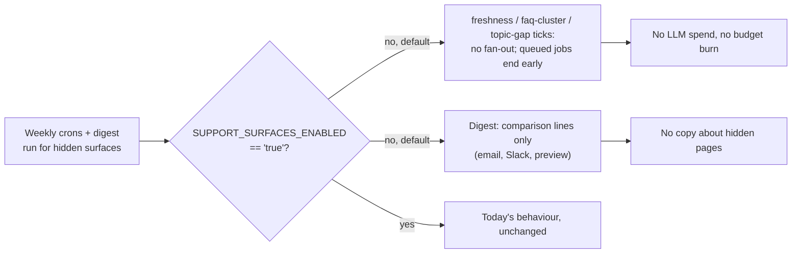

## Gate the support-surface crons and digest lines behind `SUPPORT_SURFACES_ENABLED`

Knowledge Bases, Datasets, Chat, Tickets and Insights have been hidden since 2026-10-02, but their weekly background jobs still run. Two of them call OpenAI, and the cost is charged to each workspace's own AI budget. Once billing caps arrive, customers would pay for features they cannot see. The weekly digest email also still talks about chat, tickets and documents. The change adds one API switch, `SUPPORT_SURFACES_ENABLED`, which is off unless set to `true`. Think of it as a breaker: the hidden rooms lose power, and the procurement lights stay on.

Status: discovery approved 2026-10-08 (scope: all 3 support crons; digest = procurement-only). This is plan approval, stop 2 of 2.

### Flowchart (high-level)



### Task metadata

- Classification: `ENHANCEMENT` · **Deep** · Insights / Scheduler (`docs/ai/file-index/repository-map.md` rows 70–89) · risk row "Disabled Support Surfaces"
- Contract areas: API: `GET /workspaces/:id/digest-settings/preview` output content (shape unchanged). Database: no contract impact (reads only, no schema change). Permissions: no contract impact. External integrations: OpenAI calls removed while off. Jobs: 3 tick + 3 worker processors gated.
- Docs loaded: `planning.md, plan-template.md`
- Claims reversed while investigating: "the digest is support-only and can stop". Disproved by `digest-renderers.ts` `EVENT_LABELS`, which include `comparison_flagged`/`comparison_failed`. "Not registering the cron is enough". Disproved: Bull keeps repeatables in Redis across boots (`onModuleInit` re-adds by `jobId`), so the gate has to sit in `onTick` + worker.
- Graphify: `graphify query "which processors and services call generateFaqDraft generateTopicLabel and DigestContentService"` returned only the definitions, no callers, because the processors use dynamic `await import('@repo/ai')`. Grep fallback found the callers: `faq-cluster.processor.ts`, `topic-gap.processor.ts`, `digest.processor.ts`, `digest-settings.controller.ts`. The tick classes have no caller except Bull and `insights.module.ts`.
- Detected running model: Opus 5.5 (`claude-opus-5-5`)
- Recommended model: Opus, medium reasoning; confidence high. Fallback: Sonnet, high.
- Minimum capability: Sonnet. The blocks are literal; the risk is in the test harness (real unit DB, Bull mocks, Playwright seed).
- Branch: `fix/no-ticket-support-crons-flag`, from `origin/main`
- Release path: one PR into `main`, "Create a merge commit". Opened only if the owner asks.
- Personas: `project-manager` confirms the ACs below. `test-engineer` owns Phase 1 (incl. `apps/e2e`). `nestjs-backend-dev` owns Phase 2. QA: `code-reviewer` + `security-auditor` (budget/LLM path). No UI change, so no a11y/ui-ux persona.
- Required skills: `/review` before PR; `/graphify . --update` at close.
- Execution preflight: `git fetch origin`; `scripts/new-task-worktree.sh fix support-crons-flag origin/main`; in the new worktree run `nvm use`, `bun install --frozen-lockfile`. Write `.claude/.plan-ack` = `{"size":"deep","plan":"approved","matrices":"present"}` only after approval. Save this plan as `docs/plans/fix-support-crons-flag.md`.

### Layer 1 — human summary

- **One switch, read every time it is needed.** It is a new helper, `supportSurfacesEnabled()`, written the same way as `procurement-feature-flags.ts` (`=== 'true'`, read at call time). The VPS `.env` does not set it, so the deploy turns the jobs off with no env work.
- **Ticks.** `freshness`, `faq-cluster` and `topic-gap` still register their weekly repeat, so flipping the switch on later needs no Redis surgery. When the switch is off, each tick logs one line and queues nothing.
- **Workers.** A job queued before the deploy, or a retry, ends before `runs.start`. That means no `background_runs` row, no DB read and no model call.
- **Digest.** It still sends weekly. When the switch is off, it counts only `comparison_flagged`/`comparison_failed` events and reports zero for chat, tickets, stale-doc flags and FAQ drafts. The `DigestContent` shape and the renderers do not change, and a week with no comparisons renders the existing "Quiet week" text.
- **Rejected, simpler-looking options.**
  - Skip registration in `onModuleInit`: this leaves the persisted Redis repeat firing.
  - `removeRepeatable` when off: it mutates Redis on boot and still needs the worker gate.
  - Filter in the renderers: the hidden queries would still run, and the preview HTML would depend on render-time env.

**Risk Matrix**

| Risk | Likelihood | Impact | Mitigation | Rollback |
|---|---|---|---|---|
| Existing insights specs fail because the default flips to off | Certain if unhandled | CI red | Each existing spec sets `'true'` in `beforeEach` (Phase 1 steps 5–8). The cases keep their intent and none is weakened | n/a |
| Jobs already waiting in Redis at deploy still call the LLM | Low (weekly, Monday 03:00–05:00) | Small spend | Worker gate (Phase 2 steps 5–7) | n/a |
| Prod `.env` already has `SUPPORT_SURFACES_ENABLED=true` by accident | Very low (new name) | Gate ineffective | Owner checks `grep SUPPORT_SURFACES /home/deploy/apps/optra/.env` returns nothing | Remove the line, `docker compose up -d api` |
| Owners notice their digest lost chat/ticket lines | Low (surfaces hidden) | Confusion | Intended; the risk-register row records it | Set the flag `true` |
| Topic-gap Redis cache (`topicGapsRedisKey`, 9-day TTL) expires, so the hidden Insights coverage panel shows no gaps | Certain | None visible (page 404s) | Documented in the risk row | Flag `true` refills it next Monday |
| Playwright seed events in workspace A leak into other specs | Low | Flaky overview | The test deletes its own rows; the overview test already accepts feed or empty | n/a |

Whole-change rollback: revert the merge commit, or set `SUPPORT_SURFACES_ENABLED=true` in the VPS `.env` and restart `api`. Both restore today's behaviour exactly (proven by the `happy:`/`regression:` "flag on" cases).

**Backward Compatibility Matrix** (usage search: grep for each class and method across `apps`/`packages`; graphify could not see the dynamic imports)

| Changed File / Symbol | Used By (outside this feature) | Breaks? | Handling |
|---|---|---|---|
| `FreshnessTickProcessor.onTick`, `FaqClusterTickProcessor.onTick`, `TopicGapTickProcessor.onTick` | Bull only; registered in `insights.module.ts` | No | `onModuleInit` unchanged; regression cases pin it |
| `FreshnessCheckProcessor.onCheck`, `FaqClusterProcessor.onCluster`, `TopicGapProcessor.onGap` | Bull only, plus their own specs | No | Specs set the flag `true` for existing cases |
| `DigestContentService.build` | `DigestProcessor.onDigest` (affected, NOT modified); `DigestSettingsController.preview` (affected, NOT modified); web `settings/page.tsx` preview `<pre>` (affected, NOT modified) | No | Same `DigestContent` shape; zero values hit renderers' existing `> 0` guards and `isQuietWeek` |
| `DigestTickProcessor` | Bull | Not changed | The digest still fans out weekly |
| Insights read APIs (`insights.controller.ts`, `faq-drafts.controller.ts`) | Hidden pages; BFF live | Not changed | Out of scope (separate blocker: BFF 404) |
| `apps/e2e/support/env.ts` `apiEnv()` | Every Playwright run | No | Adds an explicit `'false'`, which equals the default |

### Layer 2 — execution spec

#### Phase 1 — RED (Opus 5.5, medium) — `test-engineer`

1. **New** `apps/api/src/insights/support-surfaces-flag.spec.ts`:
```ts
import { supportSurfacesEnabled } from './support-surfaces-flag'

describe('supportSurfacesEnabled', () => {
  const original = process.env.SUPPORT_SURFACES_ENABLED

  afterEach(() => {
    if (original === undefined) delete process.env.SUPPORT_SURFACES_ENABLED
    else process.env.SUPPORT_SURFACES_ENABLED = original
  })

  it('edge: is off when SUPPORT_SURFACES_ENABLED is unset', () => {
    delete process.env.SUPPORT_SURFACES_ENABLED
    expect(supportSurfacesEnabled()).toBe(false)
  })

  it('edge: is off for any value other than the exact string true', () => {
    for (const value of ['', 'false', 'TRUE', 'True', '1', 'yes', ' true']) {
      process.env.SUPPORT_SURFACES_ENABLED = value
      expect(supportSurfacesEnabled()).toBe(false)
    }
  })

  it('regression: reads the env at call time, not at import time', () => {
    process.env.SUPPORT_SURFACES_ENABLED = 'true'
    expect(supportSurfacesEnabled()).toBe(true)
    process.env.SUPPORT_SURFACES_ENABLED = 'false'
    expect(supportSurfacesEnabled()).toBe(false)
  })

  it('happy: is on when SUPPORT_SURFACES_ENABLED is true', () => {
    process.env.SUPPORT_SURFACES_ENABLED = 'true'
    expect(supportSurfacesEnabled()).toBe(true)
  })
})
```

2. **New** `apps/api/src/insights/faq-cluster-tick.processor.spec.ts`:
```ts
import { db, pool, users, workspaceMembers, workspaces } from '@repo/db'
import { FaqClusterTickProcessor } from './faq-cluster-tick.processor'

describe('FaqClusterTickProcessor', () => {
  const original = process.env.SUPPORT_SURFACES_ENABLED
  const prefix = `faq-cluster-tick-spec-${Date.now()}-`
  let workspaceId: string
  let tickQueue: { add: jest.Mock }
  let clusterQueue: { add: jest.Mock }
  let processor: FaqClusterTickProcessor

  beforeAll(async () => {
    const [user] = await db
      .insert(users)
      .values({ email: `${prefix}@example.com`, passwordHash: 'x', isVerified: true })
      .returning()
    const [workspace] = await db.insert(workspaces).values({ name: prefix, ownerId: user.id }).returning()
    await db.insert(workspaceMembers).values({ workspaceId: workspace.id, userId: user.id, role: 'owner' })
    workspaceId = workspace.id
  })

  afterAll(async () => {
    if (original === undefined) delete process.env.SUPPORT_SURFACES_ENABLED
    else process.env.SUPPORT_SURFACES_ENABLED = original
    await pool.end()
  })

  beforeEach(() => {
    tickQueue = { add: jest.fn().mockResolvedValue(undefined) }
    clusterQueue = { add: jest.fn().mockResolvedValue(undefined) }
    processor = new FaqClusterTickProcessor(tickQueue as never, clusterQueue as never)
  })

  it('edge: queues no per-workspace job while support surfaces are off', async () => {
    delete process.env.SUPPORT_SURFACES_ENABLED

    await processor.onTick()

    expect(clusterQueue.add).not.toHaveBeenCalled()
  })

  it('regression: still registers the weekly repeatable tick while off, so turning the flag on needs no Redis change', async () => {
    delete process.env.SUPPORT_SURFACES_ENABLED

    await processor.onModuleInit()

    expect(tickQueue.add).toHaveBeenCalledWith({}, expect.objectContaining({ jobId: 'faq-cluster-tick' }))
  })

  it('happy: queues one job per workspace, keyed by workspace and date, when SUPPORT_SURFACES_ENABLED=true', async () => {
    process.env.SUPPORT_SURFACES_ENABLED = 'true'
    const stamp = new Date().toISOString().slice(0, 10)

    await processor.onTick()

    expect(clusterQueue.add).toHaveBeenCalledWith(
      { workspaceId },
      expect.objectContaining({ jobId: `faq-cluster:${workspaceId}:${stamp}` }),
    )
  })
})
```

3. **New** `apps/api/src/insights/topic-gap-tick.processor.spec.ts`: same body as step 2, with these substitutions only:
   - import `TopicGapTickProcessor` from `./topic-gap-tick.processor`
   - prefix `topic-gap-tick-spec-`
   - `clusterQueue` → `gapQueue`
   - `jobId: 'topic-gap-tick'`
   - `` `topic-gap:${workspaceId}:${stamp}` ``
   - describe name `'TopicGapTickProcessor'`

4. **New** `apps/api/src/insights/freshness-tick.processor.spec.ts`: same body as step 2, with these substitutions only:
   - import `FreshnessTickProcessor` from `./freshness-tick.processor`
   - prefix `freshness-tick-spec-`
   - `clusterQueue` → `checkQueue`
   - `jobId: 'freshness-tick'`
   - `` `freshness-check:${workspaceId}:${stamp}` ``
   - describe name `'FreshnessTickProcessor'`

5. `apps/api/src/insights/faq-cluster.processor.spec.ts`
   Old:
```ts
  let workspaceId: string
  let ticketIds: string[]

  beforeAll(async () => {
```
   New:
```ts
  let workspaceId: string
  let ticketIds: string[]
  const originalFlag = process.env.SUPPORT_SURFACES_ENABLED

  beforeAll(async () => {
```
   Old:
```ts
  afterAll(async () => {
    await pool.end()
  })

  beforeEach(async () => {
    jest.clearAllMocks()
    coverage = { findUncoveredTickets: jest.fn() }
```
   New:
```ts
  afterAll(async () => {
    if (originalFlag === undefined) delete process.env.SUPPORT_SURFACES_ENABLED
    else process.env.SUPPORT_SURFACES_ENABLED = originalFlag
    await pool.end()
  })

  beforeEach(async () => {
    jest.clearAllMocks()
    process.env.SUPPORT_SURFACES_ENABLED = 'true'
    coverage = { findUncoveredTickets: jest.fn() }
```
   Old:
```ts
  it('creates one draft per surviving cluster', async () => {
```
   New:
```ts
  it('edge: with support surfaces off, a queued job ends without a run, a ticket read or a model call', async () => {
    process.env.SUPPORT_SURFACES_ENABLED = 'false'
    const start = jest.spyOn(runs, 'start')

    await processor.onCluster({ data: { workspaceId } } as never)

    expect(start).not.toHaveBeenCalled()
    expect(coverage.findUncoveredTickets).not.toHaveBeenCalled()
    expect(usage.metered).not.toHaveBeenCalled()
    expect(generateFaqDraft).not.toHaveBeenCalled()
  })

  it('creates one draft per surviving cluster', async () => {
```

6. `apps/api/src/insights/topic-gap.processor.spec.ts`
   Old:
```ts
  let workspaceId: string
  let sessionId: string

  beforeAll(async () => {
```
   New:
```ts
  let workspaceId: string
  let sessionId: string
  const originalFlag = process.env.SUPPORT_SURFACES_ENABLED

  beforeAll(async () => {
```
   Old:
```ts
  afterAll(async () => {
    await pool.end()
  })

  beforeEach(async () => {
    jest.clearAllMocks()
    redis = { set: jest.fn().mockResolvedValue('OK'), get: jest.fn() }
```
   New:
```ts
  afterAll(async () => {
    if (originalFlag === undefined) delete process.env.SUPPORT_SURFACES_ENABLED
    else process.env.SUPPORT_SURFACES_ENABLED = originalFlag
    await pool.end()
  })

  beforeEach(async () => {
    jest.clearAllMocks()
    process.env.SUPPORT_SURFACES_ENABLED = 'true'
    redis = { set: jest.fn().mockResolvedValue('OK'), get: jest.fn() }
```
   Old:
```ts
  async function seedFallbackMetric(question: string, embeddingSeed: number) {
```
   New:
```ts
  it('edge: with support surfaces off, a queued job ends without a run, a metrics read or a model call', async () => {
    process.env.SUPPORT_SURFACES_ENABLED = 'false'
    const start = jest.spyOn(runs, 'start')

    await processor.onGap({ data: { workspaceId } } as never)

    expect(start).not.toHaveBeenCalled()
    expect(clusterer.cluster).not.toHaveBeenCalled()
    expect(usage.metered).not.toHaveBeenCalled()
    expect(generateTopicLabel).not.toHaveBeenCalled()
    expect(redis.set).not.toHaveBeenCalled()
  })

  async function seedFallbackMetric(question: string, embeddingSeed: number) {
```

7. `apps/api/src/insights/freshness-check.processor.spec.ts`
   Old:
```ts
  let documentId: string
  let ticketId: string

  beforeAll(async () => {
```
   New:
```ts
  let documentId: string
  let ticketId: string
  const originalFlag = process.env.SUPPORT_SURFACES_ENABLED

  beforeAll(async () => {
```
   Old:
```ts
  afterAll(async () => {
    await pool.end()
  })

  beforeEach(async () => {
    coverage = { findGaps: jest.fn() }
```
   New:
```ts
  afterAll(async () => {
    if (originalFlag === undefined) delete process.env.SUPPORT_SURFACES_ENABLED
    else process.env.SUPPORT_SURFACES_ENABLED = originalFlag
    await pool.end()
  })

  beforeEach(async () => {
    process.env.SUPPORT_SURFACES_ENABLED = 'true'
    coverage = { findGaps: jest.fn() }
```
   Old:
```ts
  it('inserts one flag per gap and records a succeeded run', async () => {
```
   New:
```ts
  it('edge: with support surfaces off, a queued job ends without a run or a flag', async () => {
    process.env.SUPPORT_SURFACES_ENABLED = 'false'
    coverage.findGaps.mockResolvedValue([{ documentId, ticketId, score: 0.2 }])

    await processor.onCheck({ data: { workspaceId } } as never)

    expect(coverage.findGaps).not.toHaveBeenCalled()
    const flags = await db.select().from(documentReviewFlags).where(eq(documentReviewFlags.workspaceId, workspaceId))
    expect(flags).toHaveLength(0)
    const runRows = await db.select().from(backgroundRuns).where(eq(backgroundRuns.workspaceId, workspaceId))
    expect(runRows).toHaveLength(0)
  })

  it('inserts one flag per gap and records a succeeded run', async () => {
```

8. `apps/api/src/insights/digest-content.service.spec.ts`
   Old:
```ts
  let documentId: string
  let userId: string

  beforeAll(async () => {
```
   New:
```ts
  let documentId: string
  let userId: string
  const originalFlag = process.env.SUPPORT_SURFACES_ENABLED

  beforeAll(async () => {
```
   Old:
```ts
  afterAll(async () => {
    await pool.end()
  })

  beforeEach(async () => {
    const redis = { get: jest.fn().mockResolvedValue(null) }
```
   New:
```ts
  afterAll(async () => {
    if (originalFlag === undefined) delete process.env.SUPPORT_SURFACES_ENABLED
    else process.env.SUPPORT_SURFACES_ENABLED = originalFlag
    await pool.end()
  })

  beforeEach(async () => {
    process.env.SUPPORT_SURFACES_ENABLED = 'true'
    const redis = { get: jest.fn().mockResolvedValue(null) }
```
   Old:
```ts
  it('returns all-zero content for a quiet workspace', async () => {
```
   New:
```ts
  it('edge: with support surfaces off, counts only comparison events and reports no chat, tickets, flags or FAQ drafts', async () => {
    process.env.SUPPORT_SURFACES_ENABLED = 'false'
    await db.insert(workspaceEvents).values([
      { workspaceId, type: 'document_ingested', entityId: documentId, title: 'doc 1' },
      { workspaceId, type: 'ticket_extracted', entityId: documentId, title: 'ticket 1' },
      { workspaceId, type: 'comparison_flagged', entityId: documentId, title: 'PO-1 vs INV-1' },
      { workspaceId, type: 'comparison_failed', entityId: documentId, title: 'PO-2 vs INV-2' },
    ])
    await db.insert(documentReviewFlags).values({ workspaceId, documentId, reason: 'ticket-mismatch' })
    await db.insert(faqDrafts).values({
      workspaceId,
      question: 'q',
      answer: 'a',
      ticketIds: ['t1'],
      clusterSize: 3,
      status: 'pending',
    })
    await db.insert(tickets).values({ workspaceId, transcript: 't', transcriptHash: randomUUID(), status: 'done' })
    const [session] = await db.insert(chatSessions).values({ workspaceId, userId, title: 's' }).returning()
    const [message] = await db
      .insert(chatMessages)
      .values({ sessionId: session.id, role: 'assistant', content: 'a' })
      .returning()
    await db.insert(chatQueryMetrics).values({
      workspaceId,
      sessionId: session.id,
      chatMessageId: message.id,
      question: 'q',
      isFallback: true,
      cacheStatus: 'miss',
      queryClass: 'complex',
      topScore: 0.1,
      latencyMs: 100,
    })

    const content = await service.build(workspaceId)

    expect(content.eventCounts).toEqual({ comparison_flagged: 1, comparison_failed: 1 })
    expect(content.newFreshnessFlags).toBe(0)
    expect(content.newFaqDrafts).toBe(0)
    expect(content.newTickets).toBe(0)
    expect(content.chatSummary).toEqual({ totalQueries: 0, fallbackRate: 0, cacheHitRate: 0, avgTopScore: null })
  })

  it('returns all-zero content for a quiet workspace', async () => {
```

9. **New** `apps/api/test/digest-settings.e2e-spec.ts`:
```ts
import { INestApplication, ValidationPipe } from '@nestjs/common'
import { Test } from '@nestjs/testing'
import cookieParser from 'cookie-parser'
import { randomUUID } from 'crypto'
import { eq, like } from 'drizzle-orm'
import request from 'supertest'
import { db, otps, pool, refreshTokens, tickets, users, workspaceEvents, workspaceMembers, workspaces } from '@repo/db'
import { AppModule } from '../src/app.module'

// The preview renders exactly what the weekly digest would send, so it is the
// observable face of SUPPORT_SURFACES_ENABLED for the digest.
const SUPPORT_LINES = /documents ingested|tickets|chat questions|FAQ drafts|possibly stale|crawls/

async function cleanupUsers(prefix: string) {
  const matches = await db.select({ id: users.id }).from(users).where(like(users.email, `${prefix}%`))

  for (const user of matches) {
    const memberships = await db
      .select({ workspaceId: workspaceMembers.workspaceId })
      .from(workspaceMembers)
      .where(eq(workspaceMembers.userId, user.id))

    await db.delete(refreshTokens).where(eq(refreshTokens.userId, user.id))
    await db.delete(otps).where(eq(otps.userId, user.id))
    await db.delete(workspaceMembers).where(eq(workspaceMembers.userId, user.id))

    for (const membership of memberships) {
      await db.delete(workspaceEvents).where(eq(workspaceEvents.workspaceId, membership.workspaceId))
      await db.delete(tickets).where(eq(tickets.workspaceId, membership.workspaceId))
      await db.delete(workspaceMembers).where(eq(workspaceMembers.workspaceId, membership.workspaceId))
      await db.delete(workspaces).where(eq(workspaces.id, membership.workspaceId))
    }
  }

  await db.delete(users).where(like(users.email, `${prefix}%`))
}

async function registerAndVerify(app: INestApplication, email: string, password: string) {
  await request(app.getHttpServer()).post('/auth/register').send({ email, password }).expect(201)

  const [user] = await db.select().from(users).where(eq(users.email, email)).limit(1)
  const [otp] = await db.select().from(otps).where(eq(otps.userId, user.id)).limit(1)

  const verifyRes = await request(app.getHttpServer())
    .post('/auth/verify-otp')
    .send({ email, code: otp.code })
    .expect(201)

  return { user, accessToken: verifyRes.body.accessToken as string }
}

describe('Digest preview (e2e)', () => {
  let app: INestApplication
  const prefix = `e2e-digest-${Date.now()}-`
  const password = 'password123'
  const originalFlag = process.env.SUPPORT_SURFACES_ENABLED
  let ownerToken: string
  let memberToken: string
  let outsiderToken: string
  let workspaceId: string

  const preview = (token: string) =>
    request(app.getHttpServer())
      .get(`/workspaces/${workspaceId}/digest-settings/preview`)
      .set('Authorization', `Bearer ${token}`)

  beforeAll(async () => {
    const moduleRef = await Test.createTestingModule({ imports: [AppModule] }).compile()
    app = moduleRef.createNestApplication()
    app.use(cookieParser())
    app.useGlobalPipes(new ValidationPipe({ whitelist: true }))
    await app.init()

    const owner = await registerAndVerify(app, `${prefix}owner@example.com`, password)
    const member = await registerAndVerify(app, `${prefix}member@example.com`, password)
    const outsider = await registerAndVerify(app, `${prefix}outsider@example.com`, password)
    ownerToken = owner.accessToken
    memberToken = member.accessToken
    outsiderToken = outsider.accessToken

    const [workspace] = await db.select().from(workspaces).where(eq(workspaces.ownerId, owner.user.id)).limit(1)
    workspaceId = workspace.id
    await db.insert(workspaceMembers).values({ workspaceId, userId: member.user.id, role: 'member' })
    await db.insert(workspaceEvents).values([
      { workspaceId, type: 'document_ingested', entityId: workspaceId, title: 'Imported onboarding doc' },
      { workspaceId, type: 'ticket_extracted', entityId: workspaceId, title: 'Login ticket' },
      { workspaceId, type: 'comparison_flagged', entityId: workspaceId, title: 'PO-1 vs INV-1' },
    ])
    await db.insert(tickets).values({ workspaceId, transcript: 't', transcriptHash: randomUUID(), status: 'done' })
  })

  afterEach(() => {
    if (originalFlag === undefined) delete process.env.SUPPORT_SURFACES_ENABLED
    else process.env.SUPPORT_SURFACES_ENABLED = originalFlag
  })

  afterAll(async () => {
    await cleanupUsers(prefix)
    await app.close()
    await pool.end()
  })

  it('error: a user outside the workspace gets 403', async () => {
    await preview(outsiderToken).expect(403)
  })

  it('error: a plain member gets 403, the preview is owner/admin only', async () => {
    await preview(memberToken).expect(403)
  })

  it('edge: with support surfaces off, the preview lists comparisons and nothing about documents, tickets or chat', async () => {
    delete process.env.SUPPORT_SURFACES_ENABLED

    const res = await preview(ownerToken).expect(200)

    expect(res.body.slackPayload.text).toContain('1 comparisons with discrepancies')
    expect(res.body.slackPayload.text).not.toMatch(SUPPORT_LINES)
    expect(res.body.emailHtml).toContain('<li>1 comparisons with discrepancies</li>')
    expect(res.body.emailHtml).not.toMatch(SUPPORT_LINES)
  })

  it('regression: with SUPPORT_SURFACES_ENABLED=true the preview still lists documents and tickets', async () => {
    process.env.SUPPORT_SURFACES_ENABLED = 'true'

    const res = await preview(ownerToken).expect(200)

    expect(res.body.slackPayload.text).toContain('1 documents ingested')
    expect(res.body.slackPayload.text).toContain('1 tickets extracted')
    expect(res.body.slackPayload.text).toContain('1 new tickets')
    expect(res.body.slackPayload.text).toContain('1 comparisons with discrepancies')
  })
})
```

10. `apps/e2e/support/db.ts`
   Old:
```ts
/** The newest unused OTP for an email. OTPs are stored in plaintext. */
```
   New:
```ts
/** Activity rows the digest counts; the entity is the workspace itself. */
export async function seedWorkspaceEvent(
  workspaceId: string,
  type: 'document_ingested' | 'comparison_flagged',
  title: string,
): Promise<void> {
  await db().query(
    `insert into workspace_events (workspace_id, type, entity_id, title) values ($1, $2, $1, $3)`,
    [workspaceId, type, title],
  )
}

export async function deleteWorkspaceEvents(workspaceId: string, titles: string[]): Promise<void> {
  await db().query(`delete from workspace_events where workspace_id = $1 and title = any($2)`, [workspaceId, titles])
}

/** The newest unused OTP for an email. OTPs are stored in plaintext. */
```

11. `apps/e2e/support/env.ts`
   Old:
```ts
    PROCUREMENT_AUTO_COMPARE_ENABLED: 'false',
```
   New:
```ts
    PROCUREMENT_AUTO_COMPARE_ENABLED: 'false',
    // Production default: the hidden support surfaces' crons and digest lines are off.
    SUPPORT_SURFACES_ENABLED: 'false',
```

12. `apps/e2e/tests/workspace-alignment.spec.ts`
   Old:
```ts
import { loadState, storageStateFor, type SeedState } from '../support/state'
```
   New:
```ts
import { closeDb, deleteWorkspaceEvents, seedWorkspaceEvent } from '../support/db'
import { loadState, storageStateFor, type SeedState } from '../support/state'
```
   Old:
```ts
// Runs as owner A. Nothing here leaves state behind: the digest switch is put
// back, and no member is removed.
```
   New:
```ts
// Runs as owner A. Nothing here leaves state behind: the digest switch is put
// back, the digest-preview events are deleted, and no member is removed.
```
   Old:
```ts
test.beforeAll(() => {
  state = loadState()
})
```
   New:
```ts
test.beforeAll(() => {
  state = loadState()
})
test.afterAll(closeDb)
```
   Old:
```ts
test('happy: a vendor row opens the detail page, which names both sections and links back to Vendors', async ({ page }) => {
```
   New:
```ts
test('regression: the digest preview lists comparisons and nothing from the hidden support surfaces', async ({ page }) => {
  const ws = state.ownerA.workspaceId
  const titles = [`E2E digest doc ${state.run}`, `E2E digest compare ${state.run}`]
  await seedWorkspaceEvent(ws, 'document_ingested', titles[0])
  await seedWorkspaceEvent(ws, 'comparison_flagged', titles[1])

  try {
    await page.goto(`/workspaces/${ws}/settings`)
    await page.getByRole('button', { name: 'Preview digest', exact: true }).click()

    const preview = page.getByRole('main').locator('pre')
    await expect(preview).toContainText('*Optra weekly digest*')
    await expect(preview).toContainText(/\d+ comparisons with discrepancies/)
    await expect(preview).not.toContainText('documents ingested')
  } finally {
    await deleteWorkspaceEvents(ws, titles)
  }
})

test('happy: a vendor row opens the detail page, which names both sections and links back to Vendors', async ({ page }) => {
```

13. Run `bun run tdd:red`. Expected failing cases:
   - every `edge:` case in steps 2–9: the ticks and workers run today; the digest counts every type
   - the step-12 `regression:`
   - step 1 cannot load yet because the module is missing

   Commit the tests alone: `test(insights): pin support-surface crons and digest lines behind SUPPORT_SURFACES_ENABLED`.

Done: `tdd:red` writes a valid RED marker.

#### Phase 2 — implement (Opus 5.5, medium) — `nestjs-backend-dev`

1. **New** `apps/api/src/insights/support-surfaces-flag.ts`. A new file was justified after checking the alternatives: `procurement-feature-flags.ts` belongs to the procurement domain, and inlining the check would repeat it in 7 places.
```ts
// [support-surfaces-off] Knowledge Bases, Datasets, Chat, Tickets and Insights
// are hidden in the web app since 2026-10-02. Their background work is off with
// them: the weekly freshness, FAQ-cluster and topic-gap jobs (the last two call
// OpenAI against the workspace's token budget) and the digest's lines about
// chat, tickets, documents and FAQ drafts. Off unless the env says exactly
// 'true'. Read at call time, like procurement-feature-flags.ts, so a tick and
// the jobs it queued each see the value current when they run.
export function supportSurfacesEnabled(): boolean {
  return process.env.SUPPORT_SURFACES_ENABLED === 'true'
}
```

2. `apps/api/src/insights/faq-cluster-tick.processor.ts`
   Old:
```ts
import { db, workspaces } from '@repo/db'
```
   New:
```ts
import { db, workspaces } from '@repo/db'
import { supportSurfacesEnabled } from './support-surfaces-flag'
```
   Old:
```ts
  @Process()
  async onTick() {
    const rows = await db.select({ id: workspaces.id }).from(workspaces)
```
   New:
```ts
  @Process()
  async onTick() {
    if (!supportSurfacesEnabled()) {
      this.logger.log('FAQ cluster tick skipped: SUPPORT_SURFACES_ENABLED is not true')
      return
    }

    const rows = await db.select({ id: workspaces.id }).from(workspaces)
```

3. `apps/api/src/insights/topic-gap-tick.processor.ts`: the same two blocks as step 2. The log text is `'Topic gap tick skipped: SUPPORT_SURFACES_ENABLED is not true'`.

4. `apps/api/src/insights/freshness-tick.processor.ts`: the same two blocks as step 2. The log text is `'Freshness tick skipped: SUPPORT_SURFACES_ENABLED is not true'`.

5. `apps/api/src/insights/faq-cluster.processor.ts`
   Old:
```ts
import { FaqClusterService } from './faq-cluster.service'
import { isBudgetExceeded, UsageService } from '../limits/usage.service'
```
   New:
```ts
import { FaqClusterService } from './faq-cluster.service'
import { supportSurfacesEnabled } from './support-surfaces-flag'
import { isBudgetExceeded, UsageService } from '../limits/usage.service'
```
   Old:
```ts
    const { workspaceId } = job.data
    const runId = await this.runs.start('faq-cluster', workspaceId)
```
   New:
```ts
    const { workspaceId } = job.data
    // A job queued before the flag went off (or a retry) ends here, with no run
    // row, no read and no model call.
    if (!supportSurfacesEnabled()) {
      this.logger.log(`FAQ cluster skipped workspaceId=${workspaceId}: support surfaces are off`)
      return
    }
    const runId = await this.runs.start('faq-cluster', workspaceId)
```

6. `apps/api/src/insights/topic-gap.processor.ts`: the import block is the same as step 5; the anchor import is `import { FaqClusterService } from './faq-cluster.service'` followed by the `usage.service` line, which is identical in this file.
   Old:
```ts
    const { workspaceId } = job.data
    const runId = await this.runs.start('topic-gap', workspaceId)
```
   New:
```ts
    const { workspaceId } = job.data
    // A job queued before the flag went off (or a retry) ends here, with no run
    // row, no read and no model call.
    if (!supportSurfacesEnabled()) {
      this.logger.log(`Topic gap skipped workspaceId=${workspaceId}: support surfaces are off`)
      return
    }
    const runId = await this.runs.start('topic-gap', workspaceId)
```

7. `apps/api/src/insights/freshness-check.processor.ts`
   Old:
```ts
import { TicketDocCoverageService } from './ticket-doc-coverage.service'
```
   New:
```ts
import { TicketDocCoverageService } from './ticket-doc-coverage.service'
import { supportSurfacesEnabled } from './support-surfaces-flag'
```
   Old:
```ts
    const { workspaceId } = job.data
    const runId = await this.runs.start('freshness-check', workspaceId)
```
   New:
```ts
    const { workspaceId } = job.data
    // A job queued before the flag went off (or a retry) ends here, with no run
    // row and no flag written.
    if (!supportSurfacesEnabled()) {
      this.logger.log(`Freshness check skipped workspaceId=${workspaceId}: support surfaces are off`)
      return
    }
    const runId = await this.runs.start('freshness-check', workspaceId)
```

8. `apps/api/src/insights/digest-content.service.ts`: full new content.
```ts
import { Injectable } from '@nestjs/common'
import { and, count, eq, gte, inArray } from 'drizzle-orm'
import { db, documentReviewFlags, faqDrafts, tickets, workspaceEvents, type WorkspaceEvent } from '@repo/db'
import { CoverageDashboardService, type CoverageSummary } from './coverage-dashboard.service'
import { supportSurfacesEnabled } from './support-surfaces-flag'

const DIGEST_WINDOW_DAYS = Number.parseInt(process.env.DIGEST_WINDOW_DAYS ?? '7', 10)

// While the support surfaces are off, the digest reports procurement comparison
// outcomes only; every other event type belongs to a hidden page.
const PROCUREMENT_EVENT_TYPES: readonly WorkspaceEvent['type'][] = ['comparison_flagged', 'comparison_failed']

const NO_CHAT_SUMMARY: CoverageSummary = { totalQueries: 0, fallbackRate: 0, cacheHitRate: 0, avgTopScore: null }

export interface DigestContent {
  workspaceId: string
  windowDays: number
  eventCounts: Record<string, number>
  chatSummary: CoverageSummary
  newFreshnessFlags: number
  newFaqDrafts: number
  newTickets: number
}

@Injectable()
export class DigestContentService {
  constructor(private readonly coverageDashboard: CoverageDashboardService) {}

  async build(workspaceId: string): Promise<DigestContent> {
    const since = new Date(Date.now() - DIGEST_WINDOW_DAYS * 24 * 60 * 60 * 1000)

    // Same shape either way, so the renderers and the "quiet week" rule need
    // no flag of their own; the hidden surfaces' reads are skipped, not zeroed
    // after the fact.
    if (!supportSurfacesEnabled()) {
      return {
        workspaceId,
        windowDays: DIGEST_WINDOW_DAYS,
        eventCounts: await this.countEvents(workspaceId, since, PROCUREMENT_EVENT_TYPES),
        chatSummary: NO_CHAT_SUMMARY,
        newFreshnessFlags: 0,
        newFaqDrafts: 0,
        newTickets: 0,
      }
    }

    const [eventCounts, chatSummary, [freshnessCount], [faqCount], [ticketCount]] = await Promise.all([
      this.countEvents(workspaceId, since),
      this.coverageDashboard.getSummary(workspaceId),
      db
        .select({ value: count() })
        .from(documentReviewFlags)
        .where(and(eq(documentReviewFlags.workspaceId, workspaceId), gte(documentReviewFlags.createdAt, since))),
      db
        .select({ value: count() })
        .from(faqDrafts)
        .where(and(eq(faqDrafts.workspaceId, workspaceId), gte(faqDrafts.createdAt, since))),
      db
        .select({ value: count() })
        .from(tickets)
        .where(and(eq(tickets.workspaceId, workspaceId), gte(tickets.createdAt, since))),
    ])

    return {
      workspaceId,
      windowDays: DIGEST_WINDOW_DAYS,
      eventCounts,
      chatSummary,
      newFreshnessFlags: Number(freshnessCount?.value ?? 0),
      newFaqDrafts: Number(faqCount?.value ?? 0),
      newTickets: Number(ticketCount?.value ?? 0),
    }
  }

  private async countEvents(
    workspaceId: string,
    since: Date,
    types?: readonly WorkspaceEvent['type'][],
  ): Promise<Record<string, number>> {
    const rows = await db
      .select({ type: workspaceEvents.type, value: count() })
      .from(workspaceEvents)
      .where(
        and(
          eq(workspaceEvents.workspaceId, workspaceId),
          gte(workspaceEvents.createdAt, since),
          types ? inArray(workspaceEvents.type, [...types]) : undefined,
        ),
      )
      .groupBy(workspaceEvents.type)

    const counts: Record<string, number> = {}
    for (const row of rows) {
      counts[row.type] = Number(row.value)
    }
    return counts
  }
}
```

Done: `bun run test` in `apps/api` is green, including the RED cases.

#### Phase 3 — docs, validation, review (Opus 5.5, medium)

1. `.env.example`
   Old:
```
CATALOG_IMAGE_MAX_BYTES=5242880
```
   New:
```
CATALOG_IMAGE_MAX_BYTES=5242880

# Hidden support surfaces (Knowledge Bases, Datasets, Chat, Tickets, Insights).
# Off unless exactly `true`: the weekly freshness, FAQ-cluster and topic-gap
# jobs queue nothing (the last two call OpenAI against the workspace's token
# budget) and the weekly digest reports comparison outcomes only. Set `true`
# only when those pages come back.
SUPPORT_SURFACES_ENABLED=false
```
2. `docs/ai/risk-register.md`, row "Disabled Support Surfaces"
   Old: `insights crons (faq-cluster, topic-gap LLM calls) and the weekly digest keep running and the digest text still mentions chat/tickets/docs;`
   New: `the insights crons (freshness, faq-cluster, topic-gap) queue nothing and the weekly digest reports comparison outcomes only while the API env \`SUPPORT_SURFACES_ENABLED\` is not \`true\` (default; \`apps/api/src/insights/support-surfaces-flag.ts\`, 2026-10-08); the cached topic gaps expire within 9 days;`

   Old: `gate the insights crons + digest content behind an API flag, and`
   New: `~~gate the insights crons + digest content behind an API flag~~ (done 2026-10-08, \`fix/no-ticket-support-crons-flag\`), and`

   Old: ``Re-enable checklist: `grep -rn "support-surfaces-off" apps/web apps/e2e`.``
   New: ``Re-enable checklist: `grep -rn "support-surfaces-off" apps/web apps/e2e apps/api`, and set `SUPPORT_SURFACES_ENABLED=true` in the API env.``
3. `docs/ai/file-index/repository-map.md`
   - Insert a new row directly after the `BackgroundRunsService` row:
     `| \`apps/api/src/insights/support-surfaces-flag.ts\` | \`supportSurfacesEnabled()\` — \`SUPPORT_SURFACES_ENABLED === 'true'\`, read at call time; gates the freshness, FAQ-cluster and topic-gap ticks and workers and the digest's support lines | Insights / Scheduler | Deep | Added 2026-10-08. Default off while the support surfaces are hidden. |`
   - Row `digest-content.service.ts`: append ` **2026-10-08:** with the flag off, only \`comparison_flagged\`/\`comparison_failed\` are counted and the chat/flag/FAQ/ticket reads are skipped.` to its Notes cell. The old cell ends with ``controls the lookback.``.
4. `docs/ai/contracts/api-contracts.md`, row "Preview Digest"
   Old: `Renders the next digest without sending anything. |`
   New: `Renders the next digest without sending anything. While \`SUPPORT_SURFACES_ENABLED\` is not \`true\` (default) only comparison lines appear; document, crawl, ticket, chat, stale-doc and FAQ lines are left out. |`
5. `docs/ai/testing-strategy.md`
   Old: `## Infrastructure / Docker / Deployment Verification`
   New:
   ```
   **2026-10-08 — support-surface crons and digest behind `SUPPORT_SURFACES_ENABLED` (`docs/plans/fix-support-crons-flag.md`).**
   - New unit specs: `support-surfaces-flag.spec.ts` and the first specs for the three tick processors (`freshness-`, `faq-cluster-`, `topic-gap-tick.processor.spec.ts`; off → no fan-out, repeat still registered).
   - Extended: `faq-cluster`, `topic-gap`, `freshness-check` processor specs (off → no run row, no read, no model call) and `digest-content.service.spec.ts` (off → comparison counts only). The existing cases set the flag `true`.
   - API e2e: `apps/api/test/digest-settings.e2e-spec.ts`.
   - Browser: `workspace-alignment.spec.ts` digest-preview case. `apiEnv()` pins the flag `'false'`.

   ## Infrastructure / Docker / Deployment Verification
   ```
6. `CLAUDE.md`
   Old: `` `bun run test:cov`, `bun run test:e2e` (16 Jest e2e suites in `apps/api/test/`, ``
   New: `` `bun run test:cov`, `bun run test:e2e` (17 Jest e2e suites in `apps/api/test/`, ``
7. `docs/plans/fix-support-crons-flag.md`: this plan, saved at preflight.
8. `learnings.md`, appended at handoff. Predicted line: "Gating in `onTick` + worker (not registration) stops the spend with no Redis change; the existing insights specs need the flag set `true` to keep their meaning."
9. Validation, in order:
   - `bun run type-check`, `bun run lint`
   - `apps/api` `bun run test`
   - `apps/api` e2e on a fresh database: `bun apps/e2e/scripts/prepare-db.ts optra_e2e`, then `DATABASE_URL=…/optra_e2e bun run test:e2e`
   - root `bun run e2e`
   - `bun run tdd:gate`
   - `sh scripts/check-test-layers.sh origin/main`
   - `bun run build`
10. Review: dispatch `code-reviewer` + `security-auditor`, then `/review`. Close with `/graphify . --update` and `scripts/graphify-complete.py`.

### Validation and acceptance

**Test Matrix**

| Layer | Required | File | Cases |
|---|---|---|---|
| Unit (Jest) | yes | `support-surfaces-flag.spec.ts` (new) | edge unset · edge non-`true` values · regression call-time read · happy `true` |
| Unit | yes | `faq-cluster-`/`topic-gap-`/`freshness-tick.processor.spec.ts` (new) | edge off → no fan-out · regression repeat still registered · happy on → one job per workspace |
| Unit | yes | `faq-cluster`/`topic-gap`/`freshness-check.processor.spec.ts` (extended) | edge off → no run/read/model call (existing cases run with `true`) |
| Unit | yes | `digest-content.service.spec.ts` (extended) | edge off → comparison counts only, zero chat/flags/FAQ/tickets |
| API e2e | yes | `apps/api/test/digest-settings.e2e-spec.ts` (new) | error outsider 403 · error member 403 · edge off → comparisons only · regression on → support lines back |
| Browser e2e | yes | `apps/e2e/tests/workspace-alignment.spec.ts` | regression preview shows comparisons, no "documents ingested" |

**Acceptance map**

| AC | Implemented in | Proven by |
|---|---|---|
| AC1: flag off (default), the weekly freshness, FAQ-cluster and topic-gap ticks queue no per-workspace job | Phase 2 steps 2–4, `onTick` | tick spec edge cases |
| AC2: a job already queued does nothing (no `background_runs` row, no read, no model call) | Phase 2 steps 5–7, `onCluster`/`onGap`/`onCheck` | processor spec edge cases |
| AC3: flag off, the digest email, Slack and preview carry only comparison lines (or "Quiet week") | Phase 2 step 8, `DigestContentService.build` | digest spec edge, API e2e edge, Playwright regression |
| AC4: `SUPPORT_SURFACES_ENABLED=true` restores today's behaviour | Phase 2 steps 1–8 | existing cases with `true`, tick happy cases, API e2e regression |
| AC5: repeatable registration unchanged | Phase 2 leaves `onModuleInit` untouched | tick regression cases |

**Other checks**

- Seed: per-spec rows on the unit DB, the e2e DB and `optra_pw`. No seeder change.
- Compatibility: no migration. `DigestContent` shape unchanged. Prod `.env` needs nothing, because unset means off. Owner check after deploy: on the next Monday, `docker logs optra-prod-api` shows the three "tick skipped" lines.
- Optimisation and cache scans: not worth it, left as-is.
- DB and LLM cost impact: OpenAI calls from `generateFaqDraft`/`generateTopicLabel` drop to 0 while off. Weekly pgvector scans for freshness/FAQ drop to 0. The digest makes 1 query instead of 5 per workspace. No token-budget path is bypassed; the calls are removed, not unmetered.
- UI states: no UI code changes; the preview's existing "Quiet week" text covers the empty case.
- Out of scope (still blockers in the risk row):
  - the BFF/API stays live for the hidden pages
  - the unread badge still counts old support events
  - the 10 parked browser tests
  - the `workspace-nav.tsx` checklist comment still greps `apps/web apps/e2e` only (the risk register is canonical)
