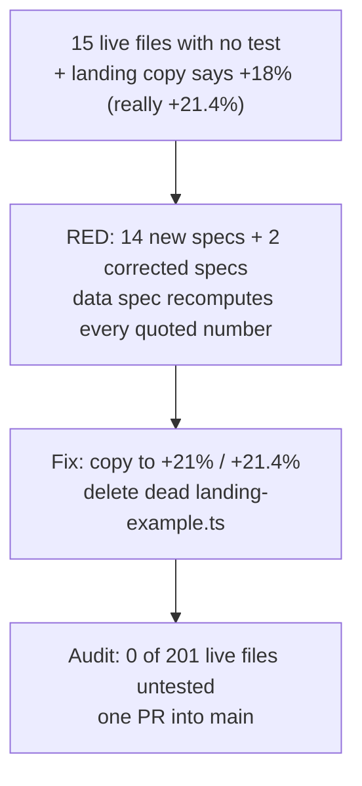

## Close the last live test gaps (and fix the +18% landing claim they uncovered)

**TL;DR.** Fifteen live files still have no test of their own:
- the 7 web proxy routes that sit between the browser and the API;
- the 4 untested `@repo/ui` primitives, plus their class-merging helper;
- the API's startup wiring;
- two landing-page data files.

While checking the landing data, the copy turned out to state a wrong number. A $0.42 → $0.51 price rise is quoted as "+18%" in four places, but it is +21.4%. The 18% is measured from the new price instead of the agreed one, like saying a $100 → $121 raise is 17%.

This PR does three things:
- It adds the missing specs. The landing data spec recomputes every quoted number from the prices beside it, so this mistake cannot come back silently.
- It corrects the copy.
- It deletes one dead landing file instead of testing it.

Afterwards, 0 of 201 live files lack a test.

### Flowchart (high-level, SVG)

Rendered inline at plan review; stored here as mermaid.



### Task metadata

- **Classification:**
  - `BUG_FIX` · `Standard` · Marketing / Landing + Workspaces Frontend + UI + Platform / API (`docs/ai/module-ownership-map.md`) · Tiny (Marketing/Landing default), Standard overall (multi-package).
  - Test-only everywhere except the landing copy fix and the dead-file delete.
- **Contract areas:** API: no contract impact (no route or handler changes). Database: none. Permissions: none (the specs observe guards, nothing changes them). External integrations: none. Jobs: none.
- **Docs loaded:** `planning.md, plan-template.md`
- **Claims reversed while investigating:**
  1. "A missing cookie sends no Authorization header" was wrong. `proxyJson`/`proxyRaw` return 401 `{ message: 'Unauthorized' }` and never call the API (`apps/web/src/lib/http/auth-proxy.ts:17-19`, `:68-70`).
  2. "18 of 205 live files untested" became 15 of 202. `LineSidebar`, `ShinyText` and `SplitText` are imported only by `components/chat/{message-jump-rail,thinking-indicator,streaming-text}.tsx`, the disabled chat surface; the owner confirmed excluding them on 2026-10-03.
  3. "The landing data modules just need a shape test" was wrong. `landing-example.ts` has zero importers (`git grep` on `origin/main`; repo-map row says the same), so it is deleted instead (owner decision 2026-10-03). Writing the data spec exposed the +18% arithmetic error.
  4. "Landing visuals honour `prefers-reduced-motion`" was wrong. `ShinyText`/`SplitText` have no such branch. This is moot now that they are excluded.
  5. "Test-only PR, no `tdd:red`" was wrong. The copy fix is guarded source, so RED is required. The `regression:` cases in `landing-demo-docs.spec.ts` are the RED proof.
  6. The earlier "18" count treated controllers/guards/thin helpers covered by e2e or consumer specs as covered, by judgement. That rule is now written down as an explicit allow-list (Phase 3, audit script).
- **Root cause (copy bug):** `apps/web/src/lib/landing-demo-docs.ts` L03 `text` and `DEMO_HISTORY_ROWS[0].detail`, `product-cards.tsx` `delta` row and `workflow-steps.tsx` step 3 quote (0.51−0.42)/0.51 = 17.6% ≈ 18% (change over the new price). Increase copy elsewhere is measured over the agreed price: L05 quotes (2.05−1.80)/1.80 = 13.9%, which is correct. So L03 must read (0.51−0.42)/0.42 = 21.43%.
  - **Disproved if:** the L05 convention is the wrong one.
  - **RCA approved:** owner chose "Fix in this PR" on 2026-10-03.
- **Detected running model:** Opus 5.5 (`claude-opus-5-5`).
- **Recommended model:** `opus`, high; confidence high. Fallback: `sonnet`, high.
- **Minimum capability:** `sonnet`, medium. Every operation below is a literal block or a full file, and nothing is left to judgement except reading test output.
- **Branch:** `fix/no-ticket-test-gap-closeout`, from `origin/main` (`a763006`).
- **Release path:** one PR into `main`, "Create a merge commit"; the owner merges.
- **Required skills:** `/review` (pre-landing diff check). `/qa` is not needed: the only user-visible change is two numbers in static copy, checked by hand in Phase 3.
- **Execution preflight:** Phase 0.

### Layer 1 — human summary

Before this PR there are two problems:
1. The web app's proxy routes for invites, members, vendor detail, price terms, exception summary and catalog photos have never had a test of their own. The API behind them does; the thin forwarding layer does not.
2. Four UI primitives, the startup wiring and the landing demo data have no spec at all.

Coverage alone is not the goal. Each spec pins what a user can actually hit:
- not a member (403);
- wrong role (403);
- thing gone (404);
- malformed id (400);
- no session (401);
- the happy path with the exact backend URL, method and body.

The landing data spec takes a different approach: it treats marketing numbers as claims and recomputes them. That is how the +18% slip surfaced.

**Risk Matrix**

| Risk | Likelihood | Impact | Mitigation | Rollback |
|---|---|---|---|---|
| Deleting `landing-example.ts` breaks an importer | Low (`git grep` finds only comments and docs) | Build failure | `bun run type-check` + `bun run build` in Phase 3 | Revert the fix commit |
| CI `tdd:gate` reruns the PR's specs on the base and sees most of them pass (they cover existing code) | Certain | None: a RED needs at least one failing `error:`/`edge:`/`regression:` case (`judgeRed`, `scripts/ci/tdd-lib.mjs:296`) | The two `regression:` cases in `landing-demo-docs.spec.ts` fail on the base by construction | n/a |
| BFF specs assume `API_URL` unset (`http://localhost:3001`) | Low | Spec failures | Same assumption as the existing `download/route.spec.ts`, `change-password/route.spec.ts`, which are green in CI | n/a |
| `bootstrap.spec.ts` runs under the API unit `globalSetup`, which recreates `optra_unit` | Certain locally | Needs Postgres up | Phase 0 starts `postgres` + `redis` | n/a |
| Copy reads 21 in one place and 21.4 in another | By design | None: integer where the old copy was integer, one decimal where it had one (`+18.0%` → `+21.4%`) | Both specs derive the exact string from the data | Revert the fix commit |
| Pinning a bug as policy (malformed JSON body → 500) | — | — | Deliberately not asserted; listed under edge cases as a follow-up | n/a |

**Backward Compatibility Matrix.** Usage search: `git grep -n -E "LineSidebar|ShinyText|SplitText|landing-demo-docs|landing-example|HERO_MATCH_EXAMPLE|18%|\+18" origin/main -- apps/web apps/e2e docs`.

| Changed File / Symbol | Used By (outside this feature) | Breaks? | Handling |
|---|---|---|---|
| `apps/web/src/lib/landing-example.ts` / `HERO_MATCH_EXAMPLE` (deleted) | Nothing imports it. Named in comments `landing-demo-docs.ts:5,13`; repo-map row (`repository-map.md:188`); dated history in `DESIGN.md:72` and `module-ownership-map.md:64` | No | Comments and the repo-map row are edited here. The two dated history entries stay as history. |
| `DEMO_DOCS[0].lines[1].text` (L03) | `landing/hero-match-demo.tsx`, `landing/product-tour.tsx` and their specs (data-derived; no `18%` literal, per the grep) | No | Affected, NOT modified |
| `DEMO_HISTORY_ROWS[0].detail` | `landing/product-cards.tsx` (renders `${date} · ${detail}`), `product-cards.spec.tsx` (derives from the array) | No | Affected, NOT modified |
| `product-cards.tsx` delta literal | `apps/web/app/page.tsx` composition; `product-cards.spec.tsx` | Spec yes | Spec updated in Phase 1 to derive the value |
| `workflow-steps.tsx` step-3 literal | `apps/web/app/page.tsx`; `workflow-steps.spec.tsx` | Spec yes | Spec updated in Phase 1 to derive the value |
| `apps/web/app/opengraph-image.png` | — | No | Checked visually: the image carries no figure (the `git grep` hit was a binary false match) |

**Blast radius (complete file list):**
- 14 new specs:
  - `apps/web/app/api/invitations/accept/[token]/route.spec.ts`
  - `apps/web/app/api/workspaces/[id]/invite/route.spec.ts`
  - `apps/web/app/api/workspaces/[id]/members/[userId]/route.spec.ts`
  - `apps/web/app/api/workspaces/[id]/vendors/[vendorId]/route.spec.ts`
  - `apps/web/app/api/workspaces/[id]/vendors/[vendorId]/price-terms/route.spec.ts`
  - `apps/web/app/api/workspaces/[id]/vendors/[vendorId]/exception-summary/route.spec.ts`
  - `apps/web/app/api/workspaces/[id]/catalog-items/[itemId]/photo/route.spec.ts`
  - `packages/ui/src/components/ui/{avatar,select,separator,textarea}.spec.tsx`
  - `packages/ui/src/lib/utils.spec.ts`
  - `apps/api/src/bootstrap.spec.ts`
  - `apps/web/src/lib/landing-demo-docs.spec.ts`
- 2 modified specs: `apps/web/src/components/landing/{product-cards,workflow-steps}.spec.tsx`.
- 3 modified sources: `apps/web/src/lib/landing-demo-docs.ts`, `apps/web/src/components/landing/{product-cards,workflow-steps}.tsx`.
- 1 deleted source: `apps/web/src/lib/landing-example.ts`.
- Docs:
  - `docs/plans/fix-test-gap-closeout.md` (new)
  - `docs/ai/file-index/repository-map.md`
  - `docs/ai/module-ownership-map.md`
  - `docs/ai/testing-strategy.md`
  - `learnings.md`
  - `graphify-out/**` (closeout output)
- External users: none.

### Layer 2 — execution spec

All phases run on (`opus`, high). The pair never changes, so execution continues through every phase with no switch stop.

#### Phase 0 — Preflight (`opus`, high)

1. From the primary checkout `/Users/romeoangelesjr/Documents/personal/optra`, run:
   ```bash
   git fetch origin
   scripts/new-task-worktree.sh fix test-gap-closeout origin/main
   ```
2. Set up the new worktree (`W` is the path the script prints):
   - `cp .env "$W/.env"`
   - `cd "$W" && bun install --frozen-lockfile --force`
   - `cp /Users/romeoangelesjr/Documents/personal/optra/node_modules/duckdb/lib/binding/duckdb.node "$W/node_modules/duckdb/lib/binding/duckdb.node"` (shell Node is v25 and the duckdb build fails; the primary checkout holds a working binding).
   - `bunx turbo run build --filter=@repo/db --filter=@repo/ai --filter=@repo/types`
   - `docker compose up -d --wait postgres redis`
3. Write `.claude/.plan-ack` in the worktree: `{"size":"standard","plan":"approved","matrices":"present"}`. Write it only after the owner approves this plan.
4. Copy this plan file verbatim to `docs/plans/fix-test-gap-closeout.md`.
5. Dispatch `project-manager` (caveman ultra + persona line) to confirm the Acceptance map below against this plan. It works read-only, writes no spec of its own, and stops if it finds a contradiction.

Done: the worktree is on `fix/no-ticket-test-gap-closeout` at `origin/main`, the packages are built, and Postgres and Redis are healthy.

#### Phase 1 — RED (`opus`, high)

Create each file below with exactly this content. Titles are ordered `error:` > `edge:` > `regression:` > `happy:` within each file. No `it.each`: the title checker only reads literal `it('…')` titles (`CALL_RE`, `scripts/ci/tdd-lib.mjs:193`).

**1.1 `apps/web/app/api/invitations/accept/[token]/route.spec.ts`**
```ts
import { afterEach, describe, expect, it, vi } from 'vitest'
import { NextRequest } from 'next/server'
import { POST } from './route'

const TOKEN = 'ab'.repeat(32)
const BACKEND_URL = `http://localhost:3001/workspaces/accept-invite/${TOKEN}`

function jsonResponse(status: number, body: unknown) {
  return new Response(JSON.stringify(body), { status, headers: { 'Content-Type': 'application/json' } })
}

function stubBackend(response: Response) {
  const fetchMock = vi.fn().mockResolvedValue(response)
  vi.stubGlobal('fetch', fetchMock)
  return fetchMock
}

function acceptRequest(cookie: string | null = 'mnemra_at=test-access-token') {
  return new NextRequest(`http://localhost:3000/api/invitations/accept/${TOKEN}`, {
    method: 'POST',
    headers: cookie ? { cookie } : {},
  })
}

function params() {
  return { params: Promise.resolve({ token: TOKEN }) }
}

describe('POST /api/invitations/accept/[token] proxy', () => {
  afterEach(() => {
    vi.unstubAllGlobals()
  })

  it('error: an unknown invitation returns the API 404 unchanged', async () => {
    stubBackend(jsonResponse(404, { message: 'Invitation not found', error: 'Not Found', statusCode: 404 }))

    const response = await POST(acceptRequest(), params())

    expect(response.status).toBe(404)
    await expect(response.json()).resolves.toEqual({ message: 'Invitation not found', error: 'Not Found', statusCode: 404 })
  })

  it('error: an invitation sent to another address returns the API 400 unchanged', async () => {
    const body = { message: 'Invitation email does not match logged-in user', error: 'Bad Request', statusCode: 400 }
    stubBackend(jsonResponse(400, body))

    const response = await POST(acceptRequest(), params())

    expect(response.status).toBe(400)
    await expect(response.json()).resolves.toEqual(body)
  })

  it('error: an expired invitation returns the API 400 unchanged', async () => {
    stubBackend(jsonResponse(400, { message: 'Invitation expired', error: 'Bad Request', statusCode: 400 }))

    const response = await POST(acceptRequest(), params())

    expect(response.status).toBe(400)
    await expect(response.json()).resolves.toEqual({ message: 'Invitation expired', error: 'Bad Request', statusCode: 400 })
  })

  it('edge: returns 401 without calling the API when the session cookie is missing', async () => {
    const fetchMock = vi.fn()
    vi.stubGlobal('fetch', fetchMock)

    const response = await POST(acceptRequest(null), params())

    expect(response.status).toBe(401)
    await expect(response.json()).resolves.toEqual({ message: 'Unauthorized' })
    expect(fetchMock).not.toHaveBeenCalled()
  })

  it('happy: accepts the invite as the signed-in user and returns the workspace', async () => {
    const workspace = { id: '6f1c2a40-0d5e-4b7a-9c11-2e8f4a3b5c01', name: 'Ironclad buyers' }
    const fetchMock = stubBackend(jsonResponse(200, workspace))

    const response = await POST(acceptRequest(), params())

    expect(fetchMock).toHaveBeenCalledWith(BACKEND_URL, {
      method: 'POST',
      headers: { Authorization: 'Bearer test-access-token' },
      body: undefined,
    })
    expect(response.status).toBe(200)
    await expect(response.json()).resolves.toEqual(workspace)
  })
})
```

**1.2 `apps/web/app/api/workspaces/[id]/invite/route.spec.ts`**
```ts
import { afterEach, describe, expect, it, vi } from 'vitest'
import { NextRequest } from 'next/server'
import { POST } from './route'

const WORKSPACE_ID = '6f1c2a40-0d5e-4b7a-9c11-2e8f4a3b5c01'
const BACKEND_URL = `http://localhost:3001/workspaces/${WORKSPACE_ID}/invite`

function jsonResponse(status: number, body: unknown) {
  return new Response(JSON.stringify(body), { status, headers: { 'Content-Type': 'application/json' } })
}

function stubBackend(response: Response) {
  const fetchMock = vi.fn().mockResolvedValue(response)
  vi.stubGlobal('fetch', fetchMock)
  return fetchMock
}

function inviteRequest(body: unknown, cookie: string | null = 'mnemra_at=test-access-token') {
  return new NextRequest(`http://localhost:3000/api/workspaces/${WORKSPACE_ID}/invite`, {
    method: 'POST',
    headers: { 'content-type': 'application/json', ...(cookie ? { cookie } : {}) },
    body: JSON.stringify(body),
  })
}

function params() {
  return { params: Promise.resolve({ id: WORKSPACE_ID }) }
}

describe('POST /api/workspaces/[id]/invite proxy', () => {
  afterEach(() => {
    vi.unstubAllGlobals()
  })

  it('error: a member without the owner or admin role gets the API 403 unchanged', async () => {
    const body = { message: 'Insufficient workspace role', error: 'Forbidden', statusCode: 403 }
    stubBackend(jsonResponse(403, body))

    const response = await POST(inviteRequest({ email: 'buyer@example.com' }), params())

    expect(response.status).toBe(403)
    await expect(response.json()).resolves.toEqual(body)
  })

  it('error: a caller outside the workspace gets the API 403 unchanged', async () => {
    const body = { message: 'Not a member of this workspace', error: 'Forbidden', statusCode: 403 }
    stubBackend(jsonResponse(403, body))

    const response = await POST(inviteRequest({ email: 'buyer@example.com' }), params())

    expect(response.status).toBe(403)
    await expect(response.json()).resolves.toEqual(body)
  })

  it('edge: an invalid email comes back as the API validation 400', async () => {
    const body = { message: ['email must be an email'], error: 'Bad Request', statusCode: 400 }
    stubBackend(jsonResponse(400, body))

    const response = await POST(inviteRequest({ email: 'not-an-email' }), params())

    expect(response.status).toBe(400)
    await expect(response.json()).resolves.toEqual(body)
  })

  it('edge: returns 401 without calling the API when the session cookie is missing', async () => {
    const fetchMock = vi.fn()
    vi.stubGlobal('fetch', fetchMock)

    const response = await POST(inviteRequest({ email: 'buyer@example.com' }, null), params())

    expect(response.status).toBe(401)
    await expect(response.json()).resolves.toEqual({ message: 'Unauthorized' })
    expect(fetchMock).not.toHaveBeenCalled()
  })

  it('happy: forwards the invite email as JSON with the bearer token', async () => {
    const fetchMock = stubBackend(jsonResponse(201, { message: 'Invite sent' }))

    const response = await POST(inviteRequest({ email: 'buyer@example.com' }), params())

    expect(fetchMock).toHaveBeenCalledWith(BACKEND_URL, {
      method: 'POST',
      headers: { Authorization: 'Bearer test-access-token', 'Content-Type': 'application/json' },
      body: JSON.stringify({ email: 'buyer@example.com' }),
    })
    expect(response.status).toBe(201)
    await expect(response.json()).resolves.toEqual({ message: 'Invite sent' })
  })
})
```

**1.3 `apps/web/app/api/workspaces/[id]/members/[userId]/route.spec.ts`**
```ts
import { afterEach, describe, expect, it, vi } from 'vitest'
import { NextRequest } from 'next/server'
import { DELETE } from './route'

const WORKSPACE_ID = '6f1c2a40-0d5e-4b7a-9c11-2e8f4a3b5c01'
const USER_ID = 'c2b1a0f9-8e7d-4c6b-9a5f-4e3d2c1b0a99'

function jsonResponse(status: number, body: unknown) {
  return new Response(JSON.stringify(body), { status, headers: { 'Content-Type': 'application/json' } })
}

function stubBackend(response: Response) {
  const fetchMock = vi.fn().mockResolvedValue(response)
  vi.stubGlobal('fetch', fetchMock)
  return fetchMock
}

function removeRequest(userId: string, cookie: string | null = 'mnemra_at=test-access-token') {
  return new NextRequest(`http://localhost:3000/api/workspaces/${WORKSPACE_ID}/members/${userId}`, {
    method: 'DELETE',
    headers: cookie ? { cookie } : {},
  })
}

function params(userId: string) {
  return { params: Promise.resolve({ id: WORKSPACE_ID, userId }) }
}

describe('DELETE /api/workspaces/[id]/members/[userId] proxy', () => {
  afterEach(() => {
    vi.unstubAllGlobals()
  })

  it('error: an admin (the route is owner-only) gets the API 403 unchanged', async () => {
    const body = { message: 'Insufficient workspace role', error: 'Forbidden', statusCode: 403 }
    stubBackend(jsonResponse(403, body))

    const response = await DELETE(removeRequest(USER_ID), params(USER_ID))

    expect(response.status).toBe(403)
    await expect(response.json()).resolves.toEqual(body)
  })

  it('error: removing the last owner gets the API 403 unchanged', async () => {
    const body = { message: 'Cannot remove the last owner', error: 'Forbidden', statusCode: 403 }
    stubBackend(jsonResponse(403, body))

    const response = await DELETE(removeRequest(USER_ID), params(USER_ID))

    expect(response.status).toBe(403)
    await expect(response.json()).resolves.toEqual(body)
  })

  it('error: a user who is not in the workspace gets the API 404 unchanged', async () => {
    const body = { message: 'Workspace member not found', error: 'Not Found', statusCode: 404 }
    stubBackend(jsonResponse(404, body))

    const response = await DELETE(removeRequest(USER_ID), params(USER_ID))

    expect(response.status).toBe(404)
    await expect(response.json()).resolves.toEqual(body)
  })

  it('edge: a malformed user id reaches the API as-is and its 400 comes back', async () => {
    const body = { message: 'Validation failed (uuid is expected)', error: 'Bad Request', statusCode: 400 }
    const fetchMock = stubBackend(jsonResponse(400, body))

    const response = await DELETE(removeRequest('not-a-uuid'), params('not-a-uuid'))

    expect(fetchMock.mock.calls[0][0]).toBe(`http://localhost:3001/workspaces/${WORKSPACE_ID}/members/not-a-uuid`)
    expect(response.status).toBe(400)
    await expect(response.json()).resolves.toEqual(body)
  })

  it('edge: returns 401 without calling the API when the session cookie is missing', async () => {
    const fetchMock = vi.fn()
    vi.stubGlobal('fetch', fetchMock)

    const response = await DELETE(removeRequest(USER_ID, null), params(USER_ID))

    expect(response.status).toBe(401)
    expect(fetchMock).not.toHaveBeenCalled()
  })

  it('happy: sends DELETE with the bearer token and no body, and returns the API answer', async () => {
    const fetchMock = stubBackend(jsonResponse(200, { message: 'Member removed' }))

    const response = await DELETE(removeRequest(USER_ID), params(USER_ID))

    expect(fetchMock).toHaveBeenCalledWith(`http://localhost:3001/workspaces/${WORKSPACE_ID}/members/${USER_ID}`, {
      method: 'DELETE',
      headers: { Authorization: 'Bearer test-access-token' },
      body: undefined,
    })
    expect(response.status).toBe(200)
    await expect(response.json()).resolves.toEqual({ message: 'Member removed' })
  })
})
```

**1.4 `apps/web/app/api/workspaces/[id]/vendors/[vendorId]/route.spec.ts`**
```ts
import { afterEach, describe, expect, it, vi } from 'vitest'
import { NextRequest } from 'next/server'
import { GET } from './route'

const WORKSPACE_ID = '6f1c2a40-0d5e-4b7a-9c11-2e8f4a3b5c01'
const VENDOR_ID = '9a3e5b12-7c4d-4e8f-a1b2-c3d4e5f60718'

function jsonResponse(status: number, body: unknown) {
  return new Response(JSON.stringify(body), { status, headers: { 'Content-Type': 'application/json' } })
}

function stubBackend(response: Response) {
  const fetchMock = vi.fn().mockResolvedValue(response)
  vi.stubGlobal('fetch', fetchMock)
  return fetchMock
}

function vendorRequest(vendorId: string, cookie: string | null = 'mnemra_at=test-access-token') {
  return new NextRequest(`http://localhost:3000/api/workspaces/${WORKSPACE_ID}/vendors/${vendorId}`, {
    method: 'GET',
    headers: cookie ? { cookie } : {},
  })
}

function params(vendorId: string) {
  return { params: Promise.resolve({ id: WORKSPACE_ID, vendorId }) }
}

describe('GET /api/workspaces/[id]/vendors/[vendorId] proxy', () => {
  afterEach(() => {
    vi.unstubAllGlobals()
  })

  it("error: another workspace's vendor id returns the API 404 unchanged", async () => {
    const body = { message: 'Vendor not found', error: 'Not Found', statusCode: 404 }
    stubBackend(jsonResponse(404, body))

    const response = await GET(vendorRequest(VENDOR_ID), params(VENDOR_ID))

    expect(response.status).toBe(404)
    await expect(response.json()).resolves.toEqual(body)
  })

  it('error: a caller outside the workspace gets the API 403 unchanged', async () => {
    const body = { message: 'Not a member of this workspace', error: 'Forbidden', statusCode: 403 }
    stubBackend(jsonResponse(403, body))

    const response = await GET(vendorRequest(VENDOR_ID), params(VENDOR_ID))

    expect(response.status).toBe(403)
    await expect(response.json()).resolves.toEqual(body)
  })

  it('edge: a malformed vendor id reaches the API as-is and its 400 comes back', async () => {
    const body = { message: 'Validation failed (uuid is expected)', error: 'Bad Request', statusCode: 400 }
    const fetchMock = stubBackend(jsonResponse(400, body))

    const response = await GET(vendorRequest('not-a-uuid'), params('not-a-uuid'))

    expect(fetchMock.mock.calls[0][0]).toBe(`http://localhost:3001/workspaces/${WORKSPACE_ID}/vendors/not-a-uuid`)
    expect(response.status).toBe(400)
    await expect(response.json()).resolves.toEqual(body)
  })

  it('edge: returns 401 without calling the API when the session cookie is missing', async () => {
    const fetchMock = vi.fn()
    vi.stubGlobal('fetch', fetchMock)

    const response = await GET(vendorRequest(VENDOR_ID, null), params(VENDOR_ID))

    expect(response.status).toBe(401)
    expect(fetchMock).not.toHaveBeenCalled()
  })

  it('happy: fetches the vendor with the bearer token and returns it', async () => {
    const vendor = { id: VENDOR_ID, name: 'Ironclad Supply' }
    const fetchMock = stubBackend(jsonResponse(200, vendor))

    const response = await GET(vendorRequest(VENDOR_ID), params(VENDOR_ID))

    expect(fetchMock).toHaveBeenCalledWith(`http://localhost:3001/workspaces/${WORKSPACE_ID}/vendors/${VENDOR_ID}`, {
      method: 'GET',
      headers: { Authorization: 'Bearer test-access-token' },
      body: undefined,
    })
    expect(response.status).toBe(200)
    await expect(response.json()).resolves.toEqual(vendor)
  })
})
```

**1.5 `apps/web/app/api/workspaces/[id]/vendors/[vendorId]/price-terms/route.spec.ts`**
```ts
import { afterEach, describe, expect, it, vi } from 'vitest'
import { NextRequest } from 'next/server'
import { GET, POST } from './route'

const WORKSPACE_ID = '6f1c2a40-0d5e-4b7a-9c11-2e8f4a3b5c01'
const VENDOR_ID = '9a3e5b12-7c4d-4e8f-a1b2-c3d4e5f60718'
const PAGE_URL = `http://localhost:3000/api/workspaces/${WORKSPACE_ID}/vendors/${VENDOR_ID}/price-terms`
const BACKEND_URL = `http://localhost:3001/workspaces/${WORKSPACE_ID}/vendors/${VENDOR_ID}/price-terms`
const TERM = { sku: 'IRN-38HXB', unitPrice: '0.42', currency: 'USD', effectiveFrom: '2026-01-01' }

function jsonResponse(status: number, body: unknown) {
  return new Response(JSON.stringify(body), { status, headers: { 'Content-Type': 'application/json' } })
}

function stubBackend(response: Response) {
  const fetchMock = vi.fn().mockResolvedValue(response)
  vi.stubGlobal('fetch', fetchMock)
  return fetchMock
}

function listRequest(cookie: string | null = 'mnemra_at=test-access-token') {
  return new NextRequest(PAGE_URL, { method: 'GET', headers: cookie ? { cookie } : {} })
}

function createRequest(body: unknown, cookie: string | null = 'mnemra_at=test-access-token') {
  return new NextRequest(PAGE_URL, {
    method: 'POST',
    headers: { 'content-type': 'application/json', ...(cookie ? { cookie } : {}) },
    body: JSON.stringify(body),
  })
}

function params() {
  return { params: Promise.resolve({ id: WORKSPACE_ID, vendorId: VENDOR_ID }) }
}

describe('/api/workspaces/[id]/vendors/[vendorId]/price-terms proxy', () => {
  afterEach(() => {
    vi.unstubAllGlobals()
  })

  it("error: GET for another workspace's vendor returns the API 404 unchanged", async () => {
    const body = { message: 'Vendor not found', error: 'Not Found', statusCode: 404 }
    stubBackend(jsonResponse(404, body))

    const response = await GET(listRequest(), params())

    expect(response.status).toBe(404)
    await expect(response.json()).resolves.toEqual(body)
  })

  it('error: POST by a member without the owner or admin role gets the API 403 unchanged', async () => {
    const body = { message: 'Insufficient workspace role', error: 'Forbidden', statusCode: 403 }
    stubBackend(jsonResponse(403, body))

    const response = await POST(createRequest(TERM), params())

    expect(response.status).toBe(403)
    await expect(response.json()).resolves.toEqual(body)
  })

  it('error: POST backdated behind a live price returns the API 400 unchanged', async () => {
    const body = {
      message: 'A price for this item is already effective from that date or later. Record the new price from a later date',
      error: 'Bad Request',
      statusCode: 400,
    }
    stubBackend(jsonResponse(400, body))

    const response = await POST(createRequest(TERM), params())

    expect(response.status).toBe(400)
    await expect(response.json()).resolves.toEqual(body)
  })

  it('edge: POST with a numeric unit price comes back as the API validation 400', async () => {
    const body = {
      message: ['unitPrice must be a non-negative decimal number, given as a string'],
      error: 'Bad Request',
      statusCode: 400,
    }
    stubBackend(jsonResponse(400, body))

    const response = await POST(createRequest({ ...TERM, unitPrice: 0.42 }), params())

    expect(response.status).toBe(400)
    await expect(response.json()).resolves.toEqual(body)
  })

  it('edge: GET and POST return 401 without calling the API when the session cookie is missing', async () => {
    const fetchMock = vi.fn()
    vi.stubGlobal('fetch', fetchMock)

    const list = await GET(listRequest(null), params())
    const create = await POST(createRequest(TERM, null), params())

    expect(list.status).toBe(401)
    expect(create.status).toBe(401)
    expect(fetchMock).not.toHaveBeenCalled()
  })

  it('happy: GET lists the price terms with the bearer token', async () => {
    const terms = [{ ...TERM, id: 'b1c2d3e4-f5a6-4b7c-8d9e-0f1a2b3c4d5e', effectiveTo: null }]
    const fetchMock = stubBackend(jsonResponse(200, terms))

    const response = await GET(listRequest(), params())

    expect(fetchMock).toHaveBeenCalledWith(BACKEND_URL, {
      method: 'GET',
      headers: { Authorization: 'Bearer test-access-token' },
      body: undefined,
    })
    expect(response.status).toBe(200)
    await expect(response.json()).resolves.toEqual(terms)
  })

  it('happy: POST forwards the new price term as JSON and returns the created row', async () => {
    const created = { ...TERM, id: 'b1c2d3e4-f5a6-4b7c-8d9e-0f1a2b3c4d5e', effectiveTo: null }
    const fetchMock = stubBackend(jsonResponse(201, created))

    const response = await POST(createRequest(TERM), params())

    expect(fetchMock).toHaveBeenCalledWith(BACKEND_URL, {
      method: 'POST',
      headers: { Authorization: 'Bearer test-access-token', 'Content-Type': 'application/json' },
      body: JSON.stringify(TERM),
    })
    expect(response.status).toBe(201)
    await expect(response.json()).resolves.toEqual(created)
  })
})
```

**1.6 `apps/web/app/api/workspaces/[id]/vendors/[vendorId]/exception-summary/route.spec.ts`**
```ts
import { afterEach, describe, expect, it, vi } from 'vitest'
import { NextRequest } from 'next/server'
import { GET } from './route'

const WORKSPACE_ID = '6f1c2a40-0d5e-4b7a-9c11-2e8f4a3b5c01'
const VENDOR_ID = '9a3e5b12-7c4d-4e8f-a1b2-c3d4e5f60718'

function jsonResponse(status: number, body: unknown) {
  return new Response(JSON.stringify(body), { status, headers: { 'Content-Type': 'application/json' } })
}

function stubBackend(response: Response) {
  const fetchMock = vi.fn().mockResolvedValue(response)
  vi.stubGlobal('fetch', fetchMock)
  return fetchMock
}

function summaryRequest(vendorId: string, cookie: string | null = 'mnemra_at=test-access-token') {
  return new NextRequest(`http://localhost:3000/api/workspaces/${WORKSPACE_ID}/vendors/${vendorId}/exception-summary`, {
    method: 'GET',
    headers: cookie ? { cookie } : {},
  })
}

function params(vendorId: string) {
  return { params: Promise.resolve({ id: WORKSPACE_ID, vendorId }) }
}

describe('GET /api/workspaces/[id]/vendors/[vendorId]/exception-summary proxy', () => {
  afterEach(() => {
    vi.unstubAllGlobals()
  })

  it('error: a caller outside the workspace gets the API 403 unchanged', async () => {
    const body = { message: 'Not a member of this workspace', error: 'Forbidden', statusCode: 403 }
    stubBackend(jsonResponse(403, body))

    const response = await GET(summaryRequest(VENDOR_ID), params(VENDOR_ID))

    expect(response.status).toBe(403)
    await expect(response.json()).resolves.toEqual(body)
  })

  it("error: another workspace's vendor id returns the API 404 unchanged", async () => {
    const body = { message: 'Vendor not found', error: 'Not Found', statusCode: 404 }
    stubBackend(jsonResponse(404, body))

    const response = await GET(summaryRequest(VENDOR_ID), params(VENDOR_ID))

    expect(response.status).toBe(404)
    await expect(response.json()).resolves.toEqual(body)
  })

  it('edge: a malformed vendor id reaches the API as-is and its 400 comes back', async () => {
    const body = { message: 'Validation failed (uuid is expected)', error: 'Bad Request', statusCode: 400 }
    const fetchMock = stubBackend(jsonResponse(400, body))

    const response = await GET(summaryRequest('not-a-uuid'), params('not-a-uuid'))

    expect(fetchMock.mock.calls[0][0]).toBe(
      `http://localhost:3001/workspaces/${WORKSPACE_ID}/vendors/not-a-uuid/exception-summary`,
    )
    expect(response.status).toBe(400)
    await expect(response.json()).resolves.toEqual(body)
  })

  it('edge: returns 401 without calling the API when the session cookie is missing', async () => {
    const fetchMock = vi.fn()
    vi.stubGlobal('fetch', fetchMock)

    const response = await GET(summaryRequest(VENDOR_ID, null), params(VENDOR_ID))

    expect(response.status).toBe(401)
    expect(fetchMock).not.toHaveBeenCalled()
  })

  it('happy: fetches the summary with the bearer token and returns it', async () => {
    const summary = { openFlags: 2, resolvedFlags: 5 }
    const fetchMock = stubBackend(jsonResponse(200, summary))

    const response = await GET(summaryRequest(VENDOR_ID), params(VENDOR_ID))

    expect(fetchMock).toHaveBeenCalledWith(
      `http://localhost:3001/workspaces/${WORKSPACE_ID}/vendors/${VENDOR_ID}/exception-summary`,
      { method: 'GET', headers: { Authorization: 'Bearer test-access-token' }, body: undefined },
    )
    expect(response.status).toBe(200)
    await expect(response.json()).resolves.toEqual(summary)
  })
})
```
(The summary body is an opaque passthrough fixture. The proxy does not read it, so this spec makes no claim about its shape.)

**1.7 `apps/web/app/api/workspaces/[id]/catalog-items/[itemId]/photo/route.spec.ts`**
```ts
import { afterEach, describe, expect, it, vi } from 'vitest'
import { NextRequest } from 'next/server'
import { GET } from './route'

const WORKSPACE_ID = '6f1c2a40-0d5e-4b7a-9c11-2e8f4a3b5c01'
const ITEM_ID = '0b7f3c9e-2a1d-4e5f-8a6b-7c8d9e0f1a2b'
const PNG_BYTES = new Uint8Array([0x89, 0x50, 0x4e, 0x47, 0x0d, 0x0a, 0x1a, 0x0a])

function jsonResponse(status: number, body: unknown) {
  return new Response(JSON.stringify(body), { status, headers: { 'Content-Type': 'application/json' } })
}

function stubBackend(response: Response) {
  const fetchMock = vi.fn().mockResolvedValue(response)
  vi.stubGlobal('fetch', fetchMock)
  return fetchMock
}

function photoRequest(itemId: string, cookie: string | null = 'mnemra_at=test-access-token') {
  return new NextRequest(`http://localhost:3000/api/workspaces/${WORKSPACE_ID}/catalog-items/${itemId}/photo`, {
    method: 'GET',
    headers: cookie ? { cookie } : {},
  })
}

function params(itemId: string) {
  return { params: Promise.resolve({ id: WORKSPACE_ID, itemId }) }
}

describe('GET /api/workspaces/[id]/catalog-items/[itemId]/photo proxy', () => {
  afterEach(() => {
    vi.unstubAllGlobals()
  })

  it('error: an item with no stored photo returns the API 404 and its reason', async () => {
    const body = { message: 'Catalog item has no photo', error: 'Not Found', statusCode: 404 }
    stubBackend(jsonResponse(404, body))

    const response = await GET(photoRequest(ITEM_ID), params(ITEM_ID))

    expect(response.status).toBe(404)
    expect(response.headers.get('Content-Type')).toBe('application/json')
    await expect(response.json()).resolves.toEqual(body)
  })

  it('error: a caller outside the workspace gets the API 403', async () => {
    const body = { message: 'Not a member of this workspace', error: 'Forbidden', statusCode: 403 }
    stubBackend(jsonResponse(403, body))

    const response = await GET(photoRequest(ITEM_ID), params(ITEM_ID))

    expect(response.status).toBe(403)
    await expect(response.json()).resolves.toEqual(body)
  })

  it('edge: a malformed item id reaches the API as-is and its 400 comes back', async () => {
    const body = { message: 'Validation failed (uuid is expected)', error: 'Bad Request', statusCode: 400 }
    const fetchMock = stubBackend(jsonResponse(400, body))

    const response = await GET(photoRequest('not-a-uuid'), params('not-a-uuid'))

    expect(fetchMock.mock.calls[0][0]).toBe(
      `http://localhost:3001/workspaces/${WORKSPACE_ID}/catalog-items/not-a-uuid/photo`,
    )
    expect(response.status).toBe(400)
  })

  it('edge: returns 401 without calling the API when the session cookie is missing', async () => {
    const fetchMock = vi.fn()
    vi.stubGlobal('fetch', fetchMock)

    const response = await GET(photoRequest(ITEM_ID, null), params(ITEM_ID))

    expect(response.status).toBe(401)
    expect(fetchMock).not.toHaveBeenCalled()
  })

  it('edge: headers outside the allow-list never reach the browser', async () => {
    stubBackend(
      new Response(PNG_BYTES, {
        status: 200,
        headers: {
          'Content-Type': 'image/png',
          'X-Powered-By': 'Express',
          ETag: 'W/"8-abc"',
          'Access-Control-Allow-Origin': '*',
        },
      }),
    )

    const response = await GET(photoRequest(ITEM_ID), params(ITEM_ID))

    expect(response.headers.get('Content-Type')).toBe('image/png')
    expect(response.headers.get('X-Powered-By')).toBeNull()
    expect(response.headers.get('ETag')).toBeNull()
    expect(response.headers.get('Access-Control-Allow-Origin')).toBeNull()
  })

  it("happy: streams the photo bytes with the API's type, length, cache and nosniff headers", async () => {
    const fetchMock = stubBackend(
      new Response(PNG_BYTES, {
        status: 200,
        headers: {
          'Content-Type': 'image/png',
          'Content-Length': '8',
          'Cache-Control': 'private, max-age=86400',
          'X-Content-Type-Options': 'nosniff',
        },
      }),
    )

    const response = await GET(photoRequest(ITEM_ID), params(ITEM_ID))

    expect(fetchMock).toHaveBeenCalledWith(
      `http://localhost:3001/workspaces/${WORKSPACE_ID}/catalog-items/${ITEM_ID}/photo`,
      { method: 'GET', headers: { Authorization: 'Bearer test-access-token' }, body: undefined },
    )
    expect(response.status).toBe(200)
    expect(response.headers.get('Content-Type')).toBe('image/png')
    expect(response.headers.get('Content-Length')).toBe('8')
    expect(response.headers.get('Cache-Control')).toBe('private, max-age=86400')
    expect(response.headers.get('X-Content-Type-Options')).toBe('nosniff')
    expect(new Uint8Array(await response.arrayBuffer())).toEqual(PNG_BYTES)
  })
})
```

**1.8 `packages/ui/src/lib/utils.spec.ts`.** The four outputs below were verified on 2026-10-03 against `tailwind-merge@2.6.1` and `clsx@2.1.1` (`bun.lock`).
```ts
import { describe, expect, it } from 'vitest'
import { cn } from './utils'

describe('cn', () => {
  it('edge: drops falsy inputs', () => {
    expect(cn('px-2', false, null, undefined, '')).toBe('px-2')
  })

  it('edge: a later conflicting Tailwind class replaces the earlier one', () => {
    expect(cn('px-2 py-1', 'px-4')).toBe('py-1 px-4')
  })

  it('edge: arbitrary values conflict with named ones in the same group', () => {
    expect(cn('rounded-[12px]', 'rounded-full')).toBe('rounded-full')
  })

  it('happy: joins conditional object and nested array inputs', () => {
    expect(cn('a', { b: true, c: false }, ['d', ['e']])).toBe('a b d e')
  })
})
```

**1.9 `packages/ui/src/components/ui/avatar.spec.tsx`**
```tsx
/** @vitest-environment jsdom */

import * as React from 'react'
import { cleanup, render, screen } from '@testing-library/react'
import { afterEach, describe, expect, it } from 'vitest'
import { Avatar, AvatarFallback, AvatarImage } from './avatar'

afterEach(() => {
  cleanup()
})

describe('Avatar', () => {
  it('edge: a caller size replaces the 40px default instead of stacking with it', () => {
    render(<Avatar data-testid="avatar" className="h-6 w-6" />)
    const className = screen.getByTestId('avatar').className
    expect(className).toContain('h-6')
    expect(className).toContain('w-6')
    expect(className).not.toContain('h-10')
    expect(className).not.toContain('w-10')
    expect(className).toContain('rounded-full')
  })

  it('edge: forwards refs to the root, the image and the fallback', () => {
    const rootRef = React.createRef<HTMLDivElement>()
    const imageRef = React.createRef<HTMLImageElement>()
    const fallbackRef = React.createRef<HTMLDivElement>()
    render(
      <Avatar ref={rootRef}>
        <AvatarImage ref={imageRef} src="/avatars/ana.png" alt="Ana Reyes" />
        <AvatarFallback ref={fallbackRef}>AR</AvatarFallback>
      </Avatar>,
    )
    expect(rootRef.current).toBeInstanceOf(HTMLDivElement)
    expect(imageRef.current).toBeInstanceOf(HTMLImageElement)
    expect(fallbackRef.current?.textContent).toBe('AR')
  })

  it('happy: renders the image with its alt text and the fallback initials', () => {
    render(
      <Avatar>
        <AvatarImage src="/avatars/ana.png" alt="Ana Reyes" />
        <AvatarFallback>AR</AvatarFallback>
      </Avatar>,
    )
    const image = screen.getByRole('img', { name: 'Ana Reyes' })
    expect(image.getAttribute('src')).toBe('/avatars/ana.png')
    expect(image.className).toContain('aspect-square')
    expect(screen.getByText('AR').className).toContain('bg-muted')
  })
})
```

**1.10 `packages/ui/src/components/ui/separator.spec.tsx`**
```tsx
/** @vitest-environment jsdom */

import * as React from 'react'
import { cleanup, render, screen } from '@testing-library/react'
import { afterEach, describe, expect, it } from 'vitest'
import { Separator } from './separator'

afterEach(() => {
  cleanup()
})

describe('Separator', () => {
  it('edge: vertical orientation draws a full-height 1px rule', () => {
    render(<Separator data-testid="rule" orientation="vertical" />)
    const className = screen.getByTestId('rule').className
    expect(className).toContain('h-full')
    expect(className).toContain('w-[1px]')
    expect(className).not.toContain('h-[1px]')
  })

  it('edge: orientation is consumed, not leaked onto the DOM', () => {
    render(<Separator data-testid="rule" orientation="vertical" />)
    expect(screen.getByTestId('rule').hasAttribute('orientation')).toBe(false)
  })

  it('happy: defaults to a horizontal full-width rule and passes props and ref through', () => {
    const ref = React.createRef<HTMLDivElement>()
    render(<Separator ref={ref} data-testid="rule" aria-hidden="true" className="my-4" />)
    const rule = screen.getByTestId('rule')
    expect(rule.className).toContain('h-[1px]')
    expect(rule.className).toContain('w-full')
    expect(rule.className).toContain('bg-border')
    expect(rule.className).toContain('my-4')
    expect(rule.getAttribute('aria-hidden')).toBe('true')
    expect(ref.current).toBe(rule)
  })
})
```

**1.11 `packages/ui/src/components/ui/select.spec.tsx`**
```tsx
/** @vitest-environment jsdom */

import * as React from 'react'
import { cleanup, fireEvent, render, screen } from '@testing-library/react'
import { afterEach, describe, expect, it, vi } from 'vitest'
import { Select } from './select'

afterEach(() => {
  cleanup()
})

function currencyOptions() {
  return (
    <>
      <option value="USD">USD</option>
      <option value="PHP">PHP</option>
    </>
  )
}

describe('Select', () => {
  it('error: aria-invalid reaches the native select so the destructive border can apply', () => {
    render(
      <Select aria-label="Currency" aria-invalid="true">
        {currencyOptions()}
      </Select>,
    )
    const select = screen.getByRole('combobox', { name: 'Currency' })
    expect(select.getAttribute('aria-invalid')).toBe('true')
    expect(select.className).toContain('aria-invalid:border-destructive-tone')
  })

  it('edge: a disabled select is disabled natively and keeps the disabled styling hooks', () => {
    render(
      <Select aria-label="Currency" disabled>
        {currencyOptions()}
      </Select>,
    )
    const select = screen.getByRole('combobox', { name: 'Currency' }) as HTMLSelectElement
    expect(select.disabled).toBe(true)
    expect(select.className).toContain('disabled:cursor-not-allowed')
    expect(select.className).toContain('disabled:bg-surface-subtle')
  })

  it('edge: a caller height replaces the 42px default instead of stacking with it', () => {
    render(
      <Select aria-label="Currency" className="h-9">
        {currencyOptions()}
      </Select>,
    )
    const className = screen.getByRole('combobox', { name: 'Currency' }).className
    expect(className).toContain('h-9')
    expect(className).not.toContain('h-[42px]')
    expect(className).toContain('select-chevron')
  })

  it('happy: is a native select that reports the chosen value and forwards its ref', () => {
    const onChange = vi.fn()
    const ref = React.createRef<HTMLSelectElement>()
    render(
      <Select ref={ref} aria-label="Currency" defaultValue="USD" onChange={onChange}>
        {currencyOptions()}
      </Select>,
    )
    const select = screen.getByRole('combobox', { name: 'Currency' }) as HTMLSelectElement
    fireEvent.change(select, { target: { value: 'PHP' } })
    expect(onChange).toHaveBeenCalledTimes(1)
    expect(select.value).toBe('PHP')
    expect(select.tagName).toBe('SELECT')
    expect(screen.getAllByRole('option')).toHaveLength(2)
    expect(ref.current).toBe(select)
  })
})
```

**1.12 `packages/ui/src/components/ui/textarea.spec.tsx`**
```tsx
/** @vitest-environment jsdom */

import * as React from 'react'
import { cleanup, fireEvent, render, screen } from '@testing-library/react'
import { afterEach, describe, expect, it, vi } from 'vitest'
import { Textarea } from './textarea'

afterEach(() => {
  cleanup()
})

describe('Textarea', () => {
  it('error: aria-invalid reaches the textarea so the destructive border can apply', () => {
    render(<Textarea aria-label="Dispute note" aria-invalid="true" />)
    const field = screen.getByRole('textbox', { name: 'Dispute note' })
    expect(field.getAttribute('aria-invalid')).toBe('true')
    expect(field.className).toContain('aria-invalid:border-destructive-tone')
  })

  it('edge: a disabled textarea is disabled natively and keeps the disabled styling hooks', () => {
    render(<Textarea aria-label="Dispute note" disabled />)
    const field = screen.getByRole('textbox', { name: 'Dispute note' }) as HTMLTextAreaElement
    expect(field.disabled).toBe(true)
    expect(field.className).toContain('disabled:cursor-not-allowed')
    expect(field.className).toContain('disabled:bg-surface-subtle')
  })

  it('edge: a caller min-height replaces the 104px default instead of stacking with it', () => {
    render(<Textarea aria-label="Dispute note" className="min-h-[60px]" />)
    const className = screen.getByRole('textbox', { name: 'Dispute note' }).className
    expect(className).toContain('min-h-[60px]')
    expect(className).not.toContain('min-h-[104px]')
  })

  it('happy: reports typed text, shows its placeholder and forwards its ref', () => {
    const onChange = vi.fn()
    const ref = React.createRef<HTMLTextAreaElement>()
    render(
      <Textarea ref={ref} aria-label="Dispute note" placeholder="Why is this line wrong?" onChange={onChange} />,
    )
    const field = screen.getByPlaceholderText('Why is this line wrong?') as HTMLTextAreaElement
    fireEvent.change(field, { target: { value: 'Billed 24 rolls, ordered 18' } })
    expect(onChange).toHaveBeenCalledTimes(1)
    expect(field.value).toBe('Billed 24 rolls, ordered 18')
    expect(field.tagName).toBe('TEXTAREA')
    expect(ref.current).toBe(field)
  })
})
```

**1.13 `apps/api/src/bootstrap.spec.ts`.** Verified on 2026-10-03 against `@nestjs/common@10.4.22`, `class-validator` and `cookie-parser@1.4.7`:
- `ValidationPipe({ whitelist: true })` turns `{email, role}` into `{"email":"…"}`;
- an invalid email is rejected with 400 `["email must be an email"]`;
- cookie-parser sets `req.cookies`.
```ts
import { ValidationPipe } from '@nestjs/common'
import type { NestExpressApplication } from '@nestjs/platform-express'
import { IsEmail } from 'class-validator'
import type { Request, Response } from 'express'
import { configureApp } from './bootstrap'
import { AllExceptionsFilter } from './common/filters/all-exceptions.filter'

class InviteBody {
  @IsEmail()
  email!: string
}

function fakeApp() {
  return {
    use: jest.fn(),
    useGlobalPipes: jest.fn(),
    useGlobalFilters: jest.fn(),
    enableCors: jest.fn(),
    set: jest.fn(),
  }
}

function configure(app: ReturnType<typeof fakeApp>) {
  configureApp(app as unknown as NestExpressApplication)
}

describe('configureApp', () => {
  const original = { WEB_URL: process.env.WEB_URL, TRUST_PROXY: process.env.TRUST_PROXY }

  afterEach(() => {
    for (const [key, value] of Object.entries(original)) {
      if (value === undefined) delete process.env[key]
      else process.env[key] = value
    }
  })

  it('error: refuses to boot when TRUST_PROXY would trust every hop', () => {
    process.env.TRUST_PROXY = 'true'
    expect(() => configure(fakeApp())).toThrow('TRUST_PROXY must be a positive hop count')
  })

  it('edge: trusts no proxy hop when TRUST_PROXY is unset', () => {
    delete process.env.TRUST_PROXY
    const app = fakeApp()
    configure(app)
    expect(app.set).toHaveBeenCalledWith('trust proxy', false)
  })

  it('edge: allows credentialed CORS from the local web app when WEB_URL is unset', () => {
    delete process.env.WEB_URL
    delete process.env.TRUST_PROXY
    const app = fakeApp()
    configure(app)
    expect(app.enableCors).toHaveBeenCalledWith({ origin: 'http://localhost:3000', credentials: true })
  })

  it('edge: the global validation pipe strips body fields no DTO declares', async () => {
    delete process.env.TRUST_PROXY
    const app = fakeApp()
    configure(app)
    const [pipe] = app.useGlobalPipes.mock.calls[0] as [ValidationPipe]
    expect(pipe).toBeInstanceOf(ValidationPipe)
    await expect(
      pipe.transform({ email: 'buyer@example.com', role: 'owner' }, { type: 'body', metatype: InviteBody }),
    ).resolves.toEqual({ email: 'buyer@example.com' })
  })

  it('happy: wires cookies, the catch-all filter, CORS for WEB_URL and the trust-proxy hop count', () => {
    process.env.WEB_URL = 'https://app.example.test'
    process.env.TRUST_PROXY = '1'
    const app = fakeApp()
    configure(app)

    const [cookieMiddleware] = app.use.mock.calls[0] as [(req: Request, res: Response, next: () => void) => void]
    const req = { headers: { cookie: 'mnemra_at=test-access-token' } } as unknown as Request
    const next = jest.fn()
    cookieMiddleware(req, {} as Response, next)
    expect(req.cookies).toEqual({ mnemra_at: 'test-access-token' })
    expect(next).toHaveBeenCalledTimes(1)

    expect(app.useGlobalFilters.mock.calls[0][0]).toBeInstanceOf(AllExceptionsFilter)
    expect(app.enableCors).toHaveBeenCalledWith({ origin: 'https://app.example.test', credentials: true })
    expect(app.set).toHaveBeenCalledWith('trust proxy', 1)
  })
})
```

**1.14 `apps/web/src/lib/landing-demo-docs.spec.ts`.** This is the RED proof: both `regression:` cases fail on `origin/main` (L03 quotes 18%, and 18 ≠ round(21.43)).
```ts
import { describe, expect, it } from 'vitest'
import {
  DEMO_DOCS,
  DEMO_DWELL_MS,
  DEMO_HISTORY_ROWS,
  DEMO_SCAN_MS,
  TOUR_CHAT_EXCHANGE,
  TOUR_VIGNETTES,
  type DemoDoc,
  type DemoLineKind,
} from './landing-demo-docs'

// Prices are written "$1.80"; the demo uses no thousands separators.
function dollars(price: string): number {
  return Number(price.slice(1))
}

// An increase is quoted against the price that was agreed (the PO), never the
// new one: $0.42 -> $0.51 is +21.4%, while measuring from $0.51 gives the
// 17.6% that was rounded to the wrong "18%".
function increaseOver(agreed: string, charged: string): number {
  return ((dollars(charged) - dollars(agreed)) / dollars(agreed)) * 100
}

const TAG_FOR_KIND: Record<DemoLineKind, string> = { ok: 'Matched', warn: 'Flagged', bad: 'Mismatch' }
const docs: readonly DemoDoc[] = DEMO_DOCS
const l03 = DEMO_DOCS[0].lines[1]
const l05 = DEMO_DOCS[1].lines[1]
const l06 = DEMO_DOCS[1].lines[2]

describe('landing demo data', () => {
  it('edge: every line carries the tag its kind stands for', () => {
    for (const doc of docs) {
      for (const line of doc.lines) {
        expect(line.tag).toBe(TAG_FOR_KIND[line.kind])
      }
    }
  })

  it('edge: a matched line agrees with the PO and the catalog on price', () => {
    const matched = docs.flatMap((doc) => doc.lines).filter((line) => line.kind === 'ok')
    expect(matched.length).toBeGreaterThan(0)
    for (const line of matched) {
      expect(line.price).toBe(line.poPrice)
      expect(line.catPrice).toBe(line.poPrice)
    }
  })

  it('edge: the L05 invoice increase is quoted against the PO price to one decimal', () => {
    expect(l05.price).not.toBe(l05.poPrice)
    expect(l05.text).toContain(`${increaseOver(l05.poPrice, l05.price).toFixed(1)}% increase`)
  })

  it('edge: the L06 overage is the billed quantity minus the ordered one', () => {
    const billed = Number(l06.item.split(' × ')[0])
    const match = /bills (\d+) rolls where the PO ordered (\d+)\. Quantity overage of (\d+)/.exec(l06.text)
    expect(match).not.toBeNull()
    const [quotedBilled, ordered, overage] = (match ?? []).slice(1).map(Number)
    expect(quotedBilled).toBe(billed)
    expect(overage).toBe(billed - ordered)
  })

  it('edge: every tour vignette but the chat one points at a real demo line of the right kind', () => {
    const expectedKind: Record<string, DemoLineKind> = { price: 'warn', photo: 'bad', quantity: 'bad' }
    for (const vignette of TOUR_VIGNETTES) {
      if (!vignette.line) {
        expect(vignette.id).toBe('history')
        continue
      }
      const [docIndex, lineIndex] = vignette.line
      const line = docs[docIndex]?.lines[lineIndex]
      expect(line).toBeDefined()
      expect(line?.kind).toBe(expectedKind[vignette.id])
    }
  })

  it('edge: the chat answer quotes L03, cites its page and dates the flag the history row records', () => {
    expect(TOUR_CHAT_EXCHANGE.answer).toContain(`from ${l03.poPrice} to ${l03.catPrice}`)
    expect(TOUR_CHAT_EXCHANGE.citations[0]).toBe(l03.source)
    expect(DEMO_HISTORY_ROWS[0].date.startsWith('2026-01')).toBe(true)
    expect(TOUR_CHAT_EXCHANGE.answer).toContain('January 2026')
  })

  it('regression: the L03 increase is quoted against the PO price, not the catalog price', () => {
    expect(l03.text).toContain(`${Math.round(increaseOver(l03.poPrice, l03.catPrice))}% above the PO price`)
  })

  it('regression: the vendor-history row records the same increase as L03', () => {
    expect(DEMO_HISTORY_ROWS[0].detail).toBe(
      `flagged +${Math.round(increaseOver(l03.poPrice, l03.catPrice))}% · resolved`,
    )
  })

  it('happy: line ids are unique within each document and the scan resolves before the dwell ends', () => {
    for (const doc of docs) {
      const ids = doc.lines.map((line) => line.no)
      expect(new Set(ids).size).toBe(ids.length)
    }
    expect(DEMO_SCAN_MS).toBeLessThan(DEMO_DWELL_MS)
  })
})
```

**1.15 `apps/web/src/components/landing/product-cards.spec.tsx`.** Make two replacements.

Old:
```tsx
import { DEMO_HISTORY_ROWS } from '@/lib/landing-demo-docs'
```
New:
```tsx
import { DEMO_DOCS, DEMO_HISTORY_ROWS } from '@/lib/landing-demo-docs'
```

Old:
```tsx
    expect(screen.getByText('IRN-38HXB · $0.51')).not.toBeNull()
    expect(screen.getByText('+18.0%')).not.toBeNull()
```
New:
```tsx
    // The card restates demo line L03, so its delta is measured the same way:
    // against the PO price.
    const l03 = DEMO_DOCS[0].lines[1]
    const po = Number(l03.poPrice.slice(1))
    const catalog = Number(l03.catPrice.slice(1))
    expect(screen.getByText(`IRN-38HXB · ${l03.catPrice}`)).not.toBeNull()
    expect(screen.getByText(`+${(((catalog - po) / po) * 100).toFixed(1)}%`)).not.toBeNull()
```

**1.16 `apps/web/src/components/landing/workflow-steps.spec.tsx`.** Make two replacements.

Old:
```tsx
import { WorkflowSteps } from './workflow-steps'
```
New:
```tsx
import { WorkflowSteps } from './workflow-steps'
import { DEMO_DOCS } from '@/lib/landing-demo-docs'
```

Old:
```tsx
    expect(screen.getByText('Line 3 · +18% price · Line 7 · item mismatch')).not.toBeNull()
```
New:
```tsx
    // "Line 3" is demo line L03; its increase is measured against the PO price.
    const l03 = DEMO_DOCS[0].lines[1]
    const po = Number(l03.poPrice.slice(1))
    const increase = Math.round(((Number(l03.catPrice.slice(1)) - po) / po) * 100)
    expect(screen.getByText(`Line 3 · +${increase}% price · Line 7 · item mismatch`)).not.toBeNull()
```

**1.17 Run, then record the RED.**
- **Expected failures before the fix:**
  - the 2 `regression:` cases in 1.14;
  - the delta case in 1.15;
  - the step-3 case in 1.16.
- **Expected passes:** everything else (it covers existing behaviour).
```bash
cd "$W/apps/web" && bunx vitest run "app/api/invitations" "app/api/workspaces/[id]/invite" "app/api/workspaces/[id]/members/[userId]" "app/api/workspaces/[id]/vendors/[vendorId]" "app/api/workspaces/[id]/catalog-items/[itemId]/photo" src/lib/landing-demo-docs.spec.ts src/components/landing/product-cards.spec.tsx src/components/landing/workflow-steps.spec.tsx
cd "$W/packages/ui" && bunx vitest run src/lib/utils.spec.ts src/components/ui/avatar.spec.tsx src/components/ui/separator.spec.tsx src/components/ui/select.spec.tsx src/components/ui/textarea.spec.tsx
cd "$W/apps/api" && bunx jest src/bootstrap.spec.ts
cd "$W" && bun run tdd:red
```
If any case outside the four expected failures fails, stop and report it; do not edit the case to make it pass. Then commit only the 16 spec files: `test: specs for the last untested live files and the L03 increase`, with no `Co-Authored-By` trailer (repo rule).

Done: `bun run tdd:red` reports a valid RED citing `regression: the L03 increase is quoted against the PO price, not the catalog price`.

#### Phase 2 — Fix the copy, delete the dead file (`opus`, high)

1. `apps/web/src/lib/landing-demo-docs.ts`

Old:
```ts
// "PO #4417" story stays identical between them instead of drifting into two
// hand-copied variants -- the same reason `landing-example.ts` exists.
```
New:
```ts
// "PO #4417" story stays identical between them instead of drifting into two
// hand-copied variants.
```
Old:
```ts
// lot" by Marcel Strauss (free for commercial use, hotlinking permitted per
// Unsplash's guidelines). The same photo already backs `landing-example.ts`.
```
New:
```ts
// lot" by Marcel Strauss (free for commercial use, hotlinking permitted per
// Unsplash's guidelines).
```
Old:
```ts
        text: 'Vendor catalog lists this SKU at $0.51/unit — 18% above the PO price. The photo matches, so the item is right and the price is not.',
```
New:
```ts
        text: 'Vendor catalog lists this SKU at $0.51/unit — 21% above the PO price. The photo matches, so the item is right and the price is not.',
```
Old:
```ts
  { date: '2026-01-14', detail: 'flagged +18% · resolved', highlighted: true },
```
New:
```ts
  { date: '2026-01-14', detail: 'flagged +21% · resolved', highlighted: true },
```

2. `apps/web/src/components/landing/product-cards.tsx`

Old:
```tsx
                  { k: 'delta', v: '+18.0%', tint: 'text-flag-text' },
```
New:
```tsx
                  { k: 'delta', v: '+21.4%', tint: 'text-flag-text' },
```

3. `apps/web/src/components/landing/workflow-steps.tsx`

Old:
```tsx
                  Line 3 · +18% price · Line 7 · item mismatch
```
New:
```tsx
                  Line 3 · +21% price · Line 7 · item mismatch
```

4. `git rm apps/web/src/lib/landing-example.ts`

5. Re-run the three commands of 1.17 (not `tdd:red`); all green. Commit `fix(web): quote the L03 price increase against the PO price`. The final paragraph carries this trailer, with no `Co-Authored-By`:
   ```text
   Test-Layers-Skip: static landing copy only; component and data specs assert the exact text, no page, BFF route or API changed
   ```

Done: the four previously failing cases pass. `git grep -n -E "\+18|18% above" -- apps/web/src` returns nothing.

#### Phase 3 — Validate and review (`opus`, high)

1. Run each targeted command of 1.17 three times in a row, green every time.
2. Run the full suites:
   - `cd apps/web && bun run test`
   - `cd packages/ui && bun run test`
   - `cd apps/api && bun run test`
3. Run from the root: `bun run lint`, `bun run type-check`, `bun run build`.
4. Run `sh scripts/check-test-layers.sh origin/main`. Expected: the fix commit prints `skipped … reason: static landing copy only…`, then exits 0.
5. Gap audit. Expected output: `eligible 316 live 201 uncovered 0`.
   - The `INDIRECT` list holds the 14 files the 2026-10-03 audit judged covered by e2e or by their consumers' specs. They are written down here so the count is reproducible:
     - controllers by API e2e;
     - the JWT guard and strategy by the 401 sweeps;
     - thin helpers and fetch wrappers by their callers and the Playwright flows.
```bash
cd "$W" && python3 - <<'PYEOF'
import re, subprocess
files = subprocess.run(['git', 'ls-files'], capture_output=True, text=True).stdout.split('\n')
fs = set(files)
src = [f for f in files if re.match(r'^(apps/api/src|apps/web/(app|src)|packages/(ai|db|ui)/src)/', f) and re.search(r'\.(ts|tsx)$', f) and not re.search(r'\.(spec|test)\.(ts|tsx)$|\.d\.ts$', f)]
skip = re.compile(r'(/index\.ts$|\.module\.ts$|/dto/|/types?\.ts$|\.types\.ts$|/schema/|main\.ts$|/constants?\.ts$|layout\.tsx$|loading\.tsx$|not-found\.tsx$|error\.tsx$|/icons?/|\.config\.ts$|/decorators/|robots\.ts$|sitemap\.ts$|opengraph)')
disabled = re.compile(r'(knowledge-bases?|/documents/|/datasets?|/chat|/tickets?|/insights|/scrape|/refine|/search|/ingest|structured-query|digest|faq|freshness|topic-gap|background-runs|packages/ai/src/(loaders/(?!pdf)|chains/(rag|answer|refine|ticket|faq|topic|freshness|digest|chat|query))|/components/chat/|apps/web/src/components/(LineSidebar|ShinyText|SplitText)\.tsx$)')
INDIRECT = {
    'apps/api/src/auth/auth.controller.ts', 'apps/api/src/auth/guards/jwt-auth.guard.ts', 'apps/api/src/auth/strategies/jwt.strategy.ts',
    'apps/api/src/catalog/catalog-photo-types.ts', 'apps/api/src/events/events.controller.ts', 'apps/api/src/procurement/procurement-feature-flags.ts',
    'apps/api/src/procurement/procurement-kind.ts', 'apps/api/src/storage/storage.errors.ts', 'apps/api/src/workspaces/workspaces.controller.ts',
    'apps/web/src/components/procurement/flag-type.ts', 'apps/web/src/lib/api/catalog.ts', 'apps/web/src/lib/api/procurement.ts',
    'apps/web/src/lib/http/set-cookie.ts', 'packages/ai/src/loaders/pdfjs.ts',
}
elig = [f for f in src if not skip.search(f)]
live = [f for f in elig if not disabled.search(f)]
def sibling(f):
    b = re.sub(r'\.(tsx?)$', '', f)
    return any(b + e in fs for e in ('.spec.ts', '.spec.tsx', '.test.ts', '.test.tsx'))
unc = [f for f in live if not sibling(f) and f not in INDIRECT]
print('eligible', len(elig), 'live', len(live), 'uncovered', len(unc)); print('\n'.join(unc))
PYEOF
```
6. Manual check:
   - Run `bun run dev`, then open `http://localhost:3000/` in Brave (`claude-in-chrome`, deviceId `4075da5e-5c8f-4a6f-9b9e-d6f23e896cea`).
   - Confirm the product card shows `+21.4%` and the workflow step shows `Line 3 · +21% price`.
   - Confirm the hero demo's L03 reads `21% above the PO price` once it cycles to that line.
   - Take one screenshot as evidence.
7. Dispatch `code-reviewer` and `test-engineer` in parallel (caveman ultra + persona line), read-only, against the diff and this plan. Then run `/review`. Resolve or report every finding.

Done: every command is green, the audit prints `uncovered 0`, and no review finding is open.

#### Phase 4 — Docs sync and Graphify closeout (`opus`, high)

1. `docs/ai/file-index/repository-map.md`. Delete this whole line:
```text
| `apps/web/src/lib/landing-example.ts` | Illustrative PO-match example (`HERO_MATCH_EXAMPLE`) from the 2026-07-10 landing | Marketing / Landing | Tiny | Not imported by any module at HEAD — only named in comments in `landing-demo-docs.ts`, which replaced it for the 2026-08-16 landing. Numeric fields are `PLACEHOLDER METRIC` values, not measured statistics. |
```
Old:
```text
| Static demo scenarios. **L05's row price ($2.05) intentionally differs from its `poPrice` ($1.80)** — that disagreement is the flag |
```
New:
```text
| Static demo scenarios. **L05's row price ($2.05) intentionally differs from its `poPrice` ($1.80)** — that disagreement is the flag. Every quoted increase is measured against the PO price (L03: $0.42 → $0.51 = 21%; fixed 2026-10-03 from a wrong 18%); `landing-demo-docs.spec.ts` recomputes each quoted percentage and quantity from the line's own figures |
```
2. `docs/ai/module-ownership-map.md`

Old:
```text
`apps/web/src/components/motion/reveal.spec.tsx`, `apps/web/src/components/landing/*.spec.tsx` | Tiny |
```
New:
```text
`apps/web/src/components/motion/reveal.spec.tsx`, `apps/web/src/components/landing/*.spec.tsx`, `apps/web/src/lib/landing-demo-docs.spec.ts` | Tiny |
```
3. `docs/ai/testing-strategy.md`

Old:
```text
## Infrastructure / Docker / Deployment Verification
```
New:
```text
**2026-10-03 — the last live test gaps.**
- **New sibling specs:**
  - the seven BFF routes that predate the BFF-spec rule (`invitations/accept/[token]`, `workspaces/[id]/invite`, `members/[userId]`, `vendors/[vendorId]`, its `price-terms` and `exception-summary`, `catalog-items/[itemId]/photo`);
  - `@repo/ui` `avatar`, `select`, `separator`, `textarea` and `cn`;
  - `apps/api/src/bootstrap.spec.ts`, which drives `configureApp` against a recording fake app. The validation pipe and cookie parser are executed, not inspected.
- **`apps/web/src/lib/landing-demo-docs.spec.ts`** recomputes every quoted percentage and quantity from the line's own figures. Its RED caught public copy quoting $0.42 → $0.51 as +18% on four landing surfaces; that is the change measured from the new price, and the true increase is 21.4%. The two landing component specs now derive the same figures from the data.
- **`landing-example.ts`** had no importer, so it was deleted rather than tested.
- **Audit:** 0 of 201 live files lack a spec. The script, its disabled-surface rule (chat-only `LineSidebar`/`ShinyText`/`SplitText` included) and its 14-file indirect-coverage list are in `docs/plans/fix-test-gap-closeout.md`, Phase 3.
- **Not pinned on purpose:** the invite and price-terms POST routes call `request.json()` before the cookie check. A malformed body therefore becomes a Next 500, even for a signed-out caller. That is a follow-up, not policy.

## Infrastructure / Docker / Deployment Verification
```
4. `learnings.md`. Append at the end of the file (after the line ending `…as soon as a shared shell changes.`):
```text

## 2026-10-03 — Marketing numbers tested by recomputing them
*Learning Contract: the plan's design is the prediction; the diff is below. No live prediction solicited.*

**Predicted (from the approved plan):** a data spec that recomputes each quoted figure from the prices beside it fails on main for L03 (quoted 18%, true 21.4%) and passes once the copy measures the increase against the PO price.

**Actual:** <the failing titles from Phase 1 `bun run tdd:red` and the Phase 3 green counts, copied verbatim from their output>

**Why different:** <"not different", or the observed difference>. **A number on a public page is a claim; derive it in the test from the data next to it, never restate it as a literal, so an arithmetic slip turns the build red instead of shipping.**
```
5. Graphify closeout per `docs/ai/planning.md` "Closeout refresh":
   - copy `graphify-out/cache/` and `graphify-out/.graphify_python` from the primary checkout into the worktree;
   - write the worktree path into `graphify-out/.graphify_root`;
   - run `/graphify . --update`, then `$(cat graphify-out/.graphify_python) scripts/graphify-complete.py`;
   - check that `COVERAGE_REPORT.md` shows detected == represented, with 0 missing and 0 dangling;
   - review the graph diff and the semantic tokens;
   - copy the cache back to the primary checkout.
   - Commit `docs: sync maps for the test-gap closeout` (the docs plus `docs/plans/fix-test-gap-closeout.md`), then `chore(graphify): refresh the graph after the test-gap closeout`. Neither carries a `Co-Authored-By` trailer.
   - Stage named files only. Never stage `apps/web/tsconfig.tsbuildinfo` or turbo `AGENTS.md` churn.

Done: the docs are committed, and the Graphify pass check holds.

#### Phase 5 — Ship (`opus`, high)

1. `gh auth switch --hostname github.com --user OwlRepo`
2. `git push -u origin fix/no-ticket-test-gap-closeout`
3. `gh pr create --base main --title "Close the last live test gaps; fix the L03 +18% landing claim"`. Open it ready, with no screen recording.
   - The body states the summary, the audit result, both test runs and "No `TDD-Waiver`".
   - It ends with `🤖 Generated with [Claude Code](https://claude.com/claude-code)`.
4. Bind the PR with `ccd_pr` and check CI with `gh pr checks <number>`. The owner merges. Do not merge, and do not enable auto-merge.

Done: every check on the PR is green, verified with `gh pr checks`. The final report uses the `docs/ai/handoff.md` status block.

### Validation and acceptance

**Test Matrix**

| Layer | Required? | File | Cases |
|---|---|---|---|
| Unit (web) | required | the 7 BFF `route.spec.ts` (1.1–1.7), `landing-demo-docs.spec.ts` (1.14), `product-cards.spec.tsx` / `workflow-steps.spec.tsx` (1.15–1.16) | error: 403/404/400 passthrough → edge: malformed id 400, no cookie 401, header allow-list → regression: L03 increase, history row → happy: URL, method, bearer, body, bytes |
| Unit (ui) | required | `utils`, `avatar`, `separator`, `select`, `textarea` specs (1.8–1.12) | error: aria-invalid → edge: merge overrides, disabled, refs, orientation → happy: render and change |
| Unit (api) | required | `apps/api/src/bootstrap.spec.ts` (1.13) | error: TRUST_PROXY=true refuses → edge: no hop, default CORS, whitelist strips → happy: full wiring |
| API e2e | not required | — | No API route, guard or pipe changes. The routes' API side is already in `catalog.e2e-spec.ts`, `procurement.e2e-spec.ts` and `documents.e2e-spec.ts` |
| Browser e2e | not required | — | No page, BFF route or flow changes. The copy change is static text, asserted in unit specs and checked by hand (Phase 3.6). Recorded as a `Test-Layers-Skip` trailer |

**Acceptance map**

| Criterion | File | Symbol | Step | Validation |
|---|---|---|---|---|
| Each of the 7 BFF routes has a sibling spec covering 403/404/400/401/happy | 1.1–1.7 | `POST`/`GET`/`DELETE` route handlers | Phase 1 | 1.17 runs ×3; Phase 3.5 audit |
| UI primitives and `cn` have specs | 1.8–1.12 | `cn`, `Avatar*`, `Separator`, `Select`, `Textarea` | Phase 1 | `packages/ui` `bun run test` |
| Startup wiring is pinned | 1.13 | `configureApp` | Phase 1 | `apps/api` `bun run test` |
| Landing copy quotes increases against the PO price | `landing-demo-docs.ts`, `product-cards.tsx`, `workflow-steps.tsx` | `DEMO_DOCS`, `DEMO_HISTORY_ROWS`, `ProductCards`, `WorkflowSteps` | Phase 2.1–2.3 | 1.14 regression cases red → green; Phase 3.6 |
| Dead file removed | `landing-example.ts` | `HERO_MATCH_EXAMPLE` | Phase 2.4 | `type-check`, `build` |
| 0 of 201 live files untested | — | — | Phase 3.5 | audit prints `uncovered 0` |

**Edge and error cases found, and where they are handled**
- No session cookie → 401 before any fetch: `auth-proxy.ts` `proxyJson` (lines 17-19) and `proxyRaw` (68-70). Tested in 1.1–1.7.
- Malformed path ids are forwarded verbatim, and the API answers 400 through `ParseUUIDPipe`: `catalog.controller.ts` `getVendor`, `vendorExceptionSummary`, `createPriceTerm`, `listPriceTerms`, `catalogItemPhoto`; `workspaces.controller.ts` `remove`. Tested in 1.3, 1.4, 1.6 and 1.7.
- The accept-invite `:token` is not UUID-parsed. Any string reaches `acceptInvite`, which answers 404 `Invitation not found` (`workspaces.service.ts` line 150). Tested in 1.1.
- Only allow-listed headers pass `proxyRaw` (`auth-proxy.ts` lines 91-103). Tested in 1.7.
- The 204/205 empty-body branch (`auth-proxy.ts` lines 32-34) is unreachable from these 7 routes: remove-member is `@HttpCode(OK)`, and the rest return 200/201.
- A non-JSON error body becomes `{}` (`auth-proxy.ts` line 36). Not exercised by these routes' specs; it is `proxyJson`'s own behaviour.
- **Unhandled:** `invite/route.ts:9` and `price-terms/route.ts:17` call `request.json()` before `proxyJson`'s cookie check. A malformed or empty body throws, and Next answers 500, even for a signed-out caller. Not asserted, so the bug is not cemented. Follow-up candidate.
- `TRUST_PROXY` invalid → boot refuses (`trust-proxy.ts:15`); unset → `false`. `WEB_URL` unset → CORS `http://localhost:3000` (`bootstrap.ts:13`). Tested in 1.13.

**Seed / fixtures:** none. Every spec builds its own in-memory fixtures. The manual check uses the plain dev server, with no DB data needed for `/`.

**Run commands:** listed in Phases 1.17, 2.5 and 3.

**Graphify gate:** Phase 4.5.

### Compatibility, docs and scans

- **Behaviour preserved:**
  - No route, guard, pipe, schema or job changes.
  - The only behaviour change is three static strings plus one deleted, unimported module. The proof is the BC matrix grep plus `type-check`/`build`.
- **Docs:** Phase 4.1–4.4. `api-contracts.md`/`db-contracts.md`: no contract impact. `DESIGN.md:72` and `module-ownership-map.md:64` are dated history and stay untouched.
- **Forbidden language:** none. Every code step is a literal old/new block or full file content.
- **Simpler options rejected:**
  - Computing the delta inside `product-cards.tsx`/`workflow-steps.tsx` from `DEMO_DOCS`. It adds runtime arithmetic to static copy and no safety the data-derived specs do not already give.
  - Writing a spec for `landing-example.ts`. That tests dead code, and the owner chose to delete it.
- **Optimisation scan:** not worth it, left as-is (test-only plus static copy).
- **Cache scan (chat semantic cache / `CacheService`):** not applicable, left as-is.
- **Database and LLM cost impact:** none. No queries and no model calls; API unit tests use the existing `optra_unit` reset.
- **UI states:** static marketing copy only. No loading, empty or error state is touched.
