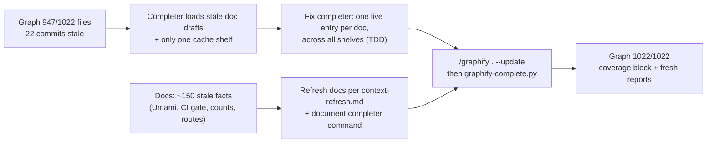

## Graphify 100% coverage + stale docs refresh

**TL;DR.** The code graph (the "map of the repo" agents query first) covers 947 of 1022 files (92.7%) and is 22 commits old. Two reasons: nobody re-ran it after PRs #2/#7/#8, and the Optra completer script (`scripts/graphify-complete.py`) is fragile. It is like a librarian who shelves every old draft of a book next to the new one, and refuses to open a second shelf. That is why the last refresh skipped it, and the graph lost its coverage record. This plan fixes the completer (test first), corrects ~150 stale facts in docs, then rebuilds the graph once, last, to 1022/1022. It also writes the completer command into the closeout procedure so the next refresh does not regress.

### Flowchart

(`mcp__visualize__show_widget` is not loaded in this session; mermaid is stored here.)



### Task metadata

- Classification: `DOCUMENTATION` · `Standard` · Domain: AI workflow tooling / docs (`docs/ai/module-ownership-map.md` Infra) · Risk: low. It is downgraded from the tooling-Deep default because `scripts/graphify-complete.py` is not in CI (`.github/workflows/deploy.yml` has no graphify step), not deployed and not TDD-guarded (`scripts/ci/tdd-lib.mjs` `GUARDED_ROOTS`), and it writes only `graphify-out/`.
- Contract areas: API: no contract impact · Database: no contract impact · Permissions: no contract impact · External integrations: no contract impact · Jobs: no contract impact.
- Docs loaded: `planning.md, plan-template.md`
- Claims reversed while investigating: "COVERAGE_REPORT says 752/752, so coverage is 100%". Wrong: that report dates from 2026-08-15 (`732a8e1`). The 2026-09-25 refresh skipped the completer, so `graph.json` has no `coverage` key.
- Root cause (graph): `semantic_cache()` in `scripts/graphify-complete.py:93-110` picks ONE namespace (`max` by entry count) and loads EVERY `*.json` in it.
  - Evidence: namespace `pd5fd89c46bb5` holds 82 entries for 77 sources, so 5 stale drafts would be replayed. Live-hash probe: 57 docs hit `pd5fd…`, 12 hit only `pa567…`, and 56 have no entry.
  - The hypothesis is disproved if, after the fix, the completer finishes with 125/125 semantic files and no duplicate doc nodes.
- Detected running model: Opus 5.5 (`claude-opus-5-5`), high effort.
- Recommended model: `opus`, high; confidence high. Fallback: `sonnet`, high.
- Minimum capability: sonnet-high. The graphify cache internals and ~150-row drift ledger need careful exact edits.
- Branch: `fix/no-ticket-graphify-coverage-refresh` from `origin/main`.
- Release path: one PR into `main`, "Create a merge commit". No PR or merge without the owner's word (`docs/ai/handoff.md`).
- Required skills: `graphify` (`/graphify . --update`), `/review` before PR.
- Execution preflight:
  1. `git fetch origin`
  2. `scripts/new-task-worktree.sh fix graphify-coverage-refresh`
  3. In the worktree: `nvm use`, `bun install --frozen-lockfile`
  4. `cp -R <primary>/graphify-out/cache graphify-out/`, `cp <primary>/graphify-out/.graphify_python graphify-out/`, then `pwd > graphify-out/.graphify_root`. The cache is gitignored, so a new worktree has none; without it the refresh re-bills ~0.5M tokens.
  5. Write `.claude/.plan-ack` = `{"size":"standard","plan":"approved","matrices":"present"}` only after approval.

### Layer 1 — human summary

1. **Completer fix.** For each doc, compute its current content hash and load exactly that cache entry from whichever prompt shelf has it (newest wins). Old drafts are ignored. Docs found on no shelf fail loudly with their names.
2. **Docs refresh.** Every stale row the two audits found is corrected in place, only the drifted rows, per `docs/ai/context-refresh.md`. Brittle test-case totals become spec-file counts, which are checkable with `ls` and rot less.
3. **Procedure.** `planning.md` "Closeout refresh" gets the exact completer command and order, plus a 1022/1022 check. `execution.md`, `handoff.md`, `plan-template.md` and `context-refresh.md` point to it.
4. **Graph rebuild** runs last, after the final doc edit, so the graph indexes the corrected docs.

**Risk Matrix**

| Risk | Likelihood | Impact | Mitigation | Rollback |
|---|---|---|---|---|
| Worktree lacks semantic cache → full re-extraction bill | High if skipped | ~0.5M tokens | Preflight step 4 copies the cache | n/a |
| Mixed prompt vintages (12 docs served from the Aug `pa567…` prompt) | Certain | Slightly older extraction style for 12 docs | Same behaviour as graphify's own `allow_legacy` fallback; the namespaces used are recorded in `graph.json` `coverage.semantic_cache_namespaces` | Re-extract those 12 under the current prompt later |
| `file_hash` stat-index flush at exit targets a deleted temp dir in tests | Low | Noisy exit | Tests' `tearDown` runs before exit; if flush errors, pass `cache_root` to the temp dir | Revert the test file |
| Docs edit contradicts code | Low | Misleading map | Every ledger row cites path:line; `/review` pass | `git revert` the docs commit |
| Completer shrink/endpoint guard refuses the graph | Low | Refresh blocked | Its guards stay unchanged; the failure is reported, never bypassed | Keep the old graph |

**Backward Compatibility Matrix**

Usage search: `git grep semantic_cache_namespace`, plus the "Codex worker usage" text and `graphify-complete`. The only hits are docs (`planning.md:249`, `architecture-manifest.md:226`, historical `docs/plans/infra-ai-workflow-port.md`). No code reads them.

| Changed File / Symbol | Used By (outside this feature) | Breaks? | Handling |
|---|---|---|---|
| `scripts/graphify-complete.py` `semantic_cache()` signature | only `main()` in the same file | No | Updated in the same step |
| `graph.json` `coverage.semantic_cache_namespace` → `semantic_cache_namespaces` (list) | none (current graph lacks the key entirely) | No | — |
| GRAPH_REPORT token-cost line text | none | No | — |
| `agents/src/prompts/test-engineer.md` | generated `.claude/agents/07-test-engineer.md` | No | `bun run agents:generate` + `agents:lint` |
| `.ai-engineering/config/autonomous-engineering.yaml` `project.apps`, `validation_commands` | `.ai-engineering/runtime/claude.md` evidence lists | No | `activation` untouched (`PILOT_FROZEN`) |

### Layer 2 — execution spec (all phases `opus`, high → no switch stops)

#### Phase 1 — RED

1. New file `scripts/graphify/test_graphify_complete.py`, full content:

```python
"""Tests for scripts/graphify-complete.py semantic_cache (stdlib unittest).

The completer imports graphify, so run with graphify's interpreter:
  $(cat graphify-out/.graphify_python) -m unittest discover -s scripts/graphify -p 'test_*.py'
"""

from __future__ import annotations

import importlib.util
import json
import os
import tempfile
import unittest
from pathlib import Path

from graphify.cache import file_hash

HERE = Path(__file__).resolve().parent
SPEC = importlib.util.spec_from_file_location("graphify_complete", HERE.parent / "graphify-complete.py")
gc = importlib.util.module_from_spec(SPEC)
SPEC.loader.exec_module(gc)

DOC = "docs/a.md"


class SemanticCacheTest(unittest.TestCase):
    def setUp(self) -> None:
        self._tmp = tempfile.TemporaryDirectory()
        self.root = Path(self._tmp.name).resolve()
        self.out = self.root / "graphify-out"
        (self.root / "docs").mkdir()
        self.doc = self.root / DOC
        self.doc.write_text("# A\n\ncurrent body\n", encoding="utf-8")

    def tearDown(self) -> None:
        self._tmp.cleanup()

    def entry(self, namespace: str, digest: str, label: str, mtime: int | None = None) -> Path:
        ns = self.out / "cache" / "semantic" / namespace
        ns.mkdir(parents=True, exist_ok=True)
        path = ns / f"{digest}.json"
        path.write_text(
            json.dumps(
                {
                    "nodes": [{"id": label, "label": label, "source_file": DOC}],
                    "edges": [{"source": label, "target": f"{label}_t"}],
                    "hyperedges": [],
                }
            ),
            encoding="utf-8",
        )
        if mtime is not None:
            os.utime(path, (mtime, mtime))
        return path

    def live(self) -> str:
        return file_hash(self.doc, self.root)

    def test_error_no_namespace_raises(self) -> None:
        with self.assertRaisesRegex(RuntimeError, "No Graphify semantic cache"):
            gc.semantic_cache(self.root, self.out, {DOC})

    def test_error_live_doc_without_entry_is_named(self) -> None:
        self.entry("pold", "0" * 64, "stale")
        with self.assertRaisesRegex(RuntimeError, r"misses 1 files: \['docs/a.md'\]"):
            gc.semantic_cache(self.root, self.out, {DOC})

    def test_edge_stale_entry_of_edited_doc_is_ignored(self) -> None:
        self.entry("pnew", "f" * 64, "stale")
        self.entry("pnew", self.live(), "current")
        nodes, _, _, _ = gc.semantic_cache(self.root, self.out, {DOC})
        self.assertEqual([n["id"] for n in nodes], ["current"])

    def test_edge_doc_cached_only_under_older_prompt_is_served(self) -> None:
        self.entry("pnew", "f" * 64, "other")
        self.entry("pold", self.live(), "legacy")
        nodes, _, _, used = gc.semantic_cache(self.root, self.out, {DOC})
        self.assertEqual([n["id"] for n in nodes], ["legacy"])
        self.assertEqual(used, ["pold"])

    def test_regression_same_hash_in_two_namespaces_loads_newest_once(self) -> None:
        self.entry("pold", self.live(), "older", mtime=1_000_000)
        self.entry("pnew", self.live(), "newer", mtime=2_000_000)
        nodes, edges, _, used = gc.semantic_cache(self.root, self.out, {DOC})
        self.assertEqual([n["id"] for n in nodes], ["newer"])
        self.assertEqual(len(edges), 1)
        self.assertEqual(used, ["pnew"])

    def test_happy_returns_live_nodes_edges_and_namespaces(self) -> None:
        self.entry("pnew", self.live(), "current")
        nodes, edges, hyperedges, used = gc.semantic_cache(self.root, self.out, {DOC})
        self.assertEqual(len(nodes), 1)
        self.assertEqual(edges, [{"source": "current", "target": "current_t"}])
        self.assertEqual(hyperedges, [])
        self.assertEqual(used, ["pnew"])


if __name__ == "__main__":
    unittest.main()
```

2. Run `$(cat graphify-out/.graphify_python) -m unittest discover -s scripts/graphify -p 'test_*.py'`. Expect all 6 new cases to fail: `semantic_cache()` currently takes one argument, so each raises `TypeError`. `test_ci_workflows.py` should stay green. Paste the output. `bun run tdd:red` is not applicable because `scripts/graphify/**` is not guarded source (`scripts/ci/tdd-lib.mjs` `GUARDED_ROOTS`); state that in the commit body.
3. Commit: `test(graphify): specify live-hash semantic cache loading for the completer`.

Done: the 6 cases fail with `TypeError`, and the existing CI-workflow tests pass.

#### Phase 2 — completer fix

File `scripts/graphify-complete.py`.

2a. Old:
```python
from graphify.build import build_from_json
```
New:
```python
from graphify.build import build_from_json
from graphify.cache import file_hash
```

2b. Old: the whole function, from `def semantic_cache(out: Path) -> tuple[list[dict], list[dict], list[dict], Path]:` through `    return nodes, edges, hyperedges, namespace` (lines 93-110). New:
```python
def semantic_cache(
    root: Path, out: Path, semantic_sources: set[str]
) -> tuple[list[dict], list[dict], list[dict], list[str]]:
    """Load one live semantic cache entry per corpus document.

    Entries are keyed by graphify's content hash (``file_hash``) inside
    per-prompt ``p{fingerprint}/`` namespaces. Loading a whole namespace replays
    stale extractions of edited docs and misses docs cached under another
    prompt, so each document resolves to the entry for its CURRENT hash, taking
    the most recently written one when several prompts produced it.
    """
    namespaces = [path for path in (out / "cache" / "semantic").glob("*") if path.is_dir()]
    if not namespaces:
        raise RuntimeError("No Graphify semantic cache found. Run /graphify first.")

    nodes: list[dict] = []
    edges: list[dict] = []
    hyperedges: list[dict] = []
    used: set[str] = set()
    missing: list[str] = []
    for source in sorted(semantic_sources):
        digest = file_hash(root / source, root)
        entries = [ns / f"{digest}.json" for ns in namespaces if (ns / f"{digest}.json").is_file()]
        if not entries:
            missing.append(source)
            continue
        entry = max(entries, key=lambda path: (path.stat().st_mtime, path.parent.name))
        data = json.loads(entry.read_text(encoding="utf-8"))
        nodes.extend(data.get("nodes", []))
        edges.extend(data.get("edges", []))
        hyperedges.extend(data.get("hyperedges", []))
        used.add(entry.parent.name)
    if missing:
        raise RuntimeError(f"Semantic cache misses {len(missing)} files: {missing}")
    return nodes, edges, hyperedges, sorted(used)
```

2c. Old (in `main`):
```python
    semantic_nodes, semantic_edges, hyperedges, cache_namespace = semantic_cache(out)
    expected_semantic = {
        normalize_source(root, source)
        for category in ("document", "paper", "image")
        for source in detection.get("files", {}).get(category, [])
    }
```
New:
```python
    expected_semantic = {
        normalize_source(root, source)
        for category in ("document", "paper", "image")
        for source in detection.get("files", {}).get(category, [])
    }
    expected_semantic.discard(None)
    semantic_nodes, semantic_edges, hyperedges, cache_namespaces = semantic_cache(
        root, out, expected_semantic
    )
```
(The existing `covered_semantic` / `missing_semantic` check after it stays. It still catches a doc whose live entry holds zero nodes.)

2d. Old: `        "semantic_cache_namespace": cache_namespace.name,`
New: `        "semantic_cache_namespaces": cache_namespaces,`

2e. Old: `        "- Token cost: unavailable (Codex worker usage was not exposed; zero placeholders excluded)",`
New: `        "- Token cost: none for this rebuild (it replays cached extractions; per-run semantic tokens are in graphify-out/cost.json)",`

Run the Phase 1 command: all green. Commit: `fix(graphify): load one live semantic entry per doc across prompt namespaces`.

Done: 6/6 new and all existing graphify unittests pass.

#### Phase 3 — docs refresh (drift ledger)

This follows `docs/ai/context-refresh.md` "Refresh Steps". Each bullet names the stale row and the corrected fact with evidence. Edit only that row, keep column sets, and mark nothing `CONTEXT DRIFT` in the final text (the drift is being fixed, not flagged). Parallelisable as 3 `general-purpose` agents with disjoint file sets (A: code maps; B: infra + workflow docs; C: README/SUMMARY/TODOS/agents/yaml/PR template). Dispatch prompts carry caveman ultra and the persona line. The orchestrator re-verifies each file's diff against the ledger.

**3.0 Graphify procedure (single canonical statement).**
- `docs/ai/planning.md` "Closeout refresh": replace the paragraph starting `Optra-specific completion:` with an ordered procedure:
  1. `/graphify . --update` (skill).
  2. `$(cat graphify-out/.graphify_python) scripts/graphify-complete.py`. It runs a full deterministic rebuild from the AST plus the live semantic cache and adds `ci_workflows.py` CI nodes. It rewrites `graph.json` (+`coverage`), `GRAPH_REPORT.md`, `COVERAGE_REPORT.md`, `collapsed-edge-variants.json` and `graph.html`.
  3. Pass check: `COVERAGE_REPORT.md` "Detected source files" equals "represented", and `graph.json` has `coverage`.
  4. In a worktree, copy `graphify-out/cache` from the primary checkout first, and copy it back after.
  5. Unit tests: the Phase 1 command.
- `docs/ai/execution.md` "Mandatory Graphify closeout", `docs/ai/handoff.md` Completion Gate Graphify bullet, `docs/ai/plan-template.md` "Graphify gate", `docs/ai/context-refresh.md` (new final step "Refresh the graph"): change "`/graphify . --update`" to "`/graphify . --update` then `scripts/graphify-complete.py` (`docs/ai/planning.md` "Closeout refresh")".
- `.ai-engineering/core/task-state-machine.md:47` "Graphify closeout done": add a link to the same planning section.
- `docs/ai/testing-strategy.md`: inventory row for `scripts/graphify/test_*.py` (graphify interpreter, not in CI).

**3A. Code maps** (evidence from the code-maps audit, all verified at HEAD `a9b309b`):
- `docs/ai/contracts/api-contracts.md`:
  - Add the 15 missing routes: datasets ×3 (`datasets.controller.ts:58,70,76`), insights freshness/coverage/dismiss (`insights.controller.ts:16,23,33`), faq-drafts ×3 (`faq-drafts.controller.ts:17,22,33`), digest-settings ×3 (`digest-settings.controller.ts:23,28,35`), `GET /health` (`health.controller.ts:5`), `tickets/:ticketId/transcript.pdf` (`tickets.controller.ts:34`), `catalog-items/:itemId/photo` (`catalog.controller.ts:200`). Include their BFF files and callers.
  - Replace the "none yet" callers at L102-120 with the pages named in the audit.
  - L112 note: `listVendorPriceTerms` has no page caller.
- `docs/ai/contracts/db-contracts.md`: add rows for `datasets`, `document_review_flags`, `background_runs`, `chat_query_metrics`, `faq_drafts`, `workspace_digest_settings`, `workspace_events` (schema files in `packages/db/src/schema/`). `discrepancy_flags.flagType` has 10 values (`discrepancyFlags.ts`; migrations `0027`, `0031`). `workspace_events` enum adds `comparison_flagged` / `comparison_failed` (`0028`).
- `docs/ai/file-index/repository-map.md`:
  - Fix L21, L97, L114-116, L125, L129 (18 scenarios), L132 path, L145 (16 suites), L149, L183-184, L195, L212 DTO paths, L229 (3 tabs), L232 (12 BFF files), L246 (9 model roles, `models.ts:16-25`), L284/286/288 (14/14/13), L294 (drop dead SeaweedFS paths, add `UMAMI_*` vars `.env.example:156-172`), L296-L300 (Umami compose/Caddy/Dockerfile rows; API image `oven/bun:1.2.22` Debian), L304 (CI gate runs API e2e + Playwright, `deploy.yml:176-206`), L305 (`optra-prod-caddy`), L311, L325 (`bootstrap.ts:11`), L326 (15 routes), L358 (16), L364 (9 BFF), L368, L370, L75, L373-391 (+`Accordion`, `ComparisonTable`, `Reveal`), L406/407/423/424 totals recomputed, L414.
  - Add rows for the unmapped significant symbols listed in the audit: API modules/guards/strategy, events/search/notifications modules, DTO groups, API e2e specs, `apps/e2e` tests + fixtures, grouped BFF routes, 4 web pages, `umami-script.ts`, app metadata files, `middleware.ts`, web libs, `packages/ai` loaders/chunking/embeddings/tracing, `packages/db` index/pagination and the 9 core schemas, `packages/ui` primitives (one grouped row), and infra (`docker/init-db.sql`, `scripts/backup.sh`, `backup.yml`, `scripts/verify-env.sh`, `docs/ops/*`).
  - Add `semantic_cache` (`scripts/graphify-complete.py`) and `test_graphify_complete.py`.
- `docs/ai/module-ownership-map.md`:
  - L53: ports 3300/3301 and prod `127.0.0.1:3300`; drop the `s3.prod.json` claim and the dead path; `optra-prod-caddy`; Caddyfile routes `analytics.{$DOMAIN}` (`docker/Caddyfile:31-33`); drop `mnemra.tyvera.app`/`3100`; add `check-prod-env.sh`, B2 and Umami.
  - L29: `metadataBase` fallback `https://optra.example.com` (`layout.tsx:33`); add Umami/error/not-found/landing primitives.
  - L30/35/40/42/43: add the listed files and Playwright specs; case counts 20 (procurement e2e) and 3 (catalog e2e).
  - L31: 14/13 pages. L38: drop `app/dashboard/page.tsx`.
  - New Domain Index row "Cross-cutting API limits" (`apps/api/src/common/*`, global `ThrottlerGuard` `app.module.ts:46-69`).
- `docs/ai/architecture-manifest.md`:
  - L34: 14 pages. L49: auth-proxy exports. L59: add notifications/common/`bootstrap.ts`. L67: `AuthLimitsService`.
  - L76: replace the TODO with the middleware facts (`app.module.ts:49,69`, `bootstrap.ts:8-18`).
  - L86: +6 tables. L90: `0000`–`0034` and the non-additive list (`0001`, `0008`, `0010`, `0016`, `0027`, `0028`, `0031`).
  - L164: umami backup. L210: Playwright exists (`deploy.yml:189-206`). New Umami/analytics line.

**3B. Infra + workflow docs** (evidence from the workflow-docs audit):
- `CLAUDE.md` "Tech stack REAL": prod objects in Backblaze B2 (`docker-compose.prod.yml:67-72`); Umami service + `umami` DB (`docker-compose.yml:124-150`, `docker/init-db.sql:11-12`); procurement extraction model `gpt-4o` (`.env.example:78`).
- `docs/ai/dev-environment.md`: Umami row (3302); production backup facts (`check-prod-env.sh` → `backup.sh --reason=deploy`, restore-verified, `BACKUP_KEEP=7`, daily off-box B2 via `backup.yml` cron `17 3 * * *`, umami dump).
- `DEPLOYMENT.md`: Umami in Quick Start/ports, required `UMAMI_APP_SECRET`/`UMAMI_TWO_FACTOR_KEY`, optional `UMAMI_WEBSITE_ID`, `analytics.<DOMAIN>` DNS record, verify list, `127.0.0.1:3302`, umami backup, architecture diagram.
  - Deploy dir: CI uses `/home/deploy/apps/optra` (`deploy.yml`, `backup.sh:40`); manual `scripts/deploy-remote.sh:13` still defaults to `/opt/optra`. Document both; do not change the script (out of scope, logged as a risk).
- `DOCKER.md`: Umami in the service lists; prod has no seaweedfs; Caddy only with `COMPOSE_PROFILES=public`; host ports + 3302; web/umami loopback-published; daily `backup.yml` exists; CI/CD section per `deploy.yml` (check-prod-env, S3 round trip, `--force-recreate`, conditional public smoke).
- `docs/ai/testing-strategy.md`:
  - :165 → 16 suites.
  - Table :200-212 becomes spec-file counts (api unit 72, api e2e 16, web 135, ai 25, db 1, ui 11, seed 2, Playwright 9 + 1 smoke, `scripts/**/*.test.mjs` 6, py 3). Replace test-case totals with "run the package's `bun run test`", and do the same at :462.
  - :314 Playwright exists and gates CI. :194 `Dockerfile:101`. :266-268 `optra-mark`. :386-388 add `UMAMI_*` to the prod commands. :407 loopback ports. :469 `REDIS_PORT=6380`. :87 `Test-Layers-Skip:` trailer.
- `docs/ai/risk-register.md`:
  - :57 CI gate contents. :73 merged in PR #2, rule in CLAUDE.md "Three test layers". :84 three hooks. :122/:145 loopback ports. :48 `optra-mark.svg`.
  - New Standard row "Umami analytics": port 3302, default admin creds to rotate, `UMAMI_*` not checked by `check-prod-env.sh`, VPS `analytics.` Caddy/DNS.
  - New row "Deploy dir split" (`/opt/optra` vs `/home/deploy/apps/optra`).
  - New row "Graph refresh without completer regresses coverage" (no CI gate; mitigated by the procedure).
- `docs/ai/handoff.md`: :48 CI contents, :55 deploy sequence, :62 remove the "api e2e not in gate" trap.
- `docs/ai/execution.md` :80-131: add `apps/e2e` `bun run test:e2e`, `sh scripts/check-test-layers.sh <base>`, `sh scripts/check-prod-env.spec.sh`.
- `docs/ai/context-refresh.md`: add `backup.yml`, `scripts/check-*.sh`, `scripts/backup.sh`, `docker/Caddyfile`, `apps/*/Dockerfile`, `.env.example` to the sources, and `CLAUDE.md`, `DEPLOYMENT.md`, `DOCKER.md` to the refresh list.
- `docs/ai/agent-orchestration.md` :20: test-engineer also owns `apps/e2e/tests/*.spec.ts`. The row must match `agents/src/test-engineer.agent.mjs` `ownedGlobs`. If the glob is absent there, add it in 3C and regenerate.

**3C. Remaining files:**
- `README.md`: retitle "Optra", replace the product line with the procurement positioning from `CLAUDE.md` "What Optra is", and add `apps/e2e` + Umami to the structure and stack list.
- `SUMMARY.md`: prepend a banner: "Historical scaffold snapshot; not maintained. Current facts: `CLAUDE.md`, `DOCKER.md`, `DEPLOYMENT.md`." The body stays as history (non-destructive).
- `TODOS.md`: :13 remove the `.ai-scratchpad.md` reference (forbidden artifact); :57 dead `app/dashboard/page.tsx`; :107 `Dockerfile:101`.
- `agents/src/prompts/test-engineer.md` :8: replace "No Playwright in this repo" with the `apps/e2e` Playwright layer. Update `ownedGlobs` in `agents/src/test-engineer.agent.mjs` if needed. Run `bun run agents:generate` and `bun run agents:lint`.
- `.ai-engineering/config/autonomous-engineering.yaml`: add `apps/e2e` to `project.apps`; add `bun run test:e2e` (apps/e2e) and `sh scripts/check-test-layers.sh` to `validation_commands`. `activation` is NOT touched.
- `.github/PULL_REQUEST_TEMPLATE.md`: the CI comment lists the test-layer guard, API e2e and Playwright.
- `learnings.md`: one entry on live-hash semantic cache resolution, with its Predicted line from this plan: "completer reaches 125/125 semantic files with no duplicate doc nodes".

Commits, one per area: `docs(graphify): document the completer in the closeout procedure`, `docs(ai): refresh code maps and contracts against HEAD`, `docs: record Umami, B2 and the CI gate in infra and workflow docs`, `chore(agents): teach test-engineer the Playwright layer`. No `Co-Authored-By` trailer (`docs/ai/execution.md` rule 7 overrides the harness default).

Done: every ledger row is applied; `git grep -n "check-predict-verify\|3100\|3101\|s3.prod.json\|none yet"` has no hits in the maps edited here (historical plans/learnings exempt).

#### Phase 4 — graph rebuild (after the final indexed edit)

1. `/graphify . --update` (skill incremental flow; semantic extraction runs only on uncached docs, about 56 plus the docs edited in Phase 3).
2. `$(cat graphify-out/.graphify_python) scripts/graphify-complete.py`.
3. Verify:
   - COVERAGE_REPORT "Detected source files" = "represented" = the current detect total (≥1024: 1022 + the 2 new files).
   - Semantic files represented = detect's document+paper+image count.
   - Missing/dangling endpoint edges = 0.
   - `graph.json` has `coverage` with `semantic_cache_namespaces`.
   - `graphify query "semantic_cache"` resolves to the completer.
4. Review the graph diff (nodes/edges/communities before → after) and the semantic tokens from `graphify-out/cost.json`.
5. Copy the refreshed `graphify-out/cache` back to the primary checkout (gitignored, local only).
6. Commit: `chore(graphify): rebuild the code graph to full coverage`.

### Validation and acceptance

**Test Matrix**

| layer | required | file | cases |
|---|---|---|---|
| Unit (python unittest) | required | `scripts/graphify/test_graphify_complete.py` | error: no namespace raises; error: live doc without entry named · edge: stale entry ignored; edge: older-prompt entry served · regression: same hash in two namespaces loads newest once · happy: live nodes/edges/namespaces |
| API e2e | not required: no API route touched | — | — |
| Browser e2e | not required: no page/BFF touched | — | — |

`scripts/check-test-layers.sh` is not triggered: no service/controller/page/BFF/middleware paths change, so no `Test-Layers-Skip:` trailer is needed.

**Acceptance map**

| Criterion | File | Symbol | Step | Validation |
|---|---|---|---|---|
| 100% graph coverage | `graphify-out/COVERAGE_REPORT.md`, `graph.json` | `coverage` | Phase 4 | detected = represented |
| No stale doc nodes | completer | `semantic_cache` | 2b | regression + edge tests; 125/125 semantic |
| Docs match code | ledger files | rows | Phase 3 | `/review`; grep check above |
| Procedure prevents regression | `planning.md` | "Closeout refresh" | 3.0 | reviewer reads a single canonical statement |

**Run:**
- Phase 1 unittest command.
- `bun run agents:lint`.
- `bun run test:scripts`.
- `bun run lint`.
- Graphify gate = Phase 4.
- No app code changes, so no `type-check`/build is needed; run `bun run type-check` anyway as a cheap sanity check.

### Compatibility, docs and scans

- Behaviour preserved: the completer's outputs and guards (endpoint diagnostics, shrink guard, `covered_semantic` check) are unchanged. Only the semantic-entry selection changes, and the regression test proves it.
- Docs sync: this change is the docs sync. `repository-map.md` gets `semantic_cache`.
- Optimisation scan: not worth it, left as-is.
- Cache scan: no new cache. This fix reads graphify's existing content-hash cache correctly instead of pruning it, so prompt variants keep their entries per graphify's `prune_semantic_cache` design.
- DB/LLM cost impact: none at runtime. One-off semantic extraction of about 56-70 docs at refresh (bounded estimate: ~200-300k input tokens, from the 2026-09-25 run of 404 files ≈ 477k). The real count is reported from `cost.json`.
- Residual risks, logged in the risk register: no CI gate asserts graph coverage (graphify is not installed in CI); the `deploy-remote.sh` dir split.
