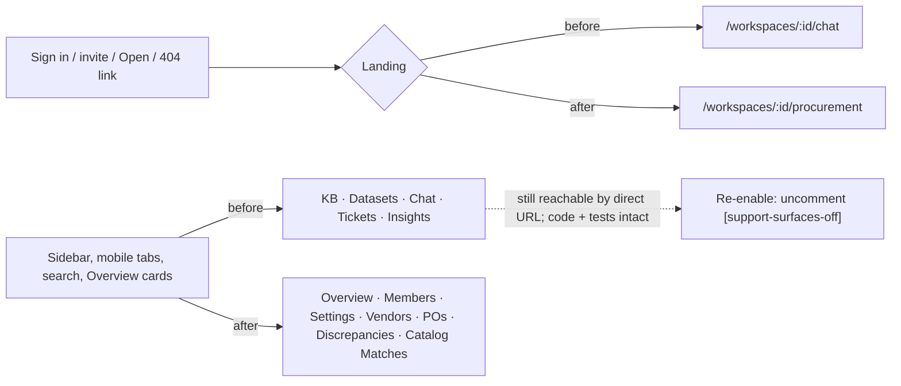

## Hide the support surfaces (Knowledge Bases, Datasets, Chat, Tickets, Insights)

> **Amendment 2026-10-02 (owner, mid-execution):** "disable those not needed routes, then comment out their components on the sidebar and/or bottom nav". Changes against the plan below:
> - Each of the five routes gets `apps/web/app/workspaces/[id]/<segment>/layout.tsx` with a tagged `notFound()` line (re-enable: comment it out). Unit spec `support-surfaces-disabled.spec.ts`. The status stays 200 (soft 404) because root `loading.tsx` streams first; Playwright asserts the "Page not found" screen.
> - The 3 hidden-page unit cases that asserted their own nav link was active (`chat`, `tickets`, `knowledge-bases/[kbId]` page specs) now assert that the link is absent.
> - `apps/e2e/support/flows.ts` `uploadKnowledgeBaseDocument` posts through the KB BFF, so `access.spec.ts` and `storage-errors.spec.ts` keep their KB coverage.
> - `knowledge-base.spec.ts` and `datasets.spec.ts` (7 tests) and 3 prod-smoke tests drive the disabled pages and are parked with tagged `test.skip`.
> - BFF routes, API and jobs are unchanged.

TL;DR: Optra's core is PO ↔ invoice matching. Today the sidebar, the mobile tab bar, the search box, the Overview cards and even the post-login landing still steer people into the old Mnemra-era support tools. We hide those five areas by **commenting out their entry points** (owner's choice, 2026-10-02). Each commented line carries the tag `[support-surfaces-off]`, and a tip comment at the top of every touched file explains how to turn them back on. Think of it as taking down the signs, not demolishing the rooms: the pages, BFF routes, API and jobs stay built and tested, and a direct URL still opens them for a signed-in member. Users now land on **Purchase Orders**.

### Flowchart (high-level)



### Task metadata

- Classification: `ENHANCEMENT` · `Standard` · Workspaces (web shell) + Chat Frontend (`/chat` hub) · risk-register "Post-Login Redirect Target". Downgraded to Standard by precedent, because this is a pure client-side `router.push` target-string change: no middleware, guard or token is touched.
- Size reason: the owner chose hide-only by comments (2026-10-02). There is no `middleware.ts`, auth, API, schema, queue or infra change, so the Deep defaults do not apply. A multi-file frontend change plus a landing-target change makes it Standard.
- Contract areas:
  - API: no contract impact.
  - Database: no contract impact.
  - Permissions: no contract impact. Direct URLs keep `JwtAuthGuard` + `WorkspaceMemberGuard`.
  - External integrations: no contract impact.
  - Jobs: no contract impact. All queues and crons are untouched (owner decision).
- Docs loaded: `planning.md, plan-template.md`
- Claims reversed while investigating:
  1. "A shared `app/workspaces/[id]/layout.tsx` can gate all five." Disproved: no such layout exists, only `app/workspaces/layout.tsx` (a passthrough).
  2. "Middleware owns a post-login target." Disproved: `apps/web/middleware.ts` only handles cookies and refresh. The landing lives in `app/chat/page.tsx:25`.
  3. "A server-only env flag read in middleware gets baked in at build." Disproved: `next@14.2.35` `define-env-plugin.js` inlines only `NEXT_PUBLIC_*` and `next.config` `env`, and the edge sandbox copies runtime `process.env` (`sandbox/context.js` `buildEnvironmentVariablesFrom`). This matters only for runtime-flag follow-up #1.
- Detected running model: Opus 5.5 (`claude-opus-5-5`)
- Recommended model: `opus`, medium reasoning; confidence high. Fallback: `sonnet`, medium.
- Minimum capability: `sonnet` medium. The literal blocks below remove the judgement; the executor only applies them and runs the suites.
- Branch: `enhancement/no-ticket-hide-support-surfaces`, from `origin/main`
- Release path: one PR into `main`, "Create a merge commit" (`docs/ai/handoff.md` "Release flow")
- Required skills: `/review`, `/qa-only` (UI walk), `/design-review` (the change touches UI)
- Execution preflight:
  1. `git fetch origin`
  2. `scripts/new-task-worktree.sh enhancement hide-support-surfaces`
  3. In the worktree: `nvm use`, `bun install --frozen-lockfile`, then copy the root `.env`.
  4. Only after the owner approves: overwrite the stale `.claude/.plan-ack` with `{"size":"standard","plan":"approved","matrices":"present"}`. It currently holds the previous task's ack.

### Investigation findings (code wins over docs)

1. **The discrepancy flow does not depend on the five areas at runtime.**
   - `apps/api/src/procurement/procurement.module.ts` imports only `StorageModule`, `StructuredQueryModule` (DuckDB, `comparison.service.ts:36`), `EventsModule` and `LimitsModule`.
   - Uploads go to `${workspaceId}/procurement/${kind}/…` (`procurement-documents.service.ts:103`) and then onto `procurement-parse-queue`. They never touch `documents`, `knowledgeBases`, `chunks` or `IngestService`.
   - Verdict citations are foreign-key row links (`discrepancyFlags` → PO/invoice/GRN line items, plus `comparisonRunGoodsReceipts`), not RAG chunks.
   - What would disprove this: any procurement or catalog import of KB, documents, ingest, chat, tickets or search code. The grep found only comments.
   - The web change touches no procurement file.
2. **Background jobs keep running (owner decision).**
   - Ingest, scrape, ticket-extraction and dataset-profiling are enqueued only by the hidden routes, plus boot reconcilers that re-enqueue stuck rows. Stopping them would leave rows stranded in `status=pending`.
   - The insights crons (`freshness`, `faq-cluster`, `topic-gap`, `digest`) are repeatable weekly Bull jobs, and they keep firing.
   - `faq-cluster` and `topic-gap` call the LLM inside the existing budget.
   - The digest email text mentions chat, tickets and stale docs, but contains no links (`digest-renderers.ts`).
   - Logged as deferred in the risk register (Phase 3).
3. **Surfaces that link to the five areas.**
   - Handled in this plan:
     - `workspace-nav.tsx`: `workspaceNavItems` (5 entries), `workspacePrimaryTabItems` (Chat, Knowledge), and the `WorkspaceSearch` slot. Search covers only KB docs, tickets and chat (`workspace-search.tsx:131,245,271`).
     - `app/workspaces/[id]/page.tsx` `quickLinks` (KB, Chat, Tickets).
     - `app/chat/page.tsx:25`, the post-login hub that `login/page.tsx:37` and `verify-otp/page.tsx:43` push to.
     - `app/invite/[token]/page.tsx:25`.
     - `app/workspaces/page.tsx:218` "Open".
     - `app/not-found.tsx:25` "Open assistant".
   - Not links, left as is:
     - The unread badge. It counts all event types (`events.service.ts` `unreadCount`) and its feed rows carry no links.
     - The `robots.ts` disallow entry for `/chat`.
     - The digest email.
   - The landing page has no route links, only the Product Tour chat vignette (`landing-demo-docs.ts:226`, `product-tour.tsx:134`; marketing, follow-up #6). There is no onboarding route.
   - E2E fixtures: `auth.setup.ts` seeds KBs. The `knowledge-base`, `datasets`, `access` and `storage-errors` specs use direct gotos and BFF calls, so they still work.
4. **Settings is not affected.** `settings/page.tsx:10` uses `digest-settings` (InsightsModule), and this plan does not touch it.
5. **The API is not public.** `docker/Caddyfile` proxies only `web:3000`, so "reachable by direct URL" means signed-in members going through the BFF.

### Layer 1 — human summary

The plan comments out only the entry points: the nav array entries, the two mobile tabs, the search slot and the three Overview cards. It also changes four "where do I go" strings from chat to `/procurement`.

The feature code itself is not commented. It still compiles, type-checks and runs its roughly 40 unit specs, 9 API e2e suites and 4 Playwright specs.

Re-enabling is mechanical: run `grep -rn "support-surfaces-off" apps/web apps/e2e`, uncomment each tagged line, and restore its `was:` value.

Mobile tab bar: with Chat and Knowledge gone, it would show only Overview. So two existing destinations, Purchase Orders and Discrepancies, stand in, using their existing labels and icons. No sidebar item is reordered or renamed.

**Risk Matrix**

| Risk | Likelihood | Impact | Mitigation | Rollback |
|---|---|---|---|---|
| Hidden pages still open by bookmark or direct URL | Likely | Low (members only, guards intact, API private) | Accepted by the owner for this slice; deferred risk row; true disable = follow-up #1 | n/a |
| Insights crons + weekly digest keep running (LLM spend, digest mentions hidden areas) | Certain | Low–Med | Existing 5M-token workspace budget; deferred row; follow-up #2 | n/a |
| Unread badge counts old KB/ticket/scrape events | Possible | Low | Overview mark-seen clears it; feed rows have no links; follow-up #3 | n/a |
| New landing strands a user | Low | High | Unit specs for hub/invite/list; Playwright asserts `/chat` → `/procurement`; zero-workspace (`/workspaces`) and 401 (`/login`) branches unchanged | Revert the merge commit |
| Commented entry lines drift from the code they point at | Medium | Low | Only one-line entries are commented; features stay compiled + tested; grep checklist | Uncomment |
| Unused-import lint failure | Low | Low | Every import that loses its last use is commented in the same step | n/a |

**Backward Compatibility Matrix** (usage search: graphify query + grep per symbol, recorded in Findings 3)

| Changed File / Symbol | Used By (outside this feature) | Breaks? | Handling |
|---|---|---|---|
| `workspaceNavItems(workspaceId)` | `WorkspaceNav` only (`workspace-nav.tsx:55`) | No | Returns 7 items |
| `workspacePrimaryTabItems(workspaceId)` | 13 pages (8 kept, 5 hidden) | No | Same signature. Hidden pages reached by URL show the new tabs. Affected, NOT modified |
| `WorkspaceSearch` | rendered only by `WorkspaceNav` | No | No longer rendered. `workspace-search.tsx` + its spec are unchanged and still green. Affected, NOT modified |
| `ChatRedirectPage` (`/chat`) | `login/page.tsx:37`, `verify-otp/page.tsx:43`, `not-found.tsx` | No | Those callers still push `/chat`; the hub now forwards to procurement. The `login`/`verify-otp` specs assert `'/chat'` and are unchanged. Affected, NOT modified |
| Landing regex `/workspaces/<id>/` | `auth.setup.ts:69`, `rate-limit.spec.ts:36`, `account-limits.spec.ts:79`, `smoke/prod.smoke.spec.ts:41` | No | `/procurement` still matches. Affected, NOT modified (`auth.setup.ts` gets a comment-only update) |
| Hidden pages / BFF / API / jobs | `knowledge-base`, `datasets`, `access`, `storage-errors` Playwright specs; 9 API e2e suites; their unit specs | No | Untouched and still green. Affected, NOT modified |

### Layer 2 — execution spec

**File list (complete)**

- Source:
  - `apps/web/src/components/workspace-nav.tsx`
  - `apps/web/app/workspaces/[id]/page.tsx`
  - `apps/web/app/chat/page.tsx`
  - `apps/web/app/invite/[token]/page.tsx`
  - `apps/web/app/workspaces/page.tsx`
  - `apps/web/app/not-found.tsx`
- Unit:
  - `apps/web/src/components/workspace-nav.spec.ts`
  - `apps/web/app/workspaces/[id]/page.spec.ts`
  - `apps/web/app/chat/page.spec.ts`
  - `apps/web/app/invite/[token]/page.spec.ts`
  - `apps/web/app/workspaces/page.spec.ts`
  - `apps/web/app/not-found.spec.ts` (new)
- Browser:
  - `apps/e2e/tests/workspace-shell.spec.ts` (new)
  - `apps/e2e/tests/login.spec.ts`
  - `apps/e2e/tests/auth.setup.ts`
- Docs:
  - `DESIGN.md`
  - `docs/ai/file-index/repository-map.md`
  - `docs/ai/risk-register.md`
  - `docs/ai/testing-strategy.md`
  - `docs/plans/hide-support-surfaces.md` (this plan)
  - `learnings.md`
  - `graphify-out/*` (refresh output)

**Canonical tip comment (TIP).** This is the only place TIP is stated; every "insert TIP" below inserts exactly these lines. In `'use client'` files, insert it right after the directive line and its blank line.

```ts
// [support-surfaces-off] 2026-10-02: Knowledge Bases, Datasets, Chat, Tickets and
// Insights are hidden from the UI. Their pages, BFF routes, API and jobs still
// exist and are tested. To re-enable: uncomment every line tagged
// [support-surfaces-off] in this file and restore each "was:" value noted there.
// Repo checklist: grep -rn "support-surfaces-off" apps/web apps/e2e
```

#### Phase 1 — RED (`opus`, medium)

This phase touches unit specs only.

- New or changed cases get prefixed titles. Untouched cases keep their titles, to keep the diff minimal.
- Run `bun run tdd:red` and paste the failing output.
- Commit the specs alone as `test(web): pin hidden support surfaces and procurement landing`.

1. `apps/web/src/components/workspace-nav.spec.ts`
   - Old: `import { WorkspaceNav } from './workspace-nav'`
     New: `import { WorkspaceNav, workspacePrimaryTabItems } from './workspace-nav'`
   - Old: everything from `  it('renders all items with correct hrefs', () => {` through the closing `  })` of `  it('separates the search control from the nav links with bottom spacing', () => {` (6 cases, current lines 33–89).
     New:
     ```ts
       // [support-surfaces-off] On re-enable, restore the original cases from git
       // history (they asserted Knowledge Bases/Chat/Tickets links and the search
       // slot's mb-4) and drop the "hides" cases below.
       it('edge: does not render the workspace search slot', () => {
         usePathnameMock.mockReturnValue('/workspaces/w1')

         render(React.createElement(WorkspaceNav, { workspaceId: 'w1', collapsed: false }))

         expect(screen.queryByTestId('workspace-search-slot')).toBeNull()
       })

       it('regression: hides Knowledge Bases, Datasets, Chat, Tickets and Insights', () => {
         usePathnameMock.mockReturnValue('/workspaces/w1')

         render(React.createElement(WorkspaceNav, { workspaceId: 'w1', collapsed: false }))

         for (const label of ['Knowledge Bases', 'Datasets', 'Chat', 'Tickets', 'Insights']) {
           expect(screen.queryByRole('link', { name: label })).toBeNull()
         }
       })

       it('regression: primary tabs are Overview, Purchase Orders and Discrepancies', () => {
         expect(workspacePrimaryTabItems('w1').map((item) => [item.label, item.href])).toEqual([
           ['Overview', '/workspaces/w1'],
           ['Purchase Orders', '/workspaces/w1/procurement'],
           ['Discrepancies', '/workspaces/w1/discrepancies'],
         ])
       })

       it('happy: renders the seven kept items with correct hrefs in order', () => {
         usePathnameMock.mockReturnValue('/workspaces/w1')

         render(React.createElement(WorkspaceNav, { workspaceId: 'w1', collapsed: false }))

         expect(screen.getAllByRole('link').map((link) => [link.textContent, link.getAttribute('href')])).toEqual([
           ['Overview', '/workspaces/w1'],
           ['Members', '/workspaces/w1/members'],
           ['Settings', '/workspaces/w1/settings'],
           ['Vendors', '/workspaces/w1/vendors'],
           ['Purchase Orders', '/workspaces/w1/procurement'],
           ['Discrepancies', '/workspaces/w1/discrepancies'],
           ['Catalog Matches', '/workspaces/w1/catalog-matches'],
         ])
       })

       it('happy: marks only Overview active on overview route', () => {
         usePathnameMock.mockReturnValue('/workspaces/w1')

         render(React.createElement(WorkspaceNav, { workspaceId: 'w1', collapsed: false }))

         expect(screen.getByRole('link', { name: 'Overview' }).getAttribute('aria-current')).toBe('page')
         expect(screen.getByRole('link', { name: 'Vendors' }).getAttribute('aria-current')).toBeNull()
       })

       it('happy: marks Vendors active on vendors index route', () => {
         usePathnameMock.mockReturnValue('/workspaces/w1/vendors')

         render(React.createElement(WorkspaceNav, { workspaceId: 'w1', collapsed: false }))

         expect(screen.getByRole('link', { name: 'Vendors' }).getAttribute('aria-current')).toBe('page')
         expect(screen.getByRole('link', { name: 'Overview' }).getAttribute('aria-current')).toBeNull()
       })

       it('happy: keeps Vendors active on vendor detail route', () => {
         usePathnameMock.mockReturnValue('/workspaces/w1/vendors/v1')

         render(React.createElement(WorkspaceNav, { workspaceId: 'w1', collapsed: false }))

         expect(screen.getByRole('link', { name: 'Vendors' }).getAttribute('aria-current')).toBe('page')
       })

       it('happy: keeps labels in DOM with sr-only class when collapsed', () => {
         usePathnameMock.mockReturnValue('/workspaces/w1/members')

         render(React.createElement(WorkspaceNav, { workspaceId: 'w1', collapsed: true }))

         expect(screen.getByRole('link', { name: 'Members' })).toBeTruthy()
         const label = screen.getByText('Members')
         expect(label.className).toContain('sr-only')
       })
     ```
   - Coverage is not weakened: the active-state logic keeps the same coverage, moved onto a kept item (Vendors index + detail prefix). The two unread-badge cases are unchanged.
   - Why these fail first: today the KB/Chat/Tickets links and the search slot exist, the tabs include Chat and Knowledge, and the nav renders 12 links.
2. `apps/web/app/workspaces/[id]/page.spec.ts`
   - Old: the whole case `  it('renders all 5 quick-link cards with correct hrefs', async () => { … })` (lines 83–98).
     New:
     ```ts
       // [support-surfaces-off] On re-enable, restore the original "renders all 5
       // quick-link cards" case from git history.
       it('regression: quick-link cards and sidebar hide the support surfaces', async () => {
         getWorkspaceMock.mockResolvedValue({ id: 'ws-1', name: 'Alpha' })
         listWorkspacesMock.mockResolvedValue({ items: [{ id: 'ws-1', role: 'member' }], nextCursor: null })

         const { container } = renderPage()

         const sidebar = within(screen.getByRole('complementary'))
         expect((await sidebar.findByRole('link', { name: 'Members' })).getAttribute('href')).toBe('/workspaces/ws-1/members')
         expect(sidebar.getByRole('link', { name: 'Purchase Orders' }).getAttribute('href')).toBe('/workspaces/ws-1/procurement')
         for (const label of ['Knowledge Bases', 'Chat', 'Tickets']) {
           expect(sidebar.queryByRole('link', { name: label })).toBeNull()
           expect(screen.queryByRole('heading', { level: 3, name: label })).toBeNull()
         }
         expect(container.querySelector('span.shrink-0.text-accent-foreground')).not.toBeNull()
         expect(container.querySelector('.rounded-2xl.bg-accent\\/20.text-accent-foreground')).toBeNull()
       })

       it('happy: renders the Members and Settings quick-link cards with correct hrefs', async () => {
         getWorkspaceMock.mockResolvedValue({ id: 'ws-1', name: 'Alpha' })
         listWorkspacesMock.mockResolvedValue({ items: [{ id: 'ws-1', role: 'member' }], nextCursor: null })

         renderPage()

         const members = await screen.findByRole('heading', { level: 3, name: 'Members' })
         expect(members.closest('a')?.getAttribute('href')).toBe('/workspaces/ws-1/members')
         expect(screen.getByRole('heading', { level: 3, name: 'Settings' }).closest('a')?.getAttribute('href')).toBe('/workspaces/ws-1/settings')
       })
     ```
3. `apps/web/app/chat/page.spec.ts`
   - Old: `import { cleanup, render, waitFor } from '@testing-library/react'`
     New: `import { cleanup, render, screen, waitFor } from '@testing-library/react'`
   - Old:
     ```ts
       it('redirects to first workspace chat', async () => {
         listWorkspacesMock.mockResolvedValue({ items: [{ id: 'ws-1', role: 'owner' }], nextCursor: null })

         renderPage()

         await waitFor(() => {
           expect(pushMock).toHaveBeenCalledWith('/workspaces/ws-1/chat')
         })
       })
     ```
     New:
     ```ts
       it('error: a failed workspace lookup shows a workspace-neutral toast and falls back to /workspaces', async () => {
         listWorkspacesMock.mockRejectedValue(new Error('boom'))

         renderPage()

         expect(await screen.findByText('Workspace unavailable')).toBeTruthy()
         expect(screen.queryByText(/chat/i)).toBeNull()
         expect(pushMock).toHaveBeenCalledWith('/workspaces')
       })

       it('edge: sends a user with no workspace to /workspaces', async () => {
         listWorkspacesMock.mockResolvedValue({ items: [], nextCursor: null })

         renderPage()

         await waitFor(() => {
           expect(pushMock).toHaveBeenCalledWith('/workspaces')
         })
       })

       // [support-surfaces-off] was: 'redirects to first workspace chat' → '/workspaces/ws-1/chat'
       it('regression: redirects to the first workspace Purchase Orders', async () => {
         listWorkspacesMock.mockResolvedValue({ items: [{ id: 'ws-1', role: 'owner' }], nextCursor: null })

         renderPage()

         await waitFor(() => {
           expect(pushMock).toHaveBeenCalledWith('/workspaces/ws-1/procurement')
         })
       })

       it('happy: the waiting screen does not mention chat', () => {
         listWorkspacesMock.mockReturnValue(new Promise(() => {}))

         renderPage()

         expect(screen.getByText('Opening your workspace')).toBeTruthy()
         expect(screen.queryByText(/chat/i)).toBeNull()
       })
     ```
   - The `edge:` case pins behaviour that exists today, so it passes both before and after the change.
4. `apps/web/app/invite/[token]/page.spec.ts`
   - Old: `  it('accepts the invite and redirects to the workspace chat (default landing page)', async () => {`
     New:
     ```ts
       // [support-surfaces-off] was: '…redirects to the workspace chat…' → '/workspaces/ws-1/chat'
       it('regression: accepts the invite and redirects to the workspace Purchase Orders (default landing page)', async () => {
     ```
   - Old: `      expect(pushMock).toHaveBeenCalledWith('/workspaces/ws-1/chat')`
     New: `      expect(pushMock).toHaveBeenCalledWith('/workspaces/ws-1/procurement')`
5. `apps/web/app/workspaces/page.spec.ts`
   - Old: `  it('opens a workspace directly into chat (default landing page)', async () => {`
     New:
     ```ts
       // [support-surfaces-off] was: '…into chat…' → '/workspaces/ws-1/chat'
       it('regression: opens a workspace directly into Purchase Orders (default landing page)', async () => {
     ```
   - Old: `    expect(screen.getByRole('link', { name: 'Open' }).getAttribute('href')).toBe('/workspaces/ws-1/chat')`
     New: `    expect(screen.getByRole('link', { name: 'Open' }).getAttribute('href')).toBe('/workspaces/ws-1/procurement')`
6. `apps/web/app/not-found.spec.ts` (new; `not-found.tsx` has no spec today):
   ```ts
   /** @vitest-environment jsdom */

   import React from 'react'
   import { cleanup, render, screen } from '@testing-library/react'
   import { afterEach, describe, expect, it } from 'vitest'
   import NotFound from './not-found'

   describe('NotFound', () => {
     afterEach(() => {
       cleanup()
     })

     it('regression: offers no assistant link or copy while support surfaces are hidden', () => {
       render(React.createElement(NotFound))

       expect(screen.queryByRole('link', { name: /assistant/i })).toBeNull()
       expect(screen.queryByText(/assistant/i)).toBeNull()
     })

     it('happy: links home and to the workspace landing hub', () => {
       render(React.createElement(NotFound))

       expect(screen.getByRole('link', { name: 'Go home' }).getAttribute('href')).toBe('/')
       expect(screen.getByRole('link', { name: 'Open workspace' }).getAttribute('href')).toBe('/chat')
     })
   })
   ```

Done when: `bun run tdd:red` records a valid RED (the nav, overview, chat hub, invite, workspaces and not-found specs fail on the assertions above), and the commit holds tests only.

#### Phase 2 — Hide entry points and retarget landing (`opus`, medium)

Commit as `feat(web): hide support surfaces and land on Purchase Orders`, in the same commit as steps 7–9.

- Why one commit: `scripts/check-test-layers.sh` checks each commit separately, and a `page.tsx` change needs an `apps/e2e/tests` change in the same commit.
- Playwright cannot be proven RED by `tdd:red` (it needs the full stack).

1. `apps/web/src/components/workspace-nav.tsx`
   - Old:
     ```tsx
     'use client'

     import * as React from 'react'
     ```
     New: `'use client'`, then a blank line, TIP, another blank line, then `import * as React from 'react'`.
   - Old:
     ```tsx
     import { BriefcaseBusiness, ClipboardList, Database, FileSpreadsheet, FileWarning, LineChart, MessageSquareText, PackageSearch, Settings, Store, Ticket, Users } from 'lucide-react'
     import { getUnreadCount } from '@/lib/api/events'
     import { WorkspaceSearch } from './workspace-search'
     ```
     New:
     ```tsx
     // [support-surfaces-off] was: import { BriefcaseBusiness, ClipboardList, Database, FileSpreadsheet, FileWarning, LineChart, MessageSquareText, PackageSearch, Settings, Store, Ticket, Users } from 'lucide-react'
     import { BriefcaseBusiness, ClipboardList, FileWarning, PackageSearch, Settings, Store, Users } from 'lucide-react'
     import { getUnreadCount } from '@/lib/api/events'
     // [support-surfaces-off] import { WorkspaceSearch } from './workspace-search'
     ```
   - Old:
     ```tsx
         { label: 'Knowledge Bases', href: `/workspaces/${workspaceId}/knowledge-bases`, icon: <Database className="size-4" /> },
         { label: 'Datasets', href: `/workspaces/${workspaceId}/datasets`, icon: <FileSpreadsheet className="size-4" /> },
         { label: 'Members', href: `/workspaces/${workspaceId}/members`, icon: <Users className="size-4" /> },
         { label: 'Chat', href: `/workspaces/${workspaceId}/chat`, icon: <MessageSquareText className="size-4" /> },
         { label: 'Tickets', href: `/workspaces/${workspaceId}/tickets`, icon: <Ticket className="size-4" /> },
         { label: 'Insights', href: `/workspaces/${workspaceId}/insights`, icon: <LineChart className="size-4" /> },
     ```
     New:
     ```tsx
         // [support-surfaces-off] { label: 'Knowledge Bases', href: `/workspaces/${workspaceId}/knowledge-bases`, icon: <Database className="size-4" /> },
         // [support-surfaces-off] { label: 'Datasets', href: `/workspaces/${workspaceId}/datasets`, icon: <FileSpreadsheet className="size-4" /> },
         { label: 'Members', href: `/workspaces/${workspaceId}/members`, icon: <Users className="size-4" /> },
         // [support-surfaces-off] { label: 'Chat', href: `/workspaces/${workspaceId}/chat`, icon: <MessageSquareText className="size-4" /> },
         // [support-surfaces-off] { label: 'Tickets', href: `/workspaces/${workspaceId}/tickets`, icon: <Ticket className="size-4" /> },
         // [support-surfaces-off] { label: 'Insights', href: `/workspaces/${workspaceId}/insights`, icon: <LineChart className="size-4" /> },
     ```
   - Old:
     ```tsx
         { href: `/workspaces/${workspaceId}/chat`, label: 'Chat', icon: <MessageSquareText className="size-5" /> },
         { href: `/workspaces/${workspaceId}/knowledge-bases`, label: 'Knowledge', icon: <Database className="size-5" /> },
       ]
     ```
     New:
     ```tsx
         // [support-surfaces-off] { href: `/workspaces/${workspaceId}/chat`, label: 'Chat', icon: <MessageSquareText className="size-5" /> },
         // [support-surfaces-off] { href: `/workspaces/${workspaceId}/knowledge-bases`, label: 'Knowledge', icon: <Database className="size-5" /> },
         // [support-surfaces-off] Stand-in tabs while Chat and Knowledge are hidden; delete these two on re-enable.
         { href: `/workspaces/${workspaceId}/procurement`, label: 'Purchase Orders', icon: <ClipboardList className="size-5" /> },
         { href: `/workspaces/${workspaceId}/discrepancies`, label: 'Discrepancies', icon: <FileWarning className="size-5" /> },
       ]
     ```
   - Old:
     ```tsx
           <div data-testid="workspace-search-slot" className="mb-4">
             <WorkspaceSearch workspaceId={workspaceId} collapsed={collapsed} />
           </div>
     ```
     New:
     ```tsx
           {/* [support-surfaces-off] Search only finds KB documents, tickets and chat history.
           <div data-testid="workspace-search-slot" className="mb-4">
             <WorkspaceSearch workspaceId={workspaceId} collapsed={collapsed} />
           </div>
           */}
     ```
2. `apps/web/app/workspaces/[id]/page.tsx`
   - Insert TIP after `'use client'` and its blank line.
   - Old: `import { CircleAlert, Database, FileText, Globe, MessageSquareText, Scale, Settings, Ticket, Users } from 'lucide-react'`
     New (`Ticket` stays, because the activity icon at line 168 uses it):
     ```tsx
     // [support-surfaces-off] was: import { CircleAlert, Database, FileText, Globe, MessageSquareText, Scale, Settings, Ticket, Users } from 'lucide-react'
     import { CircleAlert, FileText, Globe, Scale, Settings, Ticket, Users } from 'lucide-react'
     ```
   - Old (inside `quickLinks`):
     ```tsx
       {
         label: 'Knowledge Bases',
         href: `/workspaces/${workspaceId}/knowledge-bases`,
         description: 'Manage the sources your assistant retrieves from.',
         icon: <Database className="size-5" />,
       },
     ```
     New:
     ```tsx
       // [support-surfaces-off] Knowledge Bases quick link:
       // {
       //   label: 'Knowledge Bases',
       //   href: `/workspaces/${workspaceId}/knowledge-bases`,
       //   description: 'Manage the sources your assistant retrieves from.',
       //   icon: <Database className="size-5" />,
       // },
     ```
   - Old:
     ```tsx
       {
         label: 'Chat',
         href: `/workspaces/${workspaceId}/chat`,
         description: 'Ask grounded questions against this workspace.',
         icon: <MessageSquareText className="size-5" />,
       },
       {
         label: 'Tickets',
         href: `/workspaces/${workspaceId}/tickets`,
         description: 'Draft and review tickets from support calls.',
         icon: <Ticket className="size-5" />,
       },
     ```
     New:
     ```tsx
       // [support-surfaces-off] Chat quick link:
       // {
       //   label: 'Chat',
       //   href: `/workspaces/${workspaceId}/chat`,
       //   description: 'Ask grounded questions against this workspace.',
       //   icon: <MessageSquareText className="size-5" />,
       // },
       // [support-surfaces-off] Tickets quick link:
       // {
       //   label: 'Tickets',
       //   href: `/workspaces/${workspaceId}/tickets`,
       //   description: 'Draft and review tickets from support calls.',
       //   icon: <Ticket className="size-5" />,
       // },
     ```
3. `apps/web/app/chat/page.tsx`
   - Insert TIP after `'use client'`.
   - Old: `import { MessageSquareText } from 'lucide-react'`
     New:
     ```tsx
     // [support-surfaces-off] was: import { MessageSquareText } from 'lucide-react'
     import { ClipboardList } from 'lucide-react'
     ```
   - Old: `          router.push(`/workspaces/${firstWorkspace.id}/chat`)`
     New:
     ```tsx
               // [support-surfaces-off] was: router.push(`/workspaces/${firstWorkspace.id}/chat`)
               router.push(`/workspaces/${firstWorkspace.id}/procurement`)
     ```
   - Old:
     ```tsx
               title: 'Workspace chat unavailable',
               description: 'Open a workspace first, then start chat from there.',
     ```
     New:
     ```tsx
               // [support-surfaces-off] was: title 'Workspace chat unavailable', description 'Open a workspace first, then start chat from there.'
               title: 'Workspace unavailable',
               description: 'Open a workspace from the list to continue.',
     ```
   - Old:
     ```tsx
         <PageShell contentClassName="flex min-h-screen items-center py-16">
           <EmptyState
             icon={<MessageSquareText className="size-5" />}
             title="Opening workspace chat"
     ```
     New:
     ```tsx
         <PageShell contentClassName="flex min-h-screen items-center py-16">
           {/* [support-surfaces-off] was: icon MessageSquareText, title "Opening workspace chat" */}
           <EmptyState
             icon={<ClipboardList className="size-5" />}
             title="Opening your workspace"
     ```
4. `apps/web/app/invite/[token]/page.tsx`
   - Insert TIP after `'use client'`.
   - Old: `      router.push(`/workspaces/${workspace.id}/chat`)`
     New:
     ```tsx
           // [support-surfaces-off] was: router.push(`/workspaces/${workspace.id}/chat`)
           router.push(`/workspaces/${workspace.id}/procurement`)
     ```
5. `apps/web/app/workspaces/page.tsx`
   - Insert TIP after `'use client'`.
   - Old: `                          <Link href={`/workspaces/${workspace.id}/chat`}>Open</Link>`
     New:
     ```tsx
                               {/* [support-surfaces-off] was: href={`/workspaces/${workspace.id}/chat`} */}
                               <Link href={`/workspaces/${workspace.id}/procurement`}>Open</Link>
     ```
     If `Button asChild` (Radix Slot) rejects two children, use this fallback instead: move the marker comment above `<Button asChild variant="ghost" size="sm">`. The wording stays identical. `bun run type-check` plus the unit spec decide which form is used.
6. `apps/web/app/not-found.tsx` (server component, no directive)
   - Insert TIP as the first lines of the file.
   - Old: `import { Compass, Home, MessageSquareText } from 'lucide-react'`
     New:
     ```tsx
     // [support-surfaces-off] was: import { Compass, Home, MessageSquareText } from 'lucide-react'
     import { BriefcaseBusiness, Compass, Home } from 'lucide-react'
     ```
   - Old: `          Route does not exist yet. Use redesigned dashboard or assistant workspace to continue exploring product experience.`
     New:
     ```tsx
               {/* [support-surfaces-off] was: Route does not exist yet. Use redesigned dashboard or assistant workspace to continue exploring product experience. */}
               This page does not exist. Go home or open your workspace to continue.
     ```
   - Old:
     ```tsx
                   <MessageSquareText className="size-4" />
                   Open assistant
     ```
     New:
     ```tsx
                   {/* [support-surfaces-off] was: <MessageSquareText className="size-4" /> Open assistant */}
                   <BriefcaseBusiness className="size-4" />
                   Open workspace
     ```
7. `apps/e2e/tests/workspace-shell.spec.ts` (new). It does no login, so it costs no login rate-limit budget; it reuses the `ownerA` session.
   ```ts
   import { expect, test } from '@playwright/test'
   import { loadState, storageStateFor, type SeedState } from '../support/state'
   import { rowFor } from '../support/ui'

   // [support-surfaces-off] 2026-10-02: Knowledge Bases, Datasets, Chat, Tickets
   // and Insights are hidden from the workspace shell; users land on Purchase
   // Orders. On re-enable, invert these assertions (or delete this file) along
   // with the [support-surfaces-off] lines in apps/web.

   const HIDDEN = ['Knowledge Bases', 'Datasets', 'Chat', 'Tickets', 'Insights']
   const KEPT = ['Overview', 'Members', 'Settings', 'Vendors', 'Purchase Orders', 'Discrepancies', 'Catalog Matches']

   test.use({ storageState: storageStateFor('ownerA') })

   let state: SeedState
   test.beforeAll(() => {
     state = loadState()
   })

   test('edge: the /chat landing hub forwards into Purchase Orders, not chat', async ({ page }) => {
     await page.goto('/chat')
     await expect(page).toHaveURL(new RegExp(`/workspaces/${state.ownerA.workspaceId}/procurement$`))
   })

   test('regression: the sidebar shows none of the hidden areas and no search box', async ({ page }) => {
     await page.goto(`/workspaces/${state.ownerA.workspaceId}`)
     const sidebar = page.locator('aside')
     for (const label of KEPT) {
       await expect(sidebar.getByRole('link', { name: label, exact: true })).toBeVisible()
     }
     for (const label of HIDDEN) {
       await expect(sidebar.getByRole('link', { name: label, exact: true })).toHaveCount(0)
       await expect(page.getByRole('heading', { level: 3, name: label, exact: true })).toHaveCount(0)
     }
     await expect(page.getByTestId('workspace-search-slot')).toHaveCount(0)
   })

   test('happy: the workspaces list opens a workspace into Purchase Orders', async ({ page }) => {
     await page.goto('/workspaces')
     await expect(rowFor(page, `E2E A ${state.run}`).getByRole('link', { name: 'Open' })).toHaveAttribute(
       'href',
       `/workspaces/${state.ownerA.workspaceId}/procurement`,
     )
   })

   test('happy: the mobile tab bar offers Overview, Purchase Orders and Discrepancies', async ({ page }) => {
     await page.setViewportSize({ width: 390, height: 844 })
     await page.goto(`/workspaces/${state.ownerA.workspaceId}/procurement`)
     await expect(page.getByRole('navigation', { name: 'Primary' }).getByRole('link')).toHaveText([
       'Overview',
       'Purchase Orders',
       'Discrepancies',
     ])
   })
   ```
8. `apps/e2e/tests/login.spec.ts`: tighten two assertions so they prove the real landing page. This makes them stricter.
   - Old: `    await expect(page).toHaveURL(new RegExp(`/workspaces/${state.ownerA.workspaceId}/`))`
     New: `    await expect(page).toHaveURL(new RegExp(`/workspaces/${state.ownerA.workspaceId}/procurement`))`
   - Old: `    await expect(page).toHaveURL(/\/workspaces\/[0-9a-f-]{36}\//)`
     New: `    await expect(page).toHaveURL(/\/workspaces\/[0-9a-f-]{36}\/procurement/)`
9. `apps/e2e/tests/auth.setup.ts` (comment only)
   - Old:
     ```ts
         // /chat redirects into the user's workspace; landing there proves the
         // BFF set both cookies and the middleware accepted them.
     ```
     New:
     ```ts
         // /chat redirects into the user's workspace (Purchase Orders while the
         // support surfaces are hidden, [support-surfaces-off]); landing there
         // proves the BFF set both cookies and the middleware accepted them.
     ```

Done when:
- `cd apps/web && bun run test` is green, including the untouched specs for the five areas and `workspace-search.spec.ts`.
- Root `bun run type-check` and `bun run lint` are clean.

#### Phase 3 — Docs sync (`opus`, medium)

1. `DESIGN.md` line 40
   - Old: `  3. Primary nav: Overview, Knowledge Bases, Members, Chat, Tickets, Settings — one shared nav-items model, not per-page ad-hoc links`
   - New: `  3. Primary nav: Overview, Members, Settings, Vendors, Purchase Orders, Discrepancies, Catalog Matches — one shared nav-items model, not per-page ad-hoc links. *(2026-10-02: Knowledge Bases, Datasets, Chat, Tickets and Insights are hidden — commented out under `[support-surfaces-off]` in `apps/web/src/components/workspace-nav.tsx`.)*`
2. `DESIGN.md` bottom tab bar bullet
   - Old: `Matches this consultation's existing claude.ai/Linear reference points for calm, low-decoration navigation chrome, not a new aesthetic direction.`
   - New: the same sentence, followed by ` *(2026-10-02: tabs are Overview, Purchase Orders and Discrepancies while the support surfaces are hidden.)*`
3. `DESIGN.md`: append this row at the end of the file, after the last Decisions Log row:
   `| 2026-10-02 | Support surfaces (Knowledge Bases, Datasets, Chat, Tickets, Insights) hidden from nav, mobile tabs, search and Overview; workspace landing moves from Chat to Purchase Orders | Optra's core is PO ↔ invoice matching; the Mnemra-era surfaces distracted from it. Hidden by commented-out entry points tagged `[support-surfaces-off]` so re-enabling is an uncomment, not a rebuild |`
4. `docs/ai/file-index/repository-map.md`
   - Line 205
     - Old: ``| `apps/web/app/chat/page.tsx` | Legacy `/chat` redirect page that resolves first workspace then forwards user to `/workspaces/:id/chat` |``
     - New: ``| `apps/web/app/chat/page.tsx` | Post-login `/chat` hub: resolves the first workspace and forwards to `/workspaces/:id/procurement` (`/workspaces/:id/chat` when the support surfaces are re-enabled, `[support-surfaces-off]`) |``
   - Line 243
     - Old: `| Redirects to first workspace chat |`
     - New: `| Redirects to first workspace Purchase Orders; neutral waiting/error copy |`
   - Line 397
     - Old: ``| Spec `workspace-nav.spec.ts`. |``
     - New: ``| Spec `workspace-nav.spec.ts`. Knowledge Bases, Datasets, Chat, Tickets, Insights entries, the Chat/Knowledge tabs and the `WorkspaceSearch` slot are commented out under `[support-surfaces-off]` (2026-10-02). |``
   - Add a new row after line 397:
     ``| `apps/web/app/not-found.tsx` | Root 404 page; links home and to the `/chat` landing hub ("Open workspace") | Workspaces Frontend | Express | Spec `not-found.spec.ts` (2026-10-02) |``
   - Add a new row next to the other `apps/e2e/tests` rows:
     ``| `apps/e2e/tests/workspace-shell.spec.ts` | Browser proof that the support surfaces are hidden and the landing is Purchase Orders | Workspaces Frontend | Standard | `[support-surfaces-off]`; invert on re-enable |``
5. `docs/ai/risk-register.md`: insert this row after the `| Post-Login Redirect Target |` row:
   ``| Hidden Support Surfaces | Hidden, not disabled: KB/Datasets/Chat/Tickets/Insights pages and BFF still answer a direct URL for signed-in members; insights crons (faq-cluster, topic-gap LLM calls) and the weekly digest keep running and the digest text still mentions chat/tickets/docs; the unread badge counts their old events | Standard | Unit + Playwright `workspace-shell.spec.ts`; feature specs stay green | Sign in → land on `/workspaces/:id/procurement`; sidebar, mobile tabs, Overview show none of the five | Deferred-with-conditions (2026-10-02, owner chose hide-only by comments). Blocker before real users: runtime gate (server env read in `middleware.ts`, 307 pages / 404 BFF) and an API flag on the insights crons + digest content. Re-enable checklist: `grep -rn "support-surfaces-off" apps/web apps/e2e` |``
6. `docs/ai/testing-strategy.md` line 215
   - Old: ``| 9 (`apps/e2e/tests/*.spec.ts`) plus the `tests/auth.setup.ts` setup project |``
   - New: ``| 10 (`apps/e2e/tests/*.spec.ts`) plus the `tests/auth.setup.ts` setup project |``
7. `docs/ai/contracts/api-contracts.md` and `docs/ai/module-ownership-map.md`: no change. No endpoint or owner moves (rows `:68` and `:31` verified).
8. Save this plan as `docs/plans/hide-support-surfaces.md` as the first commit on the branch (`docs(plans): …`).
9. `learnings.md` at handoff. The Predicted line comes from this plan: "Hiding by commenting only the entry points keeps every feature spec green; no existing test is deleted or skipped."

Done when: the docs match the code, committed as `docs(ai): record hidden support surfaces`.

### Validation and acceptance

**Test Matrix**

| Layer | Required? | File | Cases |
|---|---|---|---|
| Unit | Required (component/page logic) | `workspace-nav.spec.ts`, `[id]/page.spec.ts`, `chat/page.spec.ts`, `invite/[token]/page.spec.ts`, `workspaces/page.spec.ts`, `not-found.spec.ts` | **error:** hub lookup failure → toast + `/workspaces`. **edge:** no search slot; zero workspaces → `/workspaces`. **regression:** five links hidden; tabs = Overview/POs/Discrepancies; quick-links hide KB/Chat/Tickets; hub, invite and list → `/procurement`; no assistant copy on 404. **happy:** 7 kept items in order; Vendors active state; collapsed sr-only; Members/Settings cards; neutral waiting copy; 404 links |
| API e2e | Not required: no controller, guard or API route changes, and `check-test-layers.sh` demands none. The existing 9 suites for the five areas run unchanged in CI | — | — |
| Browser e2e | Required (`page.tsx` changes) | `workspace-shell.spec.ts` (new), `login.spec.ts` (tightened) | **edge:** `/chat` → `/procurement`. **regression:** sidebar hides the five, no search; Overview has no KB/Chat/Tickets cards. **happy:** list "Open" → `/procurement`; mobile tabs; login and register land on `/procurement` |

**How the existing specs for the five areas behave (files unchanged):**

- **Unit:** every page, BFF route and lib spec stays green. They render or call the code directly, and that code is unchanged.
- **API e2e:** `chat`, `knowledge-bases`, `datasets`, `tickets`, `search`, `scrape`, `documents`, `refine` and `events` stay green, because the API is untouched.
- **Playwright:** `knowledge-base`, `datasets`, `access` and `storage-errors` stay green. They use direct gotos and BFF calls and never click the nav.
- **Prod smoke:** stays green for the same reason. With no change to smoke, no prod-smoke doc note is needed (it was only needed under the "disable" option).

**Acceptance map**

| Criterion | File | Symbol | Step | Validation |
|---|---|---|---|---|
| Five areas gone from sidebar | `workspace-nav.tsx` | `workspaceNavItems` | P2.1 | unit regression + happy; Playwright regression |
| Mobile tabs no longer Chat/Knowledge | `workspace-nav.tsx` | `workspacePrimaryTabItems` | P2.1 | unit regression; Playwright mobile |
| Search gone | `workspace-nav.tsx` | `WorkspaceNav` | P2.1 | unit edge; Playwright |
| Overview cards hidden | `[id]/page.tsx` | `quickLinks` | P2.2 | unit regression + happy; Playwright |
| Post-login lands on POs | `chat/page.tsx` | `ChatRedirectPage` | P2.3 | unit regression/error/happy; Playwright edge; `login.spec` |
| Invite + list land on POs | `invite/[token]/page.tsx`, `workspaces/page.tsx` | `InvitePage`, Open `Link` | P2.4–5 | unit regression; Playwright happy |
| No assistant on 404 | `not-found.tsx` | `NotFound` | P2.6 | unit regression + happy |
| Re-enable is mechanical | all touched files | TIP + `[support-surfaces-off]` | P2 | `grep -rn "support-surfaces-off" apps/web apps/e2e` lists every site |

**Edge and error cases, and where they are handled**

- Zero workspaces → `/workspaces` (`chat/page.tsx`, unchanged branch).
- 401 → `/login` (`chat/page.tsx` and `invite/[token]/page.tsx`, unchanged).
- Hub list failure → neutral toast + `/workspaces` (`chat/page.tsx` catch block).
- Collapsed sidebar labels stay `sr-only` (`WorkspaceNav`).
- A hidden page opened by URL renders as it does today (accepted by the owner; covered by the new risk row).

**Seed:** the `bun run db:seed` demo tenant, for the manual walk.

**Run:**

- `bun run type-check`, `bun run lint`
- `cd apps/web && bun run test`
- Root `bun run e2e`: builds api + web, then runs Playwright. Needs `docker compose up -d --wait postgres redis seaweedfs` first.
- `sh scripts/check-test-layers.sh $(git merge-base HEAD origin/main)`
- `bun run build`
- UI walk in the Browser pane, desktop and 390px: sign in → POs, sidebar, tabs, Overview, 404
- `/review`, then `/design-review`

**Graphify gate:**

1. `/graphify . --update`
2. `$(cat graphify-out/.graphify_python) scripts/graphify-complete.py`, run after the last indexed edit. Copy the worktree cache as described in `docs/ai/planning.md` "Closeout refresh".
3. Report the coverage pass, the graph diff and the semantic token counts.

### Compatibility, docs and scans

- **Behaviour preserved:** feature code, BFF, API and jobs; `login`/`verify-otp` (`router.push('/chat')`, specs unchanged); the zero-workspace and 401 branches. Proof: the untouched specs above stay green.
- **Docs:** see Phase 3. Every code step is a literal old/new block, with no forbidden language.
- **Optimisation scan:** removing `WorkspaceSearch` drops one ⌘K listener and one lazy search fetch per page. That is an incidental gain; nothing else was worth changing.
- **Cache scan:** not applicable, because no data path is touched.
- **Database and LLM cost impact:**
  - The web change itself: none.
  - Insights crons: spend unchanged (deferred, see the risk row).
  - Chat: likely fewer calls, since it is no longer discoverable.
- **UI states:**
  - Hub loading: "Opening your workspace".
  - Hub error: neutral toast, then `/workspaces`.
  - Overview empty/loading/error: unchanged.
  - Tab bar: 3 tabs plus More.

### Follow-ups (out of scope)

1. **True disable via runtime gate.** Read server env `OPTRA_SUPPORT_SURFACES_ENABLED` in `middleware.ts`: 307 the pages to POs, 404 the BFF, and run a second Playwright web server with the flag on. Deep.
2. **Gate the insights crons** (`faq-cluster`, `topic-gap`, `freshness`, `digest`) and the digest content behind an API flag, following the `procurement-feature-flags.ts` pattern. Deep (Bull).
3. **Filter the unread badge and activity feed** to the kept event types (API, `events.service.ts`).
4. **Overview quick-links** for Purchase Orders, Discrepancies and Vendors, plus new Activity copy (the current copy says "imports, crawls, extractions").
5. **Nav order and labels.** The owner said not to reorder or rename them now.
6. **Landing Product Tour chat vignette** (`landing-demo-docs.ts:226`, `product-tour.tsx:134`).
7. **Rename the `/chat` landing hub** (for example to `/home`). This touches the `login`/`verify-otp` targets and the risk-register row.
