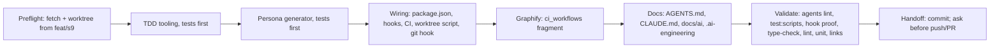

# Port the Tarraula engineering workflow into Optra

**TL;DR.** Optra already has a Claude setup, but it is single-agent, Codex is retired, and TDD is not enforced by any tool. We install the Tarraula operating system on top of it:
- an always-on `AGENTS.md` flow (nodes A–Z), with phase docs loaded at each node
- persona agents generated from one source, for Claude Code only (**Codex stays retired**, per your 2026-09-23 instruction)
- a TDD hook plus a CI gate, so "failing test first" is enforced by the tools instead of trusted
- one worktree per task
- graphify as the discovery step

Everything is adapted to Optra's real stack:
- Bun + Turborepo
- NestJS with Jest (`apps/api`)
- Next 14 with Vitest (`apps/web`)
- Vitest in `packages/*` and `scripts/seed`
- Drizzle + pgvector
- a single `main` → VPS deploy

Analogy: today the house rules are a note on the fridge. After this change the door lock checks them: it will not open until you show a failing test.

Docs loaded: reference `docs/ai/planning.md` and `docs/ai/plan-template.md`, through a read-only explorer digest on 2026-09-23.

## Flowchart

## Decisions already made (your answers, 2026-09-23)

1. **Base branch.** The work starts from the stack tip `feat/s9-price-vendor-history` (331ab21). The gate is added to the existing S0d "Quality gate" job in `.github/workflows/deploy.yml`. The PR can only land after the S-stack.
2. **Hooks.** Drop `check-predict-verify.sh` and its ack file. Keep `check-plan-gate.sh` and `check-gstack.sh`. Add `tdd-red-guard.mjs`.
3. **Pacing.** Reference node U wins. After one plan approval, work continues automatically as long as the model and reasoning pair stays the same. Optra's "pause after every step" rule is retired.
4. **No Codex** (your correction on plan review). Nothing is generated under `.codex/` and no TOML is written. The Codex-retired rule in CLAUDE.md and `.ai-engineering/runtime/codex.md` stays. The only lifted ban is on `AGENTS.md` itself: it now exists purely as the always-on core that CLAUDE.md imports through `@AGENTS.md`, and it contains no Codex content.
5. **Graphify.** Port the node K rule plus the plan and closeout gates. Port only `ci_workflows.py`, wired into the existing `scripts/graphify-complete.py`. Refresh the stale graph once, at closeout.

## Task metadata

- **Classification:**
  - Intent: `INFRASTRUCTURE`
  - Workflow: Infra Plan
  - Size: **Deep** (CI + hooks + workflow contract)
  - Domain: AI workflow tooling (new ownership-map row)
  - Risk: Deep
  - Contract areas: CI gate, Claude hooks, agent contract. **No API or DB contract impact.**
- **Detected running model:** `claude-opus-5-5`.
- **Recommended pair:** `claude-opus-5-5`, high reasoning, for every phase (confidence: high).
  - Why: the TDD tooling involves JSON-reporter parsing and git plumbing, and the docs merge involves judgment calls.
  - Using a single pair means node U never forces a stop.
  - Minimum capability: frontier coding.
  - Fallback: `claude-sonnet-5`, high, for Phases 5–6.
- **Branch:** `infra/no-ticket-ai-workflow-port`, created from `feat/s9-price-vendor-history`.
- **Worktree:** `.claude/worktrees/infra-ai-workflow-port`.
- **Release path.** There is no dev or stg in Optra.
  - Evidence: `git ls-remote` shows only `main` and `feat/ai-engineering-bootstrap`. `docs/PRODUCTION-READINESS.md:68` says "Staging env: None." `docs/OPTRA-DEVELOPMENT-PLAN.md:1333` says staging is deferred.
  - Flow: task branch → one PR into `main` → **merge commit** (git history shows `Merge pull request #1…`). The "CI and Deploy" `deploy` job (`needs: ci`) then ships it to the VPS.
  - dev→stg→main is **not** ported.

## Gap matrix

| Reference artifact | Exists in Optra? | Action | Optra substitutions |
|---|---|---|---|
| `AGENTS.md` | No. CLAUDE.md:116 forbids it. | **Create** as the always-on core imported by CLAUDE.md. Lift only the AGENTS.md ban; `.codex/` and `.ai-scratchpad.md` stay forbidden. Drop the reference's "Codex does not auto-load CLAUDE.md" line, and scope the caveman and persona blocks to Claude sessions and subagents. | Persona line becomes "self-hosted Next.js 14, NestJS, PostgreSQL 16/pgvector (Drizzle), Redis/Bull, Docker on a VPS". Omit the Next-16 block (Optra uses Next 14). Commands use `bun run`. |
| `CLAUDE.md` (`@AGENTS.md` + facts) | Yes, 583 lines: a bootstrap spec with facts mixed in | **Rewrite/merge.** Line 1 becomes `@AGENTS.md`, followed by verified facts. Drop the bootstrap and hook-source sections; the master copy stays in `docs/ai/claude-bootstrap-template.md`. | Keep: Identity, the naming note (live `mnemra_*` cookies), product invariants, verified commands, DESIGN.md, guardrails. |
| `AI_WORKFLOW.md`, `PLANNING_STANDARDS.md` | No | **Create** as stubs. PLANNING_STANDARDS keeps the evidence gate and the Graphify gate. | — |
| `docs/ai/task-router.md` | Yes | **Merge.** Adopt the reference intent enums and the Intent→prompt→skill table. Keep Tiny/Express/Standard/Deep, because the plan-gate hook depends on them. | Optra Deep defaults: auth/OTP/JWT, roles, migrations, Bull, RAG, limits, S3, Resend, deploy. |
| `planning.md`, `plan-template.md` | No | **Create, adapted.** The template keeps Optra's Risk and Backward-Compat matrices. Plans are saved to `docs/plans/<branch-short-name>.md`. | Replace "Supabase discipline" with "Drizzle/Postgres discipline": explicit columns, `workspaceId` filter, pagination, no N+1, pgvector index. Migrations: `packages/db/drizzle/`, applied by `bun run db:migrate` in CI and by the API container on prod start (DEPLOYMENT.md); destructive changes need owner approval. Drop the i18n and idb-cache sections. |
| `execution.md`, `handoff.md` | No | **Create, adapted** | Worktree via `scripts/new-task-worktree.sh`, then `bun install --frozen-lockfile`. Release is one PR → `main` as a merge commit. Completion Gate: `gh pr checks`, graphify evidence, docs sync, and a `learnings.md` entry whose Predicted line comes from the plan (no live ask). |
| `testing-strategy.md` | Yes | **Merge.** Add a "Strict TDD" section at the top. The existing infra exemption stays consistent, because infra files are not guarded source. | Jest (api), Vitest (web/ai/db/ui/seed), `node --test` (`scripts/**/*.test.mjs`) |
| `agent-orchestration.md` | No | **Create** | Claude-only model matrix, File Ownership Rule for the new personas, Optra domain briefings. The reference's "Codex CLI Round Structure" becomes a round structure for Claude subagents. Drop the dangling `agent-parity.md` link. |
| `entry-point.md`, `context-refresh.md` | Yes | **Merge.** Context order starts at AGENTS.md; the refresh list gains the new files. | — |
| `operating-contract.md` | No | **Create** (pointer stub) | — |
| `autonomous-engineering.md` | No | **Create, slimmed.** Activation, approval gates, lifecycle. Structured work orders stay **disabled** until a task source is configured. | Drop Obsidian, TAR-####, the Manila schedule and Vercel. |
| `dev-environment.md` | No | **Create** | `docker:dev:*`, `.claude/launch.json` (api 3001, web 3000), `db:seed`, `.nvmrc` 22, pointers to DEPLOYMENT.md and DOCKER.md |
| `pr-evidence.md` + PR template | No template | **Create both.** `.github/PULL_REQUEST_TEMPLATE.md` in Spanish and English. | UI evidence via the Browser tool or a recording. No Playwright (gap). |
| ownership map, risk register, arch manifest, repository-map, 4 prompts | Yes | **Merge, scoped:** a tooling row, a "Workflow & Agent Tooling" index section, and the prompts' discovery step set to graphify first | api/db-contracts: **no contract impact**, no edit |
| `.ai-engineering/` | Yes (44 files, `autonomy_level: 2`) | **Merge.** Add `core/task-state-machine.md`. Update `runtime/claude.md` with the new precedence (AGENTS.md via CLAUDE.md). Leave `runtime/codex.md` retired, except its ban list no longer names `AGENTS.md`. Add `activation: PILOT_FROZEN` + `pilot:` to the yaml. Update MANIFEST.md. | The full `AUTONOMOUS_ENGINEERING_BOOTSTRAP.md` layout (manifest.yaml, schemas, adapters, fingerprint approval) is **not installed in the reference either**. **Skip** for parity; logged as a gap. |
| `agents/src/*.agent.mjs` + prompts → generator + test → `.claude/agents` (the `.codex/agents` output is **dropped**) | No | **Create**. Remove the reference's `codex` field, TOML renderer and `.codex` orphan scan from the port. | Personas: `01-project-manager`, `02-db-architect` (replaces supabase-architect), `03-nextjs-frontend-dev` (Next 14), `04-ui-ux-designer`, `05-code-reviewer`, `06-security-auditor`, `07-test-engineer`, `08-accessibility-auditor`, `09-nestjs-backend-dev` (replaces be-agent). Claude model: `sonnet`. |
| `tdd-red-guard` + `scripts/ci/{tdd-lib,tdd-red,tdd-gate,tdd-runner,test-repo}` + tests | No | **Create, adapted** | See "TDD substitutions" below |
| `scripts/ci/verified-tree.mjs` | No | **Skip.** It caches to a self-hosted runner's disk, and Optra CI runs on ephemeral `ubuntu-latest`, so the cache would always miss. | — |
| `scripts/git-hooks/pre-commit` + `prepare` | No | **Create.** Blocks commits on `main`. Runs `agents:lint` when persona files are staged. This is the local backstop, because CI `paths-ignore: **/*.md` skips PRs that only touch `.claude/agents`. | — |
| `scripts/new-task-worktree.sh` | No | **Create**, with an optional third argument `base-ref` (default `origin/main`), because Optra slices stack. Gitignore `.claude/worktrees/`. | — |
| graphify node K + gates; `scripts/graphify/*` | CLI installed. `graphify-out/` is tracked but stale (2026-08-15, 49 commits behind). | **Port** the rules + `ci_workflows.py`. **Skip:** `db_bridge`/`pg_objects` (Supabase); `route_map`/`i18n`/`infra_config`/`residual_files` (Tarraula paths); the prepare/build/label/remap/merge pipeline (Optra's `graphify-complete.py` already builds). | `.github/workflows/*.yml` |

### TDD substitutions

- **Guarded source.** The reference uses `^src/.+\.tsx?$`. Optra guards:
  - `apps/api/src/**/*.ts`
  - `apps/web/{app,src}/**/*.{ts,tsx}` and `apps/web/middleware.ts`
  - `packages/{ai,db,ui}/src/**/*.{ts,tsx}`
  - `scripts/seed/**/*.ts`
- **Not guarded:**
  - spec, test, e2e-spec, `.d.ts`, `__tests__/`
  - **`packages/types`**: it is type-only, has no test runner, and `type-check` verifies it
- **Test kinds:**
  - `unit`: api `*.spec.ts` runs under Jest (cwd `apps/api`). web/ai/db/ui `*.spec.ts(x)` run under Vitest (cwd = the package). `scripts/seed/**/*.test.ts` runs under root Vitest.
  - `scriptTests`: `scripts/**/*.test.mjs` runs under `node --test`.
  - `e2e`: `apps/api/test/**/*.e2e-spec.ts`. Not run for RED.
  - `migrations`: `packages/db/drizzle/**`. The matching `migrationTests` are `packages/db/src/**/*.spec.ts` or api e2e specs.
  - `ui` (`.tsx`) needs a runnable spec: Vitest + jsdom. Playwright is absent and would be a new dependency.
- **Runner.** The reference parses TAP. Optra uses JSON reporters instead:
  - `jest --json --outputFile=<tmp>`
  - `vitest run --reporter=json --outputFile=<tmp>`
  - Both emit `testResults[].assertionResults[]{title,status}`, so one `parseJsonReport` covers both.
  - A file-level failure is a file with `status:"failed"` and zero failed assertions.
  - Binaries run via `bunx` in the package cwd.
- **Base run in tdd-gate.** The reference symlinks `node_modules`. Optra instead runs `bun install --frozen-lockfile` plus `turbo build --filter=@repo/db --filter=@repo/ai` inside the temporary base worktree. Otherwise Bun's `@repo/*` links would resolve to the head code, and RED would pass for the wrong reason.
- **Other adaptations:**
  - Messages are in English.
  - Waiver keys are `TDD-Waiver:`, `E2E-Waiver:`, `Migration-Waiver:`.
  - `PROMOTION_REFS = ["main"]`.
  - Only new test titles need the `error:` > `edge:` > `regression:` > `happy:` order; existing titles are grandfathered.

## Conflicts with existing Optra rules

| Existing rule (evidence) | Reference rule | Resolution |
|---|---|---|
| Codex retired; AGENTS.md forbidden (CLAUDE.md:3,91,116,538; `.ai-engineering/runtime/codex.md:12-20`) | Same behavior under Claude and Codex | **Decided: Codex stays retired.** Only the AGENTS.md ban is lifted, because AGENTS.md is now the core that CLAUDE.md imports. Edit CLAUDE.md:116 and the `runtime/codex.md` ban list to match. |
| Single-Agent Rule (CLAUDE.md:75; task-router.md:202) | Automatic persona routing + FE/BE fan-out | Replace with the routing default. The orchestrator still owns the plan and the final validation. |
| Pause after every step (CLAUDE.md:53-57) | Node U auto-continue | **Decided: node U.** |
| Predict-verify contract + hook (CLAUDE.md:507-531) | Learnings sync happens at handoff | **Decided: drop.** Keep the `learnings.md` entry; its Predicted line comes from the plan. |
| Deep needs approval before the plan AND before implementation (task-router.md:193-198) | Node E (RCA) + node R (plan) | Keep Optra's stricter pair for Deep only: discovery approval at E/G, plan approval at R. |
| repository-map before grep (CLAUDE.md:450) | Graphify first, grep as fallback | New order: graphify → repository-map → grep. |
| Tiny…Deep sizes | SMALL/MEDIUM/LARGE | Keep Tiny…Deep as the only vocabulary. Adopt the intent enums. |

## Phase 1 — Preflight (`claude-opus-5-5`, high)

1. Run `git fetch origin`.
2. Run `git worktree add .claude/worktrees/infra-ai-workflow-port -b infra/no-ticket-ai-workflow-port feat/s9-price-vendor-history`.
3. Inside the worktree:
   - `nvm use 22`
   - `bun install --frozen-lockfile`
   - copy `.env` from the primary checkout (untracked; tests need it)
4. In the **primary** checkout, write `.claude/.plan-ack` = `{"size":"deep","plan":"approved","matrices":"present"}`. The active hooks use cwd = primary. Do this only after you approve.
5. Save this plan as `docs/plans/infra-ai-workflow-port.md`.

## Phase 2 — TDD tooling, tests first (`claude-opus-5-5`, high)

- **Files:**
  - `scripts/ci/test-repo.mjs`: a scratch repo whose fixture is `scripts/seed/__tests__/*.test.ts` plus source, run under root Vitest, with root `node_modules` symlinked
  - `scripts/ci/tdd-lib.mjs`, `tdd-runner.mjs`, `tdd-red.mjs`, `tdd-gate.mjs`, each with a `.test.mjs`
  - `scripts/hooks/tdd-red-guard.mjs` + `.test.mjs`
- **Test titles** use the prefix order, because this PR's own gate checks them.
- **Order:**
  1. Write all `*.test.mjs`.
  2. `node --test "scripts/**/*.test.mjs"` → RED (modules missing), output pasted.
  3. Commit `test(tooling): …`.
  4. Implement until green.
  5. Commit `feat(tooling): …`.
- **Constraint:** Node built-ins only, **no new dependencies**.

## Phase 3 — Persona generator, tests first (`claude-opus-5-5`, high)

1. Write `scripts/generate-agent-defs.test.mjs` first and confirm it fails (RED).
2. Port `scripts/generate-agent-defs.mjs` for Claude only:
   - Output goes only to `.claude/agents/<prefix>-<name>.md`. There is no TOML renderer, `codex` field or `.codex` directory.
   - `--check` catches drift, orphans in `.claude/agents` and `ownedGlobs` conflicts.
   - `GLOBAL_POLICY` is rewritten for Optra: caveman ultra, persona line, graphify first, AGENTS.md flow, `.ai-engineering/` reads, Drizzle migration rule.
3. Create the 9 `agents/src/*.agent.mjs` files and their `agents/src/prompts/*.md`. The generic personas are rewritten for Optra:
   - test-engineer: Jest/Vitest, `bun run tdd:red`, `.spec.ts`
   - ui-ux-designer: English copy, DESIGN.md "Calm Utility" tokens
   - security-auditor: workspace isolation, JWT/OTP, rate limits
4. `ownedGlobs`. Each glob must appear literally in agent-orchestration.md; the test asserts this.
   - db-architect: `packages/db/src/schema/**`, `packages/db/drizzle/**`
   - nestjs-backend-dev: `apps/api/src/**`, `packages/ai/src/**`, `packages/types/src/**`
   - nextjs-frontend-dev: `apps/web/app/**`, `apps/web/src/**`, `packages/ui/src/**`
5. Run `npm run agents:generate`.

## Phase 4 — Wiring (`claude-opus-5-5`, high)

- **Root `package.json`**, new scripts:
  - `agents:generate`
  - `agents:lint`
  - `tdd:red` = `node scripts/ci/tdd-red.mjs`
  - `tdd:gate` = `node scripts/ci/tdd-gate.mjs`
  - `test:scripts` = `node --test "scripts/**/*.test.mjs"`
  - `prepare` = `git config core.hooksPath scripts/git-hooks || true`
- **`.claude/settings.json` + `settings.example.json`:**
  - `Skill` → check-gstack (unchanged)
  - `Edit|Write|MultiEdit` → check-plan-gate only
  - add `Edit|Write|MultiEdit|NotebookEdit|Bash` → `node "$CLAUDE_PROJECT_DIR/scripts/hooks/tdd-red-guard.mjs"`
  - `settings.local.json` is not touched
- **Delete** `.claude/hooks/check-predict-verify.sh`.
- **`.gitignore`:** drop the `.predict-verify-ack` line; add `.claude/worktrees/`.
- **New scripts:** `scripts/new-task-worktree.sh` and `scripts/git-hooks/pre-commit`, both mode 755.
- **`.github/workflows/deploy.yml`, `ci` job only:**
  - checkout gets `fetch-depth: 0`
  - after "Build typed workspace packages", add:
    - `TDD gate`: `if: github.event_name == 'pull_request'`; env `TDD_GATE_BASE: origin/${{ github.base_ref }}`, `TDD_GATE_HEAD_REF`, `PR_BODY`; runs `bun run tdd:gate`
    - `Script tests`: `bun run test:scripts`
    - `Agent definitions lint`: `bun run agents:lint`, always (under a second)
  - the `deploy` job is untouched
- **`.github/PULL_REQUEST_TEMPLATE.md`:**
  - bilingual sections: Resumen / Summary, Qué cambia / What changes, Cómo probar / How to test
  - then Change Type, Evidence, Testing, TDD evidence, Risk and Rollback, as defined in `pr-evidence.md`

## Phase 5 — Graphify (`claude-opus-5-5`, high)

- Port `scripts/graphify/ci_workflows.py`.
- **UNVERIFIED DEPENDENCY:** how `scripts/graphify-complete.py` merges extra fragments. Read that file in full first. If the integration needs more than ~20 lines of glue, stop and ask.
- Verify by running the extractor against `deploy.yml` and inspecting the nodes and edges it emits.

## Phase 6 — Docs and rules (`claude-opus-5-5`, high)

- **Create:**
  - `AGENTS.md`: every reference block, in the same order, adapted. The mermaid A–Z nodes are verbatim except S (base = `origin/main` or the stated stack base) and W (single PR → `main`).
  - `AI_WORKFLOW.md`, `PLANNING_STANDARDS.md`
  - `docs/ai/{planning,plan-template,execution,handoff,agent-orchestration,operating-contract,autonomous-engineering,dev-environment,pr-evidence}.md`
  - `.ai-engineering/core/task-state-machine.md`
- **Rewrite `CLAUDE.md`:** `@AGENTS.md`, then these sections:
  - What Optra is
  - Tech stack REAL, with file evidence
  - Conventions
  - DB rules: workspaceId, Drizzle migrations, embedding dimension 1536
  - How agents operate
  - Verified commands
  - Don't-do list
  - Design System
- **Merge, scoped:**
  - `docs/ai/`: `task-router`, `testing-strategy`, `entry-point`, `context-refresh`, `module-ownership-map`, `risk-register`, `architecture-manifest`, `file-index/repository-map`, `prompts/*`
  - `.ai-engineering/`: `runtime/{claude,codex}.md`, the yaml (`activation: PILOT_FROZEN`, `pilot: {simulation_required: true, first_real_task_merge_blocked: true}`), `MANIFEST.md`
- **Zero Tarraula facts.** Every Optra fact cites a repo path.

## Phase 7 — Validation (`claude-opus-5-5`, high); paste all output

1. `npm run agents:generate && npm run agents:lint` is clean: 9 personas, 9 files, and no `.codex/` directory.
2. `npm run test:scripts` passes.
3. Hook proof, inside the worktree:
   - Pipe `{"tool_name":"Edit","tool_input":{"file_path":"<wt>/packages/ai/src/index.ts"},"cwd":"<wt>"}` into `node scripts/hooks/tdd-red-guard.mjs`. Expect exit **2**.
   - Add the probe `packages/ai/src/tdd-probe.spec.ts`, containing `it('error: probe')` that imports a missing module.
   - Run `npm run tdd:red`. It writes the marker.
   - Run the same hook call again. Expect exit **0**.
   - Delete the probe and the marker.
4. `bun run type-check`, `bun run lint`, then `bun run test` in api, web, ai, db and ui, plus `bun run db:seed:test`: all green. Compose services must be up (reuse the primary stack's ports).
5. Doc links: a scratchpad Node script (not committed) resolves every relative link and every backticked repo path in new or changed `.md` files. Zero dangling.
6. Graphify closeout: run `graphify update .` for code and the `/graphify . --update` skill flow for docs. Report the graph diff and token cost.

## Phase 8 — Handoff (`claude-opus-5-5`, high)

- Use focused commits on the task branch.
- Omit the **Co-Authored-By trailer** everywhere.
- Add a `learnings.md` entry.
- Fix the stale pacing line in `MEMORY.md`.
- **Ask before** `git push` or opening a PR (see Q1).
- Write the PR title and body in Spanish + English, in plain language.
- Final report plus the status block.

## Risk matrix

| Risk | Likelihood | Impact | Mitigation | Rollback |
|---|---|---|---|---|
| The CLAUDE.md rewrite drops a still-valid rule | Med | High | The Conflicts table lists every removal; other rules are kept or moved to a named doc; the PR diff gets a review | Revert the file |
| The guard gives a false positive, or misses a Bash write | Med | Med | Reference test matrix + Optra paths; `--waiver`; fails open on bad input | Remove the settings entry |
| The tdd-gate base run (bun install + build) is slow or flaky | Med | Med | PR-only; 5 min timeout; exit 2 means "could not evaluate" | Drop the CI step |
| `fetch-depth: 0` slows CI | Low | Low | The repo has ~180 commits | Revert one line |
| `prepare` runs inside Docker/CI installs | Low | Low | `\|\| true` | Remove the script |
| A PR that only touches `.claude/agents/*.md` skips CI | Med | Low | The pre-commit hook runs agents:lint | — |
| The stacked base cannot merge before S0–S9 | High | Low | Stacked PR, retargeted to main later (Q1) | — |

## Backward compatibility matrix

| Changed file / symbol | Used by (outside this task) | Breaks? | Handling |
|---|---|---|---|
| `deploy.yml` `ci` job | Every push/PR; `deploy` needs `ci` | No | Steps are additive; the gate runs on PRs only; `deploy` is untouched |
| `.claude/settings.json` | Every Claude session | Intended change | predict-verify out, TDD guard in, others unchanged |
| `check-predict-verify.sh` (deleted) | settings, settings.example, CLAUDE.md, `claude-bootstrap-template.md` | No | References updated in the same change. The template is a reusable master for other repos, so it keeps its own copy (noted) |
| `CLAUDE.md` | Sessions; `.ai-engineering/runtime/claude.md` precedence | No | Precedence doc updated |
| `package.json` | CI, humans | No | New keys only |
| `docs/ai/*` | Sessions; the S-stack also edits 9 of these files | No | The base is the stack tip |

## Open questions / UNVERIFIED

1. **PR target.** A stacked PR needs `feat/s9-price-vendor-history` pushed, and it has 36 unpushed commits.
   - A (recommended): push it, then open a PR from `infra/no-ticket-ai-workflow-port` into `feat/s9-price-vendor-history`.
   - B: open the PR into `main`, which will also show all 36 S commits.
   - I will ask before any push.
2. The graphify semantic pass over the ~30 changed docs will spend LLM tokens. The count is unknown until it runs, and it will be reported.
3. Out of scope, flagged only: 64 tracked `.claude/skills/*` symlinks point to a nonexistent `second-brain` path, so all of them are broken. They are left untouched.
