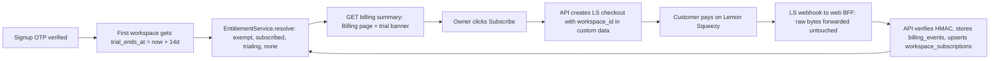

# Lemon Squeezy billing, slice S3: billing core

Docs loaded: planning.md, plan-template.md

Parent: `docs/plans/lemon-squeezy-billing-program.md` (owner-approved 2026-10-08). This file is the S3 Layer-2 spec. No new product decisions; every deviation from the program plan is listed in "Deviations from the program plan" and needs the orchestrator's yes before Phase 4.

TL;DR: Optra has no billing code today. This slice lets a new signup get a 14-day app-side trial, lets a workspace owner subscribe through Lemon Squeezy (the hosted checkout is the cash register, Optra never sees a card), and lets Lemon Squeezy tell Optra about it through a signed webhook (a tamper-proof postcard). Optra computes "what is this workspace allowed to do" in one place and shows it on a Billing page. Nothing is blocked yet: enforcement ships dark and the gates that actually refuse work are slice S4.

### Flowchart (high-level)



(Render this inline as SVG with `mcp__visualize__show_widget` at review time; the mermaid block is what the saved plan keeps.)

### Task metadata

- Classification: `NEW_FEATURE` · `Deep` · Billing Requests / Payments / Plan Upgrades (`docs/ai/module-ownership-map.md`), plus Auth / Permissions (`verifyOtp` writes the trial), Workspaces (columns on `workspaces`) · risk-register "Billing", "Payments", "Plan Upgrades", "Landing Pricing Copy" (S5), "Database Migrations"
- Contract areas: API (4 endpoints, `docs/ai/contracts/api-contracts.md`), Database (`0037`: 2 columns, 2 tables, 1 enum), Permissions (owner-only checkout/portal, public signed webhook), External integrations (Lemon Squeezy REST + webhooks), Jobs: no contract impact (webhook is processed inline)
- Docs loaded: `planning.md, plan-template.md`
- Claims reversed while investigating: (1) program plan says migration `0036`; `0036_groovy_randall.sql` already exists on `origin/main` (photo intake, PR #38), so S3 is **`0037`** and S4 becomes `0038`. (2) program plan lists `subscription_payment_*` among events that upsert `workspace_subscriptions`; the Lemon Squeezy docs say those events carry a *subscription invoice* object, not a subscription (https://docs.lemonsqueezy.com/help/webhooks/event-types), so they cannot be upserted. (3) program plan says the BFF forwards `request.text()`; `request.arrayBuffer()` is byte-exact and used instead.
- Detected running model: Sonnet 5.5 (`claude-sonnet-5-5`) wrote this spec; the program plan sets Opus 5.5 for execution.
- Recommended model: every phase `Opus 5.5`, high reasoning (program plan). Identical pair across phases, so no switch stops. Confidence: high. Fallback: `Sonnet 5.5`, high reasoning (Phase 4 services need the most care; do not drop below high). Minimum capability: Deep-domain reasoning for webhook idempotency and entitlement edge cases.
- Branch: `feat/no-ticket-billing-core` from `origin/main` (worktree `.claude/worktrees/feat-billing-core`)
- Release path: one PR into `main`, "Create a merge commit"; S4 (`feat/no-ticket-billing-metering`) stacks on this branch and retargets to `main` after this merges (`docs/ai/handoff.md` "Release flow"). `TDD_RED_BASE` stays default `origin/main` for S3.
- Required skills: `/plan-eng-review` (before approval of this file), `/design-review` (Billing page), `/qa`, `/review`, `/canary` after deploy
- Execution preflight: `git fetch origin`; worktree already exists; in it `nvm use`, `bun install --frozen-lockfile`; local stack `docker compose up -d --wait postgres redis seaweedfs`

## Layer 1: human summary

What a buyer sees: sign up, verify the code, land in a workspace that already says "14 days left in your trial". The new Billing page (sidebar, below Settings) shows the state (trial, subscribed, no plan), the Solo and Team plans, and, for the workspace owner, a Subscribe button that jumps to Lemon Squeezy. After paying, Lemon Squeezy posts a signed message to us and the page flips to Active. "Manage billing" opens Lemon Squeezy's own customer portal (card, seats, cancel, invoices), so Optra builds none of that.

What the owner sees that is new in the repo: three tables (`workspace_subscriptions`, `billing_events`, the `billing_plan` enum) and two columns on `workspaces` (`trial_ends_at`, `billing_exempt`). Existing workspaces get no trial and are not exempt until Romeo runs the runbook SQL in S5; nothing changes for them while `BILLING_ENFORCEMENT` is off, which it is by default.

What is deliberately not here: refusing any request (S4), usage meters with real numbers (S4; the summary returns `used: null`), cost caps (S4), landing/legal copy and the prod env guard (S5).

Simpler options rejected: (a) store plan/trial columns on `workspaces` instead of a subscription table, rejected because LS subscription id, customer id, variant, status, seats and dates would widen the hot `workspaces` table (same reasoning as `workspace_digest_settings`); (b) poll Lemon Squeezy on a schedule instead of webhooks, rejected because it needs a Bull job, a cursor and still lags; (c) call LS `GET /v1/subscriptions/:id` on every `payment_*` event, rejected as a new LS-availability dependency inside webhook handling for no entitlement gain (`past_due` is already entitled, and `subscription_updated` arrives for every state change per the LS docs).

**Risk Matrix** (narrowed from the program plan, plus S3-specific rows)

| Risk | Likelihood | Impact | Mitigation | Rollback |
|---|---|---|---|---|
| Forged webhook grants a plan | Low | Revenue loss | HMAC-SHA256 hex over raw bytes, `timingSafeEqual`, length check first, `store_id` and variant allowlist, workspace must exist | `DELETE` the row; rotate `LEMONSQUEEZY_WEBHOOK_SECRET` |
| BFF mutates the body and valid hooks fail HMAC | Medium | Paid users never activated | `forwardRaw` reads `arrayBuffer()` and sends the same bytes; Vitest compares bytes; Playwright signs a body containing non-ASCII and posts it through the real BFF | revert the route file; LS retries for up to 3 days |
| Out-of-order or duplicate deliveries | High (LS retries) | Wrong status | `body_sha256` unique (exact retry no-op), monotonic `ls_updated_at` guard, replay tests for created, updated, cancelled, expired in both orders | rows are derived; re-delivering from the LS dashboard repairs them |
| `custom_data.workspace_id` names another tenant | Low | Wrong tenant gets a plan | `custom` is set server-side from the guarded `:workspaceId` param, never from the body; webhook trusts only signed payload; a subscription id already attached to a different workspace is refused (terminal, logged) | n/a |
| Processing error makes LS retry forever | Medium | Noise | only genuine failures answer 500 (retriable); payload problems that can never succeed (wrong store, unknown variant or workspace) answer 200 and store `last_error` | n/a |
| New `timestamptz` columns beside the repo's `timestamp` convention | Low | Confusion | all other columns are `timestamp` without zone (tests run `TZ=UTC`); drizzle maps both to `Date`; called out for db-architect and the reviewer | n/a |
| `GET /workspaces/:id` starts returning billing columns | High if untreated (`select()`/`returning()` of everything) | Leaks `billingExempt` to every member | explicit `WORKSPACE_COLUMNS` at the four return sites in `workspaces.service.ts`; e2e regression asserts the keys are absent | revert the service edit |
| Trial farming (new email, new trial) | Medium | $4/signup AI cost once S4 caps it | trial only on `verifyOtp`'s first workspace; `POST /workspaces` never sets it; one trial per verified email is the owner's accepted bound (program plan decision 2) | `BILLING_ENFORCEMENT` stays off until S5 |
| LS API down at checkout or portal | Medium | Owner cannot subscribe for minutes | 10 s `AbortSignal.timeout`, `502` with a retry message, nothing written | none needed |
| LS env missing in an environment | Medium | Checkout 503, webhook 503 | explicit `503` (never a silent success); S5 adds the prod env guard | set the env |
| Seeded or existing workspaces show "No active plan" | High | Alarm | `enforced:false` keeps the banner silent for `none`; Billing page still lists plans; runbook `billing_exempt` before the S5 flip | n/a |

**Backward Compatibility Matrix** (usage search recorded below the table)

| Changed File / Symbol | Used By (outside this feature) | Breaks? | Handling |
|---|---|---|---|
| `packages/db/src/schema/workspaces.ts` `workspaces` (+2 cols, `Workspace`/`NewWorkspace` types) | `auth.service.ts#verifyOtp` insert; `workspaces.service.ts` create/getOne/update/`getWorkspaceOrThrow`; `insights/*-tick.processor.ts` and `digest.processor.ts` (select explicit ids); ~20 api specs and 4 e2e specs insert workspaces with `.values({name, ownerId})`; `apps/e2e/support/db.ts#seedWorkspace`; `scripts/seed`; `workspace-member.guard.spec.ts` types `Workspace` | No | new columns are nullable / defaulted; no literal typed as full `Workspace` is constructed (searched: only `workspace-member.guard.spec.ts` reads one). Affected, NOT modified |
| `packages/db/drizzle/0037_*` | API container start (`apps/api/Dockerfile` CMD), `docker/api-dev-entrypoint.sh`, CI "Apply database migrations", `unit-global-setup.ts` (recreates `optra_unit` from migrations) | No | additive only; old code on the new schema works (nothing reads the new objects); new code never runs on the old schema because migrate precedes start |
| `apps/api/src/workspaces/workspaces.service.ts` return shapes | `GET/PATCH/POST /workspaces*`, `acceptInvite` response, web `getWorkspace`/`updateWorkspace`, `workspace-context.tsx` | No | same four keys as before (`id, name, ownerId, createdAt`), now explicit instead of `select()`; contract rows already list exactly these keys |
| `apps/api/src/auth/auth.service.ts#verifyOtp` | `POST /auth/verify-otp`, `register` flows, 14 api e2e specs that call `/auth/verify-otp` | No | one extra column in the insert; no response change |
| `apps/api/src/main.ts` `{ rawBody: true }` | every route (all parsers now also keep `req.rawBody`) | No | Nest only attaches a Buffer; memory cost is one extra reference per JSON request, bounded by the 1 MB parser limit; `configureApp` unchanged (`useBodyParser` passes `rawBody` through, verified in `@nestjs/core@10.4.22` `nest-application.js` line 150-158) |
| `apps/api/src/app.module.ts` `imports` | all e2e specs boot `AppModule` | No | `BillingModule` has no required env at boot (missing LS env only fails the calls that need it) |
| `apps/web/src/components/workspace-nav.tsx` `workspaceNavItems` (+Billing, workspace group) | `workspace-nav.spec.ts` (asserts exactly `['Members','Settings']` and 7 hrefs), `apps/e2e/tests/shell-alignment.spec.ts:72`, `workspace-shell.spec.ts` (`KEPT`), `tour/tour-anchors.ts#navAnchorFor` (returns `undefined` for unknown suffix, safe), 6 pages that mount `WorkspaceNav` | Existing assertions fail by design | the three test files are edited in Phase 3 (RED) to expect Billing; `onboarding-tour.spec.ts:163` (replay below Settings) still holds because Billing sits below Settings and replay is in the sidebar footer. Affected, tests modified |
| `apps/web/app/workspaces/[id]/layout.tsx` (mounts `BillingBanner`) | every workspace page | No | banner renders nothing unless trial <= 3 days or (`none` and `enforced`); on fetch error renders nothing (advisory; the Billing page has its own error state) |
| `packages/types/src/index.ts` (+`export * from './billing'`) | web and api imports of `@repo/types` | No | new names only (searched: no existing `BillingPlan|BillingState|BillingSummary`) |
| `.env.example` (+7 vars) | `apps/e2e/support/env.ts#apiEnv` spreads it into the API env; `scripts/verify-env.sh`; docker compose `env_file` | No | `BILLING_ENFORCEMENT=off` and `LEMONSQUEEZY_API_URL` are the only uncommented lines; secrets are commented (prod-only) |
| `docker-compose.yml`, `docker-compose.prod.yml`, `scripts/check-prod-env.sh` | api reads `.env` through `env_file` | Not modified | the new vars flow in unchanged; the prod env guard is S5 |

Usage search recorded (Graphify first: `graph.json` indexes the files above, but not literal `select()` sites, so the last two rows used grep after `/graphify query` for `workspaces` consumers returned only module-level edges): grep `from(workspaces)`, `insert(workspaces)`, `into workspaces`, `type Workspace`, `workspaceNavItems`, `BillingPlan|BillingState|BillingSummary` across `apps packages scripts`.

## Layer 2: execution spec

Model for every phase: Opus 5.5, high reasoning. Strict TDD note: `scripts/hooks/tdd-red-guard.mjs` blocks edits to `packages/db/src/**` until a RED marker exists (no schema exemption), so Phase 1 starts with a schema spec and its RED. The marker is per branch and unlocks all later guarded edits; Phase 3 re-runs `tdd:red` over the full spec set.

### Phase 1: schema (db-architect alone, after a 1.0 RED)

**1.0 (test-engineer, alone).** Write `packages/db/src/schema/billing-columns.spec.ts` (cases in the Test Matrix, `vitest`, pattern of `procurement-review-columns.spec.ts`). Run `bun run tdd:red`; it must report a valid RED (the spec imports `./workspaceSubscriptions` and `./billingEvents`, which do not exist). Commit `test(db): billing columns and tables (0037)`.

**1.1 (db-architect, alone).** Exact files:

1. `packages/db/src/schema/workspaces.ts`. Old:
```ts
import { pgTable, uuid, varchar, timestamp } from 'drizzle-orm/pg-core'
import { users } from './users'

export const workspaces = pgTable('workspaces', {
  id: uuid('id').primaryKey().defaultRandom(),
  name: varchar('name', { length: 255 }).notNull(),
  ownerId: uuid('owner_id').references(() => users.id).notNull(),
  createdAt: timestamp('created_at').defaultNow().notNull(),
})
```
New:
```ts
import { boolean, pgTable, uuid, varchar, timestamp } from 'drizzle-orm/pg-core'
import { users } from './users'

export const workspaces = pgTable('workspaces', {
  id: uuid('id').primaryKey().defaultRandom(),
  name: varchar('name', { length: 255 }).notNull(),
  ownerId: uuid('owner_id').references(() => users.id).notNull(),
  createdAt: timestamp('created_at').defaultNow().notNull(),
  // App-side free trial (no card). Set once, in auth.service.ts#verifyOtp, on a
  // user's first workspace only. NULL = no trial (every other workspace).
  trialEndsAt: timestamp('trial_ends_at', { withTimezone: true }),
  // Set by hand (SQL runbook, S5) for workspaces that predate billing.
  billingExempt: boolean('billing_exempt').notNull().default(false),
})
```
2. `packages/db/src/schema/workspaceSubscriptions.ts` (new, complete content):
```ts
import { integer, pgEnum, pgTable, timestamp, uniqueIndex, uuid, varchar } from 'drizzle-orm/pg-core'
import { workspaces } from './workspaces'

export const billingPlanEnum = pgEnum('billing_plan', ['solo', 'team'])

// One row per workspace (1:1), written only from a signed Lemon Squeezy
// webhook. Same shape as workspace_digest_settings: a separate table so the
// hot workspaces table stays narrow. status is the LS status as received
// (on_trial, active, paused, past_due, unpaid, cancelled, expired), not an enum,
// so a new LS status never needs a migration.
export const workspaceSubscriptions = pgTable(
  'workspace_subscriptions',
  {
    id: uuid('id').primaryKey().defaultRandom(),
    workspaceId: uuid('workspace_id')
      .references(() => workspaces.id, { onDelete: 'cascade' })
      .notNull(),
    lsSubscriptionId: varchar('ls_subscription_id', { length: 64 }).notNull(),
    lsCustomerId: varchar('ls_customer_id', { length: 64 }).notNull(),
    lsVariantId: varchar('ls_variant_id', { length: 64 }).notNull(),
    plan: billingPlanEnum('plan').notNull(),
    status: varchar('status', { length: 32 }).notNull(),
    seats: integer('seats').notNull().default(1),
    renewsAt: timestamp('renews_at', { withTimezone: true }),
    endsAt: timestamp('ends_at', { withTimezone: true }),
    lsUpdatedAt: timestamp('ls_updated_at', { withTimezone: true }).notNull(),
    createdAt: timestamp('created_at', { withTimezone: true }).defaultNow().notNull(),
    updatedAt: timestamp('updated_at', { withTimezone: true }).defaultNow().notNull(),
  },
  (table) => ({
    workspaceIdUniqueIdx: uniqueIndex('workspace_subscriptions_workspace_id_unique').on(table.workspaceId),
    lsSubscriptionIdUniqueIdx: uniqueIndex('workspace_subscriptions_ls_subscription_id_unique').on(table.lsSubscriptionId),
  }),
)

export type WorkspaceSubscription = typeof workspaceSubscriptions.$inferSelect
export type NewWorkspaceSubscription = typeof workspaceSubscriptions.$inferInsert
```
3. `packages/db/src/schema/billingEvents.ts` (new, complete content):
```ts
import { jsonb, pgTable, text, timestamp, uniqueIndex, uuid, varchar } from 'drizzle-orm/pg-core'

// Every distinct webhook delivery, stored before it is processed. Deliberately
// no workspace_id and no FK: a delivery that names an unknown workspace must
// still be recorded (last_error says why). body_sha256 unique makes an exact
// Lemon Squeezy retry a no-op once processed_at is set.
export const billingEvents = pgTable(
  'billing_events',
  {
    id: uuid('id').primaryKey().defaultRandom(),
    eventName: varchar('event_name', { length: 64 }).notNull(),
    bodySha256: varchar('body_sha256', { length: 64 }).notNull(),
    payload: jsonb('payload').$type<Record<string, unknown>>().notNull(),
    receivedAt: timestamp('received_at', { withTimezone: true }).defaultNow().notNull(),
    processedAt: timestamp('processed_at', { withTimezone: true }),
    lastError: text('last_error'),
  },
  (table) => ({
    bodySha256UniqueIdx: uniqueIndex('billing_events_body_sha256_unique').on(table.bodySha256),
  }),
)

export type BillingEvent = typeof billingEvents.$inferSelect
export type NewBillingEvent = typeof billingEvents.$inferInsert
```
4. `packages/db/src/schema/index.ts`. Old (last line): `export * from './catalogMatches'`. New: that line followed by
```ts
export * from './workspaceSubscriptions'
export * from './billingEvents'
```
5. In `packages/db`: `bun run db:generate` creates `drizzle/0037_<name>.sql`, `drizzle/meta/0037_snapshot.json`, and appends `idx: 37` to `drizzle/meta/_journal.json`. Do not hand-edit them. Expected SQL: `CREATE TYPE billing_plan`, `CREATE TABLE workspace_subscriptions`, `CREATE TABLE billing_events`, `ALTER TABLE workspaces ADD COLUMN trial_ends_at`, `ADD COLUMN billing_exempt boolean DEFAULT false NOT NULL`, two FK/unique-index statements. If drizzle-kit emits anything with `DROP`, `RENAME` or `SET NOT NULL` on an existing column, stop.

Done when: `packages/db` `bun run test` is green (1.0 spec); `bun run db:migrate` applies cleanly (a) to an empty database and (b) to a local database that already holds rows (the `bun run db:seed` demo tenant), where existing `workspaces` rows read `trial_ends_at IS NULL` and `billing_exempt = false`; `bunx tsc --noEmit` in `packages/db`. Commit `feat(db): billing columns and tables (0037)`. Migration backward-compat statement: additive; defaulted/nullable; old API code runs on the new schema untouched; a 3-statement forward-only migration with no destructive step, so no rollback note beyond "leave it, the objects are unread when billing code is reverted".

### Phase 2: contract lock (orchestrator; done in this task, re-verified after Phase 1)

Files written: `packages/types/src/billing.ts`, `packages/types/src/index.ts`, `docs/ai/contracts/api-contracts.md` (4 rows), `docs/ai/contracts/db-contracts.md` (workspaces row + 2 rows), `docs/ai/module-ownership-map.md` (Billing Requests, Payments, Plan Upgrades), this plan.

Re-check after Phase 1 (orchestrator, read-only): column names in `db-contracts.md` equal `workspaceSubscriptions.ts` / `billingEvents.ts` exactly; the migration file number in the three docs is the one drizzle-kit produced (`0037`). Mismatch means the docs are fixed, not the schema.

Locked endpoints (guards and codes; response JSON is `packages/types/src/billing.ts`):

| Method, path | Guards | Request | Success | Errors |
|---|---|---|---|---|
| `GET /workspaces/:workspaceId/billing` | `JwtAuthGuard`, `WorkspaceMemberGuard` | none | `200 BillingSummary` | `401`, `403` |
| `POST /workspaces/:workspaceId/billing/checkout` | `JwtAuthGuard`, `WorkspaceMemberGuard`, `RolesGuard` + `@Roles('owner')` | `CreateCheckoutRequest` (`CreateCheckoutDto`) | `201 CreateCheckoutResponse` | `400` (plan not solo/team; seats not an integer in 1..25; `seats` with `solo`), `401`, `403`, `409` already entitled, `502` LS error/timeout, `503` LS not configured |
| `POST /workspaces/:workspaceId/billing/portal` | same as checkout | none | `200 PortalResponse` | `401`, `403`, `404` no subscription row, `502`, `503` |
| `POST /billing/webhooks/lemonsqueezy` | none, `@SkipThrottle()` | raw body + `X-Signature` + `X-Event-Name` | `200 {received: true}` | `400` shape, `401` signature, `500` processing failure (LS retries), `503` secret unset |

`BILLING_ENFORCEMENT` is read per call through `ConfigService.get` (not cached at boot) so specs can flip it; any value other than the exact string `on` means off.

### Phase 3: RED (test-engineer, alone)

Write every file in the Test Matrix. Existing test files edited (literal edits are the test-engineer's, the plan names them so the blast radius is closed):
- `apps/web/src/components/workspace-nav.spec.ts`: line `expect(within(workspace).getAllByRole('link').map((link) => link.textContent)).toEqual(['Members', 'Settings'])` becomes `...toEqual(['Members', 'Settings', 'Billing'])`; the `regression: renders the seven kept items ...` case becomes eight items with `['Billing', '/workspaces/w1/billing']` last and its title says "eight".
- `apps/e2e/tests/shell-alignment.spec.ts:72`: `.toHaveText(['Members', 'Settings'])` becomes `.toHaveText(['Members', 'Settings', 'Billing'])`.
- `apps/e2e/tests/workspace-shell.spec.ts:11`: `KEPT` gains `'Billing'`.
- `apps/api/src/auth/auth.service.spec.ts` and `apps/api/src/workspaces/workspaces.service.spec.ts`: add the cases named in the Test Matrix.

Also written in this phase (outside the persona globs, assigned to test-engineer by this spec per File Ownership Rule item 6): `apps/e2e/stubs/lemonsqueezy-stub.ts`, `apps/e2e/playwright.config.ts`.

`apps/e2e/stubs/lemonsqueezy-stub.ts` (complete content; built like `openai-stub.ts`: plain `node:http`, `PORT` env, `/health`, 404 for anything unlisted so a new LS call is a failing test):
```ts
// A stand-in for the Lemon Squeezy REST API, so the browser suite exercises the
// real checkout and portal paths without a key, a network or a store.
// Only what slice S3 calls: POST /v1/checkouts and GET /v1/subscriptions/:id.
// Anything else is a 404. GET /__checkouts returns every checkout request body
// the stub has received, so a spec can assert on custom.workspace_id.
// Run: `bun stubs/lemonsqueezy-stub.ts` (PORT defaults to 4011).
import { randomUUID } from 'node:crypto'
import { createServer, type IncomingMessage, type ServerResponse } from 'node:http'

export const STUB_API_KEY = 'lsk-e2e-stub' // support/env.ts passes the same value to the API
const port = Number(process.env.PORT ?? 4011)
const origin = `http://127.0.0.1:${port}`
const checkouts: unknown[] = []

function send(response: ServerResponse, status: number, body: unknown): void {
  response.writeHead(status, { 'content-type': 'application/vnd.api+json' })
  response.end(JSON.stringify(body))
}

async function readJson(request: IncomingMessage): Promise<any> {
  const chunks: Buffer[] = []
  for await (const chunk of request) chunks.push(chunk as Buffer)
  return JSON.parse(Buffer.concat(chunks).toString('utf8') || '{}')
}

createServer(async (request, response) => {
  const path = (request.url ?? '/').split('?')[0]
  try {
    if (request.method === 'GET' && path === '/health') return send(response, 200, { ok: true })
    if (request.method === 'GET' && path === '/__checkouts') return send(response, 200, checkouts)
    if (request.method === 'GET' && path.startsWith('/checkout/')) {
      response.writeHead(200, { 'content-type': 'text/html' })
      return response.end('<!doctype html><title>Stub checkout</title><h1>Stub checkout</h1>')
    }
    if (request.method === 'GET' && path.startsWith('/billing/')) {
      response.writeHead(200, { 'content-type': 'text/html' })
      return response.end('<!doctype html><title>Stub portal</title><h1>Stub portal</h1>')
    }
    if (request.headers.authorization !== `Bearer ${STUB_API_KEY}`) {
      return send(response, 401, { errors: [{ status: '401', title: 'Unauthenticated.' }] })
    }
    if (request.method === 'POST' && path === '/v1/checkouts') {
      const body = await readJson(request)
      checkouts.push(body)
      const id = randomUUID()
      return send(response, 201, { data: { type: 'checkouts', id, attributes: { url: `${origin}/checkout/${id}` } } })
    }
    const subscription = /^\/v1\/subscriptions\/([^/]+)$/.exec(path)
    if (request.method === 'GET' && subscription) {
      return send(response, 200, {
        data: {
          type: 'subscriptions',
          id: subscription[1],
          attributes: { urls: { customer_portal: `${origin}/billing/${subscription[1]}`, update_payment_method: `${origin}/billing/${subscription[1]}/card` } },
        },
      })
    }
    console.error(`lemonsqueezy-stub: unhandled ${request.method} ${path}`)
    send(response, 404, { errors: [{ status: '404', title: `stub has no route for ${path}` }] })
  } catch (error) {
    console.error('lemonsqueezy-stub:', error)
    send(response, 500, { errors: [{ status: '500', title: 'stub failure' }] })
  }
}).listen(port, '127.0.0.1', () => {
  console.log(`lemonsqueezy-stub listening on ${origin}`)
})
```
`apps/e2e/playwright.config.ts`. Old:
```ts
import { API_PORT, API_URL, OPENAI_STUB_PORT, WEB_PORT, WEB_URL, apiEnv, runId } from './support/env'
```
New:
```ts
import { API_PORT, API_URL, LS_STUB_PORT, OPENAI_STUB_PORT, WEB_PORT, WEB_URL, apiEnv, runId } from './support/env'
```
Old (first `webServer` entry, followed by the API entry):
```ts
  webServer: [
    {
      command: 'bun stubs/openai-stub.ts',
      url: `http://127.0.0.1:${OPENAI_STUB_PORT}/health`,
      env: { PORT: String(OPENAI_STUB_PORT) },
      reuseExistingServer: false,
      stdout: 'pipe',
    },
```
New:
```ts
  webServer: [
    {
      command: 'bun stubs/openai-stub.ts',
      url: `http://127.0.0.1:${OPENAI_STUB_PORT}/health`,
      env: { PORT: String(OPENAI_STUB_PORT) },
      reuseExistingServer: false,
      stdout: 'pipe',
    },
    {
      command: 'bun stubs/lemonsqueezy-stub.ts',
      url: `http://127.0.0.1:${LS_STUB_PORT}/health`,
      env: { PORT: String(LS_STUB_PORT) },
      reuseExistingServer: false,
      stdout: 'pipe',
    },
```
`apps/e2e/support/env.ts`. Old: `export const OPENAI_STUB_PORT = 4010`. New:
```ts
export const OPENAI_STUB_PORT = 4010
export const LS_STUB_PORT = 4011
// Shared with stubs/lemonsqueezy-stub.ts (STUB_API_KEY) and tests/billing.spec.ts.
export const LS_STUB_API_KEY = 'lsk-e2e-stub'
export const LS_WEBHOOK_SECRET = 'whsec-e2e-stub'
export const LS_STORE_ID = '4242'
export const LS_VARIANT_SOLO = '9001'
export const LS_VARIANT_TEAM = '9002'
```
Old (inside `apiEnv()` return, after the OpenAI lines):
```ts
    OPENAI_API_KEY: 'sk-e2e-stub',
```
New:
```ts
    OPENAI_API_KEY: 'sk-e2e-stub',
    // Lemon Squeezy is stubbed the same way. Enforcement stays off: S3 refuses
    // nothing, and a workspace seeded without a trial must not start failing
    // other specs when S4 adds the gates.
    LEMONSQUEEZY_API_URL: `http://127.0.0.1:${LS_STUB_PORT}`,
    LEMONSQUEEZY_API_KEY: LS_STUB_API_KEY,
    LEMONSQUEEZY_STORE_ID: LS_STORE_ID,
    LEMONSQUEEZY_WEBHOOK_SECRET: LS_WEBHOOK_SECRET,
    LEMONSQUEEZY_VARIANT_SOLO: LS_VARIANT_SOLO,
    LEMONSQUEEZY_VARIANT_TEAM: LS_VARIANT_TEAM,
    BILLING_ENFORCEMENT: 'off',
```
`apps/e2e/support/db.ts`: append helpers `setWorkspaceBilling(workspaceId, { trialEndsInDays?: number | null; exempt?: boolean })` (plain SQL `update workspaces set trial_ends_at = now() + make_interval(days => $2) ...`, `null` clears it) and `subscriptionFor(workspaceId)` (plain SQL select on `workspace_subscriptions`). `apps/e2e/support/lemonsqueezy.ts` (new): `signBody(body: string): string` (hex HMAC-SHA256 with `LS_WEBHOOK_SECRET`), `subscriptionEvent({ workspaceId, subscriptionId, status, variantId, quantity, updatedAt, endsAt?, renewsAt?, userName? })` returning the JSON string a real `subscription_created` delivery carries (`meta.event_name`, `meta.custom_data.workspace_id`, `data.id`, `data.attributes.{store_id, customer_id, variant_id, status, first_subscription_item.quantity, renews_at, ends_at, updated_at, user_name}`), `postWebhook(request, body, signature?)` (Playwright `APIRequestContext` POST of the exact bytes to `${WEB_URL}/api/webhooks/lemonsqueezy` with `X-Signature` and `X-Event-Name`).

Run `bun run tdd:red` from the repo root and paste the failing output (api Jest `billing/*.spec.ts` cannot load; web specs cannot import `webhook-proxy`, `billing`, `billing-banner`, page). Commit `test(billing): ...` containing only test files, the stub and `playwright.config.ts`.

Done when: `bun run tdd:red` reports a valid RED and wrote the marker; `bunx playwright test --list` in `apps/e2e` lists `billing.spec.ts`.

### Phase 4: implementation (nestjs-backend-dev and nextjs-frontend-dev together, same worktree)

Both prompts carry the "File Ownership Rule" text from `docs/ai/agent-orchestration.md` verbatim and the Domain Briefing block (see "Orchestrator notes"). `packages/types/src/**` is frozen; a needed change goes back to the orchestrator.

#### 4A. Backend (`nestjs-backend-dev`), complete file list

New: `apps/api/src/billing/billing.module.ts`, `plans.ts`, `webhook-signature.ts`, `lemonsqueezy.client.ts`, `entitlement.service.ts`, `billing.service.ts`, `billing-webhook.service.ts`, `billing.controller.ts`, `billing-webhook.controller.ts`, `dto/create-checkout.dto.ts`.
Modified: `apps/api/src/app.module.ts`, `apps/api/src/main.ts`, `apps/api/src/auth/auth.service.ts`, `apps/api/src/workspaces/workspaces.service.ts`, `.env.example`.

1. `apps/api/src/main.ts`. Old: `const app = await NestFactory.create<NestExpressApplication>(AppModule)`. New:
```ts
  // rawBody keeps the exact bytes of every JSON body on req.rawBody. The Lemon
  // Squeezy webhook is verified over those bytes, never over re-serialized JSON.
  const app = await NestFactory.create<NestExpressApplication>(AppModule, { rawBody: true })
```
2. `apps/api/src/app.module.ts`. Old: `import { CatalogModule } from './catalog/catalog.module'`. New: that line plus `import { BillingModule } from './billing/billing.module'`. Old: `    CatalogModule,\n  ],\n  providers: [{ provide: APP_GUARD, useClass: ThrottlerGuard }],`. New: `    CatalogModule,\n    BillingModule,\n  ],\n  providers: [{ provide: APP_GUARD, useClass: ThrottlerGuard }],`.
3. `apps/api/src/auth/auth.service.ts`. Old: `import { AuthLimitsService } from './auth-limits.service'`. New: that line plus `import { TRIAL_DAYS } from '../billing/plans'`. Old:
```ts
        .values({
          name: `${user.email}'s workspace`,
          ownerId: user.id,
        })
```
New:
```ts
        .values({
          name: `${user.email}'s workspace`,
          ownerId: user.id,
          // The only place a trial starts: a user's first workspace, in the
          // same transaction as the verification claim, so it happens once.
          trialEndsAt: new Date(now.getTime() + TRIAL_DAYS * 24 * 60 * 60 * 1000),
        })
```
(`now` is the `const now` already in scope in `verifyOtp`; confirmed by `gt(otps.expiresAt, now)` and `.set({ usedAt: now })` in the same method.)
4. `apps/api/src/workspaces/workspaces.service.ts`: add after the `DbTx` type alias
```ts
// Explicit columns: workspaces now carries billing columns (trial_ends_at,
// billing_exempt) that only GET /workspaces/:id/billing may expose.
const WORKSPACE_COLUMNS = {
  id: workspaces.id,
  name: workspaces.name,
  ownerId: workspaces.ownerId,
  createdAt: workspaces.createdAt,
}
```
and replace the four return sites. `create`: Old `        .values({ name, ownerId: userId })\n        .returning()` New `        .values({ name, ownerId: userId })\n        .returning(WORKSPACE_COLUMNS)`. `update`: Old `      .where(eq(workspaces.id, workspaceId))\n      .returning()` New `      .where(eq(workspaces.id, workspaceId))\n      .returning(WORKSPACE_COLUMNS)`. `getOne`: Old `    const [workspace] = await db\n      .select()\n      .from(workspaces)` New `    const [workspace] = await db\n      .select(WORKSPACE_COLUMNS)\n      .from(workspaces)`. `getWorkspaceOrThrow`: Old `    const [workspace] = await client\n      .select()\n      .from(workspaces)` New `    const [workspace] = await client\n      .select(WORKSPACE_COLUMNS)\n      .from(workspaces)`.
5. `.env.example`: append after the `# --- Umami analytics` block's last line `UMAMI_WEBSITE_ID=` and before `# Production only (not needed for local dev)`:
```
# --- Billing (Lemon Squeezy, Merchant of Record) ----------------------------
# Off by default: entitlement is computed and shown on the Billing page, nothing
# is refused. Only the exact value "on" enforces (slice S4 adds the gates).
BILLING_ENFORCEMENT=off
# The real API; the browser suite points this at its stub (apps/e2e/stubs).
LEMONSQUEEZY_API_URL=https://api.lemonsqueezy.com
# Production / test-store only, set in the VPS .env, never here. Unset means
# checkout and portal answer 503 and the webhook answers 503.
# LEMONSQUEEZY_API_KEY=<API key from the LS dashboard>
# LEMONSQUEEZY_STORE_ID=<numeric store id>
# LEMONSQUEEZY_WEBHOOK_SECRET=<signing secret entered when creating the webhook>
# LEMONSQUEEZY_VARIANT_SOLO=<variant id of Optra Solo>
# LEMONSQUEEZY_VARIANT_TEAM=<variant id of Optra Team>
```
6. `apps/api/src/billing/plans.ts` (complete content):
```ts
import type { BillingPlan } from '@repo/types'

/**
 * Trial length in days. apps/web/src/lib/legal-facts.ts#TRIAL_DAYS states the
 * same fact for the public copy; the api cannot import apps/web, so
 * plans.spec.ts reads that file and fails if the two differ.
 */
export const TRIAL_DAYS = 14

export const SEATS_MIN = 1
export const SEATS_MAX = 25

export interface PlanQuota {
  matchedLines: number
  photoChecks: number
}

/** Mirrors the landing pricing section (program plan "Plans"). Team pools per buyer. */
export function quotasFor(plan: BillingPlan, seats: number): PlanQuota {
  return plan === 'team'
    ? { matchedLines: 2000 * seats, photoChecks: 300 * seats }
    : { matchedLines: 400, photoChecks: 100 }
}

/** The trial grants the Solo allowance (owner decision 2026-10-08). */
export const TRIAL_QUOTAS: PlanQuota = quotasFor('solo', 1)

type EnvReader = { get(key: string): string | undefined }

const VARIANT_ENV: Record<BillingPlan, string> = {
  solo: 'LEMONSQUEEZY_VARIANT_SOLO',
  team: 'LEMONSQUEEZY_VARIANT_TEAM',
}

export function variantIdFor(plan: BillingPlan, env: EnvReader): string | null {
  const value = env.get(VARIANT_ENV[plan])?.trim()
  return value ? value : null
}

export function planForVariant(variantId: string | number | null | undefined, env: EnvReader): BillingPlan | null {
  if (variantId === null || variantId === undefined || variantId === '') return null
  const id = String(variantId)
  for (const plan of ['solo', 'team'] as const) {
    if (variantIdFor(plan, env) === id) return plan
  }
  return null
}

/** LS statuses that grant access: https://docs.lemonsqueezy.com/api/subscriptions/the-subscription-object (status). */
const ENTITLED_STATUSES = new Set(['active', 'past_due', 'on_trial'])

/**
 * past_due is LS retrying the card (4 retries over 2 weeks) and stays entitled.
 * cancelled is a grace period until ends_at. paused, unpaid and expired are not.
 */
export function isEntitledStatus(status: string, endsAt: Date | null, now: Date): boolean {
  if (ENTITLED_STATUSES.has(status)) return true
  return status === 'cancelled' && endsAt !== null && now.getTime() < endsAt.getTime()
}
```
7. `apps/api/src/billing/webhook-signature.ts` (complete content):
```ts
import { createHmac, timingSafeEqual } from 'crypto'

/**
 * Lemon Squeezy signs the raw request body: X-Signature is the lowercase hex
 * HMAC-SHA256 of those bytes with the webhook signing secret
 * (https://docs.lemonsqueezy.com/help/webhooks/signing-requests). Lengths are
 * compared first because timingSafeEqual throws on a mismatch.
 */
export function verifySignature(rawBody: Buffer, signature: string | undefined, secret: string): boolean {
  if (!signature || !secret) return false
  const expected = Buffer.from(createHmac('sha256', secret).update(rawBody).digest('hex'), 'utf8')
  const given = Buffer.from(signature, 'utf8')
  if (expected.length !== given.length) return false
  return timingSafeEqual(expected, given)
}
```
8. `apps/api/src/billing/dto/create-checkout.dto.ts` (complete content):
```ts
import { IsIn, IsInt, IsOptional, Max, Min } from 'class-validator'
import type { BillingPlan } from '@repo/types'
import { SEATS_MAX, SEATS_MIN } from '../plans'

export class CreateCheckoutDto {
  @IsIn(['solo', 'team'])
  plan: BillingPlan

  @IsOptional()
  @IsInt()
  @Min(SEATS_MIN)
  @Max(SEATS_MAX)
  seats?: number
}
```
9. `lemonsqueezy.client.ts`: `@Injectable() class LemonSqueezyClient { constructor(config: ConfigService) }`.
   - `createCheckout(input: { variantId: string; quantity?: number; email: string; workspaceId: string; redirectUrl: string }): Promise<{ url: string }>`: `POST ${LEMONSQUEEZY_API_URL ?? 'https://api.lemonsqueezy.com'}/v1/checkouts`, headers `Accept: application/vnd.api+json`, `Content-Type: application/vnd.api+json`, `Authorization: Bearer ${LEMONSQUEEZY_API_KEY}`, `signal: AbortSignal.timeout(10000)`. Body: `{ data: { type: 'checkouts', attributes: { product_options: { redirect_url }, checkout_data: { email, custom: { workspace_id }, ...(quantity ? { variant_quantities: [{ variant_id: Number(variantId), quantity }] } : {}) } }, relationships: { store: { data: { type: 'stores', id: LEMONSQUEEZY_STORE_ID } }, variant: { data: { type: 'variants', id: variantId } } } } }`. Returns `data.attributes.url`. Shapes verified 2026-10-08 against https://docs.lemonsqueezy.com/api/checkouts/create-checkout (attributes `checkout_data.{email,custom,variant_quantities}`, `product_options.redirect_url`, response `data.attributes.url`). Discount codes need nothing: the LS checkout shows its own discount field by default (`checkout_options.discount` defaults true).
   - `getSubscription(lsSubscriptionId: string): Promise<{ customerPortalUrl: string }>`: `GET /v1/subscriptions/{id}`; returns `data.attributes.urls.customer_portal` (verified at https://docs.lemonsqueezy.com/api/subscriptions/retrieve-subscription; the URL is signed and expires, so it is fetched per click and never stored).
   - Error mapping, both methods: missing `LEMONSQUEEZY_API_KEY` or `LEMONSQUEEZY_STORE_ID` -> `ServiceUnavailableException('Billing is not configured')` before any network call; network error, `TimeoutError`/`AbortError`, non-2xx, or a response lacking the expected field -> `BadGatewayException('Billing provider unavailable. Try again in a moment.')` (the LS body is logged at `warn`, never returned).
10. `entitlement.service.ts`: `@Injectable() class EntitlementService { constructor(config: ConfigService) }` with `resolve(workspaceId: string, now: Date = new Date()): Promise<BillingSummary>`. Algorithm (one workspace read, one subscription read, both filtered by `workspaceId`, explicit columns):
    1. `select { trialEndsAt, billingExempt } from workspaces where id = workspaceId`; none -> `NotFoundException('Workspace not found')`. `select` the `workspace_subscriptions` row for `workspaceId` (may be absent).
    2. `enforced = config.get('BILLING_ENFORCEMENT') === 'on'`.
    3. state: `billingExempt` -> `exempt` (quotas `{null, null}`, `period` null, plan/seats from the subscription row if any, else null); else row present and `isEntitledStatus(row.status, row.endsAt, now)` -> `subscribed` (plan, seats, `quotas = quotasFor(plan, seats)`, `period` = UTC calendar month containing `now`: `start = Date.UTC(y, m, 1)`, `end = Date.UTC(y, m + 1, 1)`); else `trialEndsAt` and `now < trialEndsAt` -> `trialing` (`plan: null`, `quotas = TRIAL_QUOTAS`, `period = { start: trialEndsAt - TRIAL_DAYS days, end: trialEndsAt }`); else `none` (`quotas: null`, `period: null`).
    4. `subscriptionStatus`, `renewsAt`, `endsAt` come from the row whenever it exists (so the page can say "ended"), whatever the state. `used` is `{ matchedLines: null, photoChecks: null }` in S3 (no ledger yet). Dates are ISO strings.
    5. No gate, no refusal, no side effect: S3 only computes. `enforced` does not change `state`.
11. `billing.service.ts`: `@Injectable() class BillingService { constructor(config, entitlement: EntitlementService, ls: LemonSqueezyClient) }`.
    - `summary(workspaceId)` -> `entitlement.resolve(workspaceId)`.
    - `createCheckout(workspaceId: string, email: string, dto: { plan: BillingPlan; seats?: number }): Promise<CreateCheckoutResponse>`: (a) `plan === 'solo' && dto.seats !== undefined` -> `BadRequestException('seats applies to the team plan only')`; (b) read the subscription row; `isEntitledStatus(...)` true -> `ConflictException('This workspace already has a subscription. Use Manage billing.')`; (c) `variantIdFor(plan, config)` null -> `ServiceUnavailableException('Billing is not configured')`; (d) `ls.createCheckout({ variantId, quantity: plan === 'team' ? (dto.seats ?? 1) : undefined, email, workspaceId, redirectUrl: `${WEB_URL}/workspaces/${workspaceId}/billing?checkout=success` })` with `WEB_URL` defaulting to `http://localhost:3000` like `bootstrap.ts`. Writes nothing.
    - `portalUrl(workspaceId): Promise<PortalResponse>`: no row -> `NotFoundException('No subscription for this workspace')`; else `ls.getSubscription(row.lsSubscriptionId)` -> `{ url }`.
12. `billing-webhook.service.ts`: `@Injectable() class BillingWebhookService { constructor(config) }`, `handle(rawBody: Buffer, signature: string | undefined): Promise<{ received: true }>`:
    1. `secret = config.get('LEMONSQUEEZY_WEBHOOK_SECRET')`; unset -> `ServiceUnavailableException`, nothing stored. `verifySignature(rawBody, signature, secret)` false -> `UnauthorizedException('Invalid signature')`, nothing stored.
    2. `bodySha256 = sha256 hex of rawBody`; `JSON.parse` failure, or a missing `meta.event_name` (string), `data.id`, `data.attributes` (object) -> `BadRequestException('Unexpected webhook body')`, nothing stored.
    3. `insert into billing_events (eventName, bodySha256, payload) ... on conflict (body_sha256) do nothing returning id`. No row returned: select the existing row; `processedAt` set -> return `{ received: true }` (duplicate no-op); else reuse its id and continue (a previous attempt failed with 500).
    4. Event not in `{subscription_created, subscription_updated, subscription_cancelled, subscription_resumed, subscription_expired, subscription_paused, subscription_unpaused}` (this includes `subscription_payment_*`, which carry an invoice object, and `order_*`): stamp `processed_at`, return `{ received: true }`.
    5. Terminal rejections (stamp `processed_at` and `last_error`, return `{ received: true }`, no subscription write): `String(attributes.store_id) !== LEMONSQUEEZY_STORE_ID` ("store_id mismatch"); `planForVariant(attributes.variant_id, config)` null ("unknown variant"); `meta.custom_data.workspace_id` absent or not a UUID ("missing workspace_id"); no `workspaces` row with that id ("unknown workspace"); the same `ls_subscription_id` already stored for a different workspace ("subscription belongs to another workspace").
    6. In one `db.transaction()`: read the workspace's current row `for update`; same `ls_subscription_id` and `attributes.updated_at < ls_updated_at` -> skip the write (stale); a different `ls_subscription_id` while the stored one `isEntitledStatus` -> terminal "workspace already has an active subscription"; otherwise `insert ... on conflict (workspace_id) do update` setting `lsSubscriptionId, lsCustomerId, lsVariantId, plan, status, seats (team: first_subscription_item.quantity, solo: 1), renewsAt, endsAt, lsUpdatedAt, updatedAt`; then stamp `billing_events.processed_at` (and clear `last_error`) in the same transaction.
    7. Any thrown error outside the terminal cases: `update billing_events set last_error = <message>` (best effort), then `InternalServerErrorException` so LS retries; `processed_at` stays null.
13. `billing.controller.ts`: `@Controller('workspaces/:workspaceId/billing')`; `@Get() @UseGuards(JwtAuthGuard, WorkspaceMemberGuard) summary(@Param('workspaceId') id)`; `@Post('checkout') @UseGuards(JwtAuthGuard, WorkspaceMemberGuard, RolesGuard) @Roles('owner') checkout(@Param('workspaceId') id, @CurrentUser() user, @Body() dto: CreateCheckoutDto)` (default 201); `@Post('portal') @HttpCode(HttpStatus.OK)` same guards, `@Roles('owner')`. Imports and decorators exactly as `workspaces.controller.ts` does.
14. `billing-webhook.controller.ts`: `@Controller('billing/webhooks')`; `@Post('lemonsqueezy') @HttpCode(HttpStatus.OK) @SkipThrottle() receive(@Req() req: RawBodyRequest<Request>, @Headers('x-signature') signature?: string)`; `req.rawBody` undefined -> `BadRequestException('Missing body')`; else `webhook.handle(req.rawBody, signature)`. No auth guards: the signature is the authentication.
15. `billing.module.ts`: `imports: [AuthModule]`; `controllers: [BillingController, BillingWebhookController]`; `providers: [BillingService, BillingWebhookService, EntitlementService, LemonSqueezyClient, JwtAuthGuard, WorkspaceMemberGuard, RolesGuard]` (same guard-provider pattern as `workspaces.module.ts`); `exports: [EntitlementService]` (S4 consumes it).

DB discipline (planning.md): every query above selects explicit columns; the only tenant reads are `workspaces` (by primary key, after `WorkspaceMemberGuard`) and `workspace_subscriptions` (by `workspace_id`); `billing_events` is not tenant-scoped by design; no list endpoints; no N+1 (two reads per summary, run with `Promise.all`); the webhook upsert and `processed_at` stamp share one transaction. LLM cost impact: none (no OpenAI call; no rate limit or token budget touched).

Done when: all Phase 3 api specs are green under `bun run test` and `bun run test:e2e` (`apps/api`); `bun run type-check`; `bun run lint`.

#### 4B. Frontend (`nextjs-frontend-dev`), complete file list

New: `apps/web/src/lib/http/webhook-proxy.ts`, `apps/web/app/api/webhooks/lemonsqueezy/route.ts`, `apps/web/app/api/workspaces/[id]/billing/route.ts`, `apps/web/app/api/workspaces/[id]/billing/checkout/route.ts`, `apps/web/app/api/workspaces/[id]/billing/portal/route.ts`, `apps/web/src/lib/api/billing.ts`, `apps/web/app/workspaces/[id]/billing/page.tsx`, `apps/web/src/components/billing-banner.tsx`.
Modified: `apps/web/app/workspaces/[id]/layout.tsx`, `apps/web/src/components/workspace-nav.tsx`.

1. `apps/web/src/lib/http/webhook-proxy.ts` (complete content):
```ts
import { NextRequest, NextResponse } from 'next/server'

const API_URL = process.env.API_URL || 'http://localhost:3001'

/** A Lemon Squeezy event is a few KB; 1 MB is generous and bounds memory. */
export const WEBHOOK_MAX_BYTES = 1024 * 1024

function tooLarge() {
  return NextResponse.json({ message: 'Payload too large' }, { status: 413 })
}

// Reads at most maxBytes (null when the stream goes over), so a chunked body
// with no Content-Length cannot make the server buffer an unbounded payload.
async function readCapped(request: NextRequest, maxBytes: number): Promise<Uint8Array | null> {
  if (!request.body) return new Uint8Array(0)
  const reader = request.body.getReader()
  const chunks: Uint8Array[] = []
  let total = 0
  for (;;) {
    const { done, value } = await reader.read()
    if (done) break
    total += value.byteLength
    if (total > maxBytes) {
      await reader.cancel()
      return null
    }
    chunks.push(value)
  }
  const body = new Uint8Array(total)
  let offset = 0
  for (const chunk of chunks) {
    body.set(chunk, offset)
    offset += chunk.byteLength
  }
  return body
}

/**
 * Forwards a webhook to the API byte for byte. proxyJson cannot be used: it
 * parses and re-serializes the JSON, which changes the bytes the HMAC covers
 * (key order, whitespace, escapes) and makes every valid signature fail. No
 * bearer token and no cookies are forwarded: authenticity is the signature,
 * which only the API can check. The API's status and JSON answer are returned
 * as-is, because Lemon Squeezy retries any non-2xx.
 */
export async function forwardRaw(
  request: NextRequest,
  backendPath: string,
  options: { maxBytes?: number } = {},
): Promise<NextResponse> {
  const maxBytes = options.maxBytes ?? WEBHOOK_MAX_BYTES
  const declared = Number(request.headers.get('content-length'))
  if (Number.isFinite(declared) && declared > maxBytes) return tooLarge()

  const body = await readCapped(request, maxBytes)
  if (body === null) return tooLarge()

  const headers: Record<string, string> = {
    'Content-Type': request.headers.get('content-type') ?? 'application/json',
  }
  for (const name of ['x-signature', 'x-event-name']) {
    const value = request.headers.get(name)
    if (value) headers[name] = value
  }

  let response: Response
  try {
    response = await fetch(`${API_URL}${backendPath}`, { method: 'POST', headers, body })
  } catch {
    return NextResponse.json({ message: 'Billing service unavailable' }, { status: 502 })
  }
  const data = await response.json().catch(() => ({}))
  return NextResponse.json(data, { status: response.status })
}
```
2. `apps/web/app/api/webhooks/lemonsqueezy/route.ts` (complete content; `/api/**` is outside the `middleware.ts` matcher, verified at `apps/web/middleware.ts:62`):
```ts
import { NextRequest } from 'next/server'
import { forwardRaw } from '../../../../src/lib/http/webhook-proxy'

export async function POST(request: NextRequest) {
  return forwardRaw(request, '/billing/webhooks/lemonsqueezy')
}
```
3. BFF billing routes, same shape as `apps/web/app/api/workspaces/[id]/digest-settings/route.ts` (relative import of `proxyJson`, `context.params` a Promise): `billing/route.ts` exports `GET` -> `proxyJson(request, `/workspaces/${id}/billing`, { method: 'GET' })`; `billing/checkout/route.ts` exports `POST` -> `const body = await request.json()` then `proxyJson(request, `/workspaces/${id}/billing/checkout`, { method: 'POST', body })`; `billing/portal/route.ts` exports `POST` -> `proxyJson(request, `/workspaces/${id}/billing/portal`, { method: 'POST' })`.
4. `apps/web/src/lib/api/billing.ts` (complete content):
```ts
import type { BillingSummary, CreateCheckoutRequest, CreateCheckoutResponse, PortalResponse } from '@repo/types'
import { apiFetch } from './client'

export function getBilling(workspaceId: string): Promise<BillingSummary> {
  return apiFetch(`/api/workspaces/${workspaceId}/billing`)
}

export function startCheckout(workspaceId: string, input: CreateCheckoutRequest): Promise<CreateCheckoutResponse> {
  return apiFetch(`/api/workspaces/${workspaceId}/billing/checkout`, { method: 'POST', body: JSON.stringify(input) })
}

export function openPortal(workspaceId: string): Promise<PortalResponse> {
  return apiFetch(`/api/workspaces/${workspaceId}/billing/portal`, { method: 'POST' })
}
```
5. `apps/web/src/components/workspace-nav.tsx`. Old: `import { BriefcaseBusiness, ClipboardList, FileWarning, PackageSearch, Settings, Store, Users } from 'lucide-react'`. New: `import { BriefcaseBusiness, ClipboardList, CreditCard, FileWarning, PackageSearch, Settings, Store, Users } from 'lucide-react'`. Old: `    { label: 'Settings', href: `/workspaces/${workspaceId}/settings`, icon: <Settings className="size-4" />, group: 'workspace' },\n  ]`. New: the Settings line followed by `    { label: 'Billing', href: `/workspaces/${workspaceId}/billing`, icon: <CreditCard className="size-4" />, group: 'workspace' },\n  ]`. (No `workspacePrimaryTabItems` change: Billing is reached from the sidebar and the mobile drawer, like Members and Settings.)
6. `apps/web/app/workspaces/[id]/layout.tsx`. Old: `import { WorkspaceProvider } from '@/components/workspace-context'`. New: that line plus `import { BillingBanner } from '@/components/billing-banner'`. Old: `  return <WorkspaceProvider key={params.id} workspaceId={params.id}>{children}</WorkspaceProvider>`. New:
```tsx
  return (
    <WorkspaceProvider key={params.id} workspaceId={params.id}>
      <BillingBanner workspaceId={params.id} />
      {children}
    </WorkspaceProvider>
  )
```
7. `billing-banner.tsx` (`'use client'`): on mount `getBilling(workspaceId)`; only the latest request writes state (same `requestRef` guard as `workspace-context.tsx`). Renders `StatusBanner` (`@repo/ui`, variant `warning`) wrapped in a `Link` to `/workspaces/${workspaceId}/billing` when: `state === 'trialing'` and days left <= 3 (copy: `Your free trial ends in N days.`, `ends in 1 day.`, `ends today.`; days = `ceil((trialEndsAt - now) / 86_400_000)`), or `state === 'none'` and `enforced` (copy: `No active plan. Choose a plan to keep matching orders.`). Renders nothing in every other case, while loading, and on fetch error (advisory; the Billing page carries the error state).
8. `app/workspaces/[id]/billing/page.tsx` (`'use client'`, `AppShell` like `settings/page.tsx`, `WorkspaceNav`, `MobileTabBar`, `WorkspaceBrandLink`, `useWorkspaceContext` for the role, `useToast`). Design tokens only (`DESIGN.md` "Calm Utility", `packages/ui/src/globals.css`); primitives from `@repo/ui`: `Skeleton`, `StatusBanner`, `Button`, `DefinitionRow`, `StatCard`, `Card`. States (acceptance criteria, not polish):
   - loading: `Skeleton` blocks in place of the status panel and plan cards.
   - error: `StatusBanner variant="error"` "Couldn't load billing." with a Retry `Button`; a 401 follows `isUnauthorized` -> `/login` as the settings page does; a 403 shows `WorkspaceAccessDenied`.
   - `trialing`: "Free trial" panel with "N days left" and "Includes the Solo allowance: 400 matched lines and 100 photo checks a month" taken from `summary.quotas`, not typed in.
   - `subscribed`: plan name, seats (team), status line (`active`, `past due: Lemon Squeezy is retrying the card`, `cancelled: access until <endsAt>`), renewal date, and, for the owner, "Manage billing" -> `openPortal` -> `window.location.assign(url)`.
   - `exempt`: "This workspace is exempt from billing." and no plan cards.
   - `none`: "No active plan" and the plan cards; when `enforced` also says work is paused until a plan is chosen (never when `!enforced`).
   - usage meters: one per quota row; while `used.*` is `null` render the allowance only ("400 a month"), never a 0/400 meter (metering ships in S4).
   - plan cards (shown for `trialing` and `none`): Solo "$29 per month, 1 buyer" and Team "$69 per buyer per month" with a seat stepper 1..25 (`aria-label="Number of buyers"`, buttons disabled at the bounds). Prices are the landing facts (`apps/web/src/components/landing/pricing-plans.tsx`); S5 reconciles any copy change, and this file is listed in the S5 "claims trace" check. A line says "Subscribing now starts your paid plan immediately."
   - owner (role `owner` from `useWorkspaceContext().membership`): Subscribe -> `startCheckout(workspaceId, { plan, seats? })` -> `window.location.assign(url)`; `409` toasts "This workspace already has a subscription" and reloads the summary; `502`/`503` or any other error toasts "Couldn't reach billing. Try again in a moment." and keeps the page. Non-owner (admin or member): same information, no Subscribe or Manage buttons, note "Only the workspace owner can change billing."
   - `?checkout=success`: a success `StatusBanner` "Payment received. Activating your plan..." and the summary is re-read every 2 s, up to 10 times, stopping as soon as `state === 'subscribed'`; after the last try the banner reads "This is taking longer than usual. Refresh in a minute." (the redirect can beat the webhook).
9. Web a11y/design details left to the implementer within the tokens above; `/design-review` and the accessibility auditor check them in Phase 5.

Done when: all Phase 3 web specs green (`bun run test` in `apps/web`), `bun run type-check`, `bun run lint`, `bun run build`.

### Phase 5: QA fan-out (orchestrator dispatches), then closeout

After Round 3 (orchestrator runs the suites itself): `07-test-engineer`, `05-code-reviewer`, `06-security-auditor`, `08-accessibility-auditor`, `04-ui-ux-designer` together (UI and UI copy change). Security auditor focus: HMAC over raw bytes, length check before `timingSafeEqual`, no secret or LS body in logs/responses, `custom.workspace_id` from the route param, owner-only guards, SSRF none (fixed LS host from env), webhook `@SkipThrottle` blast radius, `rawBody` memory. Then `/design-review` on the Billing page in Brave, `/qa`, `/review`. Docs sync (orchestrator): `docs/ai/file-index/repository-map.md` (new symbols), `docs/ai/testing-strategy.md` inventory (new specs, LS stub), `docs/ai/contracts/*` re-verified, `docs/ai/module-ownership-map.md` re-verified, `CLAUDE.md` "Tech stack REAL" table/enum counts (37 tables, 21 enums become 40 and 22; recount with the grep in that paragraph), `.env.example` done in 4A, `learnings.md` entry, Graphify refresh per `docs/ai/planning.md` "Closeout refresh", then `docs/ai/handoff.md` Completion Gate.

## Validation and acceptance

### Test Matrix

| Layer | Required | File | Cases (order: error > edge > regression > happy) |
|---|---|---|---|
| Unit (db, Vitest) | yes (migration) | `packages/db/src/schema/billing-columns.spec.ts` | see list A |
| Unit (api, Jest, real Postgres `optra_unit`) | yes | `apps/api/src/billing/webhook-signature.spec.ts`, `plans.spec.ts`, `lemonsqueezy.client.spec.ts`, `entitlement.service.spec.ts`, `billing.service.spec.ts`, `billing-webhook.service.spec.ts`, `billing.controller.spec.ts`, `billing-webhook.controller.spec.ts`, `dto/create-checkout.dto.spec.ts`; edits to `auth/auth.service.spec.ts`, `workspaces/workspaces.service.spec.ts` | lists B1 to B11 |
| API e2e (Jest, real Nest app, `createNestApplication({ rawBody: true })` + `configureApp`, in-process LS stub server) | yes (controllers) | `apps/api/test/billing.e2e-spec.ts` | list C |
| Unit (web, Vitest) | yes | `apps/web/src/lib/http/webhook-proxy.spec.ts`, `apps/web/app/api/webhooks/lemonsqueezy/route.spec.ts`, `apps/web/app/api/workspaces/[id]/billing/route.spec.ts`, `.../billing/checkout/route.spec.ts`, `.../billing/portal/route.spec.ts`, `apps/web/src/lib/api/billing.spec.ts`, `apps/web/app/workspaces/[id]/billing/page.spec.tsx`, `apps/web/src/components/billing-banner.spec.tsx`; edit `apps/web/src/components/workspace-nav.spec.ts` | lists D1 to D9 |
| Browser e2e (Playwright, LS stub on :4011) | yes (page + BFF routes) | `apps/e2e/tests/billing.spec.ts`; edits `shell-alignment.spec.ts`, `workspace-shell.spec.ts` | list E |

Each list is written in the declared order; a case title is the literal title string (prefix included).

**A. `billing-columns.spec.ts`**
1. `error: workspaces.billing_exempt is NOT NULL with default false`
2. `error: workspace_subscriptions.workspace_id is NOT NULL and cascades on workspace delete`
3. `edge: workspaces.trial_ends_at is a nullable timestamptz with no default`
4. `edge: workspace_subscriptions has unique indexes on workspace_id and ls_subscription_id`
5. `edge: billing_events.body_sha256 is unique and payload is NOT NULL`
6. `edge: billing_events.processed_at and last_error are nullable`
7. `regression: migration 0037 contains no DROP, RENAME or SET NOT NULL on an existing column`
8. `regression: the billing_plan enum holds exactly solo and team`
9. `happy: the schema index exports workspaceSubscriptions and billingEvents`

**B1. `webhook-signature.spec.ts`**: `error: a missing signature is rejected`; `error: a signature of the wrong length is rejected without throwing`; `error: a signature over different bytes is rejected`; `error: the right secret over re-serialized JSON (key order and whitespace changed) is rejected`; `edge: an empty secret never verifies`; `edge: uppercase hex of the right digest is rejected`; `edge: a body with non-ASCII bytes verifies over the raw bytes`; `happy: the correct HMAC-SHA256 hex of the raw bytes verifies`.

**B2. `plans.spec.ts`**: `error: planForVariant is null for an unknown variant id`; `error: planForVariant is null when no variant env is set`; `error: variantIdFor is null when the env is unset or blank`; `edge: TRIAL_DAYS equals TRIAL_DAYS in apps/web/src/lib/legal-facts.ts` (reads the file as text); `edge: team quotas scale with seats and solo quotas ignore seats`; `edge: past_due and on_trial are entitled, unpaid, paused and expired are not`; `edge: cancelled is entitled before ends_at, not at or after it, and not with a null ends_at`; `regression: the trial quotas equal the Solo quotas`; `happy: planForVariant maps the solo and team ids, including a numeric id`; `happy: quotas are 400/100 for solo and 2000/300 per seat for team`.

**B3. `lemonsqueezy.client.spec.ts`** (`jest.spyOn(globalThis, 'fetch')`): `error: a 5xx answer becomes BadGatewayException`; `error: a network failure becomes BadGatewayException`; `error: a timeout (TimeoutError) becomes BadGatewayException`; `error: a 422 answer becomes BadGatewayException and its body is not in the message`; `error: a missing API key or store id throws ServiceUnavailableException before any fetch`; `edge: every call carries an AbortSignal`; `edge: an answer without data.attributes.url becomes BadGatewayException`; `regression: the checkout body carries custom.workspace_id, string store and variant ids, and variant_quantities only when a quantity is given`; `happy: createCheckout posts to LEMONSQUEEZY_API_URL/v1/checkouts with the Bearer and JSON:API headers and returns the url`; `happy: getSubscription returns urls.customer_portal`.

**B4. `entitlement.service.spec.ts`**: `error: an unknown workspace throws NotFoundException`; `error: no trial and no subscription is none with null quotas`; `error: an expired trial is none`; `error: an expired, unpaid or paused subscription is none`; `error: a cancelled subscription at or past ends_at is none`; `edge: a cancelled subscription before ends_at is subscribed`; `edge: past_due is subscribed`; `edge: an ended subscription during an open trial falls back to trialing`; `edge: exempt beats trial, subscription and none, with unlimited quotas`; `edge: team seats multiply the quotas and solo ignores seats`; `edge: trialing uses the Solo quotas and a period of trial start to trial end`; `edge: a paid period is the UTC calendar month and rolls over December to January`; `edge: another workspace's subscription never counts`; `regression: enforced mirrors BILLING_ENFORCEMENT, is false by default and only the exact value on turns it on, and never changes the state`; `regression: used is null for both counters until the ledger exists`; `happy: an active solo subscription is subscribed with plan solo and seats 1`; `happy: a future trial_ends_at is trialing`.

**B5. `billing.service.spec.ts`**: `error: checkout is 409 while a subscription is active, past_due or cancelled before ends_at`; `error: seats 0, 26, 1.5 and a seats value with the solo plan are BadRequest`; `error: a Lemon Squeezy 5xx or timeout surfaces as 502 and writes nothing`; `error: checkout with the plan's variant env unset is 503`; `error: portal without a subscription row is NotFoundException`; `error: portal with Lemon Squeezy unavailable is 502`; `edge: an expired subscription allows a new checkout`; `edge: team passes quantity = seats (default 1) and solo passes no quantity`; `edge: the workspace id and email sent to Lemon Squeezy are the arguments, not anything from a body`; `edge: the redirect url is WEB_URL/workspaces/:id/billing?checkout=success`; `happy: createCheckout returns the hosted url`; `happy: portalUrl returns the customer portal url`; `happy: summary returns the entitlement shape`.

**B6. `billing-webhook.service.spec.ts`**: `error: a missing or wrong signature is Unauthorized and stores nothing`; `error: an unset secret is ServiceUnavailable and stores nothing`; `error: a signed body that is not JSON is BadRequest`; `error: a signed body without meta.event_name is BadRequest`; `error: a wrong store_id is acknowledged, recorded with last_error, and writes no subscription`; `error: an unknown variant is acknowledged with last_error and writes no subscription`; `error: a non-UUID or missing custom_data.workspace_id is acknowledged with last_error`; `error: an unknown workspace id is acknowledged with last_error`; `error: a subscription id already stored for another workspace is refused and the other row is untouched`; `error: a database failure during the upsert throws 500, stores last_error and leaves processed_at null`; `edge: a duplicate delivery of a processed body does not touch the row again`; `edge: a delivery whose earlier attempt failed is processed on retry`; `edge: an older updated_at is skipped and the newer row stays`; `edge: payment_success, payment_failed and payment_recovered are stored and processed with no subscription change`; `edge: an unrelated event (order_created) is stored and ignored`; `edge: a new subscription replaces an expired one for the same workspace`; `edge: a different subscription is refused while the stored one is active`; `regression: created, then updated to past_due, then cancelled with ends_at, then expired ends as expired and resolves to none`; `regression: expired delivered before cancelled ends as expired`; `regression: a body with non-ASCII characters verifies and stores`; `happy: subscription_created for team with quantity 3 stores plan team, seats 3, renews_at and sets processed_at`; `happy: subscription_created for solo stores seats 1`.

**B7. `billing.controller.spec.ts`**: `error: checkout and portal require the owner role`; `error: summary, checkout and portal all use JwtAuthGuard and WorkspaceMemberGuard`; `edge: summary has no role restriction`; `edge: checkout passes the route workspace id and the caller email`; `happy: summary delegates to the service`. **B8. `billing-webhook.controller.spec.ts`**: `error: a request without a raw body is BadRequest`; `edge: the route has no auth guard and is marked SkipThrottle`; `happy: the raw body buffer and the signature header reach the service and the answer is {received: true}`. **B9. `dto/create-checkout.dto.spec.ts`**: `error: a plan other than solo or team is rejected`; `error: seats 0, 26, 1.5 and a numeric string are rejected`; `edge: seats may be omitted`; `happy: solo, and team with seats 1 and 25, are accepted`.

**B10. `auth/auth.service.spec.ts` (new describe `verifyOtp trial`)**: `edge: the auto-created workspace is not billing_exempt`; `regression: verifyOtp sets trial_ends_at to now plus TRIAL_DAYS on the auto-created workspace (within one minute)`. **B11. `workspaces/workspaces.service.spec.ts`**: `regression: create leaves trial_ends_at null (extra workspaces never get a trial)`; `regression: create, getOne, update and acceptInvite return only id, name, ownerId and createdAt`.

**C. `apps/api/test/billing.e2e-spec.ts`** (registers users through `/auth/register` + `/auth/verify-otp`, cleans up by prefix like `workspaces.e2e-spec.ts`; the LS stub is a `node:http` server on port 0 started in `beforeAll`, with `LEMONSQUEEZY_*` set on `process.env` before `AppModule` compiles):
`error: a webhook without X-Signature is 401 and stores nothing`; `error: a webhook with a wrong signature is 401`; `error: a webhook signed over a re-serialized body is 401`; `error: no token is 401 on summary, checkout and portal`; `error: a member and an admin cannot checkout or open the portal (403)`; `error: another workspace's id is 403 on summary, checkout and portal`; `error: checkout with an invalid plan, seats 26, or seats with solo is 400`; `error: checkout while subscribed is 409`; `error: checkout when Lemon Squeezy answers 500 is 502`; `error: checkout when Lemon Squeezy is unreachable is 502`; `error: portal without a subscription is 404`; `edge: a signed body of the wrong shape is 400`; `edge: a signed event for a wrong store is 200 and records last_error`; `edge: a fresh signup's summary is trialing with trialEndsAt about 14 days out`; `edge: a plain member can read the summary`; `edge: BILLING_ENFORCEMENT=on makes the summary report enforced true and still refuses nothing`; `regression: GET /workspaces/:id has no trialEndsAt or billingExempt key`; `regression: a signed subscription_created containing a non-ASCII name is accepted through the raw-body path`; `happy: checkout returns the stub url and the stub received custom.workspace_id equal to the route id, the caller email and the redirect url`; `happy: team checkout with seats 3 sends variant_quantities with quantity 3 and solo sends none`; `happy: a signed subscription_created writes the row and the summary becomes subscribed with plan team and seats 3`; `happy: portal returns the stub portal url once subscribed`; `happy: cancelled keeps the workspace subscribed until ends_at and expired ends it`.

**D (web).** D1 `webhook-proxy.spec.ts`: `error: a body over 1 MB is 413 and the API is never called`; `error: a declared content-length over the cap is 413 without reading the body`; `error: an unreachable API is 502`; `edge: a missing X-Signature is forwarded as absent (the API answers 401)`; `edge: no Authorization header and no cookies are forwarded`; `regression: the forwarded bytes equal the received bytes for non-ASCII, odd whitespace and reordered keys`; `regression: the API's status and body come back unchanged (a 401 stays a 401)`; `happy: POSTs to API_URL/billing/webhooks/lemonsqueezy with X-Signature, X-Event-Name and the content type`. D2 `route.spec.ts` (webhooks): `error: an oversize body is 413`; `error: a 401 from the API is returned as 401`; `happy: a signed body is forwarded and the 200 is returned`. D3-D5 BFF billing routes: `error: 401 without the access-token cookie`; `edge: the workspace id from the path is forwarded`; `happy: proxies the method, path, bearer and (checkout) body`. D6 `billing.spec.ts`: `error: a 409 from checkout is thrown as the API body`; `edge: ids are placed in the path`; `happy: getBilling, startCheckout and openPortal call the BFF with the right method and body`. D7 `page.spec.tsx`: `error: a failed summary load shows the error banner and Retry reloads`; `error: a member sees no Subscribe or Manage button and the owner-only note`; `error: an admin sees the owner-only note too`; `error: a 409 from checkout toasts and reloads the summary`; `error: a 502 from checkout toasts and keeps the page`; `error: a 403 shows the access-denied panel`; `edge: loading shows skeletons`; `edge: trialing shows the days left and the Solo allowance from the summary quotas`; `edge: none with enforced false does not say work is paused`; `edge: none with enforced true says work is paused`; `edge: exempt shows the exempt note and no plan cards`; `edge: the seat stepper stops at 1 and 25`; `edge: ?checkout=success polls every 2 s until subscribed and then stops`; `edge: ?checkout=success gives up after 10 reads with the longer-than-usual message`; `regression: a null used value renders the allowance, never a 0 of N meter`; `regression: a cancelled subscription shows the access-until date`; `happy: the owner's Subscribe calls startCheckout with plan and seats and navigates to the url`; `happy: a subscribed owner's Manage billing calls openPortal and navigates to the url`. D8 `billing-banner.spec.tsx`: `error: a failed fetch renders nothing`; `edge: subscribed and exempt render nothing`; `edge: trialing with 4 days left renders nothing`; `edge: none with enforced false renders nothing`; `regression: 1 day left reads "ends in 1 day" and 0 days reads "ends today"`; `happy: trialing with 3 days left links to the billing page`; `happy: none with enforced true shows the no-plan banner`. D9 `workspace-nav.spec.ts` edits as named in Phase 3 (existing titles keep their prefixes).

**E. `apps/e2e/tests/billing.spec.ts`** (own workspaces made with `seedWorkspace`/`addMember` per test; `setWorkspaceBilling` sets the state; stub inspected through `GET :4011/__checkouts`):
`error: a webhook with a bad signature through the BFF is 401 and the page stays unchanged`; `error: a member sees the plan but no Subscribe button`; `error: an expired trial shows No active plan and still offers Subscribe`; `edge: a trial ending in 2 days shows the banner on a workspace page`; `edge: an exempt workspace shows the exempt note`; `edge: the Billing link is in the sidebar for a member`; `regression: a signed event containing a non-ASCII name posted through the real BFF is accepted (bytes untouched)`; `happy: a trial shows its days left and the Solo allowance`; `happy: Subscribe sends the browser to the stub checkout and the stub saw this workspace's id`; `happy: a signed subscription_created through the BFF flips the page to Active and Manage billing opens the stub portal`.

### Acceptance map (criterion → file → symbol → step → validation)

| # | Criterion (observable) | File | Symbol | Step | Validation |
|---|---|---|---|---|---|
| AC1 | A user's first workspace from `verifyOtp` has `trial_ends_at` about 14 days out; a workspace made by `POST /workspaces` has none | `auth/auth.service.ts`, `workspaces/workspaces.service.ts` | `verifyOtp`, `create` | 4A.3, 4A.4 | B10, B11, C |
| AC2 | `GET /workspaces/:id` never returns `trialEndsAt` or `billingExempt` | `workspaces/workspaces.service.ts` | `WORKSPACE_COLUMNS` | 4A.4 | B11, C regression |
| AC3 | A webhook with a missing, wrong or re-serialized-body signature is 401 and stores nothing | `billing/webhook-signature.ts`, `billing-webhook.service.ts` | `verifySignature`, `handle` | 4A.7, 4A.12 | B1, B6, C |
| AC4 | The BFF forwards webhook bytes unchanged | `web/src/lib/http/webhook-proxy.ts` | `forwardRaw` | 4B.1 | D1, E regression |
| AC5 | A signed `subscription_created` for an existing workspace writes one `workspace_subscriptions` row with plan, seats, dates; a retry is a no-op; a stale delivery never overwrites | `billing-webhook.service.ts` | `handle` | 4A.12 | B6, C |
| AC6 | A member of workspace A gets 403 for workspace B's billing endpoints | `billing.controller.ts` | guards | 4A.13 | B7, C |
| AC7 | Only the owner can checkout or open the portal | `billing.controller.ts` | `@Roles('owner')` | 4A.13 | B7, C |
| AC8 | Checkout returns an LS URL whose request carried `custom.workspace_id` = the route id; 409 when already subscribed; 502 on LS failure | `billing.service.ts`, `lemonsqueezy.client.ts` | `createCheckout` | 4A.9, 4A.11 | B3, B5, C, E |
| AC9 | Entitlement is exempt > subscribed > trialing > none with the stated edge rules; `used` is null in S3; `enforced` mirrors the env and refuses nothing | `entitlement.service.ts`, `plans.ts` | `resolve`, `isEntitledStatus`, `quotasFor` | 4A.6, 4A.10 | B2, B4 |
| AC10 | Summary endpoint returns the locked `BillingSummary` | `billing.controller.ts`, `packages/types/src/billing.ts` | `summary`, `BillingSummary` | 4A.13, Phase 2 | C, D6, `bun run type-check` |
| AC11 | The api and web trial lengths cannot drift | `billing/plans.ts` | `TRIAL_DAYS` | 4A.6 | B2 edge |
| AC12 | Billing page has loading, error, trialing, subscribed, exempt, none states; owner vs non-owner; `?checkout=success` polling | `app/workspaces/[id]/billing/page.tsx` | page | 4B.8 | D7, E |
| AC13 | Trial banner at <= 3 days (and `none` when enforced), silent otherwise and on error | `components/billing-banner.tsx`, `workspaces/[id]/layout.tsx` | `BillingBanner` | 4B.6, 4B.7 | D8, E |
| AC14 | Billing appears in the sidebar after Settings | `components/workspace-nav.tsx` | `workspaceNavItems` | 4B.5 | D9, E edits |
| AC15 | Migration 0037 is additive and applies to an empty and a populated database | `packages/db/drizzle/0037_*` | n/a | 1.1 | A, manual apply on seeded DB |
| AC16 | Raw body available on the webhook only through `rawBody: true`; other routes unaffected | `apps/api/src/main.ts` | `bootstrap` | 4A.1 | C (full suites still green) |
| AC17 | `.env.example` documents the 7 variables; billing env missing fails the call, not the boot | `.env.example`, `lemonsqueezy.client.ts` | n/a | 4A.5, 4A.9 | B3, `bun run test:e2e` boot with env unset in other specs |

### Edge and error cases found during the search, and where each is handled

| Case | Handled in |
|---|---|
| Migration number collision (`0036` already exists) | Claims reversed; Phase 1 uses `0037` |
| `select()` / `returning()` would leak billing columns | `workspaces.service.ts` `WORKSPACE_COLUMNS` (4A.4) |
| Webhook retry of a delivery that previously failed with 500 | `billing-webhook.service.ts#handle` step 3 (`processed_at` null is reprocessed) |
| Signed event for a wrong store / unknown variant / unknown or malformed workspace | step 5, answered 200 with `last_error` (retrying cannot help) |
| `subscription_payment_*` events carry an invoice object | step 4 (stored, not upserted) |
| Same LS subscription claimed by two workspaces (unique violation) | step 5 pre-check, terminal |
| A new subscription for a workspace whose old one is dead | step 6 `on conflict (workspace_id) do update` after the entitlement check |
| Out-of-order or stale deliveries | step 6 `ls_updated_at` guard |
| LS statuses beyond the program plan list (`on_trial`, `unpaid`, `paused`) | `plans.ts#isEntitledStatus` |
| Checkout while an entitled subscription exists | `billing.service.ts#createCheckout` (409) |
| `seats` sent with `solo` | `billing.service.ts#createCheckout` (400) |
| LS down, slow, or answering 4xx/5xx | `lemonsqueezy.client.ts` (502, 10 s timeout, body not leaked) |
| LS env unset | client and webhook service answer 503; nothing at boot |
| Redirect arrives before the webhook | page `?checkout=success` polling (4B.8) |
| Existing prod workspaces show `none` | `enforced:false` keeps banner silent (4B.7); exempt runbook is S5 |
| Payload body over 1 MB or chunked with no length | `webhook-proxy.ts#readCapped` |
| Existing nav and e2e assertions on the workspace group | Phase 3 edits to `workspace-nav.spec.ts`, `shell-alignment.spec.ts`, `workspace-shell.spec.ts` |
| Playwright seeds workspaces by SQL (no trial) | `support/db.ts#setWorkspaceBilling`; `BILLING_ENFORCEMENT: 'off'` in `apiEnv` |
| Invited users who register get their own trial workspace via `verifyOtp` (existing auto-create) | accepted bound: one trial per verified email (program plan decision 2); noted for S4's trial cap |

### Seed / fixture data

API unit and e2e create their own users and workspaces and clean up by email prefix (pattern: `workspaces.e2e-spec.ts` `cleanupUsers`). Playwright uses the `ownerA` / `memberA` actors from `loadState()` and creates one fresh workspace per test with `seedWorkspace`. Manual checks use the local demo tenant from `bun run db:seed` (never point the seeder at a remote database); a seeded workspace shows `none`, and `UPDATE workspaces SET trial_ends_at = now() + interval '2 days' WHERE id = ...` shows the banner. Real Lemon Squeezy test-store round trip is Verification step 2 of the program plan (prod, `BILLING_ENFORCEMENT=off`); local cannot receive LS webhooks.

### Run (real scripts only)

`bun run type-check`, `bun run lint`, `bun run test` in `apps/api`, `apps/web` and `packages/db`, `bun run test:e2e` in `apps/api` (on a fresh `optra_e2e`: `bun apps/e2e/scripts/prepare-db.ts optra_e2e`), `bun run e2e` (root; builds api + web, runs Playwright with both stubs), `sh scripts/check-test-layers.sh origin/main`, `bun run build`, `bun run tdd:gate`. Graphify gate after the final indexed edit: `/graphify . --update`, then `scripts/graphify-complete.py`; report the coverage check, graph diff and semantic tokens.

## Compatibility, docs and scans

- Behaviour preserved: every existing route, response shape and cookie; proof is the unchanged existing suites plus the AC2 regression. `BILLING_ENFORCEMENT` off means no request anywhere is refused because of billing. Migration statement: see Phase 1 (additive, defaulted/nullable, old code unaffected, new code never runs on the old schema).
- Docs updated in this change: `docs/ai/contracts/api-contracts.md`, `docs/ai/contracts/db-contracts.md`, `docs/ai/module-ownership-map.md` (done in Phase 2); `docs/ai/file-index/repository-map.md`, `docs/ai/testing-strategy.md`, `CLAUDE.md` counts, `learnings.md`, Graphify (Phase 5).
- No forbidden language: edits to existing files are literal old/new blocks. The new service, controller and page files are specified by exact signatures, algorithms and error mapping rather than full source, because their RED tests are the executable specification; this is the one place the "full file content" rule is relaxed, and the plan reviewer should confirm that is acceptable.
- Optimisation scan: summary reads two small keyed rows; `rawBody` retains one Buffer per JSON request already parsed; "not worth it, left as-is".
- Cache scan (chat semantic cache / `CacheService`): the summary is two indexed point reads and the banner calls it once per workspace layout mount; a cache would risk a stale paywall; not worth it, left as-is.
- Database and LLM cost impact: +2 point reads per Billing page or banner load; one insert plus one transactional upsert per webhook delivery; no OpenAI call, no change to `apps/api/src/limits/` (S4 owns the token and cost gates); every query filters by `workspaceId` or primary key after `WorkspaceMemberGuard`, except `billing_events` (global by design).
- UI states: loading (`Skeleton`), empty (`none` shows the plan cards, `exempt` the note), success (subscribed, trialing), error (`StatusBanner` + Retry, toasts for checkout/portal failures); banner is advisory and silent on error (the Billing page owns the visible error).

## Orchestrator notes (not for implementers)

- Domain Briefing for Round 1b and Round 2: `docs/ai/agent-orchestration.md` "Domain briefings" has **no Billing / Payments entry** and says not to improvise one. Paste `Auth / Permissions` and `Workspaces / Members / Invitations` verbatim; a Billing briefing needs the owner's yes before it is added to that file.
- File ownership: every file above has one owner (db-architect: schema + drizzle; nestjs-backend-dev: 4A list; nextjs-frontend-dev: 4B list; test-engineer: all spec files, `apps/api/test/billing.e2e-spec.ts`, `apps/e2e/tests/**`, `apps/e2e/support/**`, `apps/e2e/stubs/lemonsqueezy-stub.ts`, `apps/e2e/playwright.config.ts`; orchestrator: `packages/types/src/**` (already locked), docs). `.env.example` is assigned to nestjs-backend-dev (outside the persona globs, rule 6). No file appears twice.

## Deviations from the program plan (each needs the orchestrator's yes)

1. Migration is `0037` (S4 `0038`): `0036` is taken on `origin/main`.
2. Phase order: a 1.0 RED precedes db-architect because the TDD guard blocks `packages/db/src/**` edits until a RED exists; the contract lock (Phase 2) was written before the schema exists and is re-verified after Phase 1.
3. `subscription_payment_*` events are stored and acknowledged but do not upsert (invoice object, per LS docs).
4. `BillingSummary` gains `enforced: boolean` and `used` is `null` in S3 so the UI never shows a false 0/400; both are fields the program plan implied ("quotas, used") but did not type.
5. BFF forwards `arrayBuffer()`/stream bytes, not `request.text()`, with the 1 MB cap enforced while streaming.
6. New columns/tables use `timestamptz` (as the program plan states) although every existing column is `timestamp` without zone. resolved: follow existing `timestamp` convention (orchestrator, 2026-10-08).
7. Billing page card prices are literal copy matching the landing page; S5 reconciles.
