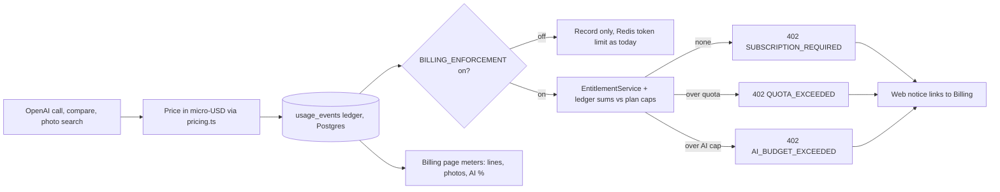

# Lemon Squeezy billing, slice S4: metering

Docs loaded: planning.md, plan-template.md

Parent: `docs/plans/lemon-squeezy-billing-program.md` (owner-approved 2026-10-08, decisions 5 and 6). Built on S3: `docs/plans/lemon-squeezy-billing-1-core.md`, `apps/api/src/billing/**` (`EntitlementService.resolve`, `plans.ts`). This file is the S4 Layer-2 spec. No new product decisions; every departure from the program plan is listed in "Contradictions found" and "Deviations from the program plan" and needs the orchestrator's yes before the phase it affects.

```
Task Classification:
- Intent: NEW_FEATURE
- Workflow: Feature Plan (docs/ai/prompts/feature-plan.md)
- Task Size: Deep (schema + migration, token budgets / rate-limit seam, billing, queue-touching comparison path, LLM model switch)
- Domain: Billing/Payments/Plan Upgrades + Cross-cutting limits + Procurement (comparison) + Vendor Catalog (vision match) + Chat/RAG (answer metering) + Settings (Billing page)
- Risk: Deep — risk-register "Billing", "LLM Token Budget Coverage", "Landing Pricing Copy", "Database Migrations"
- Contract Areas: DB (migration 0038), API (402 `code` body on 6 existing routes, BillingSummary.used), packages/types, Jobs (compare processor 402 handling)
- Next Action: owner approves this plan, then P1.0
```

TL;DR: S3 built the cash register and the "what is this workspace allowed to do" function, but nothing counts anything yet. S4 adds the counting book (a ledger table in Postgres, like a bank statement that is only ever appended to) and the doors that check it. Every OpenAI call is priced in dollars from a price table and written to the ledger; every new purchase-order/invoice pair and every photo search is written too. When the owner later flips `BILLING_ENFORCEMENT` to `on`, a workspace with no plan, over its line or photo quota, or over its dollar AI cap gets a clear "402" answer that points at the Billing page. Until then the book fills up and nobody is refused.

### Flowchart (high-level)



(Render inline as SVG with `mcp__visualize__show_widget` at review time; the mermaid block is what the saved plan keeps.)

### Task metadata

- Classification: `NEW_FEATURE` · `Deep` · Billing Requests / Payments / Plan Upgrades (`docs/ai/module-ownership-map.md`), plus Cross-cutting limits (`UsageService`), Procurement, Vendor Catalog, Chat/RAG · risk-register "Billing", "LLM Token Budget Coverage", "Landing Pricing Copy" (S5), "Database Migrations"
- Contract areas: API (6 existing routes gain a coded 402; `GET .../billing` `used` is filled), Database (`0038`: 1 table, 1 enum, 2 indexes), Permissions (no change: every gate runs after the existing guards), External integrations (OpenAI pricing table; model default), Jobs (`procurement-compare-queue` processor treats 402 as final)
- Docs loaded: `planning.md, plan-template.md`
- Claims reversed while investigating: (1) program plan says "All LLM calls already funnel through `UsageService.metered`"; false. The chat answer stream, the LangGraph rewrite/grade/regenerate calls and `refineMessage` never touch a meter (`apps/api/src/chat/chat.service.ts` `answer` only calls `assertWithinBudget` and `addUsage(countTokens(...))`; `docs/ai/risk-register.md` "LLM Token Budget Coverage" already records it). A dollar cap that ignores the largest chat cost is not a cap. (2) program plan says `TokenMeter` records tokens "per `response_metadata.model_name`"; `@langchain/openai@0.2.11` does not set it on a response (`node_modules/@langchain/openai/dist/chat_models.cjs` `openAIResponseToChatMessage` sets only `system_fingerprint`; the streamed usage chunk carries `usage_metadata` only, line 1149). The model name has to come from the call site (`llm.modelName`). (3) program plan says the RAGAS before/after eval is the gate for the model switch; the harness scores stored answers and never calls the answer model, so it could not measure the switch. Owner 2026-10-08: chat surface disabled, no quality gate needed. (4) S3 plan listed migration `0037` for S3 and `0038` for S4: confirmed, `0037_optimal_gauntlet.sql` is on this branch.
- Detected running model: Sonnet 5.5 (`claude-sonnet-5-5`) wrote this spec; execution model per program plan below.
- Recommended model: every phase `Opus 5.5`, high reasoning (program plan). Identical pair across phases, so no switch stops. Confidence: high. Fallback: `Sonnet 5.5`, high reasoning (P4A gate and ledger need the most care; do not drop below high). Minimum capability: Deep-domain reasoning for the advisory-lock reservation, fail-closed budget reads and queue-retry semantics.
- Branch: `feat/no-ticket-billing-metering`, STACKED on `feat/no-ticket-billing-core` (PR OwlRepo/optra#39, not merged). Worktree `.claude/worktrees/feat-billing-metering`.
- Release path: one PR targeting `feat/no-ticket-billing-core`, retargeted to `main` after #39 merges ("Create a merge commit"; `docs/ai/handoff.md` "Release flow"; merge order lesson: never merge the child before retargeting). `export TDD_RED_BASE=origin/feat/no-ticket-billing-core` for every `bun run tdd:red` and `bun run tdd:gate`.
- Required skills: `/plan-eng-review` (before approval), `/design-review` (Billing meters + notice), `/qa`, `/review`, `/canary` after deploy
- Execution preflight: `git fetch origin`; worktree exists; in it `nvm use`, `bun install --frozen-lockfile`; `docker compose up -d --wait postgres redis seaweedfs`

### Owner decisions (2026-10-08, all applied)

1. **D1: YES.** Meter the chat answer stream, LangGraph rewrite/grade/regenerate and refine into the ledger (the API is still live, the cap must cover it). Ledger-only: no new Redis or 402 behaviour while enforcement is off.
2. **D2: accepted.** The wire carries `used.aiBudgetPercent` (integer 0..100), not dollars. Locked in `packages/types/src/billing.ts`.
3. **D5: no RAGAS gate.** Owner 2026-10-08: the chat surface is disabled (risk-register "Disabled Support Surfaces": page off, API/BFF still live, insights crons still run), so no quality gate is needed. The model switch to `gpt-4o` is a plain change in P4A (4A.20); revert = env var. D3, D4, D6, D7, D8, D9, D10 accepted as written. No Billing briefing is added to `agent-orchestration.md`; dispatch prompts paste the existing briefings listed in the orchestrator notes.

## Layer 1: human summary

What a buyer sees: nothing changes while enforcement is off, except the Billing page now shows real meters: "Matched lines 120 of 400", "Photo checks 12 of 100" and "AI allowance 38% used", with a red "Allowance reached" at 100%. After the flip, a workspace with no plan, or one that hits a limit, gets a plain sentence ("Your plan's matched-line allowance for this period is used up. Upgrade on the Billing page or wait for the next period.") with a link that goes to Billing, whichever page they were on.

What the owner sees that is new in the repo: one table, `usage_events` (append-only; a row per matched-line batch, per photo search, per OpenAI call), a price table (`packages/ai/src/pricing.ts`), a gate (`BillingGateService`) that every metered path asks, and four env variables for the dollar caps. The chat default model becomes `gpt-4o` (4x cheaper than `gpt-4-turbo`) as a plain change in P4A (owner 2026-10-08: chat surface disabled, no quality gate needed; revert is an env var).

Why dollars and not tokens (decision 5): one token costs 66x more on the most expensive model than on the cheapest, so a token cap is not a cost cap. Why Postgres and not Redis (program plan): Redis fails open and forgets; money needs a durable record.

How a quota is counted: a matched line is a PO line, counted once per PO/invoice pair for good (compare the same pair again: free). A photo check is one catalog search that reaches the vision model. Checking the quota and writing the row happen together under a per-workspace lock (like one cashier at one till), so two simultaneous clicks cannot both squeeze under the limit.

What is deliberately not here: landing/legal copy, prod env guard and runbook (S5); embeddings (ingest) are not metered (decision recorded in the program plan, $0.02/1M tokens); the `Plans` table overage wording in `unit-economics.md` stays until S5.

Simpler options rejected: (a) keep Redis as the source and mirror to Postgres later, rejected: two sources of truth and Redis loses data on restart; (b) price at invoice time from OpenAI's usage API, rejected: delayed, per-key not per-workspace, adds a dependency; (c) a Postgres trigger that sums into a counter row, rejected: hides the logic outside the TS tests and still needs the lock; (d) charge a matched line after the compare succeeds, rejected: needs a second lock round or lets a burst overshoot, and a failed attempt retries for free anyway (same key).

**Risk Matrix**

| Risk | Likelihood | Impact | Mitigation | Rollback |
|---|---|---|---|---|
| Quota race: two compares or searches pass the check together | Medium | Quota overshoot, margin | check + insert in one `db.transaction()` under `pg_advisory_xact_lock(hashtext(workspace_id))` (same lock S3's webhook uses); concurrency specs with `Promise.all` | `BILLING_ENFORCEMENT=off` |
| AI cap overshoot by in-flight calls (the cost is only known after the call) | High (by construction) | Bounded: one burst. Chat limits 20/min/user, catalog fan-out 3, so a few cents to low dollars per workspace | the pre-call read is advisory; named band-aid. Durable alternative (reserve an estimated cost before the call) rejected: the estimate is unmeasured and would refuse good requests | lower the cap env |
| Ledger insert fails after the OpenAI call | Low | One call's cost lost (under-count) | `BillingGateService.recordLlmCost` logs workspace id and micro-USD at `warn`; never throws into the caller's result. Durable fix (outbox) rejected as over-engineering for one indexed insert after a read that proved the DB up | none needed |
| Unknown or renamed model is under-priced | Low | Margin | unknown model priced as `gpt-4-turbo` (highest output price) plus a once-per-model `console.warn`; `pricing.spec.ts` pins the table | edit the table |
| Model name missing at a call site (zero-cost row) | Medium | Under-count | every `record()` call site passes `llm.modelName`; `metering.spec.ts` has one case per chain; a missing name prices at the max, never zero | n/a |
| Streaming usage chunk absent (provider or option change) | Low | Chat answer under-counted | `streamUsage` defaults true in `@langchain/openai@0.2.11` (`chat_models.cjs:793`); `graph.spec.ts` case pins that the trailing chunk is recorded; Redis estimate stays for the off-mode limit | n/a |
| Enforcement locks out a working workspace | Medium | Churn | ships `off`; env-only flip; S5 runbook sets `billing_exempt` first; `none` copy points at Billing | `BILLING_ENFORCEMENT=off` + api restart |
| DB hiccup now blocks LLM calls when enforcement is on (fail-closed) | Low | 5xx instead of silent pass | intended (program plan); processors already retry non-402 errors; off-mode keeps today's Redis fail-open | `BILLING_ENFORCEMENT=off` |
| Compare processor retries a refused pair | High if untreated | Noise: every refusal retried and logged as failure | `isPermanentCompareError` includes `isBudgetExceeded`; processor spec | revert the one-line change |
| Refused pairs are re-enqueued by every re-parse | Medium | Cheap repeated refusals, one log line each | accepted: each is one indexed read, no LLM, no run row | n/a |
| `timestamp` (no zone) columns compare against JS Dates | Medium if the DB session TZ is not UTC | Period boundary off by hours | `occurred_at` is always written explicitly from the app clock (UTC ISO), never `defaultNow()`; sums use JS `Date` bounds; tests run `TZ=UTC` | n/a |
| Model switch changes answer quality | Medium | Answer quality | owner 2026-10-08: chat surface is disabled, no quality gate needed; revert = `OPENAI_ANSWER_MODEL` env var | set `OPENAI_ANSWER_MODEL` / `OPENAI_CHAT_MODEL` on the VPS |
| Cached chat answers still served to a `none` workspace | Medium | Free reads | accepted: a cache hit calls no LLM (cost 0) and "reads stay open" (program plan); recorded as D9 | n/a |
| Billing banner copy vs 402 copy drift | Low | Confusing UI | one message table in `billing-stop.ts` (api) and one parser (web) | n/a |

**Backward Compatibility Matrix** (usage search recorded below the table)

| Changed File / Symbol | Used By (outside this feature) | Breaks? | Handling |
|---|---|---|---|
| `packages/db/src/schema/usageEvents.ts` + `drizzle/0038_*` (new) | API start (`apps/api/Dockerfile` CMD), `docker/api-dev-entrypoint.sh`, CI "Apply database migrations", `apps/api/test/unit-global-setup.ts`, `apps/e2e/scripts/prepare-db.ts` | No | additive; nothing reads the new objects until new code runs; migrate precedes start. Old code on the new schema is untouched. Affected, NOT modified |
| `packages/ai/src/tokens.ts` `TokenMeter` (`record(response, model?)`, +getters) | every `options.meter?.record(response)` in 11 chains; `UsageService`; chain specs (`catalog-match.spec.ts`, `procurement-extraction.spec.ts` assert `meter.total` only) | No | `record` keeps its one-argument form; `total` unchanged. Affected, specs NOT modified |
| `packages/ai/src/chains/models.ts` `DEFAULT_MODEL` | every `resolveModel` caller (answer, sql, refine, faq, rewrite, grade, condense, extraction, procurement); `models.spec.ts` | Only the model switch (4A.20); behaviour change by design | roles with their own env keep it; roles without fall to `gpt-4o` (cheaper, vision-capable). `models.spec.ts` edited in P3. VPS `.env` may pin `OPENAI_CHAT_MODEL`: then no prod change until the owner edits it |
| `packages/ai/src/chains/{index,graph}.ts` `answerQuestion`, `answerQuestionWithGraph` (+optional `meter`) | `chat.service.ts` (only caller), `askQuestion` in `index.ts`, `graph.spec.ts`, `index.spec.ts` | No | new trailing optional parameter; `askQuestion` passes none |
| `packages/ai/src/chains/refine.ts` `refineMessage(rawText, options?)` | `refine.service.ts` (only caller), `refine.spec.ts` | No | optional second parameter |
| `apps/api/src/limits/usage.service.ts` (`UsageService` ctor +`BillingGateService`; `metered(..., options?)`; `assertWithinBudget`; `recordLedger`) | callers of `metered`: `topic-gap.processor.ts`, `faq-cluster.processor.ts`, `ticket-extraction.processor.ts`, `chat.service.ts`, `catalog-extraction.service.ts`, `procurement-extraction.service.ts`; `assertWithinBudget` caller `chat.service.ts:157`; `isBudgetExceeded` users `catalog-match.service.ts`, `catalog-parse.processor.ts`, `procurement-parse.processor.ts`, `topic-gap.processor.ts`, `faq-cluster.processor.ts` | No while enforcement is off | off mode runs today's Redis code unchanged (old 402 message, no `code`, Redis fail-open); `isBudgetExceeded` keys on status 402, unchanged. `usage.service.spec.ts` constructs the service by DI: gets a `BillingGateService` mock in P3. Callers' specs mock `UsageService`: unaffected |
| `apps/api/src/limits/limits.module.ts` (+`BillingModule` import) | `chat`, `insights`, `tickets`, `catalog`, `procurement`, `refine` modules | No | `BillingModule` imports `AuthModule` only; no cycle (`AuthModule` does not import any `LimitsModule` user; verified `auth.module.ts`) |
| `apps/api/src/billing/billing.module.ts` (+providers, exports) | `app.module.ts`, `limits.module.ts` | No | exports grow by `BillingGateService` |
| `apps/api/src/billing/entitlement.service.ts` (ctor +`UsageLedgerService`; `used` real; `resolveWithAiBudget`) | `billing.service.ts#summary`, `entitlement.service.spec.ts`, `billing.service.spec.ts`, `billing.e2e-spec.ts` | S3 case "used is null for both counters" fails by design | edited in P3 to the new truth; `BillingSummary` fields unchanged, `used` values change from `null` to numbers (type already allowed numbers) |
| `apps/api/src/procurement/comparison.service.ts` (ctor +`BillingGateService`; gate before the run row) | `procurement.controller.ts` (`compare`), `procurement-compare.processor.ts`; specs construct it directly: `comparison.service.spec.ts` (lines 48, 340, 511, 3014), `procurement-compare.processor.spec.ts` (58, 191, 249); `procurement.controller.spec.ts` casts `{}` (unaffected) | Specs break on constructor arity | the 7 construction sites get a pass-through gate in P3 (RED round). Affected, tests modified |
| `apps/api/src/procurement/procurement-compare.processor.ts` `isPermanentCompareError` | auto-compare jobs | No | only adds a 402 case |
| `apps/api/src/catalog/catalog-match.service.ts` (ctor +gate) | `catalog.controller.ts` (`searchMatches`, `verifyMatches`); `catalog-match.service.spec.ts` (95, 341) | Specs break on arity | edited in P3 |
| `apps/api/src/chat/chat.service.ts` | `chat.controller.ts` only; `chat.service.spec.ts`; `chat.e2e-spec.ts` (mocks `answerQuestion`) | No | stream is wrapped by a pass-through generator; same chunks, same order; `onComplete` unchanged |
| `apps/api/src/refine/refine.{controller,service}.ts` (`refine(workspaceId, rawText)`) | `refine.e2e-spec.ts`, `refine.service.spec.ts`; web `refine.ts` BFF unchanged | No | same route, same response; the service gains a workspace id it did not have |
| 402 response bodies on 6 routes | web `apiFetch` callers (all pages show `err.message`); `useChat`; processors read `error.message` into `lastError` | No | same status and `message` key; `code`/`quota` are additive; `AllExceptionsFilter` passes object bodies through (`all-exceptions.filter.ts`, verified) |
| `packages/types/src/billing.ts` (+`aiBudgetPercent?`, `BillingStopCode`, `BillingStopBody`) | web billing page, banner, `billing.ts` client, S3 fixtures | No | additive, optional. Already locked (P2) |
| `apps/web/src/lib/api/client.ts` (`announceBillingStop` before throwing) | every `apiFetch`/`uploadFile`/`uploadFiles` caller | No | a no-op unless `statusCode === 402` and a known `code` is present; still throws the same body |
| `apps/web/app/workspaces/[id]/layout.tsx`, `chat/page.tsx`, `billing/page.tsx` | all workspace pages / chat / billing | No | one extra sibling component; `onResponse` gains a 402 branch before the existing code; meters render only for `trialing`/`subscribed` |
| `.env.example` (+4 caps, model defaults) | `apps/e2e/support/env.ts#apiEnv` spreads it; compose `env_file`; `scripts/verify-env.sh` | No | caps are commented (defaults live in code); only the two model lines change value |
| `docs/business/unit-economics.md`, `docs/ai/**` | readers | n/a | docs sync in P5 |

Usage search recorded (Graphify was NOT queried while writing this plan: the authoring subagent had no graphify skill call available, so no query "failed"; discovery was direct file reads and grep. The graph indexes modules and symbols, not literal call-site lines, so call sites need grep either way; the executor runs `/graphify query "who calls UsageService.metered"` once before P3 to cross-check the list below): grep `metered(`, `new TokenMeter`, `meter?.record`, `\.record(`, `isBudgetExceeded`, `assertWithinBudget`, `addUsage`, `new ComparisonService`, `new CatalogMatchService`, `resolveModel(`, `modelName:` across `apps packages scripts` (excluding `node_modules`, `dist`).

## Layer 2: execution spec

Model for every phase: Opus 5.5, high reasoning. Strict TDD: `scripts/hooks/tdd-red-guard.mjs` blocks `packages/db/src/**` edits until a RED marker exists on this branch (a marker from S3 may not apply to a new branch; run `bun run tdd:red` with `TDD_RED_BASE=origin/feat/no-ticket-billing-core`), so P1 starts with a schema spec and its RED. `docs/ai/testing-strategy.md` "Strict TDD" says `tdd:gate` checks file-wide order of case titles.

### P1.0: RED for the schema (test-engineer, alone)

Write `packages/db/src/schema/usage-events-columns.spec.ts` (Vitest, pattern of `billing-columns.spec.ts`; cases in Test Matrix list A). It imports `./usageEvents`, which does not exist. Run `bun run tdd:red`; paste the failing output. Commit `test(db): usage_events ledger columns (0038)`.

Done when: `bun run tdd:red` reports a valid RED and wrote the marker.

### P1.1: schema (db-architect, alone)

1. `packages/db/src/schema/usageEvents.ts` (new, complete content):
```ts
import { bigint, index, integer, pgEnum, pgTable, timestamp, uniqueIndex, uuid, varchar } from 'drizzle-orm/pg-core'
import { workspaces } from './workspaces'

// matched_line: quantity = the PO's line count, one row per PO/invoice pair.
// photo_check: quantity = 1, one row per catalog search that reaches the model.
// llm_cost:   quantity = micro-USD (1 USD = 1,000,000) priced by packages/ai
//             pricing.ts, with the token split and model kept for audit.
export const usageKindEnum = pgEnum('usage_kind', ['matched_line', 'photo_check', 'llm_cost'])

// Append-only billing ledger (slice S4). Rows are written only by
// apps/api/src/billing/usage-ledger.service.ts. occurred_at keeps the repo's
// `timestamp` (no zone) convention and the app ALWAYS writes it from its own
// clock (UTC), never from the database default, so period sums are not
// sensitive to the DB session time zone.
export const usageEvents = pgTable(
  'usage_events',
  {
    id: uuid('id').primaryKey().defaultRandom(),
    workspaceId: uuid('workspace_id')
      .references(() => workspaces.id, { onDelete: 'cascade' })
      .notNull(),
    kind: usageKindEnum('kind').notNull(),
    quantity: bigint('quantity', { mode: 'number' }).notNull(),
    inputTokens: integer('input_tokens'),
    outputTokens: integer('output_tokens'),
    model: varchar('model', { length: 64 }),
    idempotencyKey: varchar('idempotency_key', { length: 128 }).notNull(),
    occurredAt: timestamp('occurred_at').defaultNow().notNull(),
  },
  (table) => ({
    workspaceKindOccurredIdx: index('usage_events_workspace_kind_occurred_idx').on(
      table.workspaceId,
      table.kind,
      table.occurredAt,
    ),
    idempotencyKeyUniqueIdx: uniqueIndex('usage_events_idempotency_key_unique').on(table.idempotencyKey),
  }),
)

export type UsageEvent = typeof usageEvents.$inferSelect
export type NewUsageEvent = typeof usageEvents.$inferInsert
```
2. `packages/db/src/schema/index.ts`. Old (last line): `export * from './billingEvents'`. New: that line followed by `export * from './usageEvents'`.
3. In `packages/db`: `bun run db:generate` creates `drizzle/0038_<name>.sql`, `drizzle/meta/0038_snapshot.json` and appends `idx: 38` to `drizzle/meta/_journal.json`. Do not hand-edit. Expected SQL: `CREATE TYPE "usage_kind"` (in the `DO $$ ... duplicate_object` wrapper as `0037`), `CREATE TABLE IF NOT EXISTS "usage_events"`, the FK to `workspaces` `ON DELETE cascade`, `CREATE INDEX IF NOT EXISTS "usage_events_workspace_kind_occurred_idx"`, `CREATE UNIQUE INDEX IF NOT EXISTS "usage_events_idempotency_key_unique"`. If drizzle-kit emits any `DROP`, `RENAME` or `SET NOT NULL` on an existing object, stop.

Done when: `packages/db` `bun run test` is green; `bun run db:migrate` applies cleanly (a) to an empty database and (b) to a local database that already holds rows (`bun run db:seed` demo tenant; existing tables untouched, new table empty); `bunx tsc --noEmit` in `packages/db`. Commit `feat(db): usage_events ledger (0038)`. Migration backward-compat statement: additive (one new table, one new enum, two indexes); no `NOT NULL` column on an existing table; old API code on the new schema does not read it; new code never runs on the old schema because migrate precedes start; no destructive step, so the rollback note is "leave it; the table is unread when metering code is reverted".

### P2: contract lock (orchestrator; done in this task)

Files written: `packages/types/src/billing.ts` (additive: `BillingUsed.aiBudgetPercent?`, `BillingStopCode`, `BillingStopBody`, comment updates), `docs/ai/contracts/api-contracts.md` (new "Shared convention: billing stop (402 + `code`)" section; Get Billing Summary row updated), `docs/ai/contracts/db-contracts.md` (`usage_events` row), this plan.

Exact shared symbols (frozen for implementers):
```ts
export interface BillingUsed {
  matchedLines: number | null
  photoChecks: number | null
  aiBudgetPercent?: number | null
}
export type BillingStopCode = 'SUBSCRIPTION_REQUIRED' | 'QUOTA_EXCEEDED' | 'AI_BUDGET_EXCEEDED'
export interface BillingStopBody {
  statusCode: 402
  message: string
  code: BillingStopCode
  quota?: 'matchedLines' | 'photoChecks'
}
```
Locked behaviour (the contract the tests encode):

| Surface | Locked rule |
|---|---|
| Enforcement switch | `BILLING_ENFORCEMENT` read per call through `ConfigService.get`; only the exact string `on` enforces |
| Off mode | refuses nothing for billing; Redis token limit and its 402 (`Workspace monthly token budget reached`, no `code`) exactly as today; the ledger still records |
| On mode, state `none` | 402 `SUBSCRIPTION_REQUIRED` on every gated path, including a re-compare of an already counted pair and a photo search |
| On mode, lines | new pair over quota: 402 `QUOTA_EXCEEDED`, `quota: 'matchedLines'`; already counted pair always allowed (unless `none`); `exempt` unlimited |
| On mode, photos | search with at least one candidate over quota: 402 `QUOTA_EXCEEDED`, `quota: 'photoChecks'`, checked before any model call; zero candidates charge nothing |
| On mode, AI | period llm_cost micro-USD sum `>=` cap: 402 `AI_BUDGET_EXCEEDED` before the model call. Cap per period: trial `BILLING_AI_CAP_TRIAL_USD` (default 4), solo `_SOLO_USD` (6), team `_TEAM_SEAT_USD` (15) x seats, exempt `_EXEMPT_USD` (25). Blank, 0, negative or non-numeric env falls back to the default |
| Ledger write | `metered()` writes one `llm_cost` row in `finally` in BOTH modes whenever the meter recorded tokens; a ledger write failure is logged and never fails the caller |
| Summary `used` | `matchedLines`, `photoChecks` = period sums; `aiBudgetPercent` = `floor(100 * cost / cap)` clamped 0..100 (0 when cap is 0). Period = `summary.period`, else the UTC calendar month (`exempt`, `none`) |
| 402 body | `HttpException({ statusCode: 402, message, code, quota? }, 402)`; messages in the single table in `billing-stop.ts` (below) |

Re-check after P1.1 (orchestrator, read-only): `db-contracts.md` column names equal `usageEvents.ts` exactly; the migration number is the one drizzle-kit produced (`0038`). A mismatch means the docs are fixed, not the schema.

### P3: RED (test-engineer, alone)

Write every file in the Test Matrix. Titles are prefixed and ordered `error:` > `edge:` > `regression:` > `happy:` per file (file-wide, `tdd:gate` checks it). Existing spec edits are named in the matrix. Support files written in this phase (outside persona globs, assigned to test-engineer by this spec per File Ownership Rule item 6): `apps/e2e/support/db.ts` gains `seedUsageEvents(workspaceId: string, rows: { kind: 'matched_line' | 'photo_check' | 'llm_cost'; quantity: number; occurredAt?: Date; key?: string }[]): Promise<void>` (plain SQL insert, `occurred_at` defaults to `now() at time zone 'utc'`, `idempotency_key` defaults to `seed:` + random uuid) and `usageSummaryFor(workspaceId): Promise<{ kind: string; quantity: string }[]>`.

Run `bun run tdd:red` from the repo root with `TDD_RED_BASE=origin/feat/no-ticket-billing-core` and paste the failing output (api Jest cannot load `usage-ledger.service` / `billing-gate.service` / `billing-stop`; ai Vitest cannot import `./pricing`; web cannot import `billing-stop`, `billing-usage-meters`, `billing-stop-notice`). Commit `test(billing): metering RED ...` with only test files and the support file.

Done when: `bun run tdd:red` reports a valid RED and wrote the marker; `bunx playwright test --list` in `apps/e2e` lists the new `billing.spec.ts` cases.

### P4: implementation (nestjs-backend-dev and nextjs-frontend-dev together, same worktree)

Both prompts carry the "File Ownership Rule" text from `docs/ai/agent-orchestration.md` verbatim and the Domain Briefing block (see "Orchestrator notes"). `packages/types/src/**` is frozen; a needed change goes back to the orchestrator.

#### 4A. Backend (`nestjs-backend-dev`), complete file list

New: `packages/ai/src/pricing.ts`, `apps/api/src/billing/billing-stop.ts`, `apps/api/src/billing/usage-ledger.service.ts`, `apps/api/src/billing/billing-gate.service.ts`.
Modified: `packages/ai/src/index.ts`, `packages/ai/src/tokens.ts`, `packages/ai/src/chains/models.ts`, `packages/ai/src/chains/{condense,refine,faq-draft,topic-label,text-to-sql,ticket-extraction,procurement-extraction,catalog-match,index,graph}.ts`, `apps/api/src/billing/{plans,entitlement.service,billing.module}.ts`, `apps/api/src/limits/{usage.service,limits.module}.ts`, `apps/api/src/procurement/{comparison.service,procurement-compare.processor,procurement.module}.ts`, `apps/api/src/catalog/{catalog-match.service,catalog.module}.ts`, `apps/api/src/chat/chat.service.ts`, `apps/api/src/refine/{refine.controller,refine.service}.ts`, `.env.example` (assigned here, rule 6).

1. `packages/ai/src/pricing.ts` (complete content):
```ts
export interface ModelPrice {
  inputPerMTok: number
  outputPerMTok: number
}

// USD per 1,000,000 tokens, OpenAI standard tier, verified 2026-10-08 at
// https://developers.openai.com/api/docs/pricing. 1 USD = 1,000,000 micro-USD,
// so a per-million-token price is also the micro-USD price of one token.
// Recompute docs/business/unit-economics.md when this table changes.
export const MODEL_PRICES: Record<string, ModelPrice> = {
  'gpt-4o': { inputPerMTok: 2.5, outputPerMTok: 10 },
  'gpt-4o-mini': { inputPerMTok: 0.15, outputPerMTok: 0.6 },
  'gpt-4-turbo': { inputPerMTok: 10, outputPerMTok: 30 },
  'text-embedding-3-small': { inputPerMTok: 0.02, outputPerMTok: 0 },
}

// The row with the highest output price: what an unknown model is billed as, so
// a typo or a new model can only ever over-count, never under-count.
export const FALLBACK_PRICE_MODEL = 'gpt-4-turbo'

const KEYS_LONGEST_FIRST = Object.keys(MODEL_PRICES).sort((a, b) => b.length - a.length)
const warned = new Set<string>()

// A dated snapshot ("gpt-4o-2024-08-06") resolves to its base row. Longest key
// first, so "gpt-4o-mini-2024-07-18" is not caught by the shorter "gpt-4o".
export function priceFor(model: string | null | undefined): ModelPrice {
  const name = (model ?? '').trim().toLowerCase()
  const key = KEYS_LONGEST_FIRST.find((candidate) => name === candidate || name.startsWith(`${candidate}-`))
  if (key) return MODEL_PRICES[key]
  if (!warned.has(name)) {
    warned.add(name)
    console.warn(`[pricing] unknown model "${name || '(none)'}" priced as ${FALLBACK_PRICE_MODEL}`)
  }
  return MODEL_PRICES[FALLBACK_PRICE_MODEL]
}

function tokens(value: number): number {
  return Number.isFinite(value) && value > 0 ? value : 0
}

/** Integer micro-USD, rounded up so a fraction of a micro-dollar is never dropped. */
export function costMicroUsd(model: string | null | undefined, inputTokens: number, outputTokens: number): number {
  const price = priceFor(model)
  return Math.ceil(tokens(inputTokens) * price.inputPerMTok + tokens(outputTokens) * price.outputPerMTok)
}
```
2. `packages/ai/src/index.ts`. Old: `export * from './tokens'`. New: that line followed by `export * from './pricing'`.
3. `packages/ai/src/tokens.ts` (complete new content; `countTokens` is unchanged):
```ts
import { get_encoding } from 'tiktoken'
import { costMicroUsd } from './pricing'

interface UsageBearingResponse {
  usage_metadata?: { input_tokens?: number; output_tokens?: number; total_tokens?: number }
  // @langchain/openai@0.2.11 does not set a model name on responses; read only as a fallback.
  response_metadata?: { model_name?: string; model?: string }
}

interface ModelUsage {
  input: number
  output: number
}

function positive(value: unknown): number {
  return typeof value === 'number' && Number.isFinite(value) && value > 0 ? value : 0
}

// Accumulates the token usage the provider actually reports, per model, so the
// caller can both charge the Redis token budget (total) and price the spend in
// micro-USD for the billing ledger (costMicroUsd). @langchain/openai sets
// `usage_metadata` on every invoke() result and on the trailing stream chunk.
// The model name is passed by the call site (`llm.modelName`): the response
// does not carry it.
export class TokenMeter {
  private used = 0
  private readonly byModel = new Map<string, ModelUsage>()

  record(response: unknown, model?: string): void {
    const r = response as UsageBearingResponse | null | undefined
    const usage = r?.usage_metadata
    const input = positive(usage?.input_tokens)
    let output = positive(usage?.output_tokens)
    const total = positive(usage?.total_tokens) || input + output
    if (total === 0) return
    this.used += total
    // Only a total: price all of it at the output rate (the dearer side).
    if (input + output === 0) output = total
    const name = (model?.trim() || r?.response_metadata?.model_name || r?.response_metadata?.model || '').trim()
    const entry = this.byModel.get(name) ?? { input: 0, output: 0 }
    entry.input += input
    entry.output += output
    this.byModel.set(name, entry)
  }

  get total(): number {
    return this.used
  }

  get inputTokens(): number {
    let sum = 0
    for (const entry of this.byModel.values()) sum += entry.input
    return sum
  }

  get outputTokens(): number {
    let sum = 0
    for (const entry of this.byModel.values()) sum += entry.output
    return sum
  }

  /** Integer micro-USD across every model recorded (each priced by its own row). */
  get costMicroUsd(): number {
    let sum = 0
    for (const [name, entry] of this.byModel) sum += costMicroUsd(name, entry.input, entry.output)
    return sum
  }

  /** The model that cost the most, for the ledger's audit column; null when nothing was recorded. */
  get dominantModel(): string | null {
    let best: string | null = null
    let bestCost = -1
    for (const [name, entry] of this.byModel) {
      const cost = costMicroUsd(name, entry.input, entry.output)
      if (cost > bestCost) {
        best = name
        bestCost = cost
      }
    }
    return best && best.length > 0 ? best : null
  }
}

export function countTokens(text: string): number {
  const encoder = get_encoding('cl100k_base')

  try {
    return encoder.encode(text).length
  } finally {
    encoder.free()
  }
}
```
4. Chain call sites: every `record` passes the call's own model name. Literal blocks:
   - `packages/ai/src/chains/condense.ts`. Old: `  options.meter?.record(response)\n\n  const text = extractText(response.content)` New: `  options.meter?.record(response, llm.modelName)\n\n  const text = extractText(response.content)`.
   - `packages/ai/src/chains/faq-draft.ts`. Old: `  options.meter?.record(response)\n\n  const raw = typeof response.content === 'string' ? response.content : String(response.content)\n  const cleaned = raw` New: `  options.meter?.record(response, llm.modelName)\n\n  const raw = typeof response.content === 'string' ? response.content : String(response.content)\n  const cleaned = raw`.
   - `packages/ai/src/chains/topic-label.ts`. Old: `  options.meter?.record(response)\n\n  const raw = typeof response.content === 'string' ? response.content : String(response.content)\n  return raw.trim()` New: `  options.meter?.record(response, llm.modelName)\n\n  const raw = typeof response.content === 'string' ? response.content : String(response.content)\n  return raw.trim()`.
   - `packages/ai/src/chains/text-to-sql.ts`, two blocks. Old (in `generateMultiTableSql`): `  const response = await multiTableLlm.invoke([\n    new SystemMessage(MULTI_TABLE_SYSTEM_PROMPT),\n    new HumanMessage(`${schema}\n\nQuestion: ${question}${repairNote}`),\n  ])\n  options.meter?.record(response)` New: same with `options.meter?.record(response, multiTableLlm.modelName)`. Old (in `generateSql`): `  const response = await llm.invoke([\n    new SystemMessage(SYSTEM_PROMPT),\n    new HumanMessage(`${schema}\n\nQuestion: ${question}${repairNote}`),\n  ])\n  options.meter?.record(response)` New: same with `options.meter?.record(response, llm.modelName)`.
   - `packages/ai/src/chains/ticket-extraction.ts`. Old: `        new HumanMessage(EXTRACTION_HUMAN_PROMPT(transcript)),\n      ])\n      options.meter?.record(response)` New: same with `options.meter?.record(response, llm.modelName)`.
   - `packages/ai/src/chains/procurement-extraction.ts`. Old: `  model: Pick<ChatOpenAI, 'invoke'> = llm,` New: `  model: Pick<ChatOpenAI, 'invoke' | 'modelName'> = llm,`. Old: `      const response = await model.invoke([new SystemMessage(systemPrompt), humanMessage])\n      meter?.record(response)` New: `      const response = await model.invoke([new SystemMessage(systemPrompt), humanMessage])\n      meter?.record(response, model.modelName)`.
   - `packages/ai/src/chains/catalog-match.ts`, two blocks. Old: `        new HumanMessage({ content }),\n      ])\n      options.meter?.record(response)` New: same with `options.meter?.record(response, llm.modelName)`. Old: `        new HumanMessage({ content }),\n      ])\n      input.meter?.record(response)` New: same with `input.meter?.record(response, llm.modelName)`.
   - `packages/ai/src/chains/refine.ts`. Old: `import { resolveModel } from './models'\n` New: `import { resolveModel } from './models'\nimport type { TokenMeter } from '../tokens'\n`. Old: `export async function refineMessage(rawText: string): Promise<string> {\n  const response = await llm.invoke([\n    new SystemMessage(REFINE_SYSTEM_PROMPT),\n    new HumanMessage(rawText),\n  ])\n` New: `export async function refineMessage(\n  rawText: string,\n  options: { meter?: TokenMeter } = {},\n): Promise<string> {\n  const response = await llm.invoke([\n    new SystemMessage(REFINE_SYSTEM_PROMPT),\n    new HumanMessage(rawText),\n  ])\n  options.meter?.record(response, llm.modelName)\n`.
   - `packages/ai/src/chains/index.ts`. Old: `import { resolveModel } from './models'\n` New: `import { resolveModel } from './models'\nimport type { TokenMeter } from '../tokens'\n`. Old: `  filters?: RetrievalFilters,\n  history: HistoryTurn[] = []\n): Promise<AnswerResult> {` New: `  filters?: RetrievalFilters,\n  history: HistoryTurn[] = [],\n  meter?: TokenMeter,\n): Promise<AnswerResult> {`. Old: `      filters,\n      effectiveHistory,\n    )\n  }` New: `      filters,\n      effectiveHistory,\n      meter,\n    )\n  }`. Old: `      for await (const chunk of stream) {\n        const token = chunk.content\n        if (typeof token === 'string' && token.length > 0) {\n          yield token\n        }\n      }` New: `      for await (const chunk of stream) {\n        // Only the trailing chunk carries usage_metadata; the rest add nothing.\n        meter?.record(chunk, llm.modelName)\n        const token = chunk.content\n        if (typeof token === 'string' && token.length > 0) {\n          yield token\n        }\n      }`.
   - `packages/ai/src/chains/graph.ts` (the same tokens type import; state carries the meter): Old: `import { resolveModel } from "./models";\n` New: `import { resolveModel } from "./models";\nimport type { TokenMeter } from "../tokens";\n`. Old: `  // Optional metadata filters applied to retrieval.\n  filters: Annotation<RetrievalFilters | undefined>,\n});` New: `  // Optional metadata filters applied to retrieval.\n  filters: Annotation<RetrievalFilters | undefined>,\n  // Billing meter for every model call made while answering this question.\n  meter: Annotation<TokenMeter | undefined>,\n});`. Old (`collectAnswer` head): `  systemPrompt: string,\n  history: HistoryTurn[] = [],\n): Promise<string> {\n  const stream = await answerLlm.stream([` New: `  systemPrompt: string,\n  history: HistoryTurn[] = [],\n  meter?: TokenMeter,\n): Promise<string> {\n  const stream = await answerLlm.stream([`. Old: `  for await (const chunk of stream) {\n    if (typeof chunk.content === "string" && chunk.content.length > 0) {\n      parts.push(chunk.content);\n    }\n  }` New: `  for await (const chunk of stream) {\n    meter?.record(chunk, answerLlm.modelName);\n    if (typeof chunk.content === "string" && chunk.content.length > 0) {\n      parts.push(chunk.content);\n    }\n  }`. Old (`streamAnswer` head): `  systemPrompt: string,\n  history: HistoryTurn[] = [],\n): AsyncGenerator<string> {` New: `  systemPrompt: string,\n  history: HistoryTurn[] = [],\n  meter?: TokenMeter,\n): AsyncGenerator<string> {`. Old: `  for await (const chunk of stream) {\n    if (typeof chunk.content === "string" && chunk.content.length > 0) {\n      yield chunk.content;\n    }\n  }` New: `  for await (const chunk of stream) {\n    meter?.record(chunk, answerLlm.modelName);\n    if (typeof chunk.content === "string" && chunk.content.length > 0) {\n      yield chunk.content;\n    }\n  }`. Old (`rewriteNode`): `    new HumanMessage(state.retrievalQuery),\n  ]);\n\n  // Rewrite only the retrieval query.` New: `    new HumanMessage(state.retrievalQuery),\n  ]);\n  state.meter?.record(response, rewriteLlm.modelName);\n\n  // Rewrite only the retrieval query.`. Old (`generateNode`): `      state.chunks,\n      ANSWER_SYSTEM_PROMPT,\n      state.history,\n    ),\n  };\n}` New: `      state.chunks,\n      ANSWER_SYSTEM_PROMPT,\n      state.history,\n      state.meter,\n    ),\n  };\n}`. Old (`gradeAnswerNode`): `      `Context:\n${buildContext(state.chunks)}\n\nAnswer:\n${state.answerText ?? ""}`,\n    ),\n  ]);\n  const text =` New: same lines then `  state.meter?.record(response, gradeLlm.modelName);\n  const text =` (insert the record line between `]);` and `const text =`). Old (`regenerateNode`): `      REGENERATE_SYSTEM_PROMPT,\n      state.history,\n    ),\n    regenerated: true,` New: `      REGENERATE_SYSTEM_PROMPT,\n      state.history,\n      state.meter,\n    ),\n    regenerated: true,`. Old (`answerQuestionWithGraph` head): `  filters?: RetrievalFilters,\n  history: HistoryTurn[] = [],\n): Promise<AnswerResult> {\n  const result = await graph.invoke({` New: `  filters?: RetrievalFilters,\n  history: HistoryTurn[] = [],\n  meter?: TokenMeter,\n): Promise<AnswerResult> {\n  const result = await graph.invoke({`. Old: `    precomputedEmbedding,\n    filters,\n  });` New: `    precomputedEmbedding,\n    filters,\n    meter,\n  });`. Old: `        ANSWER_SYSTEM_PROMPT,\n        result.history,\n      ),\n    };\n  }` New: `        ANSWER_SYSTEM_PROMPT,\n        result.history,\n        result.meter,\n      ),\n    };\n  }`.
5. `apps/api/src/billing/billing-stop.ts` (complete content; the single message table, nothing else builds a billing 402):
```ts
import { HttpException } from '@nestjs/common'
import type { BillingStopBody, BillingStopCode } from '@repo/types'

const STATUS = 402

const MESSAGES = {
  SUBSCRIPTION_REQUIRED: 'Your workspace needs an active plan to do this. Choose a plan on the Billing page.',
  AI_BUDGET_EXCEEDED:
    "Your plan's AI allowance for this period is used up. Upgrade on the Billing page or wait for the next period.",
  matchedLines:
    "Your plan's matched-line allowance for this period is used up. Upgrade on the Billing page or wait for the next period.",
  photoChecks:
    "Your plan's photo-check allowance for this period is used up. Upgrade on the Billing page or wait for the next period.",
} as const

/** Status 402 keeps `isBudgetExceeded` (limits/usage.service.ts) and every processor's "final, no retry" branch working. */
export function billingStop(code: 'SUBSCRIPTION_REQUIRED' | 'AI_BUDGET_EXCEEDED'): HttpException
export function billingStop(code: 'QUOTA_EXCEEDED', quota: 'matchedLines' | 'photoChecks'): HttpException
export function billingStop(code: BillingStopCode, quota?: 'matchedLines' | 'photoChecks'): HttpException {
  const body: BillingStopBody =
    code === 'QUOTA_EXCEEDED' && quota
      ? { statusCode: STATUS, message: MESSAGES[quota], code, quota }
      : { statusCode: STATUS, message: MESSAGES[code as 'SUBSCRIPTION_REQUIRED' | 'AI_BUDGET_EXCEEDED'], code }
  return new HttpException(body, STATUS)
}
```
6. `apps/api/src/billing/plans.ts`: append (after `isEntitledStatus`):
```ts
export type AiCapKind = 'trial' | 'solo' | 'team' | 'exempt'

const AI_CAP_DEFAULT_USD: Record<AiCapKind, number> = { trial: 4, solo: 6, team: 15, exempt: 25 }
const AI_CAP_ENV: Record<AiCapKind, string> = {
  trial: 'BILLING_AI_CAP_TRIAL_USD',
  solo: 'BILLING_AI_CAP_SOLO_USD',
  team: 'BILLING_AI_CAP_TEAM_SEAT_USD',
  exempt: 'BILLING_AI_CAP_EXEMPT_USD',
}

/**
 * Monthly AI cost cap in integer micro-USD. Team multiplies by billed buyers
 * (the env value is per buyer). A blank, zero, negative or non-numeric env falls
 * back to the default: a malformed value must never widen the cap
 * (same rule as positiveIntEnv in catalog-match.service.ts).
 */
export function aiCapMicroUsd(kind: AiCapKind, seats: number, env: EnvReader): number {
  const raw = Number(env.get(AI_CAP_ENV[kind])?.trim())
  const usd = Number.isFinite(raw) && raw > 0 ? raw : AI_CAP_DEFAULT_USD[kind]
  return Math.round(usd * 1_000_000) * (kind === 'team' ? seats : 1)
}

/** The UTC calendar month containing `now`: [start, end). */
export function currentMonthPeriod(now: Date): { start: Date; end: Date } {
  const y = now.getUTCFullYear()
  const m = now.getUTCMonth()
  return { start: new Date(Date.UTC(y, m, 1)), end: new Date(Date.UTC(y, m + 1, 1)) }
}
```
7. `apps/api/src/billing/usage-ledger.service.ts`: `@Injectable() class UsageLedgerService` (no constructor; uses `db` from `@repo/db` like `EntitlementService`). Exact surface:
   - `type ReserveResult = 'charged' | 'duplicate' | 'over'`; `interface Window { start: Date; end: Date }`.
   - `reserve(input: { workspaceId: string; kind: 'matched_line' | 'photo_check'; idempotencyKey: string; quantity: number; limit: number | null; window: Window; now?: Date }): Promise<ReserveResult>`. One `db.transaction(async (tx) => {...})`: (1) `await tx.execute(sql`select pg_advisory_xact_lock(hashtext(${input.workspaceId}))`)`; (2) `select id from usage_events where workspace_id = :ws and idempotency_key = :key limit 1`: found -> `'duplicate'`; (3) when `limit !== null`: `select coalesce(sum(quantity), 0)::text from usage_events where workspace_id = :ws and kind = :kind and occurred_at >= :start and occurred_at < :end`; `Number(used) + quantity > limit` -> `'over'`; (4) `insert into usage_events (workspace_id, kind, quantity, idempotency_key, occurred_at) values (...) on conflict (idempotency_key) do nothing returning id`; no row returned -> `'duplicate'`, else `'charged'`. `occurredAt: input.now ?? new Date()` always passed explicitly.
   - `recordLlmCost(input: { workspaceId: string; meter: Pick<TokenMeter, 'total' | 'costMicroUsd' | 'inputTokens' | 'outputTokens' | 'dominantModel'>; now?: Date }): Promise<void>`: returns without writing when `meter.total === 0`; else one insert `{ workspaceId, kind: 'llm_cost', quantity: meter.costMicroUsd, inputTokens: meter.inputTokens, outputTokens: meter.outputTokens, model: meter.dominantModel?.slice(0, 64) ?? null, idempotencyKey: `llm:${randomUUID()}`, occurredAt: input.now ?? new Date() }`. Throws on a database error (the gate catches).
   - `sumsByKind(workspaceId: string, window: Window): Promise<{ matchedLines: number; photoChecks: number; llmCostMicroUsd: number }>`: one query `select kind, coalesce(sum(quantity), 0)::text as total from usage_events where workspace_id = :ws and occurred_at >= :start and occurred_at < :end group by kind`; missing kinds read 0; values converted with `Number`.
   DB discipline: every query filters `workspace_id`; explicit columns; no list endpoint; the only multi-statement path (`reserve`) is one transaction. Index `(workspace_id, kind, occurred_at)` serves all three queries.
8. `apps/api/src/billing/billing-gate.service.ts`: `@Injectable() class BillingGateService { constructor(config: ConfigService, entitlement: EntitlementService, ledger: UsageLedgerService) }` with `private enforced(): boolean { return this.config.get<string>('BILLING_ENFORCEMENT') === 'on' }` and a `Logger`. Exact surface and algorithm:
   - `assertAiBudget(workspaceId: string, now = new Date()): Promise<void>`: not enforced -> return (no ledger read). Enforced: `const { summary, ai } = await entitlement.resolveWithAiBudget(workspaceId, now)`; `summary.state === 'none'` -> `throw billingStop('SUBSCRIPTION_REQUIRED')`; `ai.usedMicroUsd >= ai.capMicroUsd` -> `throw billingStop('AI_BUDGET_EXCEEDED')`. A database error propagates (fail-closed).
   - `assertMatchedLines(workspaceId: string, purchaseOrderId: string, invoiceId: string, lineCount: number, now = new Date()): Promise<void>`: key `cmp:${purchaseOrderId}:${invoiceId}`. Not enforced: `ledger.reserve({ ..., limit: null, window: currentMonthPeriod(now) })`, never throws for billing. Enforced: `const summary = await entitlement.resolve(workspaceId, now)`; `none` -> `SUBSCRIPTION_REQUIRED`; `result = await ledger.reserve({ workspaceId, kind: 'matched_line', idempotencyKey: key, quantity: lineCount, limit: summary.quotas?.matchedLines ?? null, window: summary.period ? { start: new Date(summary.period.start), end: new Date(summary.period.end) } : currentMonthPeriod(now), now })`; `'over'` -> `throw billingStop('QUOTA_EXCEEDED', 'matchedLines')`; `'charged'` and `'duplicate'` return.
   - `assertPhotoCheck(workspaceId: string, now = new Date()): Promise<void>`: key `photo:${randomUUID()}`, quantity 1. Not enforced: reserve with `limit: null`. Enforced: `resolveWithAiBudget`; `none` -> `SUBSCRIPTION_REQUIRED`; AI cap already reached -> `AI_BUDGET_EXCEEDED` (before a photo check is consumed); `reserve` with `limit: summary.quotas?.photoChecks ?? null`; `'over'` -> `QUOTA_EXCEEDED` / `'photoChecks'`.
   - `recordLlmCost(workspaceId: string, meter: TokenMeter): Promise<void>`: `try { await ledger.recordLlmCost({ workspaceId, meter }) } catch (error) { this.logger.warn(`llm_cost ledger write failed workspace=${workspaceId} microUsd=${meter.costMicroUsd}: ${error instanceof Error ? error.message : String(error)}`) }`. Both modes. Named band-aid: a lost write under-counts one call; durable alternative (outbox) rejected in the Risk Matrix.
9. `apps/api/src/billing/entitlement.service.ts` (complete new content; the S3 logic is kept line for line except `used` and the new method):
```ts
import { Injectable, NotFoundException } from '@nestjs/common'
import { ConfigService } from '@nestjs/config'
import { eq } from 'drizzle-orm'
import { db, workspaceSubscriptions, workspaces } from '@repo/db'
import type { BillingSummary } from '@repo/types'
import {
  TRIAL_DAYS,
  TRIAL_QUOTAS,
  aiCapMicroUsd,
  currentMonthPeriod,
  isEntitledStatus,
  quotasFor,
} from './plans'
import { UsageLedgerService } from './usage-ledger.service'

const DAY_MS = 24 * 60 * 60 * 1000

export interface AiBudget {
  usedMicroUsd: number
  capMicroUsd: number
}

@Injectable()
export class EntitlementService {
  constructor(
    private readonly config: ConfigService,
    private readonly ledger: UsageLedgerService,
  ) {}

  async resolve(workspaceId: string, now: Date = new Date()): Promise<BillingSummary> {
    return (await this.load(workspaceId, now)).summary
  }

  /** The summary plus the period's AI spend and cap, from the same two reads (the gate's single call). */
  async resolveWithAiBudget(workspaceId: string, now: Date = new Date()): Promise<{ summary: BillingSummary; ai: AiBudget }> {
    return this.load(workspaceId, now)
  }

  private async load(workspaceId: string, now: Date): Promise<{ summary: BillingSummary; ai: AiBudget }> {
    const [[workspace], [sub]] = await Promise.all([
      db
        .select({ trialEndsAt: workspaces.trialEndsAt, billingExempt: workspaces.billingExempt })
        .from(workspaces)
        .where(eq(workspaces.id, workspaceId))
        .limit(1),
      db
        .select({
          plan: workspaceSubscriptions.plan,
          seats: workspaceSubscriptions.seats,
          status: workspaceSubscriptions.status,
          renewsAt: workspaceSubscriptions.renewsAt,
          endsAt: workspaceSubscriptions.endsAt,
        })
        .from(workspaceSubscriptions)
        .where(eq(workspaceSubscriptions.workspaceId, workspaceId))
        .limit(1),
    ])
    if (!workspace) throw new NotFoundException('Workspace not found')

    const enforced = this.config.get<string>('BILLING_ENFORCEMENT') === 'on'
    const base = {
      enforced,
      plan: sub?.plan ?? null,
      seats: sub?.seats ?? null,
      subscriptionStatus: sub?.status ?? null,
      trialEndsAt: workspace.trialEndsAt?.toISOString() ?? null,
      renewsAt: sub?.renewsAt?.toISOString() ?? null,
      endsAt: sub?.endsAt?.toISOString() ?? null,
    }

    let state: BillingSummary['state']
    let period: BillingSummary['period'] = null
    let quotas: BillingSummary['quotas'] = null
    let capMicroUsd = 0
    let plan = base.plan

    if (workspace.billingExempt) {
      state = 'exempt'
      quotas = { matchedLines: null, photoChecks: null }
      capMicroUsd = aiCapMicroUsd('exempt', 1, this.config)
    } else if (sub && isEntitledStatus(sub.status, sub.endsAt, now)) {
      state = 'subscribed'
      const month = currentMonthPeriod(now)
      period = { start: month.start.toISOString(), end: month.end.toISOString() }
      quotas = quotasFor(sub.plan, sub.seats)
      capMicroUsd = aiCapMicroUsd(sub.plan, sub.seats, this.config)
    } else if (workspace.trialEndsAt && now.getTime() < workspace.trialEndsAt.getTime()) {
      state = 'trialing'
      plan = null
      period = {
        start: new Date(workspace.trialEndsAt.getTime() - TRIAL_DAYS * DAY_MS).toISOString(),
        end: workspace.trialEndsAt.toISOString(),
      }
      quotas = { ...TRIAL_QUOTAS }
      capMicroUsd = aiCapMicroUsd('trial', 1, this.config)
    } else {
      state = 'none'
    }

    // Exempt and none have no quota window; their meters read the UTC calendar month.
    const window = period
      ? { start: new Date(period.start), end: new Date(period.end) }
      : currentMonthPeriod(now)
    const sums = await this.ledger.sumsByKind(workspaceId, window)

    const summary: BillingSummary = {
      ...base,
      plan,
      state,
      period,
      quotas,
      used: {
        matchedLines: sums.matchedLines,
        photoChecks: sums.photoChecks,
        aiBudgetPercent:
          capMicroUsd > 0 ? Math.min(100, Math.floor((100 * sums.llmCostMicroUsd) / capMicroUsd)) : 0,
      },
    }
    return { summary, ai: { usedMicroUsd: sums.llmCostMicroUsd, capMicroUsd } }
  }
}
```
   (S3 detail preserved: `trialing` sets `plan: null`; `exempt` keeps the plan from the subscription row if any. `ConfigService` satisfies `EnvReader` structurally: `get(key)` returns `string | undefined` for string keys; if the compiler objects, pass `{ get: (key: string) => this.config.get<string>(key) }`.)
10. `apps/api/src/billing/billing.module.ts`. Old: `import { LemonSqueezyClient } from './lemonsqueezy.client'\n` New: that line plus `import { BillingGateService } from './billing-gate.service'\nimport { UsageLedgerService } from './usage-ledger.service'\n`. Old: `    EntitlementService,\n    LemonSqueezyClient,\n    JwtAuthGuard,` New: `    EntitlementService,\n    UsageLedgerService,\n    BillingGateService,\n    LemonSqueezyClient,\n    JwtAuthGuard,`. Old: `  exports: [EntitlementService],` New: `  exports: [EntitlementService, BillingGateService],`.
11. `apps/api/src/limits/limits.module.ts` (complete new content):
```ts
import { Module } from '@nestjs/common'
import { BillingModule } from '../billing/billing.module'
import { CacheModule } from '../cache/cache.module'
import { RateLimitService } from './rate-limit.service'
import { UsageService } from './usage.service'
import { ChatRateLimitGuard } from './chat-rate-limit.guard'

@Module({
  imports: [CacheModule, BillingModule],
  providers: [RateLimitService, UsageService, ChatRateLimitGuard],
  exports: [RateLimitService, UsageService, ChatRateLimitGuard],
})
export class LimitsModule {}
```
12. `apps/api/src/procurement/procurement.module.ts`. Old: `import { LimitsModule } from '../limits/limits.module'\n` New: that line plus `import { BillingModule } from '../billing/billing.module'\n`. Old: `    EventsModule,\n    LimitsModule,\n    BullModule.registerQueue({ name: 'procurement-parse-queue' }),` New: `    EventsModule,\n    LimitsModule,\n    BillingModule,\n    BullModule.registerQueue({ name: 'procurement-parse-queue' }),`. `apps/api/src/catalog/catalog.module.ts`. Old: `import { LimitsModule } from '../limits/limits.module'\n` New: that line plus `import { BillingModule } from '../billing/billing.module'\n`. Old: `    StorageModule,\n    LimitsModule,\n    BullModule.registerQueue({ name: 'catalog-parse-queue' }),` New: `    StorageModule,\n    LimitsModule,\n    BillingModule,\n    BullModule.registerQueue({ name: 'catalog-parse-queue' }),`.
13. `apps/api/src/limits/usage.service.ts` (complete new content; the Redis code is the existing code, unchanged, and runs whenever enforcement is not `on`):
```ts
import { HttpException, Inject, Injectable, Logger } from '@nestjs/common'
import { ConfigService } from '@nestjs/config'
import { TokenMeter } from '@repo/ai'
import type Redis from 'ioredis'
import { BillingGateService } from '../billing/billing-gate.service'

const BUDGET_EXCEEDED_STATUS = 402

// Background jobs use this to treat "budget reached" as a final outcome (no
// Bull retry: the budget will not refill before the retry fires). Keys on the
// status, so the legacy token-budget 402 and the coded billing 402s all count.
export function isBudgetExceeded(error: unknown): boolean {
  return error instanceof HttpException && error.getStatus() === BUDGET_EXCEEDED_STATUS
}

@Injectable()
export class UsageService {
  private readonly logger = new Logger(UsageService.name)

  constructor(
    @Inject('REDIS_CLIENT') private readonly redis: Redis,
    private readonly config: ConfigService,
    private readonly gate: BillingGateService,
  ) {}

  async addUsage(workspaceId: string, tokens: number) {
    const key = this.monthKey(workspaceId)

    try {
      await this.redis.incrby(key, tokens)
      await this.redis.expire(key, 60 * 60 * 24 * 40)
    } catch (error) {
      this.logger.warn(
        `Failed token usage increment for workspace ${workspaceId}: ${this.message(error)}`,
      )
    }
  }

  // BILLING_ENFORCEMENT=on: the Postgres ledger and the plan's dollar cap decide
  // (state none -> 402 SUBSCRIPTION_REQUIRED, over cap -> 402 AI_BUDGET_EXCEEDED;
  // a database error propagates: fail-closed). Anything else: the Redis token
  // limit exactly as before (fail-open on a Redis error, 402 without a code).
  async assertWithinBudget(workspaceId: string) {
    if (this.enforced()) {
      await this.gate.assertAiBudget(workspaceId)
      return
    }

    const key = this.monthKey(workspaceId)
    const budget = Number.parseInt(
      this.config.get<string>('MAX_TOKENS_PER_WORKSPACE_MONTH', '5000000'),
      10,
    )

    try {
      const raw = await this.redis.get(key)
      const used = raw ? Number.parseInt(raw, 10) : 0

      if (used >= budget) {
        throw new HttpException('Workspace monthly token budget reached', BUDGET_EXCEEDED_STATUS)
      }
    } catch (error) {
      if (error instanceof HttpException) {
        throw error
      }

      this.logger.warn(
        `Failed token usage budget check for workspace ${workspaceId}: ${this.message(error)}`,
      )
    }
  }

  // The one way a model call is charged: check the budget first, give the call
  // a meter, and charge whatever the provider reported, in `finally`, so tokens
  // spent before a parse/validation error are still counted. Both modes write
  // one llm_cost ledger row. `ledgerOnly` is for the paths that never had the
  // Redis token budget (refine): off mode checks nothing and charges no Redis
  // tokens, on mode checks the dollar cap, and the ledger row is written.
  async metered<T>(
    workspaceId: string,
    run: (meter: TokenMeter) => Promise<T>,
    options: { ledgerOnly?: boolean } = {},
  ): Promise<T> {
    if (options.ledgerOnly) {
      if (this.enforced()) await this.gate.assertAiBudget(workspaceId)
    } else {
      await this.assertWithinBudget(workspaceId)
    }
    const meter = new TokenMeter()
    try {
      return await run(meter)
    } finally {
      if (meter.total > 0) {
        if (!options.ledgerOnly) await this.addUsage(workspaceId, meter.total)
        await this.recordLedger(workspaceId, meter)
      }
    }
  }

  /** Writes one llm_cost row for a meter that was charged outside metered() (the chat answer stream). Never throws. */
  async recordLedger(workspaceId: string, meter: TokenMeter): Promise<void> {
    await this.gate.recordLlmCost(workspaceId, meter)
  }

  private enforced() {
    return this.config.get<string>('BILLING_ENFORCEMENT') === 'on'
  }

  private monthKey(workspaceId: string) {
    const now = new Date(Date.now())
    const year = now.getUTCFullYear()
    const month = String(now.getUTCMonth() + 1).padStart(2, '0')
    return `usage:tok:${workspaceId}:${year}${month}`
  }

  private message(error: unknown) {
    return error instanceof Error ? error.message : String(error)
  }
}
```
14. `apps/api/src/procurement/comparison.service.ts`. Old: `import { isReviewPending } from './procurement-review'\n` New: `import { isReviewPending } from './procurement-review'\nimport { BillingGateService } from '../billing/billing-gate.service'\n`. Old: `  constructor(private readonly duckDb: DuckDbQueryService) {}\n` New: `  constructor(\n    private readonly duckDb: DuckDbQueryService,\n    private readonly gate: BillingGateService,\n  ) {}\n`. Old:
```
    // The run row is written before the engine call so a failed attempt still
    // leaves evidence that someone tried, and when. A request that never gets
    // this far (unknown document, nothing parsed) records no run at all.
    const [run] = await db
```
New:
```
    // S4 metering. After every 400 above (a request that never reaches the
    // engine counts nothing) and before the run row (a refused pair leaves no
    // run). Counted once per PO/invoice pair for good: comparing the same pair
    // again is free. The manual route and the procurement-compare processor both
    // land here, so both are gated.
    await this.gate.assertMatchedLines(workspaceId, po.id, invoice.id, poItems.length)

    // The run row is written before the engine call so a failed attempt still
    // leaves evidence that someone tried, and when. A request that never gets
    // this far (unknown document, nothing parsed) records no run at all.
    const [run] = await db
```
15. `apps/api/src/procurement/procurement-compare.processor.ts`. Old: `import { EventsService } from '../events/events.service'\n` New: `import { EventsService } from '../events/events.service'\nimport { isBudgetExceeded } from '../limits/usage.service'\n`. Old: `function isPermanentCompareError(error: unknown): boolean {\n  return error instanceof NotFoundException || error instanceof BadRequestException\n}` New: `function isPermanentCompareError(error: unknown): boolean {\n  // A billing 402 (no plan, line quota) cannot clear before a Bull retry fires,\n  // and compare() refuses it before creating a run row, like the other two.\n  return error instanceof NotFoundException || error instanceof BadRequestException || isBudgetExceeded(error)\n}`.
16. `apps/api/src/catalog/catalog-match.service.ts`. Old: `import { isBudgetExceeded } from '../limits/usage.service'\n` New: `import { isBudgetExceeded } from '../limits/usage.service'\nimport { BillingGateService } from '../billing/billing-gate.service'\n`. Old: `    private readonly extraction: CatalogExtractionService,\n  ) {}` New: `    private readonly extraction: CatalogExtractionService,\n    private readonly gate: BillingGateService,\n  ) {}`. Old:
```
    const candidates = await this.findCandidates(workspaceId, query, input.vendorId)

    // One candidate the model cannot judge
```
New:
```
    const candidates = await this.findCandidates(workspaceId, query, input.vendorId)

    // S4 metering: one photo check per search that will call the vision model,
    // checked before any fan-out. No candidates means no model call and no
    // charge. The check also refuses first when the AI cap is already spent, so
    // a refused search never consumes a photo check.
    if (candidates.length > 0) {
      await this.gate.assertPhotoCheck(workspaceId)
    }

    // One candidate the model cannot judge
```
17. `apps/api/src/chat/chat.service.ts`. Old: `      historyMaxMessages,\n    } = await import('@repo/ai')` New: `      historyMaxMessages,\n      TokenMeter: TokenMeterImpl,\n    } = await import('@repo/ai')`. Old:
```
    const { sources, stream, isFallback } = await answerQuestion(
      standaloneQuestion,
      workspaceId,
      undefined,
      embedding,
      undefined,
      history,
    )

    return {
      sessionId: session.id,
      sources,
      stream,
      cacheStatus: 'miss' as CacheStatus,
```
New:
```
    // The answer stream, and any LangGraph rewrite/grade/regenerate calls, are
    // priced from the provider's own usage and written to the billing ledger once
    // the stream ends (or breaks). The Redis estimate in onComplete is unchanged.
    const answerMeter = new TokenMeterImpl()
    const answered = await answerQuestion(
      standaloneQuestion,
      workspaceId,
      undefined,
      embedding,
      undefined,
      history,
      answerMeter,
    )
    const { sources, isFallback } = answered
    const stream = this.chargeAfter(workspaceId, answerMeter, answered.stream)

    return {
      sessionId: session.id,
      sources,
      stream,
      cacheStatus: 'miss' as CacheStatus,
```
   and add the private method directly above `private async answerStructured(`:
```ts
  // Pass-through generator: same chunks, same order. `finally` also runs when the
  // consumer stops early or the stream throws, so spent tokens still reach the ledger.
  private async *chargeAfter(
    workspaceId: string,
    meter: TokenMeter,
    stream: AsyncGenerator<string>,
  ): AsyncGenerator<string> {
    try {
      for await (const token of stream) yield token
    } finally {
      await this.usage.recordLedger(workspaceId, meter)
    }
  }

```
18. `apps/api/src/refine/refine.service.ts`. Old: `import { refineMessage } from '@repo/ai'\nimport { db, savedRefinedMessages } from '@repo/db'\n` New: `import { refineMessage } from '@repo/ai'\nimport { db, savedRefinedMessages } from '@repo/db'\nimport { UsageService } from '../limits/usage.service'\n`. Old: `export class RefineService {\n  async refine(rawText: string): Promise<{ original: string; refined: string }> {\n    const refined = await refineMessage(rawText)\n    return { original: rawText, refined }\n  }` New: `export class RefineService {\n  constructor(private readonly usage: UsageService) {}\n\n  // Ledger only: refine never had the Redis token budget (its own per-user daily\n  // count is the guard), so off mode keeps behaving as before while the cost is\n  // still priced and recorded; on mode applies the plan's dollar cap.\n  async refine(workspaceId: string, rawText: string): Promise<{ original: string; refined: string }> {\n    const refined = await this.usage.metered(workspaceId, (meter) => refineMessage(rawText, { meter }), {\n      ledgerOnly: true,\n    })\n    return { original: rawText, refined }\n  }`. `apps/api/src/refine/refine.controller.ts`. Old: `  async refine(@Body() dto: RefineDto) {\n    try {\n      return await this.refineService.refine(dto.text)` New: `  async refine(@Param('workspaceId') workspaceId: string, @Body() dto: RefineDto) {\n    try {\n      return await this.refineService.refine(workspaceId, dto.text)`. (`Param` is already imported.)
19. `.env.example`. Old: `# Off by default: entitlement is computed and shown on the Billing page, nothing\n# is refused. Only the exact value "on" enforces (slice S4 adds the gates).\nBILLING_ENFORCEMENT=off` New: `# Off by default: entitlement is computed and shown on the Billing page, usage is\n# recorded in the ledger, nothing is refused. Only the exact value "on" enforces:\n# 402 SUBSCRIPTION_REQUIRED / QUOTA_EXCEEDED / AI_BUDGET_EXCEEDED.\nBILLING_ENFORCEMENT=off\n# Monthly AI cost cap per workspace in USD, enforced only while BILLING_ENFORCEMENT=on.\n# Team is per billed buyer. Blank, 0 or invalid falls back to the default shown.\n# BILLING_AI_CAP_TRIAL_USD=4\n# BILLING_AI_CAP_SOLO_USD=6\n# BILLING_AI_CAP_TEAM_SEAT_USD=15\n# BILLING_AI_CAP_EXEMPT_USD=25`. Old: `MAX_TOKENS_PER_WORKSPACE_MONTH=5000000` New: `# Superseded by the dollar caps below once BILLING_ENFORCEMENT=on; read only while it is off.\nMAX_TOKENS_PER_WORKSPACE_MONTH=5000000`.

20. Model switch (owner 2026-10-08: the chat surface is disabled, no quality gate needed; revert = env var). `packages/ai/src/chains/models.ts`. Old: `const DEFAULT_MODEL = 'gpt-4-turbo'` New: `const DEFAULT_MODEL = 'gpt-4o'`. `.env.example`. Old: `# Per-task chat models. Each falls back to OPENAI_CHAT_MODEL, then gpt-4-turbo.` New: `# Per-task chat models. Each falls back to OPENAI_CHAT_MODEL, then gpt-4o.` Old: `OPENAI_CHAT_MODEL=gpt-4-turbo\nOPENAI_ANSWER_MODEL=gpt-4-turbo` New: `OPENAI_CHAT_MODEL=gpt-4o\nOPENAI_ANSWER_MODEL=gpt-4o`. (`RAGAS_JUDGE_MODEL=gpt-4-turbo` is the eval judge, a separate setting, left alone.) The VPS `/home/deploy/apps/optra/.env` is edited by the owner (program plan decision 6). Revert lever: set `OPENAI_ANSWER_MODEL` / `OPENAI_CHAT_MODEL` back to `gpt-4-turbo` on the VPS and restart api. Reason no RAGAS gate: the chat page is off (risk-register "Disabled Support Surfaces"; API/BFF and the insights crons still run, so the metering and the cap still cover them).

DB discipline (planning.md): every query selects explicit columns and filters `workspace_id` (membership is proven by the existing guards on every route; the processor path takes `workspaceId` from the job payload exactly as before); the only list-shaped read is a `group by kind` over one workspace and one period (at most 3 rows); one transaction for the quota path; no N+1; the summary adds one indexed query. LLM cost impact: no new model call; every existing OpenAI call is now priced and recorded; the gate reads (1 indexed sum per gated call when enforcement is on) are small against the model call. Rate limits and the Redis token budget are not bypassed: off mode keeps them, on mode adds the dollar cap on top of the rate limits (`chat-rate-limit.guard.ts` untouched).

Done when: all P3 api and ai specs green (`bun run test` in `apps/api`, `packages/ai`, `packages/db`), `bun run test:e2e` in `apps/api`, `bun run type-check`, `bun run lint`.

#### 4B. Frontend (`nextjs-frontend-dev`), complete file list

New: `apps/web/src/lib/billing-stop.ts`, `apps/web/src/components/billing-stop-notice.tsx`, `apps/web/src/components/billing-usage-meters.tsx`.
Modified: `apps/web/src/lib/api/client.ts`, `apps/web/app/workspaces/[id]/layout.tsx`, `apps/web/app/workspaces/[id]/chat/page.tsx`, `apps/web/app/workspaces/[id]/billing/page.tsx`.

1. `apps/web/src/lib/billing-stop.ts` (complete content):
```ts
import type { BillingStopBody, BillingStopCode } from '@repo/types'

export const BILLING_STOP_EVENT = 'optra:billing-stop'

const CODES: readonly BillingStopCode[] = ['SUBSCRIPTION_REQUIRED', 'QUOTA_EXCEEDED', 'AI_BUDGET_EXCEEDED']

/** A 402 body that carries a known `code`; anything else (including the legacy token-budget 402) is not a billing stop. */
export function billingStopFrom(value: unknown): BillingStopBody | null {
  if (!value || typeof value !== 'object') return null
  const body = value as Record<string, unknown>
  if (body.statusCode !== 402) return null
  if (typeof body.message !== 'string' || !CODES.includes(body.code as BillingStopCode)) return null
  const quota = body.quota === 'matchedLines' || body.quota === 'photoChecks' ? body.quota : undefined
  return {
    statusCode: 402,
    message: body.message,
    code: body.code as BillingStopCode,
    ...(quota ? { quota } : {}),
  }
}

/** Tells the workspace shell a billing stop happened; callers still throw the body as before. */
export function announceBillingStop(value: unknown): void {
  const stop = billingStopFrom(value)
  if (!stop || typeof window === 'undefined') return
  window.dispatchEvent(new CustomEvent<BillingStopBody>(BILLING_STOP_EVENT, { detail: stop }))
}

/** For the chat stream, which does not go through apiFetch: reads the 402 body from a clone. */
export async function announceBillingStopResponse(response: Response): Promise<void> {
  if (response.status !== 402) return
  announceBillingStop(await response.clone().json().catch(() => null))
}
```
2. `apps/web/src/lib/api/client.ts`. Old: `const REFRESH_PATH = '/api/auth/refresh'` New: `import { announceBillingStop } from '../billing-stop'\n\nconst REFRESH_PATH = '/api/auth/refresh'`. Then, with `replace_all: true` (the block occurs 3 times: `apiFetch`, `uploadFile`, `uploadFiles`), Old:
```
      if (retryRes.ok) return retryData
      throw retryData
    }
  }

  throw data
}
```
New:
```
      if (retryRes.ok) return retryData
      announceBillingStop(retryData)
      throw retryData
    }
  }

  announceBillingStop(data)
  throw data
}
```
3. `apps/web/src/components/billing-stop-notice.tsx` (`'use client'`): listens for `BILLING_STOP_EVENT` on `window` in an effect (removes the listener on unmount); state `BillingStopBody | null`; renders nothing while null. Otherwise one `<aside role="alert" aria-label="Billing notice">` with the same token classes as `billing-banner.tsx` (rounded 12px, `border-flag/30 bg-flag/6`, `AlertTriangle` icon, no arbitrary colours), the `message` text, a `Link` to `/workspaces/${workspaceId}/billing` named "View billing", and a dismiss `Button` (`aria-label="Dismiss billing notice"`, ghost, `X` icon from `lucide-react`) that sets state to null. A later event replaces the message and shows it again. Props: `{ workspaceId: string }`. No fetch.
4. `apps/web/app/workspaces/[id]/layout.tsx`. Old: `import { BillingBanner } from '@/components/billing-banner'` New: `import { BillingBanner } from '@/components/billing-banner'\nimport { BillingStopNotice } from '@/components/billing-stop-notice'`. Old: `      <BillingBanner workspaceId={params.id} />` New: `      <BillingBanner workspaceId={params.id} />\n      <BillingStopNotice workspaceId={params.id} />`.
5. `apps/web/app/workspaces/[id]/chat/page.tsx`. Old: `import { getWorkspace } from "@/lib/api/workspaces";` New: `import { getWorkspace } from "@/lib/api/workspaces";\nimport { announceBillingStopResponse } from "@/lib/billing-stop";`. Old: `    onResponse: (response) => {\n      if (response.status === 401) {\n        router.push("/login");\n        return;\n      }` New: `    onResponse: (response) => {\n      if (response.status === 401) {\n        router.push("/login");\n        return;\n      }\n\n      if (response.status === 402) {\n        void announceBillingStopResponse(response);\n        return;\n      }`.
6. `apps/web/src/components/billing-usage-meters.tsx` (`'use client'`; props `{ summary: BillingSummary; className?: string }`): returns `null` unless `summary.quotas` is non-null and `summary.state` is `trialing` or `subscribed`. Rows, in this order:
   - "Matched lines": shown when `quotas.matchedLines !== null` and `used.matchedLines` is a number: text `${used} of ${quota}` with `toLocaleString('en-US')`, bar width `min(100, used / quota * 100)%`. While `used.matchedLines` is `null` (an S3 API) the row shows the allowance only, never a 0 of N meter.
   - "Photo checks": same rule with `photoChecks`.
   - "AI allowance": shown when `used.aiBudgetPercent` is a number: text `${percent}% used`; at 100 the text is "Allowance reached".
   Each bar is `<div role="meter" aria-label="<row label>" aria-valuemin={0} aria-valuemax={<quota or 100>} aria-valuenow={<used or percent>}>`; the figure in text is the primary signal, colour never alone. Fill tokens from `packages/ui/src/globals.css` as used by `confidence-meter.tsx`: below 80% `bg-primary-strong`, 80..99% `bg-flag`, 100% `bg-destructive-tone`; track `bg-surface-subtle`. A caption line "Resets <formatted period end>" from `summary.period.end` when present. Not rendered for `exempt` or `none` (the page already says so).
7. `apps/web/app/workspaces/[id]/billing/page.tsx`. Old: `import { WorkspaceAccessDenied } from '@/components/workspace-access-denied'` New: `import { WorkspaceAccessDenied } from '@/components/workspace-access-denied'\nimport { BillingUsageMeters } from '@/components/billing-usage-meters'`. Trialing, Old:
```
                </p>
              ) : null}
            </Card>
          </Section>
          {renderPlans()}
```
New:
```
                </p>
              ) : null}
              <BillingUsageMeters summary={s} className="mt-5" />
            </Card>
          </Section>
          {renderPlans()}
```
   Subscribed, Old: `                <DefinitionRow density="roomy" label="Photo checks" value={quotaText(s.quotas.photoChecks)} />\n              </>\n            ) : null}` New: the same three lines followed by `            <BillingUsageMeters summary={s} className="border-t border-border-inner px-6 py-4" />`.

States as acceptance criteria (planning.md "UI steps"): loading = existing page skeleton (the meters are inside the already-loaded summary); empty = `exempt`/`none` show no meters (existing copy); success = meters with figures; error = the existing summary error banner with Retry; the notice never blocks the page and is dismissable; a failed notice event parse renders nothing.

Done when: all P3 web specs green (`bun run test` in `apps/web`), `bun run type-check`, `bun run lint`, `bun run build`.

### P5: QA fan-out (orchestrator dispatches), then closeout

After Round 3 (orchestrator runs the suites itself): `07-test-engineer`, `05-code-reviewer`, `06-security-auditor`, `08-accessibility-auditor`, `04-ui-ux-designer` together (UI and UI copy change). Security auditor focus: the gate runs after every guard (no route reaches it unauthenticated or cross-workspace); `workspaceId` filters on every ledger query; advisory-lock key collision (`hashtext` is 32-bit: a collision only serialises two workspaces, never mixes them); the fail-closed read; no dollar figure or cap leaves the API; `code`/`quota` are static strings; idempotency key built from ids that were already proven to belong to the caller's workspace (`loadReadyPo`/`loadReadyInvoice`). Then `/design-review` on the meters and the notice in Brave, `/qa`, `/review`.

Docs sync (orchestrator, same PR): `docs/business/unit-economics.md` (see "unit-economics block" below), `docs/ai/risk-register.md` ("LLM Token Budget Coverage" row: chat answer/rewrite/grade/refine now metered into the ledger; embeddings still unmetered; "Landing Pricing Copy" stays open for S5), `docs/ai/module-ownership-map.md` (Billing rows: metering), `docs/ai/file-index/repository-map.md` (new symbols: `usageEvents`, `UsageLedgerService`, `BillingGateService`, `billingStop`, `priceFor`/`costMicroUsd`, `TokenMeter.costMicroUsd`, `announceBillingStop`, `BillingStopNotice`, `BillingUsageMeters`), `docs/ai/testing-strategy.md` inventory, `CLAUDE.md` "Tech stack REAL" counts (recount with the grep in that paragraph: tables +1, enums +1), `.env.example` done in 4A, `learnings.md` entry, Graphify refresh per `docs/ai/planning.md` "Closeout refresh", then `docs/ai/handoff.md` Completion Gate.

**unit-economics block** (literal; replaces the section "Billing-task prerequisites (Deep, after Lemon Squeezy approval)" and the paragraph beginning "All four LLM calls go through `UsageService.metered`"):

Old: `All four LLM calls go through `UsageService.metered` and count against\n`MAX_TOKENS_PER_WORKSPACE_MONTH` (5,000,000).` New: `All four LLM calls go through `UsageService.metered`: each is priced in micro-USD from `packages/ai/src/pricing.ts` and written to the `usage_events` ledger. While `BILLING_ENFORCEMENT=off` they also count against `MAX_TOKENS_PER_WORKSPACE_MONTH` (5,000,000); once it is `on`, the per-plan dollar cap below replaces that limit.`

Old (whole section): `## Billing-task prerequisites (Deep, after Lemon Squeezy approval)` through the line ending `should require it.` New:
```
## Metering and AI cost caps (slice S4)

Every OpenAI call is priced from `packages/ai/src/pricing.ts` (USD per 1M tokens, OpenAI
standard tier, verified 2026-10-08): gpt-4o $2.50 in / $10 out, gpt-4o-mini $0.15 / $0.60,
gpt-4-turbo $10 / $30, text-embedding-3-small $0.02 in. An unknown model is billed as
gpt-4-turbo. Chat, SQL, refine and FAQ default to gpt-4o (`DEFAULT_MODEL`, was gpt-4-turbo),
4x cheaper per token. Embeddings from ingest are not metered ($0.02 per 1M tokens).

Monthly AI cost cap per workspace (enforced when `BILLING_ENFORCEMENT=on`; env-overridable):

| Plan | Price | LS fee | AI cap | Margin at the cap | What the advertised quotas cost |
|---|---|---|---|---|---|
| Trial | $0 | n/a | $4 | -$4 per signup | n/a |
| Solo | $29 | $2.53 | $6 | 70.6% | $0.64 + $2.60 = $3.24 |
| Team, per buyer | $69 | $5.33 | $15 per buyer | 70.5% | $3.20 + $7.80 = $11.00 |
| Exempt | n/a | n/a | $25 runaway guard | n/a | n/a |

Margin = (price - LS fee - cap) / price. The caps never block what the plan advertises
(Solo $3.24 < $6, Team $11.00 < $15); the headroom is for chat. A chat answer is about
$0.0115 on gpt-4o if it carries ~3,000 input and ~400 output tokens; that is an estimate
(5 retrieved chunks of unmeasured size), to be replaced by the median `llm_cost` row per chat
turn from `usage_events` after the first week in production.
```
(The `Plans` table with "extra lines $0.04 / $0.03" stays until S5, which removes overage per decision 1.)

## Validation and acceptance

### Test Matrix

| Layer | Required | File | Cases (order: error > edge > regression > happy) |
|---|---|---|---|
| Unit (db, Vitest) | yes (migration) | `packages/db/src/schema/usage-events-columns.spec.ts` | list A |
| Unit (ai, Vitest) | yes | `packages/ai/src/pricing.spec.ts` (new), `tokens.spec.ts` (edit), `chains/metering.spec.ts` (new), `chains/models.spec.ts` (edit), `chains/graph.spec.ts` (edit), `chains/index.spec.ts` (edit) | lists B1 to B6 |
| Unit (api, Jest, real Postgres `optra_unit`) | yes | `billing/plans.spec.ts` (edit), `billing/usage-ledger.service.spec.ts` (new), `billing/billing-gate.service.spec.ts` (new), `billing/entitlement.service.spec.ts` (edit), `limits/usage.service.spec.ts` (edit), `procurement/comparison.service.spec.ts` (edit), `procurement/procurement-compare.processor.spec.ts` (edit), `catalog/catalog-match.service.spec.ts` (edit), `chat/chat.service.spec.ts` (edit), `refine/refine.service.spec.ts` (edit), `common/filters/all-exceptions.filter.spec.ts` (edit) | lists B7 to B17 |
| API e2e (Jest, real Nest app, real Postgres + Redis; `BILLING_ENFORCEMENT` set on `process.env` per test and restored, as `billing.e2e-spec.ts` already does) | yes (routes) | `apps/api/test/billing.e2e-spec.ts`, `procurement.e2e-spec.ts`, `catalog.e2e-spec.ts`, `chat.e2e-spec.ts`, `refine.e2e-spec.ts` (all edits) | list C |
| Unit (web, Vitest) | yes | `apps/web/src/lib/billing-stop.spec.ts` (new), `apps/web/src/lib/api/client.spec.ts` (edit), `apps/web/src/components/billing-stop-notice.spec.tsx` (new), `apps/web/src/components/billing-usage-meters.spec.tsx` (new), `apps/web/app/workspaces/[id]/billing/page.spec.tsx` (edit) | list D |
| Browser e2e (Playwright; LS and OpenAI stubs) | yes (page + flows) | `apps/e2e/tests/billing.spec.ts` (edit) | list E |

Each list is in the declared order; a case title is the literal title string (prefix included). Existing titles in edited files keep their text and their prefix.

**A. `usage-events-columns.spec.ts`**: `error: usage_events.workspace_id is NOT NULL and cascades on workspace delete`; `error: usage_events.kind, quantity, idempotency_key and occurred_at are NOT NULL`; `edge: usage_events.idempotency_key has a unique index`; `edge: usage_events has an index on (workspace_id, kind, occurred_at) in that order`; `edge: input_tokens, output_tokens and model are nullable`; `regression: migration 0038 contains no DROP, RENAME or SET NOT NULL on an existing column`; `regression: the usage_kind enum holds exactly matched_line, photo_check and llm_cost`; `happy: the schema index exports usageEvents and usageKindEnum`.

**B1. `pricing.spec.ts`**: `error: an unknown model is priced at the most expensive row and warns once`; `error: an empty or undefined model name is priced at the most expensive row`; `error: negative, NaN and Infinity token counts never produce a negative or non-finite cost`; `edge: a dated snapshot (gpt-4o-2024-08-06) resolves to gpt-4o`; `edge: gpt-4o-mini and its snapshots are not caught by the gpt-4o prefix`; `edge: text-embedding-3-small output tokens cost nothing and input costs 0.02 per million`; `edge: the most expensive output row is gpt-4-turbo at 30 per million`; `edge: a fractional micro-dollar rounds up to the next integer`; `regression: the table holds exactly gpt-4o 2.50/10, gpt-4o-mini 0.15/0.60, gpt-4-turbo 10/30 and text-embedding-3-small 0.02/0`; `regression: 1,000,000 input plus 1,000,000 output gpt-4o tokens cost 12,500,000 micro-USD`; `happy: gpt-4o with 1,000 input and 500 output tokens costs 7,500 micro-USD`.

**B2. `tokens.spec.ts`** (existing `countTokens` and the two existing `TokenMeter` cases stay): `error: a response with no usage records nothing and costs zero`; `error: usage counts that are NaN, negative or strings are ignored`; `edge: only total_tokens is present: it is counted and priced entirely as output`; `edge: the model passed to record wins over response_metadata.model_name`; `edge: response_metadata.model_name is used when no model is passed`; `edge: two models in one meter are priced separately and dominantModel is the costlier one`; `edge: with nothing recorded dominantModel is null`; `regression: record(response) with one argument still sums total_tokens as before`; `happy: inputTokens and outputTokens expose the recorded sums`; `happy: costMicroUsd for 1,000 input and 500 output gpt-4o tokens is 7,500`.

**B3. `chains/metering.spec.ts`** (new; each chain with `@langchain/openai` mocked, the mock `llm.modelName` set to a distinct name, the response carrying `usage_metadata`): `error: condenseQuestion records nothing when the response has no usage`; `edge: condenseQuestion records its usage under its own model name`; `edge: refineMessage records its usage under its own model name`; `edge: generateFaqDraft records its usage under its own model name`; `edge: generateTopicLabel records its usage under its own model name`; `edge: generateSql records its usage under its own model name`; `edge: generateMultiTableSql records its usage under its own model name`; `edge: extractTicketFromTranscript records its usage under its own model name`; `edge: extractLineItemsFromPdf records its usage under its own model name`; `edge: extractLineItemsFromImages records its usage under the image model's name`; `edge: extractCatalogItemsFromImage records its usage under its own model name`; `edge: compareLineItemToCatalogImage records its usage under its own model name`; `regression: refineMessage still works with no meter option`; `happy: a metered chain's meter prices the call (costMicroUsd above zero for a known model)`.

**B4. `chains/models.spec.ts`** (edit; existing title `falls back to gpt-4-turbo when nothing is set` is replaced by the first case below): `edge: a blank OPENAI_ANSWER_MODEL falls through to OPENAI_CHAT_MODEL and then gpt-4o`; `edge: OPENAI_CHAT_MODEL still overrides the default`; `regression: the default model is gpt-4o and not gpt-4-turbo`; `happy: falls back to gpt-4o when nothing is set`.

**B5. `chains/graph.spec.ts`** (edit): `edge: the rewrite and grade calls record on the meter passed to answerQuestionWithGraph`; `edge: only the trailing stream chunk's usage is counted on the confident streaming path`; `regression: answerQuestionWithGraph without a meter behaves as before`; `happy: the buffered generate path records the answer stream's usage on the meter`.

**B6. `chains/index.spec.ts`** (edit): `edge: the light-path stream records the trailing usage chunk under the answer model`; `regression: answerQuestion without a meter streams the same tokens as before`; `happy: answerQuestion hands the meter to the graph path`.

**B7. `billing/plans.spec.ts`** (edit, S3 cases stay): `error: aiCapMicroUsd falls back to the default when the env is blank, 0, negative or not a number`; `edge: the team cap multiplies by seats and the others ignore seats`; `edge: BILLING_AI_CAP_SOLO_USD=7 gives 7,000,000 micro-USD`; `edge: currentMonthPeriod is the UTC calendar month and rolls December into January`; `regression: caps are integer micro-USD (4.5 becomes 4,500,000)`; `happy: the defaults are trial 4, solo 6, team 15 per seat and exempt 25 USD`.

**B8. `billing/usage-ledger.service.spec.ts`** (new, real Postgres): `error: reserve over the limit inserts nothing and returns over`; `error: reserve with a quantity above the whole limit is over even when nothing is used`; `error: another workspace's rows never count toward this workspace's sum`; `edge: the same idempotency key is a duplicate, inserts nothing and is allowed even when over the limit`; `edge: a null limit never refuses`; `edge: reserving exactly up to the limit is charged and one more is over`; `edge: rows outside the period are not counted (a row at end excluded, at start included)`; `edge: concurrent reserves for one workspace never exceed the limit (ten reserves of 30 against 100 charge exactly three)`; `edge: concurrent reserves of the same key charge once`; `edge: two workspaces reserve independently`; `regression: occurred_at is the app clock passed in, not the database default`; `regression: recordLlmCost stores micro-USD in quantity with the token split and the dominant model`; `regression: recordLlmCost with a zero-token meter writes nothing`; `happy: reserve inserts one row and returns charged`; `happy: sumsByKind returns lines, photo checks and llm_cost micro-USD for the period`.

**B9. `billing/billing-gate.service.spec.ts`** (new; real ledger and entitlement over real Postgres, `ConfigService` stubbed for the flag): `error: enforcement on and state none is 402 SUBSCRIPTION_REQUIRED for matched lines, photo checks and the AI budget`; `error: a new pair over the matched-line quota is 402 QUOTA_EXCEEDED with quota matchedLines`; `error: a photo check over quota is 402 QUOTA_EXCEEDED with quota photoChecks`; `error: AI cost at or over the cap is 402 AI_BUDGET_EXCEEDED`; `error: a photo check is refused with AI_BUDGET_EXCEEDED before it consumes a photo check`; `error: a database failure in the budget read propagates and never allows the call`; `edge: enforcement off records matched lines and photo checks and refuses nothing, even for none and over quota`; `edge: enforcement off assertAiBudget never reads the ledger`; `edge: a pair already counted is allowed even when the workspace is now over quota`; `edge: a pair already counted is still refused for state none`; `edge: exempt has no line or photo limit and a 25 USD AI guard over the calendar month`; `edge: trialing sums AI cost over the trial window and subscribed over the calendar month`; `edge: every refusal body has statusCode 402, a message, a code and quota only with QUOTA_EXCEEDED`; `regression: the refusal is an HttpException with status 402, so isBudgetExceeded is true`; `regression: only the exact value on enforces`; `regression: recordLlmCost swallows a ledger failure and logs it`; `happy: a new pair within quota is charged once with quantity poLineCount and key cmp:{po}:{invoice}`; `happy: a photo check within quota is charged one with a photo: key`; `happy: AI cost under the cap passes`.

**B10. `billing/entitlement.service.spec.ts`** (edit): the S3 case `regression: used is null for both counters until the ledger exists` is replaced by `regression: used is numeric zero for a workspace with no ledger rows`. New: `edge: used counts only rows inside the period and only this workspace`; `edge: an exempt workspace's used is measured over the UTC calendar month while period stays null`; `edge: aiBudgetPercent is floor(100 x cost / cap), clamped to 100, and 0 with no spend`; `edge: none reports used from the calendar month and aiBudgetPercent 0`; `regression: state, quotas and period are identical to S3 for every state`; `happy: used reflects matched_line, photo_check and llm_cost rows`; `happy: resolveWithAiBudget returns the cap and the spend for trialing, subscribed and exempt`.

**B11. `limits/usage.service.spec.ts`** (edit; existing cases stay green; the testing module gains a `BillingGateService` mock): `error: enforcement on and state none is 402 SUBSCRIPTION_REQUIRED and the model never runs`; `error: enforcement on and over the dollar cap is 402 AI_BUDGET_EXCEEDED with a code in the body`; `error: enforcement on and a failing ledger read rejects and Redis is not consulted`; `error: ledgerOnly with enforcement on and none is 402 SUBSCRIPTION_REQUIRED`; `edge: enforcement off keeps the Redis token limit: 402 without a code and the same message`; `edge: enforcement off never reads the ledger for the check`; `edge: metered writes an llm_cost row in finally when the run throws after spending`; `edge: metered writes nothing when the meter recorded nothing`; `edge: ledgerOnly with enforcement off checks nothing, charges no Redis tokens and writes the row`; `regression: isBudgetExceeded is true for the coded 402 and for the legacy 402`; `regression: metered still increments Redis by meter.total in both modes`; `happy: metered passes a meter and records the call's cost, tokens and model`; `happy: recordLedger writes the meter's cost through the gate`.

**B12. `procurement/comparison.service.spec.ts`** (edit; the 4 construction sites pass a pass-through gate whose `assertMatchedLines` resolves): `describe('matched-line metering (S4)')`: `error: enforcement on and a new pair over quota is 402 QUOTA_EXCEEDED with no run row and no usage row`; `error: enforcement on and state none is 402 SUBSCRIPTION_REQUIRED with no run row`; `error: a 400 for unparsed lines happens before the gate and counts nothing`; `error: a 400 for a receipt awaiting review happens before the gate and counts nothing`; `edge: comparing the same pair again counts once and is allowed at quota`; `edge: two different pairs count separately`; `edge: quantity is the PO's line count, not the invoice's`; `edge: enforcement off records the row and refuses nothing over quota`; `edge: concurrent compares of one new pair charge once`; `happy: a first compare writes one matched_line row with key cmp:{po}:{invoice}`.

**B13. `procurement/procurement-compare.processor.spec.ts`** (edit; 3 construction sites get the gate): `error: a 402 from compare is abandoned with a log line, not retried and with no comparison_failed event`; `regression: NotFound and BadRequest are still permanent`; `happy: an allowed pair still compares and announces flagged results`.

**B14. `catalog/catalog-match.service.spec.ts`** (edit; 2 construction sites get the gate): `error: enforcement on and over the photo quota is 402 QUOTA_EXCEEDED before any extraction.compare call`; `error: state none is 402 SUBSCRIPTION_REQUIRED before any model call`; `error: a spent AI cap is AI_BUDGET_EXCEEDED and records no photo check`; `edge: zero candidates charge no photo check and never call the gate`; `edge: one search with eight candidates is one photo check`; `edge: two searches are two photo checks`; `edge: enforcement off records photo_check rows and refuses nothing`; `edge: a candidate that fails still leaves the photo check charged`; `regression: a budget error from the per-candidate call is still rethrown when nothing was judged`; `happy: a within-quota search charges one photo check and compares every candidate`.

**B15. `chat/chat.service.spec.ts`** (edit): `error: the answer stream's meter reaches the ledger even when the stream throws midway`; `edge: exact and semantic cache hits write no ledger row`; `edge: the stream is charged once, after its last chunk`; `edge: onComplete still adds the countTokens estimate to Redis (off mode unchanged)`; `regression: assertWithinBudget still runs before answerQuestion`; `regression: the pass-through stream yields the same chunks in the same order`; `happy: a miss answer hands a meter to answerQuestion and writes one llm_cost row`.

**B16. `refine/refine.service.spec.ts`** (edit): `error: enforcement on and state none is 402 SUBSCRIPTION_REQUIRED and the model is not called`; `error: a model refusal still writes the ledger row for tokens spent`; `edge: enforcement off does not read the Redis token budget for refine`; `edge: refine writes one llm_cost row through ledgerOnly`; `regression: the result shape is still {original, refined}`; `happy: refine passes the workspace id and a meter to refineMessage`.

**B17. `common/filters/all-exceptions.filter.spec.ts`** (edit): `regression: an HttpException with an object body keeps every field, including code and quota`.

**C. API e2e.** `billing.e2e-spec.ts`: `edge: a fresh workspace's summary has used zeros and aiBudgetPercent 0`; `regression: after a compare, a photo search and an llm_cost row the summary shows matchedLines, photoChecks and aiBudgetPercent`; `regression: workspace A's summary never counts workspace B's ledger rows`. `procurement.e2e-spec.ts` `describe('billing metering (S4)')` with `BILLING_ENFORCEMENT=on` set per test and restored: `error: a workspace with no trial and no subscription gets 402 SUBSCRIPTION_REQUIRED on compare and no run row is written`; `error: a member gets 403 before the gate`; `error: another workspace's purchase order id is 404 before the gate and counts nothing`; `error: a new pair over the Solo quota (399 lines already used) gets 402 QUOTA_EXCEEDED with quota matchedLines`; `edge: comparing an already counted pair at quota still succeeds`; `edge: with enforcement off the same over-quota workspace compares and the ledger still gets the row`; `happy: a trial workspace's first compare writes one matched_line row`; `happy: an exempt workspace compares past 400 lines`. `catalog.e2e-spec.ts` `describe('billing metering (S4)')`: `error: state none gets 402 SUBSCRIPTION_REQUIRED on search before any OpenAI stub call`; `error: 100 photo checks used gets 402 QUOTA_EXCEEDED with quota photoChecks`; `error: AI cost at the cap gets 402 AI_BUDGET_EXCEEDED and no photo_check row`; `edge: the compliance verify route is gated the same way`; `edge: with enforcement off a search records one photo_check and one llm_cost row per vision call`; `happy: a trial workspace's search writes one photo_check and llm_cost rows with the configured model name`. `chat.e2e-spec.ts` (the suite mocks `answerQuestion`; the mocked stream calls `meter.record` on the meter it receives): `error: state none gets 402 SUBSCRIPTION_REQUIRED with a code and no chat headers`; `error: AI cost at the cap gets 402 AI_BUDGET_EXCEEDED`; `edge: with enforcement off the legacy token-limit 402 has no code`; `happy: an answered chat writes an llm_cost row after the stream ends`. `refine.e2e-spec.ts`: `error: state none gets 402 SUBSCRIPTION_REQUIRED on refine`; `happy: refine writes an llm_cost row with enforcement off`.

**D. Web.** `billing-stop.spec.ts`: `error: a body without a code is not a billing stop`; `error: a 402 with an unknown code is not a billing stop`; `error: null, strings and a coded body with a status other than 402 are not billing stops`; `edge: QUOTA_EXCEEDED keeps quota and drops an invalid one`; `edge: announceBillingStop dispatches nothing for a non-stop and one event for a stop`; `edge: announceBillingStopResponse ignores non-402 responses and unreadable bodies and does not consume the original body`; `happy: each of the three codes parses to a BillingStopBody`. `client.spec.ts` (edit): `error: a 402 without a code throws the body and dispatches nothing`; `edge: apiFetch dispatches optra:billing-stop once for a coded 402 and still throws the body`; `edge: uploadFile and uploadFiles dispatch the same event`; `regression: a 401 that refreshes and then answers a coded 402 dispatches the event`; `happy: a 200 dispatches nothing`. `billing-stop-notice.spec.tsx`: `error: renders nothing before any event`; `edge: shows the message and a link to the workspace's billing page for each code`; `edge: the dismiss button hides it and a later event shows it again`; `edge: the container is a role alert`; `regression: the listener is removed on unmount`; `happy: a coded 402 event renders the notice`. `billing-usage-meters.spec.tsx`: `error: null used values render the allowance only, never 0 of N`; `edge: unlimited quotas render no line or photo meter`; `edge: exempt and none render nothing`; `edge: aiBudgetPercent 100 reads Allowance reached`; `edge: the bar width is clamped at 100 percent`; `edge: each meter exposes role meter with now, min and max`; `happy: lines, photo checks and AI allowance render as figures with a period reset caption`. `billing/page.spec.tsx` (edit): `edge: a trialing summary renders the meters inside the trial card`; `edge: a subscribed summary renders the meters inside the plan card`; `regression: exempt and none still render no meters`; `happy: used numbers from the API appear as N of M`.

**E. `apps/e2e/tests/billing.spec.ts`** (edit; the API runs `BILLING_ENFORCEMENT=off` process-wide, so the 402 UI is driven with `page.route` answering the BFF with the contract body; the gate itself is proven in the API e2e): `error: a 402 QUOTA_EXCEEDED answer on Compare shows the billing notice with a link to Billing`; `error: a 402 AI_BUDGET_EXCEEDED answer on a chat send shows the billing notice`; `edge: seeded usage rows show 'N of M' meters and the AI percentage on the Billing page`; `edge: an exempt workspace shows no meters`; `edge: dismissing the notice hides it`; `happy: the notice's link opens the Billing page`.

### Acceptance map (criterion → file → symbol → step → validation)

| # | Criterion (observable) | File | Symbol | Step | Validation |
|---|---|---|---|---|---|
| AC1 | `usage_events` exists with the enum, the unique key and the `(workspace_id, kind, occurred_at)` index; migration applies to empty and populated DBs | `packages/db/drizzle/0038_*` | `usageEvents` | P1.1 | A, manual apply on seeded DB |
| AC2 | Every OpenAI call is priced in micro-USD from the table; unknown model priced at gpt-4-turbo with a warning | `packages/ai/src/pricing.ts`, `tokens.ts` | `priceFor`, `costMicroUsd`, `TokenMeter.costMicroUsd` | 4A.1, 4A.3 | B1, B2 |
| AC3 | Every metered chain records under its own model name | `packages/ai/src/chains/*.ts` | `meter.record(response, <llm>.modelName)` | 4A.4 | B3 |
| AC4 | `metered()` writes one `llm_cost` row in `finally` in both modes; a ledger failure never fails the call | `limits/usage.service.ts`, `billing-gate.service.ts` | `metered`, `recordLlmCost` | 4A.8, 4A.13 | B9, B11 |
| AC5 | Enforcement off: Redis limit, message and fail-open behave exactly as before | `limits/usage.service.ts` | `assertWithinBudget` | 4A.13 | B11 edge/regression, C chat edge |
| AC6 | Enforcement on: no plan -> 402 `SUBSCRIPTION_REQUIRED`; at the dollar cap -> 402 `AI_BUDGET_EXCEEDED`; a database error refuses | `billing-gate.service.ts`, `entitlement.service.ts` | `assertAiBudget`, `resolveWithAiBudget` | 4A.8, 4A.9 | B9, B11, C |
| AC7 | A re-compare of the same PO/invoice pair counts once; a new pair over quota is 402 `QUOTA_EXCEEDED` (`quota: matchedLines`) with no run row; both the route and the processor path are gated | `comparison.service.ts`, `procurement-compare.processor.ts` | `compare`, `isPermanentCompareError` | 4A.14, 4A.15 | B12, B13, C |
| AC8 | One photo check per search that fans out, checked before the fan-out; none for zero candidates; refused with the AI cap spent without consuming a check | `catalog-match.service.ts`, `billing-gate.service.ts` | `search`, `assertPhotoCheck` | 4A.16, 4A.8 | B9, B14, C |
| AC9 | Check and insert are atomic per workspace under `pg_advisory_xact_lock(hashtext(workspace_id))` | `usage-ledger.service.ts` | `reserve` | 4A.7 | B8 concurrency cases |
| AC10 | Chat answer stream, rewrite/grade/regenerate and refine are priced into the ledger | `chains/index.ts`, `chains/graph.ts`, `chat.service.ts`, `refine.service.ts` | `answerQuestion`, `chargeAfter`, `refine` | 4A.4, 4A.17, 4A.18 | B5, B6, B15, B16, C |
| AC11 | The 402 body carries `code` (and `quota`); `isBudgetExceeded` and every processor's final-failure branch still hold | `billing-stop.ts`, `usage.service.ts` | `billingStop`, `isBudgetExceeded` | 4A.5, 4A.13 | B9, B11, B17, existing processor specs |
| AC12 | `GET billing` returns real `used` numbers and `aiBudgetPercent`, isolated per workspace | `entitlement.service.ts` | `load` | 4A.9 | B10, C |
| AC13 | The Billing page shows meters for trialing and subscribed, allowance-only when `used` is null | `billing-usage-meters.tsx`, `billing/page.tsx` | `BillingUsageMeters` | 4B.6, 4B.7 | D, E |
| AC14 | A coded 402 anywhere in the workspace (apiFetch, uploads, chat) produces one readable notice linking Billing | `billing-stop.ts`, `client.ts`, `billing-stop-notice.tsx`, `chat/page.tsx` | `announceBillingStop`, `BillingStopNotice` | 4B.1 to 4B.5 | D, E |
| AC15 | Caps parse safely and are env-overridable; malformed values fall back | `billing/plans.ts` | `aiCapMicroUsd` | 4A.6 | B7 |
| AC16 | Chat/SQL/refine/FAQ default to gpt-4o | `chains/models.ts`, `.env.example` | `DEFAULT_MODEL` | 4A.20 | B4 |
| AC17 | Docs: unit economics (caps, margins), contracts, env | `docs/business/unit-economics.md`, `docs/ai/contracts/*`, `.env.example` | n/a | P2, 4A.19, P5 | review |

### Edge and error cases found during the search, and where each is handled

| Case | Handled in |
|---|---|
| Chat answer, graph rewrite/grade/regenerate and refine never metered (program plan claim false) | 4A.4 (`index.ts`, `graph.ts`), 4A.17, 4A.18; Contradictions found (1), D1 |
| `response_metadata.model_name` absent in `@langchain/openai@0.2.11` | 4A.3 (explicit `model` argument), 4A.4 (every call site passes `llm.modelName`) |
| Streaming usage only on the trailing chunk | `meter.record(chunk, ...)` on every chunk is safe: only the last has `usage_metadata` (4A.4; B5 case) |
| Total-only usage (no input/output split) | `TokenMeter.record` prices it all as output (4A.3; B2 edge) |
| Dated model snapshots and `gpt-4o-mini` vs `gpt-4o` prefix | `priceFor` longest-key-first (4A.1; B1) |
| Quota race and duplicate concurrent compare of one pair | `UsageLedgerService.reserve` lock + key lookup + `ON CONFLICT DO NOTHING` (4A.7; B8) |
| 400 paths (no parsed lines, receipt review pending) must not count a pair | gate placed after every 400, before the run row (4A.14; B12) |
| Refused pair retried by Bull | `isPermanentCompareError` + `isBudgetExceeded` (4A.15; B13) |
| Processors storing the 402 message as `lastError` | the message is the readable sentence; `markFailed(id, message)` unchanged (`catalog-parse.processor.ts`, `procurement-parse.processor.ts`); e2e catalog case |
| Per-candidate 402 inside the catalog fan-out | existing `isBudgetExceeded` rethrow when nothing was judged keeps the coded body (B14 regression) |
| Photo search with zero candidates | no gate call, no charge (4A.16; B14) |
| Search refused for AI cap must not consume a photo check | `assertPhotoCheck` checks AI first (4A.8; B9) |
| Off mode must behave exactly as today | Redis path untouched in `assertWithinBudget`; `ledgerOnly` for refine skips the check and Redis in off mode (4A.13; B11) |
| Enforcement on, database down | gate propagates the error (fail-closed); processors retry non-402 (B9) |
| Ledger write fails after a model call | swallowed with a `warn` carrying micro-USD (4A.8; B9 regression) |
| Cached chat answers for a `none` workspace | accepted (cost 0; reads stay open); D9 |
| Period boundaries vs DB session time zone | explicit app-clock `occurred_at`, JS `Date` bounds (4A.7; B8 regression) |
| Exempt and none have no `period` | ledger window falls back to the UTC calendar month (4A.9; B10) |
| Subscribing mid-month counts this month's earlier rows toward the paid quota | accepted and stated: Solo quota equals the trial allowance; Team quota is larger, so the effect is conservative only for the first month |
| Seeded or existing workspaces become `none` when enforcement flips | S5 runbook sets `billing_exempt`; copy points at Billing |
| `HttpException` object bodies through `AllExceptionsFilter` | passes through (verified `all-exceptions.filter.ts`); B17 |
| Web pages already show `err.message`; chat uses a raw fetch | the API message is readable on its own; the one notice covers `apiFetch`, uploads and chat (4B) |
| Embeddings (ingest, query) unmetered | out of scope per program plan; documented in `unit-economics.md` |
| Marker file from S3 may not satisfy the guard on this branch | P1.0 runs `bun run tdd:red` with `TDD_RED_BASE=origin/feat/no-ticket-billing-core` first |

### Seed / fixture data

API unit and e2e create their own users and workspaces and clean up by email prefix (pattern: `workspaces.e2e-spec.ts` `cleanupUsers`); ledger rows are inserted directly by the specs (cascade-deleted with the workspace). Enforcement is flipped per test through `process.env.BILLING_ENFORCEMENT` and restored in `finally` (pattern: `billing.e2e-spec.ts:450`). Playwright uses `seedWorkspace`, `setWorkspaceBilling` (S3) and the new `seedUsageEvents`. Manual checks use the local demo tenant from `bun run db:seed` (never point the seeder at a remote database): `UPDATE workspaces SET trial_ends_at = now() + interval '5 days' WHERE id = ...`, then insert `usage_events` rows by hand. Quota-edge fixtures: 399 `matched_line` quantity used (one more PO of 2 lines crosses 400), 100 `photo_check`, `llm_cost` quantity equal to 4,000,000 for the trial cap.

### Run (real scripts only)

`export TDD_RED_BASE=origin/feat/no-ticket-billing-core`; `bun run tdd:red` after P1.0 and after P3; `bun run type-check`; `bun run lint`; `bun run test` in `apps/api`, `apps/web`, `packages/ai`, `packages/db`; `bun run test:e2e` in `apps/api` (fresh `optra_e2e`: `bun apps/e2e/scripts/prepare-db.ts optra_e2e`, then `DATABASE_URL=.../optra_e2e bun run test:e2e`); `bun run e2e` (root; builds api + web, runs Playwright with both stubs); `sh scripts/check-test-layers.sh origin/feat/no-ticket-billing-core` (a controller changes in `refine.controller.ts`, so `refine.e2e-spec.ts` must change; pages and BFF routes: `billing.spec.ts` changes); `bun run tdd:gate`; `bun run build`. Graphify gate after the final indexed edit: `/graphify . --update`, then `$(cat graphify-out/.graphify_python) scripts/graphify-complete.py`; report coverage check, graph diff and semantic tokens (copy `graphify-out/cache/` and `.graphify_python` into the worktree first, write `graphify-out/.graphify_root`, copy the cache back after).

## Compatibility, docs and scans

- Behaviour preserved: every existing route, status and response shape; with `BILLING_ENFORCEMENT` off nothing is refused for billing and the Redis token limit behaves exactly as today. Proof: unchanged existing suites plus B11 and the C chat edge case. Migration statement: see P1.1.
- Docs updated in this change: `docs/ai/contracts/api-contracts.md`, `docs/ai/contracts/db-contracts.md` (P2, done); `docs/business/unit-economics.md`, `docs/ai/risk-register.md`, `docs/ai/module-ownership-map.md`, `docs/ai/file-index/repository-map.md`, `docs/ai/testing-strategy.md`, `CLAUDE.md` counts, `learnings.md`, Graphify (P5).
- No forbidden language: edits to existing files are literal old/new blocks. The three new api services (`usage-ledger.service.ts`, `billing-gate.service.ts`) and the two new web components are specified by exact signatures, algorithms and error mapping rather than full source, because their RED tests are the executable specification; this is the same relaxation the S3 plan used and the reviewer should confirm it.
- Optimisation scan: `GET billing` now runs one extra grouped read; the gate runs one summary (two point reads plus one grouped read) per gated call when enforcement is on. Combining the workspace and subscription reads into one join would save a round trip; not worth it, left as-is (both are primary-key reads; the model call dominates).
- Cache scan (chat semantic cache / `CacheService`): a cache for the entitlement would risk serving a stale paywall or a stale cap; exact and semantic chat cache hits already skip the model, so they cost nothing and are not metered (D9). Not worth it, left as-is.
- Database and LLM cost impact: +1 table, +2 indexes; every ledger query filters `workspace_id`; +1 insert per OpenAI call (after the call), +1 insert per new compare pair and per fanned-out search; no new OpenAI call; rate limits (`chat-rate-limit.guard.ts`) and the Redis token budget are not bypassed (off mode keeps them exactly; on mode adds the dollar cap). The model default switch (4A.20) lowers per-token cost 4x for chat, SQL, refine and FAQ.
- UI states: Billing meters (loading: existing skeleton; empty: none for `exempt`/`none`; success: figures; error: the page's existing error banner); billing notice (appears on a coded 402; dismissable; never blocks; absent on parse failure).

## Orchestrator notes (not for implementers)

- Domain Briefing for Round 1b and Round 2 (copy verbatim from `docs/ai/agent-orchestration.md` "Domain briefings"): `Chat / RAG`, `Procurement / Discrepancy`, `Vendor Catalog (price and vision matching)`, `Workspaces / Members / Invitations`, `Insights / Scheduler` (processors that call `metered`), `Tickets`. There is still no Billing / Payments briefing and the file says not to improvise one; a Billing briefing needs the owner's yes before it is added (carried over from S3).
- File ownership (one owner per file): db-architect: `packages/db/src/schema/usageEvents.ts`, `schema/index.ts`, `drizzle/**`. nestjs-backend-dev: the 4A list, including `packages/ai/src/**`, `apps/api/src/**` (non-spec) and `.env.example` (rule 6). nextjs-frontend-dev: the 4B list. test-engineer: every spec file named in the Test Matrix, `apps/api/test/*.e2e-spec.ts`, `apps/e2e/tests/**`, `apps/e2e/support/**`. Orchestrator: `packages/types/src/billing.ts` (locked in P2), all docs. No file appears twice; `.env.example` has several edits in 4A, all by nestjs-backend-dev.
- Stacked-branch hygiene: `TDD_RED_BASE=origin/feat/no-ticket-billing-core`; if #39 gains commits, rebase this branch before P3 and rerun the graphify refresh.

## Contradictions found (stop-and-report items; each resolved by a decision above)

1. Program plan: "All LLM calls already funnel through `UsageService.metered`". Evidence: chat answer stream, graph rewrite/grade/regenerate, refine are unmetered (`chat.service.ts`, `graph.ts`, `refine.service.ts`; risk-register "LLM Token Budget Coverage"). Resolution: D1 (4A.4, 4A.17, 4A.18).
2. Program plan: `TokenMeter` records "per `response_metadata.model_name`". Evidence: not set by `@langchain/openai@0.2.11`. Resolution: pass `llm.modelName` at every call site.
3. Program plan: RAGAS before/after is the gate for the model switch. Evidence: harness scores stored answers, so it could not measure the switch. Resolution (owner 2026-10-08): chat surface disabled, no quality gate; switch is a plain change in 4A.20; revert = env var.

## Deviations from the program plan (each needs the orchestrator's yes)

1. D1: chat answer/rewrite/grade/regenerate/refine metered into the ledger (ledger-only, no off-mode behaviour change).
2. D2: `used.aiBudgetPercent` (0..100) on the wire instead of dollars.
3. D3: two new api services, `UsageLedgerService` (DB) and `BillingGateService` (policy), so `UsageService`, `ComparisonService` and `CatalogMatchService` share one seam; the program plan puts the logic in `UsageService` only.
4. D4: `UsageService.metered(..., { ledgerOnly })` option and `recordLedger` for paths that never had the Redis budget.
5. D5 (owner 2026-10-08): no RAGAS gate; model switch folded into P4A as a plain change.
6. D6: photo check charged only when at least one candidate exists, after the AI-cap check.
7. D7: exempt workspaces and `none` read their meters over the UTC calendar month.
8. D8: idempotency key is globally unique (as the program plan states); a per-workspace composite was considered and rejected because every key embeds ids proven to belong to the caller's workspace.
9. D9: cached chat answers remain served to a `none` workspace (cost 0; reads stay open).
10. D10: Playwright drives the 402 UI with `page.route` because enforcement is process-wide; the real gate is proven in the API e2e.
