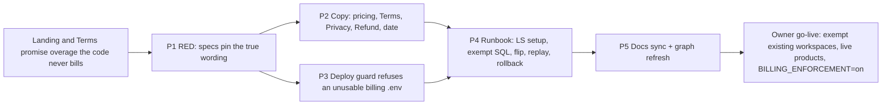

# Lemon Squeezy billing, slice S5: launch (copy, legal, env guard, runbook)

Docs loaded: planning.md, plan-template.md

Parent: `docs/plans/lemon-squeezy-billing-program.md` (owner-approved 2026-10-08, section "S5 launch"). Built on S3 `docs/plans/lemon-squeezy-billing-1-core.md` and S4 `docs/plans/lemon-squeezy-billing-2-metering.md`, both merged (`origin/main` @ `37b07d0`). This file is the S5 Layer-2 spec. No new product decisions. Every departure from the program plan is in "Contradictions found" and needs the orchestrator's yes before the phase it affects.

```
Task Classification:
- Intent: ENHANCEMENT (public copy + legal + ops guard + runbook; no API, type or schema change)
- Workflow: Feature Plan (docs/ai/prompts/feature-plan.md)
- Task Size: Deep (inherits the billing program's Deep classification: risk-register "Landing Pricing Copy" launch blocker, "Legal Pages Accuracy", deploy guard on a live system)
- Domain: Marketing / Landing + Legal pages + Infrastructure / Deployment + Billing docs (docs/ai/module-ownership-map.md)
- Risk: Deep (billing) / Standard (legal pages) per docs/ai/risk-register.md
- Contract Areas: No contract impact (confirmed below). Public claims, deploy guard, runbook.
- Next Action: owner approves this plan, then P1
```

TL;DR: The pricing page and the Terms still promise "extra lines at $0.04 / $0.03" and a refund rule for "overage", but the owner decided the plans are hard caps with no overage, and the code (S3 + S4) now enforces that. S5 makes every public sentence match the code, adds Lemon Squeezy to the Privacy policy, teaches the deploy script to refuse a production `.env` without working billing settings (like a pre-flight checklist that stops the plane before take-off, not after), and writes the runbook the owner follows to go live. Nothing here changes what the product does; it changes what we say about it and what we check before we ship it.

### Flowchart (high-level)



(Render inline as SVG with `mcp__visualize__show_widget` at review time; the mermaid block is what the saved plan keeps.)

### Task metadata

- Classification: `ENHANCEMENT` · `Deep` · Marketing / Landing, Legal pages, Infrastructure / Deployment, Billing · risk-register "Landing Pricing Copy", "Legal Pages Accuracy"
- Contract areas: API: No contract impact. Database: No contract impact (no schema, no migration). Permissions: No contract impact. External integrations: Lemon Squeezy named as a processor in Privacy; dashboard setup documented, not changed. Jobs: No contract impact. Shared types (`packages/types/src/billing.ts`) and `docs/ai/contracts/api-contracts.md` / `db-contracts.md`: confirmed unchanged, nothing to lock (checked below).
- Docs loaded: `planning.md, plan-template.md`
- Claims reversed while investigating: see "Contradictions found" (7 items; none were silently absorbed).
- Root cause: not a bug fix. The drift is the S1 copy (written 2026-10-02 before the hard-cap decision of 2026-10-08) still shipping; evidence `apps/web/src/components/landing/pricing-plans.tsx` (`'Extra lines at $0.04 each'`), `apps/web/app/terms/page.tsx` ("charged at the overage rate"), `apps/web/app/refund/page.tsx` ("Overage charges are non-refundable").
- Detected running model: Sonnet 5.5 (`claude-sonnet-5-5`) wrote this spec.
- Recommended model: every phase `Opus 5.5`, high reasoning (program plan). Identical pair for all phases, so no switch stops. Confidence: high. Fallback: `Sonnet 5.5`, high reasoning. Minimum capability: careful copy-vs-code tracing and shell-guard edge cases; do not go below high.
- Branch: `feat/no-ticket-billing-launch`, from `origin/main` (S3 and S4 are merged, so this slice is NOT stacked; `TDD_RED_BASE` stays the default). Worktree `.claude/worktrees/feat-billing-launch`.
- Release path: one PR into `main`, "Create a merge commit" (`docs/ai/handoff.md` "Release flow"). Deploy runs `scripts/check-prod-env.sh` on the VPS before the backup (`.github/workflows/deploy.yml:276`), so the owner runs the new guard by hand BEFORE merging (go-live checklist, step 0).
- Required skills: `/plan-eng-review` before approval; `/design-review` is not needed (no layout change); `/qa` on the three public pages; `/review`; `/canary` after deploy.
- Execution preflight: `git fetch origin`; worktree exists; in it `nvm use`, `bun install --frozen-lockfile`.

### Contradictions found (stop-and-report items; none block the plan, #1 and #7 need an owner call)

1. **Pricing subtitle claims "Every plan starts with a 14-day trial."** Code: the trial is set once, on a user's first workspace at OTP signup (`apps/api/src/auth/auth.service.ts` `verifyOtp`, `trialEndsAt`), gives the Solo allowance (`apps/api/src/billing/plans.ts` `TRIAL_QUOTAS`), and later workspaces get none (owner decision 2, program plan). A Team buyer does not get a Team trial. Plan wording: "Your first workspace starts with a 14-day trial." Not in the brief; it is the same "claim must trace to code" rule, so it is in scope. If the owner prefers the old sentence, say so before P1.
2. **Program plan lists 10 webhook events** (`...payment_failed|payment_success|payment_recovered`). Code handles 7: `SUBSCRIPTION_EVENTS` in `apps/api/src/billing/billing-webhook.service.ts:17-25` (`subscription_created|updated|cancelled|resumed|expired|paused|unpaused`). Any other event is acknowledged 200 and marked processed with no effect (`process`, line 139). The runbook subscribes to the 7 only; payment status reaches us through `subscription_updated` (`past_due`). Doing otherwise is harmless but noisy.
3. **Shared store (394926, "Tyvera") vs the webhook's unknown-variant rule.** LS delivers every subscription event of the store to every webhook endpoint subscribed to those event types. Another app of the owner's sells from this store. For its subscriptions our webhook passes the `store_id` check, fails `planForVariant`, throws `RetryableFailure('unknown variant ...')` (`billing-webhook.service.ts:~163`) and answers 500, so LS retries and `billing_events` collects rows with `processed_at` NULL. Harmless to billing correctness but noisy and it can drown real failures. NOT fixed here (an API change; the retryable rule exists on purpose so a paid Optra subscription is never terminally dropped because of a missing env). Documented in the runbook ("expected noise"), listed as residual risk R7 and as a follow-up decision for the owner: (a) accept the noise, (b) give Optra its own LS store, (c) a later small API change that ignores variants outside both `LEMONSQUEEZY_VARIANT_*` only when a third env lists "other products" (needs a design call).
4. **Program/owner statement "misconfig answers 500 with `processed_at` NULL"** is true for a missing `LEMONSQUEEZY_STORE_ID` or an unmapped variant (`RetryableFailure`). A missing `LEMONSQUEEZY_WEBHOOK_SECRET` answers 503 and stores NO row (`BillingWebhookService.handle`, line ~70). Both are non-2xx, so LS retries and "Resend" works either way; the runbook states both.
5. **"Switch `BILLING_ENFORCEMENT` and restart api."** A plain `docker compose restart` does not re-read `.env` (`env_file:` is applied at container creation). The runbook uses `docker compose -f docker-compose.prod.yml up -d --force-recreate api`, the same recreate form `deploy.yml:301` uses.
6. **Rotating the LS signing secret breaks open checkouts.** `workspace_sig` is an HMAC of the workspace id keyed by `LEMONSQUEEZY_WEBHOOK_SECRET` (`billing.service.ts` `signWorkspaceBinding`, verified in `billing-webhook.service.ts:~170`). A checkout opened before a rotation and paid after it is rejected terminally ("workspace binding signature missing or invalid", `processed_at` set, so Resend of that same body cannot succeed). Runbook rule: rotate only when no checkout is open, then look for that `last_error`. Durable fix (a separate binding key) is an API change, out of S5; residual risk R6.
7. **`docs/ai/risk-register.md` "Landing Pricing Copy" still says "per-line overage ($0.04 / $0.03)" and "launch blocker"**, and `docs/ai/module-ownership-map.md` Payments row still says "S3 planned". Both are CONTEXT DRIFT from S3/S4 and are fixed in P5. `docs/business/unit-economics.md` already carries the S4 hard-cap table (lines 53-70), so the program plan's "update unit-economics.md" item is DONE and the file is NOT in this slice.

### Landing audit (every other trial/pricing claim checked against code)

`hero.tsx` and `final-cta.tsx` say "14-day free trial": true (`TRIAL_DAYS = 14`, first workspace). `landing-nav.tsx`/CTAs "Start free trial" go to `#trial` then `/workspaces` (signup creates the first workspace and its trial). The FAQ in `apps/web/app/page.tsx` (`faqItems`) makes no price, trial or overage claim ("different seat count" is accurate: Team seats scale the pooled quota). `metrics-strip`, `product-cards`, tour steps: no pricing text (grep for `trial|\$|overage|per month` in `apps/web/src/components/landing` and `tour` finds only the files above plus `pricing-plans.tsx`). Playwright has no landing pricing test today (`grep -rn "pricing\|#trial" apps/e2e/tests` finds only billing-page text), so the new cases in `legal.spec.ts` are the first. Specs asserting the old copy: `pricing-plans.spec.tsx` (overage strings, "Every plan starts"), `terms/page.spec.tsx` (overage sentence), `refund/page.spec.tsx` (`/overage/i`); all edited in P1.

### Owner decisions already applied (no new ones)

Hard cap, no overage (decision 1); app-side trial, first workspace only, Solo allowance, no card (decision 2); `billing_exempt` by hand (decision 3); Team seats scale the pooled quota (decision 4); dollar AI caps (decision 5); gpt-4o (decision 6). `BILLING_ENFORCEMENT` stays `off` through this slice; flipping it is the owner's step after deploy.

### UNVERIFIED DEPENDENCY (does not block P1-P5; blocks go-live step 5 only)

- Whether `LEMONSQUEEZY_STORE_ID` is the same number in LS test mode and live mode (believed yes: one store, two modes), and whether the webhook entry must be created separately per mode (believed yes). The runbook says "confirm in the dashboard" at the switch. The guard only checks that the id is numeric, so a wrong value is a go-live error, not a deploy error. Owner confirms at the test→live switch.

---

## Layer 1: human summary

What a visitor sees after S5: the pricing cards say the allowance stops at the monthly cap, with no overage charge, and that you can upgrade or add buyers any time; the trial line says your first workspace gets 14 days. The Terms say the same in full sentences (trial = Solo allowance, no card, first workspace only; caps on matched lines, photo checks and AI usage; no overage; upgrading mid-trial starts the paid plan at once). The Privacy policy names Lemon Squeezy as the payments processor and discloses that we store its subscription events. The Refund page loses its "overage is non-refundable" line because overage no longer exists. The footer date moves to 2026-10-08.

What the owner gets: a deploy that stops before the backup if the billing settings are missing or malformed, and `docs/ops/billing.md`, the page to open when setting up Lemon Squeezy, exempting existing workspaces, flipping enforcement, replaying a failed webhook, reading the ledger, or backing out.

**Copy-to-code trace (every new public sentence)**

| Public claim (where) | Code evidence | Falsified by |
|---|---|---|
| Allowance "stops at the monthly cap", no overage charge (pricing, Terms) | `BillingGateService.assertMatchedLines/assertPhotoCheck/assertAiBudget` refuse with 402 `QUOTA_EXCEEDED` / `AI_BUDGET_EXCEEDED` when `BILLING_ENFORCEMENT=on` (`apps/api/src/billing/billing-gate.service.ts`); no LS usage-billing code exists (grep `usage_records` in `apps/api/src/billing`: none) | any code path billing beyond the cap |
| Allowances reset each calendar month (UTC) (Terms) | `EntitlementService.resolve` `currentMonthPeriod(now)` for `subscribed` | a period anchored to the subscription date |
| Trial covers the whole trial window (Terms) | `resolve` `trialing` branch: `period` = `trialEndsAt - TRIAL_DAYS` .. `trialEndsAt` | per-month trial reset |
| First workspace only, 14 days, no card, Solo matched-line and photo allowance (pricing subtitle, Terms) | `auth.service.ts` `verifyOtp` sets `trialEndsAt` only there (grep `trialEndsAt` in `apps/api/src`: `auth.service.ts` set, `entitlement.service.ts` read); no LS call before the trial; `TRIAL_QUOTAS = quotasFor('solo', 1)` | trial set elsewhere or checkout required first |
| Later workspaces: no trial, need a plan (Terms) | same grep; `none` state refuses with `SUBSCRIPTION_REQUIRED` | a second trial path |
| Subscribing during the trial starts the paid plan at once (Terms) | billing page text "Subscribing now starts your paid plan immediately." (`apps/web/app/workspaces/[id]/billing/page.tsx:309`); LS variants have no LS trial (program "LS dashboard work") | LS trial configured on a variant |
| Upgrade or add buyers any time (pricing, Terms) | Subscribe (409 when subscribed) then plan/seat changes through the LS portal (`BillingService` checkout/portal; module-ownership-map "Plan Upgrades") | portal not offering seat changes |
| AI usage has a monthly limit (Terms) | `aiCapMicroUsd` / `AI_BUDGET_EXCEEDED` | no dollar cap |
| Lemon Squeezy receives email + workspace id; sends plan, status, dates, payer name + email (Privacy) | `LemonSqueezyClient.createCheckout` sends `checkout_data.email` and `custom.workspace_id/workspace_sig`; `billing_events.payload` stores the whole body (risk-register S3 follow-up note) | payload trimmed or fields added |

**Risk Matrix**

| Risk | Likelihood | Impact | Mitigation | Rollback |
|---|---|---|---|---|
| R1. Public copy says "hard cap" while `BILLING_ENFORCEMENT=off`, so for now it is a promise ahead of enforcement | Certain until the flip | A user over-uses with no stop, a copy-vs-code gap | Risk-register status "resolved, pending flip"; runbook go-live order forbids creating live-mode checkout (step 5) before enforcement is on (step 4); no live product exists today, so nobody can pay for a cap that is not enforced | Revert the P2 commit; copy returns to S1 wording (still false for overage), so prefer fixing forward |
| R2. New guard rejects the real prod `.env` and the first deploy after merge fails | Low (owner says all vars set) | A blocked deploy (nothing changed: the guard runs before backup) | Owner runs `sh scripts/check-prod-env.sh .env .env.example` on the VPS BEFORE merging (prints keys, never values); guard messages name the key | Delete the failing check lines in `check-prod-env.sh` or fix `.env`; one-commit revert |
| R3. Guard is too strict for a legitimate value (secret length, id format) | Low | Blocked deploy | Ranges taken from LS: signing secret 6-40 chars; ids are LS integers; `BILLING_ENFORCEMENT` exact `on`/`off` mirrors the code's exact `=== 'on'` (`entitlement.service.ts:63`) | Relax the one check |
| R4. Privacy under-discloses (processor, stored payload) | Medium | Regulatory trust (RA 10173) | Row + data-we-collect line trace to code (table above); spec pins both; `LEGAL_LAST_UPDATED` bumped | Revert P2; add the row back |
| R5. A spec pins wording so tightly that a harmless edit fails CI | Medium | Friction only | Pins are the point (risk-register "Legal Pages Accuracy": specs pin the facts); wording lives next to its spec | Edit both together |
| R6. Secret rotation drops in-flight paid checkouts (Contradiction 6) | Low | A customer pays, gets no plan until manual repair | Runbook rotation rule + repair query; durable fix named (API follow-up) | Manual `UPDATE`/replay per runbook |
| R7. Shared-store noise in `billing_events` (Contradiction 3) | High once the webhook is live and the other app has subscribers | Failed-delivery clutter | Runbook explains the signature of the noise (`last_error` "unknown variant"); owner decides a, b or c | None needed (no data effect) |
| R8. Existing prod workspaces paywalled at the flip | Certain unless exempted | Churn | Runbook step: list workspaces, exempt every current one BEFORE `BILLING_ENFORCEMENT=on`; flip is reversible | `BILLING_ENFORCEMENT=off` + recreate api |
| R9. Deletion promise vs `billing_events` | Medium | `billing_events` has no workspace FK (`billingEvents.ts`) and holds payer email/name; a workspace-deletion script that only follows FKs would leave it | Recorded in risk-register "Legal Pages Accuracy" (P5) as a must-do for the deletion runbook that row already requires | n/a |

**Backward Compatibility Matrix** (usage search recorded: `grep -rn "PricingPlans\|LEGAL_LAST_UPDATED\|TRIAL_DAYS" apps/web`, `grep -rn "check-prod-env" .github scripts docs DEPLOYMENT.md`, `grep -rn "overage\|Extra lines" apps docs/ai`, Graphify query "who renders PricingPlans" returned only `app/page.tsx` as caller)

| Changed File / Symbol | Used By (outside this feature) | Breaks? | Handling |
|---|---|---|---|
| `pricing-plans.tsx` `PricingPlans`, `PLANS` feature strings, subtitle | `apps/web/app/page.tsx` (render only); `pricing-plans.spec.tsx`; Playwright has no pricing test today | Spec text assertions change | Specs updated in P1; `page.spec.ts` asserts structure, not these strings (affected, NOT modified; run in P6) |
| `legal-facts.ts` `LEGAL_LAST_UPDATED` | `components/legal/legal-page.tsx` (prints it); terms/privacy/refund specs; `legal-facts.spec.ts` | None: string value only; `legal-facts.spec.ts` "no constant beyond the documented set" still holds (no new export) | Spec lower bound raised in P1 |
| `terms/page.tsx` "Subscription and trial" | `terms/page.spec.tsx`; `apps/e2e/tests/legal.spec.ts` (headings only) | One spec test pinned the removed sentence | Replaced in P1 (the removed assertion pinned false copy; the new ones are stricter) |
| `privacy/page.tsx` processors + data rows | `privacy/page.spec.tsx` (processor/cookie assertions) | None expected; new rows only | New tests in P1; existing run unchanged |
| `refund/page.tsx` "After that" list | `refund/page.spec.tsx` test pinned `/overage/i` | Yes, that one test | Rewritten in P1 (see note under Test Matrix) |
| `scripts/check-prod-env.sh` | `.github/workflows/deploy.yml:72` (self-test in CI), `:276` (VPS, before backup); `DEPLOYMENT.md:252` | A prod `.env` lacking billing vars now fails the deploy at step 0 | Owner pre-check (R2); CI self-test covers the cases |
| `.env.example` comments | `check-prod-env.sh` reads commented placeholders via `example_of` | None: comments only, key names unchanged | Placeholder text must stay `<...>` shaped (guard also rejects any value starting `<`) |
| `risk-register.md`, `module-ownership-map.md`, `testing-strategy.md`, `repository-map.md`, `DEPLOYMENT.md` | Docs only | None | Row-level edits |
| `apps/api/**`, `packages/**`, `docs/ai/contracts/**`, `docker-compose*.yml`, workflows | untouched | n/a | Listed so the file list is provably complete |

---

## Layer 2: execution spec

File list (the complete set implementation may touch; anything else: STOP, update both matrices, re-approve):

| Persona / owner | Files |
|---|---|
| `test-engineer` (P1) | `apps/web/src/components/landing/pricing-plans.spec.tsx`, `apps/web/app/terms/page.spec.tsx`, `apps/web/app/privacy/page.spec.tsx`, `apps/web/app/refund/page.spec.tsx`, `apps/web/src/lib/legal-facts.spec.ts`, `apps/e2e/tests/legal.spec.ts`, `scripts/check-prod-env.spec.sh` |
| `nextjs-frontend-dev` (P2) | `apps/web/src/components/landing/pricing-plans.tsx`, `apps/web/app/terms/page.tsx`, `apps/web/app/privacy/page.tsx`, `apps/web/app/refund/page.tsx`, `apps/web/src/lib/legal-facts.ts` |
| orchestrator (P3-P5; no persona owns `scripts/**`, `.env.example`, root docs; assigned here per File Ownership Rule item 6 of `docs/ai/agent-orchestration.md`) | `scripts/check-prod-env.sh`, `.env.example`, `DEPLOYMENT.md`, `docs/ops/billing.md` (new), `docs/ai/risk-register.md`, `docs/ai/module-ownership-map.md`, `docs/ai/testing-strategy.md`, `docs/ai/file-index/repository-map.md`, `learnings.md`, `graphify-out/**` (refresh output only), this plan |

No file appears twice. Dispatch prompts for P1 and P2 carry NO `## Domain Briefing`: `docs/ai/agent-orchestration.md` has no Marketing/Landing, Legal or Billing briefing, and its rule is "do not improvise a briefing" (same decision as S4). They carry the caveman-ultra instruction, the persona line, and the File Ownership Rule verbatim. P2 has one persona, so the Round 2 pairing rule (backend + frontend together) does not apply: `nestjs-backend-dev` has nothing to do and is skipped.

### P1: RED (`test-engineer`, Opus 5.5, high)

Write every test in the Test Matrix. Run `bun run tdd:red`, paste the failing output, commit the tests alone as `test(billing): pin the hard-cap copy, Lemon Squeezy disclosure and billing env guard`. No guarded source changes in this phase. Shell spec is not guarded source (`docs/ai/testing-strategy.md` "Guarded source"): run `sh scripts/check-prod-env.spec.sh` too and paste its FAIL lines; it is expected to exit 1 until P3.

**1.1 `apps/web/src/lib/legal-facts.spec.ts`**

Old:
```ts
    // Bumped for photo intake: the privacy page now says page images of photographed paper go to OpenAI.
    expect(facts.LEGAL_LAST_UPDATED).toMatch(/^\d{4}-\d{2}-\d{2}$/)
    expect(facts.LEGAL_LAST_UPDATED >= '2026-10-06').toBe(true)
```
New:
```ts
    // Bumped for billing launch: hard-cap terms and Lemon Squeezy named as a processor.
    expect(facts.LEGAL_LAST_UPDATED).toMatch(/^\d{4}-\d{2}-\d{2}$/)
    expect(facts.LEGAL_LAST_UPDATED >= '2026-10-08').toBe(true)
```

**1.2 `apps/web/src/components/landing/pricing-plans.spec.tsx`**

(a) Imports. Old:
```tsx
import { cleanup, render, screen } from '@testing-library/react'
import { afterEach, describe, expect, it } from 'vitest'
import { CONTACT_EMAIL } from '@/lib/legal-facts'
```
New:
```tsx
import { readFileSync } from 'node:fs'
import { fileURLToPath } from 'node:url'
import { cleanup, render, screen } from '@testing-library/react'
import { afterEach, describe, expect, it } from 'vitest'
import { CONTACT_EMAIL } from '@/lib/legal-facts'
```

(b) New error and edge tests, inserted right after the existing `error: no longer promises no card or no onboarding call` test. Old:
```tsx
    expect(screen.queryByRole('link', { name: 'Contact sales' })).toBeNull()
  })

  it('edge: Scale CTA is a mailto with the Optra Scale subject, not the trial anchor', () => {
```
New:
```tsx
    expect(screen.queryByRole('link', { name: 'Contact sales' })).toBeNull()
  })

  it('error: no per-line overage is offered, because the plans are hard-capped', () => {
    const { container } = render(<PricingPlans />)

    expect(container.textContent).not.toMatch(/Extra lines/i)
    expect(container.textContent).not.toMatch(/\$0\.0[34]/)
  })

  it('error: the trial line no longer says every plan starts with a trial', () => {
    const { container } = render(<PricingPlans />)

    expect(container.textContent).not.toContain('Every plan starts with a 14-day trial')
  })

  it('edge: Solo and Team both say the allowance stops at the monthly cap with no overage charges', () => {
    render(<PricingPlans />)

    expect(screen.getByText('Hard monthly cap, no overage charges. Upgrade anytime')).not.toBeNull()
    expect(screen.getByText('Hard monthly cap, no overage charges. Add buyers anytime')).not.toBeNull()
  })

  it('edge: Scale CTA is a mailto with the Optra Scale subject, not the trial anchor', () => {
```

(c) Drift guard (regression), inserted before the first `happy:` test. Old:
```tsx
  it('happy: renders the three plans with their prices and cadences', () => {
```
New:
```tsx
  it('regression: the quotas on the page equal quotasFor() in apps/api/src/billing/plans.ts', () => {
    const plans = readFileSync(
      fileURLToPath(new URL('../../../../api/src/billing/plans.ts', import.meta.url)),
      'utf8',
    )
    render(<PricingPlans />)

    expect(plans).toMatch(/\{ matchedLines: 2000 \* seats, photoChecks: 300 \* seats \}/)
    expect(plans).toMatch(/\{ matchedLines: 400, photoChecks: 100 \}/)
    expect(screen.getByText('400 matched line items / month')).not.toBeNull()
    expect(screen.getByText('100 photo checks / month')).not.toBeNull()
    expect(screen.getByText('2,000 matched line items per buyer, pooled')).not.toBeNull()
    expect(screen.getByText('300 photo checks per buyer, pooled')).not.toBeNull()
  })

  it('happy: renders the three plans with their prices and cadences', () => {
```

(d) Replace the quota test. Old:
```tsx
  // Quantified commitments; pinned so changing them is a deliberate product call.
  it('happy: states the metered quotas, photo checks and overage rates verbatim', () => {
    render(<PricingPlans />)

    expect(screen.getByText('400 matched line items / month')).not.toBeNull()
    expect(screen.getByText('100 photo checks / month')).not.toBeNull()
    expect(screen.getByText('Extra lines at $0.04 each')).not.toBeNull()
    expect(screen.getByText('2,000 matched line items per buyer, pooled')).not.toBeNull()
    expect(screen.getByText('300 photo checks per buyer, pooled')).not.toBeNull()
    expect(screen.getByText('Extra lines at $0.03 each')).not.toBeNull()
  })

  it('happy: makes per-line-item pricing and the 14-day trial explicit', () => {
    render(<PricingPlans />)

    expect(
      screen.getByText(
        /Priced per matched line item, not per document\. Every plan starts with a 14-day trial\./i,
      ),
    ).not.toBeNull()
  })
```
New:
```tsx
  // Quantified commitments; pinned so changing them is a deliberate product call.
  it('happy: states the metered quotas and photo checks verbatim', () => {
    render(<PricingPlans />)

    expect(screen.getByText('400 matched line items / month')).not.toBeNull()
    expect(screen.getByText('100 photo checks / month')).not.toBeNull()
    expect(screen.getByText('2,000 matched line items per buyer, pooled')).not.toBeNull()
    expect(screen.getByText('300 photo checks per buyer, pooled')).not.toBeNull()
  })

  it('happy: makes per-line-item pricing and the first-workspace 14-day trial explicit', () => {
    render(<PricingPlans />)

    expect(
      screen.getByText(
        /Priced per matched line item, not per document\. Your first workspace starts with a 14-day trial\./i,
      ),
    ).not.toBeNull()
  })
```

**1.3 `apps/web/app/terms/page.spec.tsx`**

Old:
```tsx
  it('error: photo checks are hard-capped, not billed as overage', () => {
    const { container } = render(React.createElement(TermsPage))

    expect(container.textContent).not.toContain('Usage above the included amount')
    expect(container.textContent).toContain(
      "Extra matched line items are charged at the overage rate shown for your plan. Photo checks stop at your plan's cap.",
    )
  })
```
New:
```tsx
  it('error: no overage rate is promised, the plans are hard-capped', () => {
    const { container } = render(React.createElement(TermsPage))
    const text = container.textContent ?? ''

    expect(text).not.toContain('Usage above the included amount')
    expect(text).not.toMatch(/charged at the overage rate/i)
    expect(text).not.toMatch(/Extra matched line items/i)
    expect(text).toContain('There is no overage charge.')
  })

  it('error: the caps cover matched line items, photo checks and AI usage, and work stops at the cap', () => {
    const { container } = render(React.createElement(TermsPage))
    const text = container.textContent ?? ''

    expect(text).toContain(
      'Each plan includes a monthly allowance of matched line items and photo checks, as shown on the pricing page, and a monthly limit on AI usage.',
    )
    expect(text).toContain('Allowances reset each calendar month (UTC); the trial allowance covers the whole trial.')
    expect(text).toContain('When a workspace reaches a cap, that kind of work stops until the allowance resets.')
  })

  it('edge: the trial is 14 days, first workspace only, no card, with the Solo allowance', () => {
    const { container } = render(React.createElement(TermsPage))
    const text = container.textContent ?? ''

    expect(text).toContain('Your first workspace starts with a 14-day trial.')
    expect(text).toContain('The trial needs no payment card')
    expect(text).toContain("the Solo plan's allowance of matched line items and photo checks")
    expect(text).toContain('Workspaces you create later do not get a trial and need a plan.')
    expect(text).toContain('Subscribing during the trial starts your paid plan immediately.')
  })

  it('edge: states that you can upgrade or add buyers at any time', () => {
    const { container } = render(React.createElement(TermsPage))

    expect(container.textContent).toContain('You can upgrade your plan or add buyers at any time.')
  })
```

**1.4 `apps/web/app/privacy/page.spec.tsx`**

Insert before `it('happy: exports title, description and canonical metadata'`. Old:
```tsx
  it('happy: exports title, description and canonical metadata', () => {
    expect(metadata.title).toBe('Privacy Policy')
```
New:
```tsx
  it('error: the Lemon Squeezy row renders from fixed copy even when every optional fact is null', async () => {
    const { container } = await renderWithFacts({})

    expect(container.textContent).toContain('Lemon Squeezy')
    expect(container.textContent).not.toMatch(/undefined|\bnull\b/)
  })

  it('edge: data-we-collect lists the stored Lemon Squeezy billing events with the payer name and email', () => {
    const { container } = render(React.createElement(PrivacyPage))
    const text = container.textContent ?? ''

    expect(text).toContain(
      'Billing events from Lemon Squeezy (plan, status, renewal dates, and the payer name and email in the event)',
    )
    expect(text).toContain('Keep your subscription status accurate and investigate billing problems.')
  })

  it('happy: Lemon Squeezy is a processor as Merchant of Record and the row says what each side sends', () => {
    const { container } = render(React.createElement(PrivacyPage))
    const text = container.textContent ?? ''

    expect(text).toContain('Payments, tax and invoices, as our Merchant of Record.')
    expect(text).toContain(
      'We send it your email address and a workspace identifier; it sends us your plan, subscription status, renewal dates and the payer name and email.',
    )
  })

  it('happy: exports title, description and canonical metadata', () => {
    expect(metadata.title).toBe('Privacy Policy')
```

**1.5 `apps/web/app/refund/page.spec.tsx`**

Old:
```tsx
  it('edge: states no partial-period refunds and non-refundable used overage', () => {
    const { container } = render(React.createElement(RefundPage))

    expect(container.textContent).toMatch(/partial/i)
    expect(container.textContent).toMatch(/overage/i)
    expect(container.textContent).toMatch(/non-refundable/i)
  })
```
New:
```tsx
  it('error: no longer mentions overage charges, because the plans are hard-capped', () => {
    const { container } = render(React.createElement(RefundPage))

    expect(container.textContent).not.toMatch(/overage/i)
    expect(container.textContent).not.toMatch(/non-refundable/i)
  })

  it('edge: states no partial-period refunds after the 14-day window', () => {
    const { container } = render(React.createElement(RefundPage))

    expect(container.textContent).toContain(
      'No partial-period refunds once the 14-day window has passed.',
    )
  })
```
Note on test integrity: the replaced assertions pinned copy that is now false (overage exists nowhere in code). They are replaced by stricter ones, not weakened or deleted for green (`CLAUDE.md` "Don't do this"). The two edited unit tests are the only existing assertions whose expected text changes; both are named here.

**1.6 `apps/e2e/tests/legal.spec.ts`** (append; the file already runs signed-out against the real Next.js app)

Old (end of file):
```ts
      await expect(page.getByText('© 2026 Romeo Angeles Jr. · Optra · Philippines')).toBeVisible()
    })
  }
})
```
New:
```ts
      await expect(page.getByText('© 2026 Romeo Angeles Jr. · Optra · Philippines')).toBeVisible()
    })
  }
})

test.describe('billing copy on the public pages', () => {
  test('error: the pricing section offers no per-line overage', async ({ page }) => {
    await page.goto('/')
    const pricing = page.locator('#pricing')

    await expect(pricing).toBeVisible()
    await expect(pricing).not.toContainText('Extra lines')
    await expect(pricing).not.toContainText('$0.04')
    await expect(pricing).not.toContainText('$0.03')
  })

  test('error: Terms no longer charge an overage rate and Refund no longer mentions overage', async ({
    page,
  }) => {
    await page.goto('/terms')
    await expect(page.getByText('charged at the overage rate')).toHaveCount(0)
    await page.goto('/refund')
    await expect(page.getByText(/overage/i)).toHaveCount(0)
  })

  test('edge: Terms state the first-workspace trial, the caps and the no-card rule', async ({ page }) => {
    await page.goto('/terms')
    const body = page.locator('main')

    await expect(body).toContainText('Your first workspace starts with a 14-day trial.')
    await expect(body).toContainText('The trial needs no payment card')
    await expect(body).toContainText('There is no overage charge.')
    await expect(body).toContainText('You can upgrade your plan or add buyers at any time.')
  })

  test('edge: Privacy lists Lemon Squeezy as a processor', async ({ page }) => {
    await page.goto('/privacy')

    await expect(page.getByRole('rowheader', { name: 'Lemon Squeezy' })).toBeVisible()
    await expect(page.getByText('as our Merchant of Record')).toBeVisible()
  })

  test('happy: both paid plans state the hard monthly cap on the landing page', async ({ page }) => {
    await page.goto('/')
    const pricing = page.locator('#pricing')

    await expect(pricing).toContainText('Hard monthly cap, no overage charges. Upgrade anytime')
    await expect(pricing).toContainText('Hard monthly cap, no overage charges. Add buyers anytime')
    await expect(pricing).toContainText('Your first workspace starts with a 14-day trial.')
  })
})
```
Verified while planning: `LegalPage` renders `<main>` (`apps/web/src/components/legal/legal-page.tsx:102`) and the first cell of each `LegalTable` row is a `<th scope="row">` (line 68), hence `rowheader`. `#pricing` is the `id` on the `<section>` in `PricingPlans`.

**1.7 `scripts/check-prod-env.spec.sh`** (complete new content)

```sh
#!/bin/sh
# Self-test for scripts/check-prod-env.sh.
#
#   sh scripts/check-prod-env.spec.sh
set -eu

GUARD="$(cd "$(dirname "$0")" && pwd)/check-prod-env.sh"
WORK="$(mktemp -d)"
trap 'rm -rf "$WORK"' EXIT

printf 'JWT_SECRET=example-secret\nOPENAI_API_KEY=sk-example\n# POSTGRES_PASSWORD=example-password\n# LEMONSQUEEZY_API_KEY=<API key from the LS dashboard>\n# LEMONSQUEEZY_WEBHOOK_SECRET=<signing secret entered when creating the webhook>\n' > "$WORK/example"
GOOD='DOMAIN=optra.tyvera.app
S3_ENDPOINT=https://s3.us-east-005.backblazeb2.com
POSTGRES_PASSWORD=real-password
OPENAI_API_KEY=sk-real
JWT_SECRET=real-secret
OPENAI_PROCUREMENT_EXTRACTION_MODEL=gpt-4o
LEMONSQUEEZY_API_KEY=lsk-real-api-key
LEMONSQUEEZY_STORE_ID=394926
LEMONSQUEEZY_WEBHOOK_SECRET=real-signing-secret
LEMONSQUEEZY_VARIANT_SOLO=1111111
LEMONSQUEEZY_VARIANT_TEAM=2222222
BILLING_ENFORCEMENT=off'

passed=0
failed=0

# case <name> <expected-exit> <env-file-content>
case_() {
    printf '%s\n' "$3" > "$WORK/env"
    set +e
    sh "$GUARD" "$WORK/env" "$WORK/example" > "$WORK/out" 2>&1
    actual=$?
    set -e
    if [ "$actual" -eq "$2" ]; then passed=$((passed + 1)); echo "ok   $1"
    else failed=$((failed + 1)); echo "FAIL $1 (expected $2, got $actual)"; sed 's/^/     /' "$WORK/out"; fi
}

# GOOD with KEY set to VALUE (VALUE must not contain |), or with KEY removed.
with() { printf '%s\n' "$GOOD" | sed "s|^$1=.*|$1=$2|"; }
without() { printf '%s\n' "$GOOD" | sed "/^$1=/d"; }
# repeat <char> <count>
repeat() { awk -v c="$1" -v n="$2" 'BEGIN { for (i = 0; i < n; i++) printf "%s", c }'; }

case_ 'error: a bare DOMAIN is refused' 1 "$(printf '%s\n' "$GOOD" | sed 's/^DOMAIN=.*/DOMAIN=optra/')"
case_ 'error: a DOMAIN with a scheme is refused' 1 "$(printf '%s\n' "$GOOD" | sed 's|^DOMAIN=.*|DOMAIN=https://optra.tyvera.app|')"
case_ 'error: an http S3 endpoint is refused' 1 "$(printf '%s\n' "$GOOD" | sed 's|^S3_ENDPOINT=.*|S3_ENDPOINT=http://seaweedfs:8333|')"
case_ 'error: a placeholder JWT secret is refused' 1 "$(printf '%s\n' "$GOOD" | sed 's/^JWT_SECRET=.*/JWT_SECRET=example-secret/')"
case_ 'error: an empty POSTGRES_PASSWORD is refused' 1 "$(printf '%s\n' "$GOOD" | sed 's/^POSTGRES_PASSWORD=.*/POSTGRES_PASSWORD=/')"
case_ 'error: a placeholder repeated later in the file is refused (compose uses the last one)' 1 "$(printf '%s\nJWT_SECRET=example-secret' "$GOOD")"
case_ 'error: a quoted placeholder is refused' 1 "$(printf '%s\n' "$GOOD" | sed 's/^JWT_SECRET=.*/JWT_SECRET="example-secret"/')"
case_ 'error: a placeholder commented out in .env.example is still refused' 1 "$(printf '%s\n' "$GOOD" | sed 's/^POSTGRES_PASSWORD=.*/POSTGRES_PASSWORD=example-password/')"
case_ 'error: the test-only THROTTLE_DEFAULT_LIMIT is refused' 1 "$(printf '%s\nTHROTTLE_DEFAULT_LIMIT=100000' "$GOOD")"
case_ 'error: a missing LEMONSQUEEZY_API_KEY is refused' 1 "$(without LEMONSQUEEZY_API_KEY)"
case_ 'error: an empty LEMONSQUEEZY_API_KEY is refused' 1 "$(with LEMONSQUEEZY_API_KEY '')"
case_ 'error: the .env.example placeholder for LEMONSQUEEZY_API_KEY is refused' 1 "$(with LEMONSQUEEZY_API_KEY '<API key from the LS dashboard>')"
case_ 'error: any angle-bracket placeholder is refused even when .env.example does not list it' 1 "$(with LEMONSQUEEZY_API_KEY '<paste the key here>')"
case_ 'error: a missing LEMONSQUEEZY_WEBHOOK_SECRET is refused' 1 "$(without LEMONSQUEEZY_WEBHOOK_SECRET)"
case_ 'error: the .env.example placeholder for LEMONSQUEEZY_WEBHOOK_SECRET is refused' 1 "$(with LEMONSQUEEZY_WEBHOOK_SECRET '<signing secret entered when creating the webhook>')"
case_ 'error: a 5-character LEMONSQUEEZY_WEBHOOK_SECRET is refused' 1 "$(with LEMONSQUEEZY_WEBHOOK_SECRET "$(repeat x 5)")"
case_ 'error: a 41-character LEMONSQUEEZY_WEBHOOK_SECRET is refused' 1 "$(with LEMONSQUEEZY_WEBHOOK_SECRET "$(repeat x 41)")"
case_ 'error: a missing LEMONSQUEEZY_STORE_ID is refused' 1 "$(without LEMONSQUEEZY_STORE_ID)"
case_ 'error: a non-numeric LEMONSQUEEZY_STORE_ID is refused' 1 "$(with LEMONSQUEEZY_STORE_ID 'store-394926')"
case_ 'error: a non-numeric LEMONSQUEEZY_VARIANT_SOLO is refused' 1 "$(with LEMONSQUEEZY_VARIANT_SOLO 'solo')"
case_ 'error: a missing LEMONSQUEEZY_VARIANT_TEAM is refused' 1 "$(without LEMONSQUEEZY_VARIANT_TEAM)"
case_ 'error: the same variant id for Solo and Team is refused' 1 "$(with LEMONSQUEEZY_VARIANT_TEAM 1111111)"
case_ 'error: a missing BILLING_ENFORCEMENT is refused' 1 "$(without BILLING_ENFORCEMENT)"
case_ 'error: BILLING_ENFORCEMENT=true is refused (only the exact value on enforces)' 1 "$(with BILLING_ENFORCEMENT true)"
case_ 'error: BILLING_ENFORCEMENT=ON is refused (case matters to the api)' 1 "$(with BILLING_ENFORCEMENT ON)"
case_ 'error: an empty OPENAI_PROCUREMENT_EXTRACTION_MODEL is refused' 1 "$(with OPENAI_PROCUREMENT_EXTRACTION_MODEL '')"
case_ 'edge: a quoted real value passes' 0 "$(printf '%s\n' "$GOOD" | sed 's/^JWT_SECRET=.*/JWT_SECRET="real-secret"/')"
case_ 'edge: a 6-character LEMONSQUEEZY_WEBHOOK_SECRET passes' 0 "$(with LEMONSQUEEZY_WEBHOOK_SECRET "$(repeat x 6)")"
case_ 'edge: a 40-character LEMONSQUEEZY_WEBHOOK_SECRET passes' 0 "$(with LEMONSQUEEZY_WEBHOOK_SECRET "$(repeat x 40)")"
case_ 'edge: BILLING_ENFORCEMENT=on passes' 0 "$(with BILLING_ENFORCEMENT on)"
case_ 'edge: quoted billing values pass' 0 "$(with LEMONSQUEEZY_STORE_ID '"394926"' | sed 's/^BILLING_ENFORCEMENT=.*/BILLING_ENFORCEMENT="off"/')"
case_ 'happy: a complete production .env passes' 0 "$GOOD"

echo ""
echo "$passed passed, $failed failed"
[ "$failed" -eq 0 ]
```

Run, in order: `bun run tdd:red` (web specs: `apps/web` Vitest fails on the new copy assertions and `legal-facts.spec.ts` `>= '2026-10-08'`; Playwright specs are recorded by `tdd:red` per `docs/ai/testing-strategy.md` "Test kinds", if the runner mapping omits them, say so in the paste), and `sh scripts/check-prod-env.spec.sh` (expected FAIL on every new `error:` case whose absence the old guard does not detect, exit 1).

Done: `bun run tdd:red` reports a valid RED and wrote the marker; the pasted shell-spec output shows the new cases failing; tests committed alone.

### P2: public copy and legal pages (`nextjs-frontend-dev`, Opus 5.5, high)

**2.1 `apps/web/src/components/landing/pricing-plans.tsx`**

(a) Old:
```tsx
import { CONTACT_EMAIL } from '@/lib/legal-facts'
```
New:
```tsx
import { CONTACT_EMAIL, TRIAL_DAYS } from '@/lib/legal-facts'
```

(b) Old:
```tsx
// Included volumes and overage rates are the product decision of record, not
// measured usage. The metering that enforces them -- counting *matched line
// items* per comparison run, idempotent across re-comparisons of the same
// PO/invoice pair -- is a separate backend task; this section is copy only.
// A photo check is one PO line verified against up to 8 catalog photos.
```
New:
```tsx
// Included volumes are the product decision of record and the API enforces
// them: BillingGateService (apps/api/src/billing/billing-gate.service.ts)
// refuses work past the cap once BILLING_ENFORCEMENT is on. The numbers live in
// apps/api/src/billing/plans.ts#quotasFor; this section mirrors them because web
// cannot import the API, and pricing-plans.spec.tsx fails if they drift.
// There is no overage billing: a workspace stops at its cap (owner decision
// 2026-10-08). A photo check is one PO line verified against up to 8 catalog photos.
```

(c) Old:
```tsx
      'Extra lines at $0.04 each',
```
New:
```tsx
      'Hard monthly cap, no overage charges. Upgrade anytime',
```

(d) Old:
```tsx
      'Extra lines at $0.03 each',
```
New:
```tsx
      'Hard monthly cap, no overage charges. Add buyers anytime',
```

(e) Old:
```tsx
              Priced per matched line item, not per document. Every plan starts with a 14-day trial.
```
New:
```tsx
              {`Priced per matched line item, not per document. Your first workspace starts with a ${TRIAL_DAYS}-day trial.`}
```

**2.2 `apps/web/app/terms/page.tsx`**

Old:
```tsx
        <p>
          Optra is a subscription. Every plan starts with a {TRIAL_DAYS}-day trial. Plans include a
          number of matched line items and photo checks, as shown on the pricing page. Extra
          matched line items are charged at the overage rate shown for your plan. Photo checks
          stop at your plan&apos;s cap. Refunds are
          covered in the{' '}
          <LegalLink href="/refund">refund policy</LegalLink>; the full refund window is{' '}
          {REFUND_WINDOW_DAYS} days.
        </p>
```
New:
```tsx
        <p>
          Optra is a subscription. Your first workspace starts with a {TRIAL_DAYS}-day trial. The
          trial needs no payment card and gives you the Solo plan&apos;s allowance of matched line
          items and photo checks. Workspaces you create later do not get a trial and need a plan.
          Subscribing during the trial starts your paid plan immediately.
        </p>
        <p>
          Each plan includes a monthly allowance of matched line items and photo checks, as shown
          on the pricing page, and a monthly limit on AI usage. Allowances reset each calendar
          month (UTC); the trial allowance covers the whole trial. When a workspace reaches a cap,
          that kind of work stops until the allowance resets. There is no overage charge. You can
          upgrade your plan or add buyers at any time. Refunds are covered in the{' '}
          <LegalLink href="/refund">refund policy</LegalLink>; the full refund window is{' '}
          {REFUND_WINDOW_DAYS} days.
        </p>
```

**2.3 `apps/web/app/privacy/page.tsx`**

(a) Processors. Old:
```tsx
        : 'Hosting (server location on request).',
    ],
  ]
```
New:
```tsx
        : 'Hosting (server location on request).',
    ],
    [
      'Lemon Squeezy',
      'Your email address, plus the billing, tax and payment details you enter on its hosted checkout. We send it your email address and a workspace identifier; it sends us your plan, subscription status, renewal dates and the payer name and email.',
      'Payments, tax and invoices, as our Merchant of Record.',
    ],
  ]
```

(b) Data table. Old:
```tsx
            ['Workspace member emails and roles', 'Control who can access the workspace.'],
```
New:
```tsx
            ['Workspace member emails and roles', 'Control who can access the workspace.'],
            [
              'Billing events from Lemon Squeezy (plan, status, renewal dates, and the payer name and email in the event)',
              'Keep your subscription status accurate and investigate billing problems.',
            ],
```

**2.4 `apps/web/app/refund/page.tsx`**

Old:
```tsx
      <LegalSection title="After that">
        <ul className="list-disc space-y-2 pl-5">
          <li>No partial-period refunds once the {REFUND_WINDOW_DAYS}-day window has passed.</li>
          <li>Overage charges are non-refundable once the extra lines have been used.</li>
        </ul>
      </LegalSection>
```
New:
```tsx
      <LegalSection title="After that">
        <p>No partial-period refunds once the {REFUND_WINDOW_DAYS}-day window has passed.</p>
      </LegalSection>
```

**2.5 `apps/web/src/lib/legal-facts.ts`**

Old:
```ts
export const LEGAL_LAST_UPDATED = '2026-10-06'
```
New:
```ts
export const LEGAL_LAST_UPDATED = '2026-10-08'
```

Run `bun run test` in `apps/web` (all green, including `app/page.spec.ts` unchanged), `bun run type-check`, `bun run lint`. Commit `feat(web): hard-cap pricing and terms copy, Lemon Squeezy in the privacy policy`.

Done: the P1 web specs pass; no occurrence of `Extra lines`, `overage rate` or `Overage charges` remains in `apps/web` (`grep -rn "Extra lines\|overage rate\|Overage charges" apps/web/app apps/web/src` returns nothing; the allowed substrings are "no overage charge(s)").

### P3: deploy guard and env docs (orchestrator, Opus 5.5, high)

**3.1 `scripts/check-prod-env.sh`**

Old:
```sh
for key in POSTGRES_PASSWORD OPENAI_API_KEY JWT_SECRET; do
    actual="$(value_of "$key" "$ENV_FILE")"
    example="$(example_of "$key" "$EXAMPLE_FILE")"
    if [ -z "$actual" ]; then
        fail "$key is empty"
    elif [ -n "$example" ] && [ "$actual" = "$example" ]; then
        fail "$key is still the .env.example placeholder"
    fi
done
```
New:
```sh
for key in POSTGRES_PASSWORD OPENAI_API_KEY JWT_SECRET LEMONSQUEEZY_API_KEY LEMONSQUEEZY_WEBHOOK_SECRET; do
    actual="$(value_of "$key" "$ENV_FILE")"
    example="$(example_of "$key" "$EXAMPLE_FILE")"
    if [ -z "$actual" ]; then
        fail "$key is empty"
    elif [ -n "$example" ] && [ "$actual" = "$example" ]; then
        fail "$key is still the .env.example placeholder"
    elif printf '%s' "$actual" | grep -q '^<'; then
        fail "$key is still an angle-bracket placeholder"
    fi
done

# Billing (Lemon Squeezy). The api answers 503 on checkout, portal and webhook
# when these are missing, so a customer could pay with nothing recorded.
# A Lemon Squeezy signing secret is 6-40 characters.
webhook_secret="$(value_of LEMONSQUEEZY_WEBHOOK_SECRET "$ENV_FILE")"
if [ -n "$webhook_secret" ] && ! printf '%s' "$webhook_secret" | grep -Eq '^.{6,40}$'; then
    fail "LEMONSQUEEZY_WEBHOOK_SECRET must be 6-40 characters (the range Lemon Squeezy accepts)"
fi

for key in LEMONSQUEEZY_STORE_ID LEMONSQUEEZY_VARIANT_SOLO LEMONSQUEEZY_VARIANT_TEAM; do
    if ! value_of "$key" "$ENV_FILE" | grep -Eq '^[0-9]+$'; then
        fail "$key must be the numeric id shown in the Lemon Squeezy dashboard"
    fi
done

solo_variant="$(value_of LEMONSQUEEZY_VARIANT_SOLO "$ENV_FILE")"
team_variant="$(value_of LEMONSQUEEZY_VARIANT_TEAM "$ENV_FILE")"
if [ -n "$solo_variant" ] && [ "$solo_variant" = "$team_variant" ]; then
    fail "LEMONSQUEEZY_VARIANT_SOLO and LEMONSQUEEZY_VARIANT_TEAM must differ (one id would map both plans to Solo)"
fi

# The api enforces only on the exact value "on" (EntitlementService); any other
# value means off, silently. Make the owner say it.
case "$(value_of BILLING_ENFORCEMENT "$ENV_FILE")" in
    on|off) ;;
    *) fail "BILLING_ENFORCEMENT must be exactly on or off (anything else silently means off)" ;;
esac

# Procurement extraction and catalog matching are priced on this model
# (docs/business/unit-economics.md); a blank value would fall back unseen.
if [ -z "$(value_of OPENAI_PROCUREMENT_EXTRACTION_MODEL "$ENV_FILE")" ]; then
    fail "OPENAI_PROCUREMENT_EXTRACTION_MODEL is empty (the cost model assumes gpt-4o)"
fi
```
Executor check before editing: `grep -n "OPENAI_PROCUREMENT_EXTRACTION_MODEL" packages/ai/src/chains/models.ts` shows the code has a default, so the guard is deliberately stricter than the code (owner request in the program plan, "Docs" row); say so in the PR.

**3.2 `.env.example`**

Old:
```
# Off by default: entitlement is computed and shown on the Billing page, usage is
# recorded in the ledger, nothing is refused. Only the exact value "on" enforces:
# 402 SUBSCRIPTION_REQUIRED / QUOTA_EXCEEDED / AI_BUDGET_EXCEEDED.
BILLING_ENFORCEMENT=off
```
New:
```
# Off by default: entitlement is computed and shown on the Billing page, usage is
# recorded in the ledger, nothing is refused. Only the exact value "on" enforces:
# 402 SUBSCRIPTION_REQUIRED / QUOTA_EXCEEDED / AI_BUDGET_EXCEEDED.
# Production: scripts/check-prod-env.sh refuses a .env where this is not exactly
# on or off. Flip procedure and the exempt-workspaces step: docs/ops/billing.md.
BILLING_ENFORCEMENT=off
```
Old:
```
# Production / test-store only, set in the VPS .env, never here. Unset means
# checkout and portal answer 503 and the webhook answers 503.
```
New:
```
# Production / test-store only, set in the VPS .env, never here. Unset means
# checkout and portal answer 503 and the webhook answers 503. In production
# scripts/check-prod-env.sh refuses the deploy unless the API key and webhook
# secret are real (the secret is 6-40 characters) and the store and variant ids
# are numeric and the two variants differ. Setup: docs/ops/billing.md.
```

**3.3 `DEPLOYMENT.md:252`**

Old:
```
and the test-only `THROTTLE_DEFAULT_LIMIT` absent. `TRUST_PROXY`
```
Executor: the real text on the line is "... and the test-only `THROTTLE_DEFAULT_LIMIT` absent. `TRUST_PROXY` and the API's `PORT` are pinned ..."; match `and the test-only \`THROTTLE_DEFAULT_LIMIT\` absent.` only (unique on the line).
New:
```
the Lemon Squeezy settings real (`LEMONSQUEEZY_API_KEY`, `LEMONSQUEEZY_WEBHOOK_SECRET` of 6-40 characters, numeric `LEMONSQUEEZY_STORE_ID` and two different numeric `LEMONSQUEEZY_VARIANT_SOLO` / `LEMONSQUEEZY_VARIANT_TEAM`), `BILLING_ENFORCEMENT` exactly `on` or `off`, `OPENAI_PROCUREMENT_EXTRACTION_MODEL` set (setup and flip procedure: `docs/ops/billing.md`), and the test-only `THROTTLE_DEFAULT_LIMIT` absent.
```
Executor note: the sentence before it reads "..., the secrets non-empty and not `.env.example` placeholders (...), and the test-only ..."; replace the literal "and the test-only `THROTTLE_DEFAULT_LIMIT` absent." with the New text, keeping the preceding comma.

Run `sh scripts/check-prod-env.spec.sh` (all cases `ok`, `0 failed`) and `sh scripts/check-prod-env.sh <a copy of .env.example with the placeholders filled in a scratch file> .env.example` is NOT run against any real `.env`. Never read the VPS `.env`.

Done: the spec prints `N passed, 0 failed`; the P1 pasted FAIL lines for the new cases now read `ok`. `.github/workflows/deploy.yml` is unchanged: it already runs the spec in CI (`:72`) and the guard on the VPS before the backup (`:276`).

### P4: runbook (orchestrator, Opus 5.5, high)

**4.1 `docs/ops/billing.md`** (new file, complete content; reuse candidates checked: `docs/ops/restore.md` and `docs/ops/prod-smoke.md` are the style precedents, neither covers billing, so a new file is justified)

````markdown
# Billing runbook (Lemon Squeezy)

Lemon Squeezy (LS) is the Merchant of Record: it takes payment, tax and sends invoices.
Optra stores only what the webhook tells it (plan, status, dates, seats) and meters usage
itself. Design: `docs/plans/lemon-squeezy-billing-program.md`. Code: `apps/api/src/billing/`.

Run every SQL line on the VPS from `/home/deploy/apps/optra`:

```bash
docker compose -f docker-compose.prod.yml exec -T postgres \
  sh -c 'psql -U "$POSTGRES_USER" -d "$POSTGRES_DB" -c "<SQL>"'
```

`billing_events.payload` holds the payer's name and email. Do not paste it into tickets or chat.

## 1. Facts to keep straight

| Thing | Value |
|---|---|
| LS store | `Tyvera`, id `394926`. The store is SHARED with another app of the owner |
| Webhook URL | `https://optra.tyvera.app/api/webhooks/lemonsqueezy` (Next.js BFF route; prod Caddy reaches only `web:3000`; the BFF forwards the raw bytes to the API) |
| Webhook events | `subscription_created`, `subscription_updated`, `subscription_cancelled`, `subscription_resumed`, `subscription_expired`, `subscription_paused`, `subscription_unpaused` (exactly the set in `SUBSCRIPTION_EVENTS`, `billing-webhook.service.ts`; any other event is acknowledged and ignored) |
| Test vs live mode | Separate: API key, products and variant ids, and the webhook entry. Confirm in the dashboard whether the store id is the same in both modes (it should be) |
| Env (VPS `/home/deploy/apps/optra/.env`) | `LEMONSQUEEZY_API_KEY`, `LEMONSQUEEZY_STORE_ID` (numeric), `LEMONSQUEEZY_WEBHOOK_SECRET` (6-40 chars), `LEMONSQUEEZY_VARIANT_SOLO`, `LEMONSQUEEZY_VARIANT_TEAM` (numeric, different), `BILLING_ENFORCEMENT` (`on` or `off`), `OPENAI_PROCUREMENT_EXTRACTION_MODEL` (`gpt-4o`). Optional: `BILLING_AI_CAP_{TRIAL,SOLO,EXEMPT}_USD`, `BILLING_AI_CAP_TEAM_SEAT_USD`. `LEMONSQUEEZY_API_URL` only for tests |
| Guard | `sh scripts/check-prod-env.sh .env .env.example` (prints keys, never values). The deploy runs it before the backup |
| Plans | Solo $29/mo: 400 matched lines + 100 photo checks. Team $69 per buyer/mo: 2,000 + 300 per buyer, pooled. Trial: 14 days, first workspace, Solo allowance. No overage: work stops at the cap. Numbers: `apps/api/src/billing/plans.ts` |

## 2. Set up Lemon Squeezy (test mode first)

1. Dashboard, Test mode on. Products: **Optra Solo** ($29, monthly, no LS trial) and **Optra Team** ($69, monthly, quantity allowed). Note each variant id.
2. Settings, API: create an API key for the mode you are in. Put it in `.env` as `LEMONSQUEEZY_API_KEY`. Never paste it anywhere else.
3. Settings, Webhooks, add: the URL above, a signing secret you invent (6-40 characters), the seven events above. Put the same secret in `.env` as `LEMONSQUEEZY_WEBHOOK_SECRET`.
4. Set `LEMONSQUEEZY_STORE_ID=394926`, `LEMONSQUEEZY_VARIANT_SOLO`, `LEMONSQUEEZY_VARIANT_TEAM`.
5. `sh scripts/check-prod-env.sh .env .env.example` must print `check-prod-env: ok`.
6. Recreate the api (section 5, same command) so it reads the new `.env`.
7. Round trip in test mode with `BILLING_ENFORCEMENT=off`: Billing page, Subscribe, pay with the LS test card, return to the app. The page shows Active within seconds. If not, section 6.

The other app on this store has its own webhook entry and its own secret. Never reuse its URL or secret for Optra.
Expected noise: LS sends our endpoint the subscription events of that other app too. They fail with `last_error` "unknown variant (not mapped to a plan ...)" and answer 500, so LS retries them. They change nothing in Optra. Do not Resend them. Count them with section 7, query 2.

## 3. Go live (separate owner step, in this order)

0. Before merging the PR that adds the guard: run `sh scripts/check-prod-env.sh .env .env.example` on the VPS. Fix anything it names.
1. Merge and deploy the PR. `BILLING_ENFORCEMENT` stays `off`.
2. Exempt every existing workspace (section 4). A workspace that predates billing has no trial and no subscription; it is paywalled the moment enforcement is on.
3. In LS: for each product use "Copy to Live Mode". Live mode has its own variant ids and its own API key: create a live API key, create the live webhook entry (URL, seven events, a new secret).
4. Edit `.env`: live API key, live webhook secret, live variant ids; confirm `LEMONSQUEEZY_STORE_ID`. Run the guard. Set `BILLING_ENFORCEMENT=on`. Recreate the api (section 5).
5. Only now take a real payment (a small live purchase you refund yourself). The landing page promises a hard cap; do not let a live customer pay while enforcement is `off`.
6. Check section 7 queries, the Billing page of the test workspace, and `/canary`.

## 4. Exempt workspaces (free, unlimited lines and photos, $25 AI runaway guard)

List workspaces:

```sql
SELECT w.id, w.name, u.email AS owner, w.billing_exempt, w.trial_ends_at, w.created_at
FROM workspaces w JOIN users u ON u.id = w.owner_id ORDER BY w.created_at;
```

Exempt one:

```sql
UPDATE workspaces SET billing_exempt = true WHERE id = '<workspace id>';
```

Undo: the same with `false`. Which workspaces to exempt is the owner's call; every one that predates the flip and should keep working free needs the line above. Check one on its Billing page: it shows the exempt note and no meters.

## 5. Switch enforcement on or off

Edit `BILLING_ENFORCEMENT=on` (or `off`) in `.env`, run the guard, then:

```bash
docker compose -f docker-compose.prod.yml up -d --force-recreate api
```

`docker compose restart` does NOT re-read `.env`; only recreating the container does.
`off` records usage and refuses nothing (the Redis token limit still applies). `on` refuses with 402 `SUBSCRIPTION_REQUIRED`, `QUOTA_EXCEEDED` or `AI_BUDGET_EXCEEDED`. Reads and exports stay open either way.

## 6. A webhook failed: replay it

Find failures (section 7, query 1). If `processed_at` is NULL, fix the cause, then in LS: Settings, Webhooks, Recent deliveries, Resend. It works because a delivery that could not be processed is answered non-2xx and its `billing_events` row keeps `processed_at` NULL, so the resend is processed again (an already-processed body is a no-op).

| Symptom (`last_error` or HTTP answer) | Cause | Fix |
|---|---|---|
| HTTP 503, no row | `LEMONSQUEEZY_WEBHOOK_SECRET` missing in the api | set it, recreate the api, Resend |
| 500, `LEMONSQUEEZY_STORE_ID is not configured` | store id missing | set it, recreate, Resend |
| 500, `unknown variant` for an Optra product | variant env wrong or from the other mode | fix `LEMONSQUEEZY_VARIANT_*`, recreate, Resend |
| 500, `unknown variant` for the other app's product | expected noise (section 2) | ignore |
| 401 Invalid signature | webhook secret in LS differs from `.env` | make them equal, Resend |
| `workspace binding signature missing or invalid`, `processed_at` set | the secret was changed between opening and paying a checkout, or custom data was edited | the Resend cannot succeed. Repair by hand: confirm the customer in LS, then insert the subscription via a fresh checkout or ask them to Subscribe again |
| `unknown workspace` / `store_id mismatch` | wrong store or deleted workspace | none; acknowledged by design |

Do not rotate `LEMONSQUEEZY_WEBHOOK_SECRET` while a checkout may be open: it is also the key of the per-workspace binding. After any rotation run query 1 for `workspace binding%` errors.

## 7. Read the books

1. Recent webhook deliveries, failures first:
```sql
SELECT id, event_name, received_at, processed_at, left(last_error, 120) AS last_error
FROM billing_events ORDER BY (processed_at IS NULL) DESC, received_at DESC LIMIT 20;
```
2. How much expected noise:
```sql
SELECT count(*) FROM billing_events WHERE processed_at IS NULL AND last_error LIKE 'unknown variant%';
```
3. One workspace's subscription:
```sql
SELECT plan, status, seats, renews_at, ends_at, ls_updated_at
FROM workspace_subscriptions WHERE workspace_id = '<workspace id>';
```
4. This month's usage for a workspace (kinds: `matched_line`, `photo_check`, `llm_cost` where quantity is micro-USD):
```sql
SELECT kind, sum(quantity) AS quantity, round(sum(quantity)::numeric / 1000000, 4) AS usd_if_llm_cost
FROM usage_events
WHERE workspace_id = '<workspace id>' AND occurred_at >= date_trunc('month', timezone('utc', now()))
GROUP BY kind;
```
`usage_events.occurred_at` is written in UTC by the app. The trial window is not the calendar month; the Billing page shows the real window.

## 8. Roll back

| Problem | Do |
|---|---|
| Customers refused who should not be | `BILLING_ENFORCEMENT=off` in `.env`, recreate the api (section 5). Takes effect for the next request. Migrations stay; they are additive |
| One workspace wrongly paywalled | exempt it (section 4), or fix its subscription row via a LS Resend |
| Bad copy or legal text | revert the PR; the pages are static |
| Back to test mode | restore the test key, secret and variant ids in `.env`, run the guard, recreate the api |

Deletion requests: `billing_events` has no workspace column and keeps the payer's name and email inside `payload`; a workspace deletion must also remove the rows for that customer (`docs/ai/risk-register.md` "Legal Pages Accuracy").
````

Done: file exists; every SQL statement was run against the local `bun run docker:dev:up` Postgres (dev DB, never prod) and returned without error; every column name matches `packages/db/src/schema/{workspaces,billingEvents,workspaceSubscriptions,usageEvents}.ts` (checked while writing this plan).

### P5: docs sync and closeout (orchestrator, Opus 5.5, high)

**5.1 `docs/ai/risk-register.md`**, "Landing Pricing Copy" row. Old (the whole row; executor matches the first 120 characters and replaces through the closing `|`):
```
| Landing Pricing Copy | Plan pages advertise line-item quotas, photo-check caps and per-line overage ($0.04 Solo / $0.03 Team) that the S4 meter (`usage_events`, `BillingGateService`) enforces once `BILLING_ENFORCEMENT=on` | Deep (billing) | **Launch blocker before the first charge (since 2026-10-02, going commercial):** meter matched line items per comparison run (idempotent across re-comparisons of the same PO/invoice pair) and photo checks per catalog-match call; scale `MAX_TOKENS_PER_WORKSPACE_MONTH` per plan (a 2-buyer Team at full photo quota needs ~6.6M tokens vs today's 5M); move token usage off fail-open Redis-only storage (`usage.service.ts:50-57,80`) | Compare a PO twice → counted once; exceed photo cap → refused with a clear message | Added 2026-08-16; re-scoped 2026-10-02. Numbers now derive from measured unit costs in `docs/business/unit-economics.md`, not the handoff README estimate |
```
New:
```
| Landing Pricing Copy | Plan pages and Terms advertise line-item quotas, photo-check caps and hard monthly caps with no overage (`pricing-plans.tsx`, `terms/page.tsx`); the S4 meter (`usage_events`, `BillingGateService`) enforces them only while `BILLING_ENFORCEMENT=on` | Deep (billing) | **RESOLVED, pending the flip (S5, 2026-10-08).** Copy now matches code: overage text removed from pricing, Terms and Refund; trial worded as first workspace only (`auth.service.ts#verifyOtp`). Until `BILLING_ENFORCEMENT=on` the cap is a promise ahead of enforcement, so NO live-mode product may take a payment before the flip (`docs/ops/billing.md` section 3, step order). Metering, idempotent compare counting and the dollar AI cap shipped in S4. Any new price, quota or cap change edits `plans.ts`, `pricing-plans.tsx`, Terms and `pricing-plans.spec.tsx` together | Compare a PO twice → counted once; exceed photo cap → refused with `QUOTA_EXCEEDED`; `pricing-plans.spec.tsx` regression test reads `apps/api/src/billing/plans.ts` and fails if the page numbers drift | Added 2026-08-16; re-scoped 2026-10-02; resolved-pending-flip 2026-10-08 (`docs/plans/lemon-squeezy-billing-3-launch.md`). Numbers derive from `docs/business/unit-economics.md`. Close this row fully after the owner flips enforcement on and a live round trip passes |
```
"Legal Pages Accuracy" row. Old:
```
Files live in the US (B2 us-east-005, owner-confirmed 2026-10-02); the app server runs in Singapore |
```
New:
```
Files live in the US (B2 us-east-005, owner-confirmed 2026-10-02); the app server runs in Singapore. Billing launch (2026-10-08): Lemon Squeezy is disclosed as a processor (Merchant of Record) and `billing_events` (payer name and email inside `payload`, no workspace FK, no retention) as stored data. The deletion runbook this row already requires must also purge `billing_events` for the customer, and a retention rule for `payload` is still open. `LEGAL_LAST_UPDATED` moves with every change to these pages |
```
Also the sentence in the "Landing-page items deferred" list: Old `The Landing Pricing Copy blocker now only waits on S5 (drop the overage copy, legal update) and the owner flipping `BILLING_ENFORCEMENT=on`.` New `S5 (2026-10-08) dropped the overage copy and updated the legal pages; the Landing Pricing Copy row now only waits on the owner flipping `BILLING_ENFORCEMENT=on` (`docs/ops/billing.md`).`

**5.2 `docs/ai/module-ownership-map.md`**

Marketing / Landing row. Old: `Public unauthenticated marketing page, no data fetching.` New: `Public unauthenticated marketing page, no data fetching. The pricing section is a billing claim: hard monthly caps, no overage, trial = first workspace (S5, 2026-10-08); \`pricing-plans.spec.tsx\` pins its numbers to \`apps/api/src/billing/plans.ts\` (risk-register "Landing Pricing Copy").`

Payments row (CONTEXT DRIFT from S3; match only if the Old is unique, else stop). Old: `S3 planned, contract locked 2026-10-08. Forged-webhook and BFF-mutates-body` New: `Shipped 2026-10-08 (S3 core, S4 metering; enforcement off until go-live, \`docs/ops/billing.md\`). Forged-webhook and BFF-mutates-body`. Old: `| S3 planned: \`billing/webhook-signature.spec.ts\`` New: `| Shipped: \`billing/webhook-signature.spec.ts\``.

**5.3 `docs/ai/testing-strategy.md`**: after the `apps/api/test/billing.e2e-spec.ts (2026-10-08)` bullet add:
```
- Billing launch (2026-10-08, S5): public-copy specs pin the hard-cap wording (`pricing-plans.spec.tsx`, `terms/page.spec.tsx`, `privacy/page.spec.tsx`, `refund/page.spec.tsx`); `pricing-plans.spec.tsx` also reads `apps/api/src/billing/plans.ts` so the page quotas cannot drift from `quotasFor`; `apps/e2e/tests/legal.spec.ts` covers the same copy in a real browser; `scripts/check-prod-env.spec.sh` (run in CI, `deploy.yml:72`) covers the billing env checks (missing, placeholder, length, numeric, `on`/`off`).
```

**5.4 `docs/ai/file-index/repository-map.md`**

Line ~133 `check-prod-env.sh` row. Old: `or that sets the test-only THROTTLE_DEFAULT_LIMIT; prints problems, never values` New: `or that sets the test-only THROTTLE_DEFAULT_LIMIT, or whose billing settings are unusable (empty/placeholder \`LEMONSQUEEZY_API_KEY\`, \`LEMONSQUEEZY_WEBHOOK_SECRET\` not 6-40 chars, non-numeric \`LEMONSQUEEZY_STORE_ID\`/\`VARIANT_SOLO\`/\`VARIANT_TEAM\`, equal variants, \`BILLING_ENFORCEMENT\` not exactly on/off, empty \`OPENAI_PROCUREMENT_EXTRACTION_MODEL\`); prints problems, never values`.

Line ~450 `PricingPlans` row. Old: `Copy only — metering is not implemented; Scale CTA is a mailto` New: `Hard monthly caps, no overage (enforced by the API; \`pricing-plans.spec.tsx\` pins the quotas to \`apps/api/src/billing/plans.ts\`); trial line uses \`TRIAL_DAYS\`; Scale CTA is a mailto`.

New row in the Billing section (after the last Billing row, before `## Demo seeder`):
```
| Billing runbook | `docs/ops/billing.md` | Lemon Squeezy setup, webhook URL and events, exempt-workspace SQL, `BILLING_ENFORCEMENT` flip (recreate, not restart), webhook replay table, ledger queries, rollback (S5) |
```

**5.5 `learnings.md`** (one entry at handoff, `docs/ai/handoff.md`). Predicted line from this plan: "copy and an env guard are a small change: edit three pages, five env checks and write a runbook; the 10 webhook events and `restart api` in the program plan are right." Actual and why-different are written at handoff from what execution finds (expected: 7 events, recreate-not-restart, shared-store noise, secret-keyed workspace binding). Heading `## 2026-10-08 — Billing launch: a public claim and an ops step are both code that has to be checked`.

**5.6 Graphify closeout** (`docs/ai/planning.md` "Closeout refresh"): copy `graphify-out/cache/` and `graphify-out/.graphify_python` from the primary checkout, write this worktree's absolute path into `graphify-out/.graphify_root`; `/graphify . --update`; `$(cat graphify-out/.graphify_python) scripts/graphify-complete.py`; pass check (`COVERAGE_REPORT.md` detected == represented, 0 missing, 0 dangling; `graph.json` has `coverage`); copy the cache back. Report command, changed-file count, graph diff and semantic tokens.

Done: `grep -rn "Extra lines\|overage rate\|Overage charges\|\$0\.04\|\$0\.03" apps/web/app apps/web/src docs/ai` returns only historical text inside `docs/ai/risk-register.md` rows that describe the removal (no live claim).

### P6: verify (Round 3, orchestrator) and QA fan-out (Round 4)

Round 3, run yourself, not from self-reports: `bun run test` in `apps/web`; `sh scripts/check-prod-env.spec.sh`; `sh scripts/check-test-layers.sh origin/main`; `bun run type-check`; `bun run lint`; `bun run test:scripts`; `bun run build` (web); `bun run e2e` (root; builds api + web, runs the browser suite, including the new `legal.spec.ts` cases and the unchanged `billing.spec.ts`); `bun run tdd:gate`. Confirm by reading code: no file outside the list changed (`git diff --stat origin/main`), `packages/types/src/billing.ts` and `docs/ai/contracts/*.md` unchanged, the grep in P5 "Done" is clean, and every row of the copy-to-code table still holds against the final text.

Round 4: `test-engineer`, `code-reviewer`, `security-auditor` (webhook/secret handling text in the runbook, no secret in any file, guard never prints values), plus `ui-ux-designer` (public copy) and `accessibility-auditor` (privacy/terms tables, pricing list). `/qa-only` on `/`, `/terms`, `/privacy`, `/refund` in Brave. Mark done only when every validator is clean.

---

## Validation and acceptance

### Test Matrix

Order inside each file: `error:` > `edge:` > `regression:` > `happy:`. Case titles below are literal.

| Layer | Required? | File | Cases |
|---|---|---|---|
| Unit (Vitest) | required: pages and the pricing component change | `apps/web/src/components/landing/pricing-plans.spec.tsx` | `error: no longer promises no card or no onboarding call` (existing) · `error: no per-line overage is offered, because the plans are hard-capped` · `error: the trial line no longer says every plan starts with a trial` · `edge: Solo and Team both say the allowance stops at the monthly cap with no overage charges` · `edge: Scale CTA is a mailto with the Optra Scale subject, not the trial anchor` (existing) · `edge: Scale mailto link carries sr-only (opens email) text` (existing) · `edge: Scale mailto address comes from CONTACT_EMAIL` (existing) · `regression: the quotas on the page equal quotasFor() in apps/api/src/billing/plans.ts` · `happy: renders the three plans with their prices and cadences` (existing) · `happy: emphasises Team as the recommended plan` (existing) · `happy: states the metered quotas and photo checks verbatim` (edited) · `happy: makes per-line-item pricing and the first-workspace 14-day trial explicit` (edited) |
| Unit | required | `apps/web/app/terms/page.spec.tsx` | `error: terms title does not repeat the brand the layout template appends` (existing) · `error: no overage rate is promised, the plans are hard-capped` (edited) · `error: the caps cover matched line items, photo checks and AI usage, and work stops at the cap` · `edge: the trial is 14 days, first workspace only, no card, with the Solo allowance` · `edge: states that you can upgrade or add buyers at any time` · `edge: renders no undefined or null text from missing facts` (existing) · `edge: does not promise that every discrepancy is caught` (existing) · `regression: seller line ...`, `regression: carries no portfolio-project or illustrative-results disclaimer` (existing) · `happy:` existing five unchanged (the date test reads `LEGAL_LAST_UPDATED`, now `2026-10-08`) |
| Unit | required | `apps/web/app/privacy/page.spec.tsx` | existing tests unchanged · `error: the Lemon Squeezy row renders from fixed copy even when every optional fact is null` · `edge: data-we-collect lists the stored Lemon Squeezy billing events with the payer name and email` · `happy: Lemon Squeezy is a processor as Merchant of Record and the row says what each side sends` |
| Unit | required | `apps/web/app/refund/page.spec.tsx` | `error: no longer mentions overage charges, because the plans are hard-capped` · `edge: states no partial-period refunds after the 14-day window` (both replace the one test `edge: states no partial-period refunds and non-refundable used overage`) · existing others unchanged |
| Unit | required | `apps/web/src/lib/legal-facts.spec.ts` | `happy: seller, contact and policy constants are exact` (lower bound `2026-10-08`) |
| API e2e (Jest) | not required: no API route, guard, pipe, filter or write changes (nothing in `apps/api/**`) | none | commit trailer `Test-Layers-Skip: no API surface changes; copy, deploy script and docs only` is NOT needed because `scripts/check-test-layers.sh` only fires on controller changes (none here); add it anyway if the guard disagrees |
| Browser e2e (Playwright) | required: three pages change (`check-test-layers.sh` rule: page without Playwright change) | `apps/e2e/tests/legal.spec.ts` | `error: the pricing section offers no per-line overage` · `error: Terms no longer charge an overage rate and Refund no longer mentions overage` · `edge: Terms state the first-workspace trial, the caps and the no-card rule` · `edge: Privacy lists Lemon Squeezy as a processor` · `happy: both paid plans state the hard monthly cap on the landing page` (the file's three existing tests run unchanged) |
| Shell self-test | required (deploy guard, run in CI `deploy.yml:72`) | `scripts/check-prod-env.spec.sh` | 9 existing cases kept · errors: missing/empty/placeholder/angle-bracket `LEMONSQUEEZY_API_KEY`; missing/placeholder/5-char/41-char `LEMONSQUEEZY_WEBHOOK_SECRET`; missing/non-numeric `LEMONSQUEEZY_STORE_ID`; non-numeric `VARIANT_SOLO`; missing `VARIANT_TEAM`; equal variants; missing/`true`/`ON` `BILLING_ENFORCEMENT`; empty `OPENAI_PROCUREMENT_EXTRACTION_MODEL` · edges: quoted real value, 6-char and 40-char secret, `BILLING_ENFORCEMENT=on`, quoted billing values · `happy: a complete production .env passes` |
| API unit (Jest), `packages/*` | not required: no code there changes | none | n/a |

### Acceptance map (criterion → file → symbol → step → validation)

| Criterion | File | Symbol | Step | Validation |
|---|---|---|---|---|
| Pricing offers no per-line overage and says the cap is hard | `pricing-plans.tsx` | `PLANS[0..1].features` | 2.1 (c)(d) | `error: no per-line overage ...`, Playwright `error: the pricing section offers no per-line overage` |
| Stale "copy only, no metering" comment removed | `pricing-plans.tsx` | file header comment | 2.1 (b) | code review; `grep -n "copy only" apps/web/src/components/landing/pricing-plans.tsx` empty |
| Trial wording matches code (first workspace, 14 days via constant) | `pricing-plans.tsx` | subtitle `<p>` | 2.1 (a)(e) | `happy: makes per-line-item pricing and the first-workspace ...`, Playwright happy |
| Page quotas cannot drift from the API | `pricing-plans.spec.tsx` | regression test | 1.2 (c) | `regression: the quotas on the page equal quotasFor() ...` |
| Terms: no overage; trial = 14 days, first workspace, Solo allowance, no card; hard caps on lines, photo checks, AI; upgrade or add buyers any time | `terms/page.tsx` | `TermsPage` "Subscription and trial" | 2.2 | four Terms unit tests, Playwright edge |
| Privacy names Lemon Squeezy (MoR) and the stored billing events | `privacy/page.tsx` | `processors` array, data table | 2.3 | three Privacy unit tests, Playwright edge |
| Refund consistent with the cap | `refund/page.tsx` | "After that" section | 2.4 | two Refund unit tests, Playwright error |
| `LEGAL_LAST_UPDATED` bumped, no new export | `legal-facts.ts` | `LEGAL_LAST_UPDATED` | 2.5 | `legal-facts.spec.ts` happy (and its "no constant beyond the documented set" test stays green) |
| Deploy refuses an unusable billing `.env` | `check-prod-env.sh` | key loop + billing block | 3.1 | `check-prod-env.spec.sh` (30 cases) in CI |
| Guard runs on the VPS before backup and in CI | `.github/workflows/deploy.yml` | lines 72 and 276 | none (verified, unchanged) | read in this session; Round 3 re-reads the lines |
| Runbook covers LS setup, test→live, webhook URL + events + shared store, exempt SQL + listing, flip + recreate, replay, ledger reading, rollback | `docs/ops/billing.md` | sections 1-8 | 4.1 | SQL run on local dev Postgres; code-reviewer checks each fact against `plans.ts`, `billing-webhook.service.ts`, `entitlement.service.ts` |
| Docs: risk-register, ownership map, testing-strategy, repository map, DEPLOYMENT, `.env.example` | listed | rows named | 3.2-3.3, 5.1-5.4 | `git diff --stat`; Round 3 greps |
| No contract change | `packages/types/src/billing.ts`, `docs/ai/contracts/*` | n/a | confirmed | `git diff origin/main -- packages docs/ai/contracts` empty |

### Edge and error cases found during the search, and where each is handled

| Case | Handled in |
|---|---|
| Prod `.env` lacks a billing var / has `<placeholder>` / wrong length / non-numeric id / equal variants / `BILLING_ENFORCEMENT` neither `on` nor `off` / blank extraction model | `check-prod-env.sh` billing block, one spec case each |
| `BILLING_ENFORCEMENT=ON` or `true` silently means off in the api | guard rejects (api uses `=== 'on'`, `entitlement.service.ts:63`) |
| Last assignment wins in `.env` | existing `value_of` (`tail -n 1`), unchanged, covered by the existing repeated-placeholder case |
| Quoted values | `unquote` in `value_of`; edge case `quoted billing values pass` |
| Guard must never print a value | `fail` messages name keys only; Round 4 `security-auditor` re-checks |
| Landing says "no card" | landing pricing section stays silent on cards (existing `error: no longer promises no card` test kept); the "no card" statement lives only in Terms where `verifyOtp`+no-LS-call proves it |
| Spec drift between web copy and API quotas | `regression: the quotas on the page equal quotasFor() ...` |
| Webhook for the other app's variants | runbook section 2/6 (expected noise); residual R7 |
| Secret rotation during an open checkout | runbook section 6 rule; residual R6 |
| `restart` does not reload env | runbook section 5 uses recreate |
| Existing workspaces paywalled at the flip | runbook section 3 step 2 / section 4 |
| Live product taking money while enforcement off | runbook section 3 order, risk-register wording |
| `legal-page.tsx` may not render a `main` landmark | executor note under 1.6 |

### Seed / fixture data

No fixtures. Public pages need no session. For a manual look: `bun run docker:dev:up`, open `/`, `/terms`, `/privacy`, `/refund`. Runbook SQL is exercised against the local dev database (the demo tenant from `bun run db:seed`); never point anything at the VPS from this slice, and never read the VPS `.env`.

### Run (real scripts only)

`bun run type-check`, `bun run lint`, `bun run test` in `apps/web`, `sh scripts/check-prod-env.spec.sh`, `sh scripts/check-test-layers.spec.sh`, `sh scripts/check-test-layers.sh origin/main`, `bun run test:scripts`, `bun run tdd:gate`, `bun run build`, `bun run e2e` (root). Not needed: `bun run test` in `apps/api` / `packages/*` (untouched), `bun run test:e2e` in `apps/api` (no endpoint), `bun run db:seed:test` (no seed change), `bun run agents:lint` (no workflow tooling change). Infra file checklist (`docs/ai/testing-strategy.md` "Infrastructure / Docker / Deployment Verification") applies to `check-prod-env.sh`: self-test + the owner's pre-merge run on the VPS.

Graphify gate: P5.6, after the final indexed edit, again after any corpus-changing rebase.

### Compatibility, docs and scans

- Behaviour preserved: nothing changes at runtime in `apps/api`, `packages/*`, queues, auth or limits. `BILLING_ENFORCEMENT` is not flipped. Migration backward-compatibility statement: no migration in this slice.
- Docs updated in the same change: `docs/ai/risk-register.md`, `module-ownership-map.md`, `testing-strategy.md`, `file-index/repository-map.md`, `DEPLOYMENT.md`, `.env.example`, `docs/ops/billing.md` (new), `learnings.md`. Checked and NOT needing edits: `docs/business/unit-economics.md` (already carries the S4 hard-cap table), `docs/ai/contracts/api-contracts.md` and `db-contracts.md` (no endpoint or table change), `packages/types/src/billing.ts` (no type change), `.github/workflows/deploy.yml` (already runs the guard).
- No forbidden language remains: every step above is a literal old/new block or complete new-file content; executor notes name a check, not a paraphrase of a change.
- Simplest-correct choice and the rejected simpler option: a shell guard in the existing script (one file, already wired into CI and the deploy) instead of validating env inside the API at boot. Rejected simpler option: leave the env unchecked and rely on the 503. A 503 shows only when a customer pays, which is the worst moment; failing the deploy is free.
- Optimisation scan: not worth it, left as-is (static pages, a shell script that runs once per deploy).
- Cache scan (chat semantic cache / `CacheService`): not applicable.
- Database and LLM cost impact: none. No query, no OpenAI call, no token-budget path changes; runbook SQL selects explicit columns, filters by `workspace_id` where it reads tenant rows, and runs by hand against one workspace or a `LIMIT 20` list.
- UI states: the three legal pages and the pricing section are static server-rendered copy with no loading, empty or error state; the only render failure mode is a missing fact, covered by the existing `renders no undefined or null text` tests and the new Privacy `error:` test.

### Learnings entry (Predicted line, for `learnings.md` at handoff)

Predicted: "Copy and an env guard are a small change: three pages, five env checks and a runbook; the program plan's 10 webhook events and 'restart api' are right." Fill Actual / Why different at handoff from what execution finds.
