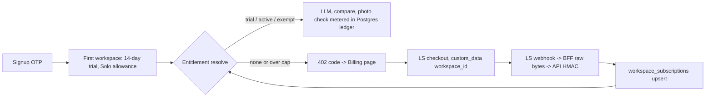

# Lemon Squeezy billing — program plan (S3 core → S4 metering → S5 launch)

Docs loaded: planning.md, plan-template.md (via discovery agents; re-read verbatim at each slice start)
Session model: Opus 5.5 (`claude-opus-5-5`). Every phase: Opus tier, high reasoning → no switch stops.

```
Task Classification:
- Intent: NEW_FEATURE
- Workflow: Feature Plan (docs/ai/prompts/feature-plan.md)
- Task Size: Deep (billing, schema, webhooks, rate limits/token budgets, external integration)
- Domain: Billing/Payments/Plan Upgrades (TODO rows in module-ownership-map) + Cross-cutting limits + Procurement + Vision Matching + Marketing/Landing + Settings
- Risk: Deep — risk-register "Landing Pricing Copy" (launch blocker), "Legal Pages Accuracy", Billing rows
- Contract Areas: new /workspaces/:workspaceId/billing* API, public webhook, packages/types billing.ts, 402 error body gains `code`, migrations 0036/0037
- Next Action: owner approves this program plan → S3 worktree
```

## Context

LS account approved (store `Tyvera` #394926, test mode, zero products). Landing + Terms already sell Solo $29 / Team $69 per buyer / 14-day trial, but no billing code exists: `workspaces` has no plan cols, token usage is Redis-only + fail-open (`apps/api/src/limits/usage.service.ts:50-57`), comparisons aren't counted. Risk register forbids first charge until metering enforces the quotas. Goal: people can start a trial, subscribe via LS, and the app enforces what the pricing page says.

### Owner decisions (2026-10-08)
1. **Over quota = hard cap + upgrade prompt.** No overage billing. Landing/Terms drop "Extra lines at $0.04/$0.03".
2. **Trial = what landing claims**: "Start free trial" → signup → "Check one purchase order tonight", "14-day free trial", no checkout first → **app-side trial, no card**, starts when OTP signup auto-creates the first workspace (`auth.service.ts:114-139`). Only that first workspace gets a trial; extra `POST /workspaces` workspaces must subscribe (blocks trial farming). Trial allowance = Solo quotas.
3. **Existing prod workspaces**: per-workspace `billing_exempt` flag, set by hand (SQL runbook). Others paywall once enforcement flips.
4. **Team seats scale pooled quota only**; member count not enforced.
5. **AI spend capped in dollars, not tokens** (token prices differ 66× per model). Monthly AI cost cap: trial $4, Solo $6, Team $15 × seats → worst-case margin ≥70% at unchanged prices. Full advertised quotas cost $3.24 (Solo) / $11 per Team buyer, so caps never block what pricing promises.
6. **Chat models `gpt-4-turbo` → `gpt-4o`**: `DEFAULT_MODEL` (`packages/ai/src/chains/models.ts:27`), `OPENAI_CHAT_MODEL` / `OPENAI_ANSWER_MODEL` (`.env.example:66-67`); covers `answer`, `sql`, `refine`, `faq` (fall back to chat model). 4× cheaper. RAG change → RAGAS eval before/after is the gate; VPS `.env` updated by owner.

Margin math (OpenAI standard tier, verified 2026-10-08 at developers.openai.com/api/docs/pricing: gpt-4o $2.50/$10, gpt-4o-mini $0.15/$0.60, gpt-4-turbo $10/$30 per 1M; LS 5% + $0.50 + 0.5% sub + 1.5% intl):
| Plan | Price | LS fee | AI cap | Worst-case margin |
|---|---|---|---|---|
| Trial | $0 | — | $4 | −$4 per signup, one per email |
| Solo | $29 | $2.53 | $6 | 70.6% |
| Team | $69/buyer | ~$5.33 | $15/buyer | ~70.5% |

### Key constraints found
- Prod Caddy → `web:3000` only (`docker/Caddyfile:7`); API unreachable publicly → webhook enters via a raw-body BFF route. `proxyJson` re-serializes JSON (`apps/web/src/lib/http/auth-proxy.ts:29`) → would break HMAC; new forwarder sends bytes untouched.
- Nest has no `rawBody` (`apps/api/src/main.ts:7`); global `ThrottlerGuard` (`app.module.ts:69`) → webhook needs `@SkipThrottle`.
- All LLM calls already funnel through `UsageService.metered` (`usage.service.ts:64-74`) and processors treat 402 as final (`catalog-parse.processor.ts:174`, `procurement-parse.processor.ts:78`, …) → one gate point for entitlement.
- LS usage-based billing can't mix per-seat + metered (billed in arrears, $0 checkout) → confirms decision 1.
- No new npm dep: native `fetch` + `node:crypto` (`timingSafeEqual` precedent `auth.service.ts:302`).

## Design

### Entitlement (one function decides everything)
`EntitlementService.resolve(workspaceId)` → `{ state, plan, seats, period, quotas, used }`
- `exempt` (`workspaces.billing_exempt`) → unlimited lines/photos, AI cap $25 runaway guard.
- `subscribed`: LS status `active` | `past_due` (LS retrying card) | `cancelled` while `now < ends_at` → plan quotas × seats.
- `trialing`: `now < workspaces.trial_ends_at` → Solo quotas, window = trial start..end.
- `none` → every LLM/comparison/photo path refused `402 { code: 'SUBSCRIPTION_REQUIRED' }`; reads/exports stay open (customer keeps their data).
- Period for paid plans = UTC calendar month (matches existing `usage:tok:{ws}:{YYYYMM}` and "/ month" copy).
- `BILLING_ENFORCEMENT=on|off` env, **default off** → code ships dark (metering records, nothing refused). Flip after S5. Kill switch = rollback lever (precedent: vision kill switch, PR #38).

### Plans (constants in `apps/api/src/billing/plans.ts`, mirror landing)
| Plan | LS variant env | Lines/mo | Photo checks/mo | AI cost cap/mo (env-overridable) |
|---|---|---|---|---|
| trial | — | 400 | 100 | $4 `BILLING_AI_CAP_TRIAL_USD` |
| solo | `LEMONSQUEEZY_VARIANT_SOLO` | 400 | 100 | $6 `BILLING_AI_CAP_SOLO_USD` |
| team | `LEMONSQUEEZY_VARIANT_TEAM` | 2,000 × seats | 300 × seats | $15 × seats `BILLING_AI_CAP_TEAM_SEAT_USD` |
| exempt | — | unlimited | unlimited | $25 `BILLING_AI_CAP_EXEMPT_USD` (runaway guard) |

Cap replaces `MAX_TOKENS_PER_WORKSPACE_MONTH` as the enforced limit (env kept, documented as superseded, read only while `BILLING_ENFORCEMENT=off` so current behaviour is unchanged before the flip).

### Metering (S4) — durable Postgres ledger, fail-closed
- `usage_events(workspace_id, kind matched_line|photo_check|llm_cost, quantity bigint, input_tokens, output_tokens, model, idempotency_key unique, occurred_at)`.
- Matched lines: in `ComparisonService.compare` (`comparison.service.ts:417`), key `cmp:{poId}:{invoiceId}`, quantity = `poLineCount`, `ON CONFLICT DO NOTHING` → re-compare same pair free; refuse `402 QUOTA_EXCEEDED` only when a *new* pair would exceed.
- Photo checks: one per `CatalogMatchService.search` call (`catalog-match.service.ts:56`), checked before fan-out.
- AI cost: `TokenMeter` (`packages/ai/src/tokens.ts:12`) also records `input_tokens` / `output_tokens` per `response_metadata.model_name`; new `packages/ai/src/pricing.ts` price table (gpt-4o, gpt-4o-mini, gpt-4-turbo, text-embedding-3-small) → `meter.costMicroUsd`. Unknown model → priced at the most expensive row (fail-safe, logged warn). `metered` writes `llm_cost` row (quantity = micro-USD, plus tokens for audit) in `finally`; `assertWithinBudget` sums Postgres for the period against the plan cap (replaces Redis fail-open). Error body adds `code: 'AI_BUDGET_EXCEEDED'`; `isBudgetExceeded` (status 402) unchanged.
- Model switch (S4): `DEFAULT_MODEL = 'gpt-4o'`, `.env.example` chat/answer → `gpt-4o`; RAGAS eval run before/after recorded in PR.
- Race safety: check+insert in one tx under `pg_advisory_xact_lock(hashtext(workspace_id))`.
- Index `(workspace_id, kind, occurred_at)`.

### LS integration (S3)
- `LemonSqueezyClient` (`apps/api/src/billing/lemonsqueezy.client.ts`): `fetch` to `LEMONSQUEEZY_API_URL` (default `https://api.lemonsqueezy.com`, stubbed in tests), JSON:API headers, 10s `AbortSignal.timeout`.
- `POST /workspaces/:workspaceId/billing/checkout` (owner) `{ plan: 'solo'|'team', seats?: 1..25 }` → LS `POST /v1/checkouts` with `checkout_data.custom.workspace_id`, `email`, `variant_quantities` (team), `product_options.redirect_url = ${WEB_URL}/workspaces/{id}/billing?checkout=success`, discount codes allowed (LS default). 409 if already subscribed → use portal. Subscribing during trial starts paid immediately (UI says so).
- `POST /workspaces/:workspaceId/billing/portal` (owner) → LS `GET /v1/subscriptions/{id}` → `urls.customer_portal` (plan change, seats, card, cancel, invoices all handled by LS).
- `GET /workspaces/:workspaceId/billing` (member) → `BillingSummary` (state, plan, seats, trial/renew/end dates, quotas, used).
- `POST /billing/webhooks/lemonsqueezy` (public, `@SkipThrottle`, raw body): HMAC-SHA256 hex of raw bytes vs `X-Signature`, `timingSafeEqual`; bad sig → 401. Verify `store_id == LEMONSQUEEZY_STORE_ID`, variant ∈ known. Store every delivery in `billing_events` (`body_sha256` unique → exact retries no-op; `processed_at`, `last_error`). Handles `subscription_created|updated|cancelled|resumed|expired|paused|unpaused|payment_failed|payment_success|payment_recovered` → upsert `workspace_subscriptions` by `ls_subscription_id`; `workspace_id` from `meta.custom_data` (must exist); skip if `attributes.updated_at` older than stored `ls_updated_at`. Processing error → 500 so LS retries; error persisted.
- Nest: `NestFactory.create(AppModule, { rawBody: true })`.

### Schema (S3 migration `0036_*`, S4 `0037_*`) — all additive, nullable/defaulted
- `workspaces`: `+ trial_ends_at timestamptz null`, `+ billing_exempt boolean not null default false`. No backfill (existing → no trial; exempt by hand).
- `workspace_subscriptions` (1:1, unique `workspace_id`, cascade; template `workspaceDigestSettings.ts:9-25`): `ls_subscription_id` unique, `ls_customer_id`, `ls_variant_id`, `plan` enum `billing_plan(solo,team)`, `status` varchar, `seats` int, `renews_at`, `ends_at`, `ls_updated_at`, timestamps.
- `billing_events`: `event_name`, `body_sha256` unique, `payload jsonb`, `received_at`, `processed_at`, `last_error`.
- S4: `usage_events` + enum `usage_kind`.
- Trial set inside `verifyOtp` tx: `trial_ends_at = now() + 14 days`.

### Web
- BFF `apps/web/app/api/webhooks/lemonsqueezy/route.ts`: `request.text()` → forward bytes + `X-Signature` + `X-Event-Name` via new `forwardRaw` helper (`src/lib/http/webhook-proxy.ts`), 1 MB cap, no bearer. `/api/**` already outside `middleware.ts:62` matcher.
- BFF `app/api/workspaces/[id]/billing/{route,checkout/route,portal/route}.ts` via `proxyJson`.
- `src/lib/api/billing.ts` client fns; types in `packages/types/src/billing.ts`.
- Page `app/workspaces/[id]/billing/page.tsx`: status + trial days left, usage meters (lines, photos), Solo/Team cards (team seat stepper), "Subscribe" → LS checkout redirect, "Manage billing" → portal. Owner acts; others read-only. Nav item after Settings (`workspace-nav.tsx:51`). Loading/empty/error states per DESIGN.md tokens.
- Trial/paywall banner in workspace shell (trial ≤ 3 days left, or `none`) linking Billing.

### S5 launch (copy + ops)
- Landing `pricing-plans.tsx`: replace "Extra lines at …" with cap wording; drop stale comment `:6-10`. Terms `:45-55`: drop overage sentence; add "stop at your plan's monthly cap; upgrade or add buyers anytime", trial = Solo allowance, no card. Privacy `:30-56`: add Lemon Squeezy as processor. `legal-facts.ts` `LEGAL_LAST_UPDATED`. `unit-economics.md`: plans table (no overage), AI cost caps + margin table above, chat on gpt-4o, OpenAI price re-verified 2026-10-08.
- `.env.example` + `scripts/check-prod-env.sh` (+ `.spec.sh`): require `LEMONSQUEEZY_API_KEY STORE_ID WEBHOOK_SECRET VARIANT_SOLO VARIANT_TEAM`, explicit `BILLING_ENFORCEMENT`; also `OPENAI_PROCUREMENT_EXTRACTION_MODEL` (unit-economics.md:54).
- Runbook `docs/ops/billing.md`: LS product setup, webhook URL `https://${DOMAIN}/api/webhooks/lemonsqueezy`, test→live switch, `UPDATE workspaces SET billing_exempt = true WHERE id = …`, kill switch.

### LS dashboard work (Brave, test mode, each step confirmed in chat first)
- I can create (with your yes): products **Optra Solo** ($29/mo, no LS trial) and **Optra Team** ($69/mo, quantity allowed), read back variant IDs; webhook entry (URL + events).
- **You do** (secrets — I never type or copy them): create API key, set webhook signing secret, paste both into VPS `/home/deploy/apps/optra/.env`; create discount codes (LS native; checkout accepts them).

## Slices (stacked PRs, docs/ai/handoff.md release flow)
| Slice | Branch | Contents | Personas |
|---|---|---|---|
| S3 | `feat/no-ticket-billing-core` from `origin/main` | migration 0036, LS client, webhook, checkout/portal/summary, entitlement (enforcement off), trial on signup, billing page + banner + BFF | db-architect → contract lock → test-engineer RED → nestjs + nextjs devs → QA fan-out |
| S4 | `feat/no-ticket-billing-metering` from S3 | migration 0037 ledger, matched-line/photo enforcement, dollar AI caps + price table, chat model → gpt-4o (RAGAS gate), 402 codes, UI handling | same |
| S5 | `feat/no-ticket-billing-launch` from S4 | copy, legal, env guard, runbook, docs sync | nextjs dev, ui-ux, code-reviewer |

Go-live (live-mode products + `BILLING_ENFORCEMENT=on`) = separate owner step after S5 deploys.

Each slice: `scripts/new-task-worktree.sh`, re-read planning.md / plan-template.md / execution.md, write `docs/plans/lemon-squeezy-s{3,4,5}-*.md` Layer-2 Old/New blocks from this approved design (no new decisions; any deviation → stop and ask), `bun run tdd:red`, implement, handoff.md gate.

## Risk Matrix
| Risk | Impact | Mitigation |
|---|---|---|
| Forged webhook grants plan | revenue loss | HMAC over raw bytes, timingSafeEqual, store_id + variant allowlist, workspace must exist |
| BFF mutates body → valid hooks rejected | paid users locked out | forward `request.text()` bytes untouched; e2e signs real bytes through BFF |
| Out-of-order / duplicate webhooks | wrong status | `body_sha256` unique + `ls_updated_at` monotonic guard |
| custom_data names another tenant | wrong tenant gets plan | custom_data set server-side from guarded route param; webhook trusts only signed payload |
| Enforcement locks out existing users | churn | ships off; exempt runbook before flip; flip env-only, reversible |
| Ledger race lets quota overshoot | margin | advisory xact lock per workspace |
| Postgres token ledger adds a query per LLM call | latency | indexed sum; LLM call dominates |
| Scheduled insights jobs 402 for `none` workspaces | noisy failed runs | already final-no-retry; recorded in `background_runs` |
| AI spend exceeds plan price | margin | dollar cap per plan from per-model price table; unknown model priced at max |
| OpenAI changes prices | margin drift | price table cites source + date; unit-economics.md recompute rule |
| gpt-4o answers differ from gpt-4-turbo | answer quality | RAGAS before/after in S4 PR; revert = env var only |
| Embeddings not metered (ingest) | small leak | $0.02/1M, documented in unit-economics.md; not capped |

## Backward Compatibility Matrix
| Surface | Before | After | Compatible? |
|---|---|---|---|
| DB | 37 tables | +3 tables, +2 cols defaulted, +2 enums | yes, additive |
| 402 body | `{statusCode, message}` | `+ code` | yes, `isBudgetExceeded` keys on status |
| AI budget | 5M tokens, Redis, fail-open | dollar cap per plan, Postgres, fail-closed | old token limit kept while enforcement off; stricter on Redis outage (intended) |
| Chat model | gpt-4-turbo | gpt-4o | env-only revert (`OPENAI_ANSWER_MODEL`) |
| Existing workspaces | unlimited | unlimited while enforcement off; then exempt or paywall | owner-gated flip |
| Cookies/auth | `mnemra_*` | untouched | yes |
| Rollback | — | `BILLING_ENFORCEMENT=off` + restart api; migrations stay | yes |

## Test Matrix (three layers, error > edge > regression > happy)
- **Unit (Jest, real Postgres)**: `billing/webhook-signature.spec.ts` (bad/missing/length-mismatch sig, good sig); `billing/billing-webhook.service.spec.ts` (unknown store/variant, unknown workspace, duplicate body, stale updated_at, created→cancelled→expired); `billing/entitlement.service.spec.ts` (none, trial expired, past_due, cancelled before/after ends_at, exempt, team seats ×); `billing/billing.service.spec.ts` (409 when subscribed, seat bounds, LS 5xx/timeout); `auth/auth.service.spec.ts` (trial only on first workspace). S4: `packages/ai/src/pricing.spec.ts` + `tokens.spec.ts` (unknown model → max price, input/output split, gpt-4o math), `packages/ai/src/chains/models.spec.ts` (default gpt-4o), `limits/usage.service.spec.ts` (over dollar cap → 402 `AI_BUDGET_EXCEEDED`, enforcement off keeps token limit), `procurement/comparison.service.spec.ts` (same pair twice → counted once; new pair over cap → 402 `QUOTA_EXCEEDED`), `catalog/catalog-match.service.spec.ts` (over cap → refused before any LLM call), lock concurrency case.
- **API e2e** `apps/api/test/billing.e2e-spec.ts` (`rawBody: true` + `configureApp`): 401 bad sig, signed `subscription_created` → row, member → 403 checkout, other workspace id → 403, checkout via LS stub, summary shape. S4 cases in `procurement.e2e-spec.ts` / `catalog.e2e-spec.ts` with enforcement on.
- **Playwright** `apps/e2e/tests/billing.spec.ts`: trial banner after signup, meters, Subscribe → stub checkout URL, signed webhook through BFF flips page to Active, member read-only, paywall after trial expiry. LS API stubbed like the OpenAI stub (:4010 pattern).
- **Web Vitest**: `webhook-proxy.spec.ts` (bytes identical, size cap, headers), billing page spec.

## Verification
1. `bun run test` (api, web), `bun run test:e2e` (api), `bun run e2e`, `bun run lint`, `bun run type-check`, `sh scripts/check-test-layers.sh origin/main`, `sh scripts/check-prod-env.spec.sh`.
2. Real LS test-mode round trip on prod (test store, `BILLING_ENFORCEMENT=off`): test-card checkout → webhook lands → billing page shows Active. Local cannot receive LS webhooks (no public URL).
3. Brave QA of billing page (`/design-review`), `/qa`, `/review`; `/canary` after each deploy.

## Docs sync (same PRs)
`docs/ai/contracts/api-contracts.md` (4 endpoints), `db-contracts.md` (3+1 tables), `module-ownership-map.md` Billing rows, `risk-register.md` Landing Pricing Copy → resolved at S5, `repository-map.md`, `testing-strategy.md` inventory, `.env.example`, `learnings.md`, graphify refresh.


