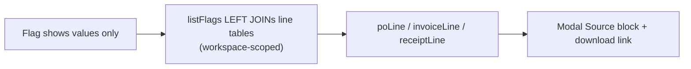

## S2 Discrepancy citations: show where each side of a flag came from

Task metadata
- Classification: Feature, Deep (discrepancy verdicts, tenant isolation). Docs loaded: `planning.md, plan-template.md`
- No schema or migration change. Additive API change only.
- Plain English: a flag says "price differs". Reviewer now sees "PO row 9 / invoice sheet Orders, row 9" and can download the original file. Like a footnote under each claim.

### Verified facts
- Web has its own `DiscrepancyFlag` type (`apps/web/src/lib/api/procurement.ts:76`); `apps/web` does not import `@repo/types`. Web type gets the same three fields, kept equal by the spec.
- Contract: `packages/types/src/procurement.ts` (`DiscrepancyLineCitation`, `DiscrepancyFlagCitations`), exported from `index.ts`; shape in `docs/ai/contracts/api-contracts.md` row "List Discrepancy Flags".
- Columns: `po_line_items.purchase_order_id`, `invoice_line_items.invoice_id`, `goods_receipt_line_items.goods_receipt_id`; all three have `workspace_id`, `line_number`, `source_row`, `source_sheet`. `extractionConfidence` (numeric) exists on PO and invoice lines only.
- Goods receipt decision: INCLUDE `receiptLine` (same shape, confidence always null). Reason: three-way flags (`short_receipt`, `invoice_exceeds_received`) cite the receipt; leaving it out makes the evidence one-sided. Cost is one more LEFT JOIN.
- Download: `downloadProcurementDocument(workspaceId, kind, docId)` in `apps/web/src/lib/api/procurement.ts:172` -> BFF `.../procurement/{purchase-orders|invoices|goods-receipts}/[docId]/download/route.ts` (exist).
- The modal receives `flag` as a prop from the discrepancies page list data (no separate fetch), so the new fields flow through for free.
- Discrepancies page/table: out of scope (modal only).

### Acceptance criteria
1. Each item of `GET /workspaces/:id/procurement/discrepancies` has `poLine`, `invoiceLine`, `receiptLine`, each an object `{lineNumber, sourceRow, sourceSheet, extractionConfidence, documentId}` or `null`.
2. For a CSV-sourced flag: `sourceRow` is a number, `sourceSheet` null, `extractionConfidence` null; `documentId` equals the flag's `purchaseOrderId` (PO side) / `invoiceId` (invoice side).
3. For an XLSX flag, `sourceSheet` equals the sheet name.
4. For a PDF flag, `extractionConfidence` is a JS number (not a string), `sourceRow` and `sourceSheet` null.
5. A flag with null `poLineItemId` / `invoiceLineItemId` / `goodsReceiptLineItemId` (`currency_mismatch`, absent side, deleted line) gets `null` for that side; the request still returns 200.
6. A flag whose line id points to a row of another workspace gets `null` (join is constrained by `workspaceId`); no foreign data leaks.
7. Row count, ordering (`created_at, id`), `page/pageSize/total/totalPages` and `counts` are identical to before for the same data (join cannot duplicate rows).
8. No page number appears in API or UI.
9. Modal shows a "Source" block per side present: CSV `PO row 9`; XLSX `PO sheet Orders, row 9`; PDF `PO line 7 · read from PDF, 93% confidence`; null `sourceRow` and no confidence -> `PO line N`; all null -> `PO line unknown`/omitted side. Same for `Invoice`, `Receipt`.
10. Confidence formatting: `Math.round(c*100)%`; 0.925 -> 93%; 1 -> 100%.
11. Each Source side has a download control calling `downloadProcurementDocument` with kind `purchase-orders|invoices|goods-receipts` and `citation.documentId`.
12. `bun run type-check` and `bun run lint` pass; web type equals `DiscrepancyFlagCitations`.

### Files (one owner each)
- `apps/api/src/procurement/comparison.service.ts` (nestjs-backend-dev): `listFlags` select flag columns + 3 aliased LEFT JOINs (`alias()` from drizzle) each `and(eq(line.id, flag.xLineItemId), eq(line.workspaceId, flag.workspaceId))`; map to `{...flag, poLine, invoiceLine, receiptLine}`; `Number()` the confidence; the `counts` query untouched.
- `apps/web/src/lib/api/procurement.ts` (nextjs-frontend-dev): import-free local types `DiscrepancyLineCitation`, add three fields to `DiscrepancyFlag`.
- `apps/web/src/components/procurement/discrepancy-review-modal.tsx` (nextjs-frontend-dev): Source block + `formatCitation` helper inline.
- Tests (test-engineer): `apps/api/src/procurement/comparison.service.spec.ts`, `apps/api/test/procurement.e2e-spec.ts`, `apps/web/src/components/procurement/discrepancy-review-modal.spec.tsx`, `apps/e2e/tests/procurement.spec.ts`, new fixture `apps/e2e/fixtures/invoice-mismatch.csv` (same header as `po.csv`, A1 unit price 6.00 instead of 5.00, B2 unchanged).
- Already locked by PM: `packages/types/src/procurement.ts`, `packages/types/src/index.ts`, `docs/ai/contracts/api-contracts.md`.
- Docs at handoff: `docs/ai/file-index/repository-map.md` only if a new symbol is significant.

### Test matrix (order error: > edge: > regression: > happy:)
Unit, `comparison.service.spec.ts`
- error: line id of another workspace -> citation null, no foreign documentId.
- edge: all three line ids null -> three nulls.
- edge: line row deleted (id set null) -> null.
- edge: XLSX sheet name returned; PDF numeric string `'0.93'` -> `0.93` number.
- regression: with joins, `total`, `counts`, page order unchanged; no duplicate rows.
- happy: CSV flag returns `sourceRow`, `documentId` = purchaseOrderId/invoiceId.

API e2e, `apps/api/test/procurement.e2e-spec.ts` (extend the upload/compare test near line 278)
- error: workspace B member lists B discrepancies and never sees A's documentId; a flag in B pointing at an A line id (inserted directly) yields `poLine: null`.
- edge: `currency_mismatch` or `missing_on_*` flag has null for the absent side.
- regression: `counts`/`total` equal previous behavior.
- happy: CSV compare -> `poLine.sourceRow` number, `documentId` equals `purchaseOrderId`; PDF seam path -> numeric `extractionConfidence`.

Web Vitest, `discrepancy-review-modal.spec.tsx`
- error: download rejects -> toast, no crash.
- edge: null sourceRow, no confidence -> `PO line N`; all citations null -> no Source block.
- edge: XLSX -> `PO sheet Orders, row 9`; PDF 0.925 -> `PO line 7 · read from PDF, 93% confidence`.
- regression: existing modal cases unchanged; no "page" text anywhere.
- happy: CSV -> `PO row 9`; click download calls `downloadProcurementDocument(ws, 'purchase-orders', poDocId)`.

Playwright, `apps/e2e/tests/procurement.spec.ts` (new test after the receipt test)
- happy: upload `po.csv` + `invoice-mismatch.csv` (linked), compare, open the price flag review -> `PO row 2` and `Invoice row 2` visible (header row is 1; confirm the real number from the parser at RED time), download link returns the file.
- error: not required beyond existing download-error coverage; state `Test-Layers-Skip` not needed.

### Risks
- Join duplication: PK joins give <=1 row each; asserted by regression test.
- UNVERIFIED: whether the parser stores `sourceRow` 1-based including header (Playwright expects value read at RED time, not assumed).
- No Co-Authored-By trailer on this commit per instruction.
