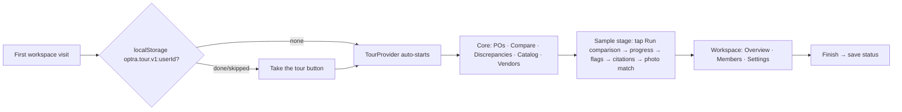

## Workspace onboarding tour (react-joyride)

TL;DR: guided, interactive tour of the authenticated app.
- **Core part (emphasis):** Purchase Orders → compare → Discrepancies → Catalog Matches → Vendors.
- **Later part:** Overview, Members, Settings.
- **Sample stage:** clearly labelled, built-in sample data. The user taps "Run comparison" and watches the app's existing progress animations produce PO / invoice / goods-receipt discrepancies with citations. No upload, no DB writes.
- **Start:** auto-starts on first visit, can be replayed from the nav, and finish/skip is remembered per user in the browser.

### Context
New users land in an empty workspace and never see what a populated comparison looks like. They should learn the core matching loop before uploading anything: vendor → catalog → PO → invoice/GRN → compare → discrepancies → catalog matches.

Owner chose:
- browser-only persistence
- a sample stage owned by the tour
- mobile adapted, not dropped
- auto-start on first visit + replay

### Flowchart (high-level, SVG)


### Task metadata
- Task Classification:
  - Intent: NEW_FEATURE
  - Workflow: Feature Plan (`docs/ai/prompts/feature-plan.md`)
  - Task Size: Standard
  - Domain: apps/web shell + procurement UI. UNMAPPED DOMAIN "Onboarding Tour"; row added in Phase 3.
  - Risk: Standard. Client-only: no API, DB, auth or middleware change. Adds one dependency.
  - Contract Areas: none. Sample data is typed against the existing `DiscrepancyFlag` / `CatalogMatch` in `apps/web/src/lib/api/*`.
  - Next Action: approval → worktree → RED
- Docs loaded: planning.md, plan-template.md
- Claims reversed while investigating:
  - Local `main` (fd21b75) is stale. This plan is against `origin/main` a763006, which includes the merged PR #22 redesign.
  - There is no PO detail route; compare deep-links to Discrepancies.
  - `DiscrepancyReviewModal` fetches API data, so it is not reused. The sample stage composes the same `@repo/ui` primitives instead.
- Detected running model: Opus 5.5 (`claude-opus-5-5`)
- Recommended model: `opus`, high; confidence high. Fallback: `sonnet`, high.
- Minimum capability: multi-file React/Next client work + Playwright.
- Branch: `feat/no-ticket-onboarding-tour` from `origin/main`, created with `scripts/new-task-worktree.sh feat onboarding-tour origin/main`.
- Release path: one PR → `main`, merged with "Create a merge commit" → `CI and Deploy`.
- Required skills: `/qa`, `/review`, `/design-review`.
- Execution preflight:
  1. `git fetch origin`
  2. Create the worktree.
  3. `bun install`
  4. Write `.claude/.plan-ack` `{"size":"standard","plan":"approved","matrices":"present"}`, only after real approval.

### New dependency (needs approval)
`react-joyride@^3.2.0`
- **Licence and compatibility:** MIT. Peers React 16.8–19, so it fits our React 18.3. SSR-safe. Built-in focus trap, keyboard navigation and ARIA.
- **Transitive deps:** about 10, including `@floating-ui/react-dom`, `scroll` and `use-sync-external-store`.
- **Why:** it gives us the spotlight, positioning, focus trap, async `before` hooks (change route, then wait for the target) and controlled `stepIndex`. Building that by hand would be a large component to maintain.
- **Bundle:** loaded via `next/dynamic` `{ssr:false}` on workspace routes only. The landing and auth pages never download it.

### Layer 1 — human summary
- **Moving between pages.** Each page step first navigates there (`router.push`), then waits until the target element exists. Pages render skeletons first, so this wait is needed.
- **Sample stage.** A full-screen overlay with a permanent **"Sample data — not your workspace"** badge.
  - Built only from real UI pieces: `Badge`, `Table`, `MetricTile`, `DefinitionRow`, `StatStrip`, `PhotoCompare`, `ConfidenceMeter`, `SkeletonRows`, `.skeleton-sweep`, `Badge pulse`.
  - It looks exactly like the real thing and never calls the API.
- **Interactive steps.** The tooltip hides "Next" and tells the user to tap the highlighted control: "Tap Run comparison", "Tap the price flag", "Tap Verify match". The tour advances when they tap it.
- **Reduced motion.** When `prefers-reduced-motion` is set, scripted progress jumps straight to the final state.
- **Fallbacks.**
  - Steps that need owner/admin controls (upload, add vendor) become centered explanations when the control isn't rendered, e.g. for a member.
  - A step whose target never appears is skipped, never stuck.
  - Hidden support surfaces are never targeted.

### Layer 2 — execution spec

Tour script. Story: `PO-4417` / `INV-8812` / `GRN-2203`, vendor "Northwind Fasteners".
1. **Welcome** (center). What Optra does, about 3 minutes, Skip available.
2. **Purchase Orders nav** → `/procurement`. The PO / Invoices / Goods receipts tabs are the three documents being matched.
3. **Upload button** (owner/admin; otherwise center). Explains the upload flow; nothing is uploaded.
4. **Compare panel.** Explains steps 1–2–3.
5. **Sample stage opens.**
   - Three doc cards go from Processing (pulse) to Ready.
   - **Tap "Run comparison"** → `CompareStep` 1→2→3 animate → `SkeletonRows` sweep → results table with 3 rows: price over agreed (red), quantity short-received (amber), matched (teal).
6. **Tap the price flag** → sample review detail.
   - Ordered / Received / Billed `MetricTile`s, with the price delta from `formatDelta`.
   - Citations via `DefinitionRow`: PO line row 4 · invoice p.1 line 3 · receipt line 2.
   - Message: "every verdict has a citation".
7. **Sample photo match.** `PhotoCompare` showing `DEMO_CATALOG_PHOTO`. **Tap "Verify match"** → `ConfidenceMeter` fills → Match badge. The stage closes.
8. **Discrepancies nav.** `StatStrip`, status `SegmentedControl`, Review / Dismiss.
9. **Catalog Matches nav.** Search vs verify actions, scope chip.
10. **Vendors nav.** Add vendor. The vendor detail page holds catalogs (upload / scrape) and price history.
11. **Workspace chapter.** Overview activity feed, Members invite, Settings (name, weekly digest).
12. **Finish** (center). "Replay anytime from Take the tour".

Mobile (<1024px):
- Nav steps target `MobileTabBar` items (Overview / Purchase Orders / Discrepancies).
- Catalog, Vendors, Members and Settings steps navigate directly and use a `placement:'center'` fallback. The drawer is not opened.
- Header actions move to the top of `<main>`, but the `data-tour` attribute is on the same element, so the selectors still match.

#### Phase 1 — RED (`opus`, high)
`test-engineer` writes failing specs, then runs `bun run tdd:red`, then commits `test(web): onboarding tour`.

- `apps/web/src/components/tour/tour-storage.spec.ts`
  - error: storage throws → treated as not seen, no crash
  - edge: corrupt JSON or another user's key ignored
  - happy: saves and reads `completed` / `skipped`
- `apps/web/src/components/tour/tour-steps.spec.ts`
  - error: no step targets a support-surfaces-off route
  - edge: member → upload / add-vendor steps become center steps
  - edge: mobile → nav steps target the tab bar or center
  - happy: chapters in order; every `data-tour` target is in `TOUR_ANCHORS`
- `apps/web/src/components/tour/sample-stage.spec.tsx` (jsdom)
  - error: no Next on interactive steps
  - edge: reduced motion → final result shown immediately
  - regression: the "Sample data" label is always rendered
  - happy: Run comparison → progress → 3 flags
  - happy: tap flag → citations
  - happy: Verify → Match
- `apps/web/src/components/tour/tour-provider.spec.tsx` (jsdom)
  - error: `getCurrentUser` rejects → no auto-start, no crash
  - edge: outside `/workspaces/[id]` → renders only children
  - happy: first visit auto-starts
  - happy: finish / skip persists
  - happy: `startTour()` replays
- `apps/e2e/tests/onboarding-tour.spec.ts` (ownerA + memberA; desktop + 390px)
  - error: Skip ends the tour and it does not reappear on reload
  - edge: member sees the center fallback for upload
  - edge: the mobile run completes
  - happy: full run with interactive taps reaches Finish
  - happy: Take the tour replays
  - happy: zero non-GET requests to `/api/workspaces/*` while the sample stage is open
- **Other suites:** `apps/e2e/tests/auth.setup.ts` seeds the tour-done key into each saved storage state, so the existing suites are not blocked by auto-start. The new spec clears the key.

#### Phase 2 — Implement (`opus`, high)
`nextjs-frontend-dev` works through these files.

**Dependency**
- `apps/web/package.json` + `bun.lock`: add `react-joyride@^3.2.0`.

**Persistence**
- `apps/web/src/components/tour/tour-storage.ts`
  - key `optra.tour.v1:<userId>`
  - value `{status:'completed'|'skipped', at: ISO string}`
  - every access in try/catch

**Anchors**
- `apps/web/src/components/tour/tour-anchors.ts`
  - `TOUR_ANCHORS` const map and `tourAttr(id)` → `{ 'data-tour': id }`
  - The single registry; the spec checks every step against it.

**Steps**
- `apps/web/src/components/tour/tour-steps.ts`
  - `buildTourSteps({ workspaceId, canManage, isDesktop, navigate })` → `Step[]`
  - `before` hooks call `navigate`, then resolve once the target exists
  - `targetWaitTimeout` set; `data.interactive` flags tap-to-advance steps

**Tooltip**
- `apps/web/src/components/tour/tour-tooltip.tsx`, used as `tooltipComponent`
  - Calm Utility styling: `bg-card`, `rounded-[20px]`, `border-border-panel`, `shadow-modal`
  - "Step n of N"; solid button `bg-primary-strong`
  - Primary button hidden on interactive steps

**Sample stage**
- `apps/web/src/components/tour/sample-scenario.ts`
  - typed as `DiscrepancyFlag[]` / `CatalogMatch`
  - reuses `DEMO_CATALOG_PHOTO` (`src/lib/landing-demo-docs.ts`)
- `apps/web/src/components/tour/sample-stage.tsx`
  - uses `flagTypeLabel`, `flagTypeTone`, `formatDelta` (`src/components/procurement/flag-type.ts`)
  - scripted timers cleared on unmount
  - `prefersReducedMotion()` (`src/hooks/use-in-view.ts`) checked in `useEffect`

**Provider**
- `apps/web/src/components/tour/tour-provider.tsx` (`'use client'`)
  - `TourContext {startTour, advance, isRunning}`
  - Active only on `/workspaces/[id]/**`; calls `getCurrentUser()` (`src/lib/api/auth.ts`) once
  - Controlled `stepIndex` with `onEvent`:
    - `STATUS.FINISHED` / `SKIPPED` → save
    - a failed step (`target_not_found`) → skip it
  - `zIndex` 60, above Modal `z-50` and drawer `z-40`
  - Joyride via `next/dynamic` `{ssr:false}`
  - Role read from the existing membership fetch pattern (`canManage = role owner|admin`, as in `procurement/page.tsx:222`)
- `apps/web/app/layout.tsx`: `<ToastProvider><TourProvider>{children}</TourProvider></ToastProvider>`

**`data-tour` attributes**
- `src/components/workspace-nav.tsx` (each item) and `src/components/mobile-tab-bar.tsx`
- `procurement/page.tsx`: tabs, upload, compare panel
- `discrepancies/page.tsx`: StatStrip, filter, table
- `catalog-matches/page.tsx`: actions
- `vendors/page.tsx`: Add vendor, table
- `[id]/page.tsx`: activity
- `members/page.tsx`: invite
- `settings/page.tsx`: form
- `@repo/ui` primitives spread `...props`. Where one doesn't, the page wraps it in a `div`; `packages/ui` is not edited.

**Replay button**
- "Take the tour" in the `workspace-nav.tsx` footer (desktop) and in the mobile "More" drawer content (mobile), calling `startTour()`.

#### Phase 3 — Validate, QA, docs (`opus`, high)
**Validation**
- `bun run test` (apps/web), `bun run lint`, `bun run type-check`, `bun run build`
- `bun run e2e`: the full browser suite, to prove no existing suite regressed

**QA fan-out**
- `test-engineer`, `code-reviewer`
- `security-auditor`: no writes, no cross-user leakage
- `accessibility-auditor`: focus trap, Esc, light/dark contrast
- `ui-ux-designer`

**Manual check**
- Brave via claude-in-chrome on the local stack: desktop + 390px, owner + member.

**Docs**
- `docs/ai/module-ownership-map.md` and `docs/ai/risk-register.md`: "Onboarding Tour" rows
- `docs/ai/file-index/repository-map.md`: tour symbols
- `DESIGN.md`: dependency log + tour z-index
- `docs/ai/testing-strategy.md`: inventory
- `learnings.md` entry; graphify refresh

### Test Matrix
| Layer | Required | File | Cases |
|---|---|---|---|
| Unit | required | `apps/web/src/components/tour/*.spec.ts(x)` | storage, steps, stage, provider |
| API e2e | not required: no API route touched | — | — |
| Browser e2e | required: layout + pages change | `apps/e2e/tests/onboarding-tour.spec.ts` | skip, member, mobile, full run, replay, no writes |

### Risk Matrix
| Risk | Likelihood | Impact | Mitigation | Rollback |
|---|---|---|---|---|
| Auto-start blocks the existing Playwright suites | High | High | Seed the tour-done key in `auth.setup.ts` storage state | Revert PR |
| Target not rendered (skeleton, role, viewport) leaves the tour stuck | Med | Med | `before` waits for the target; a failed step is skipped; center fallbacks | Skip is always visible |
| Sample data mistaken for real data | Low | High | Permanent badge; overlay only; regression spec | Revert PR |
| Tour stacks wrongly against Modal or drawer | Med | Low | zIndex 60; the stage closes before real-page steps | CSS fix |
| Bundle weight on non-tour pages | Low | Low | Dynamic import on workspace routes only | — |
| localStorage blocked (private mode) | Med | Low | try/catch → treated as not seen; Skip works for the session | — |

### Backward Compatibility Matrix
| Changed File / Symbol | Used By (outside this feature) | Breaks? | Handling |
|---|---|---|---|
| `app/layout.tsx` `RootLayout` | every route | No | Provider passes `children` through unchanged off workspace routes |
| `workspace-nav.tsx`, `mobile-tab-bar.tsx` | all workspace pages, `shell-alignment.spec.ts` | No | Additive attributes + one footer button; shell spec re-run |
| Workspace page files | e2e suites | No | `data-tour` attributes only |
| `apps/e2e/tests/auth.setup.ts` storage state | all browser suites | No | Additive localStorage entry |

### Validation and acceptance
- A new owner's first workspace visit auto-starts the tour.
- A full run reaches Finish, and the tour does not start again after a reload.
- In the sample stage:
  - tapping Run comparison shows the progress animation, then 3 flags
  - tapping the flag shows citations
  - tapping Verify fills the meter
  - no writes reach the API
- Member and 390px runs complete using the fallbacks.
- Replay works.
- All validation commands pass, and CI `tdd:gate` + `check-test-layers` are green.

### Compatibility, docs and scans
- No API, DB, types, auth, rate-limit or token-budget changes.
- The API e2e layer doesn't apply because no API route changes. If `check-test-layers` still flags it, add a `Test-Layers-Skip` trailer stating that.

---

## Appendix A — Locked module contract (orchestrator, 2026-10-03)

All files live in `apps/web/src/components/tour/`. Tests and implementation must match these signatures exactly.

### `tour-anchors.ts`
```ts
export const TOUR_ANCHORS = {
  navOverview: 'nav-overview', navProcurement: 'nav-procurement', navDiscrepancies: 'nav-discrepancies',
  navCatalogMatches: 'nav-catalog-matches', navVendors: 'nav-vendors', navMembers: 'nav-members', navSettings: 'nav-settings',
  tabOverview: 'tab-overview', tabProcurement: 'tab-procurement', tabDiscrepancies: 'tab-discrepancies',
  procurementTabs: 'procurement-tabs', procurementUpload: 'procurement-upload', procurementUploadMobile: 'procurement-upload-mobile',
  procurementCompare: 'procurement-compare',
  discrepanciesStats: 'discrepancies-stats', discrepanciesFilter: 'discrepancies-filter',
  catalogActions: 'catalog-actions', vendorsAdd: 'vendors-add',
  overviewActivity: 'overview-activity', membersInvite: 'members-invite', settingsWorkspace: 'settings-workspace',
  sampleRun: 'sample-run', sampleFlag: 'sample-flag', sampleCitations: 'sample-citations',
  sampleVerify: 'sample-verify', sampleMatch: 'sample-match', replay: 'tour-replay',
} as const
export type TourAnchorId = (typeof TOUR_ANCHORS)[keyof typeof TOUR_ANCHORS]
export function tourAttr(id: TourAnchorId): { 'data-tour': TourAnchorId }
export function tourSelector(id: TourAnchorId): string // `[data-tour="${id}"]`
// Nav href -> anchor id; used by WorkspaceNav and MobileTabBar.
export function navAnchorFor(href: string, workspaceId: string, kind: 'nav' | 'tab'): TourAnchorId | undefined
```

### `tour-storage.ts`
```ts
export type TourStatus = 'completed' | 'skipped'
export interface TourRecord { status: TourStatus; at: string /* ISO 8601 */ }
export const TOUR_STORAGE_VERSION = 'v1'
export function tourStorageKey(userId: string): string   // `optra.tour.v1:${userId}`
export function readTourRecord(userId: string, storage?: Storage | null): TourRecord | null // never throws
export function writeTourRecord(userId: string, status: TourStatus, now?: Date, storage?: Storage | null): void // never throws
```
`storage` defaults to `window.localStorage` and is resolved inside try/catch. A malformed value, an unknown status or a missing `at` returns `null`.

### `tour-steps.ts`
```ts
import type { Step } from 'react-joyride'
export type TourChapter = 'welcome' | 'core' | 'sample' | 'workspace' | 'finish'
export type SampleSection = 'compare' | 'photo'
export interface TourStepData {
  chapter: TourChapter
  interactive: boolean          // tap-to-advance: tooltip hides the primary button, shows `actionLabel` + `hint`
  canGoBack: boolean            // false from sample-stage through overview-activity (no Back into dead stage states)
  actionLabel?: string          // interactive only: 'Run comparison' | 'Open price flag' | 'Verify match'
  hint?: string                 // interactive only: `${Tap|Click} the highlighted control or use the button`
  loaderLabel?: string          // page steps: `Opening <Destination>…`
  route?: string                // pathname the `before` hook navigates to
  sample?: SampleSection        // the sample stage is open, on this section
}
export type TourStep = Step & { id: string; data: TourStepData }
export interface BuildTourStepsInput {
  workspaceId: string
  canManage: boolean
  isDesktop: boolean
  navigate: (href: string) => void
  waitFor?: (selector: string, timeoutMs: number) => Promise<void> // default polls document
  isActive?: () => boolean      // the default waitFor stops polling once this returns false (tour ended)
}
export function buildTourSteps(input: BuildTourStepsInput): TourStep[]
export const TOUR_TARGET_TIMEOUT_MS = 8000
```
Rules:
- Every step id is unique.
- `target` is a `tourSelector(...)` string, or `'body'` with `placement: 'center'`.
- Chapters run in order: welcome → core → sample → workspace → finish.
- Interactive steps: `sample-run`, `sample-flag`, `sample-verify`. They use `buttons: ['skip']`.
- `!canManage`: the `procurement-upload*` and `vendors-add` steps become `'body'`/center steps that keep the same id and explain that owners/admins upload.
- `!isDesktop`: nav steps target the `tab-*` anchor when one exists; otherwise the step is dropped and the next page step's `before` navigates.
- No step `route` matches `/knowledge-bases|/datasets|/chat|/tickets|/insights` ([support-surfaces-off]).
- Page steps get `before` = navigate to `data.route` (skipped when `location.pathname` already equals it), then `waitFor(target, TOUR_TARGET_TIMEOUT_MS)`.

### `sample-scenario.ts`
```ts
export const SAMPLE_DOCS: { kind: 'purchase_order' | 'invoice' | 'goods_receipt'; number: string; vendor: string; lines: number }[]
// PO-4417, INV-8812, GRN-2203, vendor 'Northwind Fasteners'
export const SAMPLE_FLAGS: DiscrepancyFlag[]   // exactly 3 rows: price_mismatch (red), short_receipt (amber), and the matched line (see below)
export const SAMPLE_CURRENCY = 'USD'
export const SAMPLE_MATCHED_LINE: { sku: string; description: string; ordered: string; billed: string; delta: string }
export const SAMPLE_PHOTO_MATCH: PhotoCompareProps-compatible { query, candidate, verdict }  // candidate.photoSrc = DEMO_CATALOG_PHOTO, verdict.score 0.94, isMatch true
```
`SAMPLE_FLAGS` contains only the two real flags (price, short). The matched line is a separate teal "Matched" row, not a `DiscrepancyFlag`, so the results table renders 3 rows. Every `id`/`workspaceId` is prefixed `sample-` and is never sent to the API.

### `sample-stage.tsx`
```tsx
export interface SampleStageProps {
  section: SampleSection
  reducedMotion?: boolean            // default: prefersReducedMotion() read in useEffect
  onRunComplete: () => void          // results visible
  onFlagOpened: () => void           // review detail visible
  onVerified: () => void             // meter full + Match badge
  onActionsReady?: (actions: { run: () => void; openFlag: () => void; verify: () => void } | null) => void // null on unmount
}
export function SampleStage(props: SampleStageProps): JSX.Element
```
- **Frame.** `role="region"` `aria-label="Sample comparison, sample data"`, plus a permanent `<Badge>` text "Sample data — not your workspace". `fixed inset-0 z-[55]`, page-like layout on `bg-background`.
- **compare section.**
  - Three doc cards (PO / Invoice / Goods receipt), each with `Badge` "Ready".
  - "Run comparison" button (`data-tour=sample-run`). On click: phases `running` (`CompareStep`-style 1→2→3 indicator, `SkeletonRows` with `.skeleton-sweep`, `Badge pulse` "Comparing") → `results`, about 2400 ms total.
  - Then the table: 3 rows, the price row first and clickable (`data-tour=sample-flag`, `aria-label="Review sample price flag"`). `onRunComplete` fires.
  - Flag click shows the review detail (`data-tour=sample-citations`): `MetricTile` Ordered/Received/Billed + `DefinitionRow` citations for poLine/invoiceLine/receiptLine. `onFlagOpened` fires.
- **photo section.**
  - `PhotoCompare` with `isLoading` until verified, plus a "Verify match" button (`data-tour=sample-verify`).
  - On click, a `ConfidenceMeter` animates 0 → 94 (about 1200 ms), then a Match badge appears (`data-tour=sample-match`). `onVerified` fires.
- **Reduced motion.** Each phase transition happens synchronously on click (no timers).
- **Timers.** All timers are cleared on unmount.
- **No network.** Imports nothing from `@/lib/api/*` except types.

### `tour-provider.tsx`
```tsx
export interface TourContextValue {
  startTour: (opener?: HTMLElement | null) => void   // opener gets focus back when the tour ends; else <main>
  isRunning: boolean
  performStageAction: (stepId: string) => void       // 'sample-run' | 'sample-flag' | 'sample-verify'; the tooltip action button calls it
}
export function useTour(): TourContextValue | null   // null outside provider
export function TourProvider({ children }: { children: React.ReactNode }): JSX.Element
```
- **Workspace route.** `pathname` matches `^/workspaces/(?!new$)([^/]+)` (the list `/workspaces` excluded). Elsewhere it renders `children` only.
- **On workspace mount.**
  - `getCurrentUser()` + `listWorkspaces()` (`@/lib/api/workspaces`), once per workspaceId.
  - `canManage` = role owner|admin.
  - `isDesktop` = `matchMedia('(min-width: 1024px)')`.
  - If `readTourRecord(userId)` is null → auto-start at step 0.
  - Either fetch rejecting → no auto-start, no throw.
- **Runner.** Renders `<TourRunner run stepIndex steps onEvent ... />`, where `TourRunner = dynamic(() => import('./tour-runner'), { ssr: false })`. The runner wraps `<Joyride>` with the theme below.
- **onEvent.**
  - `EVENTS.STEP_AFTER` with action next/prev → set the index.
  - `EVENTS.TARGET_NOT_FOUND` / `EVENTS.ERROR` → advance one step (back one when the action was prev).
  - Esc / any `ACTIONS.CLOSE` → end as skipped (never advances).
  - Leaving the workspace route while running → `writeTourRecord(userId,'skipped')`.
  - `STATUS.FINISHED` → `writeTourRecord(userId,'completed')`.
  - `STATUS.SKIPPED` (or close) → `writeTourRecord(userId,'skipped')`.
- **Sample stage.** Renders `<SampleStage section=... />` while `steps[index].data.sample` is set. Its callbacks advance the index by one.
- **Replay.** `startTour()` resets the index to 0 and runs, whatever the stored record says.

### `tour-theme.ts`
```ts
export function resolveTourTheme(root?: HTMLElement): { // default document.documentElement
  overlayColor: string                                   // --foreground at 40% alpha
  spotlight: { stroke: string; strokeWidth: number }     // --primary-strong at 35% alpha, strokeWidth 3
  primaryColor: string
  textColor: string
  backgroundColor: string
}
```
Reads tokens with `getComputedStyle(root).getPropertyValue(...)`. A missing or blank token falls back to `oklch(0.238 0.03 264 / 0.4)` (overlay) and `oklch(0.5 0.09 184 / 0.35)` (ring). Re-read on every call.

### `tour-tooltip.tsx`, `tour-runner.tsx` — design contract (owner, 2026-10-03: the tour must comply with our design system and palette)
Default joyride styling is never shown.
- **Tooltip** (`tooltipComponent={TourTooltip}`) is built from `@repo/ui` + tokens only:
  - panel `w-[min(360px,calc(100vw-32px))] rounded-[20px] border border-border-panel bg-card shadow-modal text-foreground`
  - header `px-[22px] pt-[18px]`: `Eyebrow` with the chapter label ("Core workflow", "Try it", "Your workspace") and "Step n of N" in `font-mono text-[11px] text-ink-muted`
  - title `font-display text-[17px] font-semibold`; body `text-sm text-ink-ghost leading-relaxed`
  - footer `border-t border-border-inner bg-surface-subtle px-[22px] py-3 rounded-b-[20px]`
  - buttons are `@repo/ui` `Button`: Skip = `variant="ghost" size="sm"`; Back = `variant="outline" size="sm"`; primary = default solid (`bg-primary-strong text-primary-strong-foreground`), label "Next" / "Finish"
  - interactive steps replace the primary button with a hint row: `MicroLabel` "Tap the highlighted control" plus a small teal `animate-op-pulse` dot
  - a progress bar (`h-1 rounded-full bg-surface-subtle` track, `bg-primary-strong` fill, width = n/N, `transition-[width] duration-300 ease-[var(--ease-out)]`)
  - entry animation `.fade-slide-in`, removed under reduced motion via the global rule
- **Arrow** (`arrowComponent`): an SVG polygon with `style={{ fill: 'var(--card)', stroke: 'var(--border-panel)' }}`, matching the panel.
- **Beacon:** never shown (`skipBeacon: true` on every step; the controlled tour opens tooltips directly).
- **Loader** (`loaderComponent`): small `bg-card shadow-modal rounded-[12px]` pill containing `Skeleton` and `MicroLabel` "Loading page…".
- **Overlay + spotlight.** Joyride sets these as SVG attributes, where `var()` does not resolve. `tour-theme.ts` therefore exports `resolveTourTheme(root = document.documentElement)`, which reads `--foreground` and `--primary-strong` from `getComputedStyle` and returns:
  - `overlayColor`: `--foreground` at 40% alpha (the same as the Modal scrim `bg-foreground/40`)
  - spotlight ring: `stroke` = `--primary-strong` at 35% alpha, `strokeWidth: 3`, matching `--shadow-focus`
  - fallback when a token is missing: `oklch(0.238 0.03 264 / 0.4)` and `oklch(0.5 0.09 184 / 0.35)`
  - re-resolved on every tour start, so light and dark theme both match
- **Joyride options.**
  - `spotlightRadius: 12`, `spotlightPadding: 6`, `zIndex: 60`, `overlayClickAction: false`, `dismissKeyAction: 'close'`, `scrollOffset: 96` (clears the sticky header)
  - `primaryColor`/`textColor`/`backgroundColor` are set to the resolved tokens as a backstop
  - `locale`: `{ back: 'Back', close: 'Close', last: 'Finish', next: 'Next', skip: 'Skip tour' }`
- **Sample stage** uses only existing tokens and the four tones: teal verified, amber act on it, red money at risk, neutral waiting. Evidence values are set in `font-mono`.
