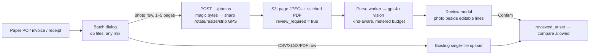

## Photo + batch intake: phone photos of POs, invoices, goods receipts, up to 5 files per upload

TL;DR. Today a buyer can only upload one CSV, XLSX or PDF at a time, and paper documents need scanning first. After this change a buyer can take 1–5 phone photos of a paper PO, invoice or goods receipt. Optra cleans each photo (turns it upright, shrinks it, removes the GPS location) and an AI reads the lines. The buyer checks and corrects what the AI read before the document can be compared. Each upload box also takes up to 5 files at once, in any mix of types; each row is one document with its own header fields. Think of the review step as the cashier reading the receipt back to you before it prints.

Scope: image intake, batch upload and the review gate.

Out of scope:
- AI discrepancy re-verification and email/PDF reports (owner dropped these 2026-10-06)
- AI pre-fill of header fields
- bulk "scan all" compare
- PDF goods receipts
- catalog, dataset and KB uploads
- uploads by the member role

### Flowchart (high-level, SVG)



### Task metadata

- Classification: `NEW_FEATURE` · `Deep` · Procurement (+ Vendor Catalog citation read) · Deep risk (Bull parse processor, schema migration, OpenAI vision, S3 paths, uploads)
- Contract areas:
  - API: 3 photo-upload, 3 lines, 3 page and 3 review routes; additive fields on list + discrepancy citation
  - Database: migration `0036`, additive
  - Permissions: owner/admin write, member read; roles unchanged
  - External integrations: OpenAI vision via `UsageService.metered`
  - Jobs: `procurement-parse-queue` photo branch, auto-compare gating
- Docs loaded: `planning.md, plan-template.md`
- Claims reversed while investigating:
  1. "Stitch photos into a PDF and reuse the scanned-PDF reader." That path renders the PDF back to PNG (`renderPdfToImages`, scale 2): quality loss and double CPU, and the review screen needs page images anyway. **Now:** page JPEGs are stored and sent to vision directly. The stitched PDF is kept only as `storageKey`, so `GET …/download` is unchanged.
  2. "Add a document type field." The type is already fixed by the route, and there are three header tables (`procurement.controller.ts` `uploadPurchaseOrder`/`uploadInvoice`/`uploadGoodsReceipt`). **Now:** a `detected_kind` column stores the AI's guess and a mismatch shows a warning, so there is no second source of truth.
  3. "Bump `EXTRACTOR_VERSION`." The PDF prompt is unchanged, so a bump would re-stamp PDF lines. **Now:** a new `IMAGE_EXTRACTOR_VERSION`.
  4. "`timestamptz` columns." The repo convention is `timestamp` without a zone, in UTC (`apps/api/test/unit-global-setup.ts`). **Now:** `timestamp`.
  5. "Goods-receipt confidence already stored." `goodsReceiptLineItems.ts` has no `extraction_confidence`/`extractor_version`. **Now:** both are added.
- Detected running model: Claude Opus 5.5 (`claude-opus-5-5`)
- Recommended model: `opus`, high reasoning; confidence high. Fallback: `sonnet`, high reasoning (Phase 6 copy only).
- Minimum capability: Opus-class. The work spans a multi-layer contract (DB, AI, API, BFF, web), a transactional review write and LLM prompt design.
- Branch: `feat/no-ticket-photo-batch-intake` from `origin/main`. Local `main` is 20 commits behind, and `page.tsx` changed in those commits.
- Release path: ONE PR into `main`, "Create a merge commit" (memory: no stacked PRs). The phases are commits on that branch.
- Required skills: `/plan-eng-review` (optional, before approval), `/qa`, `/review`, `/design-review`, `/graphify . --update`
- Execution preflight: `git fetch origin`; `scripts/new-task-worktree.sh feat photo-batch-intake origin/main`; in the worktree, `nvm use` and `bun install --frozen-lockfile`.

### Layer 1 — human summary

**What changes**
1. **Photo intake.** A photo row posts 1–5 images to a new `…/photos` endpoint. For each image the server:
   - checks the real file content (magic bytes), not only the name
   - turns it upright using the phone's orientation tag
   - shrinks it so the long edge is at most 2048px
   - re-saves it as JPEG, which drops EXIF data, GPS included

   The server stores the page JPEGs plus one stitched PDF, creates the document with `review_required = true`, and queues parsing. The worker sends the pages to gpt-4o with a prompt for that kind of document: received/accepted/rejected for receipts; quantity, price and total for POs and invoices. It also records what kind of document the AI thinks it saw.
2. **Review gate.** A photo document reaches `done` but cannot be compared until an owner/admin opens the review modal and presses Confirm. The modal shows the photo beside an editable line table where lines can be fixed, added or removed. One transaction then:
   - records `reviewed_at`/`reviewed_by`
   - marks edited lines (`edited_at`/`edited_by`) and keeps the AI's original values in `extracted_values`
   - re-queues auto-compare

   After Confirm the document is read-only, so evidence never changes under a verdict. Citations then read "read from photo, 92% confidence", "edited by reviewer" or "added by reviewer".
3. **Batch upload.** On every tab (PO, invoice, goods receipt) the upload button opens one dialog for up to 5 files in total, in any mix:
   - CSV, XLSX, PDF or photos on the PO and invoice tabs
   - CSV, XLSX or photos on the goods-receipt tab (PDF receipts stay unsupported)

   Each row is one document with its own header fields, and "Copy from first row" fills the shared fields. Photos picked together form one photo row; "Split into separate documents" breaks it up. The browser sends each row as its own request (existing endpoints plus `…/photos`), one after another, with a status per row and a retry for a failed row. There is no batch API.
4. **Public copy** (launch-blocker rule). The landing page, FAQ, privacy page and tour now say photos are accepted and that page images go to OpenAI. `LEGAL_LAST_UPDATED` is bumped.

**Simpler options rejected**
- Read-only review: a handwriting misread would go straight into comparisons, and the only fix would be a re-upload that gets misread the same way.
- A batch API endpoint: needs all-or-nothing rules and a request could pass 300MB.
- A HEIC converter dependency: iOS Safari already converts photos to JPEG when picked (checked in QA). A HEIC file from a Mac gets a clear 400.
- A feature flag: the web can't read the API's env, so a flag would only make a visible button return 400s. Rollback is a revert, and the token budget caps cost.
- Browser-side resizing: an untrusted client could skip it and store GPS data.

**Risk Matrix**

| Risk | Likelihood | Impact | Mitigation | Rollback |
|---|---|---|---|---|
| `sharp` native binary missing in the prod image (bun + linux/amd64, lockfile made on darwin) | Med | High (photo uploads return 500) | Phase 0 runs `docker compose -f docker-compose.prod.yml build api` and `node -e "console.log(require('sharp').versions)"` in `/app/apps/api` before any other code; precedent: `@napi-rs/canvas` in `bun.lock` | Revert PR; nothing else depends on sharp |
| Decompression bomb or huge photo exhausts the 4GB VPS memory | Low | High | `limitInputPixels: 50_000_000`; pages decoded one at a time; `sharp.concurrency(1)` + `sharp.cache(false)` at module load; multer per-file `MAX_UPLOAD_BYTES`; at most 5 files | Revert |
| Vision misreads handwriting → wrong verdicts | High | High | Review gate blocks manual and auto compare until confirmed; low-confidence lines highlighted; edits audited | n/a (by design) |
| Vision call over the 30s timeout on 5 high-detail pages | Med | Med (retry, token cost) | Pages ≤2048px; existing single retry + 3 Bull attempts inside the 5-min job timeout; budget-exceeded is permanent | Re-upload fewer pages |
| Token spend grows | Med | Med | Every call goes through `UsageService.metered` (5M/month/workspace); ~$0.004/page; row added to unit economics | Lower `MAX_TOKENS_PER_WORKSPACE_MONTH` |
| Migration on live tables | Low | High | Additive only: nullable columns + `boolean DEFAULT false NOT NULL` (no table rewrite on PG16); FKs `ON DELETE SET NULL`; run on a seeded DB; backup runs before deploy (`deploy.yml`) | Old code doesn't use the columns; forward-only, leave them in place |
| Two admins confirm the same review | Low | Med | Conditional `UPDATE … WHERE reviewed_at IS NULL … RETURNING`; the loser gets 409 | n/a |
| Another workspace's line id in a review body | Low | Critical | Line ids loaded `WHERE workspace_id AND <doc fk>`; unknown id → 404 + rollback; header scoped by `id AND workspace_id` | n/a |
| Global JSON body limit raised from 100kb to 1mb | Low | Low | Throttler unchanged; needed for a review body of up to 200 lines | Revert the line |
| iOS doesn't convert HEIC when `accept` mixes extensions | Med | Med | Photo picker has its own `<input accept="image/*">`; HEIC gets an explicit 400 message; device check in QA | The message tells the user to export JPEG |
| Public copy claims photo support before it's deployed | Low | High (false claim) | Copy ships in the same PR as the feature | Revert PR |
| libvips is LGPL-3.0 | Low | Low | Dynamically linked prebuilt binary; recorded in the risk register | n/a |

**Backward Compatibility Matrix**

Usage search: Graphify `query "who calls ProcurementDocumentsService upload, listPurchaseOrders, ComparisonService.listFlags, proxyRaw, UploadExceptionFilter"` found no literal call sites, so the search fell back to grep (allowed for literal strings). Phase 7 re-runs it as a gate.

| Changed File / Symbol | Used By (outside this feature) | Breaks? | Handling |
|---|---|---|---|
| New columns on `purchase_orders`/`invoices`/`goods_receipts` | `scripts/seed`; `loadHeader` `db.select()` readers (processor `loadDoc`, compare `loadReady*`); list projections | No | Defaults or nullable; old inserts stay valid; extra columns ignored |
| New columns on line tables | `catalog/vendor-history.service.ts`, `catalog/catalog-match.service.ts` (read PO lines) | No | Affected, NOT modified. They will show unreviewed photo lines, just as they show failed-doc lines today. Flagged as a follow-up |
| `ProcurementDocumentsService.upload` (header insert extracted to `insertHeader`) | Controller only | No | Same behaviour; existing specs stay green |
| `list*` projections (+`sourceKind`, `pageCount`, `reviewRequired`, `reviewedAt`, `detectedKind`) | `apps/web/app/workspaces/[id]/discrepancies/page.tsx:147` | No | Additive fields |
| `ComparisonService.listFlags` citation (+`sourceKind`, `editedAt`; receipt confidence now real) | Web lib + `discrepancy-review-modal.tsx` | No | Additive; modal precedence updated in this PR |
| `ComparisonService.loadReadyPo`/`loadReadyInvoice` + receipts query | `compare()`, auto-compare processor | Behaviour changes for photo docs only | `review_required=false` by default keeps every CSV/XLSX/PDF doc identical (regression tests) |
| `ProcurementCompareService.pairsFor`/`receiptState` | `procurement-compare.processor.ts` | No | Unreviewed docs filtered out or deferred; `isPermanentCompareError` already treats 400 as permanent |
| `@repo/ai` `ExtractedLineItem`, `ProcurementExtractionResult` (optional fields), `invokeAndParse` (new params, defaulting to today's prompt) | `procurement-extraction.service.ts` | No | PDF prompt byte-identical (regression spec) |
| `proxyRaw` forwards `Content-Security-Policy` | Tickets transcript PDF, catalog photo, KB downloads, procurement downloads | No | None of those upstreams set CSP today |
| `UploadExceptionFilter` maps `LIMIT_UNEXPECTED_FILE` | KB documents, datasets, catalog uploads | No | Only fires on that multer code; generic message (`Too many files`) |
| `bootstrap.ts` `configureApp` JSON limit 1mb | Every JSON route | No | Larger bodies accepted; nothing relied on a 413 at 100kb (grep: no spec) |
| `page.tsx`: three header modals → `BatchUploadDialog` | Onboarding tour (`src/components/tour/*` targets the upload buttons' `data-tour` ids) | Possible | Keep the same `data-tour` attributes on the buttons; run `onboarding-tour.spec.ts` in Phase 7 |

### Layer 2 — execution spec

The contract is locked in Phase 2 in one place: `packages/types/src/procurement.ts` + `docs/ai/contracts/api-contracts.md`.

- `{kind}` ∈ `purchase-orders|invoices|goods-receipts`
- All routes: `JwtAuthGuard, WorkspaceMemberGuard`. Writes add `RolesGuard` with `@Roles('owner','admin')`
- Ids use `ParseUUIDPipe`; `n` uses `ParseIntPipe`

| Route | Body / query | 2xx | Errors |
|---|---|---|---|
| `POST /workspaces/:workspaceId/procurement/{kind}/photos` | multipart `files` ×1–5 + the same header DTO as single upload | 201 header row (same shape as single upload) | 400: no files, 6+ files, HEIC, not an image, unreadable, too many pixels · 413: file > `MAX_UPLOAD_MB` · 403: member · 404: header id from another workspace |
| `GET …/{kind}/:docId/lines?page&pageSize` | `OffsetQueryDto` (max 100, house rule) | 200 `{ document: ProcurementReviewDocument, items: ProcurementReviewLine[], page, pageSize, total, totalPages }` | 404: doc missing or in another workspace |
| `GET …/{kind}/:docId/pages/:n` | — | 200 `image/jpeg`, inline, `nosniff`, `Content-Security-Policy: sandbox; default-src 'none'`, `Cache-Control: private, max-age=86400` | 404: not a photo doc, n out of range, or object missing |
| `POST …/{kind}/:docId/review` | `{ lines: ReviewLineInput[] }`, 1–200 lines | 200 `{ id, reviewedAt, rowCount }` | 400: validation, duplicate ids, doc needs no review · 403: member · 404: doc or line not found · 409: already reviewed or still parsing |

New types:

- `ProcurementReviewDocument`: `{ id; name; status; sourceKind; pageCount: number|null; detectedKind: 'purchase_order'|'invoice'|'goods_receipt'|'unknown'|null; reviewRequired: boolean; reviewedAt: string|null; reviewedBy: string|null }`
- `ProcurementReviewLine`: `{ id; lineNumber; sku; description; quantity; unitPrice; lineTotal; uom; quantityReceived?; quantityAccepted?; quantityRejected?; extractionConfidence: number|null; sourceKind; editedAt: string|null; editedBy: string|null }`. Decimals are strings, as in the DB.
- `ReviewLineInput`: `{ id?: string; sku?; description?; quantity?; unitPrice?; lineTotal?; uom?; quantityReceived?; quantityAccepted?; quantityRejected? }`
- `DiscrepancyLineCitation` gains `sourceKind?: string|null; editedAt?: string|null`.

The web app mirrors these types in `apps/web/src/lib/api/procurement.ts`, because it does not import `@repo/types`.

Values:
- Line `sourceKind`: `'image-extraction'` (read from a photo) or `'manual'` (added during review).
- Header `sourceKind`: `'image'`.
- Storage: `storageKey = ${ws}/procurement/${kind}/${uuid}-pages/${base}.pdf`; page n is `${dirname(storageKey)}/${n}.jpg`.

#### Phase 0 — Preflight + `sharp` (`opus`, high)

1. Create the worktree per the metadata. Run `cd apps/api && bun add sharp`. This is the approved new dependency (for EXIF rotate, resize and metadata strip); flag it in the PR body.
2. Run `docker compose -f docker-compose.prod.yml build api`, then `docker run --rm --platform linux/amd64 <image> node -e "console.log(require('/app/apps/api/node_modules/sharp').versions)"`. If it fails, STOP and report: a Dockerfile change only comes into scope after re-approval.

Done: the image prints the libvips version.

#### Phase 1 — Schema + migration `0036` (`opus`, high) — db-architect alone

1. RED: write `packages/db/src/schema/procurement-review-columns.spec.ts` (new). It asserts `getTableColumns()` exposes the columns below with the right defaults and nullability. Cases: `error:` review_required not nullable · `edge:` FK columns nullable · `happy:` all present. Run `bun run tdd:red`.
2. In `purchaseOrders.ts`, `invoices.ts` and `goodsReceipts.ts`, add `boolean, smallint` to the import and import `users`. Old (end of each column object):
   ```ts
       rowCount: integer('row_count'),
       lastError: text('last_error'),
       createdAt: timestamp('created_at').defaultNow().notNull(),
   ```
   New:
   ```ts
       rowCount: integer('row_count'),
       lastError: text('last_error'),
       // Photo intake: AI-read documents wait for a human confirm before compare.
       reviewRequired: boolean('review_required').notNull().default(false),
       reviewedAt: timestamp('reviewed_at'),
       reviewedBy: uuid('reviewed_by').references(() => users.id, { onDelete: 'set null' }),
       detectedKind: varchar('detected_kind', { length: 20 }),
       pageCount: smallint('page_count'),
       createdAt: timestamp('created_at').defaultNow().notNull(),
   ```
3. In `poLineItems.ts` and `invoiceLineItems.ts` (import `users`). Old:
   ```ts
       sourceKind: varchar('source_kind', { length: 20 }).notNull().default('csv'),
       createdAt: timestamp('created_at').defaultNow().notNull(),
   ```
   New:
   ```ts
       sourceKind: varchar('source_kind', { length: 20 }).notNull().default('csv'),
       editedAt: timestamp('edited_at'),
       editedBy: uuid('edited_by').references(() => users.id, { onDelete: 'set null' }),
       // The AI's values, captured on the first reviewer edit (citation evidence).
       extractedValues: jsonb('extracted_values'),
       createdAt: timestamp('created_at').defaultNow().notNull(),
   ```
4. In `goodsReceiptLineItems.ts`, add `jsonb, numeric` to the import and import `users`. Old:
   ```ts
       // Provenance, matching poLineItems minus the two PDF-only columns:
       // extraction_confidence and extractor_version are written only by the PDF
       // path, and PDF goods receipts are deferred in S5 (the extraction chain
       // cannot express received-vs-accepted). Shipping them now would mean two
       // permanently-null columns; they arrive with PDF support, additively.
       sourceSheet: varchar('source_sheet', { length: 200 }),
       sourceRow: integer('source_row'),
       sourceKind: varchar('source_kind', { length: 20 }).notNull().default('csv'),
   ```
   New:
   ```ts
       // Provenance, matching poLineItems. Confidence and version are written by
       // the photo path; PDF goods receipts remain unsupported.
       sourceSheet: varchar('source_sheet', { length: 200 }),
       sourceRow: integer('source_row'),
       extractionConfidence: numeric('extraction_confidence'),
       extractorVersion: varchar('extractor_version', { length: 40 }),
       sourceKind: varchar('source_kind', { length: 20 }).notNull().default('csv'),
       editedAt: timestamp('edited_at'),
       editedBy: uuid('edited_by').references(() => users.id, { onDelete: 'set null' }),
       extractedValues: jsonb('extracted_values'),
   ```
5. Run `cd packages/db && bun run db:generate`, giving `0036_*.sql`: ADD COLUMN only, plus `DO $$ … duplicate_object` FK blocks. Review that it has no DROP, RENAME or UPDATE. Run `bun run db:migrate` on an empty DB AND on the `bun run db:seed` DB.

Done: the spec passes, the migration applies cleanly both times, and `bun run type-check` passes.

#### Phase 2 — Contract lock (`opus`, high) — orchestrator

1. `packages/types/src/procurement.ts`: add the types above. In the `DiscrepancyLineCitation` doc comment, rewrite the line `` * `receiptLine.extractionConfidence` is always null (goods_receipt_line_items has no such column). `` to: `` * `receiptLine.extractionConfidence` is null unless the receipt was read from a photo. ``
2. `docs/ai/contracts/api-contracts.md`: add the four route rows above; the list rows gain the five fields. `docs/ai/contracts/db-contracts.md` procurement rows: add the new columns and the review invariant ("`review_required AND reviewed_at IS NULL` ⇒ never compared; a reviewed doc's lines are immutable").

Done: `bun run type-check` passes.

#### Phase 3 — RED (`opus`, high) — test-engineer

Write every test in the Test Matrix. Run `bun run tdd:red`, then commit `test(procurement): photo intake, review gate, batch upload`. No guarded source changes in this phase.

#### Phase 4 — AI + API (`opus`, high) — nestjs-backend-dev (parallel with Phase 5)

1. `packages/ai/src/chains/procurement-extraction.ts`
   - Old:
     ```ts
     async function invokeAndParse(
       humanMessage: HumanMessage,
       retryDelayMs: number,
       meter?: TokenMeter,
     ): Promise<ProcurementExtractionResult> {
     ```
     New:
     ```ts
     async function invokeAndParse(
       humanMessage: HumanMessage,
       retryDelayMs: number,
       meter?: TokenMeter,
       systemPrompt: string = EXTRACTION_SYSTEM_PROMPT,
       normalize: (parsed: unknown) => ProcurementExtractionResult = normalizeResult,
     ): Promise<ProcurementExtractionResult> {
     ```
     In its body, `llm.invoke([new SystemMessage(EXTRACTION_SYSTEM_PROMPT), humanMessage])` becomes `llm.invoke([new SystemMessage(systemPrompt), humanMessage])`, and `return normalizeResult(parsed)` becomes `return normalize(parsed)`.
   - New exports:
     - `ImagePage { buffer: Buffer; mime: 'image/jpeg'|'image/png'|'image/webp' }`
     - `ProcurementExtractionKind = 'purchase_order'|'invoice'|'goods_receipt'`
     - `DetectedProcurementKind = ProcurementExtractionKind|'unknown'`
     - `IMAGE_EXTRACTOR_VERSION = 'procurement-image-extraction@1'`
     - Optional `uom`, `quantityReceived`, `quantityAccepted` and `quantityRejected` on `ExtractedLineItem`; optional `detectedKind` on `ProcurementExtractionResult`.
   - New `extractLineItemsFromImages(pages, kind, opts: ExtractLineItemsOptions)`:
     - 0 pages or more than 5 → `ProcurementExtractionUnsupportedError`.
     - `imageSystemPrompt(kind)`: a goods receipt asks for `quantityReceived`/`quantityAccepted`/`quantityRejected` and `uom` (null when not stated); a PO or invoice asks for `quantity`/`unitPrice`/`lineTotal`/`uom`. Both ask for a top-level `detectedKind` and say "never guess illegible digits: use null and confidence below 0.5".
     - Human content: `[{type:'text', text: imageInstruction(kind)}, ...pages.map(p => ({type:'image_url', image_url:{url:`data:${p.mime};base64,${p.buffer.toString('base64')}`, detail:'high'}}))]`, passed to `invokeAndParse(…, imageSystemPrompt(kind), normalizeImageResult(kind))`.
     - `normalizeImageResult(kind)` reuses `normalizeItem` and counts goods-receipt quantities in the "row has something" check.
2. `apps/api/src/procurement/procurement-extraction.service.ts`: add `extractFromImages(pages: ImagePage[], kind: ProcurementExtractionKind, workspaceId: string) { return this.usage.metered(workspaceId, (meter) => extractLineItemsFromImages(pages, kind, { meter })) }`. It charges the workspace's monthly token budget.
3. `apps/api/src/procurement/procurement-photo.ts` (new). No existing image helper does this: `catalog/catalog-photo-types.ts` is an allowlist with no decode or normalize. It contains:
   - Constants: `MAX_PHOTO_PAGES = 5`, `MAX_PHOTO_EDGE = 2048`, `MAX_INPUT_PIXELS = 50_000_000`; `sharp.concurrency(1); sharp.cache(false)` at module load.
   - `detectImageType(buf)`: JPEG `FF D8 FF`; PNG `89 50 4E 47`; WebP `RIFF`@0 + `WEBP`@8; HEIC `ftyp`@4 with a brand @8 in {heic, heix, hevc, hevx, heim, heis, mif1, msf1}.
   - `normalizePhoto(buf)`: `sharp(buf, { limitInputPixels: MAX_INPUT_PIXELS, failOn: 'error' }).rotate().resize({ width: 2048, height: 2048, fit: 'inside', withoutEnlargement: true }).jpeg({ quality: 85 }).toBuffer({ resolveWithObject: true })`. No `withMetadata()`, so EXIF and GPS are dropped.
   - `stitchPagesToPdf(pages)`: pdf-lib `PDFDocument.create()`, then `embedJpg`, `addPage([w, h])` and `drawImage` for each page.
   - `photoStorageKey(ws, kind, uuid, name)` and `photoPageKey(storageKey, n)`.
   - `PhotoInputError`, with exactly these messages:
     - `HEIC/HEIF photos are not supported — export as JPEG and upload again`
     - `Photo ${n} is not a JPEG, PNG or WebP image`
     - `Photo ${n} is too large to process`
     - `Photo ${n} could not be read`
4. `procurement-documents.service.ts`
   - Extract the per-kind insert switch inside `upload()` into `private insertHeader(kind, common, header)`. `upload()` calls it, with no behaviour change.
   - New `uploadPhotos(workspaceId, kind, files, header)`, in order:
     1. Check the header belongs to the workspace.
     2. Normalize each file in turn (`PhotoInputError` → 400).
     3. Stitch the PDF.
     4. Save the pages, then the PDF; if any save fails, delete the saved keys (best effort).
     5. `insertHeader({ ...common, sourceKind: 'image', reviewRequired: true, pageCount })`, with the same cleanup if it fails.
     6. `parse.queueDoc` (existing failure path).

     The name is `${basename(first, ext)}.pdf`, after `decodeUploadFilename`.
   - `listPurchaseOrders`/`listInvoices`/`listGoodsReceipts`: after each `lastError: <table>.lastError,`, add `sourceKind`, `pageCount`, `reviewRequired`, `reviewedAt` and `detectedKind` from the same table.
   - `remove()`: when `sourceKind === 'image'`, also delete `photoPageKey(storageKey, 1..pageCount)`.
5. `procurement.controller.ts`
   - Imports: `FilesInterceptor`, `UploadedFiles`, `ParseIntPipe`.
   - `photoFileFilter`:
     - Extension must be `.jpg`, `.jpeg`, `.png` or `.webp`.
     - MIME must be `image/jpeg`, `image/png`, `image/webp` or `application/octet-stream`.
     - `.heic`/`.heif` or `image/heic`/`image/heif` gets the HEIC message.
   - Routes:
     - `{kind}/photos` with `FilesInterceptor('files', MAX_PHOTO_PAGES, { limits: { fileSize: MAX_UPLOAD_BYTES }, fileFilter: photoFileFilter })`; an empty array → 400 `files are required`.
     - `{kind}/:docId/lines`.
     - `{kind}/:docId/pages/:n` with the headers in the contract.
     - `{kind}/:docId/review`.
   - The constructor adds `review: ProcurementReviewService`.
6. `procurement-review.ts` (new): `reviewCleared(cols)` = `or(eq(cols.reviewRequired, false), isNotNull(cols.reviewedAt))`, plus `isReviewPending(row)`.
7. `procurement-review.service.ts` (new) + `dto/review-document.dto.ts` (new). DTO rules: `@ArrayNotEmpty @ArrayMaxSize(200) @ValidateNested({each:true}) @Type(() => ReviewLineDto)`; decimals use `@Matches`; `description @MaxLength(2000)`, `sku @MaxLength(200)`, `uom @MaxLength(20)`. The service has three methods:
   - `listLines`: explicit columns, `workspaceId` filter, `resolveOffsetPage`.
   - `getPage`: `storage.getBuffer`; 404 through `readOrNotFound`.
   - `review`, all in one `db.transaction`:
     1. Conditional header `UPDATE … SET reviewed_at, reviewed_by, updated_at WHERE id AND workspace_id AND review_required AND reviewed_at IS NULL AND status='done' RETURNING id`. If no row comes back, re-read the header and answer 404, 409 `already reviewed`, 409 `still parsing` or 400 `does not need review`.
     2. Load the doc's line ids, scoped by doc and workspace. An unknown id → 404 `Line not found`; a duplicate id → 400.
     3. Update all changed lines in one `UPDATE … FROM (VALUES …)` (no N+1), setting `edited_at`/`edited_by` and `extracted_values = COALESCE(extracted_values, <prior values>)`.
     4. Delete the lines left out of the body.
     5. Insert new lines with `sourceKind: 'manual'`.
     6. Renumber `lineNumber` from 1 to n.
     7. Set the header's `rowCount`.

     After commit, `compareService.enqueueForDocument(kind, docId).catch(warn)`.
   - Register the service as a provider in `procurement.module.ts`.
8. `procurement-parse.processor.ts`: before `const extension = extname(doc.name).toLowerCase()`, add an `if (doc.sourceKind === 'image')` branch that:
   - requires `pageCount ≥ 1`, else throws `ProcurementParseInputError`
   - loads each page with `storage.getBuffer(photoPageKey(...))`
   - calls `extraction.extractFromImages(pages, kind, workspaceId)`
   - maps rows with `extractorVersion: IMAGE_EXTRACTOR_VERSION` and `sourceKind: 'image-extraction'`
   - passes `detectedKind` into the `done` patch

   Separately, the goods-receipt insert map adds `extractionConfidence` and `extractorVersion`.
9. `comparison.service.ts`
   - `loadReadyPo`: after `throw new BadRequestException('Purchase order has not finished parsing yet')`, add `if (isReviewPending(po)) throw new BadRequestException('Purchase order needs review before it can be compared')`.
   - `loadReadyInvoice`: the same, after `'Invoice has not finished parsing yet'`, with `'Invoice needs review before it can be compared'`.
   - Receipts query: select `reviewRequired` and `reviewedAt`. If any linked receipt is pending review → 400 `A linked goods receipt needs review before comparing`.
   - `listFlags`: the po/inv/rcpt selects add `sourceKind` and `editedAt`, and rcpt adds `extractionConfidence`. `receiptLine.extractionConfidence: null,` becomes `toConfidence(r.extractionConfidence)`.
10. `procurement-compare.service.ts`
    - `pairsFor`: the PO and invoice `where` clauses add `reviewCleared(...)`, and the `invoice.status !== 'done'` / `po.status !== 'done'` early returns also return `[]` when `isReviewPending`.
    - `receiptState`: select the review columns; defer when any receipt is pending review.
11. Shared and config
    - `common/http/upload-exception.filter.ts`: map multer `LIMIT_UNEXPECTED_FILE` → 400 `Too many files`.
    - `bootstrap.ts` `configureApp`: `app.useBodyParser('json', { limit: '1mb' })`.
    - No new env vars.

Done: the API unit and e2e matrix rows pass.

#### Phase 5 — BFF + web (`opus`, high) — nextjs-frontend-dev (parallel with Phase 4)

1. `apps/web/src/lib/api/client.ts`: `uploadFiles(path, files, fields)` appends `'files'` once per file and keeps the same 401-refresh retry as `uploadFile`.
2. `apps/web/src/lib/api/procurement.ts`:
   - the mirrored types
   - the five optional fields on `ProcurementDoc`
   - `uploadPurchaseOrderPhotos`, `uploadInvoicePhotos`, `uploadGoodsReceiptPhotos`
   - `listDocumentLines`, `reviewDocument`, `documentPageUrl(ws, kind, docId, n)`
3. `apps/web/src/lib/http/auth-proxy.ts` `proxyRaw`: add `'Content-Security-Policy',` to the forwarded headers after `'X-Content-Type-Options',`.
4. 12 BFF routes, one file per backend path (repo rule; a `[kind]` folder can't sit beside the static ones). Each copies the `…/[docId]/download/route.ts` pattern:
   - `app/api/workspaces/[id]/procurement/{purchase-orders,invoices,goods-receipts}/photos/route.ts` (`proxyMultipart`)
   - `…/[docId]/lines/route.ts` (`proxyJson` GET, forwarding the query)
   - `…/[docId]/pages/[n]/route.ts` (`proxyRaw`)
   - `…/[docId]/review/route.ts` (`proxyJson` POST)
5. `src/components/procurement/batch-upload-rows.ts` (new, pure logic). Nothing reusable exists: `page.tsx` holds three single-file modals.
   - `classifyFile` by extension (csv/xlsx/pdf/photo); a PDF on the goods-receipt tab is refused.
   - `addFiles(rows, files, kind)` enforces 5 files in total; photos picked together become one photo row.
   - `splitPhotoRow`.
   - `copyFromFirstRow` copies vendor, currency, PO link and date, never the document number.
   - `rowErrors`.
6. `src/components/procurement/batch-upload-dialog.tsx` (new), in a `Modal size="xl"`:
   - One row per document, with the same header inputs and validation as today's three modals; `Select` for vendor and PO.
   - The vendor/PO empty-state prerequisites move over from the old modals.
   - Rows submit one after another; each row shows `ready → uploading → done | error`, with the API message and a Retry on failure.
   - Two pickers: "Add files" (`accept` is that tab's CSV/XLSX, plus PDF where allowed) and "Add photos" (`accept="image/*"`, `multiple`, no `capture`).
   - Closing refreshes the list.
7. `src/components/procurement/document-review-modal.tsx` (new), in a `Modal size="full"`:
   - Left: the page image ``, with page tabs.
   - Right: an editable `Table` of `Input`s, with add and remove; lines with `extractionConfidence < 0.6` are tinted with the warning token.
   - A `StatusBanner` when `detectedKind` differs from the tab and isn't `unknown`.
   - Confirm (owner/admin) calls `reviewDocument`; members get a read-only view.
   - Loads every page of `listDocumentLines` (at most 200 lines, so at most 2 calls).
   - States: `SkeletonRows` while loading; `EmptyState` "No lines were read — add them or re-upload"; a toast on error and on success.
8. `app/workspaces/[id]/procurement/page.tsx`
   - Remove the three header modals, their held-file state and the `handle*FileSelected`/`submit*Upload` handlers. The upload buttons open `BatchUploadDialog` and keep their `data-tour` attributes.
   - The status cell shows a "Needs review" `Badge` and a Review button when `reviewRequired && !reviewedAt && status === 'done'`.
   - `donePurchaseOrders`/`doneInvoices` also leave out docs pending review.
   - `PANEL_COPY.emptyDescription` mentions photos.
9. `discrepancy-review-modal.tsx` `citationText`, in order of precedence:
   1. `editedAt` → `· edited by reviewer`
   2. `sourceKind === 'manual'` → `· added by reviewer`
   3. `sourceKind === 'image-extraction'` → `· read from photo, N% confidence`
   4. otherwise the existing PDF text, unchanged

Done: the web unit tests pass, and so do `bun run type-check` and `bun run lint`.

#### Phase 6 — Public copy (`opus`, high) — nextjs-frontend-dev

Exact edits, old text → new text:

| File | Old | New |
|---|---|---|
| `files-trust.tsx` | `['PDF', 'Scanned PDF', 'CSV', 'XLSX']` | `['PDF', 'Scanned PDF', 'Photo', 'CSV', 'XLSX']` |
| `metrics-strip.tsx` | `'PDF · CSV · XLSX'` | `'PDF · CSV · XLSX · Photo'` (and the line-1 comment) |
| `hero.tsx` | `reads the PDFs, CSVs and spreadsheets you already have` | `reads the PDFs, spreadsheets and phone photos you already have` |
| `workflow-steps.tsx` | `PDF, scan, or spreadsheet` | `PDF, scan, spreadsheet or phone photo` |
| `app/page.tsx` FAQ | `'Vendor catalogs with product photos, purchase orders and invoices as PDF (scanned too), CSV or XLSX, and goods receipts as CSV or XLSX.'` | `'Vendor catalogs with product photos, purchase orders and invoices as PDF (scanned too), CSV, XLSX or phone photos, and goods receipts as CSV, XLSX or phone photos. Up to 5 files per upload.'` |
| `privacy/page.tsx` OpenAI row | `'Text and page images of uploaded documents, product photos, …'` | `'Text and page images of uploaded documents (including photos of paper documents, with location data removed first), product photos, …'` |
| `tour-steps.ts` | `… as a PDF or spreadsheet, or a goods receipt as a spreadsheet.` | `… as a PDF, spreadsheet or phone photo, or a goods receipt as a spreadsheet or photo.` |

Also:
- `legal-facts.ts`: set `LEGAL_LAST_UPDATED` to the merge date.
- The specs that pin these strings are updated in Phase 3.
- `pricing-plans.tsx` stays as is: its claim is about PDFs and is still true.
- The `jpg` at `workflow-steps.tsx:35` becomes true with this change.

#### Phase 7 — Verify, QA fan-out, docs, graphify, handoff (`opus`, high)

1. Run the Run list below and the `apps/e2e` Playwright suite. Manual QA on the seeded tenant:
   - pick from iPhone Safari (checks HEIC → JPEG)
   - a desktop JPEG with EXIF orientation 6
   - a 3-page photo invoice
   - a mixed batch (CSV + PDF + photo row)
   - review edit → confirm → compare
2. QA fan-out: test-engineer, code-reviewer, security-auditor (uploads, S3 paths, isolation, CSP), accessibility-auditor and ui-ux-designer (the two dialogs), then `/design-review`.
3. Docs:
   - `docs/ai/file-index/repository-map.md`: new symbols
   - `docs/ai/module-ownership-map.md`: procurement row
   - `docs/ai/risk-register.md`: sharp/libvips LGPL, photo PII stripped, catalog readers see unreviewed lines (follow-up)
   - `docs/business/unit-economics.md`: photo row, a 2048px JPEG ≈ 765–1,105 input tokens per page at the gpt-4o rates already in that doc
   - `docs/ai/testing-strategy.md`: inventory
   - `learnings.md`: one entry
   - save this plan to `docs/plans/photo-batch-intake.md`
4. Graphify closeout (`docs/ai/planning.md` "Closeout refresh"), then the `docs/ai/handoff.md` Completion Gate and one PR.

### Validation and acceptance

**Test Matrix**

| Layer | Required | File | Cases (error > edge > regression > happy) |
|---|---|---|---|
| DB unit | yes | `packages/db/src/schema/procurement-review-columns.spec.ts` (new) | error: `review_required` not null, default false · edge: `reviewed_by`/`edited_by` nullable · happy: all 15 new columns present |
| AI unit | yes | `packages/ai/src/chains/procurement-extraction.spec.ts` | error: 0 or 6 pages → Unsupported · error: refusal/empty → existing errors · edge: goods-receipt quantities kept; a row with only `quantityAccepted` is not dropped · edge: missing `detectedKind` → `'unknown'` · regression: PDF path sends a byte-identical `EXTRACTION_SYSTEM_PROMPT`; `EXTRACTOR_VERSION` is still `@1` · happy: 2 JPEG pages → two `image_url` blocks with `data:image/jpeg`, `detail:'high'` |
| API unit | yes | `apps/api/src/procurement/procurement-photo.spec.ts` (new, real sharp) | error: HEIC brand `mif1` → HEIC message · error: random bytes → "is not a JPEG…" · error: truncated JPEG → "could not be read" · error: over the pixel limit → "too large" · edge: EXIF orientation 6 → output width and height swapped · edge: output `metadata().exif` undefined (GPS gone) · edge: 4000px → long edge 2048; 800px not enlarged · happy: 3 pages → 3-page PDF; keys match `photoPageKey` |
| API unit | yes | `apps/api/src/procurement/procurement-review.service.spec.ts` (new) | error: doc in another workspace → 404 · error: foreign or unknown line id → 404, nothing written · error: duplicate ids → 400 · error: already reviewed → 409; `status !== 'done'` → 409; `review_required=false` → 400 · edge: two concurrent confirms → exactly one 200 · edge: a second edit keeps the first `extracted_values` · edge: a left-out line is deleted; a new line gets `sourceKind:'manual'`; lineNumbers run 1..n · regression: `updatedAt` bumped; `enqueueForDocument` called once · happy: editing a quantity sets `edited_at`/`edited_by` and updates `rowCount` |
| API unit | yes | `procurement-documents.service.spec.ts`, `procurement-parse.processor.spec.ts`, `procurement-extraction.service.spec.ts`, `comparison.service.spec.ts`, `procurement-compare.service.spec.ts`, `procurement.controller.spec.ts`, `common/http/upload-exception.filter.spec.ts`, `bootstrap.spec.ts` | error: a failed storage save in `uploadPhotos` deletes the saved keys; a failed insert deletes all keys · error: processor with a missing page → permanent `failed`; budget 402 → permanent · error: comparing an unreviewed PO, invoice or linked receipt → the 400 messages above · edge: auto-compare skips unreviewed docs and defers on an unreviewed receipt · edge: `LIMIT_UNEXPECTED_FILE` → 400 `Too many files` · edge: a 900kb JSON body is accepted · regression: CSV/XLSX/PDF upload, parse and compare unchanged (`review_required` false) · regression: PDF goods receipt still refused · happy: photo doc parsed with `IMAGE_EXTRACTOR_VERSION`, `sourceKind 'image-extraction'`, `detectedKind` stored; page route headers are `image/jpeg`, nosniff and CSP |
| API e2e | yes | `apps/api/test/procurement.e2e-spec.ts` (extraction mock gains `extractFromImages`; the 401 list and malformed-id list are extended) | error: 6 files → 400 · error: `.heic` → 400 with the HEIC message · error: member POSTs photos or a review → 403 · error: workspace B reads A's lines or pages → 404; B reviews with A's line id → 404 · error: compare before review → 400 · edge: oversize file → 413 · edge: page n=0 or n > pageCount → 404 · regression: CSV PO + invoice compare unchanged · happy: photos → `done` with `reviewRequired` → GET lines → POST review (edit + add + delete) → compare 201; citation shows `sourceKind 'image-extraction'` and `editedAt` |
| Web unit | yes | New: `batch-upload-rows.spec.ts`, `batch-upload-dialog.spec.tsx`, `document-review-modal.spec.tsx`, 12 `route.spec.ts`. Existing: `page.spec.ts`, `discrepancy-review-modal.spec.tsx`, `auth-proxy.spec.ts`. Copy specs: `files-trust`, `metrics-strip`, `hero`, `workflow-steps`, `app/page`, `privacy/page`, `legal-facts` | error: a 6th file is refused with a message · error: a PDF on the goods-receipt tab is refused · error: a failed row shows its error and a Retry while the other rows continue · error: a failed review save shows a toast and keeps the edits · edge: photos picked together → one row; split → N rows · edge: copy-from-first-row never copies the document number · edge: kind-mismatch banner; low-confidence tint; members read-only · regression: tour `data-tour` targets present; compare pickers leave out docs pending review · regression: PDF citation text unchanged · happy: a mixed batch posts each row to the right endpoint, one after another; Confirm calls `reviewDocument` with the edited lines; `proxyRaw` forwards CSP |
| Browser e2e | yes | `apps/e2e/tests/procurement.spec.ts`; `apps/e2e/stubs/openai-stub.ts` (branches on the photo prompt and returns `{items, detectedKind}`); `apps/e2e/support/ui.ts` MIME map; fixtures `po-photo.jpg` (EXIF orientation 6 + GPS, under 1MB), `invoice-photo.png`, `receipt-photo.webp`, `fake.heic` | error: `.heic` → inline row error · error: 6 files → message · edge: Compare is disabled for a doc pending review · happy: batch of CSV + photo PO → both rows done → Review → edit a quantity → Confirm → photo invoice reviewed → compare → flag citation reads "read from photo" / "edited by reviewer" · happy: the page image renders in the review modal |

**Acceptance map** (criterion → file → symbol → phase → validation)

| # | Criterion | File / symbol | Phase | Validation |
|---|---|---|---|---|
| 1 | 1–5 photos create one document | `procurement-documents.service.ts` `uploadPhotos` | P4.4 | e2e happy case |
| 2 | Stored photos are upright, at most 2048px, with no EXIF or GPS | `procurement-photo.ts` `normalizePhoto` | P4.3 | photo spec edges |
| 3 | HEIC, non-images and 6+ files are rejected with clear messages | `photoFileFilter`, `detectImageType`, `UploadExceptionFilter` | P4.3, P4.5, P4.11 | unit + e2e error cases |
| 4 | Vision reads the fields for that kind and returns `detectedKind` | `extractLineItemsFromImages` | P4.1 | AI spec |
| 5 | Spend is metered against the workspace budget | `ProcurementExtractionService.extractFromImages` | P4.2 | processor 402 case |
| 6 | An unreviewed photo doc can't be compared, manually or automatically | `comparison.service.ts`, `procurement-compare.service.ts` | P4.9, P4.10 | unit + e2e |
| 7 | Review edits are audited and atomic, can't touch another workspace, and lock after Confirm | `ProcurementReviewService.review` | P4.7 | review spec |
| 8 | Up to 5 mixed files per batch, each row with its own status | `batch-upload-rows.ts`, `BatchUploadDialog` | P5.5, P5.6 | web unit + Playwright |
| 9 | The review modal shows the photo beside editable lines, with loading, empty and error states | `DocumentReviewModal` | P5.7 | web unit + Playwright |
| 10 | Citations say when a line came from a photo or was edited | `citationText` | P5.9 | modal spec + Playwright |
| 11 | Public copy matches what ships | Phase 6 files | P6 | copy specs |

**Fixtures / seed**: the e2e fixtures above, all under the e2e `MAX_UPLOAD_MB=1` limit. Manual QA uses the demo tenant from `bun run db:seed`, never a remote DB.

**Run**:
- `bun run type-check`, `bun run lint`
- `bun run test` in `apps/api`, `apps/web`, `packages/ai` and `packages/db`
- `bun run test:e2e` in `apps/api` (fresh `optra_e2e`)
- `bun run e2e` (root)
- `bun run build`
- the prod image check from Phase 0
- `sh scripts/check-test-layers.sh origin/main`

**Graphify gate**: `/graphify . --update`, then `$(cat graphify-out/.graphify_python) scripts/graphify-complete.py`; report the coverage check, the graph diff and the semantic token counts.

### Compatibility, docs and scans

- **Migration compatibility:** every new column is nullable or `DEFAULT false NOT NULL`, so old code ignores them. New code only runs after the container's `db:migrate`. No existing data is modified. Migrations are forward-only; a rollback leaves the columns in place.
- **CSV/XLSX/PDF behaviour unchanged:** `review_required` defaults to false, so the gate checks pass. The API unit and e2e regression rows prove it.
- **Docs:** listed in Phase 7.3.
- **Optimisation scan:** photos are shrunk before vision, the main cost lever, and the review write uses one batched VALUES update. Nothing else is worth changing.
- **Cache scan:** the chat semantic cache and `CacheService` don't apply, because each extraction is a unique document. The page route sets `Cache-Control: private, max-age=86400`.
- **Database and LLM cost:**
  - every new select uses explicit columns and filters by `workspaceId`
  - lines lists are paged (at most 100); a review is at most 200 lines in one transaction
  - one vision call per photo document (at most 5 pages, ~$0.004 per page), charged to `MAX_TOKENS_PER_WORKSPACE_MONTH` through `UsageService.metered`
  - no new rate limit: uploads are owner/admin only and covered by the global throttler; a per-user photo cap is a follow-up if abuse appears
- **UI states:**
  - Batch dialog: ready, uploading, done or error per row, plus the vendor/PO prerequisite empty states.
  - Review modal: skeleton, empty, error toast, success toast.
  - List: a "Needs review" badge.
- **Follow-ups, not in this PR:**
  - AI pre-fill of header fields
  - bulk compare
  - members uploading receipts (a roles change)
  - catalog readers skipping unreviewed lines
  - PDF goods receipts (the extraction now supports them)
