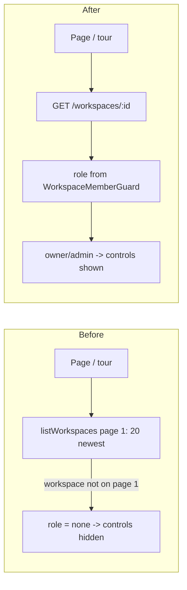

## Caller role from the workspace itself, not page 1 of the workspace list

TL;DR: Ten workspace pages and the onboarding tour work out "is this person an owner/admin here?" by looking the workspace up in the first page (20 newest) of the person's workspace list. If the workspace is older than that, it is not found, so a real owner looks like a guest and loses the upload / Add vendor buttons. It is like checking a guest list by reading only page one. The fix: the "get this workspace" API answer will also say the caller's role (the server already knows it, from the access check it runs on every request), and every page plus the tour reads the role from there.

### Flowchart (high-level)



### Task metadata

- Classification: `BUG_FIX` · `Deep` · Workspaces / RBAC (FE pages + `getOne`) · Deep (`docs/ai/risk-register.md` Workspaces / RBAC row)
- Contract areas: API — `GET /workspaces/:workspaceId` response gains `role` (additive). Database: No contract impact. Permissions: no change (server `RolesGuard` untouched; this only stops the UI hiding controls from real managers). External integrations: No contract impact. Jobs: No contract impact.
- Docs loaded: `planning.md, plan-template.md`
- Claims reversed while investigating: (1) "tour-provider is on main" — false, it exists only on local, unpushed `feat/no-ticket-onboarding-tour` (a250f36); `git grep roleOf origin/main` is empty. (2) "the members endpoint can supply the role" — false, `GET /workspaces/:id/members` is offset-paginated, same first-page flaw.
- Root cause: `listWorkspaces()` (`apps/web/src/lib/api/workspaces.ts`) returns page 1 only (`WorkspacesService.listForUser`, default `limit` 20, `createdAt DESC`); pages and `tour-provider.tsx#roleOf` `find()` the workspace in it. Disproved by: a user in ≤20 workspaces never hits it; the new Playwright spec with 21 workspaces fails today.
- Detected running model: Opus 5.5 (`claude-opus-5-5`)
- Recommended model: Opus 5.5, medium; confidence high. Fallback: Sonnet 5.5, high.
- Minimum capability: Sonnet-class — every edit is literal below; the fixture migration (Phase 4 step 13) needs careful per-test reading.
- Branch: `fix/no-ticket-workspace-caller-role`, from local `feat/no-ticket-onboarding-tour` (stacked, owner decision 2026-10-03)
- Release path: PR targets `feat/no-ticket-onboarding-tour`, retargeted to `main` after the tour merges (`docs/ai/handoff.md` "Release flow"). Blocker for opening the PR (not for coding): the tour branch is not on `origin`; it must be pushed by its owner session first.
- Required skills: `/review`, `/qa-only` after implementation
- Execution preflight: `git fetch origin`; `scripts/new-task-worktree.sh fix workspace-caller-role feat/no-ticket-onboarding-tour`; in the worktree `nvm use`, `bun install --frozen-lockfile`, `cp ../../../.env .env`, `export TDD_RED_BASE=feat/no-ticket-onboarding-tour`

### Layer 1 — human summary

The server already looks up "is this user a member, and with which role?" before it answers any workspace request (`WorkspaceMemberGuard` stores it on the request). Today it throws that answer away for `GET /workspaces/:id`. We hand it back as `role`. Each page already asks for the workspace in the same batch of requests, so the pages simply read `role` from that answer and stop asking for the workspace list. One small shared helper (`membershipFrom`) turns the answer into `{id, role}` or "no role" — and "no role" keeps the manage buttons hidden (safe default). The tour reads the same thing, so it still agrees with the pages. Bonus: each page makes one fewer request.

Rejected simpler option: follow `nextCursor` through every page of `listWorkspaces()` — still O(workspaces) requests per page load, and still a copy-pasted lookup in 11 places. Rejected: raise the list `limit` — moves the cliff from 20 to 100.

**Risk Matrix**

| Risk | Likelihood | Impact | Mitigation | Rollback |
|---|---|---|---|---|
| Web deployed before API → `role` missing → controls hidden for everyone | Low (one compose deploy ships both) | Medium | `membershipFrom` fails closed; API + web ship in one PR/deploy | Revert merge commit |
| A missed page still reads `listWorkspaces` for role | Low | Low (old behaviour) | Acceptance grep in Validation: zero `listWorkspaces` in `apps/web/app/workspaces/[id]/**` and `tour-provider.tsx` | n/a |
| Fixture migration flips a test's role and hides a regression | Medium | Medium | Rule in Phase 4 step 13 + same test count before/after + every existing title still passes | Revert spec |
| Role leaks across workspaces | None | — | `role` comes from guard row filtered by `workspaceId` AND `userId` | — |

**Backward Compatibility Matrix**

Usage search: `git grep -n "getWorkspace(\|listWorkspaces\|/workspaces/\${" feat/no-ticket-onboarding-tour -- apps packages` (graphify not used: user directed grep; literal call-site strings).

| Changed File / Symbol | Used By (outside this feature) | Breaks? | Handling |
|---|---|---|---|
| `WorkspacesController#getOne` response (+`role`) | BFF `apps/web/app/api/workspaces/[id]/route.ts` (pass-through); `workspace-nav.tsx` / switcher if they call `getWorkspace` | No — extra field | affected, NOT modified |
| `WorkspacesService#getOne` | `update()` callers none; unchanged | No | NOT modified |
| `listWorkspaces` | `apps/web/app/workspaces/page.tsx` (cursor paging), `apps/web/app/chat/page.tsx` (picks a workspace) | No | NOT modified |
| `packages/types` `Workspace` | api/ai via jest moduleNameMapper | No — new types added, `Workspace` unchanged | additive |

### Layer 2 — execution spec

All phases: Opus 5.5, medium → continue without stops.

#### Phase 1 — Lock contract (Opus 5.5, medium)

1. `packages/types/src/index.ts`
Old:
```ts
export interface Workspace {
  id: string
  name: string
  ownerId: string
  createdAt: Date
}
```
New:
```ts
export interface Workspace {
  id: string
  name: string
  ownerId: string
  createdAt: Date
}

export type WorkspaceRole = 'owner' | 'admin' | 'member'

/** GET /workspaces/:workspaceId — the workspace plus the caller's role in it. */
export interface WorkspaceDetail extends Workspace {
  role: WorkspaceRole
}
```
2. `docs/ai/contracts/api-contracts.md` row `| Workspaces | Get One | GET |` — replace cell `` `{id, name, ownerId, createdAt}` | Member only `` with `` `{id, name, ownerId, createdAt, role}` (`WorkspaceDetail`; `role` = caller's `owner\|admin\|member` from `WorkspaceMemberGuard`) | Member only ``, and append to its last cell: ` 2026-10-03: `role` added so pages and the onboarding tour never derive the caller's role from page 1 of `/workspaces/me` (fix/no-ticket-workspace-caller-role).`

Done: `bun run type-check` passes.

#### Phase 2 — RED (Opus 5.5, medium)

3. New `apps/api/src/workspaces/workspaces.controller.spec.ts`:
```ts
import { NotFoundException } from '@nestjs/common'
import { WorkspacesController } from './workspaces.controller'
import type { WorkspacesService } from './workspaces.service'

// GET /workspaces/:workspaceId hands back the caller's role, read from the
// WorkspaceMemberGuard context, so the web never derives it from page 1 of
// the paginated /workspaces/me list.

const row = { id: 'ws-1', name: 'Acme', ownerId: 'user-1', createdAt: new Date('2026-01-01T00:00:00.000Z') }

function controllerWith(getOne: jest.Mock) {
  return new WorkspacesController({ getOne } as unknown as WorkspacesService)
}

describe('WorkspacesController getOne', () => {
  it('error: a missing workspace still surfaces the NotFoundException', async () => {
    const controller = controllerWith(jest.fn().mockRejectedValue(new NotFoundException('Workspace not found')))

    await expect(controller.getOne('ws-1', { workspaceId: 'ws-1', role: 'owner' })).rejects.toBeInstanceOf(
      NotFoundException,
    )
  })

  it.each(['owner', 'admin', 'member'] as const)(
    'regression: returns the workspace with the caller role %s from the member context',
    async (role) => {
      const getOne = jest.fn().mockResolvedValue(row)
      const controller = controllerWith(getOne)

      await expect(controller.getOne('ws-1', { workspaceId: 'ws-1', role })).resolves.toEqual({ ...row, role })
      expect(getOne).toHaveBeenCalledWith('ws-1')
    },
  )
})
```
4. New `apps/web/src/lib/workspace-role.spec.ts`:
```ts
import { describe, expect, it } from 'vitest'
import { membershipFrom } from './workspace-role'

describe('membershipFrom', () => {
  it('error: null, undefined and non-object responses are no membership', () => {
    expect(membershipFrom(null)).toBeNull()
    expect(membershipFrom(undefined)).toBeNull()
    expect(membershipFrom('ws-1')).toBeNull()
  })

  it('error: a role outside owner/admin/member is no membership, so manage controls stay hidden', () => {
    expect(membershipFrom({ id: 'ws-1', role: 'superadmin' })).toBeNull()
    expect(membershipFrom({ id: 'ws-1', role: 1 })).toBeNull()
  })

  it('edge: a workspace answer without role (API older than this change) is no membership', () => {
    expect(membershipFrom({ id: 'ws-1', name: 'Acme' })).toBeNull()
  })

  it('edge: an answer without a string id is no membership', () => {
    expect(membershipFrom({ role: 'owner' })).toBeNull()
  })

  it('happy: returns id and role for each known role', () => {
    for (const role of ['owner', 'admin', 'member'] as const) {
      expect(membershipFrom({ id: 'ws-1', name: 'Acme', role })).toEqual({ id: 'ws-1', role })
    }
  })
})
```
5. `apps/web/app/workspaces/[id]/procurement/page.spec.ts` — insert before `  it('uploads a purchase order and shows a success toast after refreshing the list', async () => {`:
```ts
  it('regression: an owner whose workspace is not on page 1 of listWorkspaces still gets the upload control', async () => {
    getWorkspaceMock.mockResolvedValue({ id: 'ws-1', name: 'Acme', role: 'owner' })
    listWorkspacesMock.mockResolvedValue({ items: [{ id: 'ws-other', role: 'owner' }], nextCursor: 'page-2' })
    listPurchaseOrdersMock.mockResolvedValue([])
    listInvoicesMock.mockResolvedValue([])

    renderPage()

    await screen.findByText('No purchase orders yet')
    expect(document.querySelector('input[type="file"]')).not.toBeNull()
  })

```
6. `apps/web/src/components/tour/tour-provider.spec.tsx` (literal edits):
- Old `  listWorkspaces: vi.fn(),` → New `  getWorkspace: vi.fn(),`
- Old `vi.mock('@/lib/api/workspaces', () => ({ listWorkspaces: mocks.listWorkspaces }))` → New `vi.mock('@/lib/api/workspaces', () => ({ getWorkspace: mocks.getWorkspace }))`
- Old `  mocks.listWorkspaces.mockReset().mockResolvedValue({ items: [{ id: 'ws-1', name: 'W', role: 'owner' }] })` → New `  mocks.getWorkspace.mockReset().mockResolvedValue({ id: 'ws-1', name: 'W', role: 'owner' })`
- Old:
```ts
  it('error: listWorkspaces rejecting does not auto-start either', async () => {
    mocks.listWorkspaces.mockRejectedValue(new Error('500'))

    renderProvider()

    await waitFor(() => expect(mocks.listWorkspaces).toHaveBeenCalled())
```
New:
```ts
  it('error: getWorkspace rejecting does not auto-start either', async () => {
    mocks.getWorkspace.mockRejectedValue(new Error('500'))

    renderProvider()

    await waitFor(() => expect(mocks.getWorkspace).toHaveBeenCalledWith('ws-1'))
```
- Old `      expect(mocks.listWorkspaces).not.toHaveBeenCalled()` → New `      expect(mocks.getWorkspace).not.toHaveBeenCalled()`
- Old:
```ts
  it('regression: the member role is read from listWorkspaces (member gets center upload step)', async () => {
    mocks.listWorkspaces.mockResolvedValue({ items: [{ id: 'ws-1', name: 'W', role: 'member' }] })
```
New:
```ts
  it('regression: the member role is read from getWorkspace (member gets center upload step)', async () => {
    mocks.getWorkspace.mockResolvedValue({ id: 'ws-1', name: 'W', role: 'member' })
```

7. Run `bun run tdd:red` (with `TDD_RED_BASE`). Expected RED: controller spec (getOne returns row without `role`), `workspace-role.spec.ts` (module missing), procurement regression (no file input), tour spec (provider calls unmocked `listWorkspaces` → no start). Commit `test(workspaces): caller role must come from GET /workspaces/:id, not page 1 of the list`.

Done: `tdd:red` marker written; failures are the ones above.

#### Phase 3 — API (Opus 5.5, medium)

8. `apps/api/src/workspaces/workspaces.controller.ts`
Old:
```ts
import { CurrentUser, type CurrentUserContext } from '../auth/decorators/current-user.decorator'
```
New:
```ts
import { CurrentUser, type CurrentUserContext } from '../auth/decorators/current-user.decorator'
import { CurrentWorkspaceMember } from '../auth/decorators/current-workspace-member.decorator'
```
Old:
```ts
import { WorkspaceMemberGuard } from '../auth/guards/workspace-member.guard'
```
New:
```ts
import { WorkspaceMemberGuard, type WorkspaceMemberContext } from '../auth/guards/workspace-member.guard'
```
Old:
```ts
  @Get(':workspaceId')
  @UseGuards(JwtAuthGuard, WorkspaceMemberGuard)
  getOne(@Param('workspaceId') workspaceId: string) {
    return this.workspacesService.getOne(workspaceId)
  }
```
New:
```ts
  @Get(':workspaceId')
  @UseGuards(JwtAuthGuard, WorkspaceMemberGuard)
  async getOne(
    @Param('workspaceId') workspaceId: string,
    @CurrentWorkspaceMember() member: WorkspaceMemberContext,
  ) {
    // The caller's role travels with the workspace (already loaded by the
    // guard), so pages never derive it from page 1 of /workspaces/me.
    return { ...(await this.workspacesService.getOne(workspaceId)), role: member.role }
  }
```
9. `apps/api/test/workspaces.e2e-spec.ts` — in the first test, insert after `    expect(membersAsMember.body.items.find((m: any) => m.email === memberEmail)?.role).toBe('member')`:
```ts

    const teamAsOwner = await request(app.getHttpServer())
      .get(`/workspaces/${teamWorkspaceId}`)
      .set('Authorization', `Bearer ${owner.accessToken}`)
      .expect(200)
    expect(teamAsOwner.body).toMatchObject({ id: teamWorkspaceId, name: 'Team', role: 'owner' })

    const teamAsMember = await request(app.getHttpServer())
      .get(`/workspaces/${teamWorkspaceId}`)
      .set('Authorization', `Bearer ${member.accessToken}`)
      .expect(200)
    expect(teamAsMember.body).toMatchObject({ id: teamWorkspaceId, role: 'member' })

    await request(app.getHttpServer())
      .get('/workspaces/not-a-uuid')
      .set('Authorization', `Bearer ${owner.accessToken}`)
      .expect(403)
```
In the rename test, insert after the `.where(and(eq(workspaceMembers.workspaceId, workspaceId), eq(workspaceMembers.userId, admin.user.id)))` line:
```ts

    const asAdmin = await request(app.getHttpServer())
      .get(`/workspaces/${workspaceId}`)
      .set('Authorization', `Bearer ${admin.accessToken}`)
      .expect(200)
    expect(asAdmin.body.role).toBe('admin')
```
(No new registrations: `/auth/register` throttle budget of 5 is already spent by this file — see its existing comment. Non-member 403 is already asserted.)

Done: `cd apps/api && bun run test` green incl. new spec.

#### Phase 4 — Web (Opus 5.5, medium)

10. New `apps/web/src/lib/workspace-role.ts`:
```ts
export type WorkspaceRole = 'owner' | 'admin' | 'member'
export type WorkspaceMembership = { id: string; role: WorkspaceRole }

const ROLES: readonly string[] = ['owner', 'admin', 'member']

// The caller's role in one workspace, read from GET /workspaces/:id (`role`,
// set from WorkspaceMemberGuard; packages/types WorkspaceDetail). Never from
// listWorkspaces(): that is page 1 of a paginated list and need not hold this
// workspace. Anything unrecognised is no membership, so manage controls stay
// hidden; the API enforces RolesGuard either way.
export function membershipFrom(workspace: unknown): WorkspaceMembership | null {
  if (typeof workspace !== 'object' || workspace === null) return null
  const { id, role } = workspace as { id?: unknown; role?: unknown }
  if (typeof id !== 'string' || typeof role !== 'string' || !ROLES.includes(role)) return null
  return { id, role: role as WorkspaceRole }
}
```
Reuse check: no existing role helper in `apps/web/src/lib/` (listing: `auth`, `format-date`, `landing-*`, `legal-facts`, `api/`, `http/`, `ui/`). `apps/web` has no `@repo/types` dependency; adding it is a new dependency → declined, local type mirrors `WorkspaceDetail`.

11. Pages — identical three-part edit in each (`P` = page file under `apps/web/app/workspaces/`):
   (a) import line Old → New;
   (b) remove `listWorkspaces(),` from the `Promise.all` array and the `memberships` binding from its destructure;
   (c) replace the two `membershipItems` lines with one line.

| P | (a) Old → New import | (b) Old destructure → New | (c) Old two lines → New line |
|---|---|---|---|
| `[id]/procurement/page.tsx` | `import { getWorkspace, listWorkspaces } from '@/lib/api/workspaces'` → `import { getWorkspace } from '@/lib/api/workspaces'` + new line `import { membershipFrom } from '@/lib/workspace-role'` | `const [workspaceData, pos, invs, grns, memberships] = await Promise.all([` → `const [workspaceData, pos, invs, grns] = await Promise.all([`; delete line `        listWorkspaces(),` | `      const membershipItems = Array.isArray(memberships?.items) ? memberships.items : []` + `      setMembership(membershipItems.find((entry: WorkspaceMembership) => entry.id === workspaceId) ?? null)` → `      setMembership(membershipFrom(workspaceData))` |
| `[id]/vendors/page.tsx` | same as procurement | `const [workspaceData, vendorData, memberships] = await Promise.all([` → `const [workspaceData, vendorData] = await Promise.all([`; delete `        listWorkspaces(),` | same |
| `[id]/vendors/[vendorId]/page.tsx` | same | `const [workspaceData, vendorData, catalogData, memberships, historyData, summaryData] = await Promise.all([` → `const [workspaceData, vendorData, catalogData, historyData, summaryData] = await Promise.all([`; delete `        listWorkspaces(),` | same |
| `[id]/knowledge-bases/page.tsx` | same | `const [workspaceData, kbData, memberships] = await Promise.all([` → `const [workspaceData, kbData] = await Promise.all([`; delete `        listWorkspaces(),` | same |
| `[id]/catalog-matches/page.tsx` | same | `const [workspaceData, memberships, vendorList, matchList] = await Promise.all([` → `const [workspaceData, vendorList, matchList] = await Promise.all([`; delete `        listWorkspaces(),` | same |
| `[id]/discrepancies/page.tsx` | same | `const [workspaceData, flagsData, memberships] = await Promise.all([` → `const [workspaceData, flagsData] = await Promise.all([`; delete `        listWorkspaces(),` | same |
| `[id]/members/page.tsx` | `import { getWorkspace, inviteMember, listMembers, listWorkspaces, removeMember } from '@/lib/api/workspaces'` → `import { getWorkspace, inviteMember, listMembers, removeMember } from '@/lib/api/workspaces'` + `import { membershipFrom } from '@/lib/workspace-role'` | `const [workspaceData, memberships, currentUser] = await Promise.all([` → `const [workspaceData, currentUser] = await Promise.all([`; delete `        listWorkspaces(),` | same |
| `[id]/page.tsx` | same as procurement | `const [workspaceData, memberships, eventData, unread] = await Promise.all([` → `const [workspaceData, eventData, unread] = await Promise.all([`; delete `        listWorkspaces(),` | same |

Every page keeps its local `WorkspaceMembership` type and its `canManage` line (structurally identical to the helper's type; no other line changes).

12. Special cases:
- `[id]/settings/page.tsx`: import `import { getWorkspace, listWorkspaces, updateWorkspace } from '@/lib/api/workspaces'` → `import { getWorkspace, updateWorkspace } from '@/lib/api/workspaces'` + `import { membershipFrom } from '@/lib/workspace-role'`. Old:
```ts
        const [workspaceData, memberships] = await Promise.all([
          getWorkspace(workspaceId),
          listWorkspaces(),
        ])
        setWorkspace(workspaceData)
        reset({ name: workspaceData?.name ?? '' })

        const membershipItems = Array.isArray(memberships?.items) ? memberships.items : []
        const membership = membershipItems.find(
          (entry: WorkspaceMembership) => entry.id === workspaceId,
        )
        setRole(membership?.role ?? null)
```
New:
```ts
        const workspaceData = await getWorkspace(workspaceId)
        setWorkspace(workspaceData)
        reset({ name: workspaceData?.name ?? '' })
        setRole(membershipFrom(workspaceData)?.role ?? null)
```
- `[id]/knowledge-bases/[kbId]/page.tsx`: import `import { getWorkspace, listWorkspaces } from "@/lib/api/workspaces";` → `import { getWorkspace } from "@/lib/api/workspaces";` + `import { membershipFrom } from "@/lib/workspace-role";`. Delete the whole `const loadMembership = React.useCallback(async () => { … }, [router, workspaceId]);` block (lines from `  const loadMembership = React.useCallback(async () => {` through its closing `  }, [router, workspaceId]);` and the blank line after). In the effect, Old:
```ts
      loadDocuments(),
      loadMembership(),
      loadScrapeRuns(),
      getWorkspace(workspaceId)
        .then((data) => {
          setWorkspace(data);
        })
```
New:
```ts
      loadDocuments(),
      loadScrapeRuns(),
      getWorkspace(workspaceId)
        .then((data) => {
          setWorkspace(data);
          setMembership(membershipFrom(data));
        })
```
and Old `  }, [loadDocuments, loadMembership, loadScrapeRuns, router, workspaceId]);` → New `  }, [loadDocuments, loadScrapeRuns, router, workspaceId]);`
- `apps/web/src/components/tour/tour-provider.tsx`: Old `import { listWorkspaces } from '@/lib/api/workspaces'` → New `import { getWorkspace } from '@/lib/api/workspaces'` + `import { membershipFrom } from '@/lib/workspace-role'`. Delete the `function roleOf(response: unknown, workspaceId: string): string | null { … }` block and its trailing blank line. Old:
```ts
    void Promise.all([getCurrentUser(), listWorkspaces()])
      .then(([user, workspaces]) => {
        if (cancelled || !user?.userId) return
        const role = roleOf(workspaces, workspaceId)
```
New:
```ts
    // Same role source as the pages (GET /workspaces/:id), so the tour's
    // manager steps always agree with the controls on screen.
    void Promise.all([getCurrentUser(), getWorkspace(workspaceId)])
      .then(([user, workspace]) => {
        if (cancelled || !user?.userId) return
        const role = membershipFrom(workspace)?.role ?? null
```

13. Fixture migration in the page specs whose page no longer calls `listWorkspaces` (`[id]/{page,procurement,vendors,vendors/[vendorId],knowledge-bases,knowledge-bases/[kbId],catalog-matches,discrepancies,members,settings}/page.spec.ts`). Declared deviation from the literal-block rule: ~170 mechanical lines; one rule, applied per test: **the role a test gives `ws-1` in its `listWorkspacesMock` value is moved, unchanged, into that same test's `getWorkspaceMock` value as `role: '<same>'`** (default/`beforeEach` mocks included; `mockResolvedValueOnce` sequences map one-to-one). Then delete every `listWorkspacesMock` line, its `const`, its `mockReset`, and its key in the `vi.mock('@/lib/api/workspaces', …)` factory — except the Phase 2 regression test, which keeps its `listWorkspacesMock` line to prove the list is ignored (so procurement keeps the mock declaration). No assertion line changes. Check: test count per file identical before/after (`bunx vitest run <file> --reporter=json`), all green.

Done: `cd apps/web && bun run test` green; `git grep -n "listWorkspaces" -- 'apps/web/app/workspaces/[[]id]' apps/web/src/components/tour` returns only the procurement regression spec lines.

#### Phase 5 — Browser e2e + docs + closeout (Opus 5.5, medium)

14. `apps/e2e/support/db.ts` — insert after the `addMember` function:
```ts

/** Moves a workspace to the bottom of `/workspaces/me` (newest first). */
export async function backdateWorkspace(workspaceId: string): Promise<void> {
  await db().query(`update workspaces set created_at = now() - interval '30 days' where id = $1`, [workspaceId])
}
```
15. New `apps/e2e/tests/workspace-caller-role.spec.ts`:
```ts
import { expect, test, type Browser, type Page } from '@playwright/test'
import { addMember, backdateWorkspace, closeDb, seedUser, seedWorkspace } from '../support/db'
import { loadState, type SeedState } from '../support/state'

// The caller's role comes from GET /workspaces/:id, not from page 1 of the
// paginated /workspaces list (20 newest). Someone in 21 workspaces opening the
// oldest must still get exactly the controls their role allows.

const PASSWORD = 'e2e-Password-1'
const NEWER_WORKSPACES = 20

let state: SeedState
test.beforeAll(() => {
  state = loadState()
})
test.afterAll(closeDb)

async function crowdedUser(label: string, role: 'owner' | 'admin' | 'member') {
  const email = `${state.run}-${label}@e2e.test`
  const userId = await seedUser({ email, password: PASSWORD })
  const ownerId = role === 'owner' ? userId : await seedUser({ email: `${state.run}-${label}-owner@e2e.test`, password: PASSWORD })
  const workspaceId = await seedWorkspace(ownerId, `Oldest ${label}`)
  if (role !== 'owner') await addMember(workspaceId, userId, role)
  await backdateWorkspace(workspaceId)
  for (let i = 0; i < NEWER_WORKSPACES; i++) await seedWorkspace(userId, `Newer ${label} ${i}`)
  return { email, userId, workspaceId }
}

async function signIn(browser: Browser, user: { email: string; userId: string }, address: string): Promise<Page> {
  const context = await browser.newContext({ extraHTTPHeaders: { 'X-Forwarded-For': address } })
  // Tour marked done so its overlay does not cover the controls under test.
  await context.addInitScript(
    ([key, value]) => window.localStorage.setItem(key, value),
    [`optra.tour.v1:${user.userId}`, JSON.stringify({ status: 'completed', at: new Date().toISOString() })] as const,
  )
  const page = await context.newPage()
  await page.goto('/login')
  await page.locator('#email').fill(user.email)
  await page.locator('#password').fill(PASSWORD)
  await page.getByRole('button', { name: 'Sign in' }).click()
  await expect(page).toHaveURL(/\/workspaces\/[^/]+\//)
  return page
}

test('error: a member of the oldest of 21 workspaces gets the Member badge and no Add vendor', async ({ browser }) => {
  const user = await crowdedUser('role-member', 'member')
  const page = await signIn(browser, user, '203.0.113.50')
  await page.goto(`/workspaces/${user.workspaceId}/vendors`)
  await expect(page.getByText('Member', { exact: true })).toBeVisible()
  await expect(page.getByRole('button', { name: 'Add vendor' })).toHaveCount(0)
  await page.context().close()
})

test('regression: an owner of the oldest of 21 workspaces gets the Owner badge and Add vendor', async ({ browser }) => {
  const user = await crowdedUser('role-owner', 'owner')
  const page = await signIn(browser, user, '203.0.113.51')
  await page.goto(`/workspaces/${user.workspaceId}/vendors`)
  await expect(page.getByText('Owner', { exact: true })).toBeVisible()
  await expect(page.getByRole('button', { name: 'Add vendor' }).first()).toBeVisible()
  await page.context().close()
})

test('regression: an admin of the oldest of 21 workspaces gets the Admin badge and Add vendor', async ({ browser }) => {
  const user = await crowdedUser('role-admin', 'admin')
  const page = await signIn(browser, user, '203.0.113.52')
  await page.goto(`/workspaces/${user.workspaceId}/vendors`)
  await expect(page.getByText('Admin', { exact: true })).toBeVisible()
  await expect(page.getByRole('button', { name: 'Add vendor' }).first()).toBeVisible()
  await page.context().close()
})
```
16. Docs (same change):
- `docs/ai/file-index/repository-map.md`: row `apps/web/app/workspaces/[id]/page.tsx` — Old cell `Derives caller role from \`listWorkspaces()\` to hide owner/admin controls when known` → New `Reads caller role from \`getWorkspace()\` (\`role\`) via \`membershipFrom\` to hide owner/admin controls`. `TourProvider` row — Old `Loads \`getCurrentUser()\` + \`listWorkspaces()\` once per workspace` → New `Loads \`getCurrentUser()\` + \`getWorkspace(workspaceId)\` once per workspace (role via \`membershipFrom\`)`. Add row after `format-date.ts`: `| \`apps/web/src/lib/workspace-role.ts\` | \`membershipFrom(workspace)\` → \`{id, role}\` or \`null\` (fail closed) from the \`GET /workspaces/:id\` answer | Web UI | Deep | Added 2026-10-03. The one caller-role source for every \`/workspaces/[id]/**\` page and \`TourProvider\`; never \`listWorkspaces()\` (paginated). Spec \`workspace-role.spec.ts\`. |`. Controller row: append ` \`GET :workspaceId\` returns \`role\` from \`@CurrentWorkspaceMember()\` (2026-10-03).`
- `docs/ai/testing-strategy.md` Playwright inventory row: `17 (` → `18 (` and after `\`onboarding-tour.spec.ts\` added;` insert ` 2026-10-03 \`workspace-caller-role.spec.ts\` added;`.
- `learnings.md`: one entry (pattern: per-resource caller role travels with the resource; never derive from a paginated list), Predicted line from this plan: "pages had copy-pasted a first-page lookup".
- `docs/plans/workspace-caller-role.md`: this approved plan.
17. Graphify closeout per `docs/ai/planning.md` "Closeout refresh".

### Validation and acceptance

**Test Matrix**

| Layer | Required | File | Cases |
|---|---|---|---|
| unit (api) | yes | `apps/api/src/workspaces/workspaces.controller.spec.ts` | error: NotFound passes through; regression: role owner/admin/member returned |
| unit (web) | yes | `apps/web/src/lib/workspace-role.spec.ts`; `procurement/page.spec.ts`; `tour-provider.spec.tsx` | error: null/non-object, unknown role; edge: no role, no id; regression: off-page owner gets upload input; tour member/owner from `getWorkspace`, getWorkspace reject → no start; happy: known roles |
| API e2e | yes | `apps/api/test/workspaces.e2e-spec.ts` | owner/member/admin `role` on getOne; malformed id 403; non-member 403 (existing) |
| browser e2e | yes | `apps/e2e/tests/workspace-caller-role.spec.ts` | error: member hidden; regression: owner, admin shown — all on oldest of 21 |

Acceptance map:
- Owner/admin of a workspace off page 1 sees manage controls → pages (step 11/12) → `membershipFrom` (step 10) → Playwright regression + procurement spec.
- Tour agrees with pages → `tour-provider.tsx` (step 12) → tour spec regression.
- API returns caller role, scoped → `getOne` (step 8) → controller spec + API e2e.
- Fail closed → `membershipFrom` → helper spec error/edge.

Edge/error cases handled: missing/unknown role → `membershipFrom` returns `null` (`workspace-role.ts`); non-member/malformed id → `WorkspaceMemberGuard` 403 (unchanged); workspace deleted → `WorkspacesService#getOne` 404 (unchanged; pages' existing catch paths).

Run: `bun run type-check`, `bun run lint`, `cd apps/api && bun run test && bun run test:e2e` (fresh `optra_e2e`), `cd apps/web && bun run test`, `bun run e2e`, `bun run tdd:gate`, `sh scripts/check-test-layers.sh feat/no-ticket-onboarding-tour`.
Greps: `git grep -n "listWorkspaces" -- 'apps/web/app/workspaces/[[]id]/*.tsx' 'apps/web/app/workspaces/[[]id]/**/*.tsx' apps/web/src/components/tour/tour-provider.tsx` → empty.

### Compatibility, docs and scans

- Behaviour preserved: `/workspaces/me` unchanged (API e2e paging asserts stay); `getOne` fields unchanged plus `role`; UI for users with ≤20 workspaces identical (all existing page specs pass with migrated fixtures). No migration.
- Docs: step 16.
- Optimisation scan: removes one `/api/workspaces` request per page load and per tour start; `getOne` adds zero queries (role already loaded by guard).
- Cache scan: not worth it, left as-is.
- DB / LLM cost: DB round-trips −1 per page load; no LLM path.
- UI states: loading/empty/error unchanged; role badge renders only after `getWorkspace` resolves (as today).
